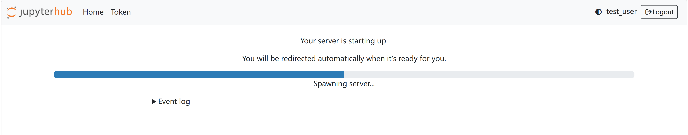
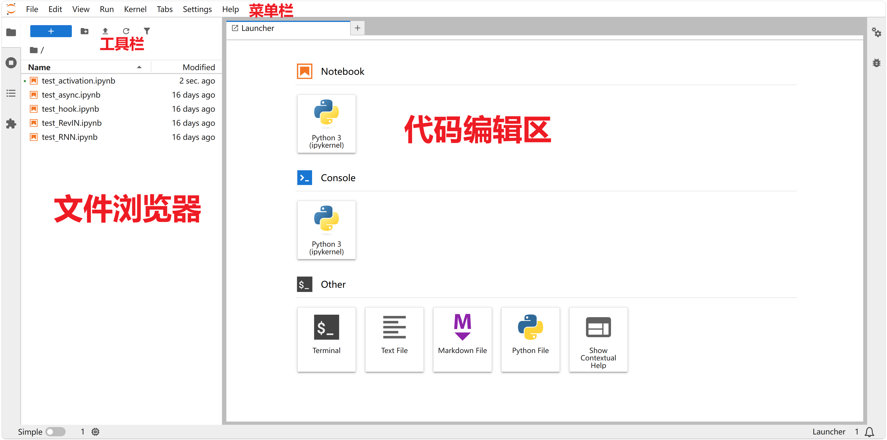
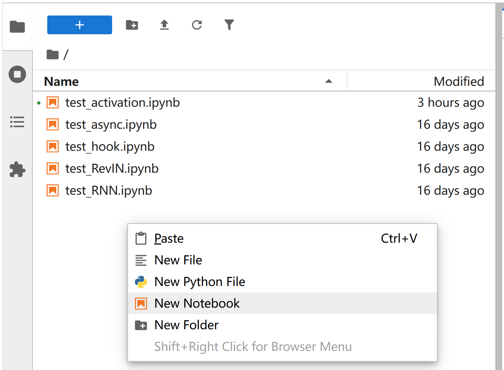
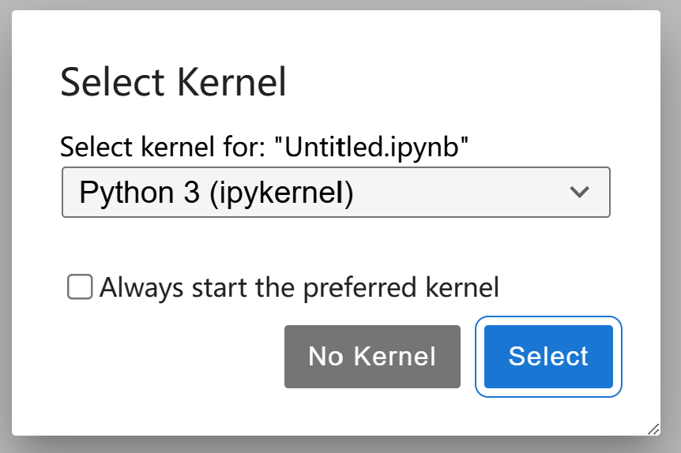
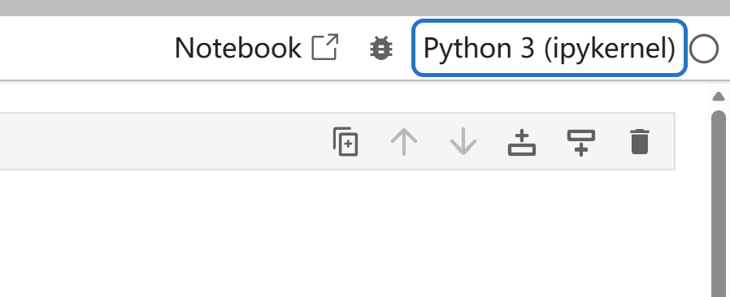
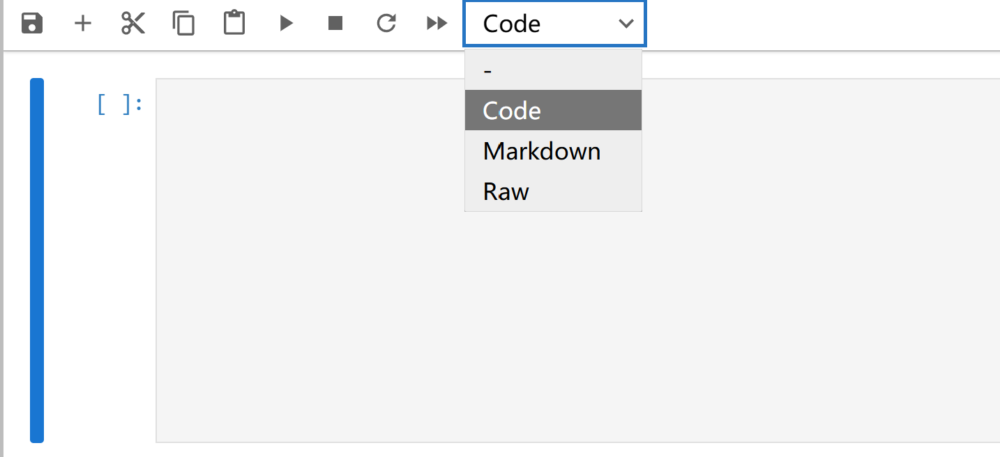
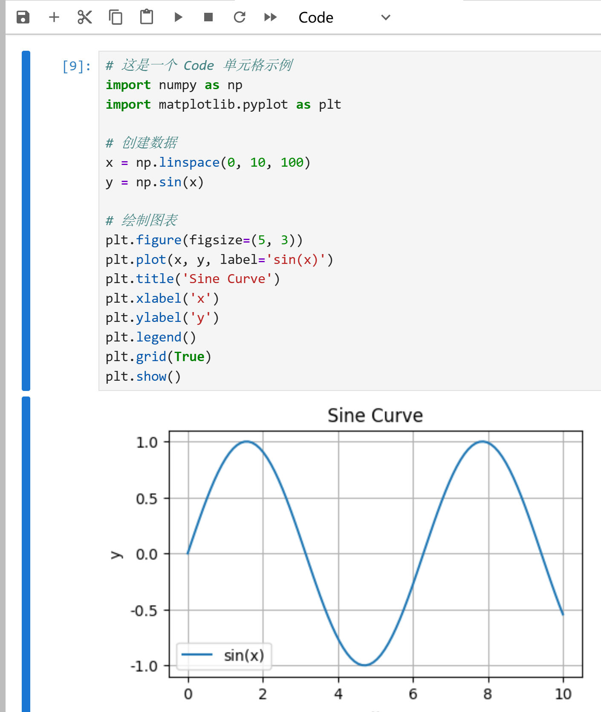
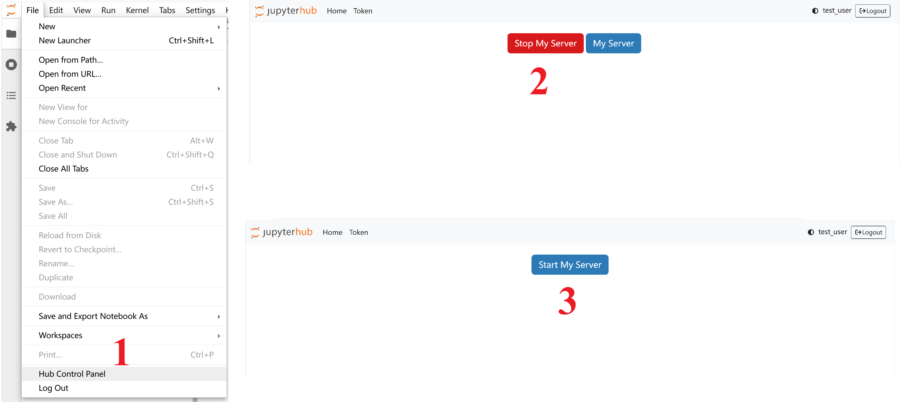
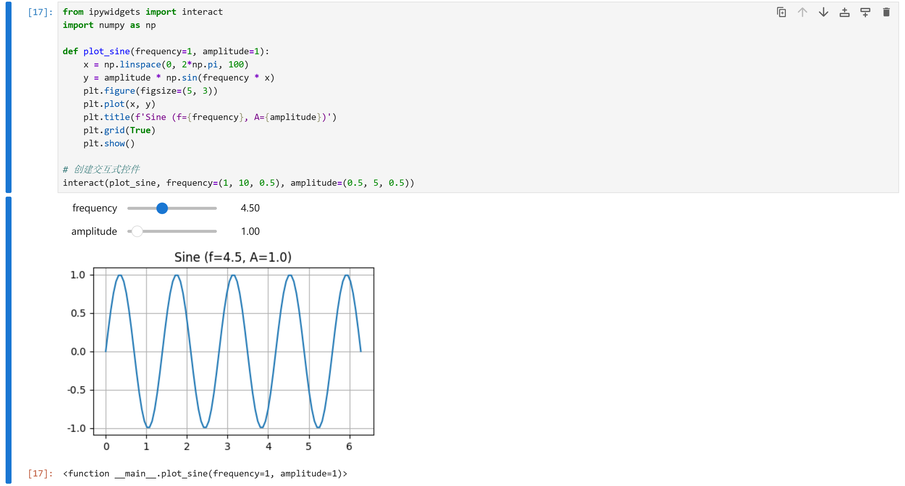

# JupyterHub 使用指南

## 什么是 JupyterHub

JupyterHub 是一个多用户版本的 Jupyter Notebook，允许多个用户同时在独立的 Jupyter Notebook 服务器中工作。它提供了一个集中的 Web 界面，让用户可以访问和管理自己的计算环境，同时为管理员提供了用户管理、认证和资源配额控制等功能。

JupyterHub 特别适合以下场景：

- 教育机构：为学生提供统一的编程和学习环境
- 数据科学团队：团队成员可以访问相同的工具和资源
- 研究机构：研究人员可以在共享基础设施上协作
- 企业培训：为新员工提供标准化的开发环境

## 注册账号

### 访问 JupyterHub

首先，通过浏览器访问 [JupyterHub 服务地址](http://expfluid.bond/jupyter)。


### 注册流程

1. **进入注册页面**
   在登录页面点击"Sign up"按钮，进入用户注册页面。

   

2. **填写用户信息**
   - 用户名：选择一个易于识别的用户名
   - 密码：设置强密码，建议包含大小写字母、数字和特殊字符
   - 确认密码：再次输入密码以确保无误

3. **完成注册**
   点击"Create User"按钮提交信息。

## 登录 JupyterHub

### 使用凭证登录

1. 在登录页面输入您的用户名和密码
2. 点击"Log in"按钮
3. 系统验证成功后，将为您启动一个独立的 Jupyter Notebook 服务器



## JupyterHub 界面介绍

### 主界面布局

登录成功后，您将看到 JupyterHub 的主界面，主要包括：

- **文件浏览器**：左侧显示当前工作目录的文件和文件夹
- **菜单栏**：顶部包含文件、编辑、视图、插入等菜单
- **工具栏**：提供常用操作的快捷按钮
- **代码编辑区**：中间区域用于创建和编辑 Notebook



## 创建和管理 Notebook

### 创建新 Notebook

1. 在文件浏览器中右键点击，选择"New Notebook"
2. 系统将创建一个新的 Notebook 文件(.ipynb)
3. 选择要使用的 Kernel(稍后详细介绍)



### 保存和重命名

- **保存**：使用快捷键 `Ctrl+S` 或点击保存按钮
- **重命名**：点击文件名，输入新名称后按回车

### 关于 .ipynb 文件

JupyterHub Notebook 的文件使用 `.ipynb` 作为文件后缀名，这是 "IPython Notebook" 的缩写。

#### .ipynb 文件的特点

`.ipynb` 文件实际上是一个 **JSON 格式** 的文本文件，它最显著的特点是：

**1. 分块存储**

- 笔记本由一块一块的"单元格"组成
- 每个单元格可以是代码、文本或原始内容
- 就像积木一样，可以自由添加、删除和调整顺序

**2. 保存执行状态**

- 自动保存代码的运行结果
- 重新打开时能看到之前的输出
- 可以追踪代码的执行顺序

**3. 便携共享**

- `.ipynb` 文件可以在任何支持 Jupyter 的环境中打开
- 方便在不同设备、不同团队之间分享
- 可以导出为 HTML、PDF 等格式

**重要理解**：把 `.ipynb` 文件想象成一个记事本，每一页就是一个单元格，可以在上面写代码或写说明，运行代码后结果会直接显示在同一页上。

## Kernel 选择和管理

### 什么是 Kernel

Kernel 是 Notebook 的计算引擎，负责执行代码单元格中的代码。JupyterHub 支持多种编程语言的 Kernel，如 Python、R、Julia 等。

#### 我们服务器的 Kernel 配置

我们的服务器部署了名为 `Python 3 (ipykernel)` 的 Kernel，该 Kernel 包含了大部分常用的 Python 科学计算包，包括但不限于：

- **数值计算**：`numpy`、`scipy`、`pandas`
- **数据可视化**：`matplotlib`、`seaborn`
- **机器学习**：`torch` (CPU 版本)、`scikit-learn`
- **其他常用库**：`requests`、`beautifulsoup4`、`tqdm` 等

⚠️ **重要提示**：

- 本服务器**不包含 GPU**，因此 `torch` 等 GPU 加速的库只能使用 CPU 进行计算
- 所有后续学习教程的代码都是基于 `Python 3 (ipykernel)` 这个 Kernel 开发和测试的
- 如果需要在 `Python 3 (ipykernel)` 中添加其他没有的 Python 包，请联系管理员 **WQX**

### 选择 Kernel

#### 创建时选择 Kernel

创建新 Notebook 时，可以从下拉菜单中选择可用的 Kernel：



#### 更改现有 Notebook 的 Kernel

如果需要更改现有 Notebook 的 Kernel：

1. 点击菜单栏的"Kernel"选项
2. 选择"Change kernel"或"更改内核"
3. 从列表中选择新的 Kernel



### 查看 Kernel 信息

查看当前 Notebook 使用的 Kernel 信息：

- 右上角显示当前 Kernel 状态
- 菜单"Kernel" → "About Kernel" 查看详细版本信息

### Kernel 操作

常用 Kernel 操作包括：

- **中断**：停止当前正在执行的代码单元格
- **重启**：重启 Kernel，清除所有变量
- **重启并运行所有**：重启 Kernel 并按顺序执行所有单元格
- **关闭**：关闭当前 Kernel，释放资源

## 运行代码

### 基本代码执行

#### 执行单个单元格

1. 点击要执行的代码单元格
2. 使用以下任一方法执行：
   - 点击工具栏的"运行"按钮
   - 使用快捷键 `Shift+Enter`(运行并跳转到下一个单元格)
   - 使用快捷键 `Ctrl+Enter`(运行并保持当前单元格)


#### 重启 Kernel 并运行所有单元格

清除所有变量并重新执行所有代码单元格：

- 菜单栏选择"Kernel" → "Restart Kernel and Run All Cells"
- 或使用工具栏的"Restart the kernel and run all cells"按钮


### 代码单元格类型

JupyterHub 支持多种单元格类型：

1. **Code 单元格**：编写和执行代码
   - 以 `In [ ]：` 标识
   - 支持语法高亮

2. **Markdown 单元格**：编写格式化文本
   - 支持 Markdown 语法
   - 双击可编辑，运行后显示渲染结果

3. **Raw 单元格**：原始文本，不执行也不渲染



### 输入输出示例

> 📁 **可运行示例代码**：本指南中的所有演示代码都可以在 `part1_basics/show_jupyter.ipynb` 中找到并直接运行。该 Notebook 包含了完整的可执行代码示例，方便您实际操作和练习。

```python
# 这是一个 Code 单元格示例
import numpy as np
import matplotlib.pyplot as plt

# 创建数据
x = np.linspace(0, 10, 100)
y = np.sin(x)

# 绘制图表
plt.figure(figsize=(5, 3))
plt.plot(x, y, label='sin(x)')
plt.title('Sine Cureve')
plt.xlabel('x')
plt.ylabel('y')
plt.legend()
plt.grid(True)
plt.show()
```

执行后会显示图表输出：



## 文件管理

### 文件上传

上传本地文件到 JupyterHub：

1. 点击"Upload"按钮
2. 选择要上传的文件
3. 文件将被复制到当前工作目录
4. 或者直接将文件拖拽上传区域

### 文件下载

下载 JupyterHub 中的文件：

1. 勾选要下载的文件
2. 点击"下载"按钮
3. 或右键文件选择"Download"

### 文件夹管理

- **创建文件夹**：点击"新建文件夹"按钮
- **重命名**：选中文件夹后点击重命名
- **删除**：选中文件夹后点击删除按钮


### 文件备份和重置

> 💡 **重要功能**：我们服务器为所有文件提供了备份功能，您可以放心地修改和实验文件！

**文件重置步骤**：

1. 删除需要重置的文件
2. 点击菜单栏的 "File" → "Hub Control Panel"
3. 在控制面板中点击 "Stop My Server" 停止服务器
4. 点击 "Start Server" 重新启动服务器
5. 系统会自动恢复被删除的原始文件



**_这个功能让您可以大胆地练习和实验，不用担心文件被破坏。如果需要恢复原始文件，只需按照上述步骤操作即可。_**

## 常用技巧

### 快捷键

JupyterHub 提供了丰富的快捷键，提高工作效率：

| 快捷键        | 功能                                   |
| ------------- | -------------------------------------- |
| `Shift+Enter` | 运行当前单元格并跳转到下一个           |
| `Ctrl+Enter`  | 运行当前单元格                         |
| `Alt+Enter`   | 运行当前单元格并在下方插入新单元格     |
| `A`           | 在上方插入新单元格(命令模式)           |
| `B`           | 在下方插入新单元格(命令模式)           |
| `DD`          | 删除当前单元格(命令模式)               |
| `M`           | 将单元格转换为 Markdown 类型(命令模式) |
| `Y`           | 将单元格转换为 Code 类型(命令模式)     |
| `Esc`         | 进入命令模式                           |
| `Enter`       | 进入编辑模式                           |

### 交互式可视化

使用交互式工具增强数据可视化：

```python
from ipywidgets import interact
import numpy as np

def plot_sine(frequency=1, amplitude=1)：
    x = np.linspace(0, 2*np.pi, 100)
    y = amplitude * np.sin(frequency * x)
    plt.figure(figsize=(10, 6))
    plt.plot(x, y)
    plt.title(f'Sine Function (f={frequency}, A={amplitude})')
    plt.grid(True)
    plt.show()

# 创建交互式控件
interact(plot_sine, frequency=(1, 10, 0.5), amplitude=(0.5, 5, 0.5))
```



## 常见问题

### Kernel 无法启动

如果 Kernel 无法启动，可能的原因和解决方案：

- 资源不足：联系管理员增加资源配额
- 环境损坏：尝试重新启动服务器
- 依赖缺失：安装所需的 Python 包

### 代码执行缓慢

优化代码性能：

- 使用向量化操作代替循环
- 避免重复计算
- 使用合适的数据结构
- 考虑使用更高效的库

### 文件丢失

定期备份重要文件：

- 下载 Notebook 到本地
- 使用版本控制工具(如 Git)
- 定期导出为其他格式(HTML、PDF)

## 最佳实践

1. **代码组织**：将相关代码分组，使用注释说明
2. **版本控制**：定期提交代码到版本控制系统
3. **文档编写**：使用 Markdown 单元格编写清晰的说明文档
4. **资源管理**：及时关闭不使用的 Kernel 和 Notebook
5. **协作共享**：分享 Notebook 时清除敏感输出和变量

## 导出格式

可以将 Notebook 导出为多种格式：

- HTML：在浏览器中查看
- PDF：打印或分享
- Python 纯代码：提取代码部分
- Markdown：转换为 Markdown 格式

---

通过本指南，您应该已经掌握了 JupyterHub 的基本使用方法，从注册登录到代码运行的完整流程。继续探索更多功能，提高您的工作效率!
