# Python 入门教程

## 🎯 学习目标

完成本教程后，你将能够：

- ✅ 理解Python的基本概念和语法
- ✅ 掌握常用的数据类型和容器
- ✅ 编写简单的Python程序
- ✅ 为进阶学习打下坚实基础

## 📖 如何使用本教程

1. **阅读概念**：先理解每个章节的理论知识
2. **实践操作**：在JupyterHub中运行对应的代码示例
3. **动手练习**：尝试修改和扩展示例代码
4. **项目实践**：完成最后的综合项目

---

## 🚀 Python 学习路径

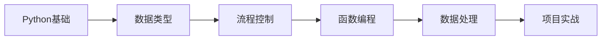

---

## 1. Hello World - 编程的第一步

### 什么是编程？

编程就是用计算机语言告诉计算机要做什么。Python是一门非常接近人类语言的编程语言，非常适合初学者。

### 1.1 你的第一个Python程序

让我们从最简单的"Hello World"程序开始：

```python
print("Hello, World!")
print("欢迎来到Python世界！")
```

**输出结果**：

```
Hello, World!
欢迎来到Python世界！
```

### 1.2 理解print函数

`print()` 是Python最常用的函数，用于在屏幕上显示内容。

**⚠️ 重要提醒**：

- ✅ 使用英文括号 `()`
- ✅ 使用英文引号 `""` 或 `''`
- ❌ 避免中文括号 `（）` 和引号 `“”`

### 1.3 代码执行流程

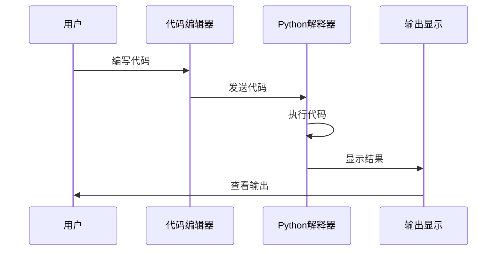

---

## 2. 变量 - 数据的存储容器

### 2.1 什么是变量？

变量就像是给数据贴上名字的标签，让我们能够存储和引用数据。比如我们给数字"18"贴上"age"的标签，之后就可以用"age"来访问这个数字。

### 2.2 变量的创建和使用

```python
name = "小明"  # 存储姓名
age = 18       # 存储年龄
height = 1.75  # 存储身高

print(f"姓名：{name}")
print(f"年龄：{age}")
print(f"身高：{height}米")
```

**输出**：

```
姓名：小明
年龄：18
身高：1.75米
```

### 2.3 变量命名规则

| 规则                       | 正确示例                  | 错误示例              |
| -------------------------- | ------------------------- | --------------------- |
| 只能包含字母、数字、下划线 | `user_name`, `count1`     | `user-name`, `count!` |
| 不能以数字开头             | `name1`, `_count`         | `1name`, `2count`     |
| 区分大小写                 | `Name`, `name` 是不同变量 | -                     |
| 不能使用Python关键字       | `user_count`              | `class`, `for`        |

### 2.4 变量类型变化

Python是动态类型语言，同一个变量可以存储不同类型的数据：


```python
x = 10          # 整数
print(f"x = {x}, 类型: {type(x).__name__}")

x = 3.14        # 浮点数
print(f"x = {x}, 类型: {type(x).__name__}")

x = "Python"    # 字符串
print(f"x = {x}, 类型: {type(x).__name__}")
```

---

## 3. 数据类型 - 数据的不同形式

### 3.1 Python基本数据类型

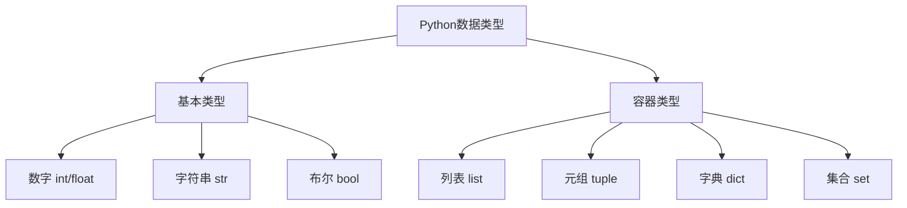

### 3.2 数字类型

#### 整数和浮点数

```python
integer_num = 42    # 整数
float_num = 3.14    # 浮点数

print(f"整数: {integer_num}")
print(f"浮点数: {float_num}")
```

#### 数学运算符

| 运算符 | 名称   | 示例      | 结果     |
| ------ | ------ | --------- | -------- |
| `+`    | 加法   | `10 + 3`  | 13       |
| `-`    | 减法   | `10 - 3`  | 7        |
| `*`    | 乘法   | `10 * 3`  | 30       |
| `/`    | 除法   | `10 / 3`  | 3.333... |
| `//`   | 整除   | `10 // 3` | 3        |
| `%`    | 取余   | `10 % 3`  | 1        |
| `**`   | 幂运算 | `10 ** 3` | 1000     |

```python
a = 10
b = 3

print(f"{a} + {b} = {a + b}")      # 13
print(f"{a} - {b} = {a - b}")      # 7
print(f"{a} * {b} = {a * b}")      # 30
print(f"{a} / {b} = {a / b:.2f}")   # 3.33
print(f"{a} // {b} = {a // b}")    # 3
print(f"{a} % {b} = {a % b}")      # 1
print(f"{a} ** {b} = {a ** b}")    # 1000
```

### 3.3 字符串类型

#### 创建字符串

```python
# 使用双引号
school = "清华大学"
# 使用单引号
major = '计算机科学'

# 字符串拼接
full_info = school + " " + major
print(f"拼接结果: {full_info}")

# f-string格式化（推荐）
name = "张三"
age = 20
print(f"我叫{name}，今年{age}岁")
print(f"{school=}，{major=}")
```

#### 字符串操作

| 操作     | 语法            | 说明             |
| -------- | --------------- | ---------------- |
| 获取长度 | `len(text)`     | 返回字符串字符数 |
| 访问字符 | `text[0]`       | 第一个字符       |
| 切片     | `text[0:3]`     | 获取部分字符     |
| 拼接     | `text1 + text2` | 连接两个字符串   |

```python
text = "Python编程"

print(f"字符串长度: {len(text)}")           # 8
print(f"第一个字符: {text[0]}")             # P
print(f"最后一个字符: {text[-1]}")          # 程
print(f"前3个字符: {text[0:3]}")            # Pyt
print(f"第2到第4个字符: {text[1:4]}")       # yth
```

### 3.4 布尔类型

布尔类型只有两个值：`True`（真）和 `False`（假）

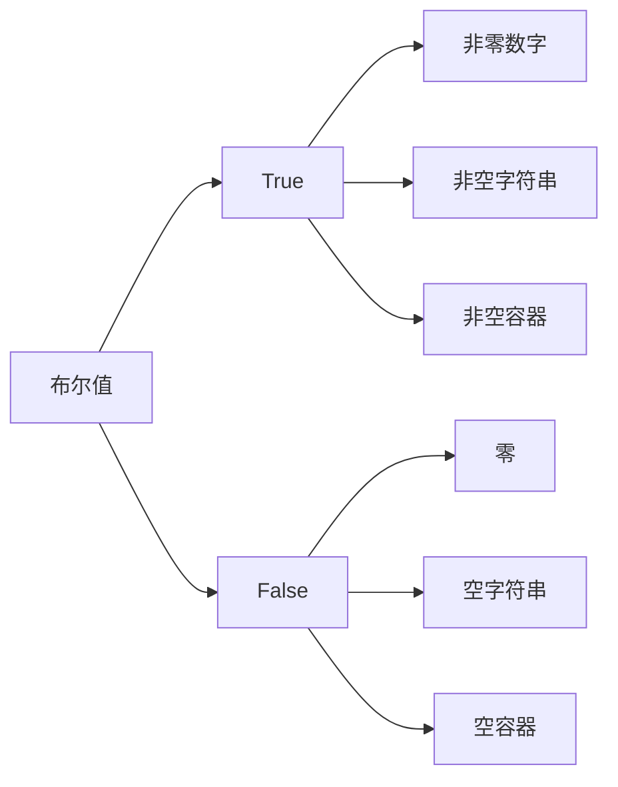

#### 布尔运算

```python
# 基本运算
print(f"True and False: {True and False}")  # False
print(f"True or False: {True or False}")    # True
print(f"not True: {not True}")              # False

# 自动转换
print(f"bool(0): {bool(0)}")                # False
print(f"bool(1): {bool(1)}")                # True
print(f"bool(''): {bool('')}")              # False
print(f"bool('text'): {bool('text')}")      # True
print(f"bool([]): {bool([])}")              # False
print(f"bool([1,2]): {bool([1,2])}")        # True
```

---

## 4. 列表 - 有序的容器

### 4.1 列表的基本概念

列表是Python中最常用的数据结构，可以存储多个元素，并且元素可以被修改。列表就像一个有序的容器，里面可以放不同类型的数据。

### 4.2 创建和访问列表

```python
# 不同类型的列表
fruits = ["苹果", "香蕉", "橙子", "葡萄"]
numbers = [1, 2, 3, 4, 5]
mixed = ["文本", 123, 3.14, True]

print(f"水果列表: {fruits}")
print(f"数字列表: {numbers}")
print(f"混合列表: {mixed}")
```

### 4.3 列表操作流程

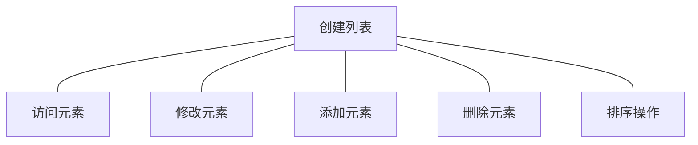

| 操作     | 方法   | 语法                    | 说明           |
| -------- | ------ | ----------------------- | -------------- |
| 访问元素 | 索引   | `fruits[0]`             | 获取第一个元素 |
| 修改元素 | 赋值   | `fruits[1] = "草莓"`    | 修改第二个元素 |
| 添加元素 | append | `fruits.append("葡萄")` | 添加到末尾     |
| 删除元素 | remove | `fruits.remove("苹果")` | 删除指定值     |
| 排序     | sort   | `fruits.sort()`         | 排序列表       |

```python
fruits = ["苹果", "香蕉", "橙子"]

# 访问元素
print(f"第一个: {fruits[0]}")      # 苹果
print(f"最后一个: {fruits[-1]}")   # 橙子
print(f"前两个: {fruits[0:2]}")    # ['苹果', '香蕉']

# 修改列表
fruits[1] = "草莓"
print(f"修改后: {fruits}")        # ['苹果', '草莓', '橙子']

# 添加元素
fruits.append("葡萄")
print(f"添加后: {fruits}")        # ['苹果', '草莓', '橙子', '葡萄']
```

### 4.4 列表遍历方法

```python
fruits = ["苹果", "香蕉", "橙子"]

# 方法1: for循环
print("for循环:")
for fruit in fruits:
    print(f"- {fruit}")

# 方法2: 索引遍历
print("\n索引遍历:")
for i in range(len(fruits)):
    print(f"索引{i}: {fruits[i]}")

# 方法3: enumerate
print("\nenumerate遍历:")
for index, fruit in enumerate(fruits):
    print(f"索引{index}: {fruit}")
```

---

## 5. 字典 - 键值对存储

### 5.1 字典的基本概念

字典用键值对的方式存储数据，就像现实中的字典一样，通过"键"来查找"值"。例如：{"name": "张三"}中，"name"是键，"张三"是值。

### 5.2 创建和使用字典

```python
# 创建字典
student = {
    "name": "张三",
    "age": 20,
    "major": "计算机科学",
    "gpa": 3.8
}

print(f"学生信息: {student}")
```

### 5.3 字典操作流程

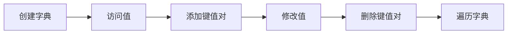

### 5.4 字典方法对比

| 方法     | 语法                          | 返回值 | 说明                           |
| -------- | ----------------------------- | ------ | ------------------------------ |
| keys()   | `student.keys()`              | 所有键 | 获取所有键的列表               |
| values() | `student.values()`            | 所有值 | 获取所有值的列表               |
| items()  | `student.items()`             | 键值对 | 获取键值对的列表               |
| get()    | `student.get("key", default)` | 值     | 安全访问，不存在的键返回默认值 |

```python
student = {"name": "张三", "age": 20}

# 访问值
print(f"姓名: {student['name']}")
print(f"年龄: {student['age']}")

# 添加和修改
student["gpa"] = 3.8
student["age"] = 21

# 安全访问
email = student.get("email", "无邮箱")
print(f"邮箱: {email}")
```

### 5.5 字典遍历方式

```python
student = {"name": "张三", "age": 20, "major": "计算机科学"}

# 遍历键
print("遍历键:")
for key in student.keys():
    print(f"- {key}")

# 遍历值
print("\n遍历值:")
for value in student.values():
    print(f"- {value}")

# 遍历键值对
print("\n遍历键值对:")
for key, value in student.items():
    print(f"{key}: {value}")
```

---

## 6. 条件判断 - 让程序做决定

### 6.1 if语句结构

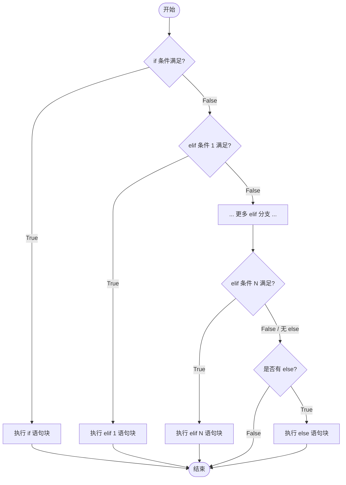

### 6.2 条件判断示例

```python
score = 85

if score >= 90:
    print("优秀")
elif score >= 80:
    print("良好")
elif score >= 60:
    print("及格")
else:
    print("不及格")
```

### 6.3 比较运算符

| 运算符 | 说明     | 示例     | 结果 |
| ------ | -------- | -------- | ---- |
| `==`   | 等于     | `5 == 5` | True |
| `!=`   | 不等于   | `5 != 3` | True |
| `>`    | 大于     | `5 > 3`  | True |
| `<`    | 小于     | `3 < 5`  | True |
| `>=`   | 大于等于 | `5 >= 5` | True |
| `<=`   | 小于等于 | `3 <= 5` | True |

### 6.4 逻辑运算符

| 运算符 | 说明   | 示例             | 结果  |
| ------ | ------ | ---------------- | ----- |
| `and`  | 逻辑与 | `True and False` | False |
| `or`   | 逻辑或 | `True or False`  | True  |
| `not`  | 逻辑非 | `not True`       | False |

```python
# 复杂条件判断
age = 20
has_license = True

if age >= 18 and has_license:
    print("可以开车")
elif age >= 18 and not has_license:
    print("需要考取驾照")
else:
    print("年龄不够")

# 闰年判断
year = 2024
if (year % 4 == 0 and year % 100 != 0) or (year % 400 == 0):
    print(f"{year}年是闰年")
else:
    print(f"{year}年不是闰年")
```

---

## 7. 循环 - 重复执行代码

### 7.1 for循环结构

for循环用于遍历序列（如列表、字符串）或数字范围：

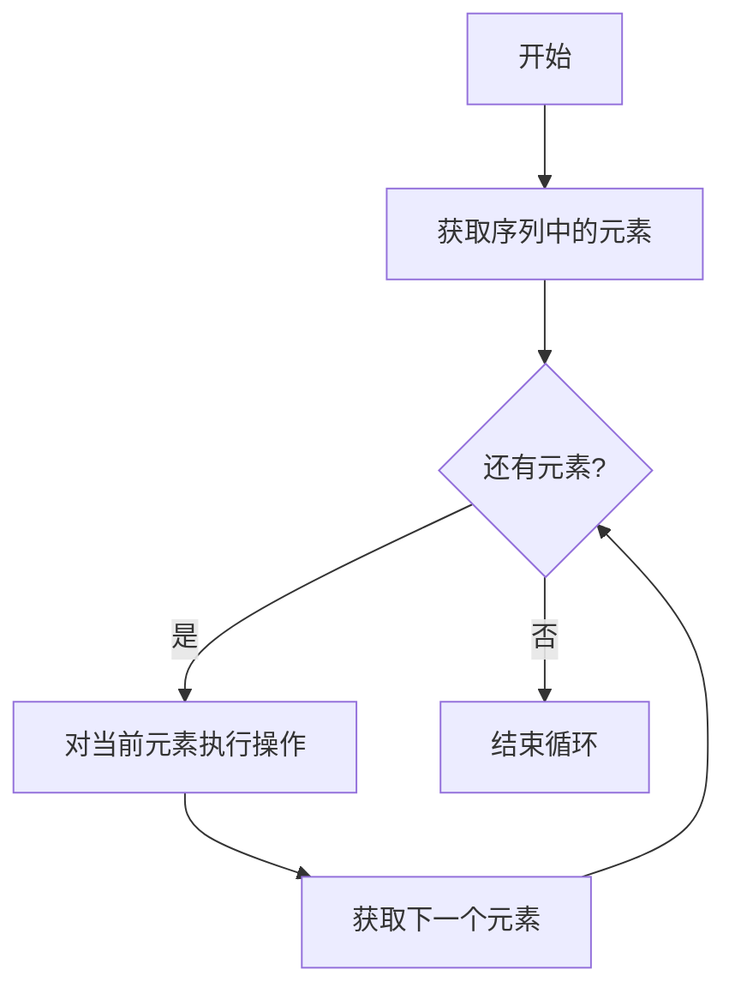

### 7.2 for循环示例

```python
# 遍历列表
fruits = ["苹果", "香蕉", "橙子"]
print("所有水果:")
for fruit in fruits:
    print(f"- {fruit}")

# 遍历数字
print("\n数字1到5:")
for i in range(1, 6):
    print(i)

# 遍历字符串
print("\n遍历字符串:")
text = "Python"
for char in text:
    print(f"- {char}")
```

### 7.3 while循环结构

while循环在条件为真时重复执行代码块：

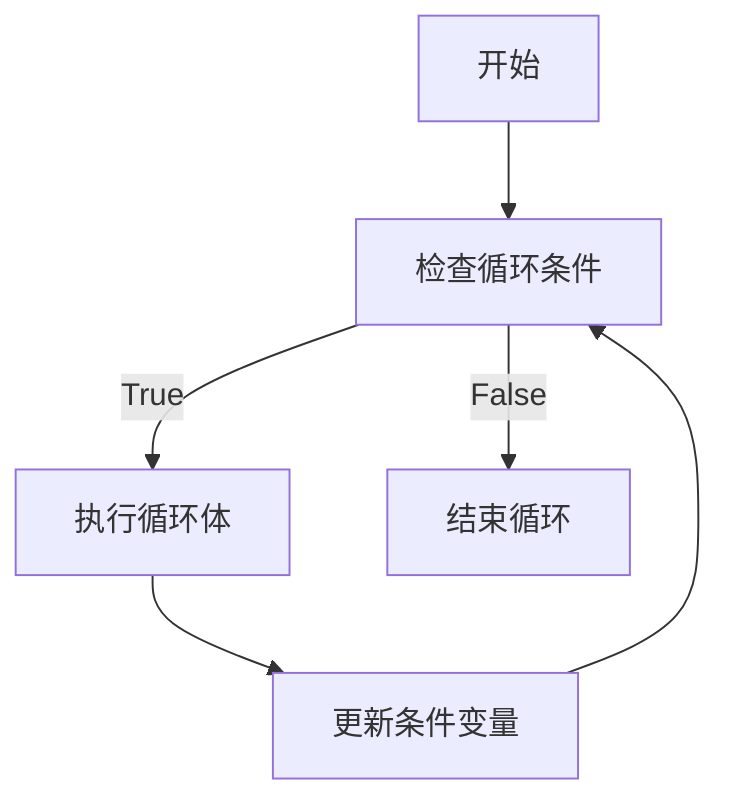

### 7.4 while循环示例

```python
# 倒计时
count = 5
print("倒计时:")
while count > 0:
    print(count)
    count -= 1
print("发射!")

# 求和
total = 0
i = 1
while i <= 5:
    total += i
    i += 1
print(f"\n1+2+3+4+5 = {total}")
```

### 7.5 循环控制

```python
# break示例
print("break示例:")
for i in range(1, 10):
    if i == 5:
        break
    print(i)

# continue示例
print("\ncontinue示例:")
for i in range(1, 10):
    if i == 5:
        continue
    print(i)

# 循环中的else
print("\n循环中的else:")
for i in range(1, 5):
    print(i)
else:
    print("循环正常完成")
```

---

## 8. 函数 - 代码的重复使用

### 8.1 函数的概念

函数是将代码块包装起来，可以重复使用的工具，是编程中最重要的概念之一。就像厨房的食谱，定义一次后可以反复使用。

### 8.2 函数定义和调用

```python
def greet(name):
    """向某人打招呼"""
    print(f"你好，{name}！")

# 调用函数
greet("小明")
greet("张三")
```

### 8.3 函数类型对比

| 函数类型 | 特点         | 示例                                |
| -------- | ------------ | ----------------------------------- |
| 无返回值 | 执行操作     | `greet(name)`                       |
| 有返回值 | 返回计算结果 | `calculate_area(length, width)`     |
| 默认参数 | 参数有默认值 | `introduce(name, age, city="北京")` |
| 可变参数 | 参数数量可变 | `sum_all(*numbers)`                 |

### 8.4 带返回值的函数

```python
def calculate_rectangle(length, width):
    """计算矩形的面积和周长"""
    area = length * width
    perimeter = 2 * (length + width)
    return area, perimeter

# 使用函数
a, p = calculate_rectangle(5, 3)
print(f"面积: {a}")
print(f"周长: {p}")
```

### 8.5 函数作用域

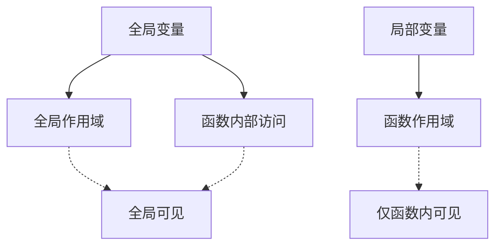

```python
global_var = "我是全局变量"

def test_scope():
    local_var = "我是局部变量"
    print(f"函数内全局变量: {global_var}")
    print(f"函数内局部变量: {local_var}")

test_scope()
print(f"函数外全局变量: {global_var}")
```

## 9. 模块和导入（import）

### 9.1 什么是模块？

模块是包含Python代码的文件，可以是函数、类、变量的集合。Python内置了大量模块，也可以导入第三方模块或自己创建模块。

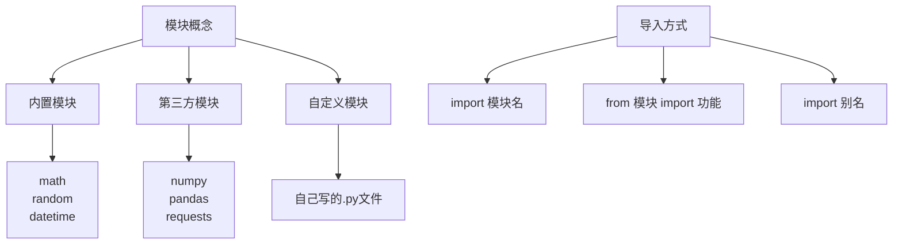

### 9.2 导入模块的方式

#### 导入方式对比

|     导入方式     |          语法           |        优点        |      缺点      |         使用场景         |
| :--------------: | :---------------------: | :----------------: | :------------: | :----------------------: |
| **导入整个模块** |      `import math`      | 命名清晰，避免冲突 |  调用代码较长  |    需要使用多个功能时    |
| **导入特定功能** | `from math import sqrt` |      代码简洁      |  可能命名冲突  |     只需要少数功能时     |
|   **使用别名**   |  `import numpy as np`   |      简化名称      |  需要记忆别名  |       模块名很长时       |
|   **导入全部**   |  `from math import *`   |     调用最简洁     | 命名冲突风险大 | 不推荐，只在交互环境使用 |

#### 内置模块示例

```python
import math

pi_value = math.pi
sqrt_result = math.sqrt(16)
sin_value = math.sin(math.pi/2)

print(f"π的值: {pi_value}")
print(f"√16 = {sqrt_result}")
print(f"sin(π/2) = {sin_value}")
```

#### 导入特定功能

```python
from math import sqrt, pi

result = sqrt(25)
print(f"√25 = {result}")
print(f"π = {pi}")
```

#### 使用别名

```python
import math as m

print(f"使用m.pi: {m.pi}")
print(f"使用m.sqrt: {m.sqrt(9)}")

# 这种方式在模块名很长时特别有用
# 比如数据科学中常用的：import numpy as np, import pandas as pd
```

#### 多个导入

```python
import math
import random
from datetime import datetime

print(f"随机数: {random.randint(1, 100)}")
print(f"当前时间: {datetime.now()}")
```

#### 导入的最佳实践

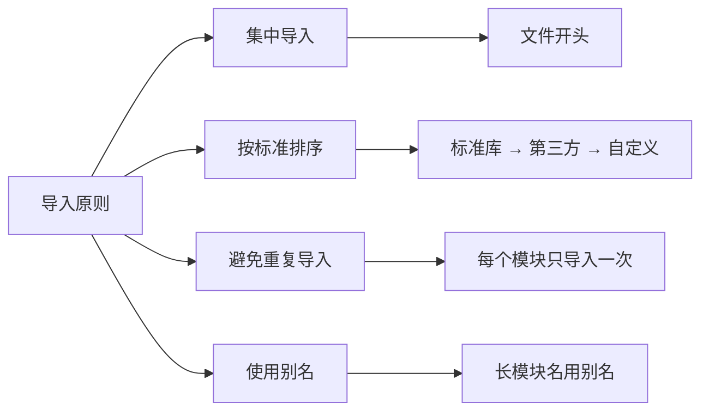

#### 导入顺序规范

```python
# 1. 标准库导入
import math
import random
from datetime import datetime

# 2. 第三方库导入
import numpy as np
import pandas as pd

# 3. 自定义模块导入
from my_module import my_function
```

#### 导入失败处理

```python
try:
    import numpy as np
    print("NumPy导入成功")
    print(f"版本: {np.__version__}")
except ImportError as e:
    print(f"导入失败: {e}")
    print("请安装: pip install numpy")
```

#### 模块信息查询

```python
import math

# 查看模块内容
print("模块dir():", dir(math)[:5])

# 查看模块文档
print("\n模块文档前300字符:")
print(math.__doc__[:300])

# 查看特定函数文档
print("\nsqrt函数文档:")
print(math.sqrt.__doc__[:100])
```

#### 常用内置模块

```python
import random

random_number = random.random()
random_int = random.randint(1, 100)
choices = random.choices(['红', '黄', '蓝'], k=3)

print(f"随机小数: {random_number}")
print(f"随机整数(1-100): {random_int}")
print(f"随机选择: {choices}")
```

#### 实际应用示例

```python
import random
from datetime import datetime, timedelta

def generate_lucky_draw():
    date = datetime.now().strftime('%Y-%m-%d %H:%M:%S')
    lucky_num = random.randint(1, 1000)
    prize = random.choice(['一等奖', '二等奖', '三等奖', '参与奖'])

    return f"{date} - 幸运号码: {lucky_num}, 奖品: {prize}"

for i in range(3):
    print(f"抽奖{i+1}: {generate_lucky_draw()}")
```

#### 为什么需要导入？

- 代码复用：避免重复造轮子
- 模块化：功能分离，便于维护
- 标准化：使用成熟稳定的代码库
- 扩展性：轻松添加新功能

### 9.3 第三方库（外部库）

> **重要提示**：我们为您准备了配套的 Jupyter Notebook 环境，所有常用的第三方库（如 numpy、pandas、matplotlib 等）都已经预装配置好。您可以直接访问JupyterHub运行代码，无需手动安装！如果您需要在本地环境使用，请仔细阅读以下安装指南。

#### 什么是第三方库？

第三方库是由Python社区开发者创建和维护的代码库，需要先安装才能使用。这些库提供了强大的功能，让Python在不同领域都能发挥威力。

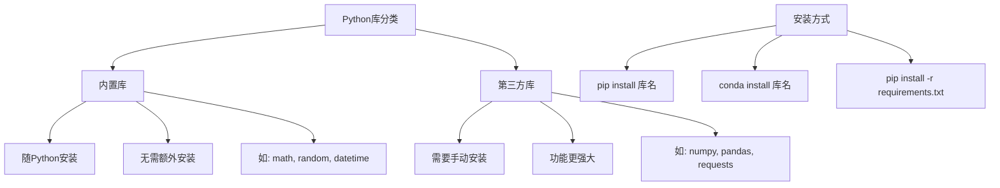

#### 环境选择：JupyterHub vs 本地安装

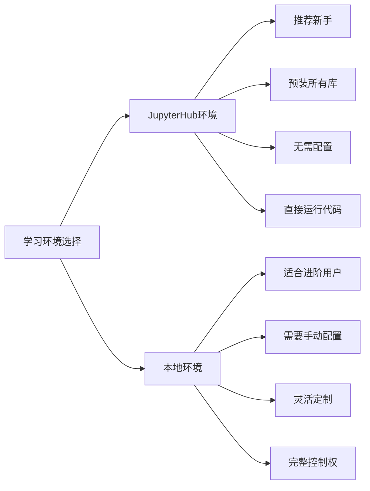

**🎯 学习建议**：

- **初学者推荐**：直接使用JupyterHub环境，专注于学习Python语法和编程概念
- **本地环境**：需要额外配置环境，参考[环境搭建](1.2_env_build.md)教程
- **混合使用**：在JupyterHub学习，在本地环境实践项目

#### 内置库 vs 第三方库对比

|    特性    |         内置库         |      第三方库      |
| :--------: | :--------------------: | :----------------: |
|  **安装**  | 随Python安装，无需操作 |    需要手动安装    |
| **稳定性** |   官方维护，非常稳定   | 社区维护，质量参差 |
|  **功能**  |        基础功能        |    专业领域功能    |
|  **更新**  |     Python版本更新     |      独立更新      |
|  **数量**  |        约200个         |     超过30万个     |

#### 常用第三方库介绍

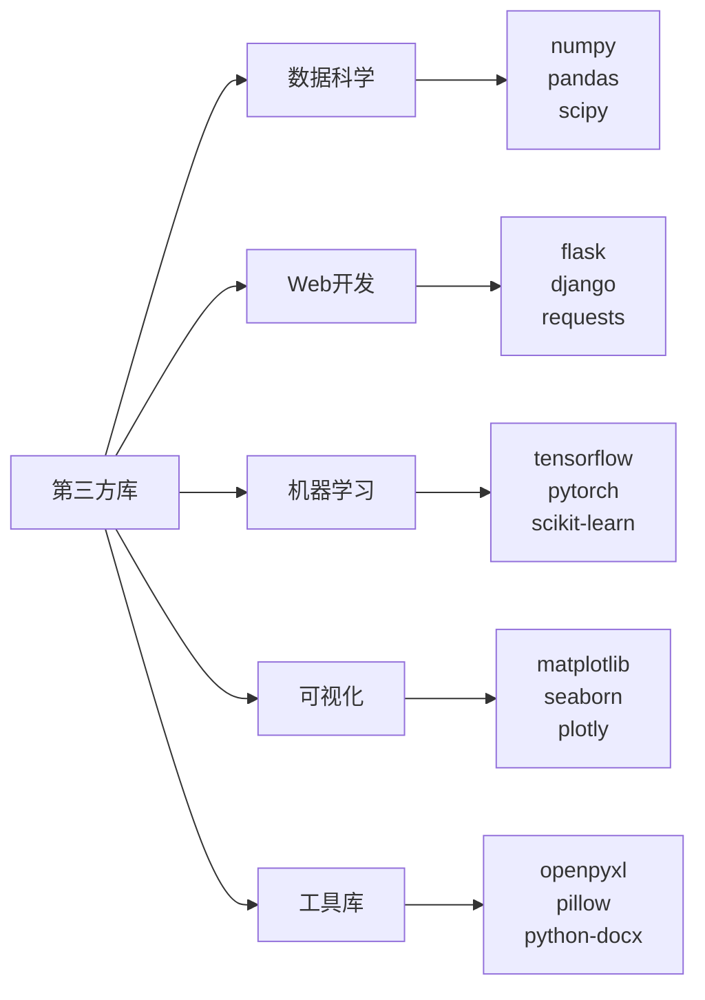

#### 如何安装第三方库？

> ⚠️ **重要提醒**：在使用pip或conda安装前，请务必确认当前的环境！如果使用conda环境，建议优先使用`conda install`来管理包，以避免环境冲突。

使用pip（Python包管理器）安装第三方库：

```python
# 在终端或命令行中执行以下命令

# 【重要】先确认当前环境
# 检查当前conda环境：conda info --envs（标*的是当前环境）
# 检查python位置：which python 或 where python
# 检查pip位置：pip -V

# pip安装（在当前环境安装）
# pip install 库名

# 示例：安装常用库
# pip install numpy
# pip install pandas
# pip install matplotlib
# pip install requests

# 同时安装多个库
# pip install numpy pandas matplotlib

# 指定版本安装
# pip install numpy==1.21.0

# 安装最新版本
# pip install numpy --upgrade

# conda安装（推荐conda环境用户使用）
# conda install numpy pandas matplotlib
# conda install -c conda-forge 库名  # 使用conda-forge频道
```

#### 第三方库使用示例

```python
# 假设已经安装了numpy（JupyterHub环境已预装，直接使用即可）
import numpy as np

# 创建数组
arr = np.array([1, 2, 3, 4, 5])
print(f"数组: {arr}")
print(f"数组形状: {arr.shape}")

# 数组运算
result = arr * 2
print(f"数组乘2: {result}")

# 统计计算
print(f"平均值: {np.mean(arr)}")
print(f"标准差: {np.std(arr)}")
```

#### 安装失败处理

```python
# 检查第三方库是否已安装
# （在JupyterHub环境中，常用的库都已经预装，可以直接使用）
try:
    import numpy as np
    print(f"NumPy已安装，版本: {np.__version__}")
except ImportError:
    print("NumPy未安装")
    print("如果在 JupyterHub 环境中遇到此错误，请联系管理员")
    print("如果在本地环境，请在终端运行: pip install numpy 或 conda install numpy")
```

#### 常见第三方库安装问题

```mermaid
graph TD
    A[安装问题] --> B[权限不足]
    A --> C[网络问题]
    A --> D[版本冲突]
    A --> E[缺少依赖]

    B --> B1[使用 --user 参数]
    B --> B2[使用虚拟环境]

    C --> C1[使用国内镜像源]
    C --> C2[c[检查网络连接]]

    D --> D1[指定版本号]
    D --> D2[升级pip]

    E --> E1[自动安装依赖]
    E --> E2[手动安装依赖]
```

#### 国内镜像源加速

```python
# 使用国内镜像源加速下载
# 清华源: pip install -i https://pypi.tuna.tsinghua.edu.cn/simple 库名
# 阿里源: pip install -i https://mirrors.aliyun.com/pypi/simple/ 库名

# 永久配置国内镜像源
# pip config set global.index-url https://pypi.tuna.tsinghua.edu.cn/simple
```

#### 依赖管理：requirements.txt

```python
# 创建依赖文件：requirements.txt
# 内容示例：
# numpy>=1.19.0
# pandas>=1.2.0
# matplotlib>=3.3.0

# 一键安装所有依赖：
# pip install -r requirements.txt

# 导出当前环境的所有包：
# pip freeze > requirements.txt
```

#### 虚拟环境（推荐做法）

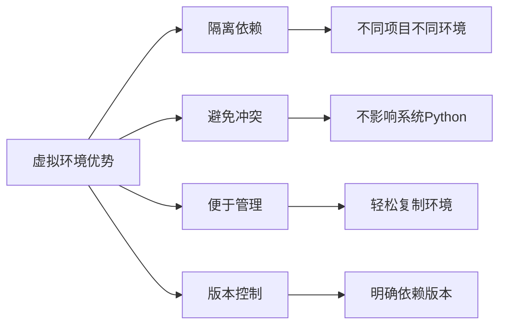

```python
# 创建虚拟环境
# python -m venv myenv

# 激活虚拟环境
# Windows: myenv\Scripts\activate
# Linux/Mac: source myenv/bin/activate

# 在虚拟环境中安装包
# pip install numpy pandas

# 退出虚拟环境
# deactivate
```

#### 第三方库使用建议

- ✅ **JupyterHub用户**：所有常用库已预装，直接使用，无需手动安装
- ✅ **本地用户**：优先使用conda环境，建议conda install而非pip
- ✅ **先查看官方文档**：了解正确用法和API
- ✅ **定期更新**：获得最新功能和安全修复
- ✅ **使用虚拟环境**：避免项目间依赖冲突
- ✅ **固定版本**：确保代码在不同环境下一致运行
- ❌ **避免安装未知库**：注意安全性和维护状态
- ❌ **不要滥用pip install \*`**：可能导致依赖冲突
- ❌ **本地环境不要随意安装到系统Python**：使用虚拟环境或conda环境

---

## 10. 综合练习 - 学生成绩管理系统

### 10.1 系统功能架构

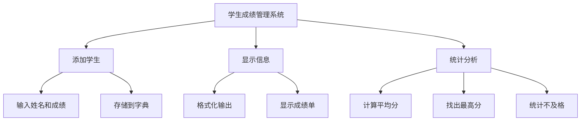

### 10.2 核心功能代码

```python
def add_student(students, name, scores):
    """添加学生及其成绩"""
    students[name] = scores
    print(f"✓ 已添加学生: {name}")

def calculate_average(scores):
    """计算平均分"""
    return sum(scores) / len(scores)

def print_student_info(students):
    """打印所有学生信息"""
    print("\n" + "="*40)
    print("学生成绩单".center(40))
    print("="*40)

    for name, scores in students.items():
        avg = calculate_average(scores)
        print(f"姓名: {name}")
        print(f"成绩: {scores}")
        print(f"平均分: {avg:.1f}")
        print("-"*40)

def find_top_student(students):
    """找出成绩最好的学生"""
    if not students:
        return None, 0

    top_student = None
    highest_avg = 0

    for name, scores in students.items():
        avg = calculate_average(scores)
        if avg > highest_avg:
            highest_avg = avg
            top_student = name

    return top_student, highest_avg

def calculate_class_average(students):
    """计算班级平均分"""
    if not students:
        return 0

    total_avg = 0
    for scores in students.values():
        total_avg += calculate_average(scores)

    return total_avg / len(students)
```

### 10.3 完整系统运行

```python
# 主程序
students = {}

print("="*40)
print("学生成绩管理系统".center(40))
print("="*40)

# 添加学生
print("\n添加学生:")
add_student(students, "张三", [85, 92, 78, 90])
add_student(students, "李四", [92, 88, 95, 87])
add_student(students, "王五", [78, 85, 82, 79])
add_student(students, "赵六", [65, 72, 68, 70])

# 显示信息
print_student_info(students)

# 找出成绩最好的学生
top_student, avg_score = find_top_student(students)
print(f"\n🏆 成绩最好的学生: {top_student}，平均分: {avg_score:.1f}")

# 班级统计
class_avg = calculate_class_average(students)
print(f"📊 班级平均分: {class_avg:.1f}")

# 更多统计
print(f"\n📈 统计信息:")
print(f"  总学生数: {len(students)}")
print(f"  最高平均分: {max(calculate_average(s) for s in students.values()):.1f}")
print(f"  最低平均分: {min(calculate_average(s) for s in students.values()):.1f}")

# 找出不及格学生
failing = [(name, calculate_average(scores)) for name, scores in students.items() if calculate_average(scores) < 60]
if failing:
    print(f"\n⚠️  不及格学生:")
    for name, avg in failing:
        print(f"  - {name}: {avg:.1f}分")
else:
    print(f"\n✅ 所有学生都及格了！")

print("\n" + "="*40)
print("程序执行完毕！".center(40))
print("="*40)
```

### 10.4 系统输出示例

```
========================================
                学生成绩管理系统
========================================

添加学生:
✓ 已添加学生: 张三
✓ 已添加学生: 李四
✓ 已添加学生: 王五
✓ 已添加学生: 赵六

========================================
                 学生成绩单
========================================
姓名: 张三
成绩: [85, 92, 78, 90]
平均分: 86.2
----------------------------------------
姓名: 李四
成绩: [92, 88, 95, 87]
平均分: 90.5
----------------------------------------
姓名: 王五
成绩: [78, 85, 82, 79]
平均分: 81.0
----------------------------------------
姓名: 赵六
成绩: [65, 72, 68, 70]
平均分: 68.8
----------------------------------------

🏆 成绩最好的学生: 李四，平均分: 90.5
📊 班级平均分: 81.6

📈 统计信息:
  总学生数: 4
  最高平均分: 90.5
  最低平均分: 68.8

✅ 所有学生都及格了！

========================================
                程序执行完毕！
========================================
```

---

## 11. 🎓 学习总结

### 已掌握的技能

| 技能类别     | 掌握内容               | 熟练度     |
| ------------ | ---------------------- | ---------- |
| **基础语法** | 变量、数据类型、运算符 | ⭐⭐⭐⭐⭐ |
| **流程控制** | 条件判断、循环         | ⭐⭐⭐⭐   |
| **数据结构** | 列表、字典             | ⭐⭐⭐⭐   |
| **函数编程** | 函数定义、参数、作用域 | ⭐⭐⭐     |
| **项目实践** | 完整的学生成绩管理系统 | ⭐⭐⭐     |

### Python学习路径图

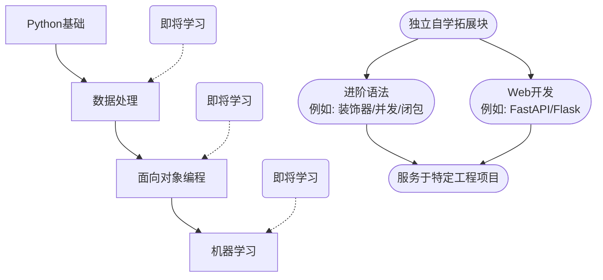

### 下一步学习建议

1. **更多数据结构**：学习元组、集合
2. **面向对象编程**：学习类和对象
3. **文件操作**：学习读写文件
4. **异常处理**：学习错误处理
5. **模块和包**：学习使用外部库

### 📚 推荐学习资源

- **官方文档**：[Python官方文档](https://docs.python.org/)
- **在线教程**：[菜鸟教程](https://www.runoob.com/python/)
- **练习平台**：[LeetCode](https://leetcode.cn/)
- **视频教程**：[B站Python教程](https://www.bilibili.com/)

---

## 12. 🎯 实践练习

### 练习1：创建计算器函数

```python
def calculator(a, b, operation):
    """
    简易计算器
    参数:
        a: 第一个数字
        b: 第二个数字
        operation: 操作符 (+, -, *, /)
    返回:
        计算结果
    """
    # 在这里完成你的代码
    pass
```

### 练习2：字符统计器

```python
def count_chars(text):
    """
    统计字符串中各字符的出现次数
    参数:
        text: 要统计的字符串
    返回:
        字符统计字典
    """
    # 在这里完成你的代码
    pass
```

### 练习3：扩展成绩系统

```python
def remove_student(students, name):
    """
    删除学生
    参数:
        students: 学生字典
        name: 要删除的学生姓名
    """
    # 在这里完成你的代码
    pass

def sort_students_by_score(students, reverse=True):
    """
    按成绩排序学生
    参数:
        students: 学生字典
        reverse: 是否降序
    """
    # 在这里完成你的代码
    pass
```

---

**🎉 恭喜你完成Python基础教程！**

记住：编程是一门实践技能，多练习才能掌握。祝你在Python编程的道路上越走越远！

如果需要更多帮助，请查阅：

- 📖 [JupyterHub使用指南](1.1_jupyterhub_space.md)
- 💻 [配套实践代码](http://expfluid.bond/jupyter/)
- 🌐 [Python官方文档](https://docs.python.org/zh-cn/3/)

祝你编程愉快！🚀
