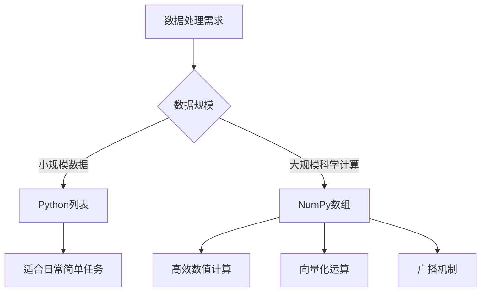
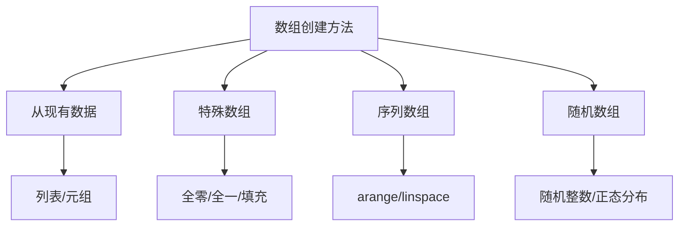
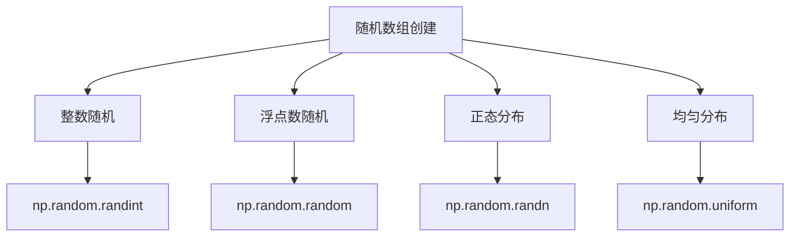
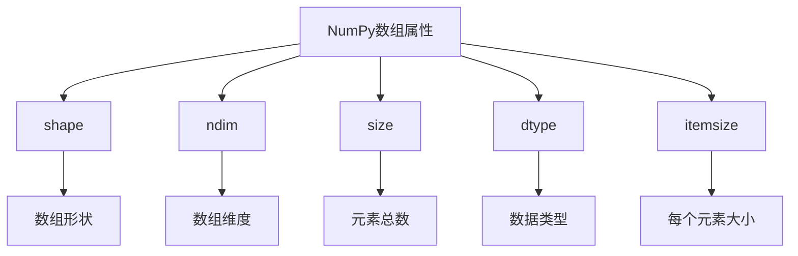
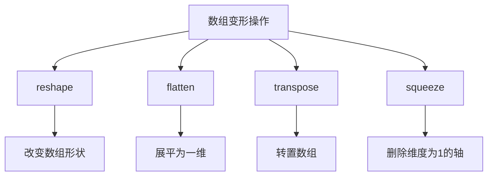
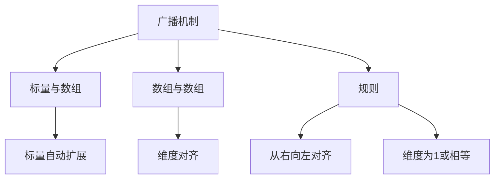
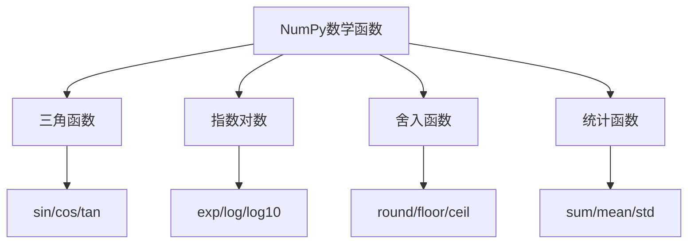
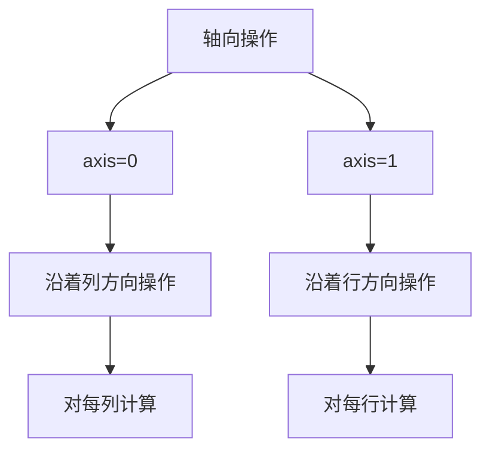
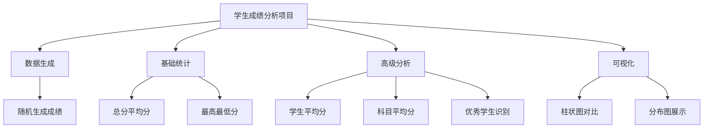
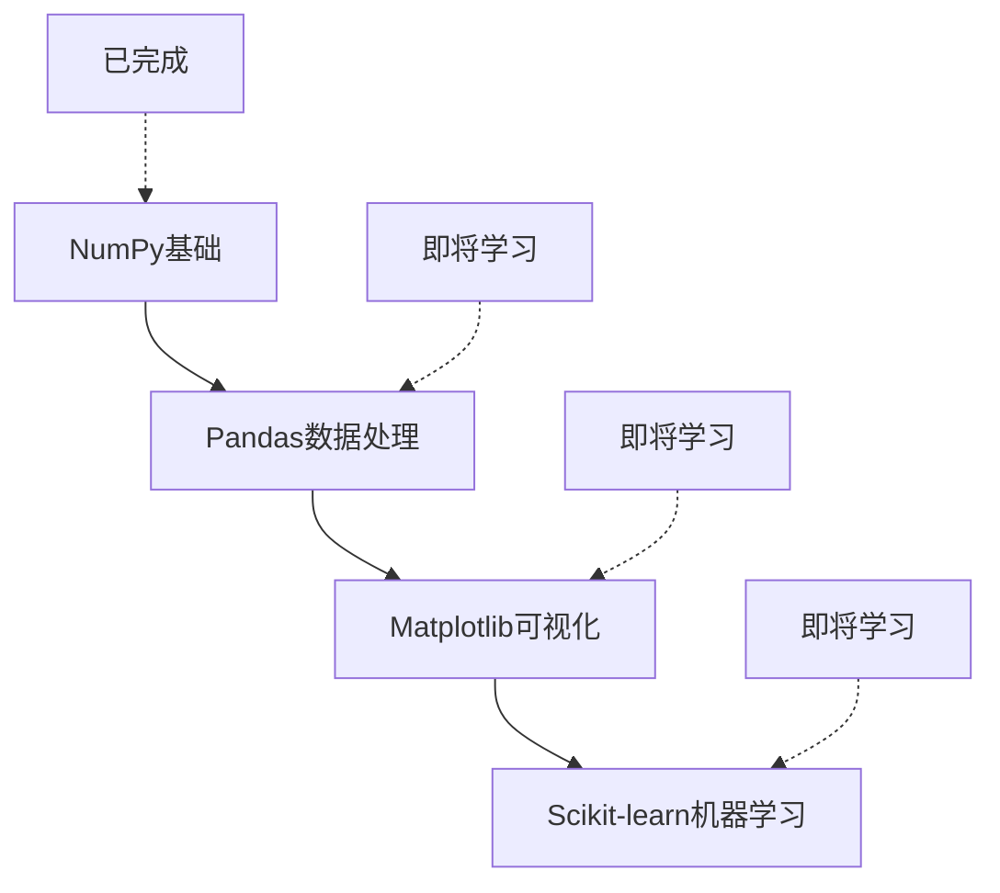

# NumPy 科学计算入门

## 🎯 学习目标

完成本教程后，你将能够：
- ✅ 理解NumPy的核心优势和适用场景
- ✅ 掌握NumPy数组的创建和基本操作
- ✅ 熟练使用数组索引和切片
- ✅ 理解向量化运算和广播机制
- ✅ 掌握常用的数学函数和统计方法
- ✅ 能够进行基础的数据分析和可视化

## 📖 如何使用本教程

1. **阅读理论**：先理解每个章节的概念和原理
2. **实践操作**：在JupyterHub中运行对应的代码示例
3. **对比学习**：观察代码输出，理解数值运算的结果
4. **项目练习**：完成最后的学生成绩分析项目

---

## 🚀 NumPy 学习路径


---

## 1. NumPy 核心优势

### 为什么选择NumPy？

NumPy（Numerical Python）是Python中用于科学计算的基础库，它提供了高效的数组对象和丰富的数学函数。

#### NumPy vs Python列表

| 特性 | Python列表 | NumPy数组 |
|------|------------|-----------|
| **存储方式** | 分散存储 | 连续内存存储 |
| **运算速度** | 较慢 | 快速（向量化运算） |
| **内存占用** | 较大 | 较小 |
| **功能支持** | 基础操作 | 丰富的科学计算函数 |



#### NumPy核心特性

1. **高效数组对象**：`ndarray`内存连续，支持向量化运算
2. **广播机制**：不同形状数组间的智能运算
3. **数学函数库**：500+科学计算函数
4. **线性代数工具**：矩阵运算优化

---

## 2. 数组创建

### 2.1 基础创建方法

#### 从列表创建数组

```python
# 一维数组
arr1d = np.array([1, 2, 3, 4, 5])

# 二维数组
arr2d = np.array([[1, 2, 3], [4, 5, 6]])

# 三维数组
arr3d = np.array([[[1, 2], [3, 4]], [[5, 6], [7, 8]]])
```

#### 特殊数组创建

| 函数 | 说明 | 示例 |
|------|------|------|
| `np.zeros()` | 创建全零数组 | `np.zeros((2, 3))` |
| `np.ones()` | 创建全一数组 | `np.ones((2, 3))` |
| `np.full()` | 创建填充数组 | `np.full((2, 3), 7)` |
| `np.eye()` | 创建单位矩阵 | `np.eye(3)` |



### 2.2 序列数组创建

#### arange vs linspace

| 函数 | 特点 | 适用场景 |
|------|------|----------|
| `np.arange(start, stop, step)` | 创建等差数列，整数步长 | 需要整数序列 |
| `np.linspace(start, stop, num)` | 创建等分点，包含端点 | 需要精确分割区间 |

```python
# arange：创建整数序列
np.arange(0, 10, 2)  # [0, 2, 4, 6, 8]

# linspace：创建等分点
np.linspace(0, 10, 5)  # [0., 2.5, 5., 7.5, 10.]
```

### 2.3 随机数组创建



```python
# 随机整数数组
np.random.randint(0, 10, (3, 3))  # 0-9的随机整数，3x3数组

# 正态分布数组
np.random.randn(3, 3)  # 标准正态分布，均值0标准差1

# 均匀分布数组
np.random.uniform(0, 1, (3, 3))  # 0-1之间的均匀分布
```

---

## 3. 数组属性与操作

### 3.1 数组基本属性

NumPy数组有几个重要属性，帮助我们了解数组的特征：



| 属性 | 说明 | 示例输出 |
|------|------|----------|
| `shape` | 数组的形状 | `(2, 3)` 表示2行3列 |
| `ndim` | 数组的维度数 | `2` 表示二维数组 |
| `size` | 数组元素总数 | `6` 表示6个元素 |
| `dtype` | 数组数据类型 | `int64`, `float64` |
| `itemsize` | 每个元素占用的字节数 | `8` bytes |

```python
arr = np.array([[1, 2, 3, 4], [5, 6, 7, 8]])

print(f'数组形状 (shape): {arr.shape}')    # (2, 4)
print(f'数组维度 (ndim): {arr.ndim}')      # 2
print(f'数组大小 (size): {arr.size}')      # 8
print(f'数据类型 (dtype): {arr.dtype}')    # int64
```

### 3.2 数组变形

数组变形是NumPy中常用的操作，可以改变数组的形状而不改变数据。



#### reshape使用技巧

```python
# 手动指定形状
arr.reshape(3, 4)  # 变形为3行4列

# 使用-1自动计算
arr.reshape(-1, 4)  # 自动计算行数，保持4列
arr.reshape(3, -1)  # 自动计算列数，保持3行
```

**注意事项**：
- `-1` 只能出现一次，表示自动计算该维度
- 变形后的总元素数必须与原数组相同
- 无法变形时会抛出`ValueError`

---

## 4. 数组索引与切片

### 4.1 基础索引

NumPy支持多种索引方式，类似于Python列表，但更强大。

```mermaid
graph TD
    A[数组索引方式] --> B[基础索引]
    A --> C[切片索引]
    A --> D[布尔索引]
    A --> E[花式索引]
    
    B --> B1[arr[i,j]]
    C --> C1[arr[i:j,k:l]]
    D --> D1[arr > 5]
    E --> E1[arr[[0,2]]]
```

#### 二维数组索引

```python
arr = np.array([[1, 2, 3, 4], 
                [5, 6, 7, 8], 
                [9, 10, 11, 12]])

# 单个元素
arr[0, 0]    # 1  第一行第一列
arr[1, 2]    # 7  第二行第三列
arr[-1, -1]  # 12 最后一行最后一列

# 整行/整列
arr[0]      # [1, 2, 3, 4]  第一行
arr[:, 0]   # [1, 5, 9]  第一列
```

### 4.2 数组切片

切片语法：`[start:stop:step]`，与Python列表类似但更强大。

#### 切片操作示例

```python
arr = np.array([[1, 2, 3, 4], 
                [5, 6, 7, 8], 
                [9, 10, 11, 12]])

# 行切片
arr[0:2]        # 前两行
arr[::2]        # 每隔一行

# 列切片  
arr[:, 1:3]     # 所有行，第2-3列
arr[:, ::2]     # 所有行，每隔一列

# 混合切片
arr[0:2, 1:3]   # 前两行，第2-3列
arr[::2, ::2]   # 每隔一行和一列
```

#### 切片规则总结

| 切片语法 | 说明 | 示例 |
|----------|------|------|
| `arr[:]` | 全部元素 | `arr[:]` |
| `arr[start:]` | 从start到结束 | `arr[2:]` |
| `arr[:stop]` | 从开始到stop-1 | `arr[:3]` |
| `arr[start:stop]` | 从start到stop-1 | `arr[1:4]` |
| `arr[start:stop:step]` | 从start到stop-1，步长step | `arr[0:10:2]` |
| `arr[::step]` | 全部元素，步长step | `arr[::2]` |

---

## 5. 数组运算

### 5.1 算术运算

NumPy支持元素级的算术运算，这些运算都是向量化的，意味着它们在整个数组上同时进行。

```mermaid
graph TD
    A[NumPy运算] --> B[算术运算]
    A --> C[比较运算]
    A --> D[逻辑运算]
    
    B --> B1[+ - * / // % **]
    C --> C1[> < >= <= == !=]
    D --> D1[& | ~]
```

#### 基础算术运算

```python
arr1 = np.array([1, 2, 3, 4])
arr2 = np.array([5, 6, 7, 8])

arr1 + arr2    # 加法: [6, 8, 10, 12]
arr1 - arr2    # 减法: [-4, -4, -4, -4]
arr1 * arr2    # 乘法: [5, 12, 21, 32]
arr1 / arr2    # 除法: [0.2, 0.333, 0.429, 0.5]
arr1 ** arr2   # 幂运算: [1, 64, 2187, 65536]
```

### 5.2 广播机制

广播机制是NumPy最强大的特性之一，它允许不同形状的数组进行运算。



#### 广播规则

1. **从右向左对齐**：比较每个维度的形状
2. **维度相同或为1**：满足条件即可广播
3. **缺失维度**：自动补1
4. **不满足条件**：抛出`ValueError`

```python
# 标量与数组运算
arr = np.array([1, 2, 3, 4])
arr + 10     # [11, 12, 13, 14]
arr * 2      # [2, 4, 6, 8]

# 不同形状数组运算
matrix = np.array([[1, 2, 3], [4, 5, 6]])    # (2, 3)
vector = np.array([10, 20, 30])            # (3,)
matrix + vector  # 广播为 (2, 3) + (1, 3) = (2, 3)
```

---

## 6. 数学函数

### 6.1 常用数学函数

NumPy提供了大量的数学函数，可以直接对数组进行运算。



#### 三角函数示例

```python
arr = np.array([0, np.pi/4, np.pi/2, 3*np.pi/4, np.pi])

np.sin(arr)     # 正弦函数
np.cos(arr)     # 余弦函数  
np.tan(arr)     # 正切函数
```

#### 其他常用函数

```python
# 指数和对数
np.exp([0, 1, 2])              # [1., 2.718, 7.389]
np.log([1, 2.718, 10])          # [0., 1., 2.302]
np.log10([1, 10, 100])         # [0., 1., 2.]

# 舍入函数
np.round([1.2, 2.5, 3.7])      # [1., 2., 4.]
np.floor([1.2, 2.5, 3.7])      # [1., 2., 3.]
np.ceil([1.2, 2.5, 3.7])       # [2., 3., 4.]
```

### 6.2 聚合函数

聚合函数对数组进行统计计算，是数据分析的重要工具。

| 函数 | 说明 | 示例 |
|------|------|------|
| `np.sum()` | 求和 | `np.sum(arr)` |
| `np.mean()` | 平均值 | `np.mean(arr)` |
| `np.median()` | 中位数 | `np.median(arr)` |
| `np.std()` | 标准差 | `np.std(arr)` |
| `np.var()` | 方差 | `np.var(arr)` |
| `np.min()` | 最小值 | `np.min(arr)` |
| `np.max()` | 最大值 | `np.max(arr)` |

```python
arr = np.array([1, 2, 3, 4, 5, 6, 7, 8, 9, 10])

np.sum(arr)      # 55
np.mean(arr)     # 5.5
np.std(arr)      # 2.87
np.min(arr)      # 1
np.max(arr)      # 10
```

---

## 7. 二维数组操作

### 7.1 轴向操作

对于二维数组，我们可以指定沿着哪个轴（行或列）进行操作。



#### axis参数说明

```python
matrix = np.array([[1, 2, 3], 
                   [4, 5, 6], 
                   [7, 8, 9]])

# 不指定axis：对所有元素操作
np.sum(matrix)           # 45

# axis=0：沿着列方向操作（对每列求和）
np.sum(matrix, axis=0)   # [12, 15, 18]

# axis=1：沿着行方向操作（对每行求和）
np.sum(matrix, axis=1)   # [6, 15, 24]
```

### 7.2 矩阵运算

NumPy提供了完整的矩阵运算支持，这是线性代数计算的基础。

```mermaid
graph TD
    A[矩阵运算] --> B[矩阵乘法]
    A --> C[转置]
    A --> D[逆矩阵]
    A --> E[行列式]
    
    B --> B1[@ 运算符]
    C --> C1[.T 属性]
    D --> D1[np.linalg.inv]
    E --> E1[np.linalg.det]
```

#### 矩阵运算对比

| 运算 | NumPy语法 | 说明 |
|------|------------|------|
| 矩阵乘法 | `A @ B` | 标准的矩阵乘法 |
| 元素乘法 | `A * B` | 对应元素相乘 |
| 转置 | `A.T` | 矩阵转置 |
| 逆矩阵 | `np.linalg.inv(A)` | 矩阵求逆 |

```python
A = np.array([[1, 2], [3, 4]])
B = np.array([[5, 6], [7, 8]])

# 矩阵乘法
A @ B           # [[19, 22], [43, 50]]

# 元素乘法
A * B           # [[5, 12], [21, 32]]

# 转置
A.T             # [[1, 3], [2, 4]]

# 逆矩阵
np.linalg.inv(A) # [[-2., 1.], [1.5, -0.5]]
```

---

## 8. 综合练习 - 学生成绩分析

### 8.1 项目概述

通过一个完整的学生成绩分析项目，综合运用NumPy的各种功能。



### 8.2 项目功能

1. **数据生成**：使用随机数生成模拟学生成绩
2. **统计分析**：计算总分、平均分、标准差等
3. **数据挖掘**：找出优秀学生和需要改进的科目
4. **可视化展示**：用图表直观展示分析结果

### 8.3 关键代码解析

```python
# 设置随机种子确保结果可复现
np.random.seed(42)

# 生成随机成绩 (60-100分)
grades = np.random.randint(60, 101, (len(students), len(subjects)))

# 每个学生的平均分
student_avg = np.mean(grades, axis=1)

# 每门科目的平均分  
subject_avg = np.mean(grades, axis=0)

# 找出优秀学生
excellent_students = [students[i] for i in range(len(students)) if student_avg[i] >= 85]
```

---

## 9. 🎓 学习总结

### 已掌握的技能

| 技能类别 | 掌握内容 | 熟练度 |
|----------|----------|--------|
| **基础操作** | 数组创建、属性查看 | ⭐⭐⭐⭐⭐ |
| **数组操作** | 索引、切片、变形 | ⭐⭐⭐⭐ |
| **数学运算** | 算术运算、广播机制 | ⭐⭐⭐⭐ |
| **统计函数** | 聚合函数、轴向操作 | ⭐⭐⭐⭐ |
| **矩阵运算** | 矩阵乘法、转置、求逆 | ⭐⭐⭐ |
| **实际应用** | 数据分析、可视化 | ⭐⭐⭐ |

### NumPy学习路径图



### 下一步学习建议

1. **Pandas数据处理**：学习DataFrame操作和数据清洗
2. **Matplotlib高级可视化**：学习更多图表类型和样式定制
3. **SciPy科学计算**：学习高级数学函数和优化算法
4. **机器学习基础**：使用NumPy进行数据预处理

### 📚 推荐学习资源

- **官方文档**：[NumPy官方文档](https://numpy.org/doc/)
- **在线教程**：[NumPy中文教程](https://www.numpy.org.cn/)
- **练习平台**：[Kaggle](https://www.kaggle.com/)
- **视频教程**：[NumPy入门视频](https://www.bilibili.com/)

---

## 10. 🎯 实践练习

### 练习1：数组操作综合

```python
def array_operations(arr):
    """
    数组操作综合练习
    参数:
        arr: 输入数组
    返回:
        包含多种统计结果的字典
    """
    result = {
        'mean': np.mean(arr),
        'median': np.median(arr),
        'std': np.std(arr),
        'min': np.min(arr),
        'max': np.max(arr)
    }
    return result
```

### 练习2：矩阵运算

```python
def matrix_analysis(A, B):
    """
    矩阵分析练习
    参数:
        A, B: 输入矩阵
    返回:
        矩阵运算结果字典
    """
    result = {
        'dot_product': A @ B,
        'element_product': A * B,
        'A_transpose': A.T,
        'determinant': np.linalg.det(A)
    }
    return result
```

### 练习3：数据分析项目

```python
def analyze_data(data):
    """
    数据分析练习
    参数:
        data: 二维数组，每行代表一个样本，每列代表一个特征
    返回:
        数据分析报告
    """
    # 完成数据分析功能
    pass
```

---

**🎉 恭喜完成NumPy基础学习！**

记住：NumPy是数据科学的基础，多练习才能掌握。祝你在科学计算的道路上越走越远！

如果需要更多帮助，请查阅：
- 📖 [配套实践代码](http://expfluid.bond/jupyter/)
- 🌐 [NumPy官方文档](https://numpy.org/doc/)

祝你编程愉快！🚀