# Python 面向对象编程：从函数到类

> 在深入神经网络之前，我们需要掌握一个重要的编程思想：**面向对象编程（Object-Oriented Programming, OOP）**。这不仅是现代 Python 开发的核心，也是理解和构建神经网络框架的基础。

---

## 🎯 为什么需要面向对象？

想象你正在管理一个班级的学生信息。如果用传统的方式，你需要为每个学生创建多个独立的变量：姓名、年龄、成绩……当学生数量增加到几十个、上百个时，这些变量会变得难以管理，函数调用也会变得混乱。

**面向对象编程就像是给数据和操作打包**：把一个学生的所有信息（姓名、年龄、成绩）和相关操作（计算平均分、判断是否及格）封装在一起，形成一个"学生对象"。这样，无论有多少学生，代码结构都保持清晰。

### 传统方式 vs 面向对象

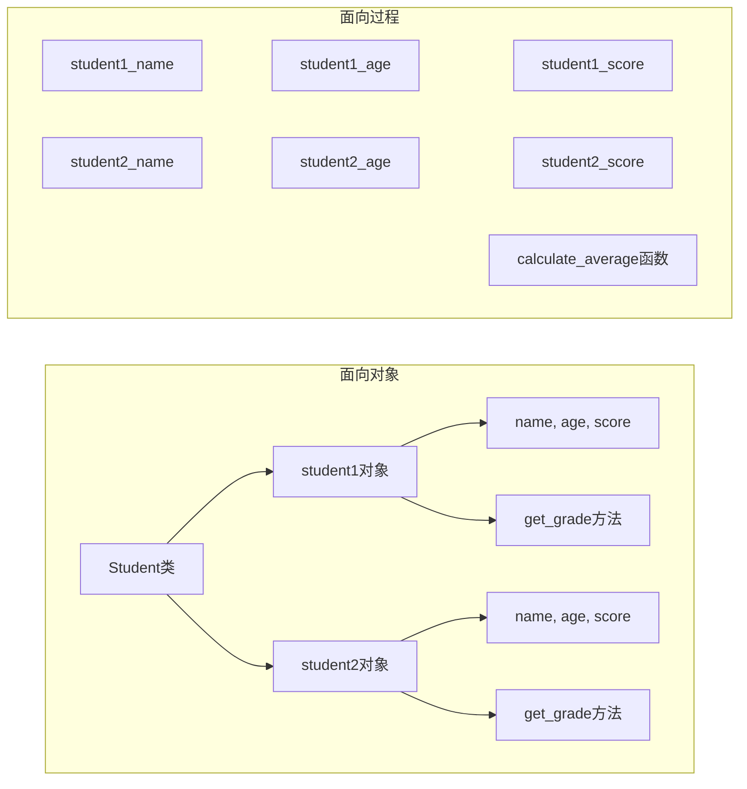
```mermaid
graph TD
    subgraph 面向过程
    A1[student1_name]
    A2[student1_age]
    A3[student1_score]
    B1[student2_name]
    B2[student2_age]
    B3[student2_score]
    C[calculate_average函数]
    A1~~~A2~~~A3
    B1~~~B2~~~B3
    end

    subgraph 面向对象
    O1[Student类] --> O2[student1对象]
    O1 --> O3[student2对象]
    O2 --> O4[name, age, score]
    O2 --> O5[get_grade方法]
    O3 --> O6[name, age, score]
    O3 --> O7[get_grade方法]
    end
    
    面向过程~~~面向对象
```

**面向对象的核心优势**：

- 📦 **封装性**：数据和操作绑定在一起
- 🔄 **可复用**：写一次类定义，创建无数个对象
- 🎨 **易维护**：修改类定义，所有对象自动更新
- 🧩 **模块化**：每个类负责一个清晰的职责

---

## 1. 变量声明：Python 的灵活性

在正式学习面向对象之前，我们先快速了解 Python 的变量声明特点。

### 动态类型：无需声明类型

与 Java、C++ 等语言不同，Python 是**动态类型语言**。你不需要提前告诉 Python 变量是什么类型，它会自动推断：

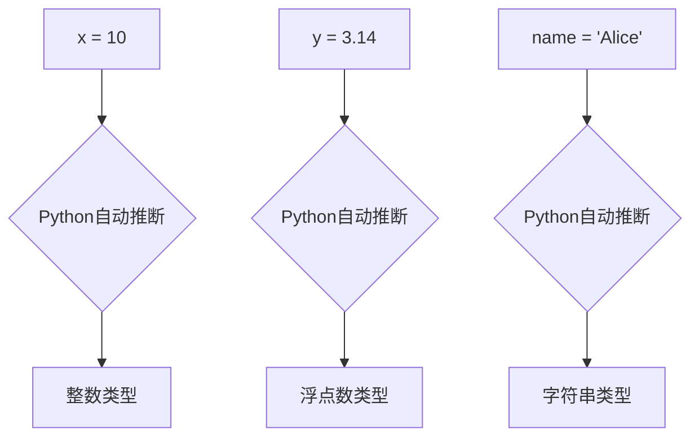
```mermaid
graph TD
    A[x = 10] --> B{Python自动推断}
    B --> C[整数类型]

    D[y = 3.14] --> E{Python自动推断}
    E --> F[浮点数类型]

    G[name = 'Alice'] --> H{Python自动推断}
    H --> I[字符串类型]
```

这种灵活性让代码更简洁，但也需要我们更加注意变量的实际类型。

### 类型提示：提高可读性

虽然 Python 不强制类型声明，但从 Python 3.5 开始，我们可以添加**类型提示（Type Hints）**来提高代码可读性。这对于大型项目和团队协作特别有用。

**在配套的 Notebook 中**，你将看到：

- ✅ 如何声明不同类型的变量
- ✅ 类型提示的实际应用示例
- ✅ 变量作用域的实验（局部变量 vs 全局变量）
- ✅ 可变对象和不可变对象的区别

---

## 2. 从函数到类：思维的转变

### 2.1 函数：代码的基本组织单元

函数是我们已经熟悉的概念：接收输入，执行操作，返回输出。它就像一个工具，每次调用都执行相同的任务。

**函数的局限性**：

- 🔴 数据和操作是分离的
- 🔴 无法保存状态（每次调用都是独立的）
- 🔴 难以扩展和维护

### 2.2 类：数据与行为的结合

类是面向对象编程的核心概念。如果说函数是"工具"，那么类就是"工厂"——它定义了如何创建对象，每个对象都有自己的数据和行为。

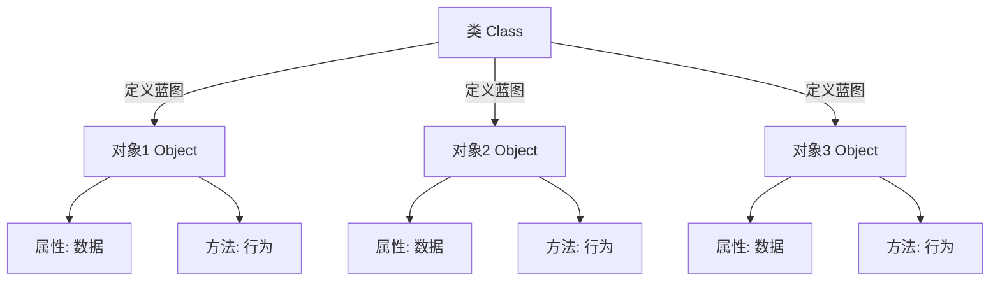
```mermaid
graph TD
    A[类 Class] -->|定义蓝图| B[对象1 Object]
    A -->|定义蓝图| C[对象2 Object]
    A -->|定义蓝图| D[对象3 Object]

    B --> E[属性: 数据]
    B --> F[方法: 行为]
    C --> G[属性: 数据]
    C --> H[方法: 行为]

    D --> I[属性: 数据]
    D --> J[方法: 行为]
```

### 2.3 核心概念解析

| 概念                        | 定义               | 类比                 |
|:---------------------------:|:------------------:|:------------------:|
| **类（Class）**             | 对象的蓝图/模板    | 建筑设计图           |
| **对象（Object）**          | 类的具体实例       | 根据设计图建造的房子 |
| **属性（Attribute）**       | 对象存储的数据     | 房子的颜色、面积     |
| **方法（Method）**          | 对象可以执行的操作 | 房子可以开门、关窗   |
| **实例化（Instantiation）** | 创建对象的过程     | 根据设计图建造房子   |

**在配套的 Notebook 中**，你将：

- ✅ 创建第一个类：`Person` 类
- ✅ 理解 `self` 的含义（为什么几乎每个方法都有它？）
- ✅ 对比函数和类的实际使用场景
- ✅ 实践：从函数重构到类

---

## 3. 面向对象的四大特性和类图表示

面向对象编程有四个核心特性，它们共同构成了 OOP 的理论基础。理解这四个特性，就理解了面向对象的精髓。

### 3.1 封装（Encapsulation）：隐藏复杂性

**核心思想**：将数据和操作数据的方法绑定在一起，对外只暴露必要的接口，隐藏内部实现细节。

想象一个遥控器：你只需要按按钮就能控制电视，不需要知道内部的电路是如何工作的。这就是封装的思想。

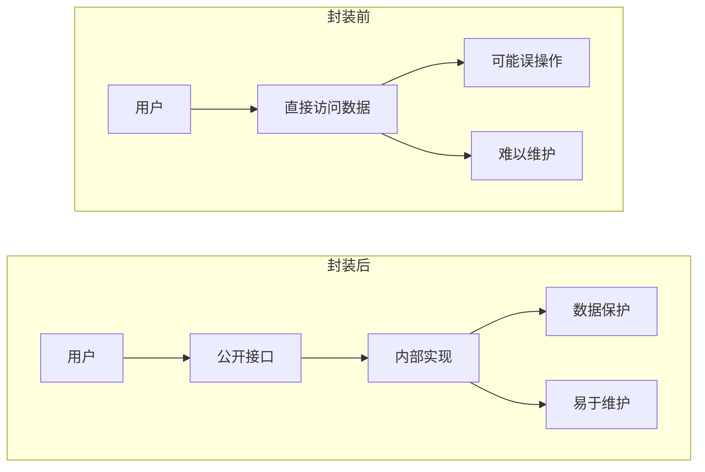
```mermaid
graph TB
    subgraph 封装前
    A1[用户] --> A2[直接访问数据]
    A2 --> A3[可能误操作]
    A2 --> A4[难以维护]
    end

    subgraph 封装后
    B1[用户] --> B2[公开接口]
    B2 --> B3[内部实现]
    B3 --> B4[数据保护]
    B3 --> B5[易于维护]
    end
    
    封装前~~~封装后
```

**封装的三个层次**：

1. **公有（Public）**：任何人都可以访问
2. **受保护（Protected）**：只有类内部和子类可以访问（单下划线 `_`）
3. **私有（Private）**：只有类内部可以访问（双下划线 `__`）

**为什么需要封装？**

- 🛡️ **数据安全**：防止外部代码随意修改内部数据
- 🎭 **隐藏复杂性**：用户只需知道"做什么"，不需要知道"怎么做"
- 🔧 **易于维护**：内部实现可以改变，不影响外部代码

**在神经网络中的应用**：
神经元的权重和偏置是内部细节，用户只需要调用 `forward()` 方法进行前向传播，不需要关心权重是如何初始化的、计算过程是怎样的。

**在配套的 Notebook 中**，你将：

- ✅ 实现一个 `BankAccount` 类，保护账户余额
- ✅ 使用 `@property` 装饰器创建优雅的接口
- ✅ 理解公有、受保护、私有属性的区别
- ✅ 实践：为神经元类添加封装

---

### 3.2 继承（Inheritance）：代码复用的艺术

**核心思想**：子类可以继承父类的属性和方法，实现代码复用，同时可以添加新功能或修改现有功能。

继承就像家族传承：孩子继承了父母的基因（属性）和技能（方法），同时也可以发展出自己的特点。

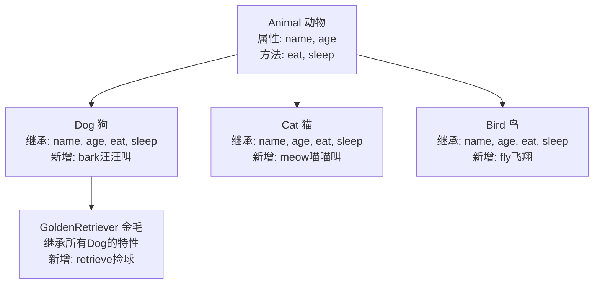
```mermaid
graph TD
    A[Animal 动物<br/>属性: name, age<br/>方法: eat, sleep]

    A --> B[Dog 狗<br/>继承: name, age, eat, sleep<br/>新增: bark汪汪叫]

    A --> C[Cat 猫<br/>继承: name, age, eat, sleep<br/>新增: meow喵喵叫]

    A --> D[Bird 鸟<br/>继承: name, age, eat, sleep<br/>新增: fly飞翔]

    B --> E[GoldenRetriever 金毛<br/>继承所有Dog的特性<br/>新增: retrieve捡球]
```

**继承的层次结构**：

- **父类（Parent Class）**：也叫基类、超类
- **子类（Child Class）**：也叫派生类
- **多层继承**：子类可以继续被继承

**继承的好处**：

- ♻️ **代码复用**：避免重复编写相同的代码
- 🎯 **逻辑清晰**：体现"是一个"（is-a）的关系
- 🔄 **易于扩展**：添加新功能不影响原有代码

**在神经网络中的应用**：
所有的层（全连接层、卷积层、池化层）都可以继承自一个基础的 `Layer` 类，共享前向传播和反向传播的基本框架，同时实现各自特定的计算逻辑。

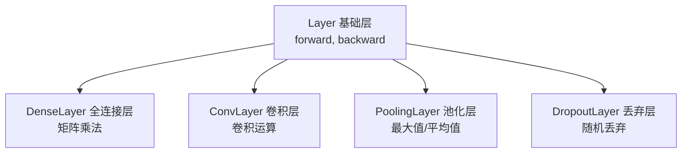
```mermaid
graph TD
    A[Layer 基础层<br/>forward, backward]

    A --> B[DenseLayer 全连接层<br/>矩阵乘法]
    A --> C[ConvLayer 卷积层<br/>卷积运算]
    A --> D[PoolingLayer 池化层<br/>最大值/平均值]
    A --> E[DropoutLayer 丢弃层<br/>随机丢弃]
```

**在配套的 Notebook 中**，你将：

- ✅ 创建动物类的继承层次结构
- ✅ 理解方法重写（Override）
- ✅ 使用 `super()` 调用父类方法
- ✅ 实践：构建神经网络层的继承体系

---

### 3.3 多态（Polymorphism）：统一接口，不同实现

**核心思想**：不同的对象可以响应相同的方法调用，但表现出不同的行为。

多态就像"说话"这个动作：人类说话、狗叫、猫叫，都是"发出声音"，但具体的声音完全不同。我们可以统一调用 `speak()` 方法，但每种动物会发出自己特有的声音。

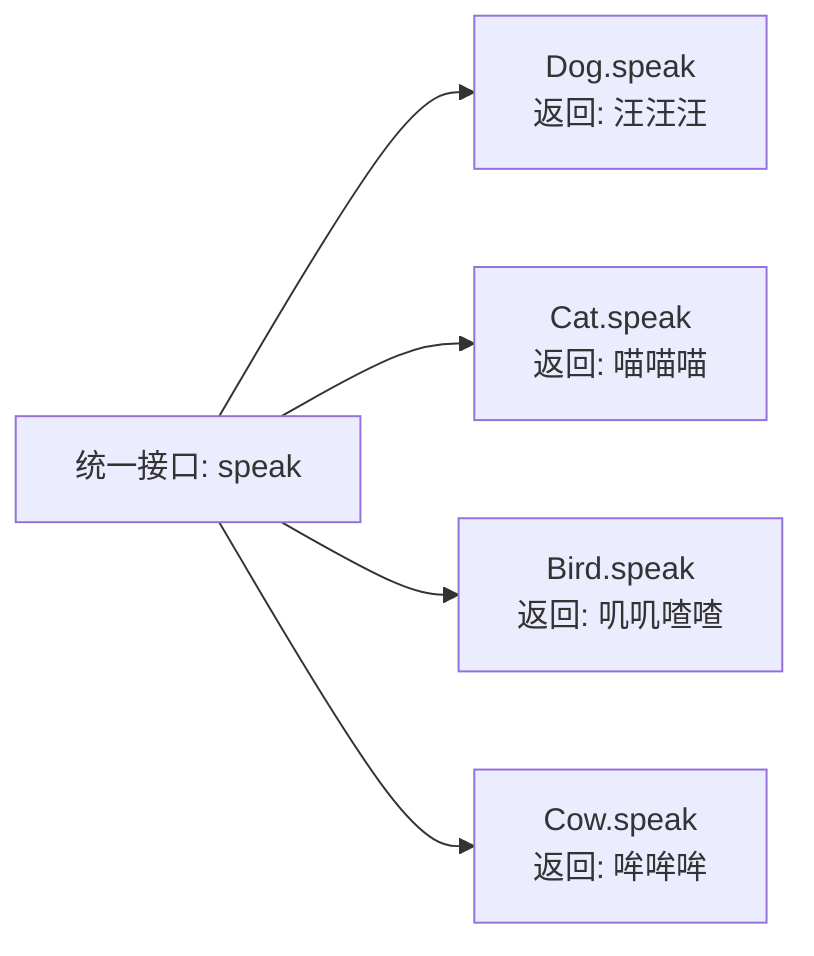
```mermaid
graph LR
    A[统一接口: speak] --> B[Dog.speak<br/>返回: 汪汪汪]
    A --> C[Cat.speak<br/>返回: 喵喵喵]
    A --> D[Bird.speak<br/>返回: 叽叽喳喳]
    A --> E[Cow.speak<br/>返回: 哞哞哞]
```

**多态的威力**：

- 🎭 **统一接口**：不需要关心对象的具体类型
- 🔌 **可插拔**：可以随时替换不同的实现
- 📈 **可扩展**：添加新类型不需要修改现有代码

**多态的实现方式**：

1. **方法重写（Override）**：子类重新定义父类的方法
2. **鸭子类型（Duck Typing）**：如果它走起来像鸭子，叫起来像鸭子，那它就是鸭子

**在神经网络中的应用**：
不同的激活函数（ReLU、Sigmoid、Tanh）都有 `forward()` 和 `backward()` 方法，我们可以统一调用，而不需要关心具体是哪种激活函数。

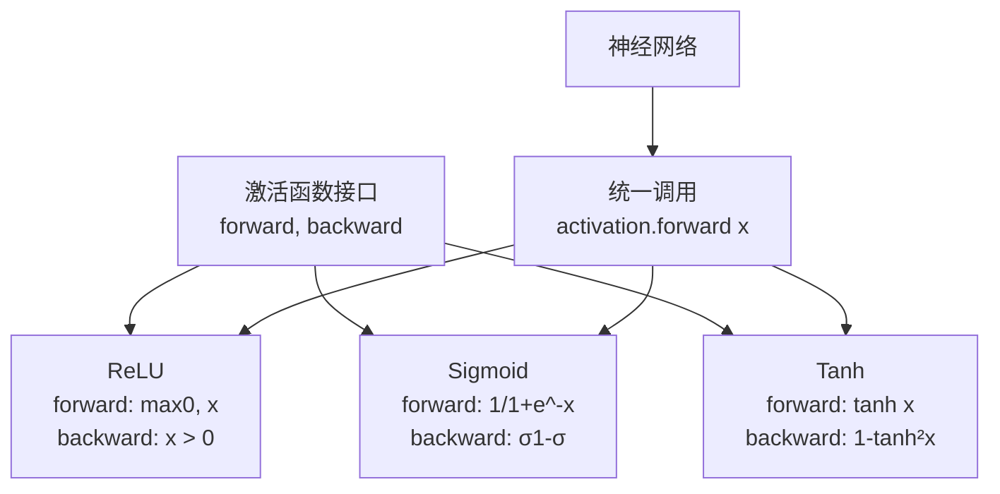
```mermaid
graph TD
    A[激活函数接口<br/>forward, backward]

    A --> B[ReLU<br/>forward: max0, x<br/>backward: x > 0]
    A --> C[Sigmoid<br/>forward: 1/1+e^-x<br/>backward: σ1-σ]
    A --> D[Tanh<br/>forward: tanh x<br/>backward: 1-tanh²x]

    E[神经网络] --> F[统一调用<br/>activation.forward x]
    F --> B
    F --> C
    F --> D
```

**在配套的 Notebook 中**，你将：

- ✅ 实现不同形状类的 `area()` 方法
- ✅ 创建激活函数的多态接口
- ✅ 理解鸭子类型的实际应用
- ✅ 实践：构建可插拔的神经网络组件

---

### 3.4 抽象（Abstraction）：定义规范

**核心思想**：提取共同特征，定义接口规范，强制子类实现必要的方法。

抽象就像制定标准：USB 接口定义了标准，所有 USB 设备都必须遵守这个标准，但具体的实现（U盘、鼠标、键盘）各不相同。

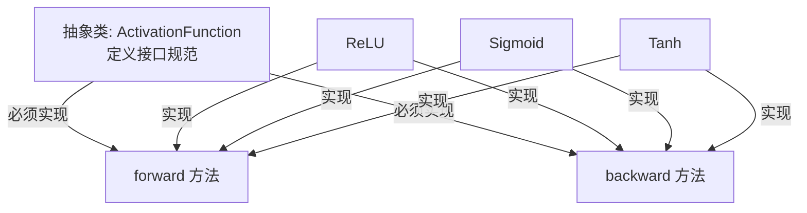
```mermaid
graph TD
    A[抽象类: ActivationFunction<br/>定义接口规范]

    A -->|必须实现| B[forward 方法]
    A -->|必须实现| C[backward 方法]

    D[ReLU] -->|实现| B
    D -->|实现| C

    E[Sigmoid] -->|实现| B
    E -->|实现| C

    F[Tanh] -->|实现| B
    F -->|实现| C
```

**抽象的好处**：

- 📋 **定义规范**：明确子类必须实现哪些方法
- 🔒 **强制约束**：抽象类不能直接实例化
- 🎯 **接口统一**：保证所有子类都有相同的接口

**抽象类 vs 普通类**：

| 特性                 | 普通类   | 抽象类       |
|:------------------:|:--------:|:------------:|
| 可以实例化           | ✅ 是    | ❌ 否        |
| 可以有抽象方法       | ❌ 否    | ✅ 是        |
| 子类必须实现抽象方法 | -        | ✅ 是        |
| 用途                 | 直接使用 | 定义接口规范 |

**在神经网络中的应用**：
定义一个抽象的 `Layer` 类，规定所有层都必须实现 `forward()` 和 `backward()` 方法。这样可以保证所有层都有统一的接口，便于组合和管理。

**在配套的 Notebook 中**，你将：

- ✅ 使用 `ABC` 创建抽象基类
- ✅ 定义激活函数的抽象接口
- ✅ 实现多种激活函数
- ✅ 实践：为神经网络层定义抽象接口

### 3.5 类图表示法：UML 类图

在软件工程中，我们使用 **UML 类图（Unified Modeling Language Class Diagram）** 来可视化类的结构。类图清晰地展示了类的属性、方法以及类之间的关系。

#### 基本的类图结构

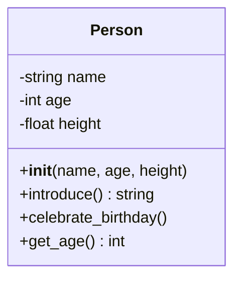
```mermaid
classDiagram
    class Person {
        -string name
        -int age
        -float height
        +__init__(name, age, height)
        +introduce() string
        +celebrate_birthday()
        +get_age() int
    }
```

**类图的三个部分**：
1. **类名**（顶部）：`Person`
2. **属性**（中间）：`name`, `age`, `height`
3. **方法**（底部）：`introduce()`, `celebrate_birthday()`

**符号说明**：
- `-` 表示私有（private）
- `+` 表示公有（public）
- `#` 表示受保护（protected）

#### 类之间的关系

类图不仅展示单个类的结构，还能表示类之间的关系：

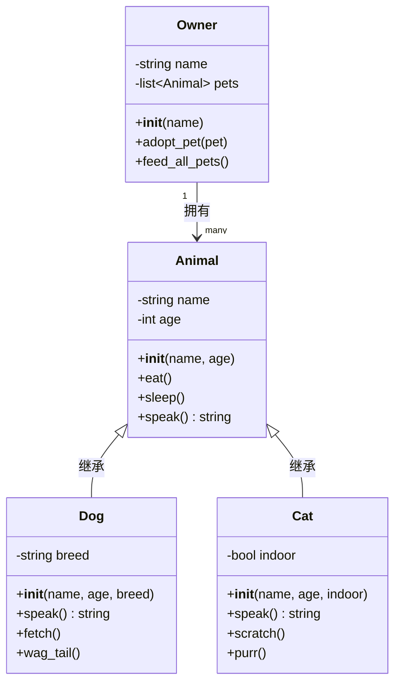
```mermaid
classDiagram
    class Animal {
        -string name
        -int age
        +__init__(name, age)
        +eat()
        +sleep()
        +speak() string
    }
    
    class Dog {
        -string breed
        +__init__(name, age, breed)
        +speak() string
        +fetch()
        +wag_tail()
    }
    
    class Cat {
        -bool indoor
        +__init__(name, age, indoor)
        +speak() string
        +scratch()
        +purr()
    }
    
    class Owner {
        -string name
        -list~Animal~ pets
        +__init__(name)
        +adopt_pet(pet)
        +feed_all_pets()
    }
    
    Animal <|-- Dog : 继承
    Animal <|-- Cat : 继承
    Owner "1" --> "many" Animal : 拥有
```

**关系类型说明**：

| 关系 | 符号 | 含义 | 示例 |
|:------------------:|:------:|:------:|:------:|
| **继承** | `<|--` | "是一个"关系 | Dog 是一个 Animal |
| **组合** | `*--` | "包含"关系（强） | Car 包含 Engine |
| **聚合** | `o--` | "拥有"关系（弱） | Owner 拥有 Pet |
| **关联** | `-->` | "使用"关系 | Student 使用 Library |
| **依赖** | `..>` | "依赖"关系 | Class 依赖 Library |

### 3.6 类图的阅读技巧

**从上到下看**：
1. 先看类名，了解这是什么
2. 再看属性，了解它有什么数据
3. 最后看方法，了解它能做什么

**从左到右看**：
1. 先看单个类的结构
2. 再看类之间的关系
3. 理解整个系统的架构

**符号速查表**：

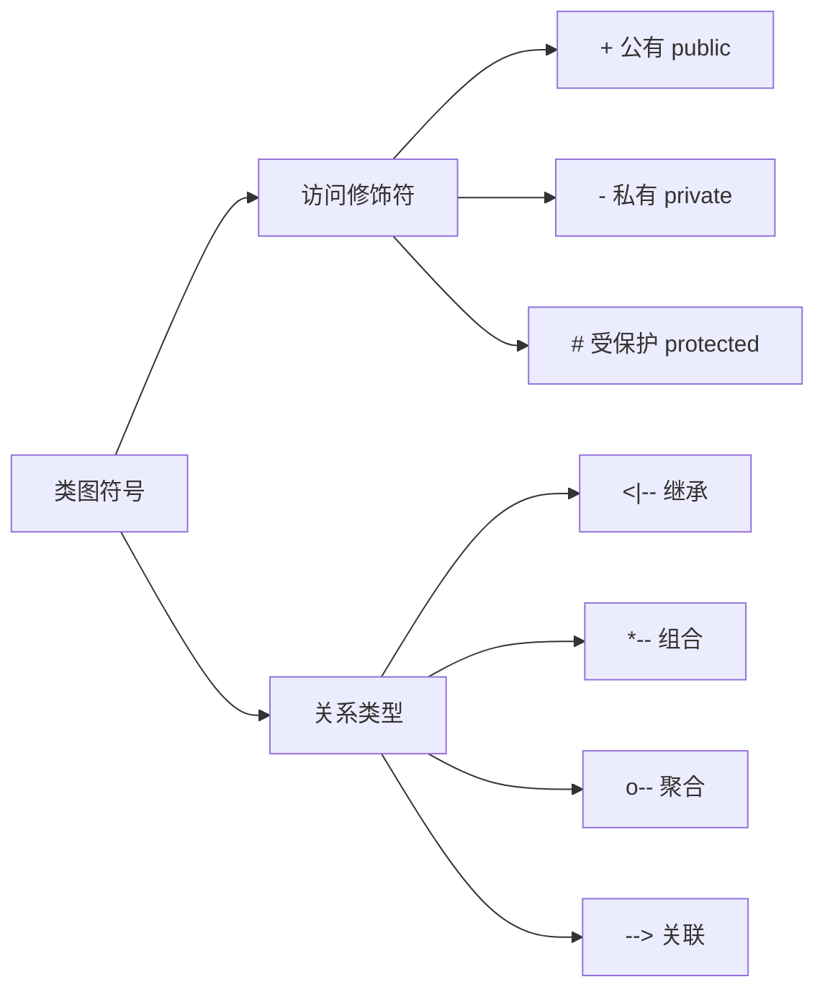
```mermaid
graph LR
    A[类图符号] --> B[访问修饰符]
    A --> C[关系类型]
    
    B --> B1["+ 公有 public"]
    B --> B2["- 私有 private"]
    B --> B3["# 受保护 protected"]
    
    C --> C1["<|-- 继承"]
    C --> C2["*-- 组合"]
    C --> C3["o-- 聚合"]
    C --> C4["--> 关联"]
```

---

## 4. 特殊方法：让对象更像内置类型

Python 的类可以定义**特殊方法（Magic Methods）**，也叫**魔法方法**或**双下划线方法**。这些方法让你的自定义对象可以像内置类型一样使用。

### 常用魔法方法一览

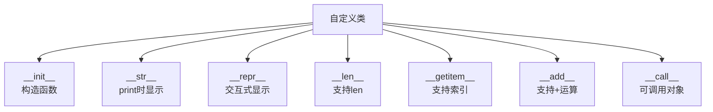
```mermaid
graph TD
    A[自定义类] --> B[__init__<br/>构造函数]
    A --> C[__str__<br/>print时显示]
    A --> D[__repr__<br/>交互式显示]
    A --> E[__len__<br/>支持len]
    A --> F[__getitem__<br/>支持索引]
    A --> G[__add__<br/>支持+运算]
    A --> H[__call__<br/>可调用对象]
```

### 魔法方法的分类

| 类别           | 方法                                    | 作用             | 示例                 |
|:------------------:|:----------------------------------:|:------------------:|:------------------:|
| **初始化**     | `__init__`                              | 构造函数         | `obj = MyClass()`    |
| **字符串表示** | `__str__`, `__repr__`                   | 对象的字符串形式 | `print(obj)`         |
| **运算符重载** | `__add__`, `__sub__`, `__mul__`         | 支持数学运算     | `obj1 + obj2`        |
| **容器操作**   | `__len__`, `__getitem__`, `__setitem__` | 像列表一样使用   | `len(obj)`, `obj[0]` |
| **比较操作**   | `__eq__`, `__lt__`, `__gt__`            | 支持比较         | `obj1 == obj2`       |
| **可调用**     | `__call__`                              | 像函数一样调用   | `obj()`              |

### 为什么需要魔法方法？

魔法方法让你的自定义类可以：

- 🎨 **更自然**：像使用内置类型一样使用自定义对象
- 🔧 **更灵活**：支持运算符重载和特殊操作
- 📚 **更 Pythonic**：符合 Python 的编程风格

**在神经网络中的应用**：

- `__call__` 方法让神经网络可以像函数一样调用：`output = network(input)`
- `__repr__` 方法让我们可以清晰地查看网络结构
- `__len__` 方法返回网络的层数

**在配套的 Notebook 中**，你将：

- ✅ 实现一个完整的 `Vector` 类，支持加法、减法、点积
- ✅ 实现一个 `Matrix` 类，支持矩阵运算
- ✅ 让神经网络支持 `network(x)` 的调用方式
- ✅ 实践：为神经元类添加魔法方法

---

## 5. 类属性 vs 实例属性：共享与独立

在面向对象编程中，属性可以分为两类：**类属性**和**实例属性**。理解它们的区别对于正确使用类至关重要。

### 实例属性：每个对象独有

实例属性是每个对象独立拥有的数据，通过 `self` 定义。就像每个学生都有自己的姓名和成绩，互不影响。

### 类属性：所有对象共享

类属性是所有对象共享的数据，定义在类中但在方法外。就像所有学生都属于同一所学校，这个"学校"信息是共享的。

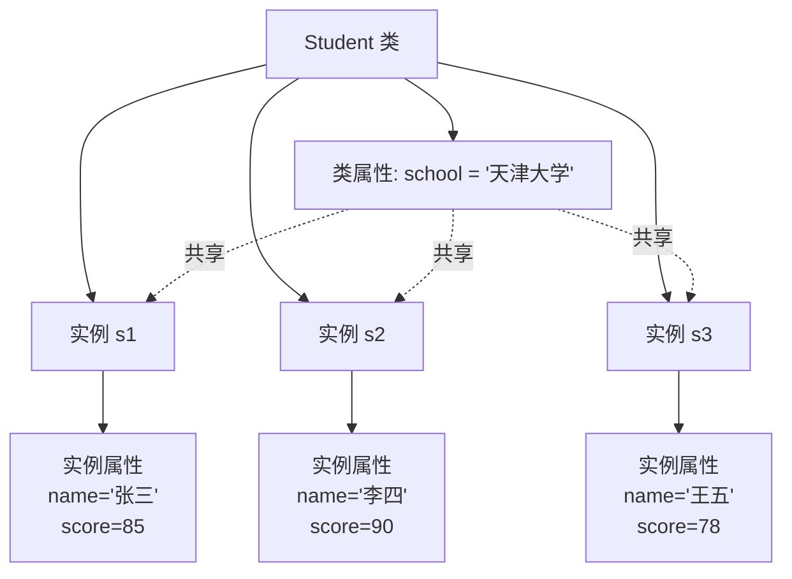
```mermaid
graph TD
    A[Student 类] --> B[类属性: school = '天津大学']

    A --> C[实例 s1]
    A --> D[实例 s2]
    A --> E[实例 s3]

    C --> F[实例属性<br/>name='张三'<br/>score=85]
    D --> G[实例属性<br/>name='李四'<br/>score=90]
    E --> H[实例属性<br/>name='王五'<br/>score=78]

    B -.共享.-> C
    B -.共享.-> D
    B -.共享.-> E
```

### 何时使用类属性？

- 📊 **统计信息**：记录创建了多少个对象
- ⚙️ **配置参数**：所有对象共享的配置
- 🔧 **工具方法**：不依赖实例数据的方法

**在神经网络中的应用**：

- 类属性可以存储默认的学习率、激活函数类型
- 类方法可以用于加载预训练模型

**在配套的 Notebook 中**，你将：

- ✅ 对比类属性和实例属性的行为
- ✅ 使用类属性统计对象数量
- ✅ 理解类方法（`@classmethod`）和静态方法（`@staticmethod`）
- ✅ 实践：为神经网络添加全局配置

---

## 6. 实战案例：构建学生管理系统

现在，让我们将所学的面向对象知识应用到一个更贴近生活的例子——**学生管理系统**。

### 6.1 设计思路

一个学生管理系统需要：

- **学生信息管理**：姓名、学号、班级、年龄等基本信息
- **成绩管理**：各科成绩、平均分、排名计算
- **课程管理**：课程列表、学分、成绩记录
- **数据验证**：确保成绩在0-100分之间
- **数据统计**：计算班级平均分、及格率等

### 6.2 学生类的结构

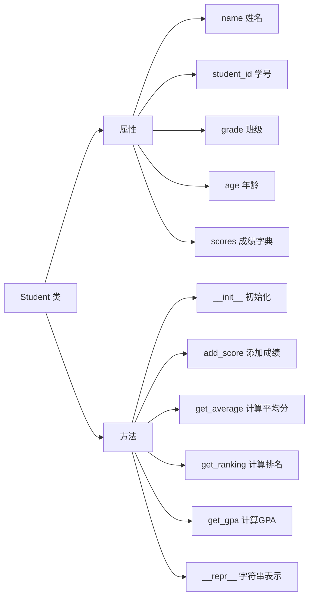
```mermaid
graph LR
    A[Student 类]

    A --> B[属性]
    B --> B1[name 姓名]
    B --> B2[student_id 学号]
    B --> B3[grade 班级]
    B --> B4[age 年龄]
    B --> B5[scores 成绩字典]

    A --> C[方法]
    C --> C1[__init__ 初始化]
    C --> C2[add_score 添加成绩]
    C --> C3[get_average 计算平均分]
    C --> C4[get_ranking 计算排名]
    C --> C5[get_gpa 计算GPA]
    C --> C6[__repr__ 字符串表示]
```

### 6.3 代码实现

```python
class Student:
    """学生类：管理学生信息和成绩"""
    
    def __init__(self, name, student_id, grade, age=18):
        """
        初始化学生对象
        
        参数:
            name: 学生姓名
            student_id: 学号
            grade: 班级
            age: 年龄（默认18岁）
        """
        self.name = name
        self.student_id = student_id
        self.grade = grade
        self.age = age
        self.scores = {}  # 用字典存储课程成绩
        self.total_credits = 0  # 总学分
    
    def add_score(self, subject, score, credit=1.0):
        """
        添加课程成绩
        
        参数:
            subject: 课程名称
            score: 成绩（0-100分）
            credit: 学分（默认1.0）
        
        返回:
            bool: 是否添加成功
        """
        if not 0 <= score <= 100:
            print(f"错误：{self.name}的{subject}成绩{score}分超出范围（0-100）")
            return False
        
        self.scores[subject] = {
            'score': score,
            'credit': credit
        }
        self.total_credits += credit
        return True
    
    def get_average(self):
        """计算平均分（按学分加权）"""
        if not self.scores:
            return 0.0
        
        total_weighted_score = sum(
            info['score'] * info['credit'] 
            for info in self.scores.values()
        )
        
        return total_weighted_score / self.total_credits if self.total_credits > 0 else 0.0
    
    def get_gpa(self):
        """计算GPA（4.0制）"""
        if not self.scores:
            return 0.0
        
        total_gpa_points = sum(
            self._score_to_gpa(info['score']) * info['credit'] 
            for info in self.scores.values()
        )
        
        return total_gpa_points / self.total_credits if self.total_credits > 0 else 0.0
    
    def _score_to_gpa(self, score):
        """将分数转换为GPA（私有方法）"""
        if score >= 90:
            return 4.0
        elif score >= 85:
            return 3.7
        elif score >= 82:
            return 3.3
        elif score >= 78:
            return 3.0
        elif score >= 75:
            return 2.7
        elif score >= 72:
            return 2.3
        elif score >= 68:
            return 2.0
        elif score >= 64:
            return 1.5
        elif score >= 60:
            return 1.0
        else:
            return 0.0
    
    def get_passed_subjects(self):
        """获取及格的课程列表"""
        return [
            subject for subject, info in self.scores.items() 
            if info['score'] >= 60
        ]
    
    def __repr__(self):
        """字符串表示，方便打印"""
        avg_score = self.get_average()
        gpa = self.get_gpa()
        return f"学生({self.name}, {self.student_id}, {self.grade}, 平均分={avg_score:.2f}, GPA={gpa:.2f})"
```

### 6.4 面向对象的优势体现

| 特性         | 传统方式（字典/列表） | 面向对象方式         |
|:------------------:|:------------------:|:------------------:|
| **数据管理** | 多个字典，容易混乱     | 学生对象封装所有数据 |
| **数据验证** | 需要在每个函数中检查   | 在方法内统一验证      |
| **代码复用** | 复制粘贴计算函数       | 创建多个学生对象      |
| **可读性**   | 需要记住字典键名       | 方法名自解释          |
| **扩展性**   | 修改所有相关函数       | 添加新方法即可        |

### 6.5 使用示例

```python
# 创建几个学生
student1 = Student("张三", "2023001", "计算机1班", 19)
student2 = Student("李四", "2023002", "计算机1班", 18)
student3 = Student("王五", "2023003", "计算机2班", 20)

# 添加成绩
student1.add_score("数学", 85, 3.0)
student1.add_score("英语", 78, 2.0)
student1.add_score("计算机", 92, 4.0)

student2.add_score("数学", 72, 3.0)
student2.add_score("英语", 88, 2.0)
student2.add_score("计算机", 65, 4.0)

# 查看学生信息
print(student1)  # 自动调用 __repr__ 方法
print(f"及格课程: {student1.get_passed_subjects()}")
print(f"GPA: {student1.get_gpa():.2f}")

# 批量处理
students = [student1, student2, student3]
for student in students:
    print(f"{student.name} 的平均分: {student.get_average():.2f}")
```

**在配套的 Notebook 中**，你将：

- ✅ 从零开始构建 `Student` 类
- ✅ 实现成绩添加、平均分计算、GPA计算
- ✅ 添加数据验证和错误处理
- ✅ 测试学生类的功能
- ✅ 处理多个学生的数据

---

## 7. 从学生到班级管理系统：组合的力量

有了 `Student` 类，我们可以进一步构建 `Classroom` 类来管理整个班级。这展示了面向对象编程中的**组合（Composition）**思想。

### 7.1 班级管理系统架构

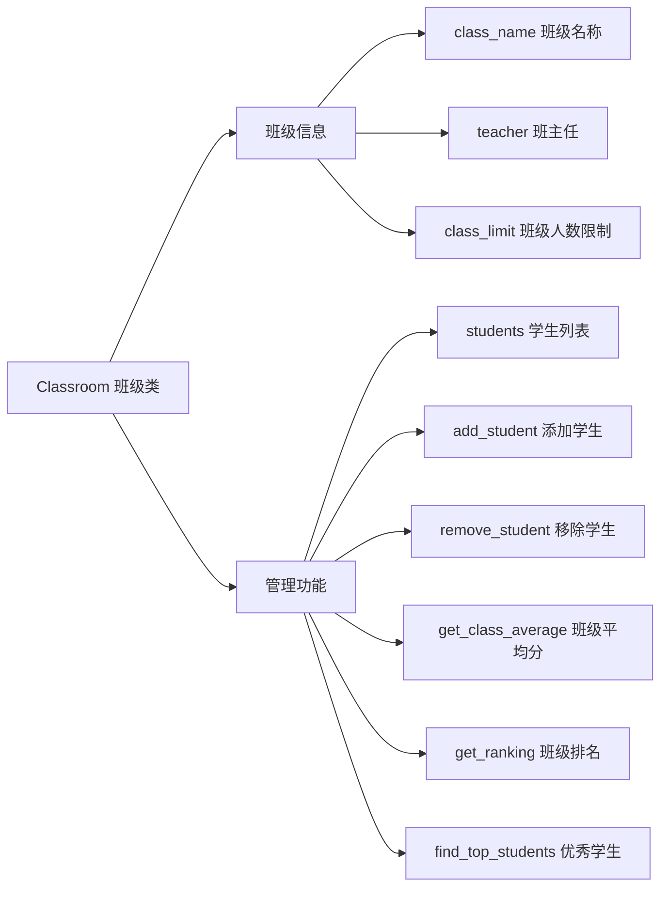
```mermaid
graph LR
    A[Classroom 班级类]

    A --> B[班级信息]
    B --> B1[class_name 班级名称]
    B --> B2[teacher 班主任]
    B --> B3[class_limit 班级人数限制]

    A --> C[管理功能]
    C --> C1[students 学生列表]
    C --> C2[add_student 添加学生]
    C --> C3[remove_student 移除学生]
    C --> C4[get_class_average 班级平均分]
    C --> C5[get_ranking 班级排名]
    C --> C6[find_top_students 优秀学生]
```

### 7.2 班级类的实现

```python
class Classroom:
    """班级类：管理整个班级的学生和成绩"""
    
    def __init__(self, class_name, teacher, limit=30):
        """
        初始化班级
        
        参数:
            class_name: 班级名称
            teacher: 班主任姓名
            limit: 班级人数限制（默认30人）
        """
        self.class_name = class_name
        self.teacher = teacher
        self.limit = limit
        self.students = []  # 学生列表
    
    def add_student(self, student):
        """添加学生到班级"""
        if len(self.students) >= self.limit:
            print(f"班级已满（{self.limit}人），无法添加{student.name}")
            return False
        
        if self.find_student(student.student_id):
            print(f"学号{student.student_id}已存在，无法重复添加")
            return False
        
        self.students.append(student)
        return True
    
    def remove_student(self, student_id):
        """根据学号移除学生"""
        for i, student in enumerate(self.students):
            if student.student_id == student_id:
                removed = self.students.pop(i)
                print(f"已移除学生: {removed.name}")
                return True
        
        print(f"未找到学号为{student_id}的学生")
        return False
    
    def find_student(self, student_id):
        """根据学号查找学生"""
        for student in self.students:
            if student.student_id == student_id:
                return student
        return None
    
    def get_class_average(self):
        """计算班级平均分"""
        if not self.students:
            return 0.0
        
        total = sum(student.get_average() for student in self.students)
        return total / len(self.students)
    
    def get_ranking(self):
        """获取班级排名（按平均分降序）"""
        ranked = sorted(self.students, key=lambda s: s.get_average(), reverse=True)
        return [(rank + 1, student) for rank, student in enumerate(ranked)]
    
    def find_top_students(self, n=5):
        """找出班级前N名优秀学生"""
        return [student for student in self.get_ranking()[:n]]
    
    def get_passed_rate(self, subject=None):
        """获取及格率"""
        if not self.students:
            return 0.0
        
        passed_count = 0
        total_count = 0
        
        for student in self.students:
            if subject:
                if subject in student.scores:
                    if student.scores[subject]['score'] >= 60:
                        passed_count += 1
                    total_count += 1
            else:
                if student.get_average() >= 60:
                    passed_count += 1
                total_count += 1
        
        return passed_count / total_count if total_count > 0 else 0.0
    
    def __repr__(self):
        """班级的字符串表示"""
        return f"班级({self.class_name}, 班主任:{self.teacher}, 学生数:{len(self.students)}/{self.limit})"
```

### 7.3 组合的优势展示

| 关系类型   | 继承（is-a）     | 组合（has-a）         |
|:------------------:|:------------------:|:------------------:|
| **含义**   | "是一个"           | "有一个"               |
| **学生示例** | 不适用             | 班级**有**多个学生     |
| **耦合度** | 高（子类依赖父类） | 低（可以替换学生类）   |
| **灵活性** | 较低               | 较高（班级可以扩展）   |
| **使用场景** | 明确的层次关系     | 组件可以独立变化       |

**在班级管理系统中**：
- `ComputerClass` **is a** `Classroom`（继承 - 可创建计算机专业的特殊班级）
- `Classroom` **has many** `Student`（组合 - 班级包含多个学生）

### 7.4 实际应用示例

```python
# 创建班级
computer_class = Classroom("计算机1班", "王老师", limit=5)

# 添加学生
computer_class.add_student(student1)
computer_class.add_student(student2)
computer_class.add_student(student3)

# 班级统计
print(computer_class)
print(f"班级平均分: {computer_class.get_class_average():.2f}")
print(f"班级及格率: {computer_class.get_passed_rate():.2%}")

# 班级排名
print("\n班级排名:")
for rank, (rank_num, student) in enumerate(computer_class.get_ranking(), 1):
    print(f"第{rank}名: {student.name}, 平均分: {student.get_average():.2f}")

# 查找优秀学生
print("\n前2名优秀学生:")
for rank, student in computer_class.find_top_students(2):
    print(f"第{rank}名: {student.name}")
```

### 7.5 继承的示例

如果我们需要创建一个特殊的班级类型，比如**研究生班级**，可以继承 `Classroom`：

```python
class GraduateClassroom(Classroom):
    """研究生班级：添加特殊功能"""
    
    def __init__(self, class_name, teacher, limit=20, research_direction="AI"):
        """初始化研究生班级"""
        super().__init__(class_name, teacher, limit)
        self.research_direction = research_direction
        self.advisors = {}  # 导师分配字典
    
    def assign_advisor(self, student_id, advisor_name):
        """为研究生分配导师"""
        student = self.find_student(student_id)
        if student:
            self.advisors[student_id] = advisor_name
            print(f"已为{student.name}分配导师: {advisor_name}")
        else:
            print(f"未找到学号为{student_id}的学生")
    
    def get_research_stats(self):
        """获取研究方向统计"""
        return f"研究生班级研究方向: {self.research_direction}, 导师数量: {len(self.advisors)}"
```

**在配套的 Notebook 中**，你将：

- ✅ 构建 `Classroom` 类（包含多个学生）
- ✅ 实现班级管理功能（添加、删除、查询）
- ✅ 计算班级统计数据（平均分、排名、及格率）
- ✅ 实现继承机制创建研究生班级
- ✅ 测试完整的班级管理系统

---

## 8. 面向对象 vs 面向过程：何时使用？

理解了面向对象后，一个自然的问题是：什么时候用面向对象，什么时候用面向过程？

### 对比分析

| 维度         | 面向过程         | 面向对象         |
|:------------------:|:------------------:|:------------------:|
| **核心**     | 函数和步骤       | 对象和交互       |
| **数据**     | 全局变量或参数   | 封装在对象中     |
| **适用场景** | 简单脚本、算法   | 复杂系统、框架   |
| **代码复用** | 函数调用         | 继承和组合       |
| **维护性**   | 较难（数据分散） | 较易（逻辑集中） |
| **学习曲线** | 平缓             | 陡峭             |

### 实际选择建议

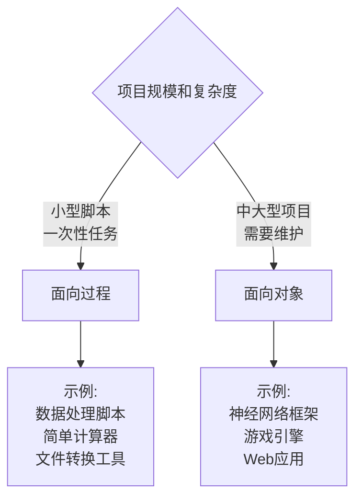
```mermaid
graph TD
    A{项目规模和复杂度}

    A -->|小型脚本<br/>一次性任务| B[面向过程]
    A -->|中大型项目<br/>需要维护| C[面向对象]

    B --> D[示例:<br/>数据处理脚本<br/>简单计算器<br/>文件转换工具]

    C --> E[示例:<br/>神经网络框架<br/>游戏引擎<br/>Web应用]
```

**关键判断标准**：

- 🔄 **是否需要复用**：如果需要创建多个相似的实体，用面向对象
- 📈 **是否会扩展**：如果未来可能添加新功能，用面向对象
- 🧩 **是否有层次**：如果有明确的分类关系，用面向对象
- ⏱️ **开发时间**：如果是快速原型，面向过程更快

---

## 9. 为什么神经网络需要面向对象？

### 复杂性管理

现代神经网络包含大量组件，如果不用面向对象，代码会变得难以管理：

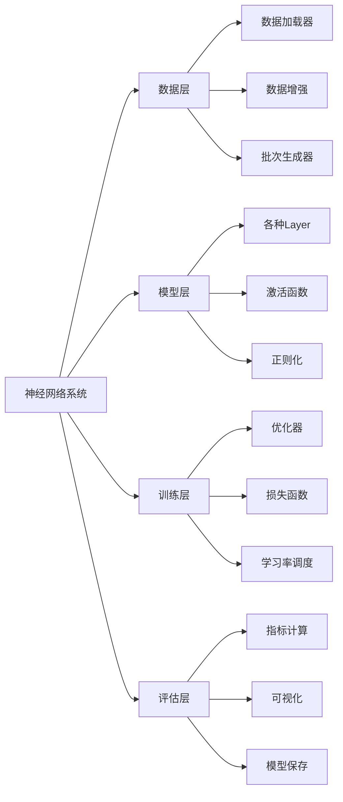
```mermaid
graph LR
    A[神经网络系统]

    A --> B[数据层]
    B --> B1[数据加载器]
    B --> B2[数据增强]
    B --> B3[批次生成器]

    A --> C[模型层]
    C --> C1[各种Layer]
    C --> C2[激活函数]
    C --> C3[正则化]

    A --> D[训练层]
    D --> D1[优化器]
    D --> D2[损失函数]
    D --> D3[学习率调度]

    A --> E[评估层]
    E --> E1[指标计算]
    E --> E2[可视化]
    E --> E3[模型保存]
```

**面向对象的优势**：

- 每个组件都是独立的类
- 通过继承实现代码复用
- 通过组合灵活搭建网络
- 易于测试和调试

### 真实框架的设计

PyTorch 和 TensorFlow 都大量使用面向对象。理解 OOP 后，你就能理解这些框架的设计思想：

**PyTorch 的核心设计**：

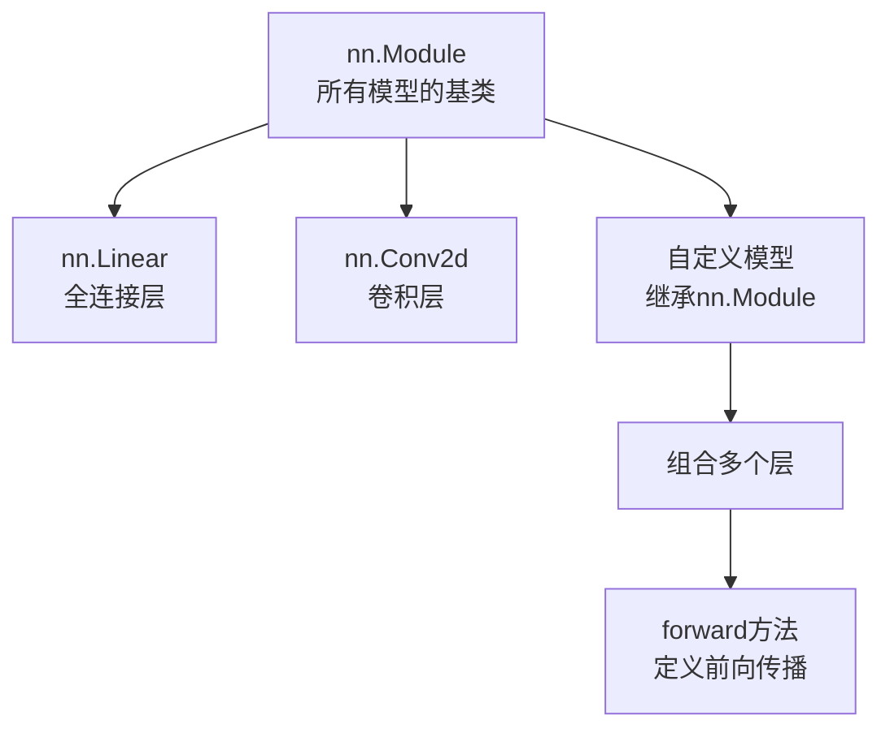
```mermaid
graph TD
    A[nn.Module<br/>所有模型的基类]

    A --> B[nn.Linear<br/>全连接层]
    A --> C[nn.Conv2d<br/>卷积层]
    A --> D[自定义模型<br/>继承nn.Module]

    D --> E[组合多个层]
    E --> F[forward方法<br/>定义前向传播]
```

---

## 10. 核心概念总结

### 思维导图

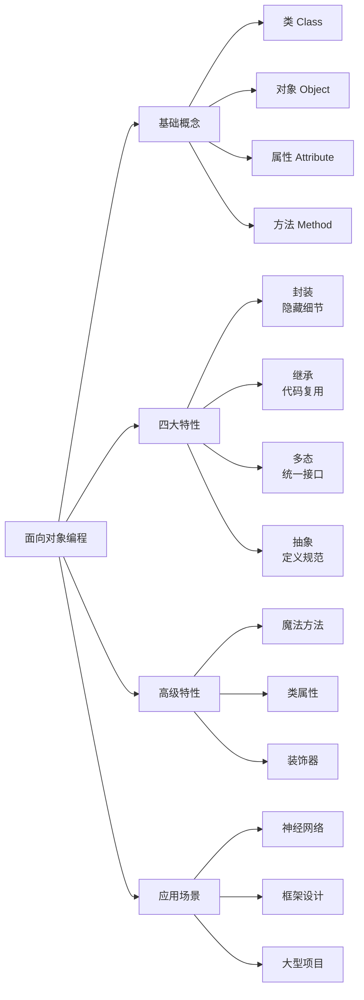
```mermaid
graph LR
    A[面向对象编程]

    A --> B[基础概念]
    B --> B1[类 Class]
    B --> B2[对象 Object]
    B --> B3[属性 Attribute]
    B --> B4[方法 Method]

    A --> C[四大特性]
    C --> C1[封装<br/>隐藏细节]
    C --> C2[继承<br/>代码复用]
    C --> C3[多态<br/>统一接口]
    C --> C4[抽象<br/>定义规范]

    A --> D[高级特性]
    D --> D1[魔法方法]
    D --> D2[类属性]
    D --> D3[装饰器]

    A --> E[应用场景]
    E --> E1[神经网络]
    E --> E2[框架设计]
    E --> E3[大型项目]
```

### 关键要点

| 概念     | 核心思想           | 记忆口诀               |
|:------------------:|:------------------:|:------------------:|
| **封装** | 数据和方法绑定     | "打包在一起"           |
| **继承** | 子类复用父类       | "站在巨人肩膀上"       |
| **多态** | 统一接口不同实现   | "同样的话，不同的意思" |
| **抽象** | 定义必须遵守的规范 | "定规矩，不管细节"     |

---

## 11. 学习路径与下一步

### 你的学习进度

```mermaid
graph LR
    A[✅ Python基础] --> B[✅ 函数]
    B --> C[✅ NumPy数组]
    C --> D[🎯 面向对象<br/>当前位置]
    D --> E[神经网络实现]
    E --> F[深度学习框架]
```

### 掌握面向对象后，你将能够：

- ✅ 理解 PyTorch 和 TensorFlow 的代码结构
- ✅ 自己设计和实现神经网络组件
- ✅ 阅读和修改开源深度学习项目
- ✅ 编写可维护的大型 Python 项目

---

## 💡 思考题

在开始 Notebook 练习之前，思考这些问题：

1. **封装的意义**：为什么神经网络的权重要设为私有属性？如果公开会有什么问题？

2. **继承的选择**：什么时候应该用继承？什么时候应该用组合？

3. **多态的应用**：如何设计一个激活函数系统，让用户可以轻松切换不同的激活函数？

4. **抽象的价值**：为什么要定义抽象基类？直接写具体的类不行吗？

**这些问题的答案，都在配套的 Notebook 中！**
