# PyTorch 基础入门

> **目标**：掌握 PyTorch 的核心概念，为深度学习打下坚实基础  
> **预备知识**：Python 基础语法、NumPy 基础  
> **配套代码**：`1.6_pytorch_basic.ipynb`

---

## 🎯 为什么学习 PyTorch？

深度学习框架的选择有很多，为什么我们要学 PyTorch？

### PyTorch vs 其他框架

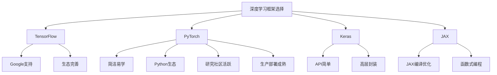

**PyTorch 的核心优势**：

- 🚀 **简洁直观**：API 设计符合 Python 风格
- 🧠 **计算图动态**：动态计算图，便于调试
- 🌐 **生态完善**：丰富的预训练模型和社区支持
- 🎓 **研究首选**：论文复现和实验的标准框架
- 📊 **部署成熟**：生产环境验证的工具链完善

---

## 🏗️ PyTorch 核心架构

### 整体架构

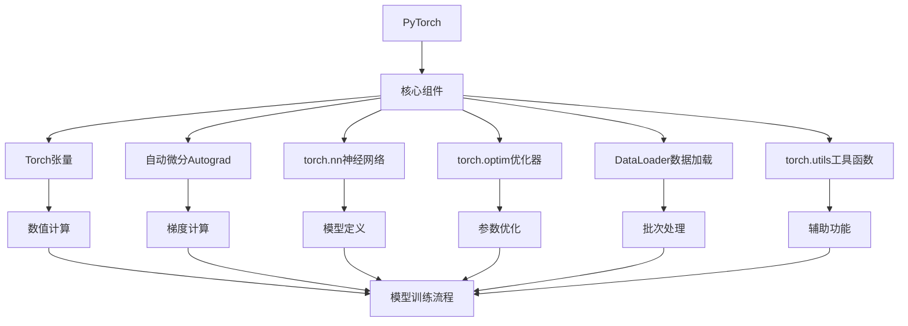

### 各组件的作用

| 组件               | 作用                                    | 典型应用场景             |
| ------------------ | --------------------------------------- | ------------------------ |
| **torch**          | 基础数学运算和张量操作                  | 数值计算、数组操作       |
| **torch.Tensor**   | PyTorch 的核心数据结构，类似 NumPy 数组 | 存储数据、梯度、模型参数 |
| **torch.autograd** | 自动计算梯度，支持反向传播              | 训练神经网络             |
| **torch.nn**       | 构建神经网络层和模型                    | 定义网络结构、激活函数   |
| **torch.optim**    | 各种优化算法（SGD、Adam 等）            | 更新模型参数             |
| **torch.utils**    | 数据加载、数据增强等工具函数            | 批量处理、数据预处理     |

---

## 🔰 1. PyTorch 张量：PyTorch 的核心数据结构

### 1.1 什么是张量？

张量（Tensor）是 PyTorch 的核心数据结构，类似于 NumPy 的数组，但具有额外的特性：

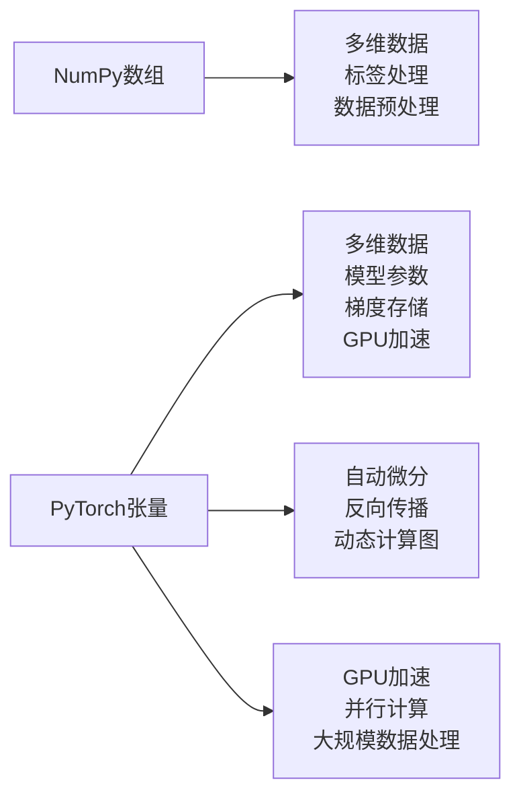

**关键区别**：

| 特性         | NumPy 数组 | PyTorch 张量    |
| ------------ | ---------- | --------------- |
| **设备支持** | CPU        | CPU / GPU / TPU |
| **自动微分** | ❌         | ✅ 支持         |
| **GPU加速**  | ❌         | ✅ 支持         |
| **反向传播** | ❌         | ✅ 支持         |

### 1.2 张量的创建方式

**方式一：从 Python 列表/数组创建**

```python
import torch

# 从 Python 列表创建张量
list_data = [[1, 2, 3], [4, 5, 6]]
tensor_from_list = torch.tensor(list_data)

# 从 NumPy 数组创建张量
import numpy as np
numpy_array = np.array([[1, 2], [3, 4]])
tensor_from_numpy = torch.from_numpy(numpy_array)
```

**方式二：直接创建特定形状的张量**

```python
import torch

# 创建全零张量
zeros_tensor = torch.zeros(2, 3)
zeros_tensor = torch.zeros_like(zeros_tensor)

# 创建全1张量
ones_tensor = torch.ones(2, 3)

# 创建随机张量（正态分布）
normal_tensor = torch.randn(2, 3)

# 创建特定值张量
filled_tensor = torch.full((2, 3), 7)
```

### 1.3 张量的基本属性

```python
import torch

tensor = torch.tensor([[1, 2, 3], [4, 5, 6]])

print(f"形状: {tensor.shape}")        # [2, 3]
print(f"数据类型: {tensor.dtype}")     # torch.float32
print(f"设备: {tensor.device}")       # cpu / cuda
print(f"是否可求导: {tensor.requires_grad}")  # False
```

### 1.4 张量的类型转换

```python
import torch

tensor = torch.tensor([1. 2, 3])

# 转换为不同类型
int_tensor = tensor.int()
float_tensor = tensor.float()
long_tensor = tensor.long()
bool_tensor = tensor.bool()

# 类型提示（推荐做法）
tensor = tensor.float()  # 推荐，更清晰
```

### 1.5 设备管理（CPU vs GPU）

```python
import torch

# 检查是否支持 CUDA
device = torch.device('cuda' if torch.cuda.is_available() else 'cpu')

# 创建张量并移动到指定设备
tensor = torch.randn(2, 3).to(device)

# 创建时直接在指定设备上创建
tensor_device = torch.randn(2, 3, device=device)
```

**设备对比表**：

| 操作         | CPU 张量 | GPU 张量 | 说明               |
| ------------ | -------- | -------- | ------------------ |
| 创建         | 快速     | 较慢     | GPU 需要数据传输   |
| 数学运算     | 慢       | 极快     | GPU 适合大规模计算 |
| 小规模计算   | 适合     | 不合适   | 数据传输开销大     |
| 深度学习训练 | 不适合   | 必须     | 模型参数多         |

---

## ➕ 2. 张量运算：向量化计算的基础

### 2.1 基本数学运算

```python
import torch

# 创建两个张量
a = torch.tensor([1, 2, 3])
b = torch.tensor([4, 5, 6])

# 加法
result_add = a + b  # tensor([5, 7, 9])

# 减法
result_sub = a - b  # tensor([-3, -3, -3])

# 乘法
result_mul = a * b  # tensor([4, 10, 18])

# 除法
result_div = a / b  # tensor([0.25, 0.4, 0.5])

# 乘方
result_pow = a ** 2  # tensor([1, 4, 9])
```

### 2.2 矩阵运算

```python
import torch

# 创建矩阵张量
matrix_a = torch.tensor([[1, 2], [3, 4]])
matrix_b = torch.tensor([[5, 6], [7, 8]])

# 矩阵乘法
result_matrix = torch.matmul(matrix_a, matrix_b)

# 元素级乘法（对应 NumPy 的 *）
elementwise_product = matrix_a * matrix_b

# 转置
transposed = matrix_a.T
```

### 2.3 广播机制

**什么是广播？**：当形状不同的张量运算时，PyTorch 会自动扩展较小的张量以匹配较大的张量。

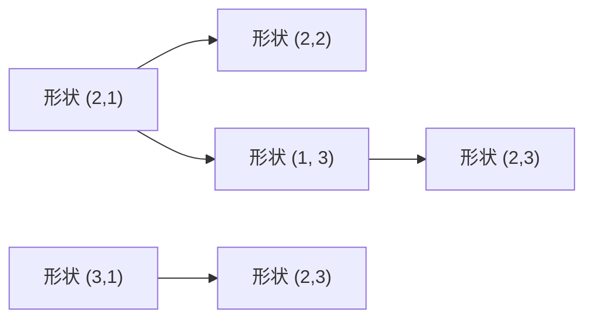

```python
import torch

# 广播示例
x = torch.tensor([1, 2, 3])           # 形状 (3,)
y = torch.tensor([[1], [2], [3]])       # 形状 (3, 1)

# 结果：形状 (3, 1)
result = x + y

# 另一个广播示例
x = torch.tensor([[1, 2], [3, 4]])  # 形状 (2, 2)
y = torch.tensor([10, 20])              # 形状 (2,)

# 结果：形状 (2, 2)
result = x + y
```

---

## 🔧 3. 自动微分：PyTorch 的核心优势

### 3.1 为什么需要自动微分？

在深度学习中，我们需要计算损失函数对模型参数的导数来更新参数，这个过程就是**梯度计算**。

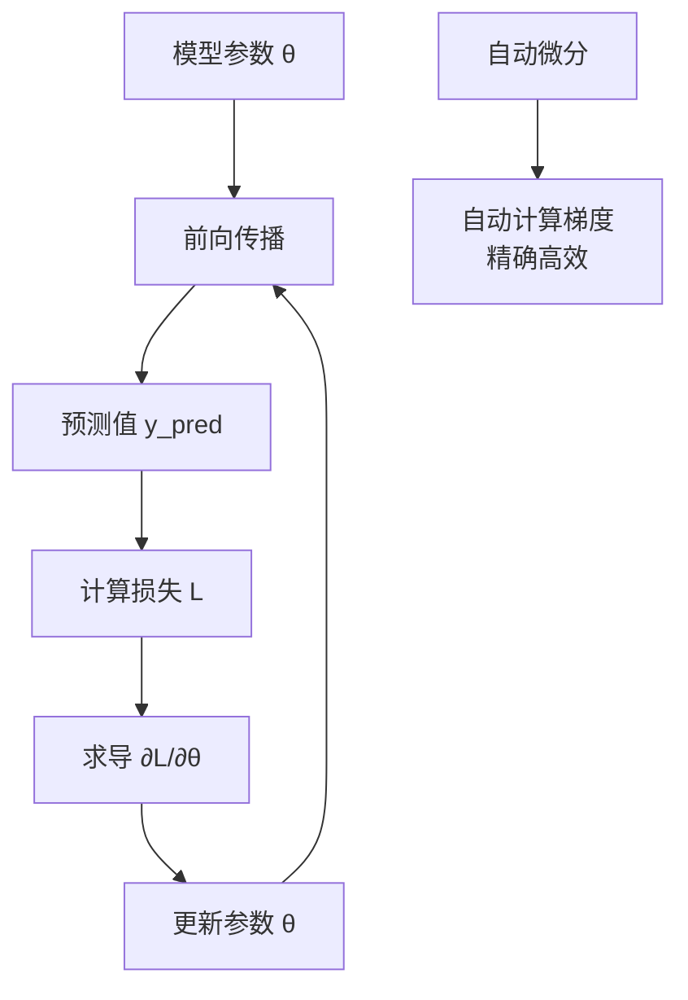

**手动求导的困境**：

- 深层网络有数百万个参数，手动求导不现实
- 函数复合需要复杂的链式法则，容易出错
- 代码变动后需要重新推导导数

**自动微分解决**：

- 自动构建计算图
- 自动应用链式法则
- 数值精确计算
- 支持高阶导数

### 3.2 自动微分基础

```python
import torch

# 创建需要计算梯度的张量
x = torch.tensor([2.0], requires_grad=True)
y = x ** 3 + x 2

# 计算梯度
y_grad = torch.autograd.grad(y, x)

print(f"dy/dx = {y_grad}")  # dy/dx = tensor(3. + 2*2)
```

### 3.3 梯度清零

```python
import torch

x = torch.tensor([1.0, 2.0, 3.0], requires_grad=True)
y = x.sum() * 2

# 第一次求导
y.backward()
print(f"梯度: {x.grad}")  # tensor([2., 2., 2.])

# 如果不清零梯度，梯度会累积
y.backward()
print(f"梯度累积: {x.grad}")  # tensor([4., 4., 4.])

# 清零梯度
x.grad.zero_()
print(f"清零后: {x.grad}")  # tensor([0., 0., 0.])
```

### 3.4 多变量求导（梯度）

```python
import torch

x = torch.tensor([1.0, 2.0, 3.0], requires_grad=True)
y = torch.tensor([2.0, 1.0, 0.5], requires_grad=True)

z = x * y + y ** 2

# 对 x 求偏导
z.backward(retain_graph=True)
dz_dx = x.grad

# 清空 x 的梯度
x.grad.zero_()

# 对 y 求偏导
z.backward(retain_graph=True)
dz_dy = y.grad
```

### 3.5 计算图的构建

**前向传播**：构建计算图

```mermaid
graph LR
    x["x (requires_grad=True)"] -->|"z = x² + y²"|
    x -->|"loss = z.sum()"|
    loss -->|"∂L/∂x = 2x"|
```

```python
x = torch.tensor([1.0, 2.0], requires_grad=True)
y = torch.tensor([0.5, 1.5],])

z = x ** 2 + y ** 2  # 构建计算图
loss = z.sum()                   # 计算标量值
loss.backward()                      # 反向传播
```

---

## 🧠 4. 神经网络基础

### 4.1 神经网络的组成部分

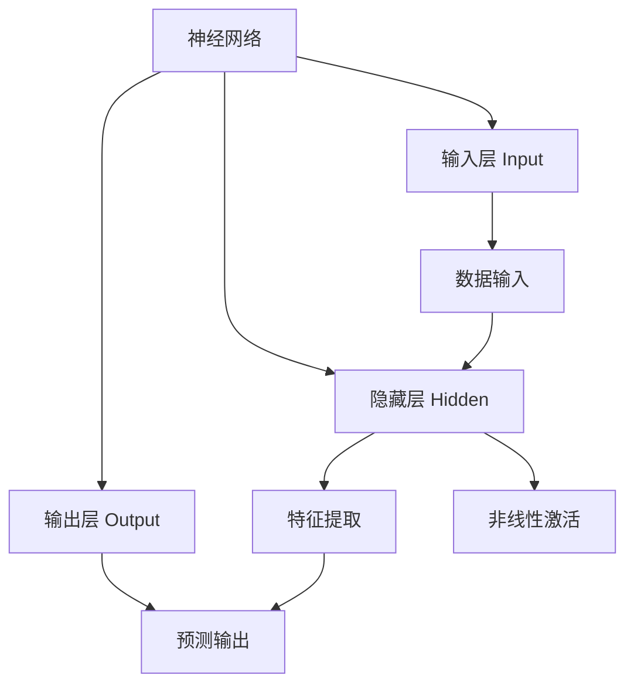

### 4.2 神经网络的层

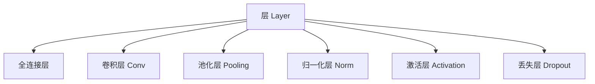

**常用层介绍**：

| 层类型       | 功能               | 应用场景             |
| ------------ | ------------------ | -------------------- |
| **全连接层** | 线性变换           | 全连接层、分类器     |
| **卷积层**   | 特征提取           | 图像处理、计算机视觉 |
| **池化层**   | 降维、特征选择     | 计算机视觉、特征降维 |
| **归一化层** | 加速训练、稳定梯度 | 深度网络训练         |
| **激活层**   | 引入非线性         | ReLU、Sigmoid、Tanh  |

### 4.3 激活函数家族

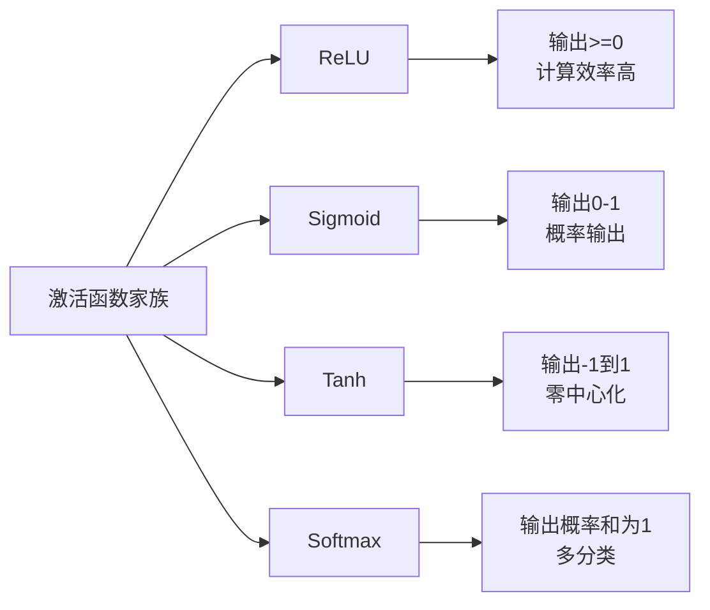

**激活函数对比**：

| 激活函数    | 数学公式                        | 输出范围 | 特点                 |
| ----------- | ------------------------------- | -------- | -------------------- |
| **ReLU**    | `max(0, x)`                     | [0, ∞)   | 解决梯度消失，计算快 |
| **Sigmoid** | `1/(1+e^(-x))`                  | (0, 1)   | 概率输出             |
| **Tanh**    | `(e^x - e^(-x))/(e^x + e^(-x))` | (-1, 1)  | 零中心化             |
| **Softmax** | `e^(x)/sum(e^x)`                | [0, 1]   | 多分类               |

### 4.4 全连接网络结构

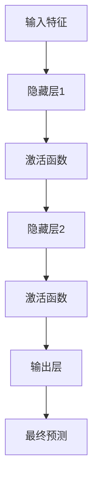

**代码结构**：

```python
import torch.nn as nn

class SimpleNet(nn.Module):
    def __init__(self):
        super().__init__()

        # 线性层
        self.fc1 = nn.Linear(784, 256)  # 输入784维 → 256维
        self.fc2 = nn.Linear(256, 128)
        self.fc3 = nn.Linear(128, 10)   # 输出10维（10分类）

        # 激活函数
        self.relu = nn.ReLU()
        self.softmax = nn.Softmax(dim=1)

    def forward(self, x):
        x = x.view(x.size(0), -1)  # 展平

        # 隐藏层1
        x = self.fc1(x)
        x = self.relu(x)

        # 隐藏层2
        x = self.fc2(x)
        x = self.relu(x)

        # 输出层
        x = self.fc3(x)
        return x
```

**关键点**：

- `nn.Module`：所有神经网络都必须继承此类
- `forward()` 方法定义前向传播逻辑
- `self.parameters()`：获取模型所有可训练参数

---

## 📈 5. 损失函数：衡量预测与真实的差距

### 5.1 什么是损失函数？

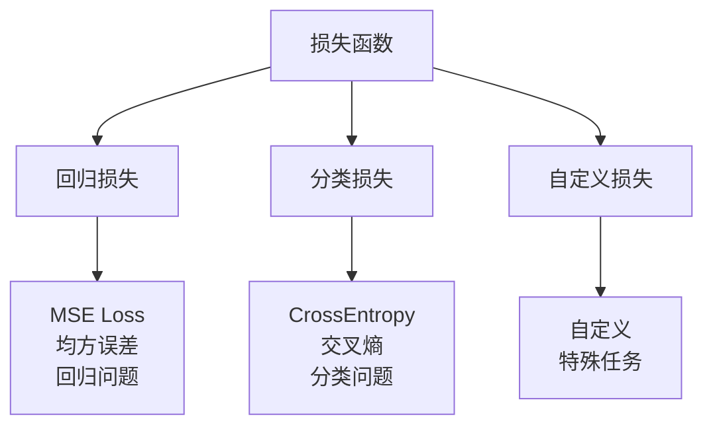

### 5.2 常用损失函数

**回归任务**：

```python
import torch.nn as nn

# 均方误差损失
mse_loss = nn.MSELoss()
output = model(input)
loss = mse_loss(output, target)
```

**分类任务**：

```python
# 交叉熵损失
ce_loss = nn.CrossEntropyLoss()
output = model(input)
loss = ce_loss(output, target)  # target 必须是类别索引
```

**二分类任务**：

```python
# BCE损失
bce_loss = nn.BCELoss()
output = model(input)
loss = bce_loss(output, target)  # target 必须在 [0, 1]
```

### 5.3 损失函数的特点

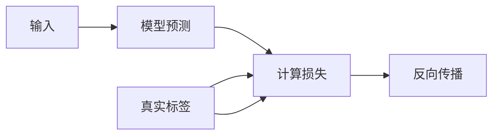

**关键特性**：

- **可微性**：支持自动微分
- **数值稳定性**：避免数值溢出
- **优化友好**：凸函数保证有全局最小值
- **效率优化**：针对大规模计算优化

---

## 🚀 6. 优化器：让模型不断进步

### 6.1 优化器的工作原理

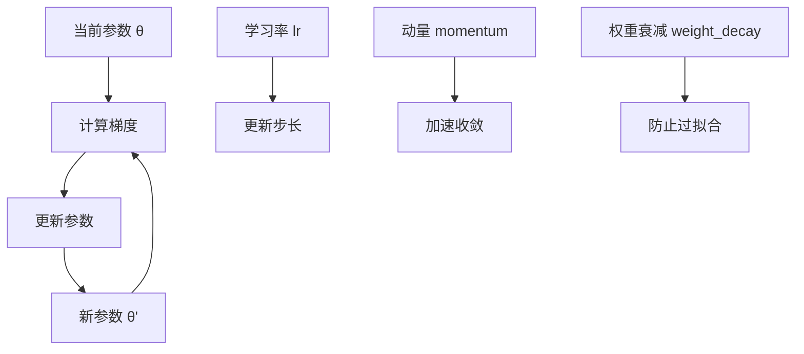

**优化过程**：

```python
import torch.optim as optim

# 定义模型
model = SimpleNet()

# 定义优化器
optimizer = optim.Adam(model.parameters(), lr=0.001)

# 训练循环
for epoch in range(num_epochs):
    optimizer.zero_grad()      # 清零梯度
    output = model(input)       # 前向传播
    loss = criterion(output, target) # 计算损失
    loss.backward()              # 反向传播
    optimizer.step()                 # 更新参数
```

### 6.2 常用优化器对比

| 优化器      | 学习率          | 特点         | 适用场景   |
| ----------- | --------------- | ------------ | ---------- |
| **SGD**     | 需要设置        | 简单、稳定   | 小数据集   |
| **Adam**    | 自适应学习率    | 收敛快、鲁棒 | 大多数任务 |
| **RMSprop** | 自适应学习率    | 适合RNN      | 序列数据   |
| **Adagrad** | 自适应学习率    | 内存高效     | 大规模数据 |
| **AdamW**   | Adam + 解耦动量 | 更新稳定     | 大规模数据 |

### 6.3 优化器的超参数

```python
import torch.optim as optim

optimizer = optim.Adam(
    model.parameters(),
    lr=0.001,      # 学习率
    betas=(0.9, 0.999), # 梯度动
    weight_decay=1e-4  # 权重衰减
)
```

---

## 🏗 7. 完整的神经网络训练流程

### 7.1 训练流程图

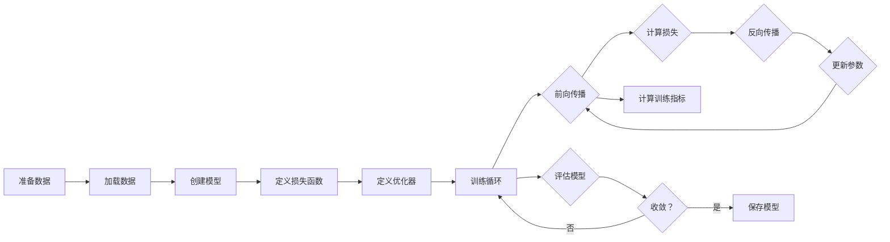

### 7.2 标准训练循环

```python
def train_model(model, train_loader, criterion, optimizer, device, epochs):
    model.train()

    for epoch in range(epochs):
        total_loss = 0
        correct = 0
        total = 0

        for inputs, targets in train_loader:
            inputs, targets = inputs.to(device), targets.to(device)

            # 前向传播
            outputs = model(inputs)
            loss = criterion(outputs, targets)

            # 反向传播和优化
            optimizer.zero_grad()
            loss.backward()
            optimizer.step()

            # 统计
            total_loss += loss.item()
            _, predicted = torch.max(outputs, 1)
            correct += (predicted == targets).sum().item()
            total += targets.size(0)

        # 计算准确率
        accuracy = 100. * correct / total
        avg_loss = total_loss / len(train_loader)

        print(f"Epoch {epoch+1}/{epochs}, "
              f"Loss: {avg_loss:.4f}, "
              f"Accuracy: {accuracy:.2f}%")
```

### 7.3 验证循环

```python
def evaluate_model(model, data_loader, criterion, device):
    model.eval()
    total_loss = 0
    correct = 0
    total = 0

    with torch.no_grad():  # 验证时不计算梯度
        for inputs, targets in data_loader:
            inputs, targets = inputs.to(device), targets.to(device)

            outputs = model(inputs)
            loss = criterion(outputs, targets)

            _, predicted = torch.max(outputs, 1)
            correct += (predicted == targets).sum().item()
            total += targets.size(0)

            total_loss += loss.item()

    accuracy = 100. * correct / total
    avg_loss = total_loss / len(data_loader)

    return avg_loss, accuracy
```

---

## 🎓 8. 实际应用示例：图像分类模型

### 8.1 问题定义

我们构建一个简单的图像分类器，识别MNIST手写数字。

### 8.2 网络架构

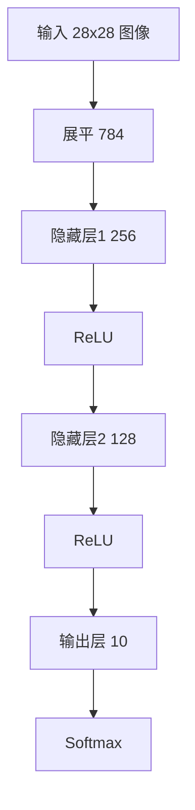

**代码框架**：

```python
class ImageClassifier(nn.Module):
    def __init__(self):
        super().__init__()

        # 展平层：将 28x28 图像展平为 784 维向量
        self.flatten = nn.Flatten()

        # 全连接层
        self.fc1 = nn.Linear(784, 256)
        self.fc2 = nn.Linear(256, 128)
        self.fc3 = nn.Linear(128, 10)

        # 激活函数和输出层
        self.relu = nn.ReLU()
        self.softmax = nn.Softmax(dim=1)

    def forward(self, x):
        x = self.flatten(x)
        x = self.relu(self.fc1(x))
        x = self.relu(self.fc2(x))
        output = self.softmax(self.fc3(x))
        return output
```

### 8.3 训练流程

```python
import torch
import torch.nn as nn
import torch.optim as optim
from torchvision import datasets, transforms
from torch.utils.data import DataLoader

# 设置设备
device = torch.device('cuda' if torch.cuda.is_available() else 'cpu')

# 加载数据集
transform = transforms.Compose([
    transforms.ToTensor(),
    transforms.Normalize((0.1307,), (0.3081,))
])

train_dataset = datasets.MNIST('./data', train=True, download=True, transform=transform)
test_dataset = datasets.MNIST('./data', train=False, download=True, transform=transform)

# 创建数据加载器
train_loader = DataLoader(train_dataset, batch_size=64, shuffle=True)
test_loader = DataLoader(test_dataset, batch_size=64, shuffle=False)

# 创建模型
model = ImageClassifier().to(device)

# 定义损失函数和优化器
criterion = nn.CrossEntropyLoss()
optimizer = optim.Adam(model.parameters(), lr=0.001)

# 训练
for epoch in range(5):
    train_model(model, train_loader, criterion, optimizer, device)
    test_loss, test_acc = evaluate_model(model, test_loader, criterion, device)

    print(f"Epoch {epoch+1}/5, "
          f"Test Loss: {test_loss:.4f}, "
          f"Test Accuracy: {test_acc:.2f}%")
```

---

## 🎓 9. 关键概念总结

### 9.1 PyTorch 核心知识图谱

```mermaid
graph mindmap
  root((PyTorch))
    张量
      创建方式
      基本属性
      类型转换
      设备管理
      数学运算
      广播
    自动微分
      梯度计算
      梯度清零
      计算图构建
      链式法则
      高阶导数
    神经网络
      层结构
      激活函数
      网络定义
      前向传播
    损失函数
      回归损失
      分类损失
      多分类
    优化器
      SGD
      Adam
      学习率
      动量
      权重衰减
    训练流程
      数据加载
      前向传播
      反向传播
      模型评估
```

### 9.2 学习路径

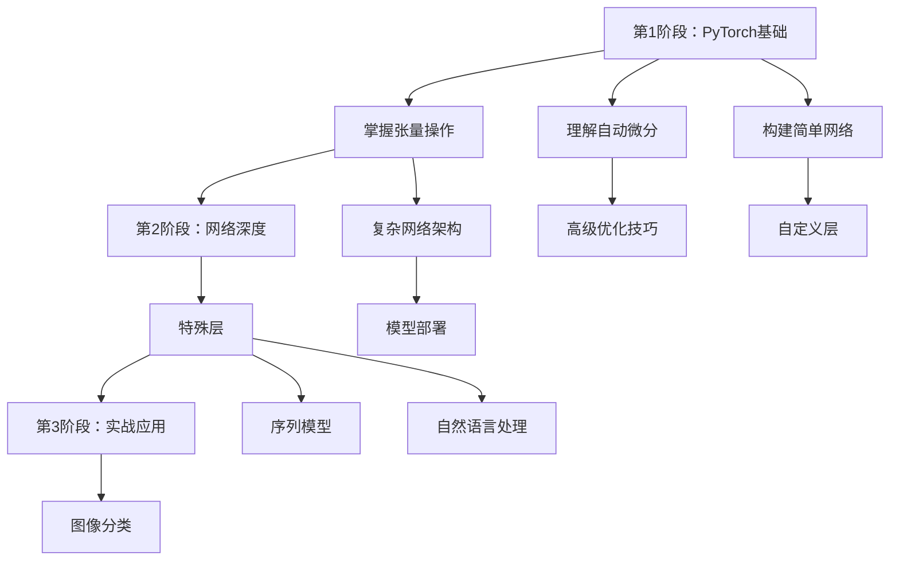

### 9.3 常见陷阱和最佳实践

**陷阱**：

- ❌ 忘记清零梯度：梯度会累积
- ❌ 张量类型错误：device mismatch
- ❌ 未指定设备：默认在CPU上运行
- ❌ 形状错误：维度不匹配

**最佳实践**：

- ✅ 始终使用 `with torch.no_grad()` 进行验证
- ✅ 设置 `model.train()` 和 `model.eval()` 区分训练和验证
- ✅ 使用 `.to(device)` 将所有张量移动到相同设备
- ✅ 使用 `.requires_grad=True` 标记需要梯度的张量
- ✅ 批量处理提高效率

---

## 🔮 10. 下一步学习路径

### 10.1 实战项目建议

- 🖼️ **图像分类**：加深对卷积神经网络的理解
- 🌊 **序列模型**：学习 RNN、LSTM、GRU
- 🔊 **自然语言处理**：Transformer 和 BERT
- 🎯 **模型部署**：ONNX、TorchScript、Triton

### 10.2 推荐学习资源

- 📚 **官方文档**：[PyTorch Tutorials](https://pytorch.org/tutorials/)
- 🎓 **经典教材**：《深度学习》- Ian Goodfellow
- 🌐 **PyTorch 社区**：[论坛](https://discuss.pytorch.org/)
- 📖 **实践项目**：Kaggle、GitHub 竞战

### 10.3 配套代码

本教程的理论部分到此结束。在配套的 `1.6_pytorch_basic.ipynb` 中，你将：

- ✅ 从零构建完整的神经网络
- ✅ 实践所有核心概念（张量、梯度、网络、训练）
- ✅ 在实际数据集上测试模型性能
- ✅ 亲眼看到模型从随机初始化到逐渐收敛的过程

**学习建议**：

- 📖 先理解本教程的核心概念
- 💻 然后在配套 Notebook 中动手实践
- 🎯 结合理论和代码，形成完整的知识体系
- 🔄 反复运行实验，观察不同参数对结果的影响

---

**准备好了吗？让我们开始 PyTorch 之旅吧！** 🚀
