# PhysicsNeMo 入门总结

---

## PhysicsNeMo 是什么

PhysicsNeMo 是 NVIDIA 开源的 **Physics AI（物理人工智能）开发框架**。

它建立在 PyTorch 之上，用于帮助研究人员构建：

- CFD（计算流体力学）代理模型
- FEM（有限元）代理模型
- PDE（偏微分方程）求解模型
- 科学计算中的深度学习模型

对于 PyTorch 用户，可以这样理解：

> PyTorch 提供神经网络训练基础能力，而 PhysicsNeMo 在其上增加了面向物理问题的数据处理、模型库、训练流程和工程工具。

PhysicsNeMo 并不是：

- 一个替代 PyTorch 的框架
- 一个自动连接 Fluent、OpenFOAM、COMSOL 的软件插件
- 一个只包含单一创新神经网络结构的算法库

它更接近：

```
PyTorch
    ↓
PhysicsNeMo
    ↓
Physics AI 应用
```

---

## 为什么需要 PhysicsNeMo

传统工程仿真流程：

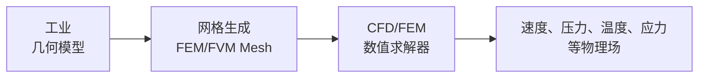

这种方法精度高，但是计算成本昂贵。

例如：

- 汽车气动优化
- 翼型优化
- 多参数设计空间搜索

需要大量重复仿真。

因此希望建立：

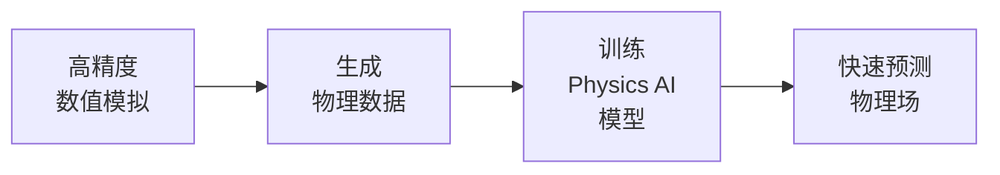

PhysicsNeMo 的目标就是帮助构建这种：

> simulation surrogate model（仿真代理模型）

---

## PhysicsNeMo 和 PyTorch 的关系

PhysicsNeMo 本质上仍然使用 PyTorch。

普通 PyTorch 训练流程：

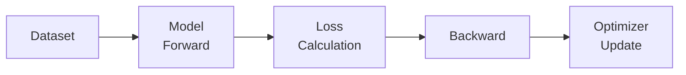

PhysicsNeMo 在此基础上增加：

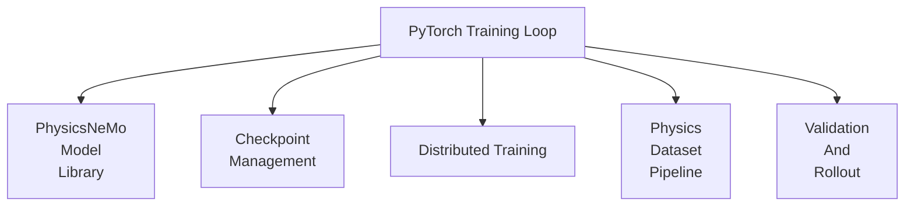

因此：

PyTorch 负责：

- tensor计算
- autograd
- optimizer

PhysicsNeMo负责：

- 物理模型封装
- 数据组织
- 工程训练流程

---

## PhysicsNeMo 的核心组成

PhysicsNeMo 可以分为五个主要部分。

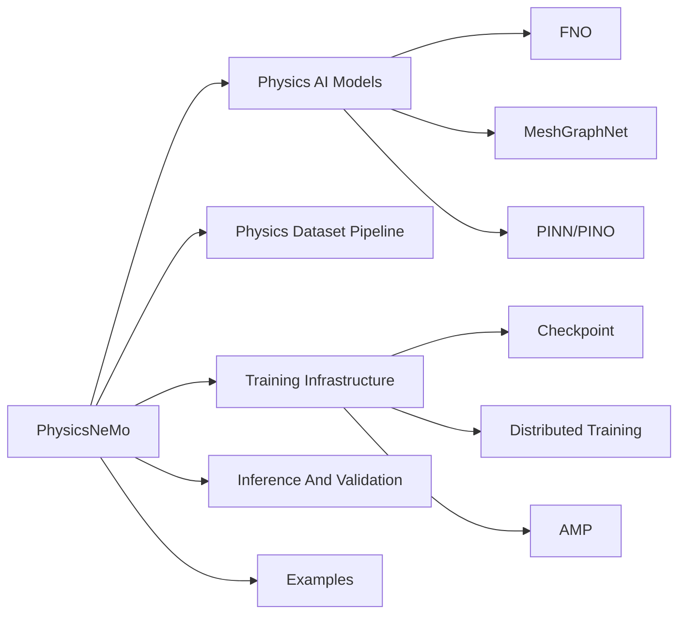

---

## PhysicsNeMo 的模型库

PhysicsNeMo 提供多个物理机器学习模型。

### Fourier Neural Operator（FNO）

FNO主要用于：

- 规则网格
- 连续场映射

例如：

输入：

$$
k(x,y)
$$

输出：

$$
p(x,y)
$$

对应：

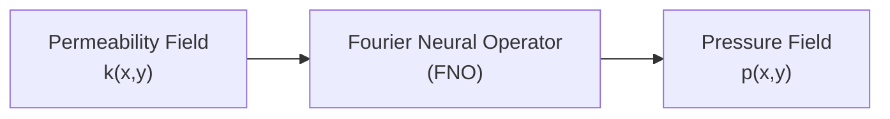

### MeshGraphNet

MeshGraphNet 用于：

- 非结构网格
- FEM/FVM mesh
- 复杂几何

基本思想：

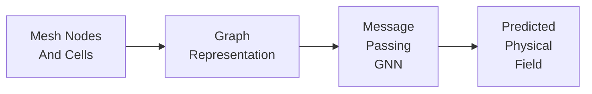

例如：

CFD网格：

- 节点 → graph node
- 网格连接 → graph edge
- 物理量 → feature

---

## PhysicsNeMo 如何处理工业网格

这是理解 PhysicsNeMo 最重要的一点。

PhysicsNeMo 不会直接：

```
Fluent → PhysicsNeMo → 自动训练
```

实际流程：

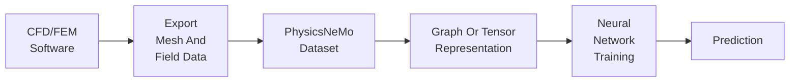

例如 MeshGraphNet：

原始数据：

- cells
- mesh_pos
- node_type
- velocity
- pressure

转换：

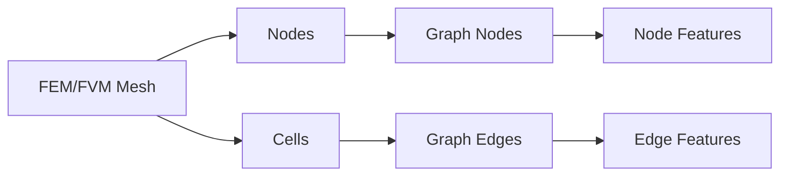

所以：

PhysicsNeMo提供：

- 数据组织方式
- 模型
- 训练流程

但是：

> 工业软件输出格式到 Graph 的转换仍然需要用户实现。

---

## MeshGraphNet Example 的完整流程

以 Vortex Shedding 为例：

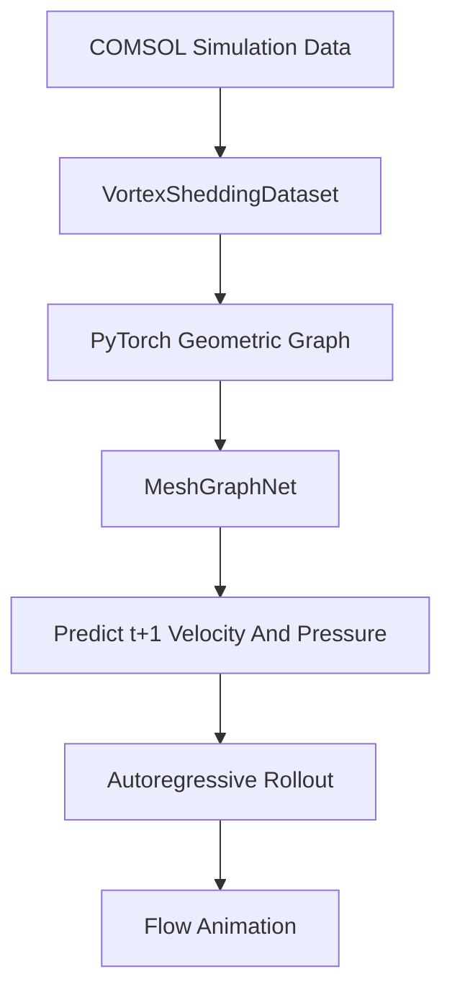

训练阶段：

学习：

$$
(u_t,v_t,p_t)\rightarrow(u_{t+1},v_{t+1},p_{t+1})
$$

推理阶段：

不断：

$$
t \rightarrow t+1 \rightarrow t+2
$$

得到完整时间演化。

---

## PhysicsNeMo 的工程优势

PhysicsNeMo 最明显的优势不是提出新网络，而是封装大量训练工程。

例如：

普通 PyTorch：

```python
torch.save()
torch.load()
```

需要用户管理：

- 模型参数
- optimizer
- scheduler
- AMP状态

PhysicsNeMo：

```python
from physicsnemo.utils import save_checkpoint, load_checkpoint
```

即可保存：

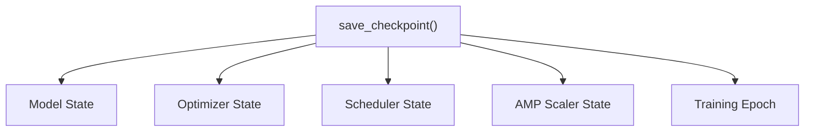

---

## PhysicsNeMo Example 的作用

PhysicsNeMo examples 不是简单代码展示。

它们展示的是完整科研流程：

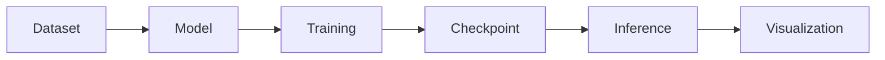

例如：

- Darcy Flow：学习 FNO 基础流程
- Vortex Shedding：学习 MeshGraphNet
- Lagrangian Fluid Flow：学习动态网格
- Deforming Plate：学习 FEM结构问题
- External Aerodynamics：学习工业气动问题

---

## PyG 和 PhysicsNeMo 的区别

PyTorch Geometric（PyG）解决：

> 如何高效计算图神经网络？

提供：

```python
Data(
    x,
    edge_index,
    edge_attr
)
```

PhysicsNeMo解决：

> 如何利用图神经网络解决物理问题？

区别：

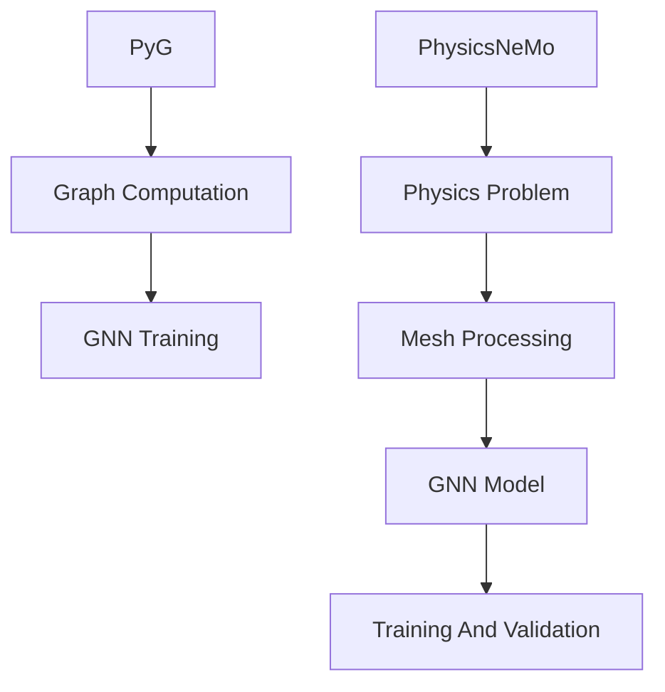

- PyG 是底层图计算工具。

- PhysicsNeMo 是物理 AI 应用框架。

---

## PyTorch 用户学习 PhysicsNeMo 的路线

推荐路线：

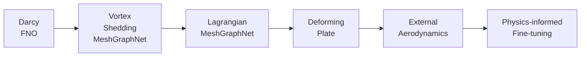

对应能力：

| 阶段                  | 学习内容            |
| --------------------- | ------------------- |
| Darcy FNO             | PhysicsNeMo训练基础 |
| Vortex Shedding       | Mesh → Graph → GNN  |
| Lagrangian MGN        | 动态网格            |
| Deforming Plate       | FEM问题             |
| External Aerodynamics | 工业复杂几何        |
| Physics Fine-tuning   | 实验数据和物理约束  |

---

## 总结

对于一个具有 PyTorch 基础的人：

PhysicsNeMo 最核心的理解是：

> PhysicsNeMo 不是替代 PyTorch，也不是替代 CFD 软件，而是在 PyTorch 和科学计算之间建立了一套面向物理问题的工程化框架。

它解决的问题是：

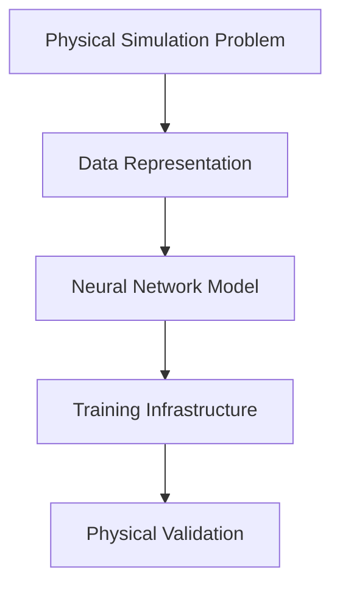

因此，学习 PhysicsNeMo 的重点不是学习新的 Python API，而是理解：

**如何把一个 FEM/FVM/CFD 问题转换为适合深度学习训练的问题，并完成从数据、模型、训练到验证的完整闭环。**
