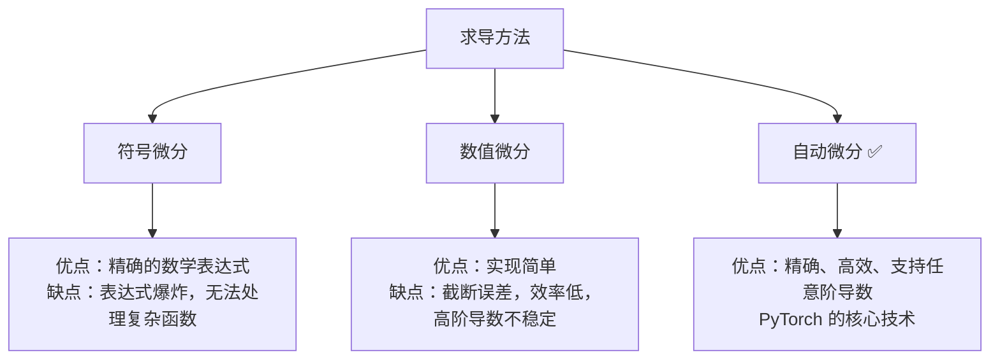
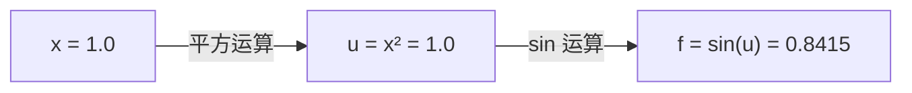
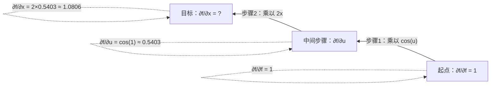
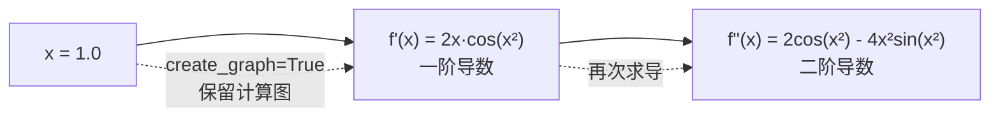
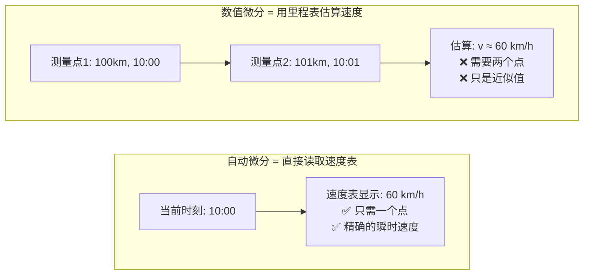
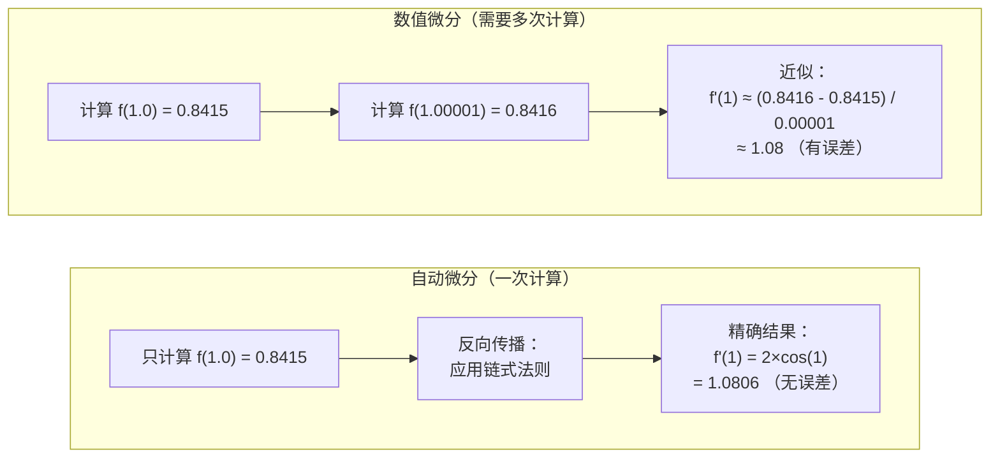
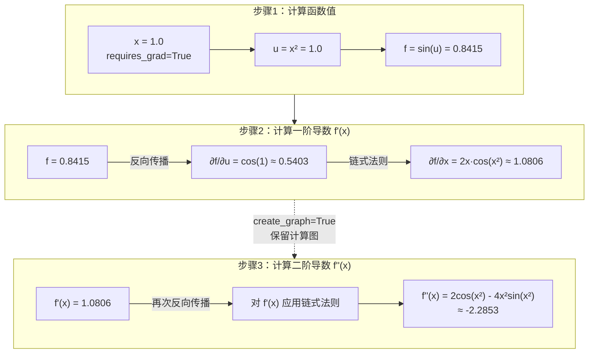
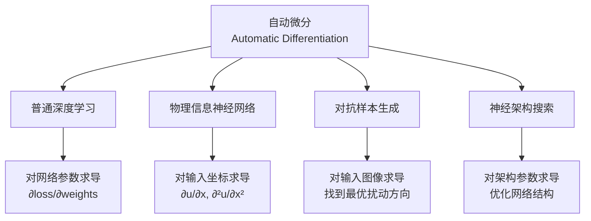
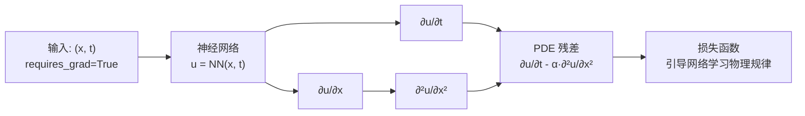

# 自动微分：PyTorch 的核心机制

## 为什么需要理解自动微分？

自动微分（Automatic Differentiation）是 PyTorch、TensorFlow 等深度学习框架的核心技术。无论你是训练图像分类模型、构建语言模型，还是求解物理方程，都离不开自动微分。

**在不同场景中的作用：**

- **普通深度学习**：计算损失函数对网络参数（权重、偏置）的梯度，实现反向传播和参数更新
- **物理信息神经网络（PINN）**：计算神经网络输出对输入坐标的偏导数，验证物理方程
- **强化学习**：计算策略梯度，优化智能体的决策
- **生成模型**：计算变分下界的梯度，训练 VAE 和扩散模型
- **科学计算**：灵敏度分析、优化问题、控制理论

本章将从零开始解释自动微分的工作原理，让你真正理解 PyTorch 背后的数学引擎。

---

## 三种求导方法的本质区别



### 方法一：符号微分（Symbolic Differentiation）

这是你在高中数学课学的方法。给定函数 $f(x) = x^2 + \sin(x)$，你用求导公式推导出 $f'(x) = 2x + \cos(x)$。

**优点**：结果是精确的数学表达式

**缺点**：对于神经网络这种包含数百万次运算的复杂函数，表达式会爆炸式增长，根本无法处理

### 方法二：数值微分（Numerical Differentiation）

用导数的定义来近似：

$$f'(x) \approx \frac{f(x+h) - f(x)}{h}$$

其中 $h$ 是一个很小的数，比如 $10^{-5}$。

**优点**：实现简单，适用于任何函数

**缺点**：

- 只是近似值，有截断误差
- $h$ 太大误差大，$h$ 太小会有数值精度问题
- 计算二阶导数需要调用函数 3 次，三阶导数需要 4 次，效率低下
- 对于有 $n$ 个参数的函数，需要计算 $n+1$ 次才能得到所有偏导数

### 方法三：自动微分（Automatic Differentiation）

这是 PyTorch、TensorFlow 等深度学习框架使用的方法。它的核心思想是：

**在计算函数值的同时，自动记录计算过程，然后用链式法则精确计算导数。**

**优点**：

- 精确到机器精度（不是近似）
- 计算效率高
- 可以轻松计算任意阶导数
- 对于有 $n$ 个参数的函数，只需要一次反向传播就能得到所有偏导数

---

## 自动微分的工作原理

### 核心概念：计算图

当你写下一个计算表达式时，PyTorch 会在后台构建一个"计算图"，记录每一步的运算。

**例子：计算 $f(x) = \sin(x^2)$ 在 $x=1$ 处的值和导数**

```python
import torch

x = torch.tensor([1.0], requires_grad=True)  # 告诉 PyTorch：我需要对 x 求导
f = torch.sin(x ** 2)

print(f"f(1) = {f.item():.4f}")  # 输出：f(1) = 0.8415
```

在这个简单的计算中，PyTorch 构建了这样的计算图：


PyTorch 不仅记录了数值，还记录了每一步的**求导规则**，这些规则会在反向传播时被用到。

### 反向传播：链式法则的自动应用

当你调用 `torch.autograd.grad()` 时，PyTorch 从输出开始，沿着计算图**反向**走一遍，把每一步的导数用链式法则乘起来：

```python
df_dx = torch.autograd.grad(f, x, create_graph=True)[0]
print(f"f'(1) = {df_dx.item():.4f}")  # 输出：f'(1) = 1.0806
```

#### 前向传播：记录计算过程



#### 反向传播：应用链式法则

PyTorch 从输出 $f$ 开始，**反向**计算梯度：



**步骤 1：计算 $\frac{\partial f}{\partial u}$**

我们知道 $f = \sin(u)$，所以：

$$\frac{\partial f}{\partial u} = \cos(u) = \cos(1) \approx 0.5403$$

**步骤 2：计算 $\frac{\partial f}{\partial x}$（链式法则）**

根据链式法则：

$$\frac{\partial f}{\partial x} = \frac{\partial f}{\partial u} \cdot \frac{\partial u}{\partial x} = \cos(1) \times 2x = 0.5403 \times 2 = 1.0806$$

#### 用表格理解反向传播

| 反向传播步骤 | 当前位置 | 局部导数 | 累积梯度（链式法则） | 数值计算 |
|------------|---------|---------|-------------------|---------|
| 初始化 | $f$ | - | $\frac{\partial f}{\partial f} = 1$ | $1$ |
| 步骤 1 | $u$ | $\frac{\partial f}{\partial u} = \cos(u)$ | $1 \times \cos(1)$ | $0.5403$ |
| 步骤 2 | $x$ | $\frac{\partial u}{\partial x} = 2x$ | $0.5403 \times 2$ | $1.0806$ |

**关键理解**：

1. **反向传播从输出开始**：从 $\frac{\partial f}{\partial f} = 1$ 开始（对自己求导等于1）
2. **每一步乘以局部导数**：沿着计算图反向走，每经过一个节点就乘以该节点的局部导数
3. **只需要一个点的信息**：所有计算都在 $x=1$ 这一个点进行，不需要计算 $f(1.00001)$ 或其他邻近点

### 高阶导数：对导数再求导

一阶导数 $f'(x) = 2x\cos(x^2)$ 本身也是 $x$ 的函数。如果我们在求一阶导数时保留了计算图（通过 `create_graph=True`），就可以继续对它求导：

```python
d2f_dx2 = torch.autograd.grad(df_dx, x)[0]
print(f"f''(1) = {d2f_dx2.item():.4f}")  # 输出：f''(1) = -2.2853
```



这相当于对 $f'(x) = 2x\cos(x^2)$ 再应用一次链式法则：

$$f''(x) = \frac{d(2x\cos(x^2))}{dx} = 2\cos(x^2) - 4x^2\sin(x^2)$$

在 $x=1$ 处代入：$f''(1) = 2\cos(1) - 4\sin(1) \approx -2.2853$

---

## 为什么只需要一个点？

这是初学者最常见的困惑。让我们用一个物理类比来理解：



**数值微分 = 用里程表估算速度**

你在高速公路上，看到第 100 公里处的时间是 10:00，第 101 公里处的时间是 10:01，于是估算速度：

$$v \approx \frac{101 - 100}{10:01 - 10:00} = 60 \text{ km/h}$$

这需要**两个测量点**，而且只是近似值（因为速度可能在这 1 公里内有变化）。

**自动微分 = 直接读取速度表**

你的车上有速度表，在任意时刻直接显示当前速度 60 km/h。这是**瞬时速度**，只需要**当前这一个时刻**的信息，而且是精确值。

导数就是函数的"瞬时变化率"，自动微分通过链式法则精确计算这个瞬时变化率，完全不需要移动到另一个点。

### 与数值微分的对比



---

## 完整示例：从零到二阶导数

让我们通过一个完整的例子，看看如何使用 PyTorch 的自动微分计算一阶和二阶导数。

### 代码实现

```python
import torch
import numpy as np

# 定义输入（必须设置 requires_grad=True）
x = torch.tensor([1.0], requires_grad=True)

# 定义函数 f(x) = sin(x²)
f = torch.sin(x ** 2)

# 计算一阶导数 f'(x)
# create_graph=True 表示"保留计算图，因为我还要继续求导"
df_dx = torch.autograd.grad(
    outputs=f,           # 对谁求导（输出）
    inputs=x,            # 关于谁求导（输入）
    create_graph=True    # 保留计算图
)[0]

# 计算二阶导数 f''(x)
d2f_dx2 = torch.autograd.grad(
    outputs=df_dx,       # 对一阶导数求导
    inputs=x             # 还是关于 x
)[0]

# 输出结果
print(f"函数值: f(1) = {f.item():.6f}")
print(f"一阶导数: f'(1) = {df_dx.item():.6f}")
print(f"二阶导数: f''(1) = {d2f_dx2.item():.6f}")

# 验证：与解析解对比
print("\n解析解验证：")
print(f"f'(1) = 2·cos(1) = {2 * np.cos(1):.6f}")
print(f"f''(1) = 2·cos(1) - 4·sin(1) = {2 * np.cos(1) - 4 * np.sin(1):.6f}")
```

### 输出结果

```
函数值: f(1) = 0.841471
一阶导数: f'(1) = 1.080605
二阶导数: f''(1) = -2.285279

解析解验证：
f'(1) = 2·cos(1) = 1.080605
f''(1) = 2·cos(1) - 4·sin(1) = -2.285279
```

可以看到，自动微分的结果与解析解完全一致（精确到小数点后 6 位）。

### 计算过程可视化



### 关键要点

1. **`requires_grad=True`**：告诉 PyTorch 需要对输入 $x$ 求导，而不仅仅是对网络参数求导

2. **`create_graph=True`**：在计算一阶导数时保留计算图，这样才能继续计算二阶导数。如果只需要一阶导数，可以省略这个参数

3. **精确性**：自动微分给出的是精确到机器精度的结果，不是数值近似

4. **效率**：虽然我们计算了二阶导数，但整个过程只需要：
   - 1 次前向传播（计算函数值）
   - 2 次反向传播（分别计算一阶和二阶导数）
   
   相比之下，数值微分计算二阶导数需要至少 3 次函数求值

### 解析解推导

为了验证结果，让我们手动推导解析解：

**一阶导数**：

$$f(x) = \sin(x^2)$$

$$f'(x) = \cos(x^2) \cdot 2x = 2x\cos(x^2)$$

在 $x=1$ 处：$f'(1) = 2 \times 1 \times \cos(1) = 2\cos(1) \approx 1.0806$

**二阶导数**：

$$f'(x) = 2x\cos(x^2)$$

使用乘积法则和链式法则：

$$f''(x) = 2\cos(x^2) + 2x \cdot (-\sin(x^2)) \cdot 2x = 2\cos(x^2) - 4x^2\sin(x^2)$$

在 $x=1$ 处：$f''(1) = 2\cos(1) - 4\sin(1) \approx -2.2853$

## 自动微分在不同场景中的应用



### 场景一：普通深度学习——训练神经网络

这是自动微分最常见的用途。在训练过程中，我们需要计算损失函数对所有网络参数的梯度：

```python
# 前向传播
outputs = model(inputs)
loss = criterion(outputs, targets)

# 反向传播：自动计算 ∂loss/∂w 对所有参数 w
loss.backward()

# 参数更新
optimizer.step()
```

**关键点**：这里求导的对象是**网络参数**（权重和偏置），输入数据不需要梯度。

### 场景二：[物理信息神经网络（PINN）](../part2_networks/2.5_pinn/2.5_pinn.md)——验证物理方程

在 [PINN](../part2_networks/2.5_pinn/2.5_pinn.md) 中，我们需要验证神经网络的输出是否满足物理方程。以热传导方程为例：

$$\frac{\partial u}{\partial t} = \alpha \frac{\partial^2 u}{\partial x^2}$$

```python
# 输入：时空坐标 (x, t)
x = torch.tensor([[0.5]], requires_grad=True)  # 注意：输入需要梯度！
t = torch.tensor([[0.3]], requires_grad=True)

# 神经网络预测温度场
u = model(torch.cat([x, t], dim=1))

# 计算偏导数
u_t = torch.autograd.grad(u, t, create_graph=True)[0]   # ∂u/∂t
u_x = torch.autograd.grad(u, x, create_graph=True)[0]   # ∂u/∂x
u_xx = torch.autograd.grad(u_x, x)[0]                   # ∂²u/∂x²

# 计算 PDE 残差（应该接近 0）
alpha = 0.1
pde_residual = u_t - alpha * u_xx
loss_pde = torch.mean(pde_residual ** 2)
```



**关键点**：这里求导的对象是**输入坐标**，而不是网络参数。这是 [PINN](../part2_networks/2.5_pinn/2.5_pinn.md) 与普通深度学习的核心区别。

### 场景三：对抗样本生成——攻击神经网络

在对抗攻击中，我们需要找到让模型误判的输入扰动：

```python
# 原始图像
image = torch.tensor(original_image, requires_grad=True)

# 前向传播
output = model(image)
loss = -criterion(output, true_label)  # 负号：我们想最大化损失

# 计算图像梯度（不是参数梯度！）
loss.backward()
perturbation = image.grad

# 生成对抗样本
adversarial_image = image + epsilon * perturbation.sign()
```

**关键点**：这里求导的对象是**输入图像**，目的是找到最有效的扰动方向。

### 场景四：神经架构搜索——优化网络结构

在可微分架构搜索（DARTS）中，网络结构本身也变成可优化的参数：

```python
# 架构参数（控制不同操作的权重）
arch_params = torch.randn(num_ops, requires_grad=True)

# 混合操作
output = sum(softmax(arch_params)[i] * operation_i(x) for i in range(num_ops))

# 同时优化网络权重和架构参数
loss.backward()  # 计算对权重和架构参数的梯度
```

**关键点**：这里同时对**网络权重**和**架构参数**求导，实现端到端的架构优化。

---

## 常见问题

**Q1：为什么必须用 `requires_grad=True`？**

因为 PyTorch 默认只对网络参数构建计算图。如果你需要对输入求导（如 PINN、对抗攻击），必须显式声明 `requires_grad=True`。

**Q2：`create_graph=True` 什么时候需要？**

当你需要对导数继续求导时（计算二阶及以上导数）。如果只需要一阶导数，可以省略。

**Q3：自动微分会不会很慢？**

对于前向计算，几乎没有额外开销。对于反向传播，计算导数的时间大约是前向计算的 2-3 倍，但这比数值微分快得多（数值微分需要多次前向计算）。

**Q4：为什么 [PINN](../part2_networks/2.5_pinn/2.5_pinn.md) 用 tanh 而不是 ReLU？**

ReLU 的导数是分段常数（0 或 1），二阶导数处处为 0，无法表示 PDE 中的二阶导数信息。tanh 是光滑函数，任意阶导数都存在且非零。

**Q5：`loss.backward()` 和 `torch.autograd.grad()` 有什么区别？**

- `loss.backward()`：计算梯度并累加到 `.grad` 属性中，用于参数更新
- `torch.autograd.grad()`：直接返回梯度值，不修改 `.grad` 属性，更灵活但需要手动管理

---

## 总结

自动微分是现代深度学习的数学引擎，它让我们能够：

1. **高效训练**包含数百万参数的复杂神经网络
2. **精确计算**任意阶导数，支持 [PINN](../part2_networks/2.5_pinn/2.5_pinn.md) 等科学计算应用
3. **灵活求导**对输入、参数、架构等任意变量求导
4. **自动优化**通过梯度下降及其变体更新模型

理解了自动微分，你就掌握了 PyTorch 的核心机制。无论是训练图像分类器、构建生成模型，还是求解物理方程，自动微分都是你最强大的工具。
