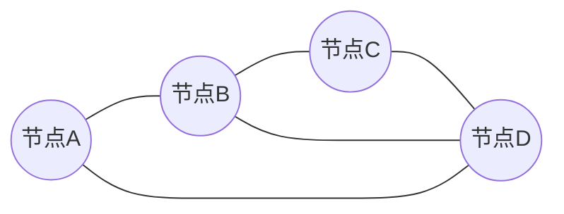
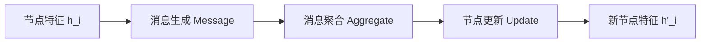
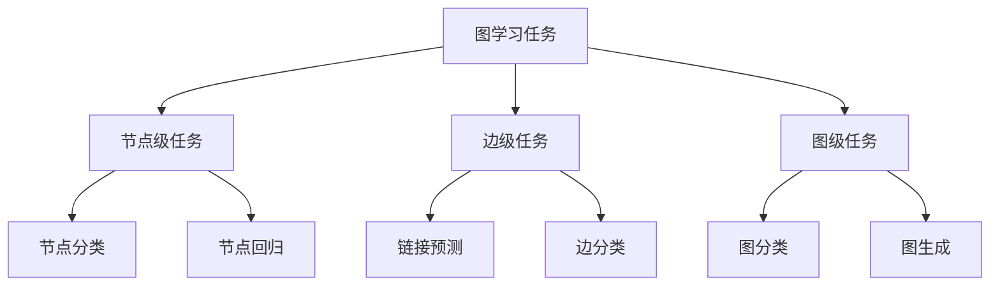
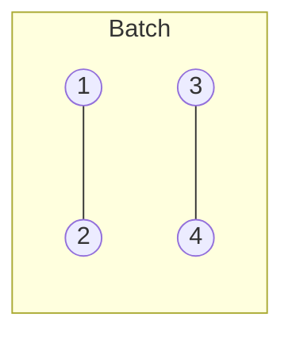
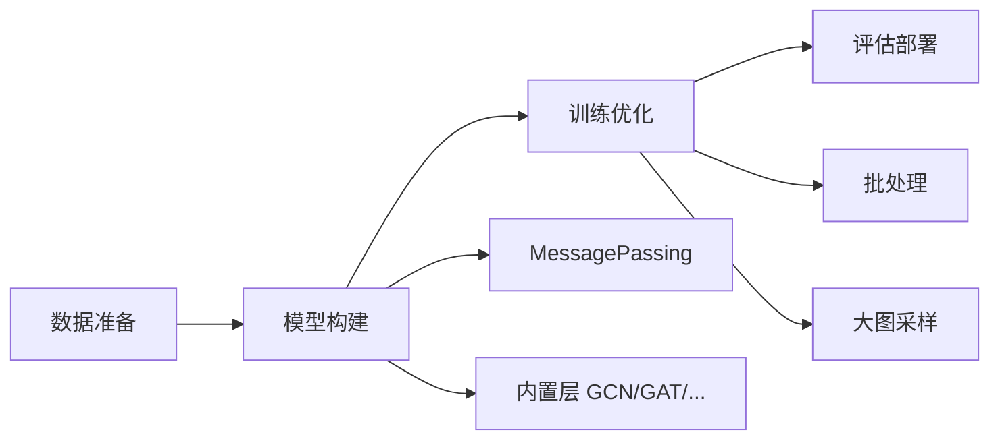

# PyTorch Geometric (PyG) 完整教程

## 1. 引言

PyTorch Geometric (PyG) 是基于 PyTorch 构建的几何深度学习扩展库，专门用于处理图结构和其他不规则结构的数据。它提供了高效的图神经网络实现，支持从分子结构分析到社交网络推荐等多种应用场景。

**官方资源**：

- [PyG 官方文档](https://pytorch-geometric.readthedocs.io/)
- [PyG GitHub 仓库](https://github.com/pyg-team/pytorch_geometric)

---

## 2. 图的基本概念

### 2.1 什么是图？

图 $G = (V, E)$ 由节点集合 $V$ 和边集合 $E$ 组成，其中：

- $V = \{v_1, v_2, ..., v_n\}$ 表示 $n$ 个节点
- $E \subseteq V \times V$ 表示节点之间的连接关系



### 2.2 图的表示方法

#### 邻接矩阵

对于 $n$ 个节点的图，邻接矩阵 $A \in \{0,1\}^{n \times n}$ 定义为：

$$
A_{ij} = \begin{cases}
1, & \text{if } (v_i, v_j) \in E \\
0, & \text{otherwise}
\end{cases}
$$

#### 边索引 (Edge Index)

PyG 采用 **COO (Coordinate) 格式** 存储稀疏图，使用形状为 $[2, |E|]$ 的张量：

```python
edge_index = torch.tensor([[0, 1, 1, 2],
                           [1, 0, 2, 1]], dtype=torch.long)
```

这表示边：$(0 \to 1), (1 \to 0), (1 \to 2), (2 \to 1)$

---

## 3. PyG 数据结构

### 3.1 Data 对象

`torch_geometric.data.Data` 是 PyG 的核心数据容器：

```python
from torch_geometric.data import Data

data = Data(
    x=x,              # 节点特征矩阵 [num_nodes, num_features]
    edge_index=edge_index,  # 边索引 [2, num_edges]
    edge_attr=edge_attr,    # 边特征 [num_edges, num_edge_features]
    y=y               # 标签
)
```

**关键属性**：

- `data.num_nodes`: 节点数量
- `data.num_edges`: 边数量
- `data.num_node_features`: 节点特征维度
- `data.is_directed()`: 是否为有向图

### 3.2 创建简单图

```python
import torch
from torch_geometric.data import Data

# 4个节点，每个节点有2维特征
x = torch.tensor([[1.0, 2.0],
                  [3.0, 4.0],
                  [5.0, 6.0],
                  [7.0, 8.0]])

# 边连接
edge_index = torch.tensor([[0, 1, 2, 3],
                           [1, 2, 3, 0]], dtype=torch.long)

data = Data(x=x, edge_index=edge_index)
```

---

## 4. 消息传递框架

### 4.1 核心思想

图神经网络的核心是 **消息传递机制 (Message Passing)**，通过迭代聚合邻居信息更新节点表示：



数学表达式：

$$
\mathbf{h}_i^{(k+1)} = \gamma^{(k)} \left( \mathbf{h}_i^{(k)}, \bigoplus_{j \in \mathcal{N}(i)} \phi^{(k)} \left( \mathbf{h}_i^{(k)}, \mathbf{h}_j^{(k)}, \mathbf{e}_{ji} \right) \right)
$$

其中：

- $\mathbf{h}_i^{(k)}$ 是节点 $i$ 在第 $k$ 层的特征
- $\phi$ 是消息函数
- $\bigoplus$ 是聚合函数（如 sum, mean, max）
- $\gamma$ 是更新函数
- $\mathcal{N}(i)$ 是节点 $i$ 的邻居集合

### 4.2 MessagePassing 基类

PyG 提供 `MessagePassing` 基类简化 GNN 实现：

```python
from torch_geometric.nn import MessagePassing

class CustomConv(MessagePassing):
    def __init__(self, in_channels, out_channels):
        super().__init__(aggr='add')  # 聚合方式
        self.lin = torch.nn.Linear(in_channels, out_channels)

    def forward(self, x, edge_index):
        # 1. 特征变换
        x = self.lin(x)
        # 2. 消息传递
        return self.propagate(edge_index, x=x)

    def message(self, x_j):
        # 定义从邻居 j 发送的消息
        return x_j

    def update(self, aggr_out):
        # 更新节点特征
        return aggr_out
```

---

## 5. 常用图神经网络层

### 5.1 图卷积网络 (GCN)

**论文**：[Semi-Supervised Classification with Graph Convolutional Networks (Kipf & Welling, 2017)](https://arxiv.org/abs/1609.02907)

**公式**：

$$
\mathbf{H}^{(l+1)} = \sigma \left( \tilde{\mathbf{D}}^{-\frac{1}{2}} \tilde{\mathbf{A}} \tilde{\mathbf{D}}^{-\frac{1}{2}} \mathbf{H}^{(l)} \mathbf{W}^{(l)} \right)
$$

其中 $\tilde{\mathbf{A}} = \mathbf{A} + \mathbf{I}$ 是添加自环的邻接矩阵，$\tilde{\mathbf{D}}$ 是对应的度矩阵。

```python
from torch_geometric.nn import GCNConv

class GCN(torch.nn.Module):
    def __init__(self, num_features, hidden_dim, num_classes):
        super().__init__()
        self.conv1 = GCNConv(num_features, hidden_dim)
        self.conv2 = GCNConv(hidden_dim, num_classes)

    def forward(self, data):
        x, edge_index = data.x, data.edge_index
        x = self.conv1(x, edge_index).relu()
        x = self.conv2(x, edge_index)
        return x
```

### 5.2 图注意力网络 (GAT)

**论文**：[Graph Attention Networks (Veličković et al., 2018)](https://arxiv.org/abs/1710.10903)

**公式**：

$$
\mathbf{h}_i' = \sigma \left( \sum_{j \in \mathcal{N}(i) \cup \{i\}} \alpha_{ij} \mathbf{W} \mathbf{h}_j \right)
$$

注意力系数：

$$
\alpha_{ij} = \frac{\exp(\text{LeakyReLU}(\mathbf{a}^T [\mathbf{W}\mathbf{h}_i \| \mathbf{W}\mathbf{h}_j]))}{\sum_{k \in \mathcal{N}(i) \cup \{i\}} \exp(\text{LeakyReLU}(\mathbf{a}^T [\mathbf{W}\mathbf{h}_i \| \mathbf{W}\mathbf{h}_k]))}
$$

```python
from torch_geometric.nn import GATConv

class GAT(torch.nn.Module):
    def __init__(self, num_features, hidden_dim, num_classes, heads=8):
        super().__init__()
        self.conv1 = GATConv(num_features, hidden_dim, heads=heads)
        self.conv2 = GATConv(hidden_dim * heads, num_classes, heads=1)
```

### 5.3 GraphSAGE

**论文**：[Inductive Representation Learning on Large Graphs (Hamilton et al., 2017)](https://arxiv.org/abs/1706.02216)

**特点**：采用采样和聚合策略，适合大规模图

```python
from torch_geometric.nn import SAGEConv

class GraphSAGE(torch.nn.Module):
    def __init__(self, num_features, hidden_dim, num_classes):
        super().__init__()
        self.conv1 = SAGEConv(num_features, hidden_dim)
        self.conv2 = SAGEConv(hidden_dim, num_classes)
```

### 5.4 图同构网络 (GIN)

**论文**：[How Powerful are Graph Neural Networks? (Xu et al., 2019)](https://arxiv.org/abs/1810.00826)

**公式**：

$$
\mathbf{h}_i^{(k+1)} = \text{MLP}^{(k)} \left( (1 + \epsilon^{(k)}) \cdot \mathbf{h}_i^{(k)} + \sum_{j \in \mathcal{N}(i)} \mathbf{h}_j^{(k)} \right)
$$

```python
from torch_geometric.nn import GINConv

gin_conv = GINConv(
    nn.Sequential(
        nn.Linear(num_features, hidden_dim),
        nn.ReLU(),
        nn.Linear(hidden_dim, hidden_dim)
    )
)
```

---

## 6. 图任务类型



### 6.1 节点分类

预测每个节点的类别（如社交网络中的用户分类）

```python
# 训练示例
model.train()
optimizer.zero_grad()
out = model(data)
loss = F.cross_entropy(out[data.train_mask], data.y[data.train_mask])
loss.backward()
optimizer.step()
```

### 6.2 图分类

预测整个图的类别（如分子性质预测）

```python
from torch_geometric.nn import global_mean_pool

class GraphClassifier(torch.nn.Module):
    def forward(self, data):
        x = self.conv1(data.x, data.edge_index).relu()
        x = self.conv2(x, data.edge_index)
        # 全局池化
        x = global_mean_pool(x, data.batch)
        return self.classifier(x)
```

**池化方法**：

- `global_mean_pool`: 平均池化
- `global_max_pool`: 最大池化
- `global_add_pool`: 求和池化

### 6.3 链接预测

预测节点之间是否存在边

```python
# 负采样
from torch_geometric.utils import negative_sampling

neg_edge_index = negative_sampling(
    edge_index=data.edge_index,
    num_nodes=data.num_nodes,
    num_neg_samples=data.edge_index.size(1)
)
```

---

## 7. 数据加载与批处理

### 7.1 DataLoader

PyG 的 `DataLoader` 自动处理图的批处理：

```python
from torch_geometric.loader import DataLoader

loader = DataLoader(
    dataset,
    batch_size=32,
    shuffle=True
)

for batch in loader:
    # batch.x: [total_nodes_in_batch, num_features]
    # batch.batch: 节点所属图的索引
    pred = model(batch)
```

**批处理原理**：将多个小图合并成一个大的不连通图



### 7.2 NeighborLoader（大图采样）

对于大规模图，使用邻居采样：

```python
from torch_geometric.loader import NeighborLoader

loader = NeighborLoader(
    data,
    num_neighbors=[15, 10, 5],  # 每层采样邻居数
    batch_size=128,
    input_nodes=train_mask
)
```

---

## 8. 内置数据集

PyG 提供丰富的基准数据集：

```python
from torch_geometric.datasets import Planetoid, TUDataset

# 引文网络（节点分类）
cora = Planetoid(root='/tmp/Cora', name='Cora')

# 图分类数据集
proteins = TUDataset(root='/tmp/PROTEINS', name='PROTEINS')
```

**常用数据集**：

| 数据集 | 类型     | 节点数       | 边数         | 类别数 |
| ------ | -------- | ------------ | ------------ | ------ |
| Cora   | 引文网络 | 2,708        | 5,429        | 7      |
| PubMed | 引文网络 | 19,717       | 44,338       | 3      |
| MUTAG  | 分子图   | 17.9（平均） | 19.8（平均） | 2      |

---

## 9. 高级技巧

### 9.1 残差连接与归一化

```python
from torch_geometric.nn import GCNConv, LayerNorm

class ResGCN(torch.nn.Module):
    def __init__(self, channels):
        super().__init__()
        self.conv = GCNConv(channels, channels)
        self.norm = LayerNorm(channels)

    def forward(self, x, edge_index):
        identity = x
        x = self.conv(x, edge_index)
        x = self.norm(x)
        x = x + identity  # 残差连接
        return x.relu()
```

### 9.2 Dropout 与正则化

```python
import torch.nn.functional as F

def forward(self, data):
    x = self.conv1(data.x, data.edge_index).relu()
    x = F.dropout(x, p=0.5, training=self.training)
    x = self.conv2(x, data.edge_index)
    return x
```

### 9.3 学习率调度

```python
from torch.optim.lr_scheduler import ReduceLROnPlateau

scheduler = ReduceLROnPlateau(
    optimizer,
    mode='min',
    factor=0.5,
    patience=10
)

# 训练循环中
val_loss = validate(model, val_loader)
scheduler.step(val_loss)
```

---

## 10. 实践建议

### 10.1 性能优化

**内存优化**：

- 使用 `NeighborLoader` 处理大图
- 启用梯度累积：`loss = loss / accumulation_steps`
- 混合精度训练：`torch.cuda.amp`

**计算优化**：

- 预计算邻接矩阵归一化：`GCNConv(normalize=False)`
- 使用 `torch.compile()` (PyTorch 2.0+)

### 10.2 调试技巧

```python
# 检查图连通性
from torch_geometric.utils import is_undirected, contains_self_loops

print(f"无向图: {is_undirected(edge_index)}")
print(f"包含自环: {contains_self_loops(edge_index)}")

# 可视化
from torch_geometric.utils import to_networkx
import networkx as nx

G = to_networkx(data, to_undirected=True)
nx.draw(G, node_size=50)
```

### 10.3 超参数选择

| 超参数     | 推荐范围     | 说明             |
| ---------- | ------------ | ---------------- |
| 学习率     | 0.001 - 0.01 | 使用学习率预热   |
| 隐藏层维度 | 64 - 256     | 取决于数据集规模 |
| GNN 层数   | 2 - 4        | 过深易过平滑     |
| Dropout    | 0.3 - 0.6    | 防止过拟合       |

---

## 11. 扩展阅读

### 理论基础

- [Graph Representation Learning Book](https://www.cs.mcgill.ca/~wlh/grl_book/) by William L. Hamilton
- [A Comprehensive Survey on Graph Neural Networks](https://arxiv.org/abs/1901.00596)

### 前沿应用

- **分子设计**：[MoleculeNet](http://moleculenet.ai/)
- **推荐系统**：[PinSage (Pinterest)](https://arxiv.org/abs/1806.01973)
- **交通预测**：时空图神经网络

### PyG 生态

- **PyG Temporal**: 时序图学习
- **PyG AutoGNN**: 自动图神经网络搜索
- **GraphGym**: 图神经网络实验平台

---

## 12. 总结

PyG 提供了完整的图神经网络开发工具链：



**核心要点**：

1. 使用 COO 格式的 `edge_index` 表示图
2. 基于 `MessagePassing` 实现自定义 GNN 层
3. 根据任务选择合适的池化和损失函数
4. 大规模图使用采样技术

**下一步**：

- 在 Cora 数据集上实现完整的节点分类流程
- 尝试不同 GNN 架构（GCN, GAT, GraphSAGE）的性能对比
- 探索图生成、图匹配等高级任务

---

_本教程持续更新，欢迎反馈建议_
