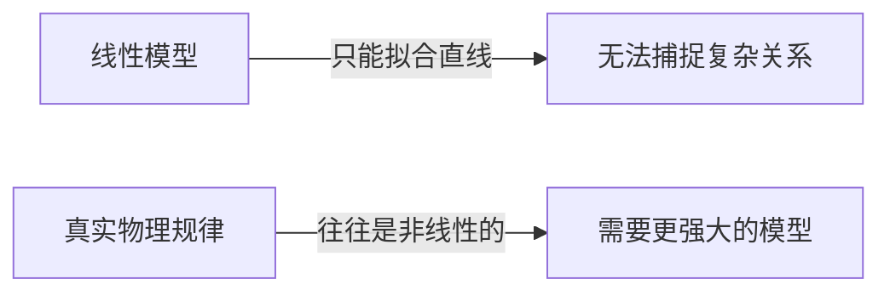
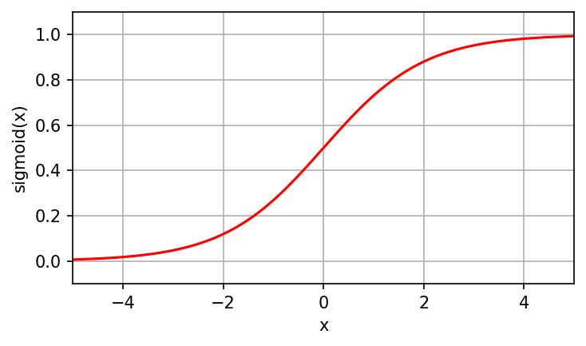
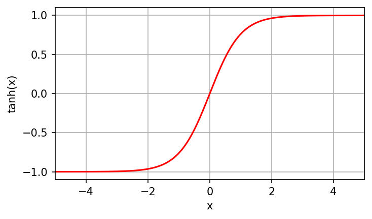
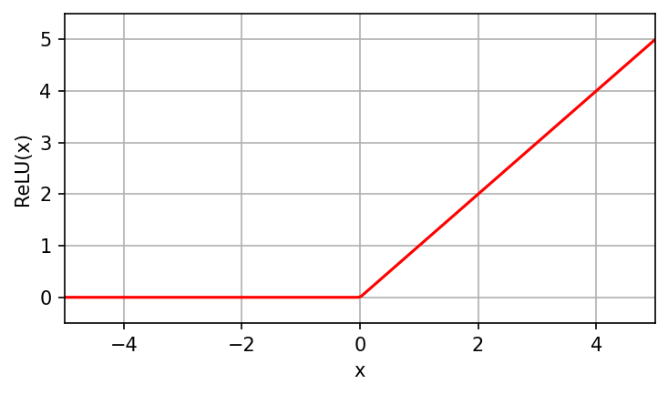
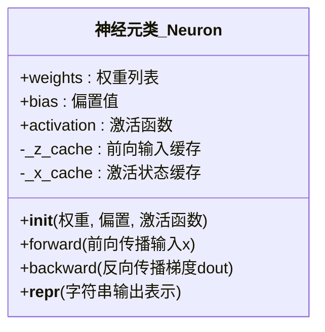
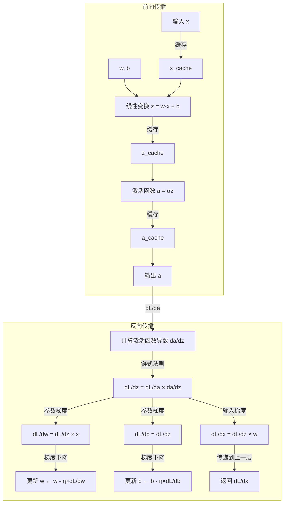
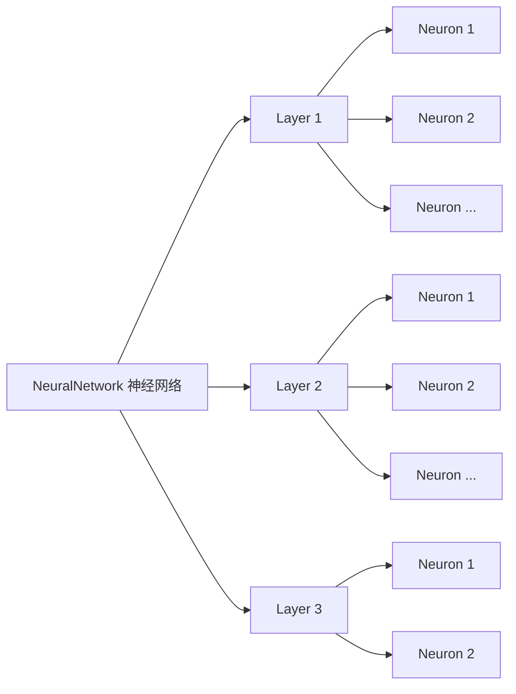
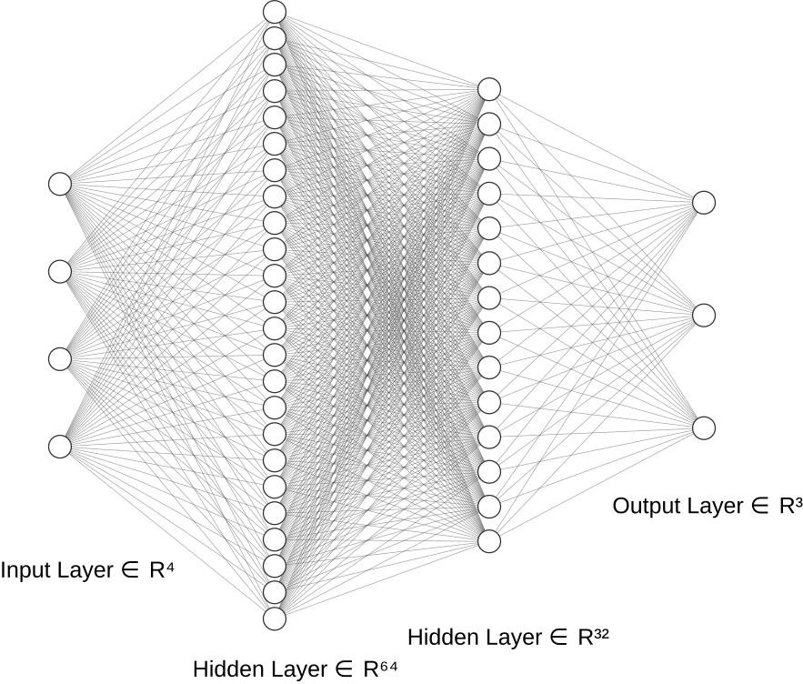
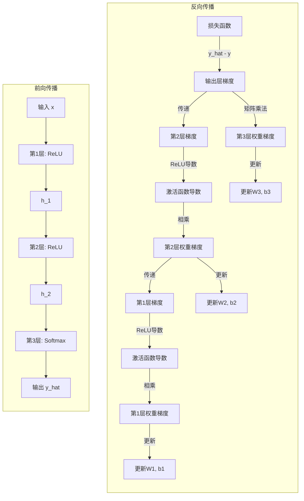

#  2.神经元的数学本质与实现

> **本节目标**：
> 
> - 🎯 理解神经元从线性回归的演变过程
> - 🧮 掌握神经元的完整数学模型和前向传播
> - 📊 学习常用激活函数的特点及其导数
> - 💻 用NumPy从零实现支持反向传播的神经元
> - 🧠 理解多层神经网络的构建和训练
> - 🔍 掌握Softmax+交叉熵的梯度简化技巧
> - 🚀 通过鸢尾花分类案例理解完整神经网络流程

---

## 1. 从线性回归说起：神经元的前身

在开始神经网络之前，我们先回到最熟悉的**线性回归**。假设你在做一个流体力学实验，想用入口速度 $v$ 来预测出口压力 $p$：

$$
p = w \cdot v + b
$$

其中：

- $w$ 是**权重（weight）**，表示速度对压力的影响程度
- $b$ 是**偏置（bias）**，表示基准压力值

这就是最简单的**线性模型**。如果我们有多个输入特征（比如速度、温度、密度），模型就变成：

$$
y = w_1 x_1 + w_2 x_2 + w_3 x_3 + b
$$

用向量形式表示更简洁：

$$
y = \mathbf{W}^T \mathbf{x} + b
$$

其中 $\mathbf{x} = [x_1, x_2, x_3]^T$ 是输入向量，$\mathbf{W} = [w_1, w_2, w_3]^T$ 是权重向量。

**这就是一个神经元的雏形！**

---

## 2. 线性模型的局限：为什么需要非线性？

线性模型有一个致命缺陷：**它只能拟合直线（或超平面）**。

### 一个物理例子

考虑流体绕圆柱的阻力系数 $C_D$ 与雷诺数 $Re$ 的关系。在低雷诺数时，$C_D \propto \frac{1}{Re}$（Stokes 流）；在高雷诺数时，$C_D$ 趋于常数。这种关系**不是线性的**！

如果我们用线性回归 $C_D = w \cdot Re + b$ 去拟合，效果会很差：



**解决方案**：在线性变换后加一个**非线性函数**，这就是**激活函数（Activation Function）**。

---

## 3. 激活函数：赋予神经元非线性能力

一个完整的神经元模型是：

$$
y = \sigma(\mathbf{W}^T \mathbf{x} + b)
$$

其中 $\sigma(\cdot)$ 是激活函数。常见的激活函数有：

### 3.1. Sigmoid 函数

$$
\sigma(z) = \frac{1}{1 + e^{-z}}
$$



**特点**：

- 输出范围：$(0, 1)$
- 形状：S 型曲线
- 物理意义：可以理解为"概率"或"饱和度"

**优点**：

- 输出有界，适合做二分类（输出可解释为概率）
- 平滑可导

**缺点**：

- **梯度消失**：当 $|z|$ 很大时，$\sigma'(z) \approx 0$，导致反向传播时梯度几乎为零
- 输出不是零中心化的（输出均值不为 0），会导致训练效率下降

**数学推导**：Sigmoid 的导数有一个优美的性质：

$$
\frac{d\sigma(z)}{dz} = \sigma(z)(1 - \sigma(z))
$$

**证明**：

$$
\begin{align*}
\frac{d}{dz}\left(\frac{1}{1+e^{-z}}\right) &= \frac{e^{-z}}{(1+e^{-z})^2} \\
&= \frac{1}{1+e^{-z}} \cdot \frac{e^{-z}}{1+e^{-z}} \\
&= \sigma(z) \cdot (1 - \sigma(z))
\end{align*}
$$

### 3.2. Tanh 函数（双曲正切）

$$
\tanh(z) = \frac{e^z - e^{-z}}{e^z + e^{-z}} = \frac{2}{1 + e^{-2z}} - 1
$$



**特点**：

- 输出范围：$(-1, 1)$
- 形状：S 型曲线，但关于原点对称
- 物理意义：可以理解为"归一化的偏差"

**优点**：

- 输出是零中心化的（均值为 0），训练效率比 Sigmoid 高
- 梯度比 Sigmoid 稍大

**缺点**：

- 仍然存在梯度消失问题

**数学性质**：

$$
\tanh(z) = 2\sigma(2z) - 1
$$

即 Tanh 可以看作是 Sigmoid 的线性变换。

### 3.3. ReLU 函数（修正线性单元）

$$
\text{ReLU}(z) = \max(0, z) = \begin{cases}
z, & z > 0 \\
0, & z \leq 0
\end{cases}
$$



**特点**：

- 输出范围：$[0, +\infty)$
- 形状：分段线性
- 物理意义：类似"单向阀"，只允许正向信号通过

**优点**：

- **计算简单**：只需要一个比较和选择操作
- **缓解梯度消失**：在正区间梯度恒为 1
- **稀疏激活**：负值输入直接输出 0，使得网络更稀疏

**缺点**：

- **Dead ReLU 问题**：如果神经元的输入总是负数，梯度永远为 0，神经元"死亡"

**数学推导**：ReLU 的导数为：

$$
\frac{d \text{ReLU}(z)}{dz} = \begin{cases}
1, & z > 0 \\
0, & z \leq 0
\end{cases}
$$

（在 $z=0$ 处不可导，但实践中通常定义为 0 或 1）

### 3.4. 更多激活函数特性对比

如需深入理解，可以参阅推荐文章：

- [换个视角看结构：从“值域与边界”直观理解激活函数选型（初学激活函数） - 知乎](https://zhuanlan.zhihu.com/p/2039487698520519677)
- [神经网络中的激活函数及其各自的优缺点、以及如何选择激活函数_神经网络的激活函数有哪些？他们对神经网络的性能有何影响。-CSDN博客](https://blog.csdn.net/qq_40765537/article/details/106086418)
- [神经网络激活函数：从ReLU到前沿SwiGLU - 技术栈](https://jishuzhan.net/article/1963036856050302978)

---

## 4. 神经元的完整数学模型

综合以上，一个神经元的计算过程可以分为两步：

### 第一步：线性变换（加权求和）

$$
z = \mathbf{W}^T \mathbf{x} + b = \sum_{i=1}^{n} w_i x_i + b
$$

这一步是**线性的**，相当于在高维空间中做投影。

### 第二步：非线性激活

$$
a = \sigma(z)
$$

这一步引入**非线性**，使得神经元能够拟合复杂函数。

**完整流程图**：


---

## 5. 从单个神经元到神经网络

如果我们有多个神经元并行工作，每个神经元有自己的权重和偏置，就构成了一个**神经网络层**：

$$
\mathbf{a} = \sigma(\mathbf{W} \mathbf{x} + \mathbf{b})
$$

其中：

- $\mathbf{x} \in \mathbb{R}^{n}$ 是输入向量（$n$ 个特征）
- $\mathbf{W} \in \mathbb{R}^{m\times n}$ 是权重矩阵（$m$ 个神经元）
- $\mathbf{b} \in \mathbb{R}^{m}$ 是偏置向量
- $\mathbf{a} \in \mathbb{R}^{m}$ 是输出向量

**矩阵形式的物理意义**：

- 每一行 $\mathbf{W}_i$ 代表第 $i$ 个神经元的权重
- $\mathbf{W} \mathbf{x}$ 相当于 $m$ 个神经元同时对输入做线性变换
- $\sigma(\cdot)$ 对每个元素独立作用

---

## 6. NumPy 从零实现一个神经元

让我们用 NumPy 实现一个最简单的神经元，包括前向传播和反向传播。

### 6.1. 激活函数及其导数

激活函数不仅在前向传播中引入非线性，其导数在反向传播中计算梯度至关重要。

#### Sigmoid 函数及其导数

```python
@staticmethod
def sigmoid(z):
    """Sigmoid函数及其导数"""
    a = 1 / (1 + np.exp(-z))
    da = a * (1 - a)  # sigmoid的导数：a * (1 - a)
    return a, da
```

**数学原理**：Sigmoid 的导数有一个优美的性质，可以用输出直接表示：
$$
\frac{d\sigma(z)}{dz} = \sigma(z) \cdot (1 - \sigma(z)) = a \cdot (1 - a)
$$

这极大简化了反向传播的计算，因为我们不需要重新计算 $e^{-z}$，直接使用缓存的输出 $a$ 即可。

**代码优势**：

- ✅ **缓存友好**：一次计算，两次使用（前向用 $a$，反向用 $a(1-a)$）
- ✅ **数值稳定**：避免了直接对指数求导的数值问题
- ✅ **计算高效**：只需要简单的乘法运算

#### ReLU 函数及其导数

```python
@staticmethod
def relu(z):
    """ReLU函数及其导数"""
    a = np.maximum(0, z)
    da = (z > 0).astype(float)  # ReLU的导数：z > 0时为1，否则为0
    return a, da
```

**数学原理**：ReLU 的导数是分段函数：
$$
\frac{d \text{ReLU}(z)}{dz} = \begin{cases}
1, & z > 0 \\
0, & z \leq 0
\end{cases}
$$

**代码亮点**：
- ✅ **向量化操作**：`np.maximum(0, z)` 和 `(z > 0).astype(float)` 都是向量化的，可以同时处理多个神经元
- ✅ **效率极高**：只涉及比较和类型转换，没有指数运算
- ✅ **自动处理梯度消失**：当 $z \leq 0$ 时，导数为 0，这就是"Dead ReLU"问题的根源

#### Softmax 函数及其导数

```python
@staticmethod
def softmax(z):
    """Softmax函数（用于多分类）"""
    exp_z = np.exp(z)
    sum_exp_z = exp_z.sum()
    a = exp_z / sum_exp_z
    da = a * (1 - a) * (1 - a)  # 简化的导数表达式
    return a, da
```

**数学原理**：Softmax 将任意实数向量转换为概率分布：
$$
\text{Softmax}(\mathbf{z})_i = \frac{e^{z_i}}{\sum_{j=1}^{K} e^{z_j}}
$$

其导数相对复杂，但有一个重要性质：当与交叉熵损失结合时，梯度计算会极大简化。

**代码技巧**：
- ✅ **数值稳定性**：实际实现中应该先减去最大值（但在简化版本中省略）
- ✅ **概率归一化**：输出自动满足 $\sum_i a_i = 1$

### 6.2. 完整神经元实现（含反向传播）

现在，让我们将所学的面向对象知识应用到神经网络中，构建一个完整的 `Neuron` 类。

#### 设计思路

一个神经元需要：
- **属性**：权重、偏置、激活函数类型
- **方法**：前向传播、反向传播
- **封装**：隐藏权重初始化的细节
- **灵活性**：支持不同的激活函数

#### 类图：



#### 面向对象的优势体现

| 特性 | 传统方式 | 面向对象 |
|------|----------|----------|
| **数据管理** | 多个独立变量 | 封装在对象中 |
| **代码复用** | 复制粘贴函数 | 创建多个对象 |
| **扩展性** | 修改所有相关代码 | 继承和重写 |
| **可读性** | 函数和数据分离 | 逻辑清晰集中 |

**在配套的 Notebook 中**，你将：
- ✅ 从零开始构建 `Neuron` 类
- ✅ 实现前向传播和反向传播
- ✅ 添加不同的激活函数支持
- ✅ 测试神经元的功能

#### ***让我们从零实现一个支持前向和反向传播的神经元：***

```python
class Neuron:
    """单个神经元：支持前向传播和反向传播"""
    
    def __init__(self, n_inputs: int, activation: str = 'relu'):
        self.w = np.random.randn(n_inputs) * 0.1
        self.b = np.random.randn() * 0.1
        self.activation_name = activation
        
        # 缓存前向传播的中间结果（反向传播时需要）
        self.z_cache = None   # 缓存线性变换结果
        self.a_cache = None   # 缓存激活函数输出
        self.x_cache = None   # 缓存输入向量
```

**设计哲学**：
- **缓存机制**：反向传播需要前向传播的中间结果，因此必须缓存
- **小随机初始化**：权重和偏置用小随机数初始化，避免训练开始时梯度过大或过小
- **类型提示**：`n_inputs: int` 和 `activation: str` 提供代码可读性

#### 前向传播实现

```python
def forward(self, x):
    """前向传播"""
    # 缓存输入
    self.x_cache = x.copy()
    
    # 线性变换：z = w·x + b
    self.z_cache = np.dot(self.w, x) + self.b
    
    # 激活函数：a = σ(z)
    if self.activation_name == 'sigmoid':
        self.a_cache, _ = ActivationFunctions.sigmoid(self.z_cache)
    elif self.activation_name == 'tanh':
        self.a_cache, _ = ActivationFunctions.tanh(self.z_cache)
    elif self.activation_name == 'relu':
        self.a_cache, _ = ActivationFunctions.relu(self.z_cache)
    else:
        self.a_cache = self.z_cache
    
    return self.a_cache
```

**数学表达**：

$$
a = \sigma(\mathbf{w}^T \mathbf{x} + b) = \sigma(z)
$$

**代码解析**：
1. **缓存输入**：`self.x_cache = x.copy()`，反向传播计算 $dL/dw$ 时需要
2. **线性变换**：`np.dot(self.w, x) + self.b`，对应 $z = \mathbf{w}^T \mathbf{x} + b$
3. **激活函数**：根据激活函数类型调用对应函数
4. **返回输出**：$a = \sigma(z)$

#### 反向传播实现（核心！）

```python
def backward(self, dL_da, learning_rate=0.01):
    """反向传播：计算梯度并更新参数
    
    参数:
        dL_da: 损失对输出的梯度（标量）
        learning_rate: 学习率
    
    返回:
        dL_dx: 损失对输入的梯度，形状 (n_inputs,)
    """
    # 1. 计算激活函数的导数：da/dz
    if self.activation_name == 'sigmoid':
        _, da_dz = ActivationFunctions.sigmoid(self.z_cache)
    elif self.activation_name == 'tanh':
        _, da_dz = ActivationFunctions.tanh(self.z_cache)
    elif self.activation_name == 'relu':
        _, da_dz = ActivationFunctions.relu(self.z_cache)
    else:
        da_dz = 1.0
    
    # 2. 链式法则：dL/dz = dL/da * da/dz
    dL_dz = dL_da * da_dz
    
    # 3. 计算参数梯度：
    # dL/dw = dL/dz * dz/dw = dL/dz * x
    dL_dw = dL_dz * self.x_cache
    # dL/db = dL/dz * dz/db = dL/dz * 1
    dL_db = dL_dz
    
    # 4. 更新参数（梯度下降）
    self.w -= learning_rate * dL_dw
    self.b -= learning_rate * dL_db
    
    # 5. 计算输入梯度（用于反向传播到上一层）
    # dL/dx = dL/dz * dz/dx = dL/dz * w
    dL_dx = dL_dz * self.w
    
    return dL_dx
```

**数学原理深度解析**：

反向传播的核心是**链式法则**。我们需要计算损失函数 $L$ 对各个参数的梯度，然后使用梯度下降更新参数。

**第一步：计算激活函数导数**

$$
\frac{da}{dz} = \sigma'(z)
$$

根据不同的激活函数：
- Sigmoid: $\frac{da}{dz} = a(1-a)$
- ReLU: $\frac{da}{dz} = \begin{cases}1, & z > 0 \\ 0, & z \leq 0 \end{cases}$

**第二步：应用链式法则计算 $dL/dz$**

$$
\frac{dL}{dz} = \frac{dL}{da} \cdot \frac{da}{dz}
$$

这就是代码中的 `dL_dz = dL_da * da_dz`。

**第三步：计算权重梯度**

$$
\frac{dL}{dw} = \frac{dL}{dz} \cdot \frac{dz}{dw} = \frac{dL}{dz} \cdot \frac{d}{dw}(\mathbf{w}^T \mathbf{x} + b) = \frac{dL}{dz} \cdot \mathbf{x}
$$

这就是代码中的 `dL_dw = dL_dz * self.x_cache`。

**第四步：计算偏置梯度**

$$
\frac{dL}{db} = \frac{dL}{dz} \cdot \frac{dz}{db} = \frac{dL}{dz} \cdot 1 = \frac{dL}{dz}
$$

这就是代码中的 `dL_db = dL_dz`。

**第五步：计算输入梯度（用于上一层）**

$$
\frac{dL}{dx} = \frac{dL}{dz} \cdot \frac{dz}{dx} = \frac{dL}{dz} \cdot \frac{d}{dx}(\mathbf{w}^T \mathbf{x} + b) = \frac{dL}{dz} \cdot \mathbf{w}
$$

这就是代码中的 `dL_dx = dL_dz * self.w`。

**梯度下降更新**：

$$
\mathbf{w} \leftarrow \mathbf{w} - \eta \cdot \frac{dL}{dw}
$$
$$
b \leftarrow b - \eta \cdot \frac{dL}{db}
$$

其中 $\eta$ 是学习率，对应代码中的 `learning_rate`。

**代码运行示例**：

```python
neuron = Neuron(n_inputs=3, activation='relu')
x = np.array([1.0, 2.0, 3.0])

# 前向传播
output = neuron.forward(x)  # a = ReLU(w·x + b)

# 假设损失梯度（从损失函数传来）
dL_da = 0.5  # dL/da

# 反向传播
dL_dx = neuron.backward(dL_da, learning_rate=0.1)
# 返回：[梯度对每个输入分量的偏导]
```

**完整流程可视化**：



### 6.3. 测试和验证

```python
# 测试神经元
neuron = Neuron(n_inputs=3, activation='relu')
x = np.array([1.0, 2.0, 3.0])

output = neuron.forward(x)
print(f"前向传播输出: {output:.4f}")
print(f"缓存的 z: {neuron.z_cache:.4f}")

# 反向传播
dL_da = 0.5
dL_dx = neuron.backward(dL_da, learning_rate=0.1)
print(f"输入梯度 dL/dx: {dL_dx}")
```

这个测试展示了：
1. **前向传播**：计算输出并缓存中间结果
2. **反向传播**：给定输出梯度，计算所有梯度并更新参数
3. **梯度传递**：返回对输入的梯度，用于反向传播到上一层

---

## 7. 一个实际应用场景：鸢尾花分类

现在让我们设计一个完整的神经网络来解决实际问题。

### 7.1. 问题描述

**任务**：根据鸢尾花的 4 个特征（花萼长度、花萼宽度、花瓣长度、花瓣宽度），预测它属于 3 个品种中的哪一个（Setosa, Versicolor, Virginica）。

有了 `Neuron` 类，我们可以进一步构建 `Layer` 类和 `NeuralNetwork` 类。这展示了面向对象编程中的**组合（Composition）**思想。

#### 三层架构



**网络结构**：

```
输入层 (4) → 隐藏层1 (64) → 隐藏层2 (32) → 输出层 (3)
```

- **输入层**：4 个特征
- **隐藏层 1**：64 个神经元，使用 ReLU 激活
- **隐藏层 2**：32 个神经元，使用 ReLU 激活
- **输出层**：3 个神经元（对应 3 个类别），使用 Softmax 激活

### 7.2. 为什么选择这个结构？

1. **输入层 (4)**：由数据特征数量决定
2. **第一隐藏层 (64)**：足够的容量学习特征的复杂组合
3. **第二隐藏层 (32)**：逐步降维，提取高层次特征
4. **输出层 (3)**：对应 3 个分类类别

**设计原则**：

- 隐藏层神经元数量通常在输入和输出之间
- 逐层递减有助于特征的层次化提取
- 对于小数据集（鸢尾花只有 150 个样本），这个网络已经足够

### 7.3. 网络架构图



### 7.4. 数学表达

整个网络的前向传播过程：

$$
\begin{align*}
\mathbf{h}_1 &= \text{ReLU}(\mathbf{W}_1 \mathbf{x} + \mathbf{b}_1) \quad &	\text{(4 → 64)} \\
\mathbf{h}_2 &= \text{ReLU}(\mathbf{W}_2 \mathbf{h}_1 + \mathbf{b}_2) \quad &	\text{(64 → 32)} \\
\mathbf{y} &= \text{Softmax}(\mathbf{W}_3 \mathbf{h}_2 + \mathbf{b}_3) \quad &	\text{(32 → 3)}
\end{align*}
$$

其中 Softmax 函数：

$$
\text{Softmax}(\mathbf{z})_i = \frac{e^{z_i}}{\sum_{j=1}^{3} e^{z_j}}
$$

保证输出是概率分布（和为 1）。

---

### 7.5. 多层神经网络的反向传播

单个神经元的反向传播相对简单，但多层神经网络涉及更多细节。让我们深入理解多层网络中梯度的流动。

#### 网络结构回顾

我们的网络结构是：

```
输入层 (4) → 隐藏层1 (64) → 隐藏层2 (32) → 输出层 (3)
```

数学表达：

$$
\begin{align*}
\mathbf{h}_1 &= \text{ReLU}(\mathbf{W}_1 \mathbf{x} + \mathbf{b}_1) \quad &	ext{(4 → 64)} \\
\mathbf{h}_2 &= \text{ReLU}(\mathbf{W}_2 \mathbf{h}_1 + \mathbf{b}_2) \quad &	ext{(64 → 32)} \\
\mathbf{y} &= \text{Softmax}(\mathbf{W}_3 \mathbf{h}_2 + \mathbf{b}_3) \quad &	ext{(32 → 3)}
\end{align*}
$$

#### Softmax + 交叉熵的梯度简化

这是一个关键优化！当 Softmax 与交叉熵损失结合时，梯度计算极大简化。

**交叉熵损失**：

$$
L = -\sum_{i=1}^{C} y_i \log(\hat{y}_i)
$$

其中 $y$ 是真实标签（one-hot 编码），$\hat{y}$ 是网络输出概率。

**Softmax + 交叉熵的梯度**：

$$
\frac{\partial L}{\partial z_i} = \hat{y}_i - y_i
$$

这个结果的推导涉及复杂的矩阵微积分，但其含义非常直观：
- 如果预测概率 $\hat{y}_i$ 大于真实标签 $y_i$，需要降低 $z_i$
- 如果预测概率 $\hat{y}_i$ 小于真实标签 $y_i$，需要提高 $z_i$

**代码实现**：

```python
def backward(self, y_true, learning_rate=0.01):
    """反向传播：计算梯度并更新参数
    
    参数:
        y_true: 真实标签，形状 (n_samples, n_outputs) (one-hot编码)
        learning_rate: 学习率
    """
    # 获取预测值
    y_pred = self.a_cache[-1]  # Softmax 输出
    n_samples = y_true.shape[0]
    
    # Softmax + 交叉熵的简化梯度
    dL_da = (y_pred - y_true) / n_samples  # 归一化到批次
```

**代码要点**：
- **梯度简化**：直接计算 `y_pred - y_true`，无需复杂的矩阵运算
- **批次归一化**：除以 `n_samples` 避免梯度随批次大小变化

#### 逐层反向传播

让我们从最后一层开始，逐步反向传播到输入层：

#### 输出层（第 3 层）的反向传播

```python
# 输出层使用 Softmax + 交叉熵
if self.activations[-1] == 'softmax':
    dL_dz = dL_da  # 已经简化为 y_pred - y_true

# 计算参数梯度
dL_dW = np.dot(dL_dz.T, a_prev)  # a_prev 是 h_2
dL_db = np.sum(dL_dz, axis=0)

# 更新参数
self.weights[-1] -= learning_rate * dL_dW
self.biases[-1] -= learning_rate * dL_db

# 计算传递给下一层的梯度
dL_da = np.dot(dL_dz, self.weights[-1])
```

**数学表达**：

$$
\frac{\partial L}{\partial \mathbf{W}_3} = \frac{\partial L}{\partial \mathbf{z}_3} \cdot \frac{\partial \mathbf{z}_3}{\partial \mathbf{W}_3} = (\hat{\mathbf{y}} - \mathbf{y}) \cdot \mathbf{h}_2^T
$$

**代码对应**：
- `dL_dz` 对应 $\frac{\partial L}{\partial \mathbf{z}_3} = \hat{\mathbf{y}} - \mathbf{y}$
- `a_prev` 对应 $\mathbf{h}_2$（隐藏层 2 的输出）
- `np.dot(dL_dz.T, a_prev)` 对应矩阵乘法 $(\hat{\mathbf{y}} - \mathbf{y})^T \cdot \mathbf{h}_2$

#### 隐藏层 2（第 2 层）的反向传播

```python
# 获取上一层传来的梯度
dL_da = np.dot(dL_dz, self.weights[-1])  # 从输出层传来的梯度

# 计算激活函数导数
_, da_dz = ActivationFunctions.relu(self.z_cache[1])  # h_2 的 z

# 应用链式法则
dL_dz = dL_da * da_dz

# 计算参数梯度
dL_dW = np.dot(dL_dz.T, a_prev)  # a_prev 是 h_1
dL_db = np.sum(dL_dz, axis=0)

# 更新参数
self.weights[1] -= learning_rate * dL_dW
self.biases[1] -= learning_rate * dL_db

# 传递到下一层
dL_da = np.dot(dL_dz, self.weights[1])
```

**数学表达**：

$$
\frac{\partial L}{\partial \mathbf{W}_2} = \frac{\partial L}{\partial \mathbf{h}_2} \cdot \frac{d\text{ReLU}}{dz} \cdot \frac{\partial z_2}{\partial \mathbf{W}_2}
$$

**关键步骤**：
1. **接收梯度**：`dL_da = np.dot(dL_dz, self.weights[-1])`，从输出层接收梯度
2. **激活函数导数**：ReLU 的导数 `da_dz`，决定哪些神经元"激活"了梯度
3. **链式法则**：`dL_dz = dL_da * da_dz`，激活函数导数与梯度相乘
4. **参数梯度**：`np.dot(dL_dz.T, a_prev)`，计算权重梯度
5. **梯度传递**：`np.dot(dL_dz, self.weights[1])`，传递到下一层

#### 隐藏层 1（第 1 层）的反向传播

```python
# 与隐藏层 2 类似
_, da_dz = ActivationFunctions.relu(self.z_cache[0])  # h_1 的 z
dL_dz = dL_da * da_dz

dL_dW = np.dot(dL_dz.T, a_prev)  # a_prev 是输入 x
dL_db = np.sum(dL_dz, axis=0)

# 更新参数
self.weights[0] -= learning_rate * dL_dW
self.biases[0] -= learning_rate * dL_db

# 最后一层，不需要计算输入梯度
```

#### 完整的反向传播流程



#### 交叉熵损失函数

```python
def cross_entropy_loss(self, y_true, y_pred):
    """交叉熵损失函数
    
    参数:
        y_true: 真实标签
        y_pred: 预测概率
    
    返回:
        loss: 平均交叉熵损失
    """
    # 避免 log
    y_pred = np.clip(y_pred, 1e-15, 1 - 1e-15)
    
    # 交叉熵：-sum(y_true * log(y_pred))
    loss = -np.sum(y_true * np.log(y_pred)) / y_true.shape[0]
    return loss
```

**数学表达**：

$$
L = -\frac{1}{N}\sum_{i=1}^{N}\sum_{c=1}^{C} y_{i,c} \log(\hat{y}_{i,c})
$$

**代码要点**：
- **数值稳定性**：`np.clip(y_pred, 1e-15, 1 - 1e-15)` 避免 $\log(0)$
- **批次平均**：除以 `y_true.shape[0]` 得到平均损失
- **one-hot 编码**：`y_true` 通常是 one-hot 编码的向量

#### 训练循环

```python
for epoch in range(epochs):
    # 按批次训练
    for X_batch, y_batch in data_loader:
        # 1 前向传播
        y_pred = network.forward(X_batch)
        
        # 2 计算损失
        loss = network.cross_entropy_loss(y_onehot, y_pred)
        
        # 3 反向传播并更新参数
        network.backward(y_onehot, learning_rate)
```

**训练流程**：

1. **前向传播**：计算预测值 `y_pred`
2. **损失计算**：计算交叉熵损失（用于监控）
3. **反向传播**：计算所有梯度并更新参数
4. **重复**：对每个批次重复以上步骤

#### 梯度流动的直观理解

让我们用数值例子理解梯度如何流动：

假设：
- 输入 $x = [1, 2, 3, 4]$
- 真实标签 $y = [1, 0, 0]$（类别 0）
- 网络预测 $\hat{y} = [0.3, 0.5, 0.2]$

**步骤 1：输出层梯度**

$$
\frac{\partial L}{\partial z_{output}} = \hat{y} - y = [0.3-1, 0.5-0, 0.2-0] = [-0.7, 0.5, 0.2]
$$

**步骤 2：传递到隐藏层 2**

$$
\frac{\partial L}{\partial h_2} = \frac{\partial L}{\partial z_{output}} \cdot W_3
$$

如果 $W_3$ 的某些行值较大，对应的隐藏层神经元梯度就大。

**步骤 3：ReLU 激活函数的作用**

```python
da_dz = (z > 0).astype(float)  # ReLU 导数
dL_dz = dL_da * da_dz
```

如果某个神经元的 $z \leq 0$，其 `da_dz = 0`，梯度被"杀死"（Dead ReLU）。

#### Xavier 初始化的重要性

```python
# Xavier初始化
scale = np.sqrt(2.0 / n_inputs)
self.weights.append(np.random.randn(n_outputs, n_inputs) * scale)
```

**数学原理**：Xavier 初始化确保每层的输入和输出方差大致相同：

$$
\text{Var}[w] = \frac{2}{n_{inputs}}
$$

这避免了梯度消失或爆炸问题，是训练深度网络的关键技巧。

**代码实现的优势**：
- ✅ **数值稳定**：避免初始权重过大或过小
- ✅ **训练加速**：梯度传播更稳定
- ✅ **通用性强**：适用于各种激活函数

---

**完整实现代码将在配套的 Jupyter Notebook 中提供**，包括：

- 数据加载和预处理
- 网络的 NumPy 实现
- 训练过程可视化
- 性能评估

---

## 8. 为什么单个神经元不够？

单个神经元只能拟合**单调函数**（因为激活函数通常是单调的）。要拟合复杂的非单调函数，需要**多个神经元组合**。

**万能逼近定理（Universal Approximation Theorem）**：
一个包含足够多神经元的单隐藏层神经网络，可以以任意精度逼近任何连续函数。

但实践中，**深度网络**（多层但每层神经元较少）比**宽度网络**（单层但神经元很多）更高效，因为：

1. **参数效率**：深度网络用更少的参数表达更复杂的函数
2. **层次化特征**：每一层学习不同抽象级别的特征
3. **更好的泛化**：深度结构提供了隐式的正则化

---

## 9. 小结

| 概念       | 数学表达                                                  | 物理意义                       | 代码实现要点                 |
| ---------- | --------------------------------------------------------- | ------------------------------ | ---------------------------- |
| **线性变换**   | $z = \mathbf{W}^T \mathbf{x} + b$                         | 加权求和，投影到新空间         | `np.dot(w, x) + b`           |
| **激活函数**   | $a = \sigma(z)$                                           | 引入非线性，模拟神经元的"激活" | 缓存结果用于反向传播         |
| **激活函数导数** | $\frac{da}{dz} = \sigma'(z)$                              | 计算梯度传播的关键因子         | 利用缓存的输出高效计算       |
| **神经元**     | $a = \sigma(\mathbf{W}^T \mathbf{x} + b)$                 | 最小的计算单元                 | 缓存 `x, z, a` 三个中间结果   |
| **链式法则**   | $\frac{dL}{dz} = \frac{dL}{da} \cdot \frac{da}{dz}$       | 反向传播的核心数学原理         | `dL_dz = dL_da * da_dz`      |
| **权重梯度**   | $\frac{dL}{dW} = \frac{dL}{dz} \cdot \mathbf{x}^T$        | 损失对权重的偏导数             | `np.dot(dL_dz.T, x)`         |
| **偏置梯度**   | $\frac{dL}{db} = \frac{dL}{dz}$                           | 损失对偏置的偏导数             | `np.sum(dL_dz)`              |
| **输入梯度**   | $\frac{dL}{dx} = \frac{dL}{dz} \cdot \mathbf{W}$          | 传递到上一层的梯度             | `np.dot(dL_dz, w)`           |
| **梯度下降**   | $\mathbf{W} \leftarrow \mathbf{W} - \eta \frac{dL}{dW}$   | 参数更新规则                   | `w -= learning_rate * dL_dw`  |
| **Softmax+CE** | $\frac{dL}{dz} = \hat{y} - y$                            | 梯度简化公式                   | `y_pred - y_true`            |

### 反向传播的核心思想

反向传播的本质是**动态规划**：通过缓存前向传播的中间结果，高效计算所有参数的梯度。

**时间复杂度**：
- 前向传播：$O(N \cdot \sum_i n_i \cdot n_{i+1})$
- 反向传播：$O(N \cdot \sum_i n_i \cdot n_{i+1})$（与前向传播相同量级）

**空间复杂度**：
- 主要开销：缓存中间结果 $O(\sum_i n_i \cdot n_{i+1})$

### 数值稳定性技巧

1. **Xavier 初始化**：`scale = np.sqrt(2.0 / n_inputs)`
2. **数值稳定的 Softmax**：先减去最大值
3. **避免 log(0)**：`np.clip(y_pred, 1e-15, 1 - 1e-15)`
4. **批次归一化**：除以 `n_samples` 平均梯度

### 代码设计的优秀实践

1. **缓存机制**：前向传播缓存 `x, z, a`，反向传播直接使用
2. **向量化操作**：避免循环，利用 NumPy 的矩阵运算
3. **链式法则体现**：代码逻辑完全对应数学推导
4. **模块化设计**：激活函数、损失函数、反向传播分离

**本章重点**：

- ✅ 理解了神经元的数学原理
- ✅ 用 NumPy 实现了完整的神经元（前向+反向传播）
- ✅ 深入理解了激活函数导数的重要性
- ✅ 掌握了 Softmax + 交叉熵的梯度简化技巧
- ✅ 理解了多层神经网络的梯度流动
- ✅ 学会了 Xavier 初始化等数值稳定性技巧
- ✅ 实现了一个实际的多层网络结构

**下一章**：我们将学习更高级的优化算法——从随机梯度下降到 Adam 优化器，以及如何诊断和解决训练中的常见问题。

---

## 📚 扩展阅读

1. **激活函数的变种**：Leaky ReLU, ELU, GELU, Swish
2. **网络结构设计原则**：深度 vs 宽度的权衡
3. **生物神经元与人工神经元的区别**：脉冲编码 vs 实数编码
4. **万能逼近定理的证明**：Cybenko (1989) 的经典论文

