# PINN：物理信息神经网络完全教程

> 📖 **论文**: [Physics-informed neural networks: A deep learning framework for solving forward and inverse problems involving nonlinear partial differential equations - ScienceDirect](https://www.sciencedirect.com/science/article/pii/S0021999118307125)  
> 🧑‍🔬 **作者**: M. Raissi, P. Perdikaris, G.E. Karniadakis — Brown University  
> 💻 **配套代码**: `2.5_pinn.ipynb`

---

## 目录

1. 为什么需要 PINN？
2. 核心思想：用神经网络近似 PDE 的解
3. 技术基础：自动微分
4. 损失函数的构造
5. 案例一：一维泊松方程（入门）
6. 案例二：热传导方程（时间相关）
7. 案例三：Burgers 方程（非线性）
8. 逆问题：从数据反推物理参数
9. 常见问题与调参技巧
10. 总结与进阶

---

## Part 1：为什么需要 PINN？

### 传统数值方法的困境

在工程和科学中，我们经常需要求解**偏微分方程（PDE）**：

- 🌊 流体力学：Navier-Stokes 方程
- 🌡️ 热传导：热扩散方程
- 📡 电磁学：Maxwell 方程组
- 🌍 地震学：弹性波方程

传统数值方法（有限差分、有限元、有限体积）虽然成熟，但有固有局限：

|      局限      |            具体问题            |
| :------------: | :----------------------------: |
|  **网格依赖**  |    复杂几何形状难以剖分网格    |
|  **维数灾难**  |   高维问题计算量呈指数级增长   |
| **数据融合难** |    难以自然融合实验观测数据    |
| **逆问题困难** | 从观测数据反推参数需要额外框架 |

### 一个直觉性的问题

> 💡 **思考**：如果一个函数同时满足某个方程 **和** 某些边界条件，我们能不能用神经网络直接"猜"出这个函数？

答案正是 PINN 的出发点。

---

## Part 2：核心思想

### 2.1 神经网络作为函数逼近器

根据**通用逼近定理**，足够大的神经网络可以逼近任意连续函数。

因此，我们用神经网络 $u_\theta(x, t)$ 来近似 PDE 的解 $u(x, t)$：

$$u(x, t) \approx u_\theta(x, t)$$

其中 $\theta$ 是神经网络的所有参数（权重和偏置）。

### 2.2 PINN 与普通神经网络的本质区别

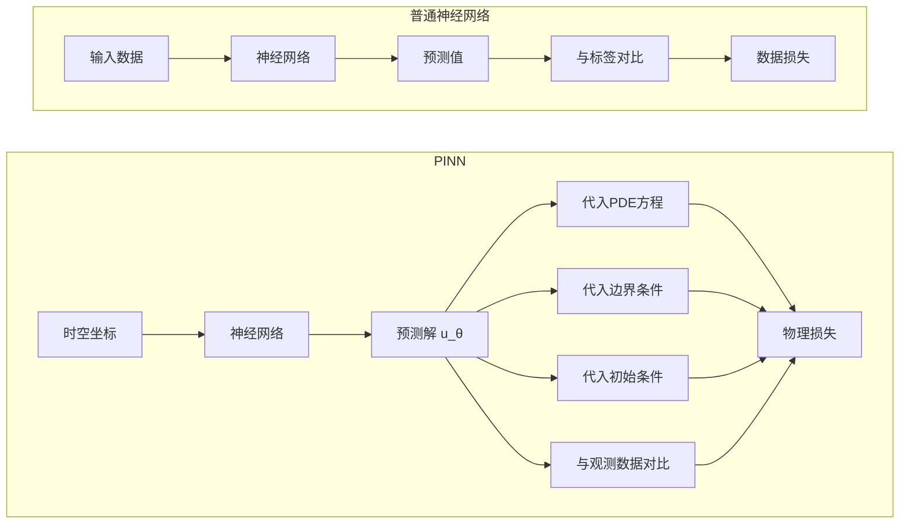

> 🔑 **关键区别**：普通神经网络只从数据学习；PINN 同时从数据和物理规律学习，即使数据稀少，物理约束也能指导网络收敛到正确解。

### 2.3 整体流程

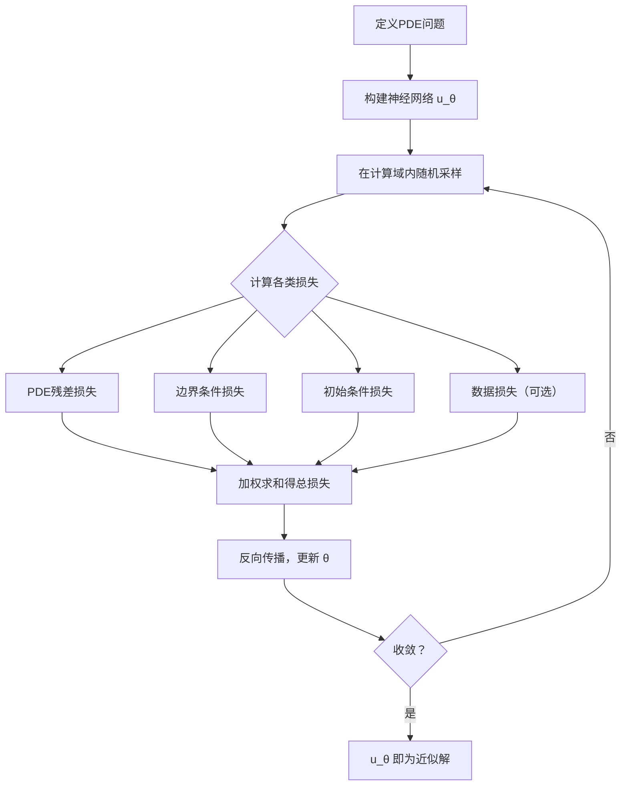

---

## Part 3：技术基础——[自动微分](../../part1_basics/pytorch_autograd.md)

### 3.1 PINN 为什么需要微分？

PDE 本身就是关于导数的方程，例如热传导方程：

$$\frac{\partial u}{\partial t} = \alpha \frac{\partial^2 u}{\partial x^2}$$

要检验神经网络的预测是否满足这个方程，就必须计算 $u_\theta$ 对 $x$ 和 $t$ 的偏导数。

### 3.2 三种微分方法对比

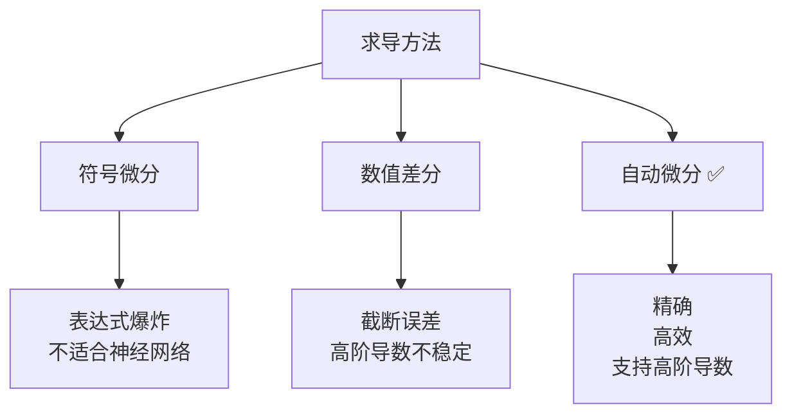

**自动微分（Automatic Differentiation）** 利用链式法则，在计算前向过程的同时构建计算图，从而精确计算任意阶导数。PyTorch 的 `torch.autograd` 正是实现了这个机制。

### 3.3 计算图的直觉

想象神经网络的计算过程是一张有向无环图（DAG）：

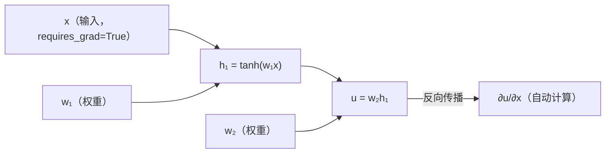

核心代码片段（仅作说明，完整代码见 ipynb）：

```python
x = torch.tensor([1.0], requires_grad=True)
u = model(x)

# 一阶导数
u_x = torch.autograd.grad(u, x, create_graph=True)[0]

# 二阶导数（create_graph=True 保留计算图以便继续求导）
u_xx = torch.autograd.grad(u_x, x)[0]
```

> ⚠️ **关键参数**：`create_graph=True` 必须在计算中间导数时使用，否则无法继续对其求高阶导数。  
> 更细致的理解可参考[自动微分：Pytorch 的核心机制](../../part1_basics/pytorch_autograd.md)

---

## Part 4：损失函数的构造

### 4.1 四类采样点

PINN 在不同区域采集**配置点（Collocation Points）**，在每类点上施加对应约束：

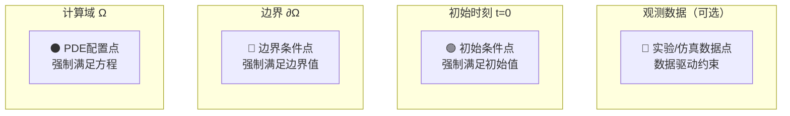

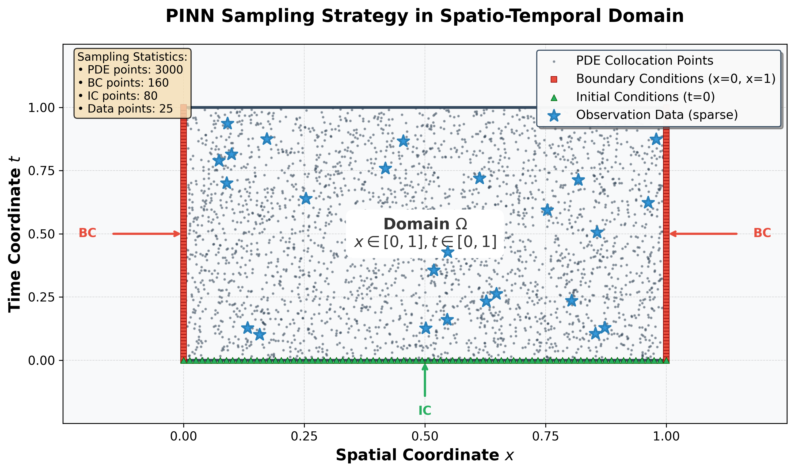

<center>图：在时空域中各类采样点的分布示意</center>

### 4.2 总损失函数

$$\mathcal{L}(\theta) = \underbrace{\lambda_f \mathcal{L}_{PDE}}_{\text{方程残差}} + \underbrace{\lambda_b \mathcal{L}_{BC}}_{\text{边界条件}} + \underbrace{\lambda_0 \mathcal{L}_{IC}}_{\text{初始条件}} + \underbrace{\lambda_d \mathcal{L}_{data}}_{\text{观测数据（可选）}}$$

每一项都是均方误差（MSE）形式：

$$\mathcal{L}_{PDE} = \frac{1}{N_f}\sum_{i=1}^{N_f}\left|\mathcal{N}[u_\theta](x_f^i, t_f^i) - f(x_f^i, t_f^i)\right|^2$$

### 4.3 权重 λ 的直觉

> 💡 **类比**：你同时要完成三门课的作业。$\lambda$ 就是每门课的学分权重。如果边界条件很难满足，就适当提高 $\lambda_b$，让网络更努力地满足它。

|    权重     | 常用初始值 |           作用           |
| :---------: | :--------: | :----------------------: |
| $\lambda_f$ |    1.0     |  控制物理方程的满足程度  |
| $\lambda_b$ |  10 ~ 100  |    边界若难满足则调大    |
| $\lambda_0$ |  10 ~ 100  |      初始条件的权重      |
| $\lambda_d$ |    100+    | 若有实验数据，赋予高权重 |

---

## Part 5：案例一——一维泊松方程（入门）

> 📂 对应 `2.5_pinn.ipynb` **Cell 1 ~ 8**

### 5.1 问题定义

$$-\frac{d^2u}{dx^2} = \pi^2\sin(\pi x), \quad x \in [0, 1]$$

$$u(0) = 0, \quad u(1) = 0$$

**解析解**（用于验证）：$u(x) = \sin(\pi x)$

### 5.2 为什么从泊松方程开始？

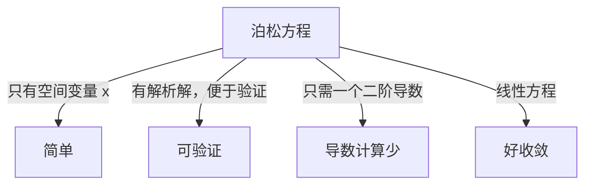

### 5.3 网络结构

PINN 通常使用**全连接网络 + tanh 激活函数**：

$$\text{输入: } x \in \mathbb{R}^1 \xrightarrow{\text{Linear + tanh}} \cdots \xrightarrow{\text{Linear + tanh}} \xrightarrow{\text{Linear}} u \in \mathbb{R}^1$$

> ❓ **为什么用 tanh 而不是 ReLU？**
>
> ReLU 的二阶导数处处为零（分段线性），无法表示 $\frac{d^2u}{dx^2}$ 的非零信息。tanh 是无限次可微的光滑函数，适合 PDE 中的高阶微分运算。

关键代码片段：

```
class PINN(nn.Module):
    def __init__(self, layers):
        # layers = [1, 32, 32, 32, 1]
        # 意义：输入1维 → 3个32宽隐藏层 → 输出1维
        ...

    def forward(self, x):
        for layer in self.layers[:-1]:
            x = torch.tanh(layer(x))  # 注意激活函数的选择
        return self.last_layer(x)
```

### 5.4 PDE 残差的计算

泊松方程的残差为：

$$r(x) = \frac{d^2 u_\theta}{dx^2} + \pi^2 \sin(\pi x)$$

    # 核心片段：计算二阶导数
    u = model(x_pde)
    u_x  = grad(u, x_pde, create_graph=True)
    u_xx = grad(u_x, x_pde)

    residual = u_xx + torch.sin(torch.pi * x_pde) * torch.pi**2
    loss_pde = torch.mean(residual**2)

### 5.5 预期结果

训练约 **3000 步**后，你应该看到：

|     指标     |   期望值    |
| :----------: | :---------: |
| 最大绝对误差 | $< 10^{-3}$ |
| PDE 残差均值 | $< 10^{-4}$ |
| 边界条件误差 | $< 10^{-6}$ |

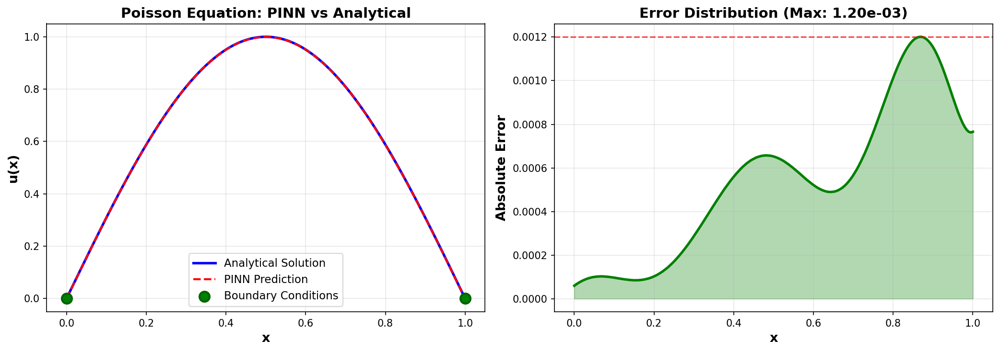

<center>图：PINN 预测解 vs 解析解（左）；绝对误差分布（右）</center>

---

## Part 6：案例二——热传导方程（时间相关）

> 📂 对应 `2.5_pinn.ipynb` **Cell 9 ~ 15**

### 6.1 问题定义

$$\frac{\partial u}{\partial t} = \alpha \frac{\partial^2 u}{\partial x^2}, \quad x \in [0,1],\; t \in [0,1]$$

$$u(x, 0) = \sin(\pi x), \quad u(0, t) = u(1, t) = 0$$

**解析解**：$u(x,t) = e^{-\alpha\pi^2 t}\sin(\pi x)$，取 $\alpha = 0.1$

### 6.2 与案例一的关键变化

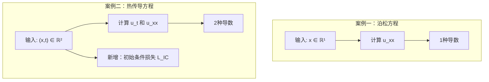

采样策略变为**二维随机采样**：

    # 在时空域 [0,1]×[0,1] 内随机撒点
    x_pde = torch.rand(N_pde, 1)   # x ∈ [0, 1]
    t_pde = torch.rand(N_pde, 1)   # t ∈ [0, 1]

### 6.3 时间维度带来的挑战

> ⚠️ **常见问题**：热传导方程的解在时间上是**指数衰减**的。网络容易偏向学习 $t=0$ 附近的行为，而对大 $t$ 的预测质量下降。
>
> **解决方案**：适当增加初始条件损失的权重 $\lambda_0$，或者在 $t$ 方向上增加采样点密度。

### 6.4 结果可视化——二维热图

结果需要在 $(x, t)$ 二维平面上展示：

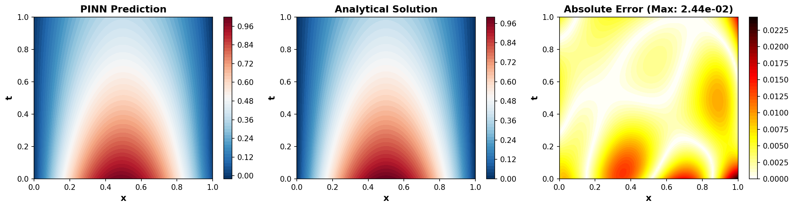

<center>图：左为 PINN 预测的时空温度场；中为解析解；右为误差分布（图片待替换）</center>

---

## Part 7：案例三——Burgers 方程（非线性挑战）

> 📂 对应 `2.5_pinn.ipynb` **Cell 16 ~ 22**

### 7.1 问题定义

$$\frac{\partial u}{\partial t} + u\frac{\partial u}{\partial x} = \nu\frac{\partial^2 u}{\partial x^2}, \quad x\in[-1,1],\; t\in[0,1]$$

$$u(x,0) = -\sin(\pi x), \quad u(\pm 1, t) = 0$$

取粘性系数 $\nu = 0.01/\pi$。

### 7.2 为什么 Burgers 方程是经典测试案例？

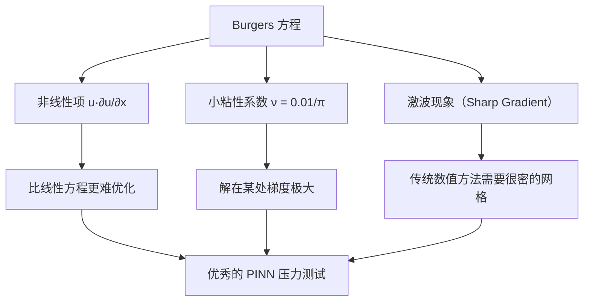

### 7.3 非线性项的处理——无需特殊操作

这是 PINN 的一个优雅之处。非线性项 $u \cdot \frac{\partial u}{\partial x}$ 在代码中直接写作：

    residual = u_t + u * u_x - nu * u_xx

因为 `u` 和 `u_x` 都在同一个计算图中，PyTorch 可以直接处理它们的乘积，**不需要任何线性化或特殊处理**。

### 7.4 激波的物理意义

随着时间推进，原本光滑的正弦波初始条件会**逐渐形成激波**（解在某点的梯度趋向无穷大）：


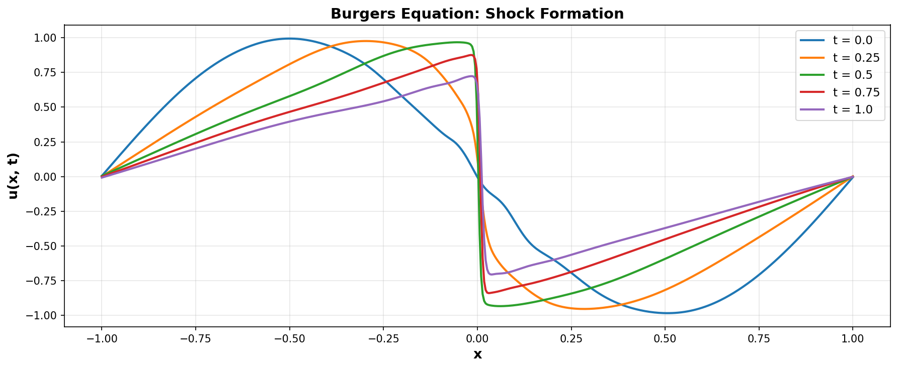

<center>图：Burgers 方程解在不同时刻的剖面，激波逐渐形成（图片待替换）</center>

### 7.5 应对技巧

|      问题      |              解决方案              |
| :------------: | :--------------------------------: |
| 激波附近误差大 | 增加配置点数量（$N_f \geq 10000$） |
|   训练不稳定   |    Adam 预热后改用 L-BFGS 精调     |
|     收敛慢     | 加宽网络（每层 64 ~ 128 个神经元） |
|    频谱偏差    |         使用傅里叶特征嵌入         |

---

## Part 8：逆问题——从数据反推物理参数

> 📂 对应 `2.5_pinn.ipynb` **Cell 23 ~ 28**

### 8.1 什么是逆问题？

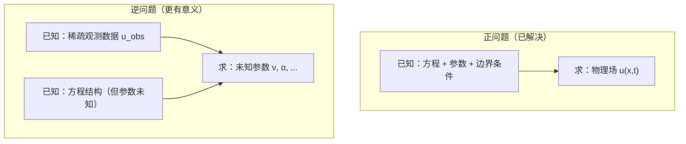

**实际应用举例**：

- 🌡️ 已知室内几个测温点 → 反推墙壁热导率
- 🌊 已知河流几处流速测量 → 反推水体粘性系数
- 🧪 已知反应浓度曲线 → 反推反应速率常数

### 8.2 PINN 处理逆问题的巧妙之处

将未知参数直接设置为**可训练的 PyTorch 参数**，与网络权重一起优化：

    class InversePINN(nn.Module):
        def __init__(self):
            ...
            # 未知参数 ν，初始化为随机值
            # 使用 log 参数化保证正值约束
            self.log_nu = nn.Parameter(torch.tensor([0.0]))

        @property
        def nu(self):
            return torch.exp(self.log_nu)  # 保证 ν > 0

这样，优化器在更新网络权重的同时，也会更新 $\nu$ 的估计值。

### 8.3 逆问题的损失函数

相比正问题，逆问题**增加了数据项**，**减少了对精确参数的依赖**：

$$\mathcal{L} = \mathcal{L}_{PDE}(\theta, \nu) + \lambda_d \mathcal{L}_{data}(\theta)$$

注意：$\mathcal{L}_{PDE}$ 现在也是 $\nu$ 的函数，因此反向传播时 $\nu$ 也会获得梯度。

### 8.4 参数识别能力实验

`2.5_pinn.ipynb` 中的实验测试了使用不同数量观测点时的参数识别精度：

| 观测点数量 |        $\nu$ 估计值         | 相对误差 |
| :--------: | :-------------------------: | :------: |
|     10     |          约 0.0035          |   ~10%   |
|     50     |         约 0.00319          |   ~1%    |
|    200     |         约 0.003183         |  ~0.1%   |
|   真实值   | $0.01/\pi \approx 0.003183$ |    —     |

> 🌟 **PINN 的惊人能力**：即使只有 **50 个稀疏观测点**，就能以 1% 的精度识别物理参数。传统方法通常需要密集的测量数据。

---

## Part 9：常见问题与调参技巧

### 9.1 PINN 为什么比普通神经网络难训练？

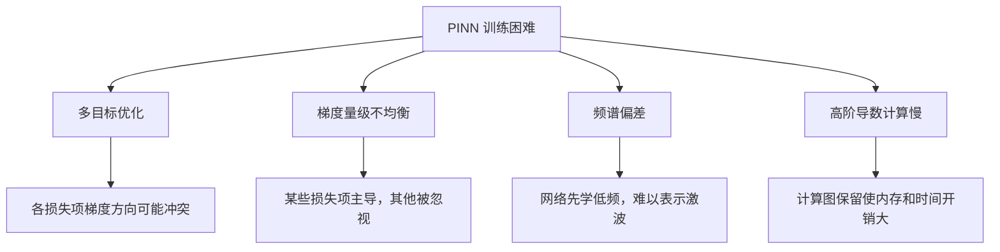

### 9.2 关键调参清单

**① 网络结构**

|   参数   |    推荐范围    |           说明           |
| :------: | :------------: | :----------------------: |
|   层数   |     4 ~ 8      | 太浅欠拟合，太深梯度消失 |
| 每层宽度 |    32 ~ 256    |      问题越复杂越宽      |
| 激活函数 | `tanh`（首选） |    光滑可微，适合 PDE    |

**② 采样点数量**

|    类型    |   推荐数量   |      说明      |
| :--------: | :----------: | :------------: |
| PDE 配置点 | 1000 ~ 10000 | 方程越复杂越多 |
| 边界条件点 |  100 ~ 500   |                |
| 初始条件点 |  100 ~ 500   |                |

**③ 优化器策略**


> 💡 **为什么用 L-BFGS？** L-BFGS 是拟牛顿法，利用二阶曲率信息，在 PINN 后期能突破 Adam 的平台期，达到更低的残差。

**④ 损失权重调整技巧**

若发现某个约束难以满足（例如边界条件误差始终偏大），按以下步骤排查：

    # 分别打印各项损失，找出主导项
    print(f"PDE Loss:  {loss_pde.item():.2e}")
    print(f"BC  Loss:  {loss_bc.item():.2e}")
    print(f"IC  Loss:  {loss_ic.item():.2e}")

    # 如果 BC Loss >> PDE Loss，说明边界条件权重需要增大

### 9.3 进阶技巧：傅里叶特征嵌入

对于含有高频特征（如激波）的问题，可在网络输入层添加傅里叶特征编码，缓解**频谱偏差**问题：

$$\gamma(x) = [\cos(2\pi B_1 x), \sin(2\pi B_1 x), \cos(2\pi B_2 x), \sin(2\pi B_2 x), \ldots]$$

其中 $B_i$ 是随机采样的频率。这个思想来自 NeRF（神经辐射场）领域，在 PINN 中同样有效。

---

## Part 10：总结与进阶

### 10.1 PINN 的能力全景

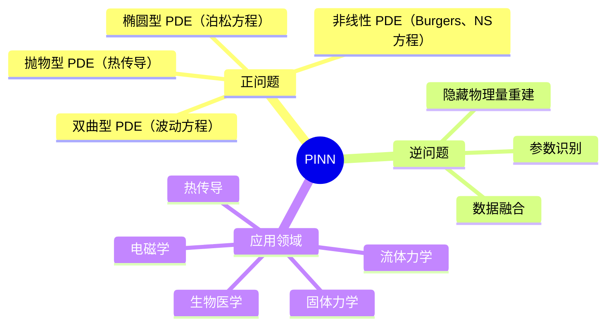

### 10.2 PINN vs 传统数值方法

|     维度     |  传统有限元/差分   |            PINN             |
| :----------: | :----------------: | :-------------------------: |
|   **网格**   |   需要高质量网格   |      无网格，随机撒点       |
|   **精度**   | $10^{-6}$ 甚至更高 | 通常 $10^{-3} \sim 10^{-4}$ |
| **高维问题** |   计算量指数增长   |          相对友好           |
|  **逆问题**  |    需要额外框架    |          天然支持           |
| **数据融合** |        困难        |      直接加入损失函数       |
| **训练时间** |   快（线性代数）   |       慢（迭代优化）        |
| **实现难度** |     成熟工具箱     |       调参经验要求高        |

> ⚖️ **结论**：PINN 不是要取代传统方法，而是在**数据稀疏、逆问题、复杂几何、高维问题**等场景中提供了一种新的有力工具。

### 10.3 进阶学习路线

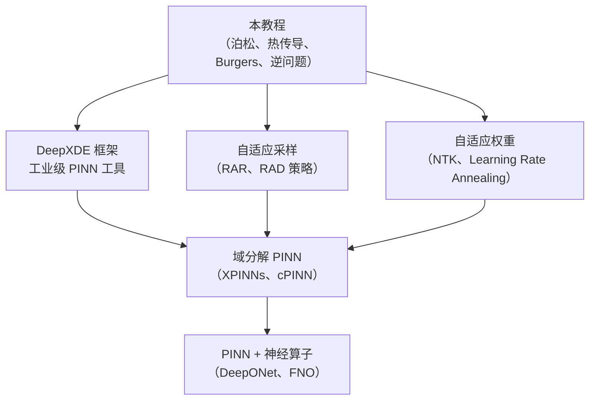

### 10.4 推荐资源

|                        资源                         | 类型 |                    说明                    |
| :-------------------------------------------------: | :--: | :----------------------------------------: |
|      [DeepXDE](https://deepxde.readthedocs.io)      | 框架 |           最流行的 PINN 开源框架           |
|                 Raissi et al. 2019                  | 论文 |               PINN 原始论文                |
|                  Wang et al. 2021                   | 论文 | 深入分析 PINN 训练失败原因，提出自适应权重 |
|               Karniadakis et al. 2021               | 综述 |   Nature Reviews Physics，PINN 全景综述    |
| [PINN 系列视频（YouTube）](https://www.youtube.com) | 视频 |          多个研究组提供了优质讲解          |

---

## 附录：符号速查表

|         符号         |      含义      |
| :------------------: | :------------: |
|      $u(x, t)$       | 真实解（未知） |
|   $u_\theta(x, t)$   | 神经网络近似解 |
|       $\theta$       |  神经网络参数  |
| $\mathcal{N}[\cdot]$ |  PDE 微分算子  |
|       $\Omega$       |     计算域     |
|   $\partial\Omega$   |   计算域边界   |
|        $N_f$         | PDE 配置点数量 |
|    $\mathcal{L}$     |   总损失函数   |
|      $\lambda$       |  各损失项权重  |

---

> 📌 **下一步**：打开 `2.5_pinn.ipynb`，从 Cell 1 开始，按顺序运行并观察每个案例的训练过程和结果可视化。建议在每个 Cell 运行后，尝试修改网络宽度、采样点数量或权重，感受它们对结果的影响。
