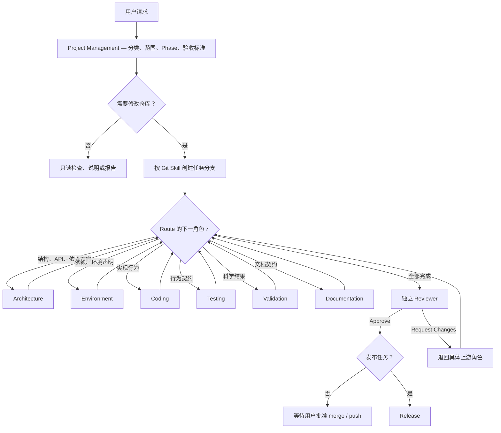

# CAEGraph Agent Workflow（全局协作规范）

本文件定义所有 Agent 实现的共同协作契约。任何请求都必须先由 Project Management Agent 分类，再按影响范围进入必要角色；各角色的具体规则见 `.agent/skills/*/SKILL.md`，Git 操作统一遵守 `.agent/skills/git/SKILL.md`。

## 1. 开工门禁

开始任何任务前必须依次确认：已阅读 `AGENTS.md` 与 `architecture/ARCHITECTURE.md`；当前解释器属于 `caegraph-dev` 且为 Python 3.10；已读取 `architecture/phases/CURRENT.md`；工作树、当前分支及其他 worktree 状态明确；请求已由 Project Management Agent 完成派单。

任一门禁不满足时停止修改并报告，禁止通过猜测继续。

## 2. 条件路由

路由由影响范围决定，不由任务名称决定。只读状态查询、解释、审查或方案报告不创建分支、不修改仓库，也不进入合入 Reviewer；一旦用户要求落实修改，必须重新派单并创建任务分支。写入任务可以进入多个角色；不适用的角色可以跳过，但 Project Management Agent 必须记录跳过理由。

| 角色               | 必须进入的条件                                                        |
| ------------------ | --------------------------------------------------------------------- |
| Project Management | 所有请求，包括只读请求                                                |
| Architecture       | 新模块、新公共抽象、公共 API 契约、依赖方向、Design UML 或 ADR 受影响 |
| Environment        | 新增、升级、移除依赖，或环境声明、依赖相关 CI 受影响                  |
| Coding             | `src/` 中实现行为受影响                                               |
| Testing            | 实现行为或公共契约受影响                                              |
| Validation         | 计算结果、离散化、物理/数学不变量、容差或科学示例结论受影响           |
| Documentation      | 用户文档、公共 docstring、API 页面、教程、示例或 CHANGELOG 受影响     |
| Reviewer           | 所有准备合入的任务                                                    |
| Release            | 仅版本发布任务                                                        |

纯 Agent 治理变更由 Project Management → Architecture（治理结构审查）→ Documentation（规范文本）→ Reviewer 路由；若不改变产品架构，不得连带修改产品 Architecture、Design UML、Generated UML 或 ADR。

## 3. 派单与交接契约

Project Management Agent 的派单必须包含以下字段，缺一不得开始修改：

- `Type`：任务类型。
- `Scope`：允许修改的文件或模块，以及明确排除项。
- `Phase`：当前 Phase 与允许性结论。
- `Route`：必经角色及顺序。
- `Skipped`：跳过的角色、理由和判断者。
- `Acceptance`：可验证的完成标准。
- `Git`：任务分支名称与基线。

每个角色完成工作后必须留下交接记录：

- `Role`：当前角色。
- `Inputs`：使用的派单、设计依据或上游结论。
- `Changes`：本角色完成的工作；只读角色写明检查范围。
- `Evidence`：检查命令、测试结果、差异或量化指标。
- `Decision`：通过、退回或阻塞。
- `Next`：下一角色或等待的用户授权。

交接记录写入任务报告或 Pull Request 描述即可，不要求为每个任务新增仓库文件。

## 4. 角色切换与审查独立性

同一 Agent 实现可以依次承担多个执行角色，但每次切换前必须完成上一角色的交接记录，并重新读取下一角色的 `SKILL.md`。切换角色不扩大权限，也不允许越过职责边界。

任务作者可以执行 Reviewer 清单作为自检，但不得对自己的变更给出最终 `Approve`。最终 Reviewer 必须是未参与该变更写入的另一 Agent 或人类；无法获得独立审查时，任务保持待审状态，不得宣称完成或合入。

## 5. 返工与范围变化

下游发现问题时必须指出应退回的上游角色、`blocking` / `non-blocking` 级别、证据和重新验收条件，不得直接代替上游修改。返工完成后，从受影响的最早角色起重新执行所有下游环节。

任务范围发生实质变化时必须退回 Project Management Agent 重新派单；新增结构、依赖、公共 API 或数值行为影响时，自动补入对应角色。超出当前 Phase 的内容只记录到既有 Phase backlog，不得夹带实现。

## 6. 紧急修复

紧急修复仍必须经过 Project Management 分类，从 `main` 创建 `bugfix/<name>` 分支，并至少经过 Coding → Testing → 独立 Reviewer。涉及结构、公共 API、依赖或科学结果时，必须恢复 Architecture、Environment 或 Validation 路由。紧急状态不授权直接提交 `main`、强推、跳过测试或省略用户批准。

## 7. 完成与关闭

任务达到 Acceptance、所有必经角色完成交接、独立 Reviewer 给出 `Approve` 后，才可请求用户批准 merge。merge、push、tag、发布和分支删除分别取得明确授权；任务分支与 worktree 生命周期以 Git Skill 为唯一规则来源。

常规任务在合入并关闭后结束，不进入 Release。Release 只处理明确的版本发布任务。
