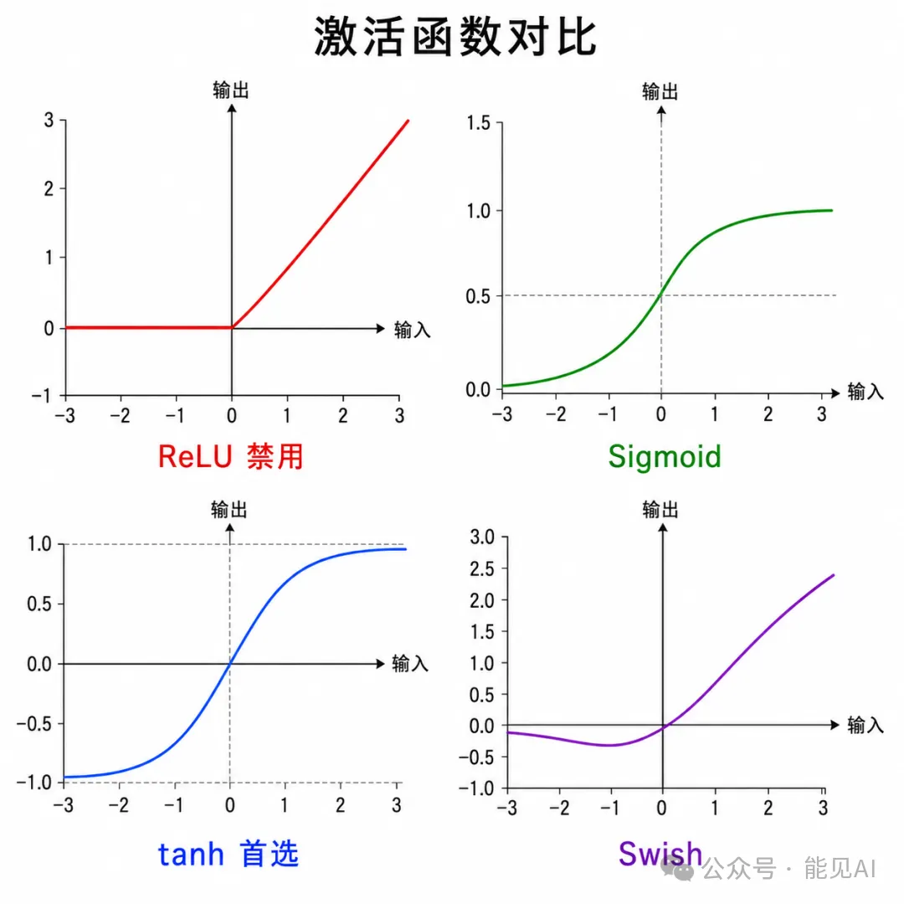
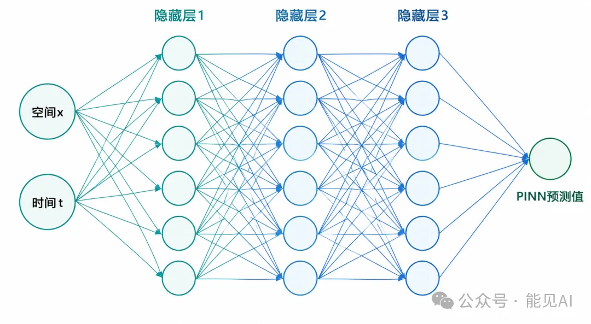
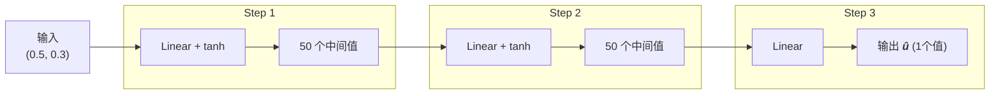
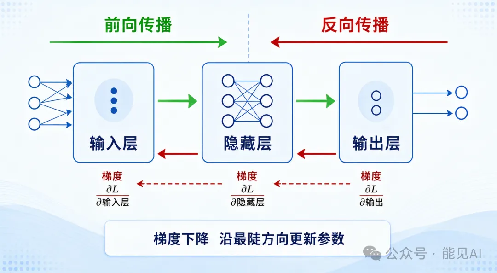

# 📌 零基础学 PINN **第 1 期**：深度学习基础：PINN需要的神经网络知识

---

## 一、 神经网络到底是个啥？

先抛开那些复杂的数学符号，我们用一个最简单的例子说起。

假设你要根据**房间面积**预测**装修费用**。

> 最朴素的想法是画一条直线：**费用 = 单价 × 面积 + 基础费**

这就是**线性回归**，它只能画直线。但现实世界往往是非线性的。例如，装修费用可能会呈现以下规律：

- **小户型贵**（单价高，存在起步价）
- **中等户型便宜**（规模效应，性价比最高）
- **大户型又贵**（材料升级，豪华装修）

这种多弯折的曲线，直线是无论如何也画不出来的。

**神经网络就是为了解决这个问题而生的。** 它通过“多层叠加 + 非线性变换”，可以拟合任意复杂的曲线。在数学上，这被称为 **万能近似定理（Universal Approximation Theorem）**：只要网络足够大，它就能画出任何你想要的曲线。

### 1.1 多层感知机（MLP）

PINN（物理信息神经网络）使用的是最基础的 **多层感知机（MLP）** 结构，其数据流向非常简单：

$$\text{输入层} \longrightarrow \text{隐藏层(tanh)} \longrightarrow \text{隐藏层(tanh)} \longrightarrow \dots \longrightarrow \text{输出层}$$

其中每一层都在做两件事：

1. **线性变换：** 输出 = 权重 × 输入 + 偏置（即 $y = wx + b$）。
2. **非线性激活：** 用一个激活函数把直线“弯一下”，让网络具备拟合曲线的能力。

> ⚠️ **新手误区：** 如果没有非线性激活函数，无论你叠加多少层网络，它在数学上最终依然只能退化为一条直线。

> 
> 激活函数对比

### 1.2 激活函数：PINN 为什么只认 `tanh`？

你可能听说过 `ReLU`、`Sigmoid`、`Swish` 等[激活函数](https://zhuanlan.zhihu.com/p/2039487698520519677)。但在 PINN 中，由于需要处理 PDE（偏微分方程）里的高阶导数项（如 $\partial²u/\partial x²$），激活函数必须满足一个硬性指标：**必须能求二阶导数且不能为零**。

| 激活函数       | 二阶导数特征   | PINN 是否可用 | 推荐指数                       |
| -------------- | -------------- | ------------- | ------------------------------ |
| **tanh**       | 非零、连续光滑 | ✅ **能用**   | 🌟🌟🌟🌟🌟（首选）             |
| **Swish**      | 非零           | ✅ **能用**   | 🌟🌟🌟（可用）                 |
| **ReLU**       | 恒为 0         | ❌ **禁用**   | （求二阶导后方程信息直接丢失） |
| **Leaky ReLU** | 恒为 0         | ❌ **禁用**   | （同上）                       |

> 简单记：PINN里用 tanh 就对了，ReLU看着爽但不能用。

### 1.3 PINN 的网络规模

相比于现在动辄百亿、千亿参数的大语言模型，PINN 绝对是典型的“小模型干大事”：

- **典型规模：** 3~5 层隐藏层，每层包含 50~100 个神经元。
- **总参数量：** 2000 ~ 10000 个左右。

> 
> 基于 MLP 的 PINN

---

## 二、 前向传播：数据怎么流过网络？

**前向传播（Forward Propagation）** 的本质就是：输入数据 $\rightarrow$ 逐层矩阵计算 $\rightarrow$ 得到输出预测值。

以输入一个时空坐标点 $(x=0.5, t=0.3)$ 传入 3 层网络为例：



在实际训练时，为了提高计算效率，我们不会单个点进行计算，而是采用**批量处理（Batching）**——一次性输入上百个坐标点，利用 GPU 进行并行矩阵运算，速度能提升几十倍。

---

## 三、 损失函数：网络“学得怎么样”？

训练神经网络的核心问题，在于如何定量评估网络预测得准不准。这就需要引入 **损失函数（Loss Function）**。

### 3.1 普通的损失函数

最常用的是**均方误差（MSE, Mean Squared Error）**：

$$\text{MSE} = \frac{1}{N} \sum (预测值 - 真实值)^2$$

Loss 值越接近 $0$，说明网络的预测越精准。

### 3.2 PINN 的特殊损失函数

PINN 的精妙之处在于它不仅拟合数据，还拟合物理。它的损失函数由三部分加权组成：

$$\text{总 Loss} = \lambda₁ \times \text{Loss\_data} + \lambda₂ \times \text{Loss\_PDE} + \lambda₃ \times \text{Loss\_BC}$$

- **数据损失（Loss_data）：** 确保网络输出能够逼近已知的传感器数据或实验数据。
- **PDE 损失（Loss_PDE）：** **PINN 的灵魂**。强制网络输出必须满足控制偏微分方程。
- **边界条件损失（Loss_BC）：** 确保网络输出在边界和初始时刻满足边界条件（如固定位移、初始流速等）。

> 💡 **无监督 PINN：** 即使完全没有传感器数据（即 $\text{Loss\_data} = 0$），仅仅依靠 **PDE 损失 + 边界损失**，PINN 也能完整求解出偏微分方程。

---

## 四、 反向传播：网络怎么“自我改进”？

知道了 Loss，下一步是：**怎么调整网络参数，让 Loss 变小？**

### 4.1 梯度下降的直观理解

想象你被蒙上双眼置于高山之上，想要走到山谷最低点。最简单的方法是：

> 环顾四周，找最陡的下坡方向，迈一步。重复。

在神经网络中：

- 用脚试探周围，找到**最陡的下坡方向**（在网络中对应 **梯度 Gradient**）。
- 朝着该方向迈出一步（步子的大小对应 **学习率 Learning Rate**）。
- 重复该过程，直至无法继续下行（Loss 降到最低）。

### 4.2 链式法则

由于网络有多层结构，深层的参数会逐级影响最终的输出。**反向传播**利用数学中的**链式法则（Chain Rule）**，从输出层反向逐层推导，精确计算出每个参数对最终误差的贡献（梯度）：如果 $z = f(y)$，$y = g(x)$，那么：
$$
\frac{\mathrm{d}z}{\mathrm{d}x} = \frac{\mathrm{d}z}{\mathrm{d}y} \times \frac{\mathrm{d}y}{\mathrm{d}x}
$$

### 4.3 优化器：如何快速稳健地下山？

> 
> 不同的优化器代表了不同的“下山策略”：

| 优化器     | 核心特点                                         | 经典使用场景                               |
| ---------- | ------------------------------------------------ | ------------------------------------------ |
| **Adam**   | 自适应调整学习率，下坡速度快，抗噪能力强         | **第一阶段：粗调**（快速接近最优区域）     |
| **L-BFGS** | 二阶优化算法，精度极高，收敛极快，但对内存消耗大 | **第二阶段：微调**（在极小值附近精准收敛） |

> 📌 **PINN 经典训练策略：** 先用 **Adam** 进行前几千步的快速粗调，然后切换到 **L-BFGS** 进行高精度精细收敛。

---

## 五、 自动微分：PINN 的核心引擎

**自动微分（Automatic Differentiation, AD）** 是 PINN 能够诞生的技术基石。

### 5.1 三种求导方式对比

| 导数求解方法 | 基本原理                             | 精度                 | 计算速度与限制                         |
| ------------ | ------------------------------------ | -------------------- | -------------------------------------- |
| **符号微分** | 像人工推导公式一样写出解析解         | 极高（精确）         | 慢（面对复杂公式容易产生“表达式膨胀”） |
| **数值差分** | 用临近点估算：$\frac{f(x+h) - f(x-h)}{2h}$  | 较低（有截断误差）   | 慢（高维情况下需要计算大量扰动）       |
| **自动微分** | **构建计算图，应用链式法则逐级求导** | **极高（机器精度）** | **极快**（PINN 的黄金解）              |

在 PyTorch 中，通过 `torch.autograd.grad` 即可直接调用自动微分。你无需手推任何复杂的偏导公式，只需将方程写进代码，框架就会自动计算出精准的偏导数值。

### 5.2 为什么PINN必须用自动微分？

因为PINN要计算PDE中的高阶导数（比如 $\frac{\partial^2 u}{\partial x^2}$），手动推导太麻烦，数值差分精度不够。自动微分正好两者兼得——精确 + 自动。

---

## 六、 硬件选型：用 CPU 还是 GPU？

虽然 PINN 是小模型，但由于需要频繁计算高阶自动微分，计算开销并不低：

| 物理场景维度             | CPU 表现            | GPU 表现      | 推荐建议           |
| ------------------------ | ------------------- | ------------- | ------------------ |
| **1D / 2D 简单物理问题** | ✅ 运行流畅         | ✅ 速度飞快   | CPU 即可，GPU 更佳 |
| **3D 复杂空间建模**      | ⚠️ 极其缓慢         | ✅ 轻松应对   | 强烈建议使用 GPU   |
| **长时间瞬态演化问题**   | ❌ 耗时过长，不实用 | ✅ 计算可行   | 必须使用 GPU       |
| **大规模超参数搜索**     | ❌ 效率极低         | ✅ 适合高并发 | 必须使用 GPU       |

> 简单说：小实验CPU就行，正经训练上GPU。

---

## 七、 核心知识点闪卡

- **网络骨架：** 选用多层感知机（MLP），深度通常为 $4 \sim 6$ 层，单层神经元 $50 \sim 100$ 个。
- **激活函数：** 必须使用 `tanh` 或 `Swish`（能求二阶导），绝对禁用 `ReLU`。
- **损失函数：** $\text{总 Loss} = \text{数据损失} + \text{PDE 物理损失} + \text{边界条件损失}$ 三项合一。
- **优化策略：** 采用 **Adam $\rightarrow$ L-BFGS** 的双阶段混合优化路线。
- **微分引擎：** 依靠**自动微分**机制，直接求解任意偏导项，规避传统差分误差。

---

## 📚 课后代码实战

运行以下代码前，请确保已通过 `pip install torch` 安装了 PyTorch 框架。

### 练习 1：搭建一个标准的 PINN 多层感知机（MLP）

```python
import torch
import torch.nn as nn

class SimpleMLP(nn.Module):
    def __init__(self, input_dim=2, hidden_dim=50, output_dim=1, num_layers=3):
        super().__init__()
        layers = []

        # 输入层
        layers.append(nn.Linear(input_dim, hidden_dim))
        layers.append(nn.Tanh())

        # 隐藏层
        for _ in range(num_layers - 2):
            layers.append(nn.Linear(hidden_dim, hidden_dim))
            layers.append(nn.Tanh())

        # 输出层（注意：输出层不需要加激活函数）
        layers.append(nn.Linear(hidden_dim, output_dim))
        self.network = nn.Sequential(*layers)

    def forward(self, x):
        return self.network(x)

# 实例化模型
model = SimpleMLP(input_dim=2, hidden_dim=50, output_dim=1, num_layers=3)
total_params = sum(p.numel() for p in model.parameters())
print(f"当前配置下的总参数量: {total_params}")  # 输出结果: 2751

```

### 练习 2：体验高精度自动微分（计算一、二阶导数）

```python
# 1. 模拟物理空间坐标点输入 (x, t)，开启梯度追踪
x = torch.randn(100, 2, requires_grad=True)
u = model(x)

# 2. 计算一阶偏导数：∂u/∂x₁
grad_u_x1 = torch.autograd.grad(
    u, x,
    grad_outputs=torch.ones_like(u),
    create_graph=True,    # 开启 create_graph=True 才能计算更高阶导数
    retain_graph=True
)[0]

# 3. 基于一阶导数，计算二阶偏导数：∂²u/∂x₁²
grad2_u_x1x1 = torch.autograd.grad(
    grad_u_x1[:, 0:1], x,
    grad_outputs=torch.ones_like(grad_u_x1[:, 0:1]),
    create_graph=True
)[0]

print(f"网络预测值 u 的维度: {u.shape}")
print(f"一阶偏导 ∂u/∂x₁ 的维度: {grad_u_x1.shape}")
print(f"二阶偏导 ∂²u/∂x₁² 的维度: {grad2_u_x1x1.shape}")

```

### 练习 3：双阶段优化器（Adam + L-BFGS）骨架模板

```python
# 假定 compute_loss 和 training_data 已在你的物理场景中定义好

# ─── 阶段一：Adam（粗调，快速寻找极小值区域） ───
optimizer_adam = torch.optim.Adam(model.parameters(), lr=1e-3)
for epoch in range(5000):
    loss = compute_loss(model, training_data)
    optimizer_adam.zero_grad()
    loss.backward()
    optimizer_adam.step()

# ─── 阶段二：L-BFGS（微调，精细收敛至极高精度） ───
optimizer_lbfgs = torch.optim.LBFGS(model.parameters(), lr=1e-1)

def closure():
    optimizer_lbfgs.zero_grad()
    loss = compute_loss(model, training_data)
    loss.backward()
    return loss

for epoch in range(500):
    loss = optimizer_lbfgs.step(closure)

```
