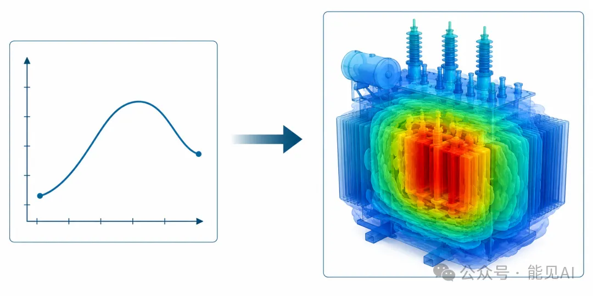
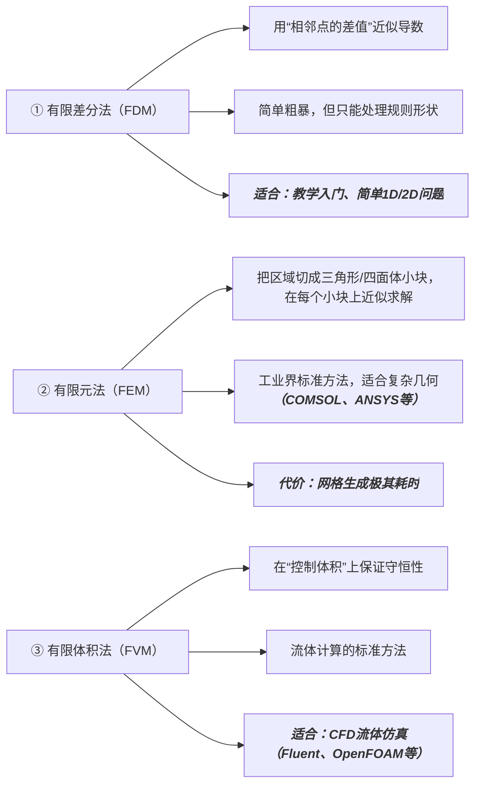
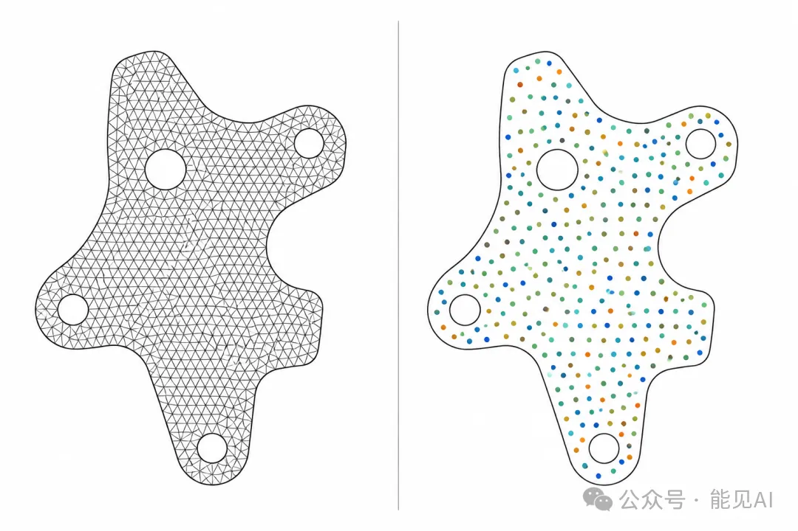
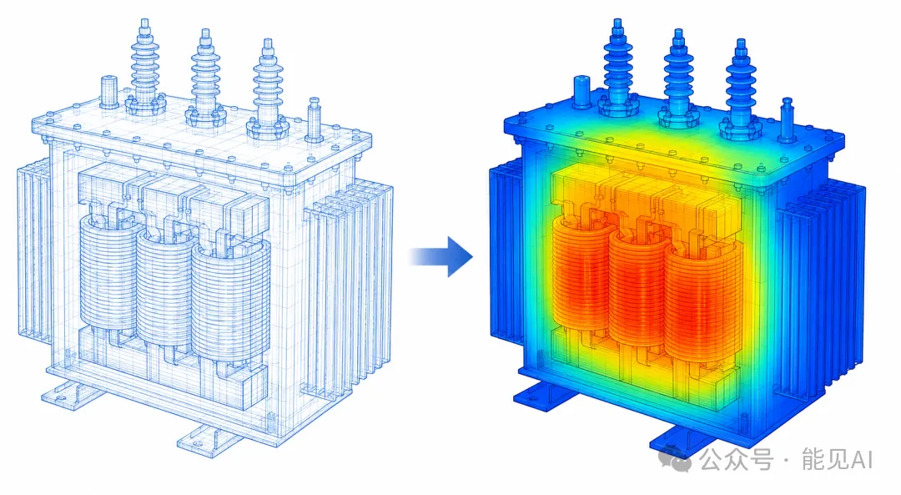

# 📌 零基础学 PINN **第 2 期**：为什么科学需要PDE：从牛顿方程到AI求解

---

## 一、 一切物理系统背后都有一个方程

科学计算的核心任务可以用七个字概括：**描述世界，求解它。**

### 1.1 从牛顿说起

你在中学物理中接触过牛顿第二定律 $F = ma$（力 = 质量 × 加速度）。

加速度在数学上是什么？它是位置对时间的二阶导数：

$$a = \frac{\mathrm{d}^2x}{\mathrm{d}t^2}$$

因此，牛顿定律本质上是一个微分方程。只要我们知道受力情况，就可以通过解方程得到粒子的运动轨迹。

因为该方程只有一个自变量（时间 $t$），所以被称为**常微分方程（ODE, Ordinary Differential Equation）**。

### 1.2 当自变量不止一个时：偏微分方程（PDE）

现实世界的物理场景往往更加复杂。以电力系统中的变压器温度场为例：

- 温度随**时间**变化（早上和中午的负荷、环境温度不同）；
- 温度还随**空间位置**变化（绕组中心由于焦耳热，温度远高于外壳）。

当未知函数依赖于多个自变量（如时间 $t$ + 三维空间坐标 $x, y, z$）时，微分方程就升级为了**偏微分方程（PDE, Partial Differential Equation）**。

> 💡 **极简区分：**
>
> - **ODE：** 只有一个自变量（如时间 $t$）。
> - **PDE：** 包含多个自变量（如时间 $t$ + 空间 $x, y, z$）。PDE 的求解难度比 ODE 呈指数级上升。

> 
> ▲ 从ODE到PDE：当自变量从1个增加到多个，方程复杂度呈指数级上升

### 1.3 物理世界处处是 PDE

电力与机械系统中的绝大多数物理过程，底层都可以用相应的 PDE 来精确描述：

| 物理过程     | 典型工程场景                        | 核心控制方程                                    |
| ------------ | ----------------------------------- | ----------------------------------------------- |
| **热传导**   | 变压器、超高压电缆温度场分析        | **热传导方程 (Heat Equation)**                  |
| **电磁场**   | 发电机与电动机设计、高压绝缘分析    | **麦克斯韦方程组 (Maxwell's Equations)**        |
| **流体力学** | 变压器油循环冷却、风力发电机尾流场  | **纳维-斯托克斯方程 (Navier-Stokes Equations)** |
| **波动传播** | 电力系统暂态过电压、机械结构振动    | **波动方程 (Wave Equation)**                    |
| **物质扩散** | 锂电池离子传输、$SF_6$ 气体泄漏监测 | **扩散方程 (Diffusion Equation)**               |

> **核心结论：**无论是热、电、磁，还是流体与波动，它们在底层全部由 PDE 控制。解出了 PDE，我们就能完美预测物理系统的行为。

---

## 二、 为什么 PDE 这么难解？

### 2.1 解析解：教科书里的奢侈品

极少数极度简化的 PDE 拥有“公式解”（即解析解）。

> 例如：对于一根两端保持零度、初始温度呈正弦分布的均匀铁棒，其温度场解析解为：
> $$T(x,t) = e^{-\alpha \pi^2 t} \sin(\pi x)$$

但现实中的工程问题：

- ❌ **几何复杂**（真实的变压器绝不是规整的矩形铁棒）；
- ❌ **边界多变**（外壳同时存在对流、辐射和传热等多种耦合边界）；
- ❌ **材料非线性**（导热系数、电阻率往往随着温度的变化而剧烈改变）；
- ❌ **多物理场耦合**（电磁损耗产生热量，温度升高又改变了电磁特性）。

这导致 **99% 的实际工程 PDE 没有任何解析公式**。

### 2.2 数值方法：工程师的“暴力拆解”

既然无法推导公式，数值计算学者们采用了一种极其朴素却有效的策略：**把连续的物理世界切割成无数个小块，逐块离散计算**（类似于用“格子”近似逼近不规则湖泊的面积）。

经过几十年的发展，诞生了三大经典数值离散方法：



### 2.3 数值方法的五大工程痛点

尽管传统数值方法统治了工业界半个世纪，但它们依然保留着难以逾越的瓶颈：

| 痛点             | 具体表现与工程代价                                                                                       |
| ---------------- | -------------------------------------------------------------------------------------------------------- |
| **网格依赖**     | 仿真的精度高度依赖网格划分质量。在大型仿真中，**网格划分往往要占用工程师 50% 以上的时间**。              |
| **维度灾难**     | 当面临三维空间（3D）加上时间项（1D）的瞬态问题时，网格节点数会爆炸式增长，对算力内存要求极高。           |
| **一工况一求解** | 传统求解器缺乏“泛化”能力。一旦变压器的负载率发生改变，整个有限元模型就必须重新进行一次高昂的迭代计算。   |
| **数据孤岛**     | 在实际运维中，传感器采集到的实测温感数据，很难直接融入并修正有限元仿真模型。                             |
| **正反问题分离** | 正问题（已知发热求温度场）和反问题（根据表面测温反推内部热源）在数学框架上完全不同，反问题求解极其繁琐。 |

> 这些痛点，正是PINN要解决的问题。

> 
> ▲ 传统网格法 vs PINN点采样法：左边需要生成复杂网格，右边只需随机采样点

---

## 三、 PINN：全新的 PDE 求解范式

### 3.1 从“离散数值”到“连续函数”

这两种方法在底层有着本质的哲学差异：

- **传统数值方法（FEM）：**
  PDE（偏微分方程） → 划分网格 → 组装大型代数方程组 → 求解器迭代 → 得到一堆离散点上的数值解
- **物理信息神经网络（PINN）：**
  PDE（偏微分方程） → 将物理方程写进 Loss → 训练神经网络 → **网络本身即为连续解**

传统方法得到的是“网格节点上的离散数值”**，而 PINN 求解出来的则是**“全时空处处解析、处处可导的连续函数”。

### 3.2 PINN 的三大核心优势

**优势一：彻底摆脱网格（Mesh-Free）**

PINN 直接绕过了有限元最头疼的网格生成步骤。它只需要在物理区域内进行**随机点采样（Collocation Points）**。

> 几何形状再复杂，也只需要多撒一些采样点。

**优势二：物理与实测数据的天然融合**

PINN 的损失函数可以将数据与物理方程完美融合：

- 物理损失：满足PDE方程
- 数据损失：拟合传感器实测数据

> 即使没有任何已知的物理场标签，只要有 PDE 的物理约束和边界条件，网络也能够实现“无监督求解”。

**优势三：正反问题统一于同一框架**  

传统有限元做反问题（参数辨识）通常需要反复迭代调用正向求解器，效率极低。

而 PINN 在求物理解的同时，只需要把待求参数（如热传导系数 $\alpha$）设为可训练的参数，在一套网络训练中就能同步求出物理场和未知参数。

---

## 四、一个实际案例：变压器温度场

我们用变压器温度求解这个例子，直观感受两种方法的差异。

### 4.1 传统FEM流程

```
1. 建3D模型（CAD软件）
2. 生成网格 —— 可能耗时数小时
3. 设置边界条件（散热系数、环境温度）
4. 设置材料参数（铜/油的导热系数）
5. 运行求解器（COMSOL）—— 数分钟
6. 后处理：提取温度分布
7. 如果工况变了（比如负载率从80%变成100%）→ 从Step 5重新开始
```

### 4.2 PINN流程

```
1. 写好PDE（热传导方程）
2. 随机采样10000个点
3. 训练网络10-30分钟 —— 只需一次
4. 之后任意工况、任意位置，毫秒级出结果
```

### 对比表格

| 阶段 | 传统FEM | PINN |
|------|---------|------|
| 建模 | CAD + 网格生成（小时级） | 采样点（秒级） |
| 求解 | 每次独立运行（分钟级） | 训练一次，推理任意工况（毫秒级） |
| 反问题 | 反复调用FEM（小时级） | 直接学习参数（分钟级） |
| 部署 | 需要FEM求解器软件 | 只需网络权重文件（KB级） |

> PINN不是要替代FEM——在高精度正向求解上，FEM仍然是王者。但PINN在数据稀疏、反问题、多工况快速推理场景下，提供了全新的可能性。

> 
> ▲ 变压器温度场仿真：FEM 需要精细网格划分，PINN 通过点采样直接学习温度分布

### 4.3 三波演进：PDE求解简史

| 时期 | 方法 | 思路 | 局限 |
|------|------|------|------|
| 17-19世纪 | 解析方法 | 找公式解 | 只能解极简单问题 |
| 20世纪 | 数值方法 | 离散化 + 计算机 | 网格依赖、维度灾难 |
| 21世纪 | AI for Science | 神经网络 + 物理约束 | 训练不稳定，但潜力巨大 |

PINN属于第三波——它既不是纯数据驱动的黑箱（像普通神经网络那样），也不是纯物理驱动的传统方法，而是**两者结合**。

> 打个比方：纯数据驱动是“蒙着眼睛猜”，传统方法是“按部就班算”，PINN是“睁着眼睛用物理定律指导猜测”。

---

## 五、 核心知识点闪卡

✅ PDE是物理系统的通用语言：热、电、磁、流体都由PDE描述

✅ 传统数值方法的痛点：网格依赖、维度灾难、正反问题分离

✅ PINN的三大优势：无网格、数据融合、正反问题统一

✅ PINN不是替代FEM：而是在特定场景下提供新的求解范式

---

## 📚 课后代码实战

### 练习 1：体验网格分辨率对传统数值表达的影响

运行此脚本可以直观观察到：网格剖分节点越少，物理场的细节丢失就越严重。

```python

import numpy as np
import matplotlib.pyplot as plt

# 一维热方程的解析解
def exact_solution(x, t, alpha=0.1):
    return np.exp(-alpha * np.pi**2 * t) * np.sin(np.pi * x)

# 对比不同网格分辨率
fig, axes = plt.subplots(1, 3, figsize=(12, 3))
for i, N in enumerate([10, 20, 200]):
    x = np.linspace(0, 10, N)
    u = exact_solution(x, t=0.05)
    axes[i].plot(x, u, 'b-', linewidth=2)
    axes[i].scatter(x[::max(1, N//8)], u[::max(1, N//8)], 
                   color='red', s=50, zorder=5)
    axes[i].set_title(f'N={N} nodes')
    axes[i].set_xlabel('x')
    axes[i].set_ylabel('T(x)')
plt.tight_layout()
# plt.savefig('grid_resolution.png', dpi=150, bbox_inches='tight')
plt.show()
```

> 运行后观察：网格点越少，你丢失的细节越多。这就是为什么传统方法对网格质量极其敏感。

### 练习 2：体验传统 ODE 的自动化求解

利用 SciPy 内置的初值问题求解器直接解一个二阶弹簧振子常微分方程 $m \frac{\mathrm{d}^2x}{\mathrm{d}t^2} + kx = 0$：

```python

from scipy.integrate import solve_ivp

# ODE：弹簧振子 m*d²x/dt² + k*x = 0
def spring_ode(t, y, k=1.0, m=1.0):
    x, v = y  # y = [位置, 速度]
    return [v, -k/m * x]

sol = solve_ivp(spring_ode, [0, 10], [1.0, 0.0], 
                t_eval=np.linspace(0, 10, 200))

import matplotlib.pyplot as plt
plt.plot(sol.t, sol.y[0], 'b-', linewidth=2)
plt.xlabel('时间 t')
plt.ylabel('位移 x(t)')
plt.title('弹簧振子：一个ODE的例子')
plt.grid(True, alpha=0.3)
# plt.savefig('spring_ode.png', dpi=150)
plt.show()
```

> 💡 **思考：**  
> 只有一个自变量（时间 $t$）的 ODE，我们可以极其轻松地调用 `solve_ivp` 一行搞定。  
> 但如果面对包含了空间维度的复杂 PDE，就必须依赖本系列后续将要介绍的 PINN 来实现了。
