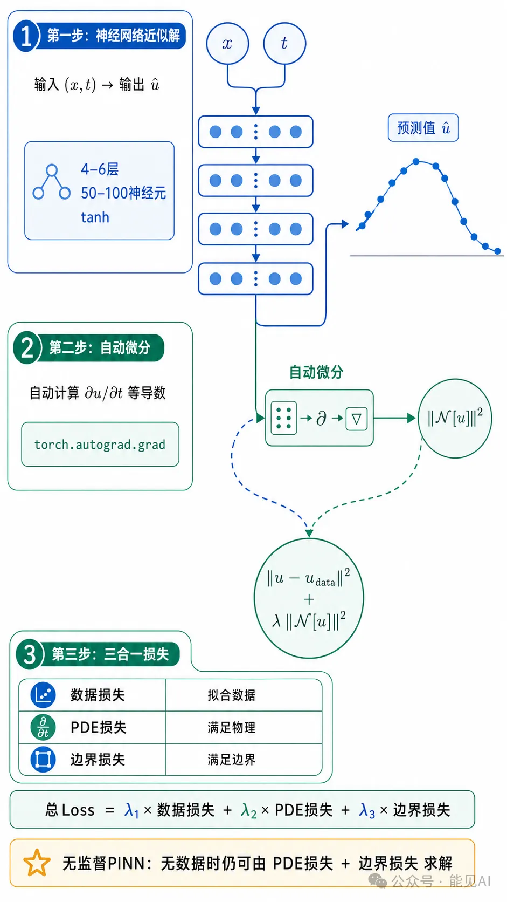
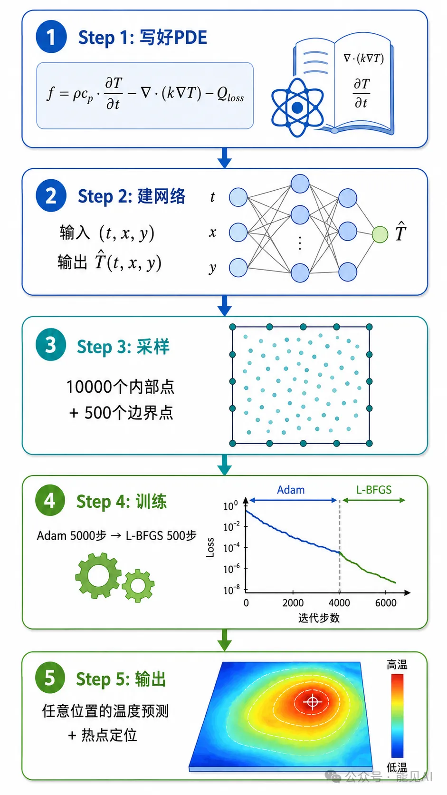
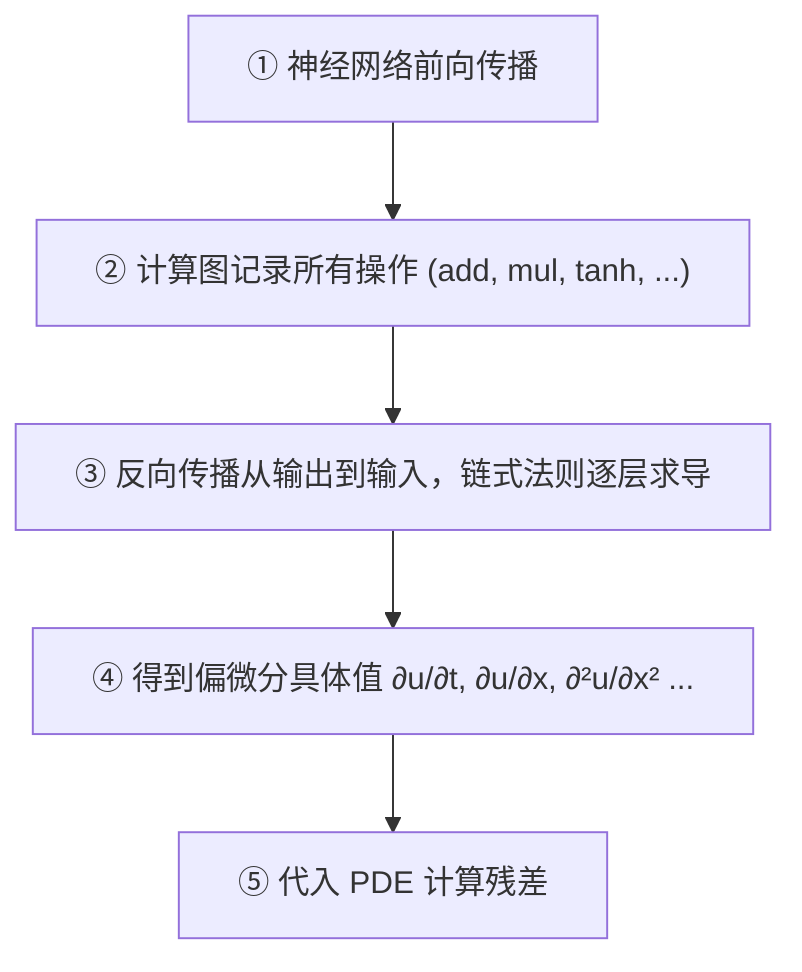

# 📌 零基础学 PINN **第 3 期**：为什么科学需要PDE：从牛顿方程到AI求解

---

## 一、传统神经网络的致命缺陷

假设你要预测变压器绕组温度，传统方法是收集大量数据（负载电流、环境温度 → 绕组温度），然后训练一个神经网络。

这种方法看起来很完美，但存在一个致命问题：**神经网络只能学习数据的统计规律，无法理解背后的物理定律**。

举个例子：

- **训练数据范围**：负载率 30%-90%，温度 40°C-85°C
- **实际运行场景**：突发短路，负载率 300%
- **纯神经网络预测**：温度 120°C（完全错误）
- **真实情况**：温度 280°C（绝缘油沸腾，设备烧毁）

PINN 的核心目标就是：**让神经网络既能拟合数据，又能遵守物理定律**。

---

## 二、PINN 的核心思想

PINN 的核心可以用一句话概括：

> **将偏微分方程（PDE）的残差嵌入神经网络的损失函数，使网络在拟合数据的同时自动满足物理方程。**

这个想法简洁而强大。具体实现分三步：

### 步骤一：用神经网络近似 PDE 的解

构建一个神经网络来「猜测」PDE 的解函数。输入时空坐标 $(x, t)$，输出预测值 $\hat{u}(x, t)$。

**典型网络结构**：

- 4-6 层全连接层
- 每层 50-100 个神经元
- 使用 $\tanh$ 激活函数

### 步骤二：利用自动微分计算导数

这是 PINN 最精妙的地方。PDE 中包含各种导数项（如 $\frac{\partial u}{\partial t}$），我们不需要手动推导公式，而是利用自动微分直接从网络计算出来。

PyTorch 的 `torch.autograd.grad` 可以精确计算导数，精度达到机器精度。

**实践示例**：用 PyTorch 搭建一个简单的 PINN

```python

import torch
import torch.nn as nn

class SimplePINN(nn.Module):
    def __init__(self):
        super().__init__()
        self.net = nn.Sequential(
            nn.Linear(2, 50),   # 输入 (t, x)
            nn.Tanh(),
            nn.Linear(50, 50),
            nn.Tanh(),
            nn.Linear(50, 1)    # 输出 u(t, x)
        )

    def forward(self, t, x):
        # 拼接输入
        X = torch.cat([t, x], dim=1)
        return self.net(X)

    def compute_pde_residual(self, t, x, alpha=0.1):
        """计算热方程残差: ∂u/∂t - α·∂²u/∂x²"""
        t = t.requires_grad_(True)
        x = x.requires_grad_(True)

        u = self.forward(t, x)

        # 一阶导数：∂u/∂t
        u_t = torch.autograd.grad(
            u, t,
            grad_outputs=torch.ones_like(u),
            create_graph=True
        )[0]

        # 一阶导数：∂u/∂x
        u_x = torch.autograd.grad(
            u, x,
            grad_outputs=torch.ones_like(u),
            create_graph=True
        )[0]

        # 二阶导数：∂²u/∂x²
        u_xx = torch.autograd.grad(
            u_x, x,
            grad_outputs=torch.ones_like(u_x),
            create_graph=True
        )[0]

        # PDE残差：∂u/∂t - α·∂²u/∂x²
        residual = u_t - alpha * u_xx
        return residual

# 测试
model = SimplePINN()
t = torch.rand(100, 1)
x = torch.rand(100, 1)
residual = model.compute_pde_residual(t, x)
print(f"PDE残差shape: {residual.shape}")
print(f"平均残差: {residual.abs().mean().item():.6f}")
```

### 步骤三：构造「三合一」损失函数

PINN 的损失函数包含三个部分：

| 损失项       | 作用                     | 类比                 |
| ------------ | ------------------------ | -------------------- |
| **数据损失** | 拟合传感器实测数据       | 「老师给标准答案」   |
| **PDE 损失** | 网络输出必须满足物理方程 | 「老师教物理定律」   |
| **边界损失** | 满足边界条件             | 「老师告诉边界约束」 |

> 总Loss = λ₁×数据损失 + λ₂×PDE损失 + λ₃×边界损失

最神奇的是：**即使没有任何传感器数据**，PINN仍然可以通过 PDE损失 + 边界损失 来求解PDE。这叫"无监督PINN"。

> 
> ▲ PINN损失函数双路径：无数据时靠PDE损失+边界损失求解（无监督），有数据时加入数据损失（监督）

**实现代码**：

```python
def compute_loss(model, t_data, x_data, u_data,
                 t_colloc, x_colloc, t_bc, x_bc, u_bc,
                 lambda_data=1.0, lambda_pde=1.0, lambda_bc=1.0):
    """计算PINN总损失 = 数据损失 + PDE损失 + 边界损失"""

    # 1. 数据损失：拟合传感器数据
    u_pred = model(t_data, x_data)
    loss_data = torch.mean((u_pred - u_data) ** 2)

    # 2. PDE损失：满足热方程
    residual = model.compute_pde_residual(t_colloc, x_colloc)
    loss_pde = torch.mean(residual ** 2)

    # 3. 边界损失：满足边界条件
    u_bc_pred = model(t_bc, x_bc)
    loss_bc = torch.mean((u_bc_pred - u_bc) ** 2)

    # 总损失
    total_loss = (lambda_data * loss_data +
                  lambda_pde * loss_pde +
                  lambda_bc * loss_bc)

    return total_loss, loss_data, loss_pde, loss_bc

# 示例：打印各项损失
t_d, x_d, u_d = torch.rand(50, 1), torch.rand(50, 1), torch.rand(50, 1)
t_c, x_c = torch.rand(1000, 1), torch.rand(1000, 1)
t_b, x_b, u_b = torch.rand(20, 1), torch.rand(20, 1), torch.zeros(20, 1)

model = SimplePINN()
total, ld, lp, lb = compute_loss(model, t_d, x_d, u_d, t_c, x_c, t_b, x_b, u_b)
print(f"总损失: {total.item():.6f}")
print(f"  数据损失: {ld.item():.6f}")
print(f"  PDE损失: {lp.item():.6f}")
print(f"  边界损失: {lb.item():.6f}")
```

具体来说，各项损失的数学表达式为：

**数据损失**：

```python
loss_data = torch.mean((u_pred - u_data) ** 2)
```

$$\mathcal{L}_{\text{data}} = \frac{1}{N_d} \sum_{i=1}^{N_d} \left| u(t_i^d, x_i^d) - u_i^d \right|^2$$

**PDE 损失**（以热方程为例）：

```python
loss_pde = torch.mean(residual ** 2)
```

$$\mathcal{L}_{\text{PDE}} = \frac{1}{N_c} \sum_{i=1}^{N_c} \left| \frac{\partial u}{\partial t}(t_i^c, x_i^c) - \alpha \frac{\partial^2 u}{\partial x^2}(t_i^c, x_i^c) \right|^2$$

**边界损失**：

```python
loss_bc = torch.mean((u_bc_pred - u_bc) ** 2)
```

$$\mathcal{L}_{\text{BC}} = \frac{1}{N_b} \sum_{i=1}^{N_b} \left| u(t_i^b, x_i^b) - u_i^b \right|^2$$

---

## 三、PINN vs 传统数值方法

| 对比维度     | FDM/FEM（传统方法）        | PINN                       |
| ------------ | -------------------------- | -------------------------- |
| **网格要求** | 必须生成网格               | 无需网格，随机采样即可     |
| **复杂几何** | 网格生成困难（耗时数小时） | 自然处理（只需采样点）     |
| **数据融合** | 难以融入实测数据           | 天然支持（增加一项损失）   |
| **反问题**   | 需反复调用求解器           | 统一框架（参数可训练）     |
| **输出形式** | 离散点数值                 | 连续函数（任意位置可求值） |
| **精度**     | 高（成熟方法）             | 中到高（取决于训练）       |

> 关键结论：PINN 不是要替代 FEM，而是在**数据稀疏、反问题、复杂几何**等场景下提供新的求解范式。

> 
> ▲ PINN求解流程三步走：神经网络近似解 → 自动微分算导数 → 三合一损失函数训练

### 边界条件处理示例（变压器场景）

| 边界位置   | 物理含义     | PINN 处理方式      |
| ---------- | ------------ | ------------------ |
| 变压器外壳 | 向空气散热   | 加入边界损失项     |
| 绕组表面   | 铜损产生热量 | 作为热源项加入 PDE |
| 油面       | 油-气界面    | 温度连续性约束     |

---

## 四、自动微分：PINN 的核心引擎

理解自动微分，就理解了 PINN 的一半。

### 三种求导方式对比

| 方法         | 原理                      | 精度     | PINN 是否使用       |
| ------------ | ------------------------- | -------- | ------------------- |
| **符号微分** | 解析推导公式              | 精确     | ❌ 公式膨胀，不实用 |
| **数值差分** | $\frac{f(x+h) - f(x)}{h}$ | 近似     | ❌ 精度不够         |
| **自动微分** | 计算图 + 链式法则         | 机器精度 | ✅ 标准配置         |

### 自动微分工作流程



以热方程 $\frac{\partial u}{\partial t} = \alpha \frac{\partial^2 u}{\partial x^2}$ 为例，自动微分的过程为：

1. 前向传播计算 $u = \text{NN}(t, x)$
2. 计算一阶导数：$u_t = \frac{\partial u}{\partial t}$，$u_x = \frac{\partial u}{\partial x}$
3. 计算二阶导数：$u_{xx} = \frac{\partial^2 u}{\partial x^2}$
4. 计算残差：$r = u_t - \alpha u_{xx}$

> 重要提示：使用 PyTorch 时必须设置 `create_graph=True`，否则高阶导数计算会失败（这是初学者最常见的错误）。

### 训练策略：两阶段优化

```python

# 训练循环
optimizer = torch.optim.Adam(model.parameters(), lr=1e-3)
n_epochs = 5000

for epoch in range(n_epochs):
    optimizer.zero_grad()
    loss, ld, lp, lb = compute_loss(model, t_d, x_d, u_d, t_c, x_c, t_b, x_b, u_b)
    loss.backward()
    optimizer.step()

    if epoch % 500 == 0:
        print(f"Epoch {epoch}: Loss={loss.item():.6f} "
              f"(data={ld.item():.4f}, pde={lp.item():.4f}, bc={lb.item():.4f})")

# 切换到L-BFGS精细收敛
optimizer = torch.optim.LBFGS(model.parameters(), lr=1.0)

def closure():
    optimizer.zero_grad()
    loss, _, _, _ = compute_loss(model, t_d, x_d, u_d, t_c, x_c, t_b, x_b, u_b)
    loss.backward()
    return loss

for epoch in range(500):
    loss = optimizer.step(closure)
    if epoch % 100 == 0:
        print(f"L-BFGS Epoch {epoch}: Loss={loss.item():.6f}")
```

> 备注：三段代码需要放到一个 python 文件里面运行

---

## 五、PINN 的优势与局限

### 优势

1. **无网格化**：无需生成网格，自然处理复杂几何
2. **正反问题统一**：同一套代码可正向求解 PDE 或反推参数
3. **数据融合能力**：天然支持稀疏数据与物理方程的混合学习
4. **端到端求解**：从方程到解，无需离散化、无需迭代求解器

### 局限

1. **训练困难**：损失函数不平衡、梯度消失问题
2. **高频问题**：标准 PINN 难以捕捉高频振荡
3. **长时演化**：时间积分误差累积，长期预测易发散
4. **计算成本**：训练时间长（小时级），不如 FEM 的秒级求解

> [下篇](../4/PINN的失败与修复.md)将详细讨论

---

## 六、核心要点总结

✅ **PINN 核心公式**：$\mathcal{L} = \lambda_1 \mathcal{L}_{\text{data}} + \lambda_2 \mathcal{L}_{\text{PDE}} + \lambda_3 \mathcal{L}_{\text{BC}}$

✅ **自动微分**：精确计算 PDE 中的高阶导数 $\frac{\partial u}{\partial t}$，$\frac{\partial^2 u}{\partial x^2}$ 等，无需手动推导

✅ **应用选择**：数据稀疏/反问题 → PINN；高精度正向求解 → FEM

✅ **实际案例**：变压器热传导的 PINN 建模框架
