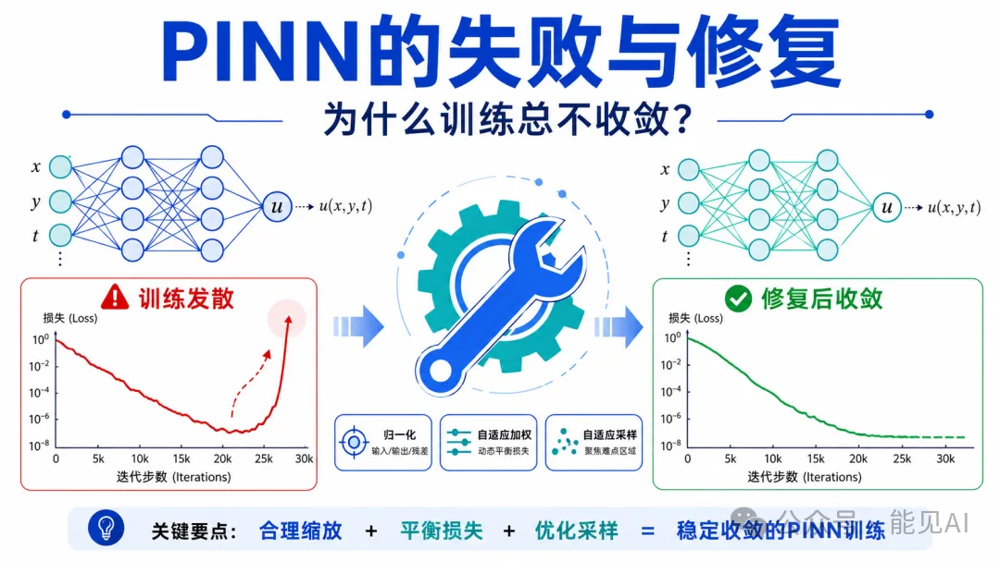
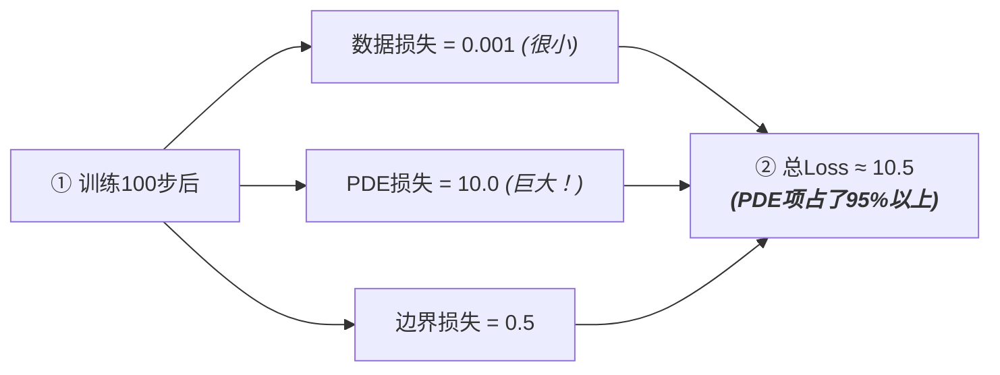
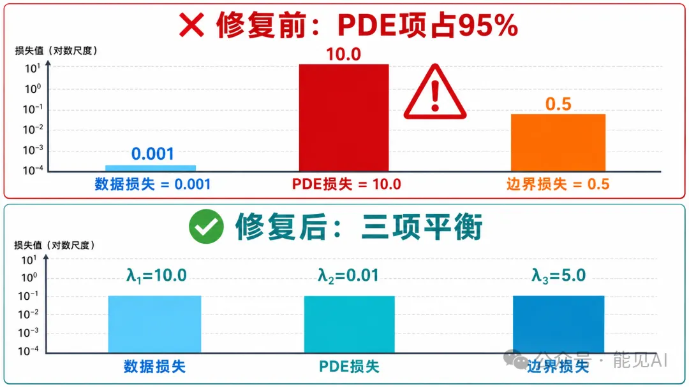
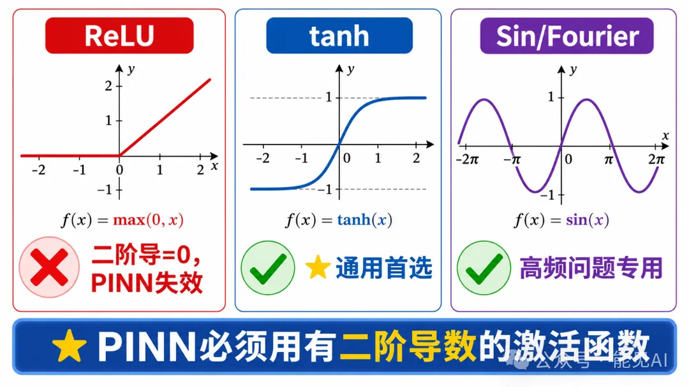
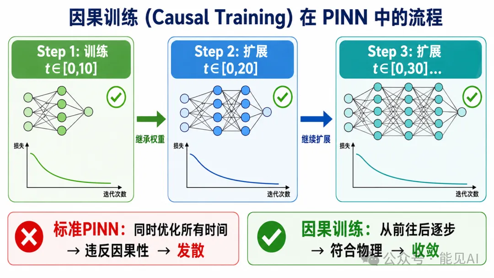

# 📌 零基础学 PINN **第 4 期**：PINN的失败与修复：为什么训练总不收敛？

---

## 一、理想与现实的鸿沟

如果你照着[**第3期**](../3/PINN核心思想.md)的公式和代码直接训练 PINN，很可能遭遇失败。这不是因为代码错误，而是 PINN 训练本身就充满挑战。

原始 PINN 论文（Raissi et al., 2019）展示的成功案例大多是一维或二维的简单问题。一旦问题稍微复杂——多维、非线性、长时间演化——训练往往卡住或发散。

> 
> ▲ 图：PINN训练的失败与修复全景。左侧训练发散（Loss骤升），右侧修复后收敛（Loss稳定降至10⁻⁸）。关键要点：合理缩放 + 平衡损失 + 优化采样 = 稳定收敛的PINN训练。

本节要解答两个核心问题：**为什么失败，以及怎么修复**。

---

## 二、失败模式一：损失不平衡

### 2.1 问题描述

回顾 PINN 的总损失函数：

$$\mathcal{L}_{\text{total}} = \lambda_1 \mathcal{L}_{\text{data}} + \lambda_2 \mathcal{L}_{\text{PDE}} + \lambda_3 \mathcal{L}_{\text{BC}}$$

理想情况下，三项损失应该协同优化。但现实中，**这三项的数量级可能相差巨大**：



这就像拔河比赛，PDE 项是大力士，数据项和边界项是小学生。优化器只听得见 PDE 项的「呼喊」，其他两项的声音完全被淹没。

### 2.2 根源：梯度尺度的不匹配

深层原因在于梯度尺度差异。神经网络通过梯度下降更新参数：

$$\theta_{t+1} = \theta_t - \eta \cdot \nabla_\theta \mathcal{L}$$

但不同损失项对参数 $\theta$ 的梯度可能相差数个数量级：

- **PDE 项**：涉及高阶自动微分，梯度幅值大
- **数据项**：简单的平方误差，梯度幅值小
- **边界项**：仅在稀疏边界点计算，梯度稀疏且小

> 结果：优化器被PDE项"绑架"，只顾着满足物理方程，不管数据和边界。

### 2.3 修复方案

**方案 A：手动权重调整（快速但需经验）**

```python
# 初始权重（易失败）
loss = L_data + L_pde + L_bc

# 调整后（根据数量级平衡）
loss = 10.0 * L_data + 0.01 * L_pde + 5.0 * L_bc
```

> **技巧**：训练初期打印各项损失，观察数量级差异，手动调整 $\lambda_1, \lambda_2, \lambda_3$ 使它们量级相当。

**方案 B：可学习的自适应权重（推荐）**

与其手动试探，不如让网络自己学习权重。引入可学习参数 $\log(\sigma_i^2)$：

$$\mathcal{L}_{\text{adaptive}} = \sum_{i=1}^{3} \frac{1}{2\sigma_i^2} \mathcal{L}_i + \sum_{i=1}^{3} \log \sigma_i$$

其中第二项防止 $\sigma_i \to \infty$（相当于将某项损失权重降为零）。

```python
class AdaptiveLoss(nn.Module):
    def __init__(self):
        super().__init__()
        # 可学习的对数方差参数
        self.log_vars = nn.Parameter(torch.zeros(3))

    def forward(self, l_data, l_pde, l_bc):
        # 计算自适应权重
        precision = torch.exp(-self.log_vars)
        loss = (precision[0] * l_data +
                precision[1] * l_pde +
                precision[2] * l_bc +
                self.log_vars.sum())
        return loss
```

> **原理**：梯度大的项自动降低精度权重 $1/\sigma_i^2$，梯度小的项自动提升权重，实现动态平衡。

<br>

> 
> ▲ 图：PINN 三项损失（数据/PDE/边界）的数量级差异。修复前 PDE 项占 95% 以上，优化器被"绑架"；修复后通过自适应权重 $\lambda_1$、$\lambda_2$、$\lambda_3$ 使三项平衡。

---

## 三、失败模式二：采样策略低效

### 3.1 问题描述

PINN 需要在求解域内采样配点（collocation points）来计算 PDE 残差。最简单的做法是均匀随机采样——但这非常低效。

**核心矛盾**：PDE 残差在不同区域的「重要性」差异巨大。

- **边界层/激波附近**：残差变化剧烈，需要密集采样
- **内部平滑区域**：残差接近零，不需要太多采样点

均匀采样相当于用同样的力气搜索所有区域，浪费了大量计算在「不重要」的地方。

### 3.2 解决方案：残差自适应细化（RAR）

核心思想：**哪里残差大，就在哪里多采样**。

**算法流程：**

1. 初始均匀采样 $N$ 个配点
2. 训练若干步后，计算所有配点的 PDE 残差 $|r_i|$
3. 在残差最大的前 $k\%$ 点附近额外添加采样点
4. 返回步骤 2，迭代进行

效果：在高残差区域（激波、边界层）自动增加采样密度，收敛速度提升 $2 \sim 5$ 倍。

| 采样策略        | 优点               | 缺点           | 适用场景           |
| --------------- | ------------------ | -------------- | ------------------ |
| 均匀随机        | 实现简单           | 效率低         | 平滑解             |
| Sobol 序列      | 空间填充性好       | 不考虑残差分布 | 中等复杂度         |
| **RAR（推荐）** | 自动聚焦高误差区域 | 需额外计算开销 | 复杂 PDE、激波问题 |

---

## 四、失败模式三：激活函数陷阱

### 4.1 ReLU 的致命缺陷

这是最容易踩的坑：**ReLU 在 PINN 中几乎必然失败**。

原因简单明了：ReLU 的二阶导数恒为零。

$$\text{ReLU}(x) = \max(0, x)$$

$$\text{ReLU}'(x) = \begin{cases} 1, & x > 0 \\ 0, & x \leq 0 \end{cases}$$

$$\text{ReLU}''(x) = 0 \quad \text{（恒为零！）}$$

而绝大多数 PDE 涉及二阶导数（如热传导方程的 $\frac{\partial^2 u}{\partial x^2}$）。使用 ReLU 后：

$$\frac{\partial^2 u_{\text{NN}}}{\partial x^2} \equiv 0 \quad \Rightarrow \quad \text{PDE 残差无法计算}$$

### 4.2 正确的激活函数选择

| 激活函数         | 二阶导数  | 推荐度      | 备注               |
| ---------------- | --------- | ----------- | ------------------ |
| $\tanh$          | ✅ 非零   | ⭐⭐⭐⭐⭐  | 通用首选           |
| Swish            | ✅ 非零   | ⭐⭐⭐⭐    | 性能略优但计算稍慢 |
| Sigmoid          | ✅ 非零   | ⭐⭐⭐      | 容易梯度饱和       |
| $\sin$ (Fourier) | ✅ 非零   | ⭐⭐⭐⭐⭐  | 高频问题专用       |
| ReLU             | ❌ 恒为零 | 🚫 **禁用** | 导致 PINN 失效     |
| Leaky ReLU       | ❌ 恒为零 | 🚫 **禁用** | 同上               |

**通用推荐配置**：

```python
model = nn.Sequential(
    nn.Linear(2, 50), nn.Tanh(),
    nn.Linear(50, 50), nn.Tanh(),
    nn.Linear(50, 50), nn.Tanh(),
    nn.Linear(50, 1)
)
```

**高频问题（波动方程）专用**：Fourier 特征映射

```python
# 随机生成频率矩阵 B
B = torch.randn(input_dim, hidden_dim) * scale

# Fourier 特征映射
def fourier_feature(x):
    return torch.cat([torch.sin(x @ B), torch.cos(x @ B)], dim=-1)

# 输入先经 Fourier 映射，再过 tanh 网络
x_mapped = fourier_feature(x)
output = tanh_network(x_mapped)
```

**原理**：标准神经网络存在「频谱偏差」（spectral bias）——优先学习低频成分，难以捕捉高频振荡。Fourier 特征将输入投影到高频空间，绕过这一限制。

> 
> ▲ 图：PINN中激活函数的选择。ReLU二阶导为0导致PINN完全失效；tanh是通用首选；Sin/Fourier专为高频问题设计。

---

## 五、失败模式四：长时间积分发散

### 5.1 长时演化的噩梦

观察下面的现象：

$$
\begin{aligned}
t \in [0, 10] &\quad \Rightarrow \quad \text{训练收敛} \\
t \in [0, 100] &\quad \Rightarrow \quad \text{损失开始震荡} \\
t \in [0, 1000] &\quad \Rightarrow \quad \text{完全发散}
\end{aligned}
$$

原因：物理系统具有**因果性**。时刻 $t = 10$ 的状态由 $t = 0$ 的初值决定，误差会随时间累积。

但标准 PINN 同时优化所有时间点，隐含假设「未来状态与过去状态同等重要」——这违反了物理的时间箭头。

### 5.2 解决方案：因果训练

**策略一：时间窗口渐进扩展**

模仿物理演化的前向过程：

$$
\begin{aligned}
\text{Step 1:} &\quad \text{训练} \, t \in [0, 10] \\
\text{Step 2:} &\quad \text{扩展到} \, t \in [0, 20] \, \text{（继承 Step 1 权重）} \\
\text{Step 3:} &\quad \text{扩展到} \, t \in [0, 30] \\
&\quad \vdots
\end{aligned}
$$

每一步都在前一步收敛的基础上继续，避免误差累积。

**策略二：时间域分解（XPINN）**

将长时间域切分为多个短时段，每段独立训练一个 PINN：

$$[0, T] = [0, T_1] \cup [T_1, T_2] \cup \cdots \cup [T_{n-1}, T]$$

前一段的输出作为后一段的初始条件，实现接力求解。

> 
> ▲ 图：因果训练三步流程——从 $t \in [0,10]$ 开始逐步扩展时间域，每步继承上一步权重。对比：标准 PINN 同时优化所有时间导致发散，因果训练从前往后逐步符合物理规律从而收敛。

---

## 六、系统化的调试清单

当 PINN 训练失败时，按以下顺序逐项排查：

| 排查顺序 | 检查项   | 正常状态                       | 修复方法     |
| -------- | -------- | ------------------------------ | ------------ |
| 1        | 激活函数 | $\tanh$/Swish                  | 换掉 ReLU    |
| 2        | 损失权重 | 各项数量级接近                 | 自适应权重   |
| 3        | 采样点数 | $2D\geq 10000$，$3D\geq 50000$ | 增加或 RAR   |
| 4        | 网络结构 | 4-8层，30-100神经元/层         | 别太深别太窄 |
| 5        | 学习率   | Adam=1e-3                      | 太高会发散   |
| 6        | 优化器   | Adam$\rightarrow$L-BFGS        | 两阶段       |
| 7        | PDE实现  | 用已知解验证                   | 先测简单情况 |

---

## 七、核心要点总结

✅ **四大失败模式**：损失不平衡、采样低效、激活函数陷阱、长时间发散

✅ **四大修复策略**：自适应权重、RAR 采样、$\tanh$/Fourier 激活、因果训练

✅ **调试流程**：7 步系统排查法

✅ **实战案例**：变压器温度场从失败到收敛的完整修复过程

---

## 📚 课后练习

### 练习 1：诊断失败的 PINN

```python
import torch
import torch.nn as nn

# 下面这个PINN训练失败，请找出问题并修复
broken_model = nn.Sequential(
    nn.Linear(2, 20),
    nn.ReLU(),
    nn.Linear(20, 20),
    nn.ReLU(),
    nn.Linear(20, 1)
)

# 提示1：检查激活函数
# 提示2：检查网络宽度
# 提示3：检查...

# 修复后：
fixed_model = nn.Sequential(
    nn.Linear(2, 50),
    nn.Tanh(),
    nn.Linear(50, 50),
    nn.Tanh(),
    nn.Linear(50, 50),
    nn.Tanh(),
    nn.Linear(50, 1)
)
```

### 练习 2：实现自适应权重 PINN

```python
class AdaptivePINN(nn.Module):
    def __init__(self):
        super().__init__()
        self.net = nn.Sequential(
            nn.Linear(2, 50), nn.Tanh(),
            nn.Linear(50, 50), nn.Tanh(),
            nn.Linear(50, 1)
        )
        # 可学习的权重参数
        self.log_vars = nn.Parameter(torch.zeros(3))

    def forward(self, x):
        return self.net(x)

    def loss(self, l_data, l_pde, l_bc):
        w = torch.softmax(-self.log_vars, dim=0)
        total = w[0]*l_data + w[1]*l_pde + w[2]*l_bc + self.log_vars.sum()
        return total

def compute_individual_losses(model):
    """计算三项独立损失（以一个简单的热传导方程为例）"""
    # 数据点：已知观测值
    x_data = torch.rand(100, 2)  # (x, t) 随机采样
    u_true = torch.sin(torch.pi * x_data[:, 0:1]) * torch.exp(-x_data[:, 1:2])  # 解析解
    u_pred_data = model(x_data)
    loss_data = ((u_pred_data - u_true) ** 2).mean()

    # PDE残差点：∂u/∂t = α·∂²u/∂x²（热传导方程）
    x_pde = torch.rand(500, 2, requires_grad=True)
    u_pred_pde = model(x_pde)
    u_t = torch.autograd.grad(u_pred_pde.sum(), x_pde, create_graph=True)[0][:, 1:2]
    u_x = torch.autograd.grad(u_pred_pde.sum(), x_pde, create_graph=True)[0][:, 0:1]
    u_xx = torch.autograd.grad(u_x.sum(), x_pde, create_graph=True)[0][:, 0:1]
    alpha = 1.0 / (torch.pi ** 2)  # 热扩散系数，使 sin(πx)·exp(-t) 满足热传导方程
    pde_residual = u_t - alpha * u_xx
    loss_pde = (pde_residual ** 2).mean()

    # 边界点：x=0 和 x=1
    x_bc = torch.cat([
        torch.zeros(50, 1),  # x=0
        torch.ones(50, 1)    # x=1
    ], dim=0)
    t_bc = torch.rand(100, 1)
    x_bc_full = torch.cat([x_bc, t_bc], dim=1)
    u_pred_bc = model(x_bc_full)
    u_true_bc = torch.sin(torch.pi * x_bc[:, 0:1]) * torch.exp(-t_bc)  # sin(0)=sin(π)=0，零边界
    loss_bc = ((u_pred_bc - u_true_bc) ** 2).mean()

    return loss_data, loss_pde, loss_bc

# 训练时同时优化网络参数和权重参数
model = AdaptivePINN()
optimizer = torch.optim.Adam(model.parameters(), lr=1e-3)

for epoch in range(5000):
    optimizer.zero_grad()
    ld, lp, lb = compute_individual_losses(model)
    total = model.loss(ld, lp, lb)
    total.backward()
    optimizer.step()

    if epoch % 1000 == 0:
        w = torch.softmax(-model.log_vars, dim=0).detach()
        print(f"Epoch {epoch}: weights = {w.tolist()}")
```

**观察思考**：

- 训练过程中 $\lambda_1, \lambda_2, \lambda_3$ 如何变化？
- 哪一项权重最终最大？为什么？
- 如果移除正则项 $\sum \log \sigma_i$，会发生什么？
