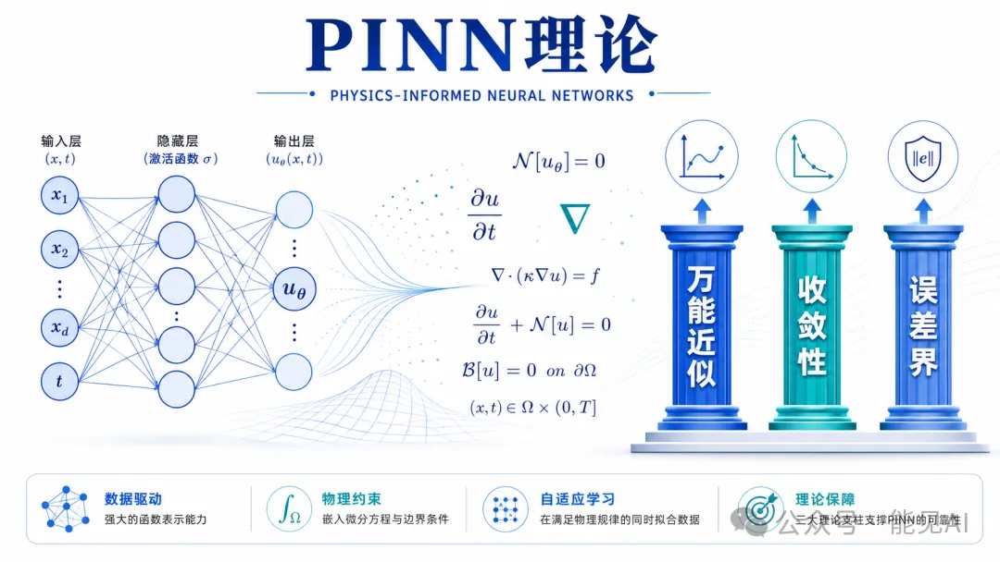
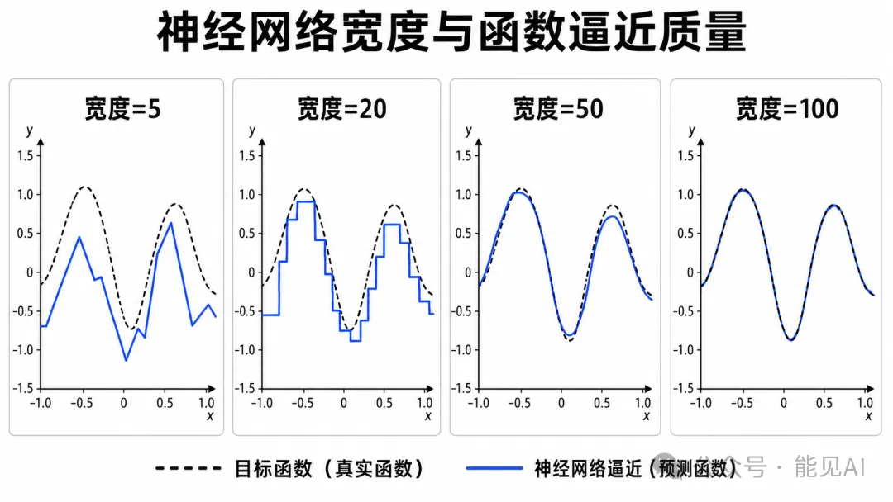
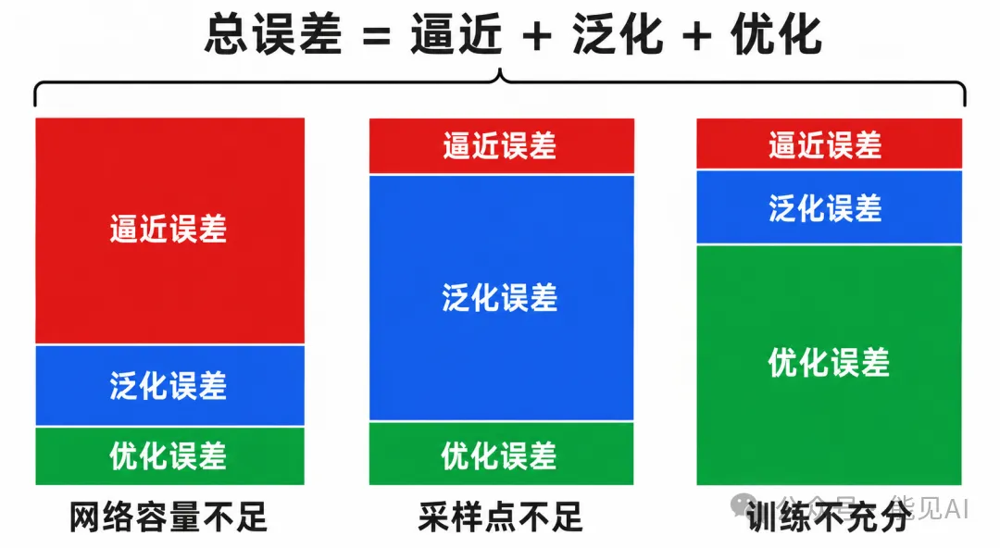
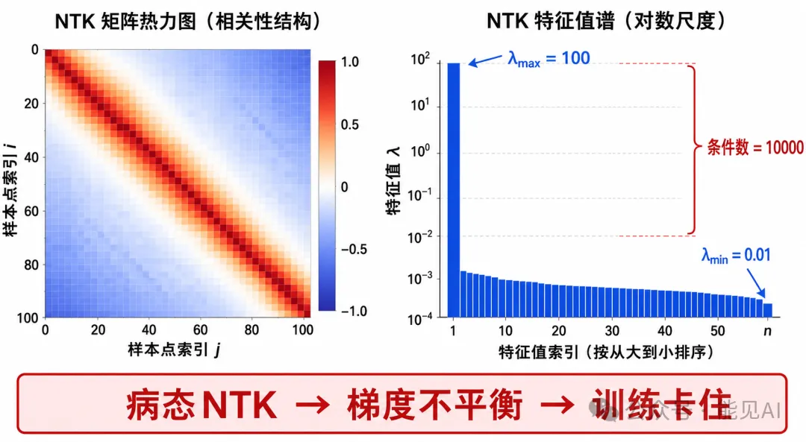
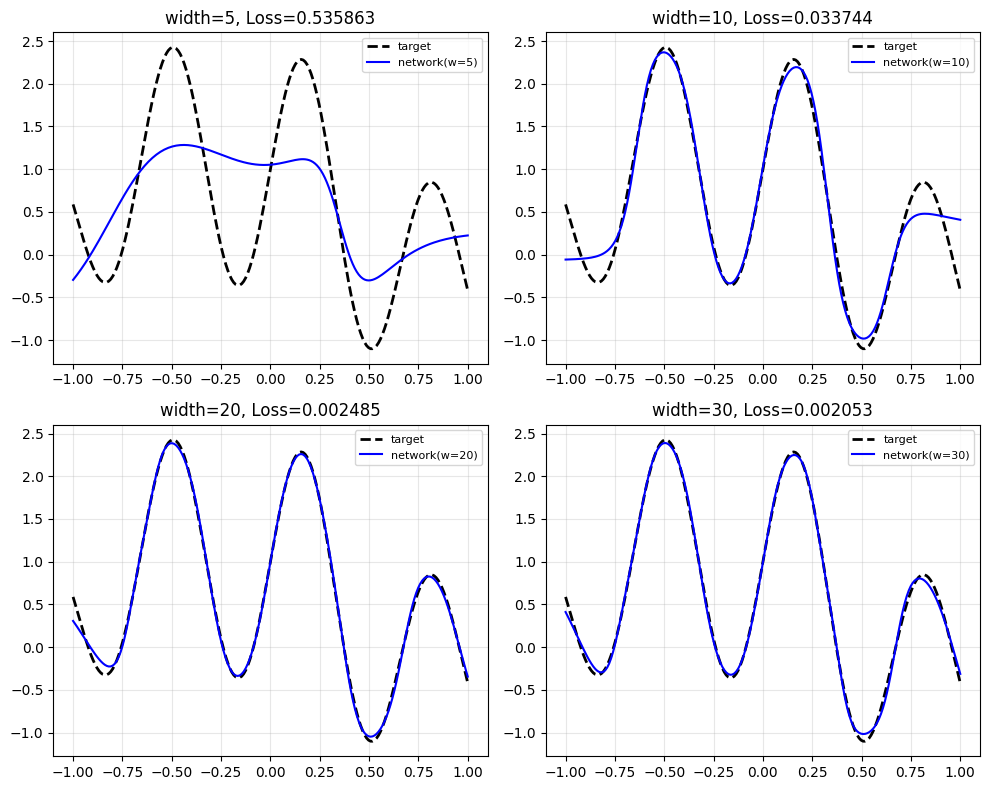

# 📌 零基础学 PINN **第 5 期**：PINN理论支柱：为什么神经网络能求解PDE？

---

## 一、一个根本性的问题

前面我们讲了很多「怎么做」——怎么搭建网络、怎么构造损失函数、怎么调整参数。但有一个更根本的问题一直没有回答：

**PINN 凭什么能求解 PDE？**

神经网络本是为分类、推荐、翻译等任务设计的，凭什么能解偏微分方程？它给出的解靠谱吗？误差能控制到什么程度？

这一节是理论篇的收官之作。我们不会堆砌数学证明，而是让你理解**「为什么有效」**背后的核心逻辑。

> 
> ▲ PINN 理论全景：神经网络架构→物理方程约束→三大理论支柱（万能近似/收敛性/误差界）

---

## 二、第一根支柱：万能近似定理

### 2.1 核心表述

**万能近似定理（Universal Approximation Theorem）**：对于任意连续函数 $f: \mathbb{R}^n \to \mathbb{R}$，只要神经网络足够宽（隐藏层神经元数足够多），就可以将其近似到任意精度 $\epsilon$。

数学上：

$$\exists \, \text{神经网络} \, \hat{f}_{\theta}, \quad \text{使得} \quad \sup_{x \in K} |f(x) - \hat{f}_{\theta}(x)| < \epsilon$$

其中 $K$ 是紧集，$\theta$ 是网络参数。

这是 PINN 的理论起点。**PDE 的解本质上是一个函数 $u(x, t)$。既然神经网络可以近似任意连续函数，它自然也能近似 PDE 的解函数。**

> 
> 万能近似定理演示：网络宽度从 5 增加到 100，逼近曲线从粗糙折线逐步逼近目标函数

### 2.2 直观理解

想象你用乐高积木拼出任意形状：

- **积木块** = 神经元
- **积木越多**（网络越宽），能拼出的形状越精细
- **理论保证**：只要积木够多，可以拼出任意形状

万能近似定理就是这个意思——但它只说了「存在这样的网络」，没说怎么找到它、怎么训练它。这就引出第二个问题：

**找到了近似网络后，怎么保证训练出来的解是真实可靠的？**

### 2.3 实践验证

```python
import torch
import torch.nn as nn
import numpy as np
import matplotlib.pyplot as plt

# 目标函数：复杂非线性函数
def target(x):
    return torch.sin(3*x) * torch.cos(5*x) + 0.5*x**2

# 测试不同宽度的网络
widths = [5, 20, 50, 100]
fig, axes = plt.subplots(2, 2, figsize=(10, 8))

for i, w in enumerate(widths):
    model = nn.Sequential(
        nn.Linear(1, w), nn.Tanh(),
        nn.Linear(w, w), nn.Tanh(),
        nn.Linear(w, 1)
    )

    # 训练
    x = torch.linspace(-1, 1, 200).unsqueeze(1)
    y = target(x)
    opt = torch.optim.Adam(model.parameters(), lr=1e-3)

    for _ in range(2000):
        opt.zero_grad()
        loss = torch.mean((model(x) - y)**2)
        loss.backward()
        opt.step()

    ax = axes[i//2, i%2]
    ax.plot(x.detach(), y.detach(), 'k--', label='目标函数', linewidth=2)
    ax.plot(x.detach(), model(x).detach(), 'b-', label=f'网络（宽度={w}）')
    ax.set_title(f'宽度 = {w}，损失 = {loss.item():.6f}')
    ax.legend(fontsize=8)
    ax.grid(True, alpha=0.3)

plt.tight_layout()
plt.show()
```

**观察**：网络宽度从 $5 \to 100$，逼近曲线从粗糙折线逐渐变为平滑曲线，最终几乎完全重合目标函数。

---

## 三、第二根支柱：收敛性理论

### 3.1 收敛性的含义

**收敛性**是指：当训练损失趋于零、采样点足够多、网络容量足够大时，PINN 的输出会逼近 PDE 的真实解。

形式化表达：

$$\text{如果} \quad \mathcal{L}_{\text{total}} \to 0, \quad N_{\text{sample}} \to \infty, \quad \text{网络宽度} \to \infty$$

$$\text{那么} \quad u_{\text{PINN}}(x, t) \to u_{\text{true}}(x, t)$$

### 3.2 误差分解：三步走证明思路

PINN 的总误差可以分解为三个独立部分：

$$\underbrace{\|u_{\text{true}} - u_{\text{PINN}}\|}_{\text{总误差}} \leq \underbrace{\|u_{\text{true}} - u^*_{\text{NN}}\|}_{\text{逼近误差}} + \underbrace{\|u^*_{\text{NN}} - \hat{u}_{\text{NN}}\|}_{\text{泛化误差}} + \underbrace{\|\hat{u}_{\text{NN}} - u_{\text{PINN}}\|}_{\text{优化误差}}$$

| 误差类型     | 来源         | 通俗理解                           | 如何减小              |
| ------------ | ------------ | ---------------------------------- | --------------------- |
| **逼近误差** | 网络容量不足 | 「乐高积木不够多，拼不出精细形状」 | 增加网络宽度/深度     |
| **泛化误差** | 采样点不足   | 「只看了一部分区域，不代表整体」   | 增加配点数量          |
| **优化误差** | 训练未收敛   | 「优化器还没找到最优解」           | 更多迭代 + 更好优化器 |

> 
> ▲ PINN误差分解：网络容量不足→逼近误差主导；采样点不足→泛化误差主导；训练不充分→优化误差主导

这个分解是理解 PINN 理论的核心。每一项对应一个可控因素：

- 网络不够大 → 加宽加深
- 采样点太少 → 增加配点
- 训练未收敛 → 延长迭代 + 切换优化器

### 3.3 收敛速率：一个反直觉的结论

理论分析表明，PINN 的泛化误差以 $O(N^{-1/2})$ 的速率收敛（$N$ 为配点数）。

这意味着什么？**误差减半需要 4 倍的采样点。**

$$
\begin{aligned}
10{,}000 \, \text{个配点} &\quad \Rightarrow \quad \text{误差} \sim 1\% \\
40{,}000 \, \text{个配点} &\quad \Rightarrow \quad \text{误差} \sim 0.5\% \\
160{,}000 \, \text{个配点} &\quad \Rightarrow \quad \text{误差} \sim 0.25\%
\end{aligned}
$$

这就是为什么 PINN 在高精度求解上通常不如有限元法（FEM 的收敛速率可达 $O(h^p)$，其中 $p = 4 \sim 6$）。

**PINN 的优势不在精度，而在灵活性和反问题求解能力。**

---

## 四、第三根支柱：误差界估计

### 4.1 实际问题：解的可靠性如何评估？

训练结束后，损失降到了 $10^{-5}$，但这代表什么？解的误差是 $1\%$ 还是 $0.01\%$？

理论给出了答案——**后验误差估计**：

$$\|u_{\text{true}} - u_{\text{PINN}}\|_{L^2} \leq C \cdot \|r_{\text{PDE}}(u_{\text{PINN}})\|_{L^2}$$

其中 $r_{\text{PDE}}$ 是 PDE 残差，$C$ 是问题相关的常数。

> **通俗解读**：计算网络输出代入 PDE 后的残差有多大，残差越小，解越准。

### 4.2 实例：变压器温度场误差拆解

| 误差来源               | 典型值                        | 降低方法                             |
| ---------------------- | ----------------------------- | ------------------------------------ |
| 逼近误差（网络容量）   | $\sim 10^{-3}$                | 增加到 $100$ 神经元/层               |
| 泛化误差（采样不足）   | $\sim 5 \times 10^{-4}$       | 采样点从 $10^4$ 增至 $4 \times 10^4$ |
| 优化误差（训练不充分） | $\sim 10^{-4}$                | 增加 L-BFGS 迭代次数                 |
| **总误差**             | **$\sim 1.6 \times 10^{-3}$** | —                                    |

> **结论**：大多数情况下，总误差由逼近误差和泛化误差主导。如果使用 Adam + L-BFGS 两阶段训练，优化误差通常已经很小。

---

## 五、NTK 理论：为什么训练会卡住？

### 5.1 神经正切核（NTK）简介

**Neural Tangent Kernel（NTK）** 是理解神经网络训练动力学的数学工具。不必深究数学细节，只需理解一个核心直觉：

**NTK 描述了网络中不同输入点之间的「关联程度」。**

- **关联强的点** → 一起学习，学得快
- **关联弱的点** → 各学各的，学得慢

### 5.2 NTK 与 PINN 训练失败的关系

研究发现：PINN 的 NTK 矩阵通常是**病态的**——也就是说，不同方向的学习速度差异巨大。

典型 NTK 特征值分布：

$$
\begin{aligned}
\lambda_{\max} &= 100 \quad \leftarrow \text{这个方向学得飞快} \\
\lambda_{\min} &= 0.01 \quad \leftarrow \text{这个方向几乎不学} \\
\text{条件数}\ \kappa &= \frac{\lambda_{\max}}{\lambda_{\min}} = 10{,}000 \quad \leftarrow \text{病态！}
\end{aligned}
$$

> 
> ▲ NTK 病态性：左为相关性热力图（强对角线），右为特征值谱（最大100/最小0.01，条件数=10000），底部结论：病态NTK→梯度不平衡→训练卡住

这直接解释了**损失不平衡问题**：

- PDE 项对应方向：特征值大 → 梯度大 → 学得快
- 边界条件对应方向：特征值小 → 梯度小 → 学得慢
- 结果：优化器「只听」PDE 项的声音，忽略边界条件

### 5.3 NTK 指导修复策略

NTK 理论直接告诉我们修复方法：

**哪个方向特征值小（学得慢），就给它更大的权重。**

这正是[**第 4 期**](../4/PINN的失败与修复.md)自适应权重策略的理论基础。

---

## 六、理论支柱总结

| 理论支柱         | 回答的问题              | 核心结论                    | 实践指导                         |
| ---------------- | ----------------------- | --------------------------- | -------------------------------- |
| **万能近似定理** | 网络能否表示 PDE 的解？ | 网络足够宽就能表示          | 至少 $4$ 层 $\times$ $50$ 神经元 |
| **收敛性理论**   | 损失趋零时解可靠吗？    | 可靠，前提是采样足够多      | 2D 问题至少 $10^4$ 配点          |
| **误差界理论**   | 解的精度有多高？        | 残差范数 $\approx$ 误差上界 | 用后验估计判断收敛质量           |

---

## 七、理论到实践的映射

| 理论结论               | 对应的实践指导                           |
| ---------------------- | ---------------------------------------- |
| 网络需足够大（UAT）    | 至少 $4$ 层 $\times$ $50$ 神经元         |
| 泛化误差 $O(N^{-1/2})$ | 2D 问题至少 $10^4$ 配点                  |
| NTK 病态 → 梯度不平衡  | 使用自适应权重                           |
| 后验误差估计           | 用残差范数判断收敛质量                   |
| Sobolev 正则性要求     | 激活函数需二阶可导（$\tanh$，禁用 ReLU） |

---

## 八、核心要点总结

✅ **三大理论支柱**：万能近似定理（存在性）、收敛性（可靠性）、误差界（精度保证）

✅ **误差分解公式**：总误差 = 逼近 + 泛化 + 优化

✅ **收敛速率**：$O(N^{-1/2})$ — 误差减半需要 $4$ 倍采样点

✅ **NTK 直觉**：特征值差异 → 学习速度差异 → 损失不平衡

✅ **后验误差估计**：用 PDE 残差范数判断解的质量

---

## 📚 课后练习

### 练习：验证万能近似定理

```python
import torch
import torch.nn as nn
import numpy as np
import matplotlib.pyplot as plt
from tqdm import tqdm

# 目标函数：一个复杂的非线性函数
def target(x):
    return torch.sin(3*x) * torch.cos(5*x) + torch.sin(10*x) + torch.cos(2*x) + 0.5*x**2

# 设置随机种子以确保结果可复现
torch.manual_seed(42)
np.random.seed(42)


# 不同宽度的网络
widths = [5, 10, 20, 30]
fig, axes = plt.subplots(2, 2, figsize=(10, 8))

for i, w in enumerate(widths):
    model = nn.Sequential(
        nn.Linear(1, w), nn.Tanh(),
        nn.Linear(w, w), nn.Tanh(),
        nn.Linear(w, 1)
    )

    # 简单训练
    x = torch.linspace(-1, 1, 200).unsqueeze(1)
    y = target(x)
    opt = torch.optim.Adam(model.parameters(), lr=1e-3)

    iter = tqdm(range(2000), desc=f'width={w:02d}')
    for _ in iter:
        opt.zero_grad()
        loss = torch.mean((model(x) - y)**2)
        loss.backward()
        opt.step()

    ax = axes[i//2, i % 2]
    ax.plot(x.detach(), y.detach(), 'k--', label='target', linewidth=2)
    ax.plot(x.detach(), model(x).detach(), 'b-', label=f'network(w={w})')
    ax.set_title(f'width={w}, Loss={loss.item():.6f}')
    ax.legend(fontsize=8)
    ax.grid(True, alpha=0.3)

plt.tight_layout()
plt.show()
```

> 
> ▲ 观察：网络宽度如何影响近似能力？宽度=5时拟合效果如何？宽度=100时呢？

**观察思考**：

- 网络宽度如何影响近似能力？
- 宽度 = $5$ 时拟合效果如何？
- 宽度 = $100$ 时能否完美逼近？

---

## 九、理论篇总结

恭喜！你已完成 PINN 理论篇的全部内容。回顾五期核心：

| 期数 | 主题           | 核心收获                              |
| ---- | -------------- | ------------------------------------- |
| 1.1  | 深度学习基础   | 网络结构、损失函数、优化器            |
| 1.2  | 为什么需要 PDE | PDE 无处不在，传统方法的痛点          |
| 1.3  | PINN 核心思想  | 将 PDE 写进损失函数，自动微分计算残差 |
| 1.4  | 失败与修复     | 四大失败模式 + 系统化修复策略         |
| 1.5  | 理论基础       | UAT、收敛性、误差界、NTK              |

接下来进入**第二篇：代码实操**。我们将从最简单的函数逼近开始，一步步构建完整的 PINN 求解器，最终求解变压器温度场的实际工程问题。
