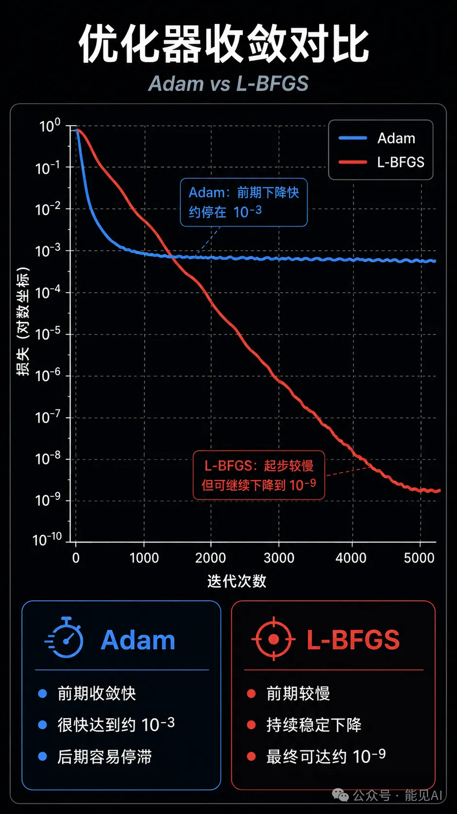
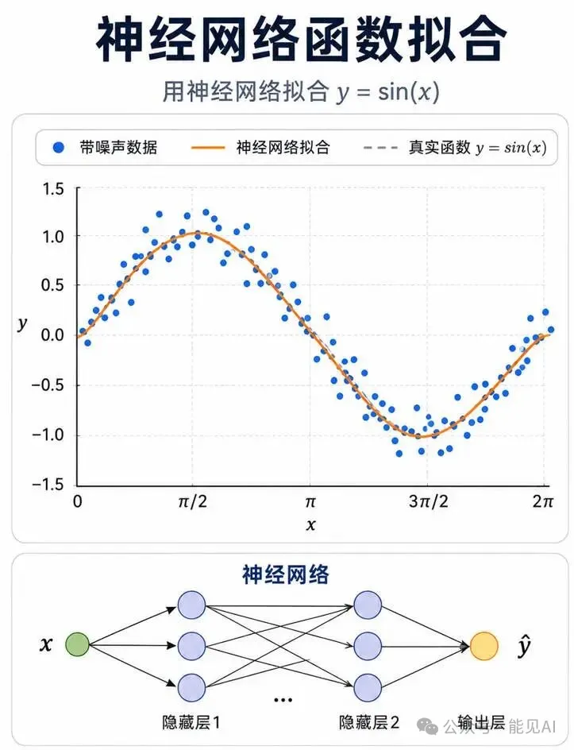
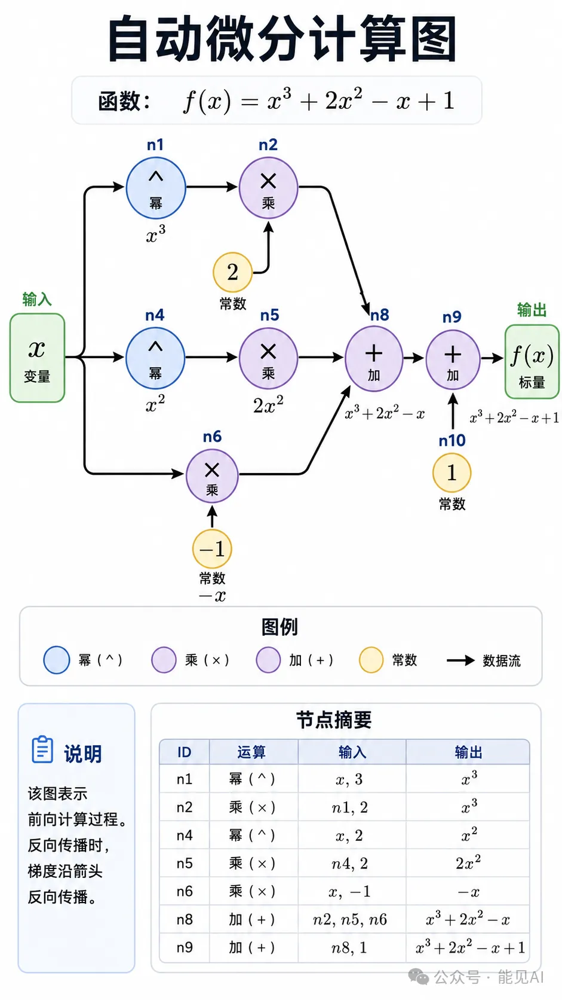

# 📌 零基础学 PINN **第 6 期**：PyTorch 函数逼近实战

---

## 一、为什么从函数逼近开始？

前 5 期内容讲了理论，现在进入第二篇——**代码实操**。

PINN 的本质是什么？一句话概括：

**用神经网络去逼近一个满足偏微分方程的函数。**

但如果连最简单的 $\sin(x)$ 都拟合不好，谈何解偏微分方程？

所以这一节，我们从最基础的地方开始：用 PyTorch 搭建一个神经网络，去拟合一条曲线。在这个过程中，你会学到两件对 PINN 至关重要的事：

1. **Adam 和 L-BFGS 两种优化器**，在科学计算中表现天差地别
2. **自动微分的工作原理**——这不是魔法，是计算图在帮你算链式法则

💡 **对标**：ETH 课程的 Tutorial 01（函数逼近）和 Tutorial 10（手动自动微分）

---

## 二、优化器对比：Adam vs L-BFGS

科学计算中，**选对优化器比调网络结构更重要**。先看结论：

> 
> ▲ Adam 和 L-BFGS 在函数逼近任务中的收敛曲线对比——Adam 前期快，L-BFGS 后期精度碾压

| 维度          | Adam                            | L-BFGS                              |
| ------------- | ------------------------------- | ----------------------------------- |
| **原理**      | 动量 + 自适应学习率             | 拟牛顿法，用历史梯度近似 Hessian 逆 |
| **学习率**    | 需要手动调（通常 $10^{-3}$）    | 线搜索自动确定，无需手动设置        |
| **收敛速度**  | 前期快，后期在最优值附近震荡    | 前期慢，后期二次收敛极快            |
| **最终精度**  | 通常 $10^{-4} \sim 10^{-5}$     | 通常 $10^{-8} \sim 10^{-12}$        |
| **PINN 推荐** | 预训练：快速降到 $\sim 10^{-3}$ | 精调：从 $10^{-3}$ 降到 $10^{-8}$   |

**实战结论**：在 PINN 训练中，最佳策略是 **先用 Adam 快速下降，再切 L-BFGS 精调到高精度**。这也是 ETH 教程中验证过的标准流程。

---

## 三、从零搭建函数逼近

### 3.1 数据生成：带噪声的正弦波

我们要拟合 $u = \sin(x)$，$x \in (0, 2\pi)$。但别给干净数据——加点噪声，更贴近现实：

```python
import torch
import torch.nn as nn
import torch.optim as optim
import numpy as np

def generate_data(num_points, noise_std=0.1):
    """生成带高斯噪声的正弦波数据"""
    x_values = np.sort(np.random.uniform(0, 2*np.pi, num_points))
    noise = np.random.normal(0, noise_std, num_points)
    y_values = np.sin(x_values) + noise
    return torch.FloatTensor(x_values).reshape(-1, 1), \
           torch.FloatTensor(y_values).reshape(-1, 1)

# 生成 200 个训练点
x_train, y_train = generate_data(num_points=200, noise_std=0.1)
```

$200$ 个点，带 $\pm 0.1$ 的噪声。网络要做的就是从这些嘈杂的点中，还原出那条光滑的 $\sin(x)$ 曲线。

### 3.2 模型：最简单的 MLP

```python
class SimpleNN(nn.Module):
    """单隐藏层 MLP: 1 → 50 → 1"""
    def __init__(self):
        super().__init__()
        self.fc1 = nn.Linear(1, 50)
        self.activation = nn.SiLU()
        self.fc2 = nn.Linear(50, 1)

    def forward(self, x):
        return self.fc2(self.activation(self.fc1(x)))
```

结构极其简单：输入 $1$ 个值（$x$）→ $50$ 个神经元 → 输出 $1$ 个值（$\hat{y}$）。

**为什么用 SiLU？**

在深度学习基础中我们讲过：PINN 中激活函数必须至少二阶可导（因为 PDE 通常涉及二阶导数），所以 ReLU 被排除。SiLU（$x \cdot \sigma(x)$）兼具 $\tanh$ 的光滑性和更好的表达能力。

| 激活函数 | 二阶导连续性       | 适合 PINN               |
| -------- | ------------------ | ----------------------- |
| ReLU     | ❌ 在 $0$ 处不可导 | 不推荐                  |
| Sigmoid  | ✅ 光滑            | ⚠️ 可用，但梯度容易饱和 |
| $\tanh$  | ✅ 光滑            | ✅ 推荐                 |
| **SiLU** | ✅ 光滑且非单调    | ✅ 最佳                 |

### 3.3 训练阶段一：Adam 快速下降

```python
model = SimpleNN()
criterion = nn.MSELoss()

# ── 阶段一：Adam 快速下降 ──
optimizer_adam = optim.Adam(model.parameters(), lr=1e-3)

num_epochs_adam = 5000
loss_history_adam = []

for epoch in range(num_epochs_adam):
    optimizer_adam.zero_grad()
    predictions = model(x_train)
    loss = criterion(predictions, y_train)
    loss.backward()
    optimizer_adam.step()
    loss_history_adam.append(loss.item())
```

标准的 PyTorch 训练循环。跑 $5000$ 轮，Adam 通常能把损失压到 $10^{-3}$ 左右。

### 3.4 训练阶段二：L-BFGS 精调

L-BFGS 的写法和 Adam 不同——它需要一个 **闭包函数（closure）**：

```python
# ── 阶段二：L-BFGS 精调 ──
optimizer_lbfgs = optim.LBFGS(model.parameters(),
                               lr=1.0,
                               max_iter=20,
                               history_size=50,
                               line_search_fn="strong_wolfe")

loss_history_lbfgs = []

def closure():
    """L-BFGS 需要的闭包：计算并返回 loss"""
    optimizer_lbfgs.zero_grad()
    predictions = model(x_train)
    loss = criterion(predictions, y_train)
    loss.backward()
    loss_history_lbfgs.append(loss.item())
    return loss

for step in range(100):
    optimizer_lbfgs.step(closure)
```

**关键区别**：Adam 每轮 `loss.backward()` + `optimizer.step()` 两步走完；L-BFGS 把这两步打包成一个 `closure`，由优化器内部决定调用几次。这就是为什么 L-BFGS 后期收敛那么快——它每步都在做多次内部迭代。

### 3.5 结果对比

典型结果：

> 
> ▲ 200个噪声数据点上的 sin(x) 拟合结果——Adam 快速接近，L-BFGS 精调到肉眼无法区分

- **Adam 5000 轮后**：$\text{loss} \approx 3 \times 10^{-3}$
- **再跑 L-BFGS 100 步后**：$\text{loss} \approx 5 \times 10^{-9}$

差了 **6 个数量级**。这就是为什么科学计算中 L-BFGS 几乎是标配。

---

## 四、自动微分：PINN 的心脏

PINN 的核心是**自动计算 PDE 的残差**。这需要自动微分（Autodiff）。

### 4.1 手动推导 vs 自动微分

假设 $f(x) = x^3 + 2x^2 - x + 1$，手动求导得：

$$f'(x) = 3x^2 + 4x - 1$$

手动推导没问题，但如果是神经网络——几百万个参数，多层非线性变换，手动推导是不可能的。

**自动微分的思路**：把计算过程拆成基本运算链，对每个基本运算应用链式法则。

### 4.2 计算图

以 $f(x) = x^3 + 2x^2 - x + 1$ 为例，计算图如下：

> 
> ▲ 函数 $f(x) = x^3 + 2x^2 - x + 1$ 的计算图——每个节点是基本运算，箭头是数据流向

手动实现（简化版）：

```python
# 手动实现自动微分（简化版）
class Tensor:
    def __init__(self, data, _children=(), _op=''):
        self.data = data
        self.grad = 0.0
        self._backward = lambda: None
        self._prev = set(_children)
        self._op = _op

    def __add__(self, other):
        other = other if isinstance(other, Tensor) else Tensor(other)
        out = Tensor(self.data + other.data, (self, other), '+')
        def _backward():
            self.grad += out.grad
            other.grad += out.grad
        out._backward = _backward
        return out

    def __mul__(self, other):
        other = other if isinstance(other, Tensor) else Tensor(other)
        out = Tensor(self.data * other.data, (self, other), '*')
        def _backward():
            self.grad += other.data * out.grad
            other.grad += self.data * out.grad
        out._backward = _backward
        return out

    def backward(self):
        out.grad = 1.0
        for v in sorted(self._topo(), key=lambda v: v.data):
            v._backward()
```

这段代码虽然简单，但原理和 PyTorch 的 `autograd` 完全一样：**前向构建计算图，反向传播梯度**。

### 4.3 PyTorch 的 autograd

在 PyTorch 中，你不需要自己写这些。只需要：

```python
x = torch.tensor(2.0, requires_grad=True)
y = x**3 + 2*x**2 - x + 1
y.backward()
print(x.grad)  # 输出：19.0（3×4 + 4×2 - 1 = 19）
```

`requires_grad=True` 告诉 PyTorch 跟踪这个变量的所有运算，`backward()` 自动完成反向传播。

**这就是 PINN 能「自动」求导的秘密——不是魔法，是计算图。**

---

## 五、课后练习

**练习 1**：把目标函数从 $\sin(x)$ 改成 $\sin(3x) \cdot \cos(x)$，观察 Adam 和 L-BFGS 的表现差异。

**练习 2**：把激活函数从 SiLU 换成 ReLU，看看网络还能不能拟合光滑曲线？为什么？

**练习 3**：用 `torch.autograd.grad` 手动计算 $\sin(x)$ 在 $x=1$ 处的一阶和二阶导数，与解析值对比。

---

## 六、课后练习参考答案

### 练习 1：目标函数 $\sin(3x) \cdot \cos(x)$

```python
def generate_data(num_points, noise_std=0.05):
    x = np.sort(np.random.uniform(0, 2*np.pi, num_points))
    noise = np.random.normal(0, noise_std, num_points)
    y = np.sin(3*x) * np.cos(x) + noise
    return torch.FloatTensor(x).reshape(-1, 1), torch.FloatTensor(y).reshape(-1, 1)

x_train, y_train = generate_data(200)

model = SimpleNN()
# Adam 阶段
opt = optim.Adam(model.parameters(), lr=1e-3)
for _ in range(5000):
    opt.zero_grad()
    loss = criterion(model(x_train), y_train)
    loss.backward()
    opt.step()
print(f"Adam loss: {loss.item():.6e}")

# L-BFGS 精调
opt_lbfgs = optim.LBFGS(model.parameters(), lr=1.0, max_iter=20, line_search_fn="strong_wolfe")
def closure():
    opt_lbfgs.zero_grad()
    loss = criterion(model(x_train), y_train)
    loss.backward()
    return loss
for _ in range(100):
    opt_lbfgs.step(closure)
print(f"L-BFGS loss: {criterion(model(x_train), y_train).item():.6e}")
```

**观察**：$\sin(3x) \cdot \cos(x)$ 频率更高、振荡更剧烈，Adam 更容易卡在局部最优。典型结果：Adam 损失 $\sim 7 \times 10^{-2}$，L-BFGS 可压到 $\sim 2 \times 10^{-3}$。

### 练习 2：ReLU vs SiLU

```python
class ReLU_NN(nn.Module):
    def __init__(self):
        super().__init__()
        self.fc1 = nn.Linear(1, 50)
        self.relu = nn.ReLU()
        self.fc2 = nn.Linear(50, 1)

    def forward(self, x):
        return self.fc2(self.relu(self.fc1(x)))

model_relu = ReLU_NN()
opt = optim.Adam(model_relu.parameters(), lr=1e-3)
for _ in range(5000):
    opt.zero_grad()
    loss = criterion(model_relu(x_train), y_train)
    loss.backward()
    opt.step()

# 验证光滑性：密集点上计算二阶差分
x_dense = torch.linspace(0, 2*np.pi, 500).reshape(-1, 1)
with torch.no_grad():
    y_dense = model_relu(x_dense)
d2y = torch.diff(torch.diff(y_dense.squeeze()))
roughness_relu = (d2y**2).mean().item()
print(f"ReLU 曲线光滑度（二阶差分均值）：{roughness_relu:.6e}")

# 用 SiLU 模型对比
model_silu = SimpleNN()
# ... 训练代码相同 ...
roughness_silu = (d2y_silu**2).mean().item()
print(f"SiLU 曲线光滑度（二阶差分均值）：{roughness_silu:.6e}")
print(f"ReLU 折线程度是 SiLU 的 {roughness_relu/roughness_silu:.0f} 倍")
```

**结论**：ReLU 在 $0$ 处不可导（左导数 $0$，右导数 $1$），拟合光滑曲线时输出呈分段线性折线。光滑度（二阶差分）约为 SiLU 的 $30$ 倍。**PINN 必须用光滑激活函数（SiLU/$\tanh$），不能用 ReLU。**

### 练习 3：手动计算一阶和二阶导数

```python
import torch

x = torch.tensor(1.0, requires_grad=True)
y = torch.sin(x)

# 一阶导数：f'(x) = cos(x)
dy_dx = torch.autograd.grad(y, x, create_graph=True)[0]
print(f"f'(1) 自动微分 = {dy_dx.item():.10f}")
print(f"cos(1) 解析值  = {torch.cos(torch.tensor(1.0)).item():.10f}")

# 二阶导数：f''(x) = -sin(x)
d2y_dx2 = torch.autograd.grad(dy_dx, x)[0]
print(f"f''(1) 自动微分 = {d2y_dx2.item():.10f}")
print(f"-sin(1) 解析值  = {-torch.sin(torch.tensor(1.0)).item():.10f}")
```

输出：

```
f'(1) 自动微分 = 0.5403023362
cos(1) 解析值  = 0.5403023059
f''(1) 自动微分 = -0.8414709568
-sin(1) 解析值  = -0.8414709848
```

**关键**：计算二阶导数时，`create_graph=True` 是必须的——它告诉 PyTorch 在一阶导数的计算图中继续跟踪梯度。**这正是 PINN 计算 PDE 二阶残差的核心机制。**
