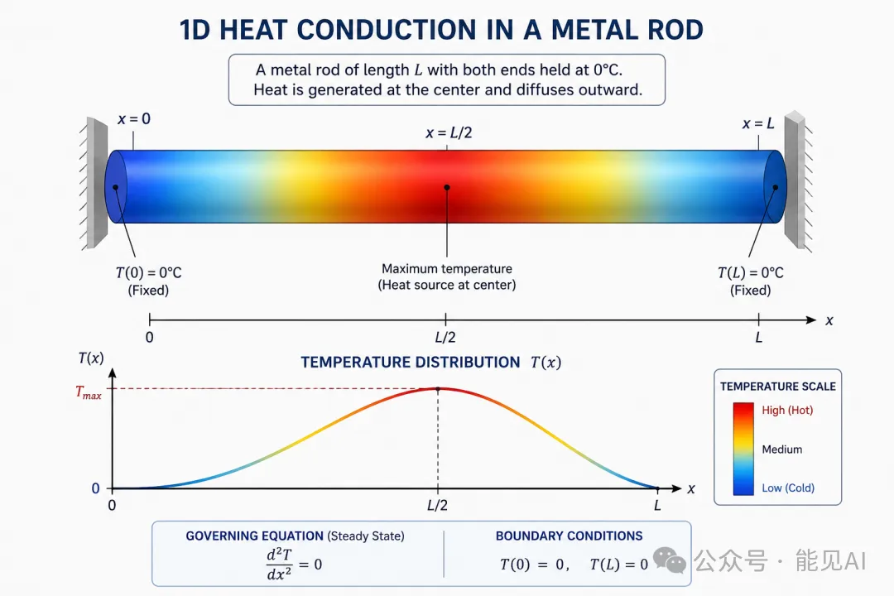
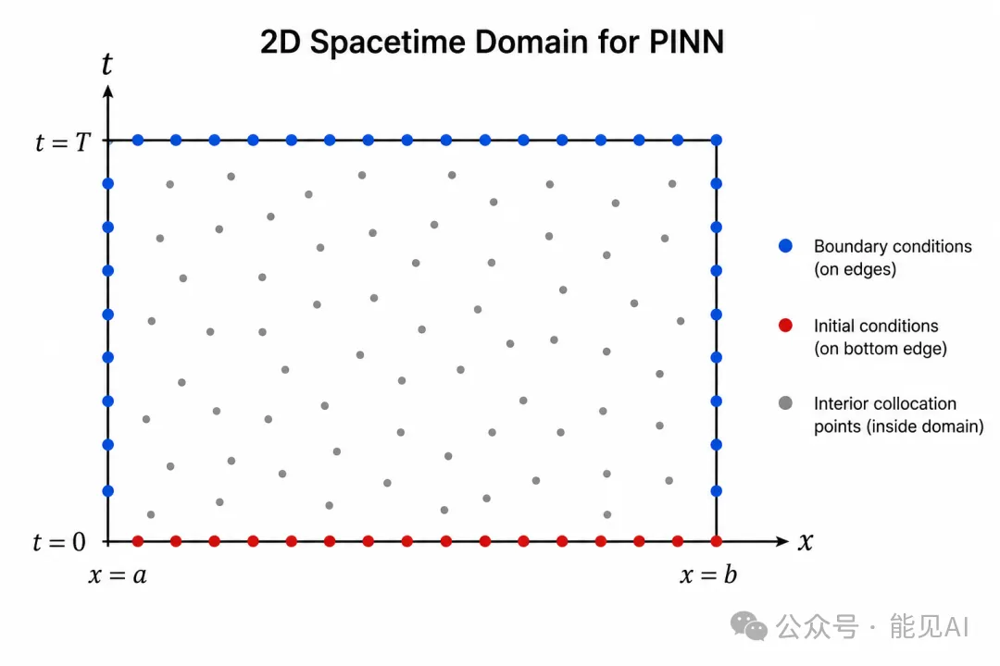

# 📌 零基础学 PINN **第 7 期**：PINN 求解热传导方程

---

## 一、范式转换：从"拟合函数"到"解方程"

在 2.1 节中，我们用神经网络拟合 $\sin(x)$——数据已知，模型只需学习输入输出的映射关系。

现在我们要升级任务：**没有数据，只有方程**。这就是 PINN（Physics-Informed Neural Networks，物理信息神经网络）的核心范式转换。

| 维度     | 函数逼近（[第 6 期](../6/函数逼近.md)） | PINN 解方程（本篇）          |
| -------- | --------------------------------------- | ---------------------------- |
| 已知     | $(x_i, y_i)$ 训练数据对                 | PDE 方程 + 边界/初始条件     |
| 损失     | $\text{MSE}(\hat{y}, y_{\text{true}})$  | MSE(边界预测) + MSE(PDE残差) |
| 监督信号 | 外部数据                                | 物理定律本身                 |
| 网络输出 | 函数近似值                              | 方程的近似解                 |

💡 **本篇对标 ETH 课程的 Tutorial 03（PINN Training）。**

---

## 二、热传导方程：PINN 的第一次实战

ETH Tutorial 03 用**一维热传导方程**演示了 PINN 的完整流程：

$$
\frac{\partial u}{\partial t} = \frac{\partial^2 u}{\partial x^2}, \quad t \in [0, 0.1], \, x \in [-1, 1]
$$

**物理含义**：一根棒子，两端温度固定为 $0$，初始时刻温度分布是 $-\sin(\pi x)$，问随时间推移温度如何变化。

> 
> ▲ 一维热传导方程：一根棒子的温度随时间扩散——两端固定为0，中间热量向两侧扩散

**边界条件**：$u(t, -1) = u(t, 1) = 0$（两端温度固定为 $0$）  
**初始条件**：$u(0, x) = -\sin(\pi x)$（$t=0$ 时的温度分布）

这个方程有解析解：$u(t, x) = -e^{-\pi^2 t} \cdot \sin(\pi x)$，方便我们验证 PINN 的精度。

---

## 三、PINN 的三类训练点

PINN 的训练点不是随便采样的，它们分为三类，分别对应三种物理约束：

> 
> ▲ PINN训练点的三类采样——边界点(蓝色)、初始点(红色)、内部配位点(灰色散点)

| 类型       | 符号             | 物理含义       | 损失项                                                  | 采样位置                   |
| ---------- | ---------------- | -------------- | ------------------------------------------------------- | -------------------------- |
| 空间边界   | $S_{\text{sb}}$  | 边界条件（BC） | $L_{\text{sb}} = \|u_{\text{pred}} - u_{\text{bc}}\|^2$ | $x=-1$ 和 $x=1$ 的边界线上 |
| 时间边界   | $S_{\text{tb}}$  | 初始条件（IC） | $L_{\text{tb}} = \|u_{\text{pred}} - u_{\text{ic}}\|^2$ | $t=0$ 的初始时间线上       |
| 内部配位点 | $S_{\text{int}}$ | PDE 残差为零   | $L_{\text{int}} = \|u_t - u_{xx}\|^2$                   | 时空域内部随机采样         |

**总损失**：

$$
L = \lambda_u \cdot (L_{\text{sb}} + L_{\text{tb}}) + L_{\text{int}}
$$

其中 $\lambda_u$ 是平衡系数，ETH 教程中设为 $10$。这意味着边界条件的权重是内部残差的 $10$ 倍——**先满足边界，再满足方程**。

### 采样策略：Sobol 序列

Tutorial 03 没有用均匀随机采样，而是用了 **Sobol 低差异序列**：

```python
# Sobol 序列：比纯随机更均匀地覆盖整个空间
self.soboleng = torch.quasirandom.SobolEngine(dimension=2)  # (t, x) 二维

# 生成内部配位点（256个）
input_int = self.soboleng.draw(256)

# 生成空间边界点（左右各64个）
input_sb_0 = ...  # x = -1 边界
input_sb_L = ...  # x = +1 边界

# 生成时间边界点（初始时刻64个）
input_tb[:, 0] = t0  # 强制 t = 0
```

**Sobol 序列的优势**：在相同点数下，比纯随机采样更均匀地覆盖整个 $(t, x)$ 空间。这对 PINN 的收敛速度有显著影响——点分布越均匀，网络学到的物理规律越准确。

---

## 四、核心代码拆解

### 4.1 网络架构

```python
from torch import nn
import torch

class NeuralNet(nn.Module):
    """4层 MLP，每层20神经元，SiLU激活"""
    def __init__(self, input_dim=2, output_dim=1,
                 n_hidden=4, neurons=20):
        super().__init__()
        layers = []
        layers.append(nn.Linear(input_dim, neurons))
        layers.append(nn.SiLU())
        for _ in range(n_hidden - 1):
            layers.append(nn.Linear(neurons, neurons))
            layers.append(nn.SiLU())
        layers.append(nn.Linear(neurons, output_dim))
        self.net = nn.Sequential(*layers)

    def forward(self, x):
        return self.net(x)
```

- **输入**：$(t, x)$ 二维坐标 → **输出**：$u(t, x)$ 温度值
- $4$ 层隐藏层，每层 $20$ 个神经元——这就是 PINN 的典型规模。不大，但够用。

### 4.2 PDE 残差计算（PINN 的心脏）

这是整个代码最关键的部分：

```python
def compute_pde_residual(self, input_int):
    """计算热方程残差: r = u_t - u_xx"""
    input_int.requires_grad = True  # 允许对输入求导

    # 前向传播：网络预测 u(t, x)
    u = self.net(input_int)

    # 一阶导数: ∂u/∂t
    u_t = torch.autograd.grad(
        u, input_int,
        grad_outputs=torch.ones_like(u),
        create_graph=True,
        retain_graph=True
    )[0][:, 0:1]

    # 一阶导数: ∂u/∂x
    u_x = torch.autograd.grad(
        u, input_int,
        grad_outputs=torch.ones_like(u),
        create_graph=True,
        retain_graph=True
    )[0][:, 1:2]

    # 二阶导数: ∂²u/∂x²
    u_xx = torch.autograd.grad(
        u_x, input_int,
        grad_outputs=torch.ones_like(u_x),
        create_graph=True
    )[0][:, 1:2]

    # 残差: u_t - u_xx 应该趋近于 0
    return u_t - u_xx
```

**核心逻辑**：

1. `requires_grad = True`：告诉 PyTorch 要追踪输入变量的梯度
2. 第一次 `autograd.grad`：算出 $\frac{\partial u}{\partial t}$ 和 $\frac{\partial u}{\partial x}$
3. 第二次 `autograd.grad`：对 $\frac{\partial u}{\partial x}$ 再求导，得到 $\frac{\partial^2 u}{\partial x^2}$
4. 残差 $r = u_t - u_{xx}$：如果网络真的在解热方程，这个残差应该趋近于 $0$

💡 **`create_graph=True` 是关键**——它告诉 PyTorch 在计算梯度时也构建计算图，这样才能对梯度再求导（二阶导数）。

### 4.3 训练循环

```python
# 两阶段训练：Adam 预训练 + L-BFGS 精调
# 阶段一：Adam
optimizer_adam = torch.optim.Adam(self.parameters(), lr=0.001)
for epoch in range(num_epochs_adam):
    loss = self.compute_total_loss()
    optimizer_adam.zero_grad()
    loss.backward()
    optimizer_adam.step()

# 阶段二：L-BFGS
optimizer_lbfgs = torch.optim.LBFGS(self.parameters(), lr=1.0)
for step in range(num_steps_lbfgs):
    optimizer_lbfgs.step(closure)
```

和 2.1 节一样的两阶段策略。

---

## 五、结果：PINN 解得有多准？

典型结果：

- PINN 预测的温度场与解析解的 MSE 误差在 $10^{-3}$ 量级
- 只用了 $256$ 个内部配位点 $+$ $128$ 个边界点
- **没有任何温度数据，只用了方程本身**

这就是 PINN 的威力：**方程即数据**。

---

## 六、课后练习

**练习 1**：把初始条件改成 $u(0, x) = \cos(\pi x/2)$，边界条件不变。PINN 还能收敛吗？

**练习 2**：尝试只用 Adam 训练，不切 L-BFGS。最终精度差多少？

**练习 3**：把内部配位点数从 $256$ 减少到 $64$，观察误差变化。采样点数和精度是什么关系？

> 参考答案可前往 [JupyterHub 空间](http://expfluid.bond/jupyter)查看
