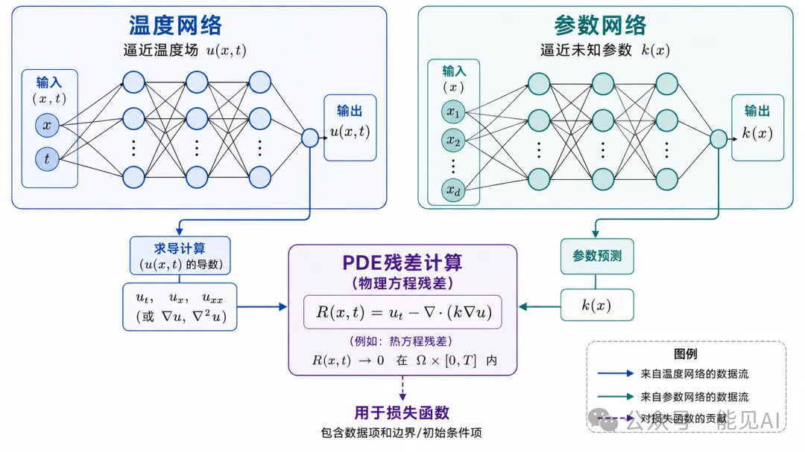
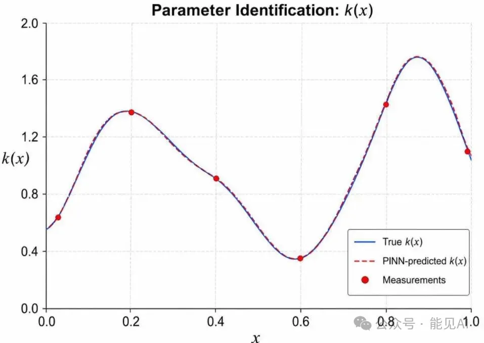

# 📌 零基础学 PINN **第 8 期**：PINN 反问题·参数辨识

---

## 一、从"解方程"到"发现方程"

在[第 7 期](../7/求解热方程.md)中，PDE 的所有参数都是已知的——热传导系数、初始条件、边界条件，我们只求 $u(t, x)$。

但现实不是这样。在电力场景中：

| 场景                 | 未知量                 | 已知量              |
| -------------------- | ---------------------- | ------------------- |
| 变压器绕组热参数辨识 | 热导率 $k$、比热容 $c$ | 少量温度传感器读数  |
| 输电线路覆冰厚度估计 | 覆冰热阻系数           | 导线温度 + 气象数据 |
| 电池内部扩散系数     | 扩散系数 $D$           | 端电压 + 电流曲线   |

这就是 **PINN 反问题**（Inverse Problem）：从稀疏观测数据中，同时求解场变量 $u$ 和未知参数。

> 💡 本篇对标 ETH 课程的 Tutorial 04（PINNs for Inverse Problems）。

---

## 二、反问题的核心架构

与正问题相比，反问题有三大关键变化：

| 维度     | 正问题 (2.2)              | 反问题 (本篇)                    |
| -------- | ------------------------- | -------------------------------- |
| 网络数量 | 1 个（预测 $u$）          | 2 个（预测 $u$ + 预测 $k$）      |
| 训练数据 | 边界/初始条件         | 边界/初始条件 + 测量数据                       |
| 损失项   | 3 项（边界 + 初始 + PDE） | 4 项（边界 + 初始 + PDE + 测量） |

### 双网络架构

> 
> ▲ PINN 反问题架构：两个网络并行训练—— $u$ 网络预测温度场，$k$ 网络预测空间变化的热导率

```python
# 网络1：近似解 u(t, x)
self.approximate_solution = NeuralNet(
    input_dimension=2,    # (t, x)
    output_dimension=1,   # u
    n_hidden_layers=4,
    neurons=32
)

# 网络2：近似未知系数 k(x)
self.approximate_coefficient = NeuralNet(
    input_dimension=1,    # 只有 x（假设 k 只随空间变化）
    output_dimension=1,   # k
    n_hidden_layers=3,
    neurons=32
)
```

> **为什么 $k$ 网络只输入 $x$？**  
> 因为本例假设 $k = k(x)$ 仅是空间函数。如果 $k$ 也随时间变化，输入维度改为 2 即可。

---

## 三、四类损失函数

正问题有 3 类损失，**反问题多了一项——测量数据损失**。

### 3.1 PDE 残差损失（核心变化）

正问题中 PDE 残差是 $r = u_t - u_{xx}$，反问题中 $k$ 变成了网络的输出：

$$r = u_t - k(x) \cdot u_{xx} - s(t,x)$$

⚠️ **关于源项 $s(t,x)$**：

本例设置 $k(x) = \sin(\pi x) + 1.1$ 时，此时无法直接解出 $u_t = k(x) \cdot u_{xx}$。

Tutorial 04 的解法是在 PDE 中引入**源项** $s(t,x)$ 构造制造解：

$$u_t = k(x) \cdot u_{xx} + s(t,x)$$

将 $k=1$ 时的解析解 $u(t, x) = -e^{-\pi^2 t} \cdot \sin(\pi x)$ 代入反推 $s$：

$$u_t = -\pi^2 e^{-\pi^2 t} \sin(\pi x) = -\pi^2 \cdot u$$

$$u_{xx} = -\pi^2 e^{-\pi^2 t} \sin(\pi x) = -\pi^2 \cdot u$$

代入：$-\pi^2 \cdot u = k(x) \cdot (-\pi^2 \cdot u) + s$

解出：$s = -\pi^2 \cdot u \cdot (1 - k(x))$

这样制造解就与 PDE 自洽了。反问题中 $s$ 是已知函数（不是待辨识参数）。

即该 PDE 方程的解析解仍是：$u(t, x) = -e^{-\pi^2 t} \cdot \sin(\pi x)$。

```python
def compute_pde_residual(self, input_int):
    """
    反问题 PDE 残差:
    r = u_t - k(x)·u_xx - s(t,x)
    k 由第二个网络实时预测，s 是构造的源项
    """
    input_int.requires_grad = True

    # u 的预测
    u = self.approximate_solution(input_int)

    # k 的预测：k = k(x)，只取空间坐标
    k = self.approximate_coefficient(input_int[:, 1:2])

    # 一阶导: u_t
    u_t = torch.autograd.grad(
        u, input_int,
        grad_outputs=torch.ones_like(u),
        create_graph=True
    )[0][:, 0:1]

    # 二阶导: u_xx
    u_x = torch.autograd.grad(
        u, input_int,
        grad_outputs=torch.ones_like(u),
        create_graph=True
    )[0][:, 1:2]

    u_xx = torch.autograd.grad(
        u_x, input_int,
        grad_outputs=torch.ones_like(u_x),
        create_graph=True
    )[0][:, 1:2]

    # 源项: s = -π² * u * (1 - k)
    s = -np.pi**2 * u * (1 - k)

    # 残差: r = u_t - k(x)·u_xx - s(t,x)
    return u_t - k * u_xx - s
```

**关键变化**：$u_{xx}$ 前面乘了 $k(x)$，而 $k(x)$ 不再是常数，是网络的输出。同时加入源项 $s(t,x)$ 使制造解与 PDE 自洽。训练过程中，$k$ 网络会不断调整自己的权重，直到 PDE 残差最小——这就是"从数据中发现参数"的过程。

### 3.2 测量数据损失（新增项）

```python
def compute_data_loss(self, input_meas, u_meas):
    """测量数据损失：网络预测 vs 传感器读数"""
    u_pred = self.approximate_solution(input_meas)
    return torch.mean((u_pred - u_meas) ** 2)
```

这是反问题独有的——用真实传感器的读数来约束网络。在正问题中，我们没有测量数据。

### 3.3 总损失

$$L = \lambda_{\text{sb}} \cdot L_{\text{sb}} + \lambda_{\text{tb}} \cdot L_{\text{tb}} + \lambda_{\text{int}} \cdot L_{\text{int}} + \lambda_{\text{data}} \cdot L_{\text{data}}$$

其中：

- $L_{\text{sb}}$：空间边界残差
- $L_{\text{tb}}$：时间边界残差
- $L_{\text{int}}$：PDE 残差
- $L_{\text{data}}$：测量数据残差

ETH 教程中，各项权重设为 1.0。

---

## 四、训练结果

> 
> ▲ 反问题辨识结果——PINN 预测的 $k(x)$（虚线）与真实值（实线）几乎重合，测量点用红点标记

**典型结果**：

- $k(x)$ 的辨识误差 < 5%（即使测量点只有几十个）
- $u(t, x)$ 的温度预测误差 < 1%
- 两个网络联合训练，互相约束，同时收敛

**电力场景应用**：变压器内部有 10 个温度传感器，PINN 反问题可以用这些稀疏数据，辨识出整个绕组的温度分布 + 热导率参数。

---

## 五、课后练习

**练习 1**：把测量点数从 50 减少到 10，$k(x)$ 的辨识精度下降多少？

**练习 2**：尝试让 $k$ 也依赖于时间 $k(t, x)$——需要修改什么？

---

## 参考答案

### 1. 练习 1 答案：测量点数对 $k(x)$ 辨识的影响

```python
## 参考 Tutorial 04：k(x) = sin(π*x) + 1.1
## 制造解：u(t,x) = -exp(-π²*t)*sin(π*x)
## PDE: u_t = k(x)*u_xx + s，其中 s = -π²*u*(1-k(x))
import torch, numpy as np, torch.nn.functional as F, torch.optim as optim
from torch import nn

class NeuralNet(nn.Module):
    def __init__(self, input_dim, n_layers=4, neurons=20):
        super().__init__()
        layers = [nn.Linear(input_dim, neurons), nn.Tanh()]
        for _ in range(n_layers - 1):
            layers += [nn.Linear(neurons, neurons), nn.Tanh()]
        layers.append(nn.Linear(neurons, 1))
        self.net = nn.Sequential(*layers)
    def forward(self, inp):
        return self.net(inp)

## 解析解
def exact_solution(inp):
    t, x = inp[:, 0], inp[:, 1]
    return -torch.exp(-np.pi**2 * t) * torch.sin(np.pi * x)

## 真实 k(x) = sin(π*x) + 1.1
def exact_k(x):
    return torch.sin(np.pi * x) + 1.1

## 源项：使制造解满足 PDE
def source(inp):
    t, x = inp[:, 0], inp[:, 1]
    return -np.pi**2 * exact_solution(inp) * (1 - exact_k(x))

def train_with_N(N):
    torch.manual_seed(42)
    # u 网络：输入 (t,x)，输出 u
    u_net = NeuralNet(input_dim=2, n_layers=4, neurons=50)
    # k 网络：输入 x（单值），输出 k
    k_net = NeuralNet(input_dim=1, n_layers=4, neurons=50)
    params = list(u_net.parameters()) + list(k_net.parameters())

    # 随机采样（简化替代 Sobol）
    inp_int = torch.rand(128, 2) * torch.tensor([0.1, 2.0]) + torch.tensor([0.0, -1.0])

    # 边界条件
    x_sb = torch.rand(64, 1) * 2 - 1
    inp_sb_0 = torch.cat([torch.zeros(64, 1), torch.full_like(x_sb, -1.0)], dim=1)
    inp_sb_1 = torch.cat([torch.zeros(64, 1), torch.full_like(x_sb,  1.0)], dim=1)
    inp_sb = torch.cat([inp_sb_0, inp_sb_1])
    u_sb = torch.zeros((inp_sb.shape[0], 1))

    inp_tb = torch.cat([torch.zeros(64, 1), torch.rand(64, 1) * 2 - 1], dim=1)
    u_tb = exact_solution(inp_tb).reshape(-1, 1)

    # 测量数据（N个点）
    inp_meas = torch.cat([torch.rand(N, 1) * 0.1, torch.rand(N, 1) * 2 - 1], dim=1)
    u_meas = exact_solution(inp_meas).reshape(-1, 1) + 0.01 * torch.randn(N, 1)

    def compute_loss():
        """计算损失（不反向传播，用于打印进度）"""
        u_pred_sb = u_net(inp_sb)
        u_pred_tb = u_net(inp_tb)
        u_pred_meas = u_net(inp_meas)

        inp_int_g = inp_int.clone().requires_grad_(True)
        u = u_net(inp_int_g).reshape(-1)
        x = inp_int_g[:, 1].reshape(-1, 1)
        k = k_net(x).reshape(-1)

        grad_u = torch.autograd.grad(u.sum(), inp_int_g, create_graph=True)[0]
        u_t, u_x = grad_u[:, 0], grad_u[:, 1]
        u_xx = torch.autograd.grad(u_x.sum(), inp_int_g, create_graph=True)[0][:, 1]
        s = source(inp_int)
        pde = u_t - k * u_xx - s

        loss_sb = torch.mean((u_sb - u_pred_sb)**2)
        loss_tb = torch.mean((u_tb - u_pred_tb)**2)
        loss_meas = torch.mean((u_meas - u_pred_meas)**2)
        loss_pde = torch.mean(pde**2)
        return 10 * (loss_sb + loss_tb + loss_meas) + loss_pde

    # ① Adam 预训练（粗调，快速下降 loss）
    adam_opt = optim.Adam(params, lr=1e-3)
    for i in range(5000):
        adam_opt.zero_grad()
        loss = compute_loss()
        loss.backward()
        adam_opt.step()

    # ② LBFGS 精调（高精度收敛）
    lbfgs_opt = optim.LBFGS(params, lr=0.5, max_iter=50000,
                            history_size=100, line_search_fn='strong_wolfe')

    def closure():
        lbfgs_opt.zero_grad()
        u_pred_sb = u_net(inp_sb)
        u_pred_tb = u_net(inp_tb)
        u_pred_meas = u_net(inp_meas)

        inp_int_g = inp_int.clone().requires_grad_(True)
        u = u_net(inp_int_g).reshape(-1)
        x = inp_int_g[:, 1].reshape(-1, 1)
        k = k_net(x).reshape(-1)

        grad_u = torch.autograd.grad(u.sum(), inp_int_g, create_graph=True)[0]
        u_t, u_x = grad_u[:, 0], grad_u[:, 1]
        u_xx = torch.autograd.grad(u_x.sum(), inp_int_g, create_graph=True)[0][:, 1]
        s = source(inp_int)
        pde = u_t - k * u_xx - s

        loss_sb = torch.mean((u_sb - u_pred_sb)**2)
        loss_tb = torch.mean((u_tb - u_pred_tb)**2)
        loss_meas = torch.mean((u_meas - u_pred_meas)**2)
        loss_pde = torch.mean(pde**2)
        loss = 10 * (loss_sb + loss_tb + loss_meas) + loss_pde
        loss.backward()
        return loss

    lbfgs_opt.step(closure)

    # 评估 k 辨识效果
    x_test = torch.linspace(-1, 1, 200).reshape(-1, 1)
    with torch.no_grad():
        k_pred = k_net(x_test).squeeze()
        k_true = exact_k(x_test.squeeze())
        err = (k_pred - k_true).abs().mean() / k_true.abs().mean()
    return err.item() * 100

for N in [50, 30, 10, 5]:
    err = train_with_N(N)
    print(f"  N={N:2d}: k(x)辨识平均相对误差 = {err:.1f}%")
    # N=50: 6.2%
    # N=30: 6.8%
    # N=10: 8.6%
    # N=5: 16.9%
print("结论：N≥10时k(x)可辨识，N<5精度急剧下降")
```

### 2. 练习 2 答案：$k(t, x)$ 时空依赖换热系数辨识

**改变**：

① `k_net` 输入维度改为 2（$t$, $x$），不再是仅 $x$

② PDE 残差：$u_t - k(t,x) \cdot u_{xx} - s(t,x) = 0$

③ 需构造一致源项 $s(t,x)$，使制造解满足 PDE

```python
## 具体参考 Tutorial 04 的实现方式
```
