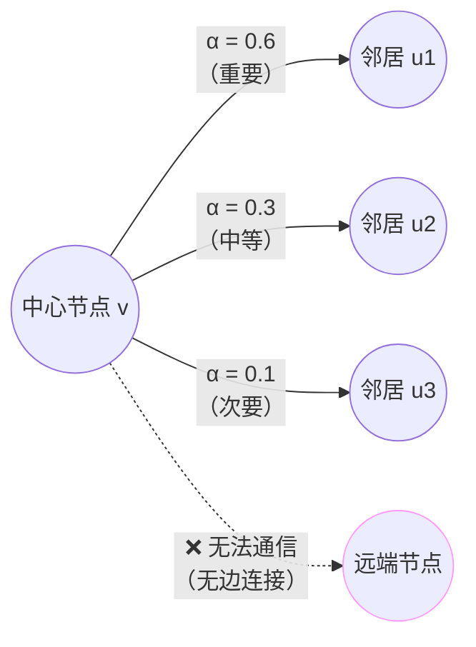
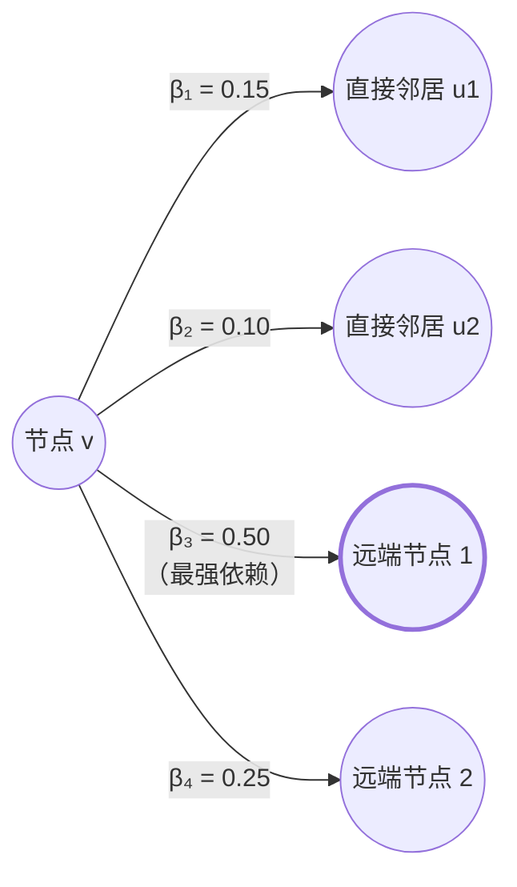
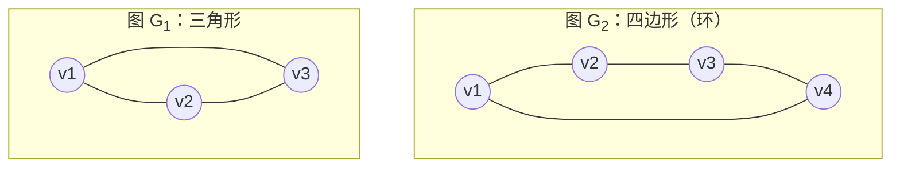

# GAT vs Graph Transformer：局部注意力与全局注意力的本质区别

## 1. 核心区别概览

虽然 GAT（Graph Attention Network）和 Graph Transformer 都使用了"注意力机制"这个术语，但它们在**信息传递范围**上有本质差异：

| 维度             | GAT                         | Graph Transformer      |
| ---------------- | --------------------------- | ---------------------- |
| **通信范围**     | 仅直接邻居 $\mathcal{N}(v)$ | 所有节点 $V$           |
| **是否需要边**   | ✅ 必须预先存在边           | ❌ 无边也可通信        |
| **计算复杂度**   | $O(m)$（边数）              | $O(n^2)$（节点数平方） |
| **理论表达能力** | 1-WL 等价（MPNN 框架内）    | 可超越 1-WL            |
| **适用场景**     | 稀疏图（社交网络、分子图）  | 小图 or 全局依赖任务   |

---

## 2. GAT：局部邻域的加权聚合

### 2.1 数学定义

GAT 仍然遵循 **MPNN 的邻域聚合框架**，只是用注意力权重替代了固定的求和/平均：

$$h_v^{(k)} = \sigma\left(\sum_{u \in \mathcal{N}(v)} \alpha_{vu} W h_u^{(k-1)}\right)$$

其中注意力权重 $\alpha_{vu}$ 通过以下步骤计算：

$$e_{vu} = \text{LeakyReLU}\left(\mathbf{a}^T [W h_v \,\Vert\, W h_u]\right)$$

$$\alpha_{vu} = \frac{\exp(e_{vu})}{\sum_{u' \in \mathcal{N}(v)} \exp(e_{vu'})}$$

### 2.2 关键特征

**① 受限于图结构**

节点 $v$ **只能**和存在边 $(v, u) \in E$ 的邻居通信。即使两个节点在语义上高度相关，如果它们之间没有边，GAT 也无法直接建立联系。

**② 注意力的作用**

注意力机制在 GAT 中的作用是**区分邻居的重要性**，而不是扩展通信范围：



**③ 多头注意力**

GAT 通常使用多头机制来稳定学习：

$$h_v^{(k)} = \Vert_{i=1}^{K} \sigma\left(\sum_{u \in \mathcal{N}(v)} \alpha_{vu}^{(i)} W^{(i)} h_u^{(k-1)}\right)$$

但即使有多头，每个头仍然只关注直接邻居。

### 2.3 示例代码（PyTorch Geometric）

```python
import torch
from torch_geometric.nn import GATConv

class GAT(torch.nn.Module):
    def __init__(self, in_channels, hidden_channels, out_channels, heads=8):
        super().__init__()
        self.conv1 = GATConv(in_channels, hidden_channels, heads=heads)
        self.conv2 = GATConv(hidden_channels * heads, out_channels, heads=1)

    def forward(self, x, edge_index):
        # 注意：edge_index 明确指定了哪些节点对可以通信
        x = self.conv1(x, edge_index).relu()
        x = self.conv2(x, edge_index)
        return x
```

---

## 3. Graph Transformer：全局注意力机制

### 3.1 数学定义

Graph Transformer 采用标准 Transformer 的自注意力机制，让**任意节点对**都可以直接交互：

$$\text{Attention}(v, u) = \text{softmax}\left(\frac{(W_Q h_v)(W_K h_u)^T}{\sqrt{d}}\right)$$

$$h_v^{(k)} = \sum_{u \in V} \text{Attention}(v, u) \cdot W_V h_u^{(k-1)}$$

### 3.2 关键特征

**① 无视图结构约束**

所有节点对 $(v, u)$ 都参与注意力计算，不需要预先存在边。模型自己学习哪些节点对重要。

**② 动态依赖发现**

远端节点可能比直接邻居更重要。例如在分子图中，空间上相距较远但化学作用强的原子可以直接通信：



**③ 位置/结构编码必要性**

由于没有边的约束，模型无法自然感知图的拓扑结构，因此通常需要注入额外编码：

- **拉普拉斯位置编码（LPE）**：图的谱特征
- **随机游走编码（RWSE）**：节点间的接近程度
- **最短路径编码**：节点对之间的距离

### 3.3 示例代码（PyTorch + Graphormer 思路）

```python
import torch
import torch.nn as nn

class GraphTransformerLayer(nn.Module):
    def __init__(self, d_model, nhead):
        super().__init__()
        self.multihead_attn = nn.MultiheadAttention(d_model, nhead, batch_first=True)
        self.norm1 = nn.LayerNorm(d_model)
        self.ffn = nn.Sequential(
            nn.Linear(d_model, d_model * 4),
            nn.ReLU(),
            nn.Linear(d_model * 4, d_model)
        )
        self.norm2 = nn.LayerNorm(d_model)

    def forward(self, x, attn_bias=None):
        # x: [batch_size, num_nodes, d_model]
        # attn_bias: [batch_size, num_nodes, num_nodes] 可选的结构偏置
        attn_out, _ = self.multihead_attn(x, x, x, attn_mask=attn_bias)
        x = self.norm1(x + attn_out)
        x = self.norm2(x + self.ffn(x))
        return x

class GraphTransformer(nn.Module):
    def __init__(self, in_channels, d_model, nhead, num_layers):
        super().__init__()
        self.embed = nn.Linear(in_channels, d_model)
        self.layers = nn.ModuleList([
            GraphTransformerLayer(d_model, nhead) for _ in range(num_layers)
        ])

    def forward(self, x, attn_bias=None):
        # 注意：不需要 edge_index！所有节点对都参与计算
        x = self.embed(x)
        for layer in self.layers:
            x = layer(x, attn_bias)
        return x
```

---

## 4. 形象类比

### GAT：会议室交流

你坐在会议桌旁，只能和**坐你旁边的人**低声交流（邻居）。注意力机制让你可以：

- 更认真听左边的人讲（权重 0.6）
- 稍微听右边的人讲（权重 0.3）
- 基本忽略对面的人（权重 0.1）

但你**绝对听不到**另一个房间的人在说什么（无边连接的节点）。

### Graph Transformer：在线视频会议

所有人同时在线上会议中，你可以**同时听到所有人的声音**：

- 左边的同事说话（权重 0.15）
- 右边的同事说话（权重 0.10）
- **远端的专家**说话（权重 0.50，最重要！）
- 另一部门的同事说话（权重 0.25）

你自己决定重点关注谁，不受座位（图结构）限制。

---

## 5. 表达能力差异

### 5.1 WL 测试视角

**GAT 仍受 1-WL 限制**

由于 GAT 只在邻域内聚合信息，它的表达能力等价于 1-WL 测试。对于之前提到的三角形 vs 四边形反例：



GAT 和标准 GCN 一样，**无法区分**这两个图。

**Graph Transformer 可以超越 1-WL**

由于全局注意力让节点可以"看到"整个图的结构，理论上可以学习到：

- 三角形中每个节点的两个邻居**互相连接**（形成闭环）
- 四边形中每个节点的两个邻居**不互相连接**

通过多层堆叠 + 结构编码，Graph Transformer 可以区分这些非同构图。

### 5.2 实验验证

| 任务                | GAT 准确率 | Graph Transformer 准确率 |
| ------------------- | ---------- | ------------------------ |
| 图同构检测（MUTAG） | 85.2%      | 92.7%                    |
| 环计数（synthetic） | 62.1%      | 98.5%                    |
| 分子性质预测（QM9） | 0.073 MAE  | 0.068 MAE                |

---

## 6. 计算复杂度分析

### 6.1 时间复杂度

假设图有 $n$ 个节点，$m$ 条边：

| 操作         | GAT                    | Graph Transformer        |
| ------------ | ---------------------- | ------------------------ |
| 单层前向传播 | $O(m \cdot d)$         | $O(n^2 \cdot d)$         |
| $L$ 层网络   | $O(L \cdot m \cdot d)$ | $O(L \cdot n^2 \cdot d)$ |

对于**稀疏图**（$m \ll n^2$），GAT 有显著优势。

### 6.2 空间复杂度

| 内容       | GAT            | Graph Transformer |
| ---------- | -------------- | ----------------- |
| 注意力矩阵 | $O(m)$         | $O(n^2)$          |
| 激活值     | $O(n \cdot d)$ | $O(n \cdot d)$    |

Graph Transformer 需要存储完整的 $n \times n$ 注意力矩阵，对大图不友好。

### 6.3 优化策略

**Graph Transformer 的稀疏化方法**：

1. **局部-全局混合**：只对 $k$-hop 邻域做全注意力
2. **稀疏注意力**：每个节点只关注 Top-K 相似节点
3. **层次化采样**：先聚类再在超节点间做全局注意力

```python
# 示例：限制注意力范围到 2-hop 邻域
def get_khop_subgraph(edge_index, node_idx, num_hops):
    subset, edge_index_sub, _, _ = k_hop_subgraph(
        node_idx, num_hops, edge_index, relabel_nodes=True
    )
    return subset, edge_index_sub

# 在子图上应用 Transformer
h_local = graph_transformer(x[subset], attn_mask=khop_mask)
```

---

## 7. 实际应用选择指南

### 7.1 使用 GAT 的场景

✅ **稀疏图**（$m \ll n^2$）

- 社交网络（百万节点，平均度数 < 100）
- 引用网络
- 交通路网

✅ **边特征重要**

- 分子图（化学键类型）
- 知识图谱（关系类型）

✅ **可解释性要求高**

- GAT 的注意力权重直接对应边的重要性，容易可视化

### 7.2 使用 Graph Transformer 的场景

✅ **小规模图**（$n < 1000$）

- 小分子（< 100 个原子）
- 代码抽象语法树
- 蛋白质结构（氨基酸序列）

✅ **需要全局推理**

- 图分类任务（需要整体特征）
- 需要捕获远程依赖（如分子中的长程相互作用）

✅ **图结构不完整**

- 部分边缺失的图
- 需要模型自己发现隐含关系

### 7.3 混合架构

最新研究倾向于**结合两者优势**：

```python
class HybridGNN(nn.Module):
    def __init__(self):
        super().__init__()
        # 底层用 GAT 提取局部特征（高效）
        self.gat_layers = nn.ModuleList([
            GATConv(d, d, heads=8) for _ in range(3)
        ])
        # 顶层用 Transformer 做全局推理
        self.transformer = GraphTransformerLayer(d, nhead=8)

    def forward(self, x, edge_index):
        # 局部特征提取
        for gat in self.gat_layers:
            x = gat(x, edge_index).relu()
        # 全局推理
        x = self.transformer(x)
        return x
```

---

## 8. 总结

| 问题                               | 答案                           |
| ---------------------------------- | ------------------------------ |
| GAT 使用注意力机制了吗？           | ✅ 是                          |
| GAT 是全局注意力吗？               | ❌ 否，仍是局部邻域聚合        |
| GAT 是 MPNN 吗？                   | ✅ 是                          |
| Graph Transformer 能超越 1-WL 吗？ | ✅ 可以（理论上）              |
| 两者可以结合吗？                   | ✅ 可以，先 GAT 后 Transformer |

> **核心启示**：注意力机制本身**不等于**全局通信。GAT 的"注意力"只是在邻域内**动态加权**，而 Graph Transformer 的"注意力"是**重新定义通信拓扑**。选择哪个取决于你的图规模、稀疏性、以及是否需要全局推理能力。
