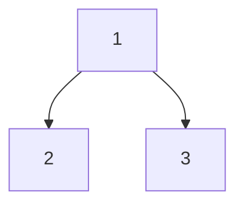

# 从消息传递到 GCN：理解图卷积的本质

图神经网络的核心是**消息传递**（Message Passing）：节点通过边与邻居交换信息，逐层更新自己的表示。GCN（Graph Convolutional Network）是最经典的实现之一，但它的公式初看并不直观。本节将从最简单的聚合方式开始，逐步推导到 GCN 的完整形式。

---

### 一、最简单的邻域聚合

最直接的想法是对邻居特征取平均：

$$
h_v^{(k+1)} = \sigma\left(W \sum_{u \in \mathcal{N}(v)} \frac{h_u^{(k)}}{|\mathcal{N}(v)|}\right)
$$

其中：

- $\mathcal{N}(v)$ 是节点 $v$ 的邻居集合
- $W$ 是可学习的权重矩阵
- $\sigma$ 是激活函数（如 ReLU）

**矩阵形式**：对所有节点统一计算

$$
H^{(k+1)} = \sigma(D^{-1} A H^{(k)} W)
$$

- $A$：邻接矩阵（$A_{ij} = 1$ 表示节点 $i$ 和 $j$ 有边）
- $D$：度矩阵（对角矩阵，$D_{ii} = d_i$ 是节点 $i$ 的度数）
- $D^{-1} A$：归一化邻接矩阵（每行求和为 1）

**问题**：这个公式**忽略了节点自己的特征**。

---

### 二、加入自环（Self-loop）

为了让节点保留自己的信息，给每个节点添加一条指向自己的边：

$$
\tilde{A} = A + I
$$

其中 $I$ 是单位矩阵。现在更新规则变为：

$$
H^{(k+1)} = \sigma(\tilde{D}^{-1} \tilde{A} H^{(k)} W)
$$

$\tilde{D}$ 是加自环后的度矩阵。

**仍存在问题**：度数差异导致的不平衡。

---

### 三、对称归一化

#### 度数不平衡的问题

使用 $\tilde{D}^{-1} \tilde{A}$ 时，不同度数的节点被归一化的程度不同：

| 节点类型                      | 度数 | 归一化系数 | 特征被"稀释"程度 |
| ----------------------------- | ---- | ---------- | ---------------- |
| 高度节点（如社交网络的"大V"） | 1000 | $1/1001$   | 缩小 1000 倍     |
| 低度节点（如普通用户）        | 5    | $1/6$      | 缩小 6 倍        |

这导致高度节点的特征在聚合后被严重削弱。

#### 解决方案：双向归一化

GCN 采用双向归一化：

$$
\hat{A} = \tilde{D}^{-1/2} \tilde{A} \tilde{D}^{-1/2}
$$

展开后，边 $(i, j)$ 的权重为：

$$
\hat{A}_{ij} = \frac{\tilde{A}_{ij}}{\sqrt{\tilde{d}_i \cdot \tilde{d}_j}}
$$

**含义**：

- 边的权重由**两端节点的度数共同决定**
- 度数大的节点之间的边权重小，度数小的节点之间的边权重大
- 保证 $\hat{A}$ 是对称矩阵：$\hat{A}_{ij} = \hat{A}_{ji}$

#### 为什么叫"对称"？

对比两种归一化方式：

**左归一化**（$\tilde{D}^{-1} \tilde{A}$）：只考虑**接收节点**的度数

$$
\text{节点 } i \text{ 收到的消息} = \sum_{j \in \mathcal{N}(i)} \frac{h_j}{\tilde{d}_i}
$$

**对称归一化**（$\tilde{D}^{-1/2} \tilde{A} \tilde{D}^{-1/2}$）：同时考虑**发送和接收节点**的度数

$$
\text{节点 } i \text{ 收到的消息} = \sum_{j \in \mathcal{N}(i)} \frac{h_j}{\sqrt{\tilde{d}_i \cdot \tilde{d}_j}}
$$

---

### 四、GCN 的完整公式

$$
H^{(k+1)} = \sigma\left(\tilde{D}^{-1/2} \tilde{A} \tilde{D}^{-1/2} H^{(k)} W\right)
$$

**计算流程**：

1. **$H^{(k)} W$**：对所有节点特征做线性变换
2. **$\tilde{A} (H^{(k)} W)$**：每个节点收集邻居（包括自己）的变换后特征
3. **$\tilde{D}^{-1/2}$ 左右两侧作用**：用双向度数归一化
4. **$\sigma(\cdot)$**：非线性激活

---

### 五、具体例子：三节点图

考虑一个简单的图：



邻接矩阵：

$$
A = \begin{bmatrix}
0 & 1 & 1 \\
1 & 0 & 0 \\
1 & 0 & 0
\end{bmatrix}
$$

度矩阵：

$$
D = \begin{bmatrix}
2 & 0 & 0 \\
0 & 1 & 0 \\
0 & 0 & 1
\end{bmatrix}
$$

#### 加自环

$$
\tilde{A} = A + I = \begin{bmatrix}
1 & 1 & 1 \\
1 & 1 & 0 \\
1 & 0 & 1
\end{bmatrix}, \quad
\tilde{D} = \begin{bmatrix}
3 & 0 & 0 \\
0 & 2 & 0 \\
0 & 0 & 2
\end{bmatrix}
$$

#### 对称归一化

$$
\tilde{D}^{-1/2} = \begin{bmatrix}
1/\sqrt{3} & 0 & 0 \\
0 & 1/\sqrt{2} & 0 \\
0 & 0 & 1/\sqrt{2}
\end{bmatrix}
$$

$$
\hat{A} = \tilde{D}^{-1/2} \tilde{A} \tilde{D}^{-1/2} = \begin{bmatrix}
1/3 & 1/\sqrt{6} & 1/\sqrt{6} \\
1/\sqrt{6} & 1/2 & 0 \\
1/\sqrt{6} & 0 & 1/2
\end{bmatrix}
$$

**关键观察**：

- 节点 1 的自环权重：$1/3$（度数最大，自环权重最小）
- 节点 2/3 的自环权重：$1/2$（度数较小，自环权重较大）
- 边 $(1, 2)$ 的权重：$1/\sqrt{6}$（由两端度数共同决定）
- $\hat{A}$ 是对称矩阵：$\hat{A}_{12} = \hat{A}_{21}$

---

### 六、"卷积"体现在哪里？

#### 与 CNN 的类比

| 特性         | CNN                         | GCN                           |
| ------------ | --------------------------- | ----------------------------- |
| **输入结构** | 规则网格（图像）            | 任意图结构                    |
| **"窗口"**   | 固定大小（如 $3 \times 3$） | 节点的邻域（大小不固定）      |
| **权重共享** | 同一卷积核用于所有位置      | 同一权重矩阵 $W$ 用于所有节点 |
| **局部性**   | 只看局部像素                | 只看邻居节点                  |

#### 空域视角

CNN 的卷积：

$$
y[i, j] = \sum_{m, n} w[m, n] \cdot x[i+m, j+n]
$$

GCN 的"卷积"：

$$
h_v^{(k+1)} = \sigma\left(\sum_{u \in \mathcal{N}(v) \cup \{v\}} \frac{1}{\sqrt{\tilde{d}_v \tilde{d}_u}} W h_u^{(k)}\right)
$$

**相似点**：

- 都是加权求和邻域信息
- 权重共享（$W$ 对所有节点通用）

**差异点**：

- CNN 的权重取决于**相对位置**
- GCN 的权重取决于**节点度数**

---

### 七、GCN 与消息传递框架的关系

| 框架                 | 公式                                                                                       | 特点                      |
| -------------------- | ------------------------------------------------------------------------------------------ | ------------------------- |
| **消息传递（MPNN）** | $h_v^{(k+1)} = \text{UPDATE}(h_v^{(k)}, \text{AGG}(\{m_{uv} \mid u \in \mathcal{N}(v)\}))$ | 通用框架，灵活但需要循环  |
| **GCN**              | $H^{(k+1)} = \sigma(\hat{A} H^{(k)} W)$                                                    | MPNN 的特例，矩阵运算高效 |

**GCN 在 MPNN 框架中的位置**：

- **消息**：$m_{uv} = \frac{1}{\sqrt{\tilde{d}_u \tilde{d}_v}} h_u^{(k)}$
- **聚合**：$\text{AGG} = \sum$（求和）
- **更新**：$\text{UPDATE}(h_v, a_v) = \sigma(W(h_v + a_v))$

**优势**：

- 用稀疏矩阵乘法一次性计算所有节点
- GPU 加速友好
- 理论性质清晰（谱图理论支撑）

---

### 八、实现对比

#### MPNN 风格（逐节点循环）

```python
for v in nodes:
    messages = [h[v] / sqrt(degree[v]**2)]  # 自环
    for u in neighbors(v):
        weight = 1 / sqrt(degree[v] * degree[u])
        messages.append(weight * h[u])
    h_new[v] = relu(W @ sum(messages))
```

#### GCN 风格（矩阵运算）

```python
# 预计算归一化邻接矩阵
A_tilde = A + I
D_tilde = diag(sum(A_tilde, axis=1))
D_inv_sqrt = D_tilde ** (-0.5)
A_hat = D_inv_sqrt @ A_tilde @ D_inv_sqrt

# 前向传播
H_new = relu(A_hat @ H @ W)
```

**效率对比**：在 10,000 节点的图上，矩阵运算比循环快 10-100 倍。

---

### 九、GCN 的局限性

| 问题               | 表现                     | 改进方法                     |
| ------------------ | ------------------------ | ---------------------------- |
| **Over-smoothing** | 层数多时节点表示趋同     | 残差连接（ResGCN）、跳跃连接 |
| **固定权重**       | 所有邻居权重只由度数决定 | 注意力机制（GAT）            |
| **全图计算**       | 大图内存占用高           | 邻域采样（GraphSAGE）        |
| **表达能力**       | 无法区分某些图结构       | 高阶 GNN（GIN）              |

---

### 十、小结

**GCN 的三个关键设计**：

1. **自环**（$\tilde{A} = A + I$）：保留节点自身信息
2. **对称归一化**（$\tilde{D}^{-1/2} \tilde{A} \tilde{D}^{-1/2}$）：平衡不同度数节点
3. **矩阵运算**：高效计算所有节点

**核心公式**：

$$
H^{(k+1)} = \sigma\left(\tilde{D}^{-1/2} \tilde{A} \tilde{D}^{-1/2} H^{(k)} W\right)
$$

**本质**：图上的"卷积" = 对称归一化的邻域加权平均 + 线性变换 + 非线性激活。
