# 图神经网络（GNN）完全教程

## 一、引言：为什么需要图神经网络？

在深度学习领域，卷积神经网络（CNN）擅长处理**欧几里得结构数据**（如图像、视频），循环神经网络（RNN）擅长处理**序列数据**（如文本、语音）。但现实世界中存在大量**非欧几里得结构数据**：

- 社交网络（用户之间的关系）
- 分子结构（原子之间的化学键）
- 知识图谱（实体之间的语义关系）
- 交通网络（路口与道路的连接）
- 推荐系统（用户-物品交互图）

这些数据天然以**图（Graph）**的形式存在，传统神经网络难以直接处理。图神经网络（Graph Neural Networks, GNN）应运而生，专门用于学习图结构数据的表示。

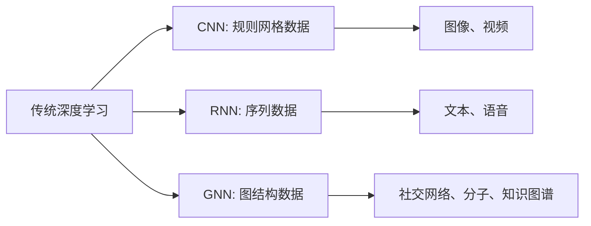

---

## 二、图的基础概念

### 2.1 图的定义

一个图 $G = (V, E)$ 由以下组成：

- **节点集合** $V = \{v_1, v_2, ..., v_n\}$：表示实体
- **边集合** $E \subseteq V \times V$：表示节点之间的关系
- **邻接矩阵** $A \in \{0,1\}^{n \times n}$：$A_{ij} = 1$ 表示节点 $v_i$ 和 $v_j$ 之间存在边
- **节点特征矩阵** $X \in \mathbb{R}^{n \times d}$：每个节点有 $d$ 维特征向量

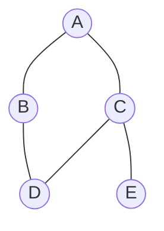

上图对应的邻接矩阵：

$$
A = \begin{bmatrix}
0 & 1 & 1 & 0 & 0 \\
1 & 0 & 0 & 1 & 0 \\
1 & 0 & 0 & 1 & 1 \\
0 & 1 & 1 & 0 & 0 \\
0 & 0 & 1 & 0 & 0
\end{bmatrix}
$$

### 2.2 图的类型

- **有向图 vs 无向图**：边是否有方向
- **同质图 vs 异质图**：节点/边类型是否单一
- **静态图 vs 动态图**：结构是否随时间变化
- **属性图**：节点和边都带有特征

---

## 三、GNN 的核心思想：消息传递

GNN 的本质是通过**迭代地聚合邻居信息**来更新节点的表示。这个过程称为**消息传递（Message Passing）**。

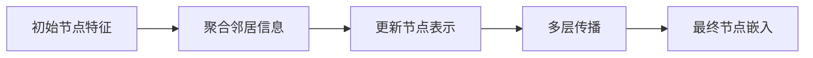

### 3.1 消息传递框架

在第 $k$ 层，节点 $v$ 的表示更新分为三步：

1. **消息生成**：邻居节点生成消息

$$
m_{u \to v}^{(k)} = \text{MSG}^{(k)}(h_u^{(k-1)}, h_v^{(k-1)}, e_{uv})
$$

2. **消息聚合**：聚合所有邻居的消息

$$
m_v^{(k)} = \text{AGG}^{(k)}(\{m_{u \to v}^{(k)} : u \in \mathcal{N}(v)\})
$$

3. **节点更新**：结合自身特征和聚合消息

$$
h_v^{(k)} = \text{UPDATE}^{(k)}(h_v^{(k-1)}, m_v^{(k)})
$$

其中：

- $h_v^{(k)}$ 是节点 $v$ 在第 $k$ 层的表示
- $\mathcal{N}(v)$ 是节点 $v$ 的邻居集合
- $e_{uv}$ 是边特征（可选）

> 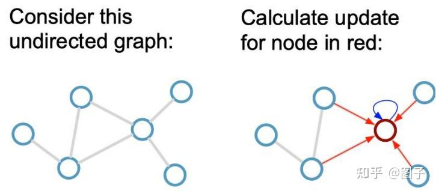
> GNN消息传递示意图

---

## 四、经典 GNN 架构

本章介绍图神经网络的核心架构。我们首先介绍 **MPNN（消息传递神经网络）** 作为统一框架，然后展示 GCN、GAT、GraphSAGE 等经典模型如何在这个框架下实现。

[理解Graph Neural Networks 消息传递机制——多篇论文图神经网络消息传递框架对比 - 知乎](https://zhuanlan.zhihu.com/p/352510643)

[消息传递神经网络（MPNN）内容及代码实践-CSDN博客](https://blog.csdn.net/weixin_44809488/article/details/124737310)

### 4.1 消息传递神经网络（MPNN）：统一框架

[Gilmer et al. (2017)](https://proceedings.mlr.press/v70/gilmer17a) 提出的 **MPNN** 是理解所有 GNN 的理论基础。它将图神经网络抽象为**消息传递过程**，几乎所有主流 GNN 都可以看作 MPNN 的特例。

> 论文[Gilmer et al. (2017), Neural Message Passing for Quantum Chemistry](https://proceedings.mlr.press/v70/gilmer17a)

#### 4.1.1 MPNN 的核心思想

MPNN 将节点表示的更新分解为三个可组合的函数：

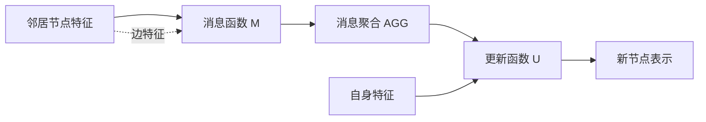

#### 4.1.2 MPNN 的数学定义

在第 $k$ 层，每个节点 $v$ 的更新包含两步：

**步骤 1：消息传递与聚合**

$$
m_v^{(k+1)} = \text{AGG}^{(k+1)}\left(\{M^{(k+1)}(h_v^{(k)}, h_u^{(k)}, e_{vu}) : u \in \mathcal{N}(v)\}\right)
$$

**步骤 2：节点状态更新**

$$
h_v^{(k+1)} = U^{(k+1)}(h_v^{(k)}, m_v^{(k+1)})
$$

其中：

- $M^{(k+1)}$ 是**消息函数**：定义邻居如何生成消息
- $\text{AGG}^{(k+1)}$ 是**聚合函数**：组合所有邻居消息（必须置换不变）
- $U^{(k+1)}$ 是**更新函数**：结合自身特征和聚合消息
- $e_{vu}$ 是边特征（可选）

**图级任务的 Readout**：

$$
\hat{y} = R(\{h_v^{(K)} | v \in G\})
$$

#### 4.1.3 MPNN 的三大组件详解

**（1）消息函数（Message Function）**

定义邻居 $u$ 向节点 $v$ 发送的消息：

$$
m_{u \to v} = M(h_u, h_v, e_{uv})
$$

常见设计：

- **简单线性**：$M(h_u, h_v, e_{uv}) = W h_u$
- **边条件**：$M(h_u, h_v, e_{uv}) = W_{e_{uv}} h_u$（不同边类型使用不同权重）
- **神经网络**：$M(h_u, h_v, e_{uv}) = \text{MLP}([h_u \| h_v \| e_{uv}])$

**（2）聚合函数（Aggregation Function）**

组合所有邻居消息，**必须是置换不变的**（因为图中邻居没有固定顺序）：

$$
m_v = \text{AGG}(\{m_{u \to v} : u \in \mathcal{N}(v)\})
$$

常见选择：

- **求和**：$\text{AGG} = \sum_{u} m_u$（最常用，保持信息完整）
- **平均**：$\text{AGG} = \frac{1}{|\mathcal{N}(v)|} \sum_{u} m_u$（归一化，避免度数影响）
- **最大值**：$\text{AGG} = \max_{u} m_u$（突出最显著特征）
- **注意力加权**：$\text{AGG} = \sum_{u} \alpha_u m_u$（动态权重）

**（3）更新函数（Update Function）**

结合节点自身信息和聚合消息：

$$
h_v^{(k+1)} = U(h_v^{(k)}, m_v^{(k+1)})
$$

常见设计：

- **简单加法**：$U(h_v, m_v) = h_v + m_v$
- **MLP**：$U(h_v, m_v) = \text{MLP}([h_v \| m_v])$
- **GRU 门控**：$U(h_v, m_v) = \text{GRU}(m_v, h_v)$（类似 RNN，保留长期信息）

#### 4.1.4 MPNN 的通用实现

```python
import torch
import torch.nn as nn

class MPNNLayer(nn.Module):
    """通用消息传递层"""
    def __init__(self, node_dim, edge_dim, hidden_dim):
        super().__init__()
        # 消息函数：神经网络
        self.message_mlp = nn.Sequential(
            nn.Linear(node_dim * 2 + edge_dim, hidden_dim),
            nn.ReLU(),
            nn.Linear(hidden_dim, node_dim)
        )
        # 更新函数：GRU
        self.update_gru = nn.GRUCell(node_dim, node_dim)

    def forward(self, x, edge_index, edge_attr):
        # x: [N, node_dim] 节点特征
        # edge_index: [2, E] 边索引 [source, target]
        # edge_attr: [E, edge_dim] 边特征

        row, col = edge_index  # source, target

        # 1. 消息生成
        messages = self.message_mlp(
            torch.cat([x[row], x[col], edge_attr], dim=-1)
        )  # [E, node_dim]

        # 2. 消息聚合（对每个目标节点求和）
        num_nodes = x.size(0)
        aggr_messages = torch.zeros_like(x)
        aggr_messages.index_add_(0, col, messages)

        # 3. 节点更新
        x_new = self.update_gru(aggr_messages, x)

        return x_new
```

#### 4.1.5 MPNN 的 Readout 函数

对于图级任务，需要将所有节点表示汇总为单一图表示：

$$
h_G = R(\{h_v^{(K)} : v \in G\})
$$

**基础 Readout**：

- **全局求和**：$h_G = \sum_{v \in V} h_v$
- **全局平均**：$h_G = \frac{1}{|V|} \sum_{v \in V} h_v$
- **全局最大**：$h_G = \max_{v \in V} h_v$

**高级 Readout**：

**Set2Set**（最强大）：
使用 LSTM 和注意力机制迭代读取节点集合：

$$
q_t^* = \text{LSTM}(q_{t-1}^*)
$$

$$
e_{v,t} = f(h_v, q_t^*)
$$

$$
a_{v,t} = \frac{\exp(e_{v,t})}{\sum_{v' \in V} \exp(e_{v',t})}
$$

$$
r_t = \sum_{v \in V} a_{v,t} h_v
$$

$$
q_t = [q_t^* \| r_t]
$$

经过 $T$ 步后，$q_T$ 即为图表示。

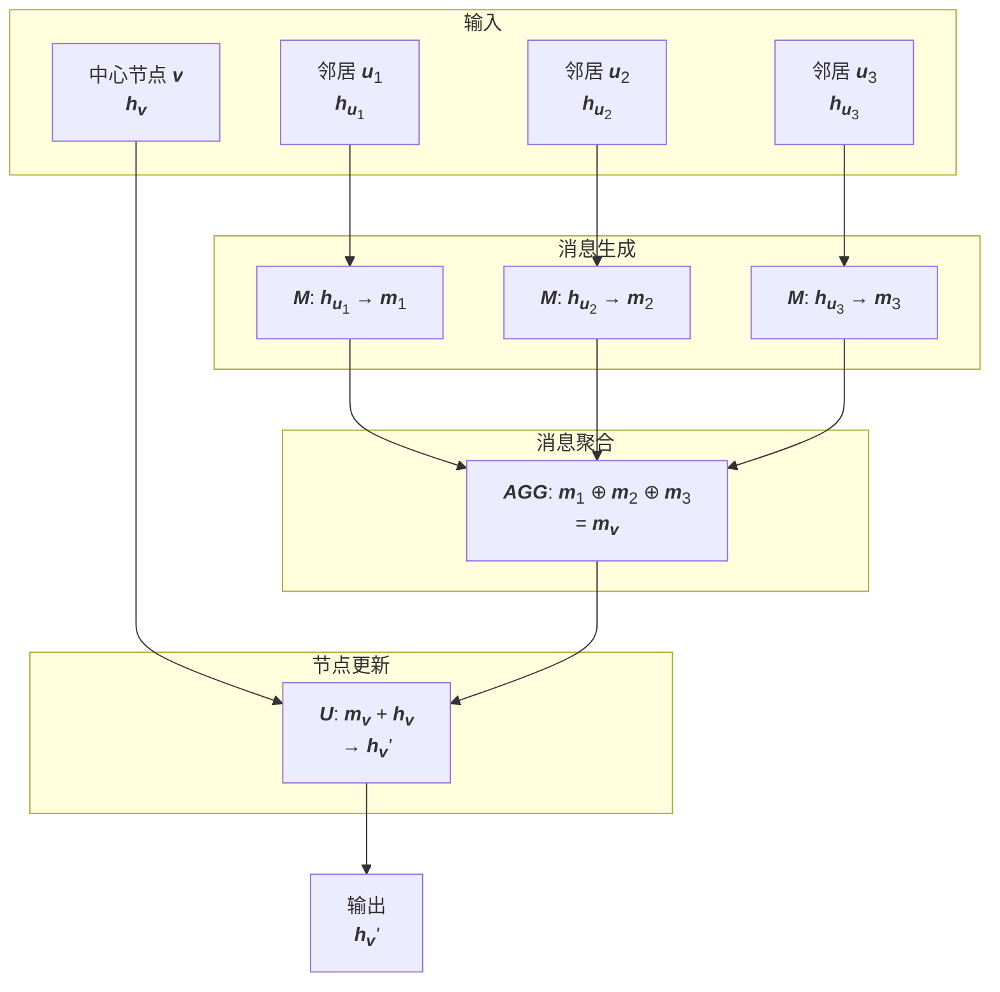

### 4.2 图卷积网络（GCN）作为 MPNN

[Kipf & Welling (2017)](https://arxiv.org/abs/1609.02907) 提出的 **GCN** 是最经典的 GNN 模型，它是 MPNN 的一个简洁特例。

#### 4.2.1 GCN 的矩阵形式

$$
H^{(k+1)} = \sigma(\tilde{D}^{-\frac{1}{2}} \tilde{A} \tilde{D}^{-\frac{1}{2}} H^{(k)} W^{(k)})
$$

其中：

- $\tilde{A} = A + I$（添加自环）
- $\tilde{D}$ 是 $\tilde{A}$ 的度矩阵：$\tilde{D}_{ii} = \sum_j \tilde{A}_{ij}$
- $W^{(k)}$ 是可学习权重矩阵
- $\sigma$ 是激活函数（如 ReLU）

#### 4.2.2 GCN 作为 MPNN 的实例

对于单个节点 $v$，GCN 可以写成 MPNN 形式：

**消息函数**：

$$
M(h_u, h_v, e_{uv}) = \frac{1}{\sqrt{d_u d_v}} W h_u
$$

**聚合函数**：

$$
m_v = \sum_{u \in \mathcal{N}(v) \cup \{v\}} M(h_u, h_v, e_{uv})
$$

**更新函数**：

$$
h_v^{(k+1)} = \sigma(m_v)
$$

**关键设计选择**：

- 使用**对称归一化** $\frac{1}{\sqrt{d_u d_v}}$ 避免大度节点主导
- 添加**自环**保留节点自身信息
- 所有邻居**共享权重** $W$
- 聚合函数是**求和**（线性）

> 更详细的介绍参考：[GCN 详解](GCN详解.md)

#### 4.2.3 GCN 的代码实现

```python
import torch
import torch.nn as nn

class GCNLayer(nn.Module):
    def __init__(self, in_features, out_features):
        super().__init__()
        self.linear = nn.Linear(in_features, out_features)

    def forward(self, X, A_norm):
        # X: [N, in_features]
        # A_norm: 对称归一化邻接矩阵 D^{-1/2} A D^{-1/2}
        return torch.relu(A_norm @ self.linear(X))

# 预处理：计算归一化邻接矩阵
def normalize_adjacency(A):
    """计算 D^{-1/2} (A + I) D^{-1/2}"""
    A_tilde = A + torch.eye(A.size(0))
    D_tilde = torch.diag(A_tilde.sum(dim=1))
    D_inv_sqrt = torch.pow(D_tilde, -0.5)
    D_inv_sqrt[torch.isinf(D_inv_sqrt)] = 0.
    return D_inv_sqrt @ A_tilde @ D_inv_sqrt
```

**GCN 的优缺点**：

✅ **优点**：

- 简单高效，易于实现
- 理论基础扎实（谱图理论）
- 适合半监督学习

❌ **缺点**：

- 所有邻居权重相同（无法自适应）
- 需要完整邻接矩阵（不适合大规模图）
- 仅适用于无向图

### 4.3 图注意力网络（GAT）作为 MPNN

[Veličković et al. (2018)](https://arxiv.org/abs/1710.10903) 提出的 **GAT** 通过**注意力机制**动态学习邻居的重要性。

#### 4.3.1 GAT 的注意力机制

**步骤 1：计算注意力系数（未归一化）**

$$
e_{vu} = \text{LeakyReLU}(a^T [W h_v \| W h_u])
$$

**步骤 2：归一化注意力系数**

$$
\alpha_{vu} = \frac{\exp(e_{vu})}{\sum_{k \in \mathcal{N}(v)} \exp(e_{vk})}
$$

**步骤 3：加权聚合邻居特征**

$$
h_v' = \sigma\left(\sum_{u \in \mathcal{N}(v)} \alpha_{vu} W h_u\right)
$$

#### 4.3.2 GAT 作为 MPNN 的实例

**消息函数**：

$$
M(h_u, h_v, e_{uv}) = \alpha_{vu} \cdot W h_u
$$

其中 $\alpha_{vu}$ 是数据依赖的注意力权重。

**聚合函数**：

$$
m_v = \sum_{u \in \mathcal{N}(v)} M(h_u, h_v, e_{uv})
$$

**更新函数**：

$$
h_v' = \sigma(m_v)
$$

**关键创新**：

- **自适应权重**：不同邻居有不同重要性
- **无需归一化**：注意力机制自动处理度数差异
- **可处理有向图**：$\alpha_{vu} \neq \alpha_{uv}$

#### 4.3.3 多头注意力（Multi-Head Attention）

GAT 使用 $K$ 个独立的注意力头，然后拼接或平均：

**拼接版本**（中间层）：

$$
h_v' = \|_{k=1}^K \sigma\left(\sum_{u \in \mathcal{N}(v)} \alpha_{vu}^k W^k h_u\right)
$$

**平均版本**（输出层）：

$$
h_v' = \sigma\left(\frac{1}{K} \sum_{k=1}^K \sum_{u \in \mathcal{N}(v)} \alpha_{vu}^k W^k h_u\right)
$$

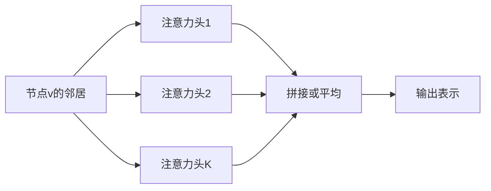

#### 4.3.4 GAT 的代码实现

```python
import torch
import torch.nn as nn
import torch.nn.functional as F

class GATLayer(nn.Module):
    def __init__(self, in_features, out_features, num_heads=8):
        super().__init__()
        self.num_heads = num_heads
        self.out_features = out_features

        # 每个头的线性变换
        self.W = nn.Linear(in_features, out_features * num_heads)
        # 注意力参数
        self.a = nn.Parameter(torch.zeros(1, num_heads, 2 * out_features))
        nn.init.xavier_uniform_(self.a)

    def forward(self, x, edge_index):
        # x: [N, in_features]
        # edge_index: [2, E]

        # 线性变换
        h = self.W(x).view(-1, self.num_heads, self.out_features)  # [N, heads, out]

        row, col = edge_index

        # 计算注意力系数
        h_concat = torch.cat([h[row], h[col]], dim=-1)  # [E, heads, 2*out]
        e = (h_concat * self.a).sum(dim=-1)  # [E, heads]
        e = F.leaky_relu(e, 0.2)

        # Softmax 归一化（对每个节点的邻居）
        alpha = self.softmax_per_node(e, col, x.size(0))  # [E, heads]

        # 加权聚合
        out = torch.zeros(x.size(0), self.num_heads, self.out_features).to(x.device)
        messages = alpha.unsqueeze(-1) * h[row]  # [E, heads, out]
        out.index_add_(0, col, messages)

        return out.view(-1, self.num_heads * self.out_features)
```

**GAT vs GCN**：

| 特性       | GCN              | GAT                  |
| ---------- | ---------------- | -------------------- |
| 邻居权重   | 固定（度归一化） | 自适应（注意力）     |
| 计算复杂度 | 较低             | 较高（多头）         |
| 图类型     | 仅无向图         | 有向/无向均可        |
| 可解释性   | 较弱             | 较强（可视化注意力） |

### 4.4 GraphSAGE 作为 MPNN

[Hamilton et al. (2017)](https://arxiv.org/abs/1706.02216) 提出的 **GraphSAGE** 通过**邻居采样**实现大规模图的高效训练。

#### 4.4.1 GraphSAGE 的核心思想

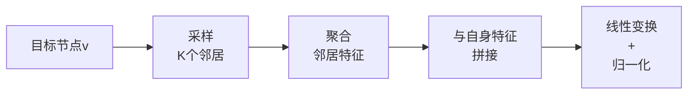

#### 4.4.2 GraphSAGE 的数学形式

$$
h_{\mathcal{N}(v)}^{(k)} = \text{AGG}^{(k)}(\{h_u^{(k-1)}, u \in \mathcal{N}_S(v)\})
$$

$$
h_v^{(k)} = \sigma\left(W^{(k)} \cdot [h_v^{(k-1)} \| h_{\mathcal{N}(v)}^{(k)}]\right)
$$

$$
h_v^{(k)} \leftarrow \frac{h_v^{(k)}}{\|h_v^{(k)}\|_2}
$$

其中 $\mathcal{N}_S(v)$ 是采样的邻居子集（固定大小 $K$）。

#### 4.4.3 GraphSAGE 作为 MPNN 的实例

**消息函数**：

$$
M(h_u) = h_u
$$

（最简单的消息：直接传递特征）

**聚合函数**（多种选择）：

**1. Mean Aggregator**：

$$
\text{AGG} = \frac{1}{|\mathcal{N}_S(v)|} \sum_{u \in \mathcal{N}_S(v)} h_u
$$

**2. LSTM Aggregator**：

$$
\text{AGG} = \text{LSTM}(\text{shuffle}(\{h_u, u \in \mathcal{N}_S(v)\}))
$$

**3. Pooling Aggregator**：

$$
\text{AGG} = \max(\{\sigma(W_{\text{pool}} h_u + b), u \in \mathcal{N}_S(v)\})
$$

**更新函数**：

$$
h_v^{(k)} = \sigma(W [h_v^{(k-1)} \| \text{AGG}]) \quad \text{然后 L2 归一化}
$$

#### 4.4.4 邻居采样策略

**固定大小采样**：

- 第 1 层：采样 25 个邻居
- 第 2 层：每个邻居再采样 10 个二阶邻居
- 总计算节点数：$1 + 25 + 25 \times 10 = 276$

**优势**：

- 计算复杂度固定，与图规模无关
- 支持 mini-batch 训练
- 支持 **inductive learning**（可泛化到训练时未见过的节点）

#### 4.4.5 GraphSAGE 的代码实现

```python
import torch
import torch.nn as nn
import random

class SAGELayer(nn.Module):
    def __init__(self, in_features, out_features, aggregator='mean'):
        super().__init__()
        self.aggregator = aggregator

        if aggregator == 'mean':
            self.W = nn.Linear(in_features * 2, out_features)
        elif aggregator == 'pool':
            self.pool_mlp = nn.Linear(in_features, in_features)
            self.W = nn.Linear(in_features * 2, out_features)

    def forward(self, x, edge_index, num_samples=25):
        # 采样邻居
        sampled_neighbors = self.sample_neighbors(edge_index, num_samples)

        # 聚合邻居特征
        if self.aggregator == 'mean':
            aggr = self.mean_aggregator(x, sampled_neighbors)
        elif self.aggregator == 'pool':
            aggr = self.pool_aggregator(x, sampled_neighbors)

        # 拼接自身特征和聚合特征
        out = self.W(torch.cat([x, aggr], dim=-1))

        # L2 归一化
        return F.normalize(out, p=2, dim=-1)

    def sample_neighbors(self, edge_index, k):
        """为每个节点采样固定数量的邻居"""
        # 简化实现，实际应用需更高效的采样
        pass
```

**GraphSAGE 的应用场景**：

- Pinterest（30 亿节点图的推荐系统）
- 动态图（新节点不断加入）
- 大规模知识图谱

### 4.5 四种架构的 MPNN 视角对比

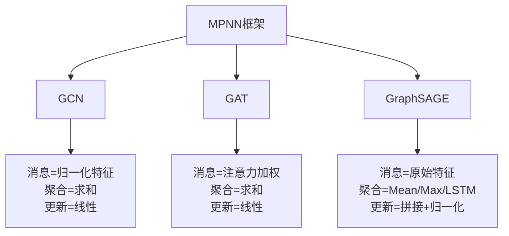

| 模型          | 消息函数 $M$                     | 聚合函数 AGG  | 更新函数 $U$                    | 适用场景         |
| ------------- | -------------------------------- | ------------- | ------------------------------- | ---------------- |
| **MPNN**      | 可自定义                         | 可自定义      | 可自定义                        | 理论框架         |
| **GCN**       | $\frac{1}{\sqrt{d_u d_v}} W h_u$ | $\sum$        | $\sigma(\cdot)$                 | 小图、半监督     |
| **GAT**       | $\alpha_{vu} W h_u$              | $\sum$        | $\sigma(\cdot)$                 | 需要可解释性     |
| **GraphSAGE** | $h_u$                            | Mean/Max/LSTM | $\sigma(W [h_v \| \text{AGG}])$ | 大规模图、动态图 |

#### 4.5.1 如何选择 GNN 模型？

**决策树**：

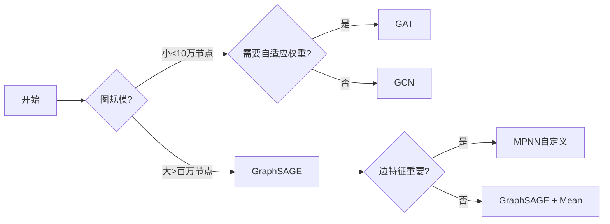

**实践建议**：

1. **先试 GCN**：简单基线，快速验证任务可行性
2. **需要可解释性**：使用 GAT，可视化注意力权重
3. **大规模生产**：使用 GraphSAGE，支持分布式训练
4. **特殊领域**（如分子图）：基于 MPNN 自定义消息函数

### 4.6 MPNN 的理论局限性

#### 4.6.1 什么是 Weisfeiler-Lehman 测试？

在理解 MPNN 的局限性之前，我们需要先了解 **WL 图同构测试**。

**图同构问题**：给定两个图 $G$ 和 $G'$，判断它们是否"本质上相同"（即只是节点标签不同，但结构完全一致）。

**1-WL 测试的算法步骤**：

1. 初始化：给每个节点分配相同的初始颜色（标签）
2. 迭代着色：每个节点将自身颜色 + 所有邻居的颜色集合 → 哈希 → 新颜色
3. 稳定判断：重复直到颜色不再变化
4. 比较：若两图的颜色直方图不同 → 一定非同构；若相同 → **不能确定**同构

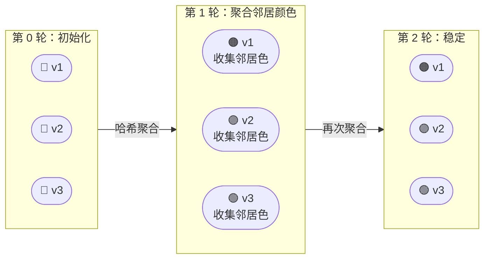

**关键结论**：

$$\text{MPNN 的表达能力} \equiv \text{1-WL 测试}$$

即：

- 如果 1-WL 测试**能区分**两个图 → MPNN 也能给出不同的图表示
- 如果 1-WL 测试**无法区分**两个图 → MPNN **一定也无法区分**

#### 4.6.2 经典反例详解

**为什么下面两个图让 MPNN "犯难"？**

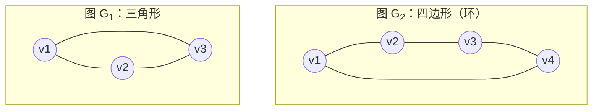

**逐轮分析 1-WL 着色过程**：

| 轮次    | $G_1$（三角形）每个节点的状态                 | $G_2$（四边形）每个节点的状态                 |
| ------- | --------------------------------------------- | --------------------------------------------- |
| 第 0 轮 | 所有节点：颜色 = $c_0$，度 = 2                | 所有节点：颜色 = $c_0$，度 = 2                |
| 第 1 轮 | 每个节点收集到 2 个 $c_0$ 邻居 → 新颜色 $c_1$ | 每个节点收集到 2 个 $c_0$ 邻居 → 新颜色 $c_1$ |
| 第 2 轮 | 每个节点收集到 2 个 $c_1$ 邻居 → 新颜色 $c_2$ | 每个节点收集到 2 个 $c_1$ 邻居 → 新颜色 $c_2$ |
| ...     | **永远相同**                                  | **永远相同**                                  |

**根本原因**：这两个图都是**正则图**（每个节点度数相同），MPNN 在聚合邻居信息时，每个节点"看到"的邻域多重集永远一样。MPNN 无法感知**三角形中存在环**这一结构信息。

#### 4.6.3 局限性的本质

MPNN 的信息传递存在以下结构性盲区：

**① 无法感知环（Cycle）结构**

节点只知道"我有几个邻居"，不知道"我的邻居们之间是否相连"。

$$\text{节点} v \text{ 的感受野} = \text{以} v \text{ 为根的} k\text{-hop 子树}$$

两个不同的图可能产生完全相同的子树展开结果：

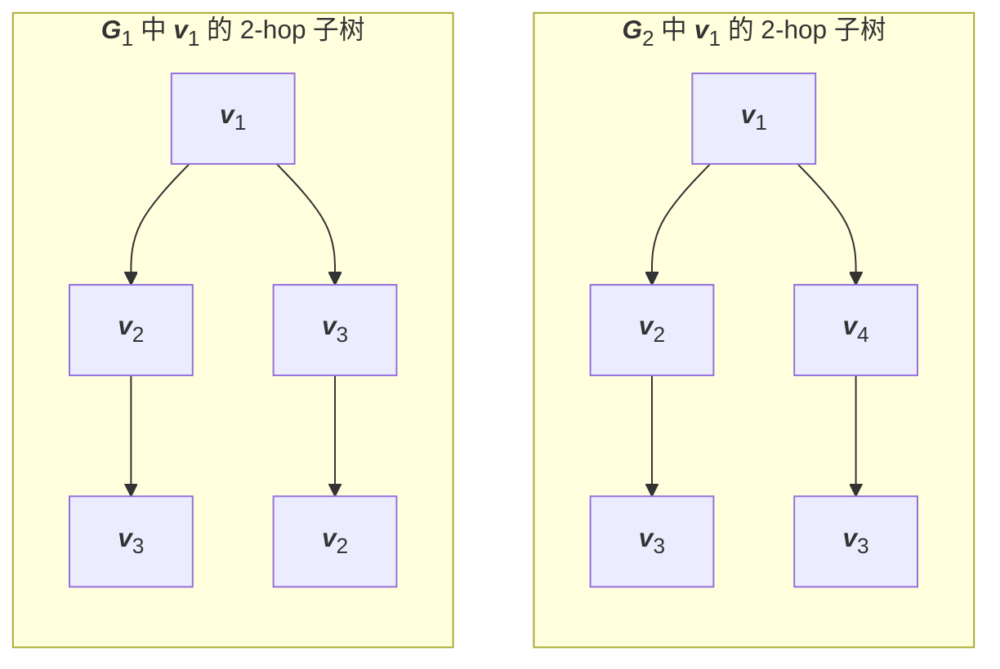

**② 无法区分节点的全局位置**

两个在全局结构中处于完全不同位置的节点，如果它们的局部邻域结构一样，MPNN 会给出相同的表示。

**③ 计数子结构的能力受限**

MPNN 无法准确计数图中三角形、环、路径等子结构的数量，而这些特征在化学分子、社交网络分析中至关重要。

#### 4.6.4 突破方向详解

**方向一：高阶 GNN（Higher-Order GNN）**

将节点替换为**节点元组**作为计算单元：

$$\text{标准 MPNN：} \quad h_v^{(k)} = U\left(h_v^{(k-1)},\, \text{AGG}_{u \in \mathcal{N}(v)} M(h_u^{(k-1)})\right)$$

$$\text{k-WL GNN：} \quad h_{(v_1,...,v_k)}^{(t)} = U\left(h_{(v_1,...,v_k)}^{(t-1)},\, \text{AGG}_{\text{邻居元组}} M(\cdot)\right)$$

- **优点**：理论表达能力突破 1-WL，可区分更多图结构
- **缺点**：计算复杂度从 $O(n)$ 暴涨到 $O(n^k)$，实际不可用

**方向二：位置/结构编码（Positional & Structural Encoding）**

给每个节点注入**额外的结构特征**，打破对称性：

| 编码类型         | 具体方法                                | 捕获的信息           |
| ---------------- | --------------------------------------- | -------------------- |
| 拉普拉斯特征向量 | $L = D - A$，取前 $k$ 个特征向量        | 全局位置信息         |
| 随机游走编码     | $\text{RW}_{ii}^{(k)} = (A^k)_{ii}/d_i$ | 节点到自身的返回概率 |
| 中心性编码       | 度中心性、介数中心性                    | 节点在图中的重要性   |
| 环计数编码       | 节点参与的三角形/环数量                 | 局部拓扑结构         |

以**拉普拉斯位置编码**为例：

$$\tilde{h}_v^{(0)} = h_v^{(0)} \,\Vert\, \phi_v$$

其中 $\phi_v \in \mathbb{R}^k$ 是图拉普拉斯矩阵的前 $k$ 个特征向量对应 $v$ 节点的分量。

**方向三：随机特征（Random Features）**

在每次前向传播时，为每个节点随机采样一个唯一 ID：

$$h_v^{(0)} = h_v^{(0)} \,\Vert\, z_v, \quad z_v \sim \mathcal{N}(0, I)$$

- **优点**：极简，几乎零代价打破对称性
- **缺点**：每次推理结果不稳定，需要多次采样取平均

**方向四：Graph Transformer**

引入**全局注意力机制**，让任意两个节点都能直接通信，不再受限于局部邻域：

$$\text{Attention}(v, u) = \text{softmax}\left(\frac{(W_Q h_v)(W_K h_u)^T}{\sqrt{d}}\right)$$

$$h_v^{(k)} = \sum_{u \in V} \text{Attention}(v, u) \cdot W_V h_u$$

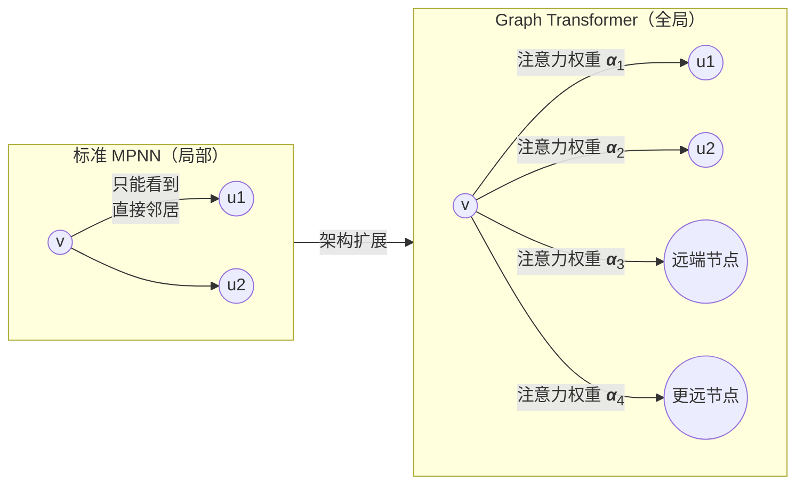

> 拓展：[GAT和Graph Transformer的区别](./GAT和GraphTransformer的区别.md)

#### 4.6.5 各方向能力对比

| 方法              | 表达能力          | 计算复杂度 | 实用性        |
| ----------------- | ----------------- | ---------- | ------------- |
| 标准 MPNN         | 1-WL              | $O(n + m)$ | ✅ 高         |
| 3-WL GNN          | 3-WL（强于 1-WL） | $O(n^3)$   | ⚠️ 中         |
| 位置编码 + MPNN   | 接近 3-WL         | $O(n + m)$ | ✅ 高         |
| 随机特征          | 理论上全表达      | $O(n + m)$ | ⚠️ 不稳定     |
| Graph Transformer | 超越 1-WL         | $O(n^2)$   | ✅ 中大图适用 |

> **核心启示**：MPNN 的 1-WL 等价性并非"缺陷"，而是一个清晰的**理论边界**。在大多数实际任务中，1-WL 的表达能力已经足够；只有当任务需要感知高阶拓扑结构（如分子环、图对称性）时，才需要引入更强的模型。理解这一局限性，帮助我们在**表达能力、计算效率、实用性**之间做出明智的权衡。

---

## 五、GNN 的三大任务类型

根据预测目标的粒度不同，GNN 任务可分为三个层次：

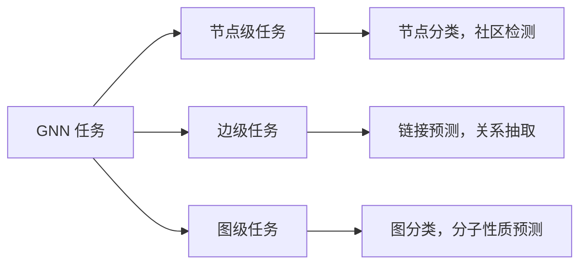

### 5.1 节点级任务（Node-Level Tasks）

**任务定义**：为图中的每个节点预测一个标签或连续值属性。

#### 典型应用

| 领域     | 数据集                | 任务              |
| -------- | --------------------- | ----------------- |
| 学术网络 | Cora、Citeseer        | 论文主题分类      |
| 社交网络 | Facebook、Twitter     | 用户兴趣/职业预测 |
| 生物网络 | PPI（蛋白质相互作用） | 蛋白质功能预测    |

#### 数学形式

经过 $K$ 层 GNN 后，每个节点 $v$ 得到表示 $h_v^{(K)}$，通过分类器预测标签：

$$
\hat{y}_v = \text{softmax}(W h_v^{(K)} + b)
$$

训练时使用**交叉熵损失**，仅在有标签的节点上计算：

$$
\mathcal{L} = -\sum_{v \in V_{\text{train}}} \sum_{c=1}^{C} y_{vc} \log(\hat{y}_{vc})
$$

其中 $V_{\text{train}}$ 是训练节点集合，$C$ 是类别数。

#### 关键特点

- **半监督学习**：通常只有少量节点有标签（如 Cora 数据集只标注 5% 节点）
- **归纳 vs 直推**：
  - 直推（Transductive）：测试节点在训练时就存在于图中
  - 归纳（Inductive）：测试时需要泛化到全新的节点

### 5.2 边级任务（Edge-Level Tasks）

**任务定义**：预测节点对 $(u, v)$ 之间是否存在边，或边的属性。

#### 典型应用

| 任务类型 | 应用场景                          |
| -------- | --------------------------------- |
| 链接预测 | 社交网络好友推荐、知识图谱补全    |
| 关系分类 | 知识图谱中的实体关系抽取          |
| 交互预测 | 药物-靶点相互作用、蛋白质相互作用 |

#### 数学形式

获取节点表示后，通过**成对函数**计算边存在的概率：

**方法一：点积**

$$
\hat{y}_{uv} = \sigma(h_u^T h_v)
$$

**方法二：拼接 + MLP**

$$
\hat{y}_{uv} = \text{MLP}([h_u \,\Vert\, h_v])
$$

其中 $[h_u \,\Vert\, h_v]$ 表示向量拼接。

#### 训练策略

采用**负采样**：对每条正边 $(u, v) \in E$，随机采样 $k$ 条负边 $(u, v') \notin E$，使用二元交叉熵损失：

$$
\mathcal{L} = -\sum_{(u,v) \in E} \log \sigma(h_u^T h_v) - \sum_{(u,v') \notin E} \log(1 - \sigma(h_u^T h_{v'}))
$$

### 5.3 图级任务（Graph-Level Tasks）

**任务定义**：预测整个图的全局属性（如分子毒性、程序是否有漏洞）。

#### 核心挑战

如何将**不同大小**的图统一表示为固定维度的向量？

#### 解决方案：Readout（图池化）

将所有节点表示聚合成单个图级表示：

$$
h_G = \text{READOUT}(\{h_v^{(K)} \mid v \in V\})
$$

**常见 Readout 方法**：

| 方法         | 公式                                                                           | 特点                     |
| ------------ | ------------------------------------------------------------------------------ | ------------------------ |
| 全局平均池化 | $h_G = \frac{1}{\lvert V \rvert} \sum_{v \in V} h_v$                           | 简单，对所有节点一视同仁 |
| 全局最大池化 | $h_G = \max_{v \in V} h_v$（逐维取最大）                                       | 捕获最显著特征           |
| 全局求和池化 | $h_G = \sum_{v \in V} h_v$                                                     | 保留总量信息             |
| 注意力池化   | $h_G = \sum_{v \in V} \alpha_v h_v$，其中 $\alpha_v = \text{softmax}(w^T h_v)$ | 学习节点重要性           |

#### 完整流程

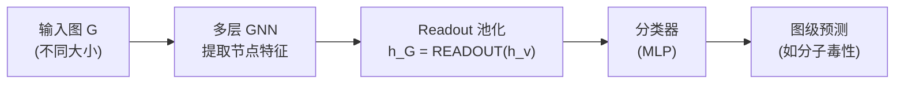

#### 典型应用

| 领域       | 数据集        | 任务                         |
| ---------- | ------------- | ---------------------------- |
| 化学信息学 | MUTAG、QM9    | 分子性质预测（毒性、溶解度） |
| 生物信息学 | PROTEINS      | 蛋白质功能分类               |
| 程序分析   | Devign        | 代码漏洞检测                 |
| 社交网络   | REDDIT-BINARY | 社区类型识别                 |

#### 损失函数

对于分类任务：

$$
\mathcal{L} = -\sum_{i=1}^{N} \sum_{c=1}^{C} y_{ic} \log(\hat{y}_{ic})
$$

其中 $N$ 是图的数量，$C$ 是类别数。

### 三类任务对比

| 维度           | 节点级                     | 边级                                     | 图级                 |
| -------------- | -------------------------- | ---------------------------------------- | -------------------- |
| **预测对象**   | 单个节点                   | 节点对                                   | 整个图               |
| **输出维度**   | $\lvert V \rvert \times C$ | $\lvert V \rvert \times \lvert V \rvert$ | $N \times C$         |
| **典型损失**   | 节点交叉熵                 | 边二元交叉熵                             | 图交叉熵             |
| **关键技术**   | 半监督学习                 | 负采样                                   | 图池化（Readout）    |
| **计算复杂度** | $O(\lvert V \rvert)$       | $O(\lvert V \rvert^2)$                   | $O(\lvert V \rvert)$ |

> **实践建议**：
>
> - 节点任务：注意训练/验证/测试集的划分方式（随机 vs 归纳）
> - 边任务：负样本采样策略直接影响性能（随机 vs 困难负样本）
> - 图任务：Readout 方法的选择取决于任务特性（求和保留总量信息，最大值捕获显著特征）

---

## 六、GNN 的关键技术

### 6.1 过平滑问题（Over-smoothing）

**问题**：堆叠多层 GNN 后，所有节点的表示趋于相同。

**原因**：多次邻居聚合使得节点特征收敛到全局均值。

**解决方案**：

1. **残差连接**：$h_v^{(k+1)} = h_v^{(k)} + \text{GNN}^{(k)}(h_v^{(k)})$
2. **跳跃连接（JK-Net）**：$h_v^{\text{final}} = \text{AGG}(h_v^{(1)}, h_v^{(2)}, ..., h_v^{(K)})$
3. **归一化层**：LayerNorm 或 BatchNorm
4. **限制层数**：通常 2-3 层效果最好

### 6.2 图池化（Graph Pooling）

**目的**：层次化地粗化图结构，类似 CNN 中的池化。

**方法**：

- **DiffPool**：可微分的软分配

$$
S = \text{softmax}(\text{GNN}_{\text{pool}}(A, X))
$$

- **TopK Pooling**：保留 top-k 重要节点

$$
y = \frac{X \cdot p}{\|p\|}, \quad \text{idx} = \text{top-k}(y)
$$

- **SAGPool**：基于自注意力的池化

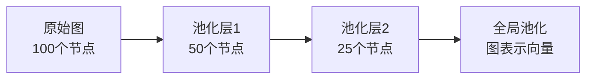

### 6.3 异质图神经网络

**异质图**：包含多种类型的节点和边。

**示例**：学术网络

- 节点类型：论文、作者、会议
- 边类型：撰写、发表、引用

**HAN（异质图注意力网络）**：

1. **节点级注意力**：同一元路径上的邻居聚合
2. **语义级注意力**：不同元路径的重要性

$$
h_v = \sum_{\phi \in \Phi} \beta_{\phi} \cdot h_v^{\phi}
$$

其中 $\Phi$ 是元路径集合（如"作者-论文-作者"）。

---

## 七、训练技巧与实践

### 7.1 数据增强

- **边删除**：随机移除部分边
- **节点特征掩码**：随机遮盖节点特征
- **子图采样**：训练时使用子图

### 7.2 负采样

对于链接预测任务，需要生成负样本：

$$
\mathcal{L} = -\log \sigma(h_u^T h_v) - \mathbb{E}_{v_n \sim P_n(v)} [\log \sigma(-h_u^T h_{v_n})]
$$

### 7.3 归一化技巧

- **特征归一化**：输入特征标准化
- **邻接矩阵归一化**：对称归一化 $D^{-1/2}AD^{-1/2}$
- **层归一化**：每层输出后进行 LayerNorm

```python
# 简化的训练循环
def train_gnn(model, graph, labels, optimizer):
    model.train()
    optimizer.zero_grad()

    # 前向传播
    out = model(graph.x, graph.edge_index)

    # 计算损失（以节点分类为例）
    loss = F.cross_entropy(out[graph.train_mask],
                           labels[graph.train_mask])

    # 反向传播
    loss.backward()
    optimizer.step()

    return loss.item()
```

---

## 八、应用场景与案例

### 8.1 分子性质预测

**问题**：预测化合物的毒性、溶解度、药效

**建模**：

- 节点 = 原子（特征：原子类型、电荷）
- 边 = 化学键（特征：键类型、键长）

**数据集**：

- QM9：13 万个小分子
- ZINC：25 万个药物分子

### 8.2 推荐系统

**问题**：预测用户对物品的偏好

**建模**：

- 节点 = 用户 + 物品
- 边 = 用户-物品交互

**代表模型**：

- **PinSage**（Pinterest）：处理 30 亿节点的图
- **NGCF**：显式建模高阶连接

### 8.3 交通预测

**问题**：预测未来的交通流量

**建模**：

- 节点 = 传感器/路段
- 边 = 空间连接
- 时间维度 = RNN/Transformer

**模型**：时空图神经网络（STGNN）

$$
H^{(t+1)} = \text{GNN}(A, \text{RNN}(H^{(t)}))
$$

### 8.4 知识图谱推理

**任务**：补全三元组 $(h, r, t)$

**方法**：

- **R-GCN**：关系特定的卷积

$$
h_v^{(k+1)} = \sigma\left(\sum_{r \in R} \sum_{u \in \mathcal{N}_v^r} \frac{1}{c_{v,r}} W_r^{(k)} h_u^{(k)}\right)
$$

---

## 九、常用工具与库

### 9.1 PyTorch Geometric (PyG)

> 官方网址：[PyG Documentation — pytorch_geometric documentation](https://pytorch-geometric.readthedocs.io/)  
> github 项目源代码：[pyg-team/pytorch_geometric: Graph Neural Network Library for PyTorch](https://github.com/pyg-team/pytorch_geometric?tab=readme-ov-file)
> 可参考文章：[PyTorch Geometric (PyG) 入门教程_pytorch geometric有向图变无向图-CSDN博客](https://blog.csdn.net/PolarisRisingWar/article/details/117374824)
> 可参考文章：[【GNN2】PyG完成图分类任务，新手入门，保姆级教程 - 知乎](https://zhuanlan.zhihu.com/p/677601315)

```python
import torch
from torch_geometric.nn import GCNConv
from torch_geometric.datasets import Planetoid

# 加载 Cora 数据集
dataset = Planetoid(root='/tmp/Cora', name='Cora')

# 定义 2 层 GCN
class GCN(torch.nn.Module):
    def __init__(self):
        super().__init__()
        self.conv1 = GCNConv(dataset.num_features, 16)
        self.conv2 = GCNConv(16, dataset.num_classes)

    def forward(self, x, edge_index):
        x = self.conv1(x, edge_index).relu()
        x = self.conv2(x, edge_index)
        return x
```

### 9.2 Deep Graph Library (DGL)

> 官方网址：[Deep Graph Library](https://www.dgl.ai/)  
> github 项目源代码：[dmlc/dgl: Python package built to ease deep learning on graph, on top of existing DL frameworks.](https://github.com/dmlc/dgl/)

```python
import dgl
import torch.nn as nn

# 定义消息传递函数
class MyGNN(nn.Module):
    def __init__(self):
        super().__init__()
        self.linear = nn.Linear(in_dim, out_dim)

    def forward(self, g, features):
        g.ndata['h'] = features
        g.update_all(
            message_func=dgl.function.copy_u('h', 'm'),
            reduce_func=dgl.function.mean('m', 'h_neigh')
        )
        return self.linear(g.ndata['h_neigh'])
```

### 9.3 其他工具

- [**NetworkX**](https://networkx.org/)：图数据结构与算法
- [**igraph**](https://igraph.org/)：图数据结构与算法
- [**Spektral**](https://graphneural.network/)：Keras/TensorFlow 的 GNN 库
- [**Jraph**](https://jraph.readthedocs.io/en/latest/)：JAX 的 GNN 库

---

## 十、前沿方向与未来趋势

### 10.1 图 Transformer

结合 Transformer 的全局注意力：

- **Graphormer**：2D 位置编码 + 中心性编码
- **Graph-BERT**：预训练图表示模型

### 10.2 自监督学习

无需标签学习图表示：

- **对比学习**：GraphCL, SimGRACE
- **生成式**：图自编码器（GAE）
- **预测式**：边预测、属性预测

> 可参考文章：[图自编码器-无监督学习 - 知乎](https://zhuanlan.zhihu.com/p/1906762651352146683)

### 10.3 可解释性

**GNNExplainer**：找到对预测最重要的子图

$$
\max_{G_S} \mathbb{E}[y_c | G_S] - H(y_c | G_S)
$$

### 10.4 组合优化

用 GNN 解决 NP-hard 问题：

- 旅行商问题（TSP）
- 图着色
- 电路设计

### 10.5 动态图学习

处理随时间演化的图：

- **EvolveGCN**：RNN 演化 GNN 参数
- **TGAT**：时间注意力机制
- **TGN**：时序图网络

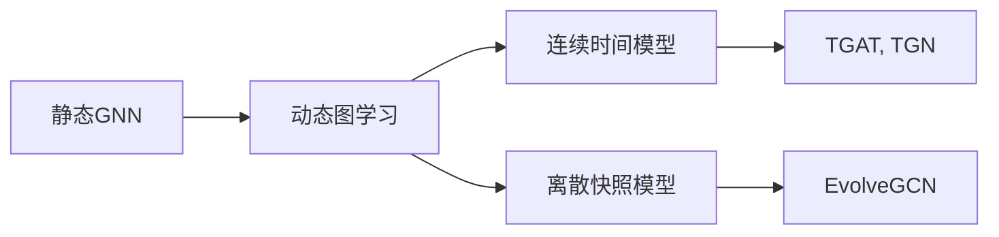

---

## 十一、总结与学习路径

### 核心要点回顾

1. **GNN 本质**：通过消息传递聚合邻居信息
2. **经典模型**：GCN（卷积）、GAT（注意力）、GraphSAGE（采样）
3. **三大任务**：节点、边、图级预测
4. **关键挑战**：过平滑、可扩展性、异质性

### 建议学习路径

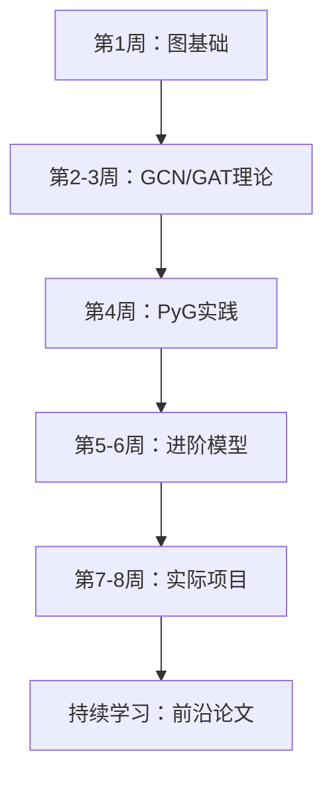

### 推荐资源

- **课程**：
  - Stanford CS224W: Machine Learning with Graphs
  - [Distill.pub 的可视化教程](https://distill.pub/2021/gnn-intro/)

- **论文列表**：
  - [Must-read papers on GNN](https://github.com/thunlp/GNNPapers)

- **数据集**：
  - [Open Graph Benchmark (OGB)](https://ogb.stanford.edu/)
  - [TU Dataset Collection](https://chrsmrrs.github.io/datasets/)

- **竞赛**：
  - KDD Cup（图相关赛道）
  - OGB Leaderboard

---

## 附录

### 数学符号表

| 符号                            | 含义                             |
| ------------------------------- | -------------------------------- |
| $G = (V, E)$                    | 图，包含节点集 $V$ 和边集 $E$    |
| $A \in \mathbb{R}^{n \times n}$ | 邻接矩阵                         |
| $X \in \mathbb{R}^{n \times d}$ | 节点特征矩阵                     |
| $h_v^{(k)}$                     | 节点 $v$ 在第 $k$ 层的表示       |
| $\mathcal{N}(v)$                | 节点 $v$ 的邻居集合              |
| $D$                             | 度矩阵，$D_{ii} = \sum_j A_{ij}$ |
| $W^{(k)}$                       | 第 $k$ 层的可学习权重            |

### 拓展阅读

这篇文章详细介绍了几个GNN的区别：[图神经网络必读的5个基础模型: GCN, GAT, GraphSAGE, GAE, DiffPool.-腾讯云开发者社区-腾讯云](https://cloud.tencent.com/developer/article/2284994)

---

**下一步**：我们将编写配套的 Jupyter Notebook，包含完整可运行的代码示例，覆盖：

- Cora 数据集的节点分类
- Zachary 空手道俱乐部的社区检测
- 分子图的性质预测
- 自定义 GNN 层的实现

如有疑问，欢迎随时提问！ 🚀
