# ResNet 深度残差网络：突破深度学习的瓶颈

> **上传者**：[XYChouMian](https://github.com/XYChouMian)  
> **参考标题**：[Deep Residual Learning for Image Recognition](https://arxiv.org/abs/1512.03385)  
> **论文PDF**：[paper.pdf](paper.pdf)  

***本文可配备 [JupyterHub 代码空间](http://expfluid.bond/jupyterhub)及[讲解文档](resnet框架.md)以供进行代码实践。***

## 引言：深度神经网络的困境

在深度学习的发展历程中，研究者们一度认为网络越深，性能就越好。然而，当网络层数增加到一定程度时，出现了一个令人困惑的现象：**更深的网络反而表现更差**。

这不是过拟合问题——因为训练误差本身就很高。这是一个**优化问题**：梯度在反向传播过程中逐层衰减，导致深层网络难以训练。

2015年，何恺明等人在论文 [Deep Residual Learning for Image Recognition](https://arxiv.org/abs/1512.03385) 中提出的 ResNet（Residual Network）通过一个简洁而深刻的想法解决了这个问题：**与其让网络学习完整的映射，不如让它学习残差**。

> 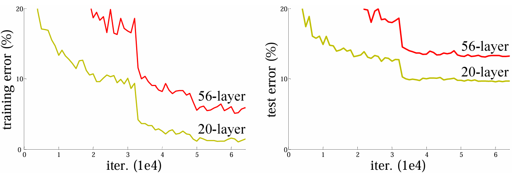
> 图1：20层网络比56层网络训练误差更低，这不是过拟合，而是优化困难

---

## 核心思想：残差学习

### 传统网络 vs 残差网络

假设我们希望网络学习一个映射 $\mathcal{H}(x)$，将输入 $x$ 映射到输出。

**传统网络的做法**：直接让若干层网络拟合 $\mathcal{H}(x)$

**残差网络的做法**：让网络学习残差函数 $\mathcal{F}(x) = \mathcal{H}(x) - x$，然后通过跳跃连接（skip connection）加回输入：

$$\mathcal{H}(x) = \mathcal{F}(x) + x$$

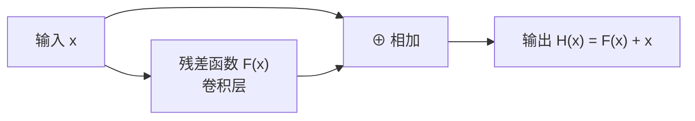

### 为什么残差学习更容易？

考虑一个极端情况：如果最优映射就是恒等映射 $\mathcal{H}(x) = x$（即这几层什么都不做最好），那么：

- **传统网络**需要学习 $\mathcal{H}(x) = x$，这对于多层非线性网络来说并不容易
- **残差网络**只需要学习 $\mathcal{F}(x) = 0$，即把权重推向零，这要简单得多

更一般地，残差学习将问题从"学习完整映射"转化为"学习对恒等映射的修正"，这在数学上更容易优化。

**直观理解**：想象你要学习一个复杂函数，如果这个函数接近恒等映射（输入≈输出），那么学习"差异"比学习"整体"要容易得多。

---

## 残差块的结构

> 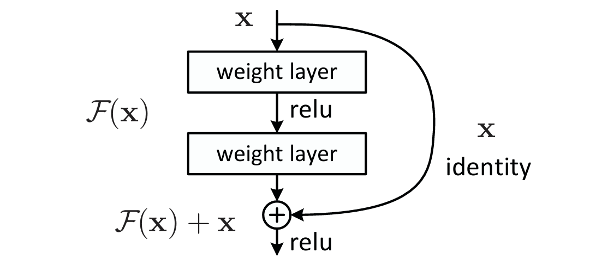
>
> 图2：残差块示意图

### 基础残差块（BasicBlock）

用于较浅的 ResNet（如 ResNet-18, ResNet-34）：

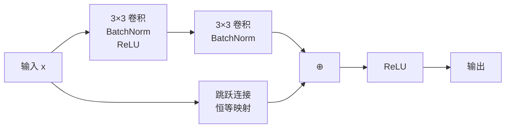

数学表达式：

$$y = \text{ReLU}(\mathcal{F}(x, \{W_i\}) + x)$$

其中 $\mathcal{F}(x, \{W_i\})$ 表示两层卷积操作。

**代码实现要点**：

```python
class BasicBlock(nn.Module):
    def __init__(self, in_channels, out_channels, stride=1):
        super().__init__()
        self.conv1 = nn.Conv2d(in_channels, out_channels, 3, stride, 1, bias=False)
        self.bn1 = nn.BatchNorm2d(out_channels)
        self.conv2 = nn.Conv2d(out_channels, out_channels, 3, 1, 1, bias=False)
        self.bn2 = nn.BatchNorm2d(out_channels)

        # 跳跃连接（维度匹配时为恒等映射）
        self.shortcut = nn.Sequential()
        if stride != 1 or in_channels != out_channels:
            self.shortcut = nn.Sequential(
                nn.Conv2d(in_channels, out_channels, 1, stride, bias=False),
                nn.BatchNorm2d(out_channels)
            )

    def forward(self, x):
        out = F.relu(self.bn1(self.conv1(x)))
        out = self.bn2(self.conv2(out))
        out += self.shortcut(x)  # 残差连接
        out = F.relu(out)
        return out
```

### 瓶颈残差块（Bottleneck）

用于更深的 ResNet（如 ResNet-50, ResNet-101, ResNet-152）：

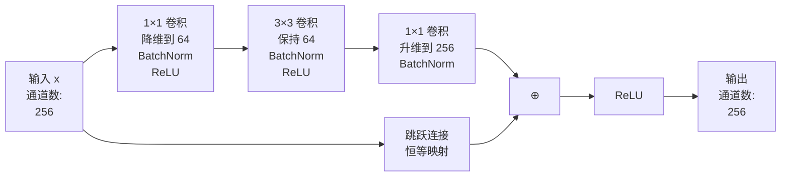

**设计动机**：

1. **降低计算量**：先用 $1 \times 1$ 卷积降维，在低维空间做 $3 \times 3$ 卷积，再升维
2. **增加非线性**：三层结构比两层有更强的表达能力
3. **参数效率**：对于相同的计算量，瓶颈结构可以堆叠更多层

**计算量对比**（假设输入输出都是 256 通道）：

|     结构类型      |                               参数量                                | 相对计算量 |
| :---------------: | :-----------------------------------------------------------------: | :--------: |
| 两层 $3 \times 3$ |      $256 \times 256 \times 3 \times 3 \times 2 \approx 1.18M$      |    1.0×    |
|     瓶颈结构      | $256 \times 64 + 64 \times 64 \times 9 + 64 \times 256 \approx 70K$ |   0.06×    |

瓶颈结构的参数量仅为传统结构的 **6%**，但表达能力更强！

---

## 维度匹配：投影快捷连接

当输入和输出的维度不匹配时（通道数改变或空间尺寸改变），需要对跳跃连接进行调整。

### 两种策略

**策略 A：零填充**

- 对于空间下采样，使用步长为 2 的池化
- 对于通道增加，用零填充扩展通道维度
- 优点：不增加参数
- 缺点：零填充的通道没有学习能力

**策略 B：投影快捷连接（Projection Shortcut）**

- 使用 $1 \times 1$ 卷积调整维度：

$$y = \mathcal{F}(x, \{W_i\}) + W_s x$$

其中 $W_s$ 是 $1 \times 1$ 卷积的权重矩阵。

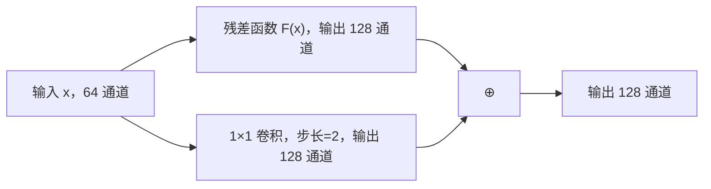

**ResNet 的实际选择**：

- 当维度匹配时，使用恒等映射
- 当维度不匹配时，使用投影快捷连接
- 这种混合策略在性能和参数量之间取得平衡

---

## ResNet 架构家族

### 标准 ResNet 变体

|    模型    | 层数 | 残差块类型 | Top-1 错误率（ImageNet） | 参数量 |
| :--------: | :--: | :--------: | :----------------------: | :----: |
| ResNet-18  |  18  | BasicBlock |           ~30%           | 11.7M  |
| ResNet-34  |  34  | BasicBlock |           ~26%           | 21.8M  |
| ResNet-50  |  50  | Bottleneck |           ~24%           | 25.6M  |
| ResNet-101 | 101  | Bottleneck |           ~23%           | 44.5M  |
| ResNet-152 | 152  | Bottleneck |           ~23%           | 60.2M  |

### ResNet-50 的完整结构

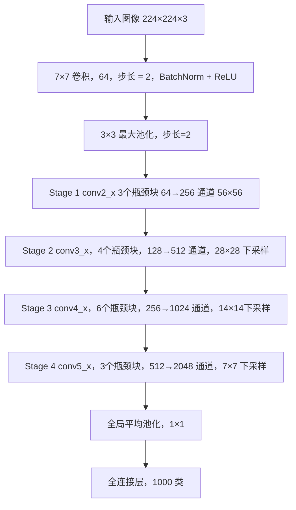

**各阶段的特征图尺寸变化**：

|  阶段   |     输出尺寸     | 通道数 | 残差块数量 |                                              配置                                               |
| :-----: | :--------------: | :----: | :--------: | :---------------------------------------------------------------------------------------------: |
|  conv1  | $112 \times 112$ |   64   |     -      |                                   $7 \times 7$, 64, stride 2                                    |
| conv2_x |  $56 \times 56$  |  256   |     3      |  $\begin{bmatrix} 1 \times 1, 64 \\ 3 \times 3, 64 \\ 1 \times 1, 256 \end{bmatrix} \times 3$   |
| conv3_x |  $28 \times 28$  |  512   |     4      | $\begin{bmatrix} 1 \times 1, 128 \\ 3 \times 3, 128 \\ 1 \times 1, 512 \end{bmatrix} \times 4$  |
| conv4_x |  $14 \times 14$  |  1024  |     6      | $\begin{bmatrix} 1 \times 1, 256 \\ 3 \times 3, 256 \\ 1 \times 1, 1024 \end{bmatrix} \times 6$ |
| conv5_x |   $7 \times 7$   |  2048  |     3      | $\begin{bmatrix} 1 \times 1, 512 \\ 3 \times 3, 512 \\ 1 \times 1, 2048 \end{bmatrix} \times 3$ |

---

## 关键设计细节

### Batch Normalization 的位置

在 ResNet 中，BN 层的位置至关重要：

**标准配置**（ResNet 原论文）：

1. 卷积层
2. Batch Normalization
3. ReLU 激活

**为什么这个顺序有效？**

- BN 在激活前进行，保证输入到 ReLU 的数据分布稳定
- 有助于梯度在深层网络中的传播
- 参考论文：[Batch Normalization: Accelerating Deep Network Training](https://arxiv.org/abs/1502.03167)

### 激活函数的位置

残差块的最后一个 BN 层**之后不加 ReLU**，而是在加法操作之后才加：

$$y = \text{ReLU}(\text{BN}(\text{Conv}(x)) + x)$$

**原因**：

- 保持跳跃连接的恒等映射特性
- 如果在加法前就激活，会破坏残差学习的数学性质
- 详见论文：[Identity Mappings in Deep Residual Networks](https://arxiv.org/abs/1603.05027)

### 初始化策略

ResNet 使用 **Kaiming 初始化**（也称 He 初始化）：

$$W \sim \mathcal{N}\left(0, \sqrt{\frac{2}{n_{\text{in}}}}\right)$$

其中 $n_{\text{in}}$ 是输入神经元数量。

这种初始化专门为 ReLU 激活函数设计，确保信号在前向传播和反向传播中都不会衰减或爆炸。

参考论文：[Delving Deep into Rectifiers](https://arxiv.org/abs/1502.01852)

---

## 为什么 ResNet 有效？

### 梯度流动的视角

在传统深度网络中，梯度需要经过每一层的乘法链式传播：

$$\frac{\partial L}{\partial x} = \frac{\partial L}{\partial y} \cdot \frac{\partial y}{\partial x}$$

当网络很深时，如果 $\frac{\partial y}{\partial x} < 1$，梯度会指数级衰减（梯度消失）。

**ResNet 的梯度传播**：

由于 $y = \mathcal{F}(x) + x$，梯度为：

$$\frac{\partial y}{\partial x} = \frac{\partial \mathcal{F}(x)}{\partial x} + 1$$

关键观察：**梯度中始终有一个 "+1" 项**，这保证了梯度至少可以无损地传播回去。

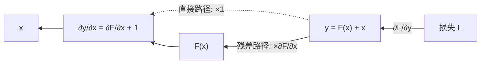

**数学推导**：

对于一个 $L$ 层的 ResNet，从第 $l$ 层到第 $L$ 层的梯度为：

$$\frac{\partial \mathcal{E}}{\partial x_l} = \frac{\partial \mathcal{E}}{\partial x_L} \cdot \frac{\partial x_L}{\partial x_l} = \frac{\partial \mathcal{E}}{\partial x_L} \cdot \left(1 + \frac{\partial}{\partial x_l} \sum_{i=l}^{L-1} \mathcal{F}(x_i, W_i)\right)$$

即使 $\frac{\partial}{\partial x_l} \sum_{i=l}^{L-1} \mathcal{F}(x_i, W_i)$ 很小，梯度仍然可以通过 "+1" 项直接传播。

### 集成学习的视角

一个有趣的理解角度：ResNet 可以看作是**指数级数量的浅层网络的集成**。

考虑一个有 $n$ 个残差块的 ResNet，每个残差块都可以选择"使用"或"跳过"，因此总共有 $2^n$ 条可能的路径。

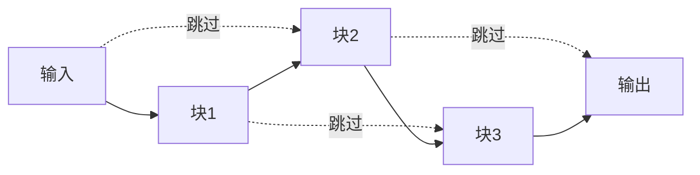

这种多路径结构提供了：

- **隐式的模型集成**：不同路径长度的网络共同工作
- **训练的鲁棒性**：即使某些路径梯度消失，其他路径仍能学习

参考论文：[Residual Networks Behave Like Ensembles of Relatively Shallow Networks](https://arxiv.org/abs/1605.06431)

### 损失曲面的视角

#### ResNet 自身的对比

> 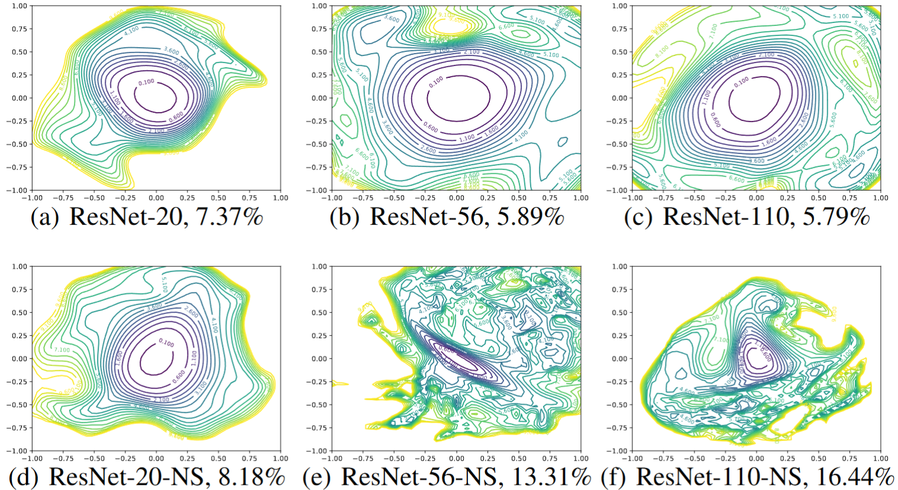
>
> 横向对比了**有无跳跃连接**、**不同深度**下的损失曲面（等高线图，俯视视角）：括号里的百分比是 **CIFAR-10 测试错误率**。
>
> - 上排 (a)(b)(c)：正常 ResNet，有跳跃连接，深度从 20 → 56 → 110 层
> - 下排 (d)(e)(f)：ResNet-NS（No Shortcut），去掉跳跃连接，同样深度

观察规律：

|         对比维度         |                     现象                     |
| :----------------------: | :------------------------------------------: |
|   有跳跃连接，深度增加   |   曲面始终平滑，错误率从 7.37% 降到 5.79%    |
|   无跳跃连接，深度增加   | 曲面急剧混乱，错误率从 8.18% **升到 16.44%** |
| 同深度，有 vs 无跳跃连接 |   有跳跃连接的曲面明显更规整，等高线更圆润   |

这直接用可视化证明了一件事：**深度网络退化问题的根源就是损失曲面的混乱，而跳跃连接从根本上解决了这个问题**，而不只是缓解了梯度消失。

---

#### 等高线图怎么读

等高线越**圆润、稀疏、同心**，说明曲面越平滑，极小值越宽广（平坦极小值），优化越容易。等高线越**密集、扭曲、破碎**，说明曲面崎岖，梯度方向混乱，优化器容易迷失。

对比 (c) 和 (f) 最为直观——同样是 110 层，有无跳跃连接的差距几乎是"可优化"和"几乎不可优化"的区别。

参考论文：[Visualizing the Loss Landscape of Neural Nets](https://arxiv.org/abs/1712.09913)

中文讲解：[【Loss Landscape】Visualizing the Loss Landscape of Neural Nets - 知乎](https://zhuanlan.zhihu.com/p/609980586)

---

## 训练技巧与实践

### 数据增强

ResNet 在 ImageNet 上使用的标准数据增强：

1. **训练时**：
   - 随机裁剪到 $224 \times 224$（从 $256 \times 256$ 的图像中）
   - 随机水平翻转（概率 0.5）
   - 颜色抖动（可选）
   - PCA 颜色增强（可选）

2. **测试时**：
   - 中心裁剪到 $224 \times 224$
   - 或使用多尺度测试取平均（10-crop）

```python
# 训练时的数据增强
train_transform = transforms.Compose([
    transforms.RandomResizedCrop(224),
    transforms.RandomHorizontalFlip(),
    transforms.ColorJitter(brightness=0.4, contrast=0.4, saturation=0.4),
    transforms.ToTensor(),
    transforms.Normalize(mean=[0.485, 0.456, 0.406], std=[0.229, 0.224, 0.225])
])
```

### 学习率调度

**标准训练方案**（ImageNet）：

- 初始学习率：0.1
- 批量大小：256
- 优化器：SGD with momentum (0.9)
- 权重衰减：0.0001
- 学习率衰减：每 30 个 epoch 除以 10
- 总训练轮数：90-120 epochs

**学习率预热**（Warmup）：

在训练初期，从较小的学习率逐渐增加到目标学习率，有助于稳定训练：

$$\text{lr}(t) = \text{lr}_{\text{base}} \times \min\left(1, \frac{t}{T_{\text{warmup}}}\right)$$

其中 $T_{\text{warmup}}$ 通常设为 5 个 epoch。

**余弦退火**（Cosine Annealing）：

$$\text{lr}(t) = \text{lr}_{\text{min}} + \frac{1}{2}(\text{lr}_{\text{max}} - \text{lr}_{\text{min}})\left(1 + \cos\left(\frac{t\pi}{T}\right)\right)$$

参考论文：[SGDR: Stochastic Gradient Descent with Warm Restarts](https://arxiv.org/abs/1608.03983)

### 正则化技术

1. **权重衰减（L2 正则化）**：
   $$L_{\text{total}} = L_{\text{task}} + \lambda \sum_i W_i^2$$

   通常 $\lambda = 0.0001$

2. **Dropout**：ResNet 通常**不使用** Dropout，因为 BN 已经提供了足够的正则化

3. **标签平滑**（Label Smoothing）：
   $$y_{\text{smooth}} = (1 - \epsilon) y_{\text{true}} + \frac{\epsilon}{K}$$

   其中 $K$ 是类别数，$\epsilon$ 通常取 0.1

   参考论文：[Rethinking the Inception Architecture](https://arxiv.org/abs/1512.00567)

4. **Mixup**：
   $$\tilde{x} = \lambda x_i + (1-\lambda) x_j$$
   $$\tilde{y} = \lambda y_i + (1-\lambda) y_j$$

   其中 $\lambda \sim \text{Beta}(\alpha, \alpha)$，通常 $\alpha = 0.2$

   参考论文：[mixup: Beyond Empirical Risk Minimization](https://arxiv.org/abs/1710.09412)

---

## ResNet 的变体与改进

### ResNeXt：聚合残差变换

ResNeXt 引入了"基数"（cardinality）的概念，将残差块分解为多个并行路径：

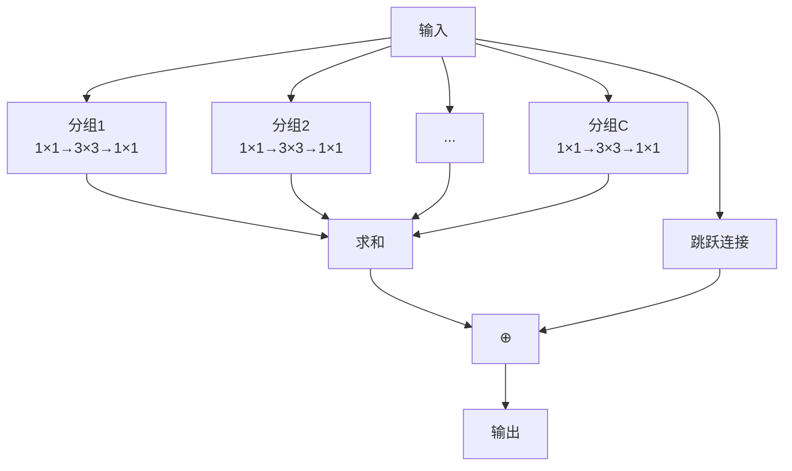

**核心思想**：增加基数（并行路径数）比增加深度或宽度更有效。

数学表达式：

$$\mathcal{F}(x) = \sum_{i=1}^{C} \mathcal{T}_i(x)$$

其中 $C$ 是基数，$\mathcal{T}_i$ 是第 $i$ 个变换。

参考论文：[Aggregated Residual Transformations for Deep Neural Networks](https://arxiv.org/abs/1611.05431)

### Wide ResNet：加宽而非加深

Wide ResNet 减少深度，但显著增加每层的通道数：

|    模型     | 深度 | 宽度因子 | 参数量 | CIFAR-10 错误率 |
| :---------: | :--: | :------: | :----: | :-------------: |
| ResNet-1001 | 1001 |    1×    | 10.2M  |      4.62%      |
|  WRN-28-10  |  28  |   10×    | 36.5M  |      4.00%      |

**发现**：在相同参数量下，更宽的网络往往比更深的网络训练更快、性能更好。

参考论文：[Wide Residual Networks](https://arxiv.org/abs/1605.07146)

### DenseNet：密集连接

DenseNet 将每一层与之前所有层连接：

$$x_l = \mathcal{H}_l([x_0, x_1, \ldots, x_{l-1}])$$

其中 $[\cdot]$ 表示通道拼接。

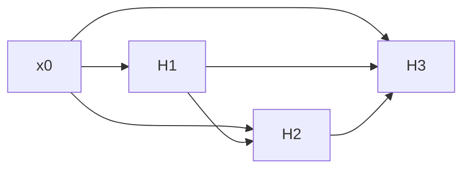

**与 ResNet 的对比**：

|   特性   |  ResNet  | DenseNet |
| :------: | :------: | :------: |
| 连接方式 |   相加   |   拼接   |
| 参数效率 |   中等   |    高    |
| 特征复用 |   隐式   |   显式   |
| 梯度流动 | 直接路径 | 多条路径 |

参考论文：[Densely Connected Convolutional Networks](https://arxiv.org/abs/1608.06993)

### SE-ResNet：通道注意力

Squeeze-and-Excitation（SE）模块为每个通道学习一个权重：

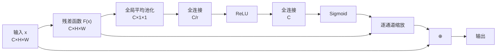

数学表达式：

$$\tilde{x}_c = x_c \cdot \sigma\left(W_2 \delta(W_1 z)\right)$$

其中 $z_c = \frac{1}{H \times W} \sum_{i=1}^{H} \sum_{j=1}^{W} x_c(i,j)$ 是全局平均池化。

参考论文：[Squeeze-and-Excitation Networks](https://arxiv.org/abs/1709.01507)

### ResNeSt：Split-Attention Networks

ResNeSt 结合了 ResNeXt 的分组卷积和 SE 的注意力机制：

参考论文：[ResNeSt: Split-Attention Networks](https://arxiv.org/abs/2004.08955)

---

## 实际应用场景

### 图像分类

ResNet 是 ImageNet 分类任务的标准基线：

- **迁移学习**：在 ImageNet 上预训练，然后在目标数据集上微调
- **特征提取**：使用 ResNet 的中间层作为特征提取器

```python
# 使用预训练的 ResNet-50
model = torchvision.models.resnet50(pretrained=True)

# 冻结所有层
for param in model.parameters():
    param.requires_grad = False

# 替换最后的全连接层
model.fc = nn.Linear(2048, num_classes)

# 只训练最后一层
optimizer = optim.Adam(model.fc.parameters(), lr=0.001)
```

### 目标检测

ResNet 作为骨干网络广泛应用于：

- **Faster R-CNN**：使用 ResNet-50/101 作为特征提取器
  - 论文：[Faster R-CNN: Towards Real-Time Object Detection](https://arxiv.org/abs/1506.01497)
- **Mask R-CNN**：在 Faster R-CNN 基础上增加实例分割
  - 论文：[Mask R-CNN](https://arxiv.org/abs/1703.06870)
- **RetinaNet**：单阶段检测器，使用 ResNet + FPN
  - 论文：[Focal Loss for Dense Object Detection](https://arxiv.org/abs/1708.02002)

### 语义分割

- **FCN**：全卷积网络，使用 ResNet 作为编码器
  - 论文：[Fully Convolutional Networks for Semantic Segmentation](https://arxiv.org/abs/1411.4038)
- **DeepLab**：使用 ResNet + 空洞卷积
  - 论文：[DeepLab: Semantic Image Segmentation](https://arxiv.org/abs/1606.00915)
- **PSPNet**：金字塔池化模块 + ResNet
  - 论文：[Pyramid Scene Parsing Network](https://arxiv.org/abs/1612.01105)

### 其他应用

- **人脸识别**：FaceNet, ArcFace 等使用 ResNet 作为骨干
  - 论文：[ArcFace: Additive Angular Margin Loss](https://arxiv.org/abs/1801.07698)
- **姿态估计**：OpenPose, HRNet 等使用 ResNet 提取特征
  - 论文：[Deep High-Resolution Representation Learning](https://arxiv.org/abs/1902.09212)
- **医学图像分析**：X光、CT、MRI 图像的病灶检测与分割
- **视频理解**：3D ResNet 用于动作识别
  - 论文：[Quo Vadis, Action Recognition?](https://arxiv.org/abs/1705.07750)

---

## 调试与常见问题

### 训练不收敛的诊断

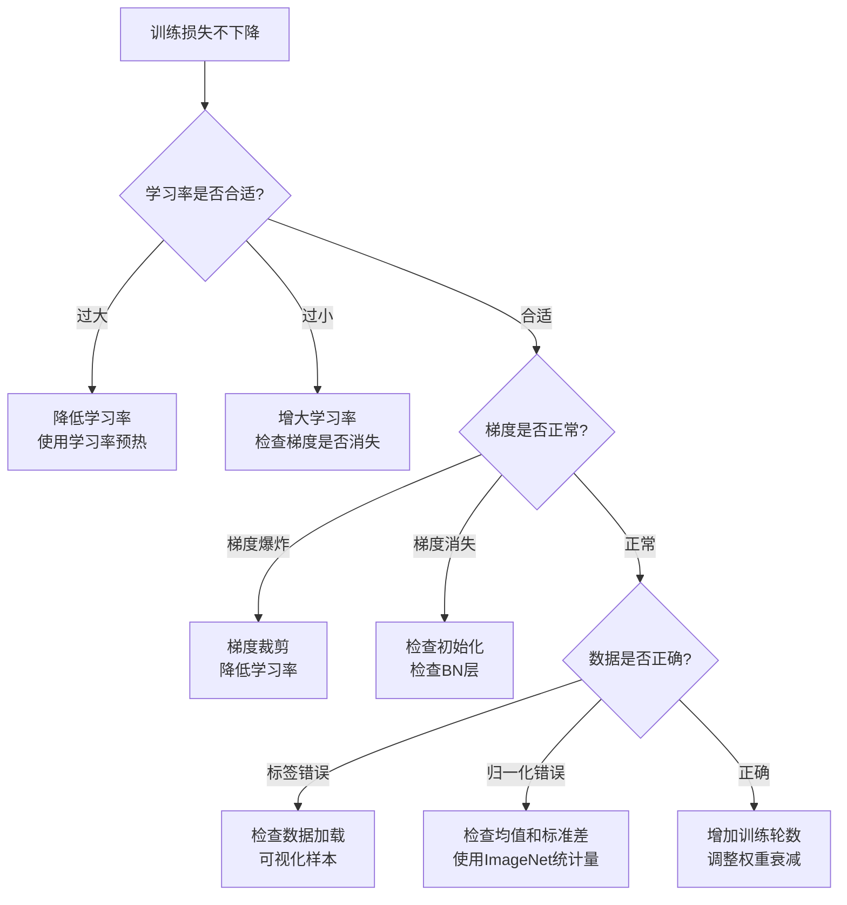

### 常见错误及解决方案

**问题 1：显存溢出（OOM）**

解决方案：

- 减小批量大小
- 使用梯度累积模拟大批量
- 启用梯度检查点
- 使用混合精度训练

```python
# 梯度累积示例
accumulation_steps = 4
for i, (data, target) in enumerate(dataloader):
    output = model(data)
    loss = criterion(output, target) / accumulation_steps
    loss.backward()

    if (i + 1) % accumulation_steps == 0:
        optimizer.step()
        optimizer.zero_grad()
```

**问题 2：验证精度远低于训练精度**

可能原因：

- 过拟合
- BN 层在训练和测试模式不一致
- 数据增强过强

解决方案：

```python
# 确保测试时使用评估模式
model.eval()
with torch.no_grad():
    for data, target in test_loader:
        output = model(data)
```

**问题 3：训练速度慢**

优化方案：

- 使用更高效的数据加载（增加 num_workers）
- 启用 pin_memory
- 使用 torch.compile()（PyTorch 2.0+）
- 检查是否有不必要的 CPU-GPU 数据传输

---

## 性能基准与对比

### ImageNet 分类性能

|    模型    | Top-1 准确率 | Top-5 准确率 | 参数量 | FLOPs | 推理速度（GPU） |
| :--------: | :----------: | :----------: | :----: | :---: | :-------------: |
| ResNet-18  |    69.8%     |    89.1%     | 11.7M  | 1.8G  |    ~150 FPS     |
| ResNet-34  |    73.3%     |    91.4%     | 21.8M  | 3.7G  |    ~100 FPS     |
| ResNet-50  |    76.1%     |    92.9%     | 25.6M  | 4.1G  |     ~80 FPS     |
| ResNet-101 |    77.4%     |    93.6%     | 44.5M  | 7.8G  |     ~50 FPS     |
| ResNet-152 |    78.3%     |    94.1%     | 60.2M  | 11.6G |     ~35 FPS     |

### 与其他架构的对比

|        架构        |   年份   | Top-1 准确率 |  参数量   |      特点      |
| :----------------: | :------: | :----------: | :-------: | :------------: |
|      AlexNet       |   2012   |    57.1%     |    61M    | 深度学习的开端 |
|       VGG-16       |   2014   |    71.5%     |   138M    |  简单但参数多  |
|     GoogLeNet      |   2014   |    69.8%     |   6.8M    | Inception 模块 |
|   **ResNet-50**    | **2015** |  **76.1%**   | **25.6M** |  **残差连接**  |
|    DenseNet-121    |   2017   |    74.9%     |   8.0M    |    密集连接    |
|  EfficientNet-B0   |   2019   |    77.1%     |   5.3M    |    复合缩放    |
| Vision Transformer |   2020   |    77.9%     |    86M    |  纯注意力机制  |

---

## 总结与展望

### ResNet 的核心贡献

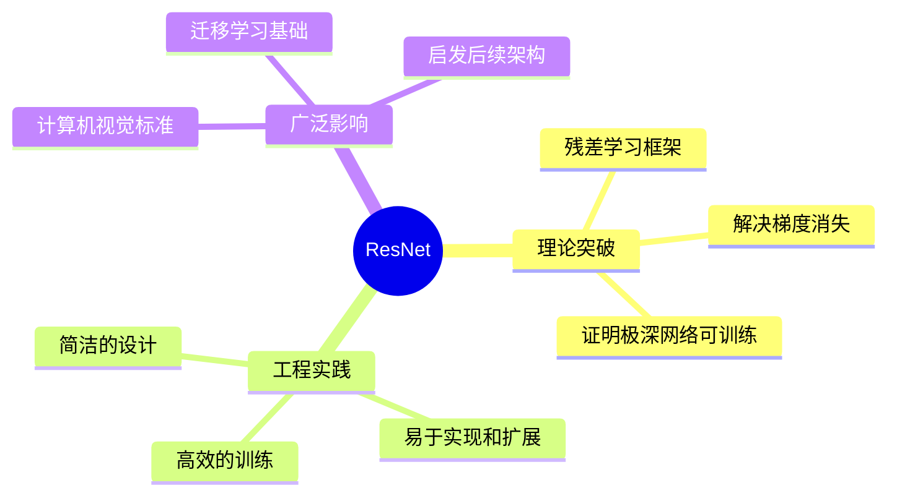

**三个关键洞察**：

1. **残差学习比直接学习更容易**：$\mathcal{F}(x) = \mathcal{H}(x) - x$ 比 $\mathcal{H}(x)$ 更容易优化

2. **恒等映射保证梯度流动**：$\frac{\partial y}{\partial x} = \frac{\partial \mathcal{F}(x)}{\partial x} + 1$ 中的 "+1" 项确保梯度不会消失

3. **深度是有价值的**：在残差连接的帮助下，更深的网络确实能学到更好的表示

### 对深度学习的影响

ResNet 不仅仅是一个成功的网络架构，它代表了深度学习领域的一次范式转变：

**在计算机视觉领域**：

- 成为几乎所有视觉任务的标准骨干网络
- 预训练模型广泛用于迁移学习
- 启发了 FPN、Feature Pyramid 等多尺度特征融合方法

**在其他领域的影响**：

- **Transformer**：BERT、GPT 等模型都使用了残差连接
- **语音识别**：ResNet 的思想被应用到 RNN 和 LSTM 中
- **强化学习**：AlphaGo 使用了 ResNet 架构

### 未来方向

虽然 ResNet 已经是一个成熟的架构，但仍有一些值得探索的方向：

1. **神经架构搜索（NAS）**：自动搜索最优的残差块配置
   - 论文：[Neural Architecture Search](https://arxiv.org/abs/1611.01578)

2. **动态网络**：根据输入自适应调整网络深度
   - 论文：[SkipNet: Learning Dynamic Routing](https://arxiv.org/abs/1711.09485)

3. **知识蒸馏**：将大型 ResNet 的知识迁移到小型网络
   - 论文：[Distilling the Knowledge in a Neural Network](https://arxiv.org/abs/1503.02531)

4. **与 Transformer 的融合**：结合卷积和自注意力的优势
   - 论文：[CoAtNet: Marrying Convolution and Attention](https://arxiv.org/abs/2106.04803)

### 实践建议

**选择合适的 ResNet 变体**：

- **小数据集（< 10K 样本）**：ResNet-18 或 ResNet-34，避免过拟合
- **中等数据集（10K-100K）**：ResNet-50，性能和效率的平衡点
- **大数据集（> 100K）**：ResNet-101 或 ResNet-152，充分利用数据
- **资源受限**：考虑 MobileNet 或 EfficientNet
- **追求极致性能**：ResNeXt-101 或 SE-ResNet-152

**迁移学习最佳实践**：

1. 使用 ImageNet 预训练权重
2. 冻结早期层，只微调后期层
3. 使用较小的学习率（如 0.001）
4. 根据目标任务调整数据增强策略

---

## 参考资源

### 核心论文

1. [Deep Residual Learning for Image Recognition](https://arxiv.org/abs/1512.03385) - ResNet 原论文
2. [Identity Mappings in Deep Residual Networks](https://arxiv.org/abs/1603.05027) - ResNet v2
3. [Aggregated Residual Transformations](https://arxiv.org/abs/1611.05431) - ResNeXt
4. [Wide Residual Networks](https://arxiv.org/abs/1605.07146) - Wide ResNet

### 代码实现

- **PyTorch 官方实现**：[torchvision.models.resnet](https://github.com/pytorch/vision/blob/main/torchvision/models/resnet.py)
- **TensorFlow 官方实现**：[Keras Applications](https://keras.io/api/applications/resnet/)
- **论文作者实现**：[KaimingHe/deep-residual-networks](https://github.com/KaimingHe/deep-residual-networks)

### 学习资源

- **CS231n 课程**：[Stanford CNN for Visual Recognition](http://cs231n.stanford.edu/)
- **论文解读**：[ResNet 论文逐段精读](https://www.bilibili.com/video/BV1P3411y7nn/)
- **实战教程**：[PyTorch 官方教程](https://pytorch.org/tutorials/)

---

ResNet 的成功告诉我们：**有时候，最好的创新不是增加复杂性，而是找到正确的简化方式**。残差连接这个简单的想法，让我们能够训练前所未有的深度网络，并在此基础上构建了现代深度学习的大厦。无论是在学术研究还是工业应用中，ResNet 都将继续发挥重要作用。
