# FiLM: Feature-wise Linear Modulation 完全指南

> **上传者**：[XYChouMian](https://github.com/XYChouMian)  
> **参考论文**：[FiLM: Visual Reasoning with a General Conditioning Layer](https://arxiv.org/abs/1709.07871) (AAAI 2018)  
> **源代码**：[FiLM](https://github.com/ethanjperez/film)  
> **论文PDF**：[paper.pdf](paper.pdf)

---

## 引言

**FiLM (Feature-wise Linear Modulation)** 是一种通用的神经网络条件化方法，由 Perez et al. 在 2018 年提出。它通过简单的特征级仿射变换，使神经网络能够根据条件信息动态调整其行为。FiLM 在视觉推理任务上取得了突破性成果，将 CLEVR 基准测试的错误率降低了一半。

---

## 核心概念

### 什么是 FiLM？

FiLM 的核心思想是：**让一个网络的输出去调制（modulate）另一个网络的中间特征**。

具体来说，FiLM 学习函数 $g$（称为 **FiLM Generator**），将条件输入 $x_i$ 映射为缩放参数 $\gamma_{i,c}$ 和偏移参数 $\beta_{i,c}$：

$$
(\gamma_{i,c}, \beta_{i,c}) = g_c(x_i)
$$

然后通过**特征级仿射变换**调制神经网络的激活值 $F_{i,c}$：

$$
\text{FiLM}(F_{i,c} \mid \gamma_{i,c}, \beta_{i,c}) = \gamma_{i,c} \cdot F_{i,c} + \beta_{i,c}
$$

**符号说明**：
- $i$：样本索引（batch 中第几个样本）
- $c$：通道索引（第几个特征通道）
- $x_i$：条件信息（如问题文本）
- $F_{i,c}$：被调制网络的中间特征
- $\gamma_{i,c}$：缩放因子（scale）
- $\beta_{i,c}$：偏移量（shift）

> 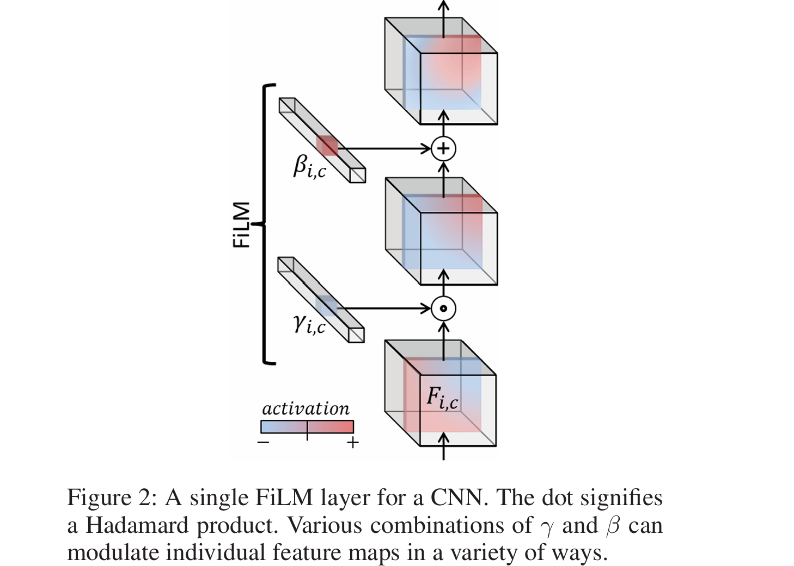
> **论文图2**：为 CNN 设计的单层 FiLM 层示意图

### 数学原理深入

#### 张量形式与三个关键特性

对于 CNN 特征图，完整的 FiLM 操作为：

$$
\text{FiLM}(F_{i,c,h,w}) = \gamma_{i,c} \cdot F_{i,c,h,w} + \beta_{i,c}
$$

其中 $h, w$ 表示空间位置。注意 $\gamma_{i,c}$ 和 $\beta_{i,c}$ 在空间维度上广播。

**维度变换**：
```
特征图 F:  [B, C, H, W]
参数 γ:    [B, C] → 广播为 [B, C, 1, 1]
参数 β:    [B, C] → 广播为 [B, C, 1, 1]
输出:      [B, C, H, W]
```

这带来三个关键特性：

1. **通道独立性**（Channel-wise）：每个通道 $c$ 有独立的 $(\gamma_c, \beta_c)$，可对不同语义特征（颜色、纹理、形状）进行细粒度控制

2. **空间共享性**（Spatial-agnostic）：同一通道内所有位置 $(h,w)$ 共享参数，使参数量仅为 $2C$（与空间分辨率无关）

3. **条件依赖性**（Conditional）：$(\gamma, \beta)$ 由条件 $x_i$ **动态生成**，不同样本产生不同的调制策略

#### 调制的几何意义

FiLM 在特征空间中执行**缩放+平移**：

| $\gamma$ | $\beta$ | 效果 | 典型应用 |
|---------|---------|------|---------|
| 1 | 0 | 恒等变换 | 保持原特征 |
| 0 | 0 | 特征关闭 | 完全抑制无关通道 |
| $> 1$ | 0 | 放大特征 | 增强相关通道（如红色） |
| $0 < \gamma < 1$ | 0 | 缩小特征 | 减弱次要通道 |
| $< 0$ | 0 | 特征反转 | 改变语义方向 |
| 任意 | $\neq 0$ | 基线偏移 | 调整激活阈值 |

**与 ReLU 的协同**：当 FiLM 后接 ReLU 时，可实现**动态阈值调整**：

$$
\text{ReLU}(\gamma F + \beta) = \begin{cases}
0 & \text{if } F < -\beta/\gamma \\
\gamma F + \beta & \text{otherwise}
\end{cases}
$$

通过调整 $\beta/\gamma$，FiLM 将 ReLU 阈值从 0 移至 $-\beta/\gamma$，实现选择性激活。

**示例**：在视觉问答中，问题"有多少个红色物体？"可使 FiLM：
- 设置 $\gamma_{\text{red}} > 1$ 放大红色通道
- 调整 $\beta$ 使非红色区域被 ReLU 抑制为 0

#### 梯度流与学习动态

FiLM 的反向传播包含两条独立路径：

**路径 1：对特征的梯度**（更新主网络）
$$
\frac{\partial \mathcal{L}}{\partial F} = \gamma \cdot \frac{\partial \mathcal{L}}{\partial \text{output}}
$$

**路径 2：对调制参数的梯度**（更新生成器）
$$
\frac{\partial \mathcal{L}}{\partial \gamma} = F \cdot \frac{\partial \mathcal{L}}{\partial \text{output}}, \quad
\frac{\partial \mathcal{L}}{\partial \beta} = \frac{\partial \mathcal{L}}{\partial \text{output}}
$$

**关键洞察**：
- $\gamma$ 的梯度与 $F$ 成正比：**幅度大的特征对 $\gamma$ 学习影响更大**
- $\beta$ 的梯度直接传播：**通常比 $\gamma$ 学习更快**

#### 多层参数生成

对于 $N$ 层深度网络，生成器为每层生成独立参数：

$$
\{(\gamma^{(1)}, \beta^{(1)}), \ldots, (\gamma^{(N)}, \beta^{(N)})\} = g(x_i)
$$

```python
# 实现示例
question_emb = GRU(question)  # (batch, 4096)
for n in range(N):
    gamma_n = Linear_n(question_emb)  # (batch, channels)
    beta_n = Linear_n(question_emb)   # (batch, channels)
```

**为什么合并 $\gamma$ 和 $\beta$ 生成**？参数共享、减少计算、联合学习可捕获两者相关性。

#### 计算复杂度

**参数量**：单层 FiLM 仅需 $2C$ 参数（$C$ 为通道数），与空间分辨率无关。

**计算量**：前向传播 $O(BCHW)$，其中 $B$ 为 batch size。

**对比**：
- 全连接层/1×1 卷积：$C_{\text{in}} \times C_{\text{out}}$ 参数
- **FiLM：$2C$ 参数（通常 $C \ll C_{\text{in}} \times C_{\text{out}}$）**

整体复杂度 = Generator 开销 + FiLM 层开销，后者极小。

### 实用技巧

**初始化**：设置 $\gamma \leftarrow 1, \beta \leftarrow 0$ 使训练初期接近恒等变换。

**数值稳定性**：可用 $\gamma = \exp(\hat{\gamma})$ 确保 $\gamma > 0$（若不需要特征反转）。

**正则化**：添加 $\mathcal{L}_{\text{reg}} = \lambda_\gamma \|\gamma - 1\|^2 + \lambda_\beta \|\beta\|^2$ 鼓励模型在不需要时保持接近恒等变换。

---

## 架构设计

### 整体架构

FiLM 模型通常包含两个主要组件：

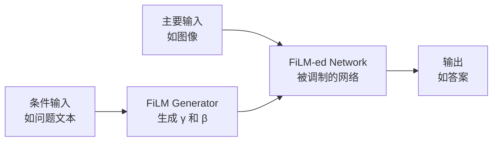

1. **FiLM Generator（生成器）**：处理条件信息，生成调制参数
2. **FiLM-ed Network（被调制网络）**：处理主要输入，其特征被 FiLM 层调制

> 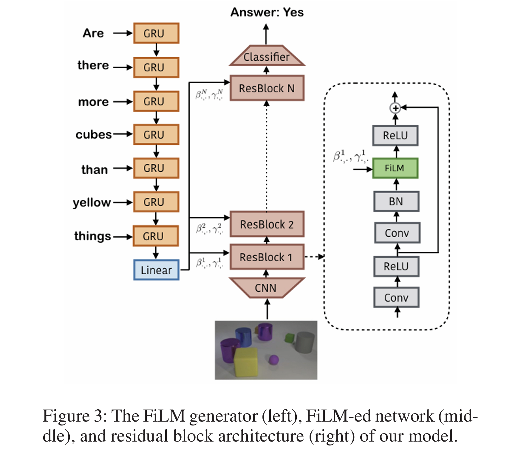
> **论文图3**：FiLM 模型的总体架构示意图

### FiLM Generator 详解

对于视觉问答任务，FiLM Generator 处理问题文本：

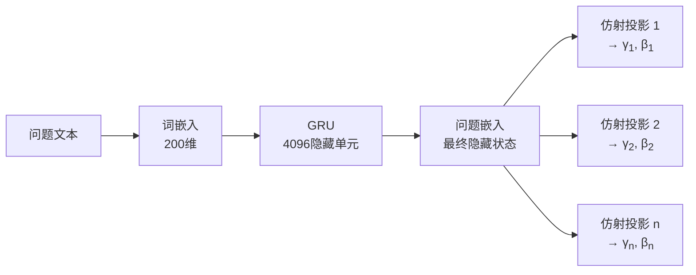

**关键特点**：

- 使用 **GRU (Gated Recurrent Unit)** 处理序列信息
- 隐藏单元数：4096
- 词嵌入维度：200
- 为每个 ResBlock 生成独立的 $(\gamma, \beta)$ 参数对

### FiLM-ed Network 详解

FiLM-ed Network 处理图像输入并应用 FiLM 调制：

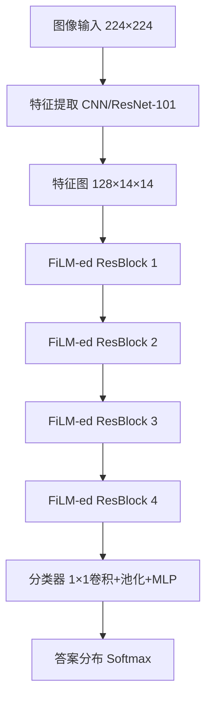

**特征提取选项**：

- **从头训练的 CNN**：4 层，128 个 4×4 卷积核
- **预训练特征提取器**：ResNet-101 的 conv4 层 + 可学习的 3×3 卷积

---

## FiLM-ed ResBlock 详解

FiLM-ed ResBlock 是 FiLM 架构的核心构建块：

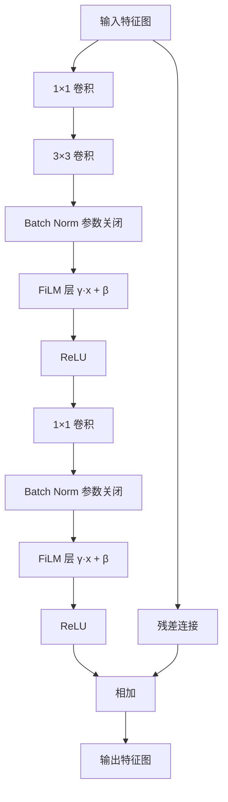

**关键设计**：

- 每个 ResBlock 包含 **2 个 FiLM 层**
- FiLM 层前的 Batch Normalization **参数被关闭**（不学习 scale 和 shift）
- 使用残差连接保持信息流
- 每个 ResBlock 有 128 个特征图

### FiLM 层的作用机制

通过不同的 $\gamma$ 和$\beta$ 组合，FiLM 可以实现多种调制效果：

| $\gamma$     | $\beta$                          | 效果                    |
| ------------ | -------------------------------- | ----------------------- |
| 1            | 0                                | 恒等变换（无变化）      |
| 0            | 0                                | 关闭特征图              |
| -1           | 0                                | 取反特征                |
| $>1$         | 0                                | 放大特征                |
| $0<\gamma<1$ | 0                                | 缩小特征                |
| 1            | $>0$                             | 正向偏移                |
| 1            | $<0$                             | 负向偏移                |
| $\gamma$     | $-\gamma \cdot \text{threshold}$ | 选择性阈值（配合 ReLU） |

> 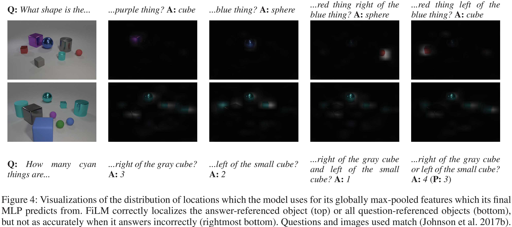
> **论文图4**

> 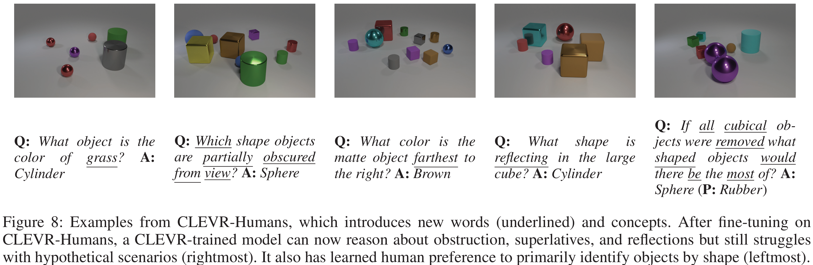
> **论文图8**

---

## 数学原理深入

### 与 Batch Normalization 的关系

Batch Normalization 的公式为：

$$
\text{BN}(x) = \gamma \cdot \frac{x - \mu}{\sigma} + \beta
$$

FiLM 可以看作是 **条件化的 Batch Normalization**，但有重要区别：

$$
\text{FiLM}(x) = \gamma(c) \cdot x + \beta(c)
$$

其中 $c$ 是条件信息（如问题文本）。

**关键发现**：论文证明了 **FiLM 不需要标准化（normalization）也能有效工作**！这是 FiLM 的重要贡献之一。

### 与 Conditional Normalization 的关系

FiLM 是 Conditional Normalization 的泛化形式：

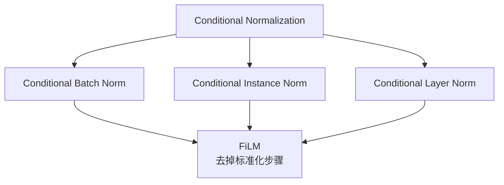

**优势**：

- 更简单：不需要计算均值和方差
- 更通用：适用于任何特征表示
- 计算效率更高：$O(1)$ 复杂度，不随图像分辨率增长

---

## 实现细节

### 空间坐标特征

为了增强空间推理能力，FiLM 模型在多个位置拼接坐标特征图：

```python
# 伪代码示例
def add_coordinate_features(feature_map):
    """
    在特征图中添加归一化的 x, y 坐标
    feature_map: shape (batch, channels, height, width)
    """
    # 生成坐标网格，范围 [-1, 1]
    x_coords = linspace(-1, 1, width)
    y_coords = linspace(-1, 1, height)

    # 拼接到特征图
    return concat([feature_map, x_coords, y_coords], dim=1)
```

**拼接位置**：

1. 初始图像特征后
2. 每个 ResBlock 的输入
3. 分类器的输入

### 分类器设计

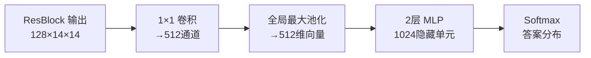

---

## 训练策略

### 超参数配置

| 超参数       | 值                 |
| ------------ | ------------------ |
| 优化器       | Adam               |
| 学习率       | $3 \times 10^{-4}$ |
| 权重衰减     | $1 \times 10^{-5}$ |
| Batch Size   | 64                 |
| 最大训练轮数 | 80                 |
| 提前停止     | 基于验证集准确率   |

**训练特点**：

- ✅ 端到端训练，从头开始
- ✅ 仅使用图像-问题-答案三元组
- ❌ 不使用数据增强
- ❌ 不使用预训练的语言模型
- 使用 Batch Normalization 和 ReLU

### FiLM 层的初始化

论文发现 FiLM 层前的 Batch Normalization 参数应该**关闭**：

```python
# 伪代码示例
batch_norm = BatchNorm(num_features=128)
batch_norm.weight.requires_grad = False  # 关闭 γ 学习
batch_norm.bias.requires_grad = False    # 关闭 β 学习
```

这样做的原因：FiLM 层自身已经提供了 scale 和 shift，避免参数冗余。

---

## 实验结果

### CLEVR 基准测试

CLEVR 是一个视觉推理数据集，包含需要多步推理的问题。

**性能对比**：

| 模型                         | 准确率    | 说明                    |
| ---------------------------- | --------- | ----------------------- |
| 人类表现                     | 92.6%     | 人类基准                |
| 传统 VQA 模型                | ~70%      | 难以进行结构化推理      |
| Program Generator + Executor | 96.9%     | 使用程序监督            |
| **FiLM（从头训练）**         | **97.7%** | 🏆 仅使用图像-问题-答案 |
| **FiLM（ResNet-101）**       | **99.1%** | 🏆 当前最优             |


### 泛化能力

FiLM 展现出强大的泛化能力：

1. **少样本学习**：在训练数据减少的情况下仍保持高性能
2. **零样本泛化**：能够回答训练时未见过的问题类型
3. **复杂度泛化**：在更复杂的场景中表现良好

---

## FiLM 的工作机制

### 注意力可视化

通过可视化 FiLM 参数，研究人员发现：

**FiLM 学习到的模式**：

- 不同的 $\gamma$ 和 $\beta$ 值对应不同的语义概念
- 问题中的关键词（如颜色、形状）会激活特定的特征图
- FiLM 能够选择性地增强或抑制相关特征

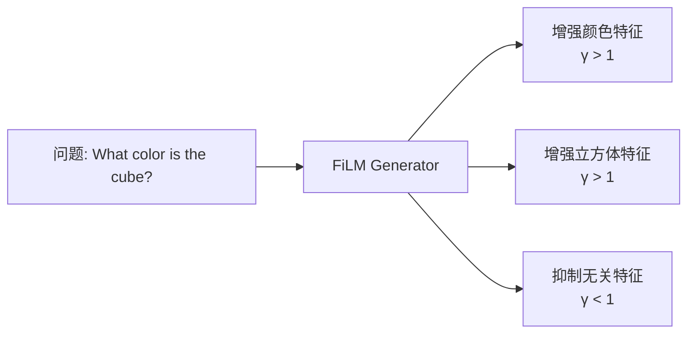

### 定位能力

FiLM 使 CNN 能够准确定位问题中提到的对象：

- 传统 CNN：难以根据文本定位特定对象
- **FiLM-ed CNN**：能够根据问题动态调整注意力

---

## FiLM 的优势

### 1. **简单高效**

- 每个特征图仅需 2 个参数（$\gamma$ 和 $\beta$）
- 计算复杂度 $O(1)$，不随图像分辨率增长
- 易于实现和集成到现有架构

### 2. **通用性强**

FiLM 已成功应用于多个领域：

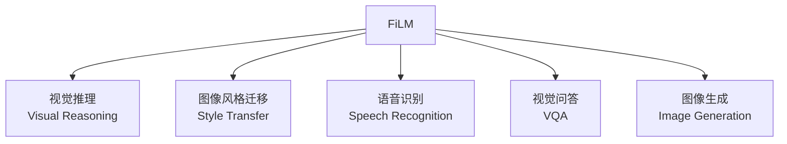

### 3. **可解释性好**

- $\gamma$ 和 $\beta$ 参数可以可视化
- 能够理解模型的决策过程
- 便于调试和优化

### 4. **鲁棒性强**

论文中的消融实验表明：

- 去掉 Batch Normalization 仍然有效
- 调整 ResBlock 数量和特征图数量，性能依然优异
- 对超参数不敏感

---

## 应用场景

### 1. 视觉问答（VQA）

**问题类型**：

- 计数："有多少个红色物体？"
- 比较："哪个物体更大？"
- 关系推理："金属球的右边是什么？"

### 2. 多模态学习

FiLM 天然适合多模态任务：

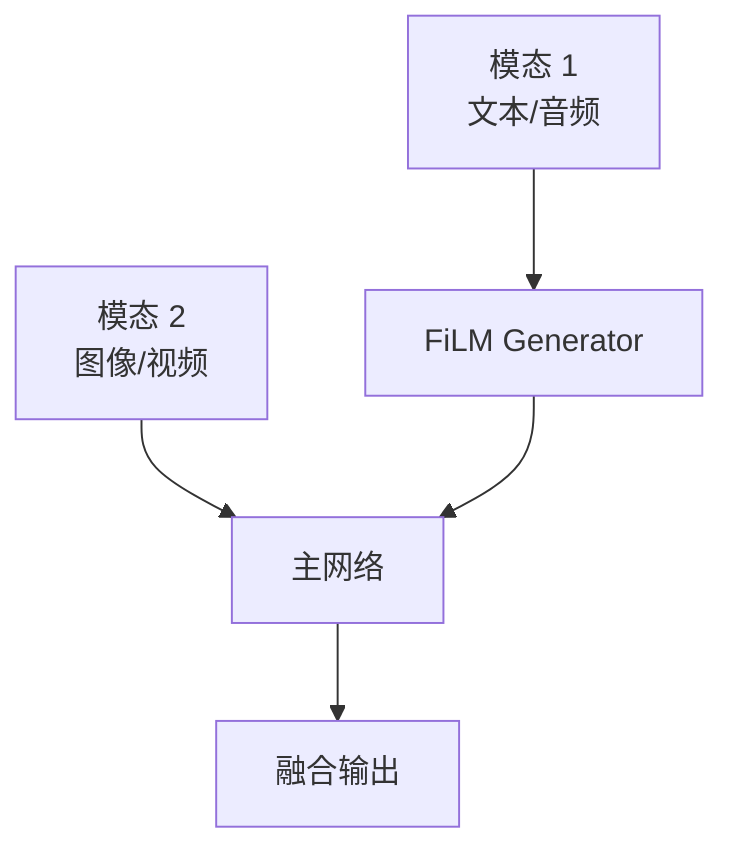

### 3. 条件图像生成

在 GAN 或扩散模型中，使用 FiLM 注入条件信息：

```python
# 伪代码示例
class ConditionalGenerator:
    def forward(self, noise, condition):
        # 生成 FiLM 参数
        gamma, beta = self.film_generator(condition)

        # 生成图像特征
        features = self.feature_extractor(noise)

        # 应用 FiLM 调制
        modulated = gamma * features + beta

        return self.decoder(modulated)
```

### 4. 强化学习

在策略网络中使用 FiLM 注入任务或目标信息。

---

## 与其他方法的比较

### FiLM vs Attention

| 特性       | FiLM                     | Attention            |
| ---------- | ------------------------ | -------------------- |
| 调制方式   | 通道级别（channel-wise） | 空间级别（spatial）  |
| 计算复杂度 | $O(1)$                   | $O(HW)$              |
| 参数数量   | 少（2 per channel）      | 多（注意力权重矩阵） |
| 适用场景   | 条件化特征               | 选择性聚焦           |

- 注意力：$\alpha_c \cdot F_c$，其中 $\alpha_c \in [0,1]$（仅缩放）

- FiLM：$\gamma_c \cdot F_c + \beta_c$，其中 $\gamma_c, \beta_c \in \mathbb{R}$（缩放+平移）

### FiLM vs Concatenation

简单的拼接方法：

```python
# 直接拼接
combined = concat([visual_features, text_embedding])
```

**FiLM 的优势**：

- 更灵活的交互方式
- 参数效率更高
- 性能显著更好

---

## 实现要点

### 核心 FiLM 层实现

```python
# 简化的核心逻辑
class FiLMLayer(nn.Module):
    def forward(self, features, gamma, beta):
        """
        features: (batch, channels, height, width)
        gamma: (batch, channels)
        beta: (batch, channels)
        """
        # 扩展维度以匹配特征图
        gamma = gamma.unsqueeze(-1).unsqueeze(-1)
        beta = beta.unsqueeze(-1).unsqueeze(-1)

        # 应用仿射变换
        return gamma * features + beta
```

### 关键设计决策

1. **何时应用 FiLM**：通常在卷积层之后，激活函数之前
2. **参数共享**：$\gamma$ 和 $\beta$ 的生成器可以共享参数
3. **归一化**：关闭 BN 的可学习参数，让 FiLM 完全控制
4. **残差连接**：必须保留，确保信息流动

---

## 扩展与变体

### 1. Spatially-Adaptive FiLM

不同于原始 FiLM 的通道级调制，空间自适应版本为每个位置生成不同的参数：

$$
\text{SA-FiLM}(F_{i,c,h,w}) = \gamma_{i,c,h,w} \cdot F_{i,c,h,w} + \beta_{i,c,h,w}
$$

### 2. Hypernetwork-based FiLM

使用 hypernetwork 动态生成整个 FiLM 层的参数。

### 3. Multi-scale FiLM

在不同分辨率的特征图上应用 FiLM。

---

## 常见问题

### Q1: FiLM 层应该放在哪里？

**推荐位置**：

- ✅ 卷积层 → BN → **FiLM** → ReLU
- ✅ 卷积层 → **FiLM** → ReLU（不使用 BN）

### Q2: 需要多少个 FiLM 层？

- 论文中使用 **4 个 ResBlock**，每个包含 2 个 FiLM 层
- 更深的网络可以使用更多层
- 需要根据具体任务调整

### Q3: FiLM 是否需要大量数据？

- FiLM 在**少样本场景**下仍然有效
- 相比传统方法，FiLM 的数据效率更高

### Q4: 如何调试 FiLM 模型？

**建议方法**：

1. 可视化 $\gamma$ 和 $\beta$ 的分布
2. 检查不同问题类型对应的参数模式
3. 观察特征图的激活情况

---

## 总结

### FiLM 的核心贡献

1. **简单而强大**：仅用两个参数实现高效的条件化
2. **无需标准化**：打破了条件化必须依赖归一化的假设
3. **性能卓越**：在多个基准测试上达到 SOTA
4. **泛化能力强**：少样本、零样本场景下表现优异

### 何时使用 FiLM？

**适合的场景**：

- ✅ 多模态任务（视觉 + 文本）
- ✅ 需要条件化的生成任务
- ✅ 需要动态调整网络行为
- ✅ 计算资源受限

**不适合的场景**：

- ❌ 单模态任务（没有条件信息）
- ❌ 需要细粒度空间注意力
- ❌ 极简单的分类任务

### 未来方向

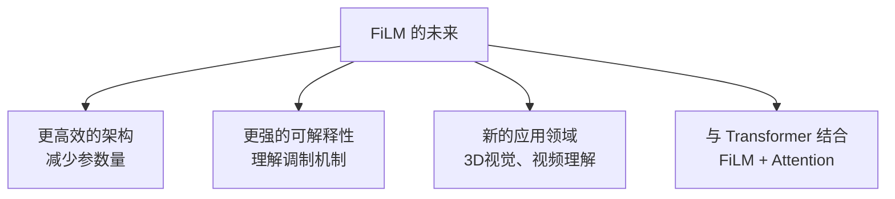

---

**下一步**：在配套的 Jupyter Notebook 中，我们将：

1. 从零实现完整的 FiLM 模型
2. 在 CLEVR 数据集上训练
3. 可视化 FiLM 参数和注意力
4. 进行消融实验
