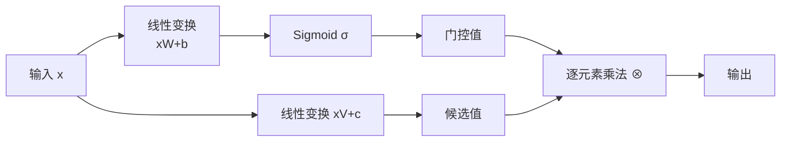
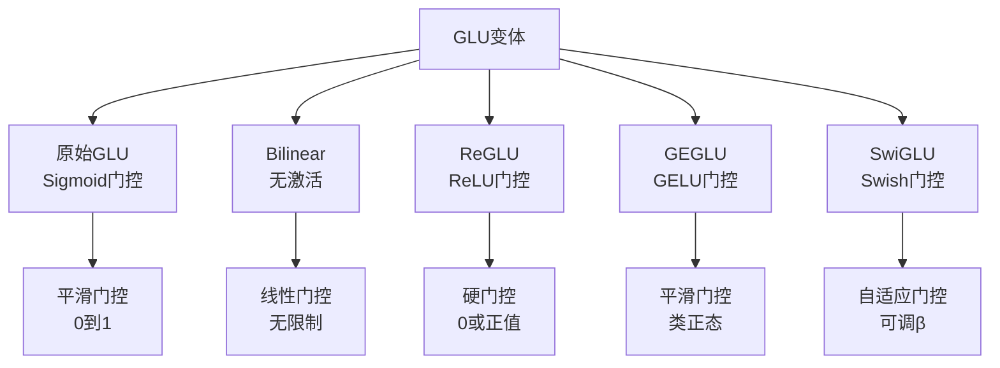
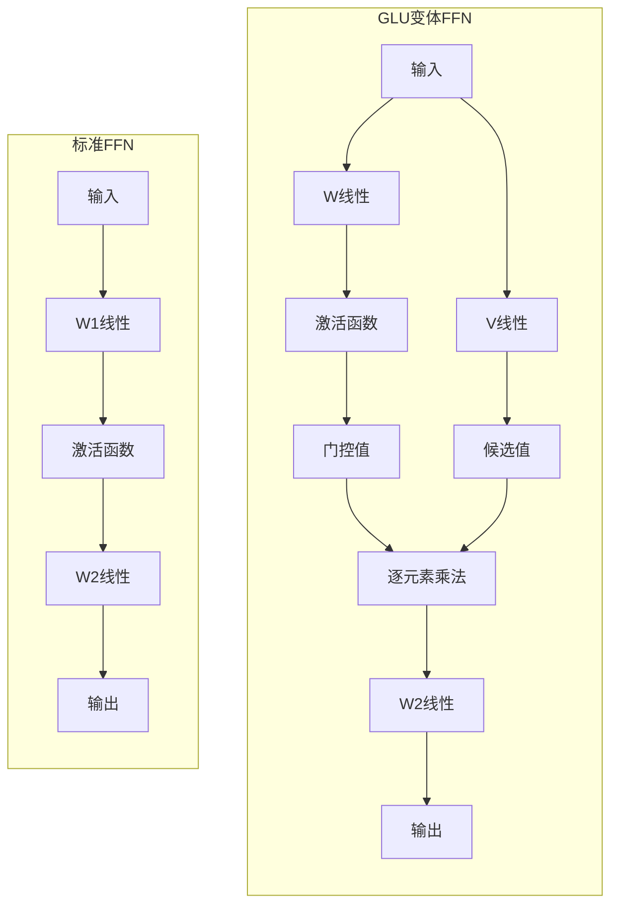
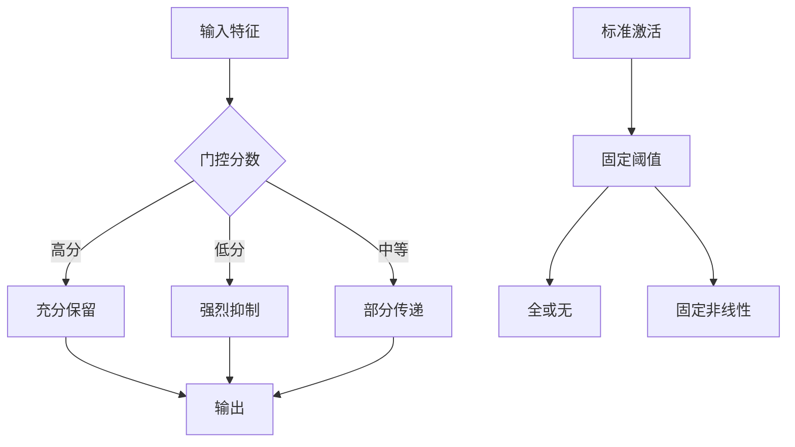

# GLU变体改进Transformer：从基础到实践的完整指南

> **上传者**：[XYChouMian](https://github.com/XYChouMian)  
> **参考论文**：[GLU Variants Improve Transformer](https://arxiv.org/abs/2002.05202)  
> **论文PDF**：[paper.pdf](paper.pdf)  

## 1. 引言

在深度学习的发展历程中，激活函数一直扮演着至关重要的角色。从最初的Sigmoid、ReLU，到后来的GELU、Swish，研究者们不断探索更优的非线性变换方式。2020年，Google的Noam Shazeer提出了一系列基于**门控线性单元（Gated Linear Units, GLU）**的变体，并在Transformer架构中取得了显著的性能提升。

本教程将带你深入理解GLU及其变体的原理、实现和应用，帮助你在自己的项目中应用这些先进技术。

---

## 2. 什么是门控线性单元（GLU）？

### 2.1 基本概念

**门控线性单元（Gated Linear Units, GLU）**最早由Dauphin等人在2016年提出，用于语言建模任务。其核心思想是：**通过一个门控机制来控制信息流动**。

GLU的数学定义如下：

$$
\text{GLU}(x, W, V, b, c) = \sigma(xW + b) \otimes (xV + c)
$$

其中：

- $x$ 是输入向量
- $W$ 和 $V$ 是两个不同的权重矩阵
- $b$ 和 $c$ 是偏置项
- $\sigma$ 是Sigmoid激活函数
- $\otimes$ 表示逐元素乘法（element-wise product）

### 2.2 GLU的直观理解

我们可以把GLU分解为两个部分：



- **门控路径**（上路）：$\sigma(xW + b)$ 产生0到1之间的值，决定有多少信息可以通过
- **值路径**（下路）：$(xV + c)$ 产生候选值，表示想要传递的信息
- **最终输出**：两者逐元素相乘，门控值"调节"候选值的强度

这种机制类似于LSTM中的门控机制，但更简洁高效。

---

## 3. GLU的变体家族

Shazeer的核心贡献在于：**用不同的激活函数替换Sigmoid，创造出一系列GLU变体**。

### 3.1 变体定义

以下是主要的GLU变体：

#### **Bilinear（双线性）**

完全移除激活函数：

$$
\text{Bilinear}(x, W, V, b, c) = (xW + b) \otimes (xV + c)
$$

#### **ReGLU**

使用ReLU激活：

$$
\text{ReGLU}(x, W, V, b, c) = \max(0, xW + b) \otimes (xV + c)
$$

#### **GEGLU**

使用GELU激活：

$$
\text{GEGLU}(x, W, V, b, c) = \text{GELU}(xW + b) \otimes (xV + c)
$$

其中 $\text{GELU}(x) = x \cdot \Phi(x)$，$\Phi(x)$ 是标准正态分布的累积分布函数。

#### **SwiGLU**

使用Swish激活：

$$
\text{SwiGLU}(x, W, V, b, c, \beta) = \text{Swish}_\beta(xW + b) \otimes (xV + c)
$$

其中 $\text{Swish}_\beta(x) = x \cdot \sigma(\beta x)$。

### 3.2 变体对比



---

## 4. 在Transformer中应用GLU

### 4.1 标准Transformer FFN层

标准Transformer的前馈网络（FFN）结构如下：

$$
\text{FFN}(x, W_1, W_2, b_1, b_2) = \max(0, xW_1 + b_1)W_2 + b_2
$$

其架构为：


特点：

- 两个权重矩阵 $W_1$（$d_{model} \times d_{ff}$）和 $W_2$（$d_{ff} \times d_{model}$）
- 中间隐藏维度 $d_{ff}$ 通常是 $d_{model}$ 的4倍
- 单一激活函数（通常是ReLU或GELU）

### 4.2 GLU变体FFN层

使用GLU变体替换标准FFN（省略偏置项以简化）：

$$
\text{FFN}_{\text{GLU}}(x, W, V, W_2) = (\sigma(xW) \otimes xV)W_2
$$

更通用的形式：

$$
\text{FFN}_{\text{Variant}}(x, W, V, W_2) = (\text{Activation}(xW) \otimes xV)W_2
$$

架构对比：



### 4.3 参数量平衡

关键问题：GLU变体使用**三个权重矩阵**（$W$, $V$, $W_2$），而标准FFN只用**两个**（$W_1$, $W_2$）。

为了保持参数量和计算量一致，论文采用的策略：

**将隐藏层维度缩减为原来的 $\frac{2}{3}$**

- 标准FFN：$d_{ff} = 3072$（参数量 ≈ $2 \times d_{model} \times d_{ff}$）
- GLU变体FFN：$d_{ff} = 2048$（参数量 ≈ $3 \times d_{model} \times \frac{2}{3}d_{ff}$）

$$
\text{参数量}_{\text{GLU}} = d_{model} \times \frac{2}{3}d_{ff} + d_{model} \times \frac{2}{3}d_{ff} + \frac{2}{3}d_{ff} \times d_{model} = 2 \times d_{model} \times d_{ff}
$$

这样两者的参数量完全相同。

---

## 5. 实验结果与性能分析

### 5.1 实验设置

论文基于**T5（Text-to-Text Transfer Transformer）**模型进行实验：

- **模型规模**：Base规模，编码器和解码器各12层
- **模型维度**：$d_{model} = 768$，注意力头数 $h = 12$
- **预训练任务**：去噪目标（预测缺失文本片段）
- **微调任务**：GLUE、SuperGLUE、SQuAD等语言理解基准

### 5.2 预训练困惑度（Perplexity）

在相同参数量和计算量下，各变体的困惑度对比：

| FFN变体         | 65K步     | 524K步    |
| --------------- | --------- | --------- |
| FFN-ReLU (基线) | 1.997     | 1.677     |
| FFN-GELU        | 1.983     | 1.679     |
| FFN-Swish       | 1.994     | 1.683     |
| FFN-GLU         | 1.982     | 1.663     |
| FFN-Bilinear    | 1.960     | 1.648     |
| **FFN-GEGLU**   | **1.942** | **1.633** |
| **FFN-SwiGLU**  | **1.944** | **1.636** |
| FFN-ReGLU       | 1.953     | 1.645     |

**关键发现**：

- ✅ **GEGLU和SwiGLU表现最佳**，困惑度显著低于ReLU基线
- ✅ 所有GLU变体都优于标准FFN
- ✅ 训练后期（524K步）优势更明显

### 5.3 下游任务性能

#### GLUE基准测试（部分任务）

| 模型           | CoLA      | SST-2     | MRPC      | QQP       | MNLI      | 平均      |
| -------------- | --------- | --------- | --------- | --------- | --------- | --------- |
| FFN-ReLU       | 51.32     | 94.04     | 93.08     | 91.75     | 85.83     | 83.80     |
| **FFN-GEGLU**  | **53.65** | 93.92     | 92.68     | **91.85** | 86.15     | 84.12     |
| **FFN-SwiGLU** | 51.59     | **93.92** | **92.23** | 91.87     | **86.45** | **84.36** |

#### SuperGLUE基准测试（部分任务）

| 模型           | BoolQ     | CB        | ReCoRD    | RTE       | 平均      |
| -------------- | --------- | --------- | --------- | --------- | --------- |
| FFN-ReLU       | 80.15     | 83.37     | 73.73     | 83.39     | 72.76     |
| FFN-GEGLU      | 81.19     | 82.09     | **75.28** | 83.39     | 73.96     |
| **FFN-SwiGLU** | **81.19** | **82.39** | 75.35     | **85.20** | **74.56** |

#### SQuAD问答任务

| 模型          | Exact Match | F1 Score  |
| ------------- | ----------- | --------- |
| FFN-ReLU      | 83.18       | 90.87     |
| FFN-GEGLU     | 83.55       | 91.12     |
| **FFN-ReGLU** | **83.53**   | **91.18** |

**总体结论**：

- 🏆 **GEGLU、SwiGLU和ReGLU**在大多数任务上表现最佳
- 📈 性能提升虽然不是压倒性的，但在多个任务上一致优于基线
- ⚖️ 在相同计算预算下获得更好效果

---

## 6. 核心代码实现

### 6.1 标准FFN实现

```python
import torch
import torch.nn as nn

class StandardFFN(nn.Module):
    def __init__(self, d_model, d_ff, dropout=0.1):
        super().__init__()
        self.w1 = nn.Linear(d_model, d_ff)
        self.w2 = nn.Linear(d_ff, d_model)
        self.dropout = nn.Dropout(dropout)

    def forward(self, x):
        return self.w2(self.dropout(torch.relu(self.w1(x))))
```

### 6.2 GLU变体基类

```python
class GLUVariant(nn.Module):
    def __init__(self, d_model, d_ff, activation, dropout=0.1):
        super().__init__()
        # 缩减到2/3以保持参数量
        self.d_ff_adjusted = int(d_ff * 2 / 3)

        self.w = nn.Linear(d_model, self.d_ff_adjusted, bias=False)
        self.v = nn.Linear(d_model, self.d_ff_adjusted, bias=False)
        self.w2 = nn.Linear(self.d_ff_adjusted, d_model, bias=False)
        self.dropout = nn.Dropout(dropout)
        self.activation = activation

    def forward(self, x):
        gate = self.activation(self.w(x))  # 门控值
        value = self.v(x)                   # 候选值
        return self.w2(self.dropout(gate * value))
```

### 6.3 具体变体实现

```python
# GEGLU
class GEGLU(GLUVariant):
    def __init__(self, d_model, d_ff, dropout=0.1):
        super().__init__(d_model, d_ff, nn.GELU(), dropout)

# SwiGLU
class SwiGLU(GLUVariant):
    def __init__(self, d_model, d_ff, dropout=0.1):
        super().__init__(d_model, d_ff, nn.SiLU(), dropout)  # SiLU = Swish

# ReGLU
class ReGLU(GLUVariant):
    def __init__(self, d_model, d_ff, dropout=0.1):
        super().__init__(d_model, d_ff, nn.ReLU(), dropout)
```

---

## 7. 为什么GLU变体更有效？

### 7.1 理论分析

尽管论文作者**幽默地将成功归因于"神的恩典"**（divine benevolence），我们可以从以下角度理解：

#### **1. 更丰富的表达能力**

标准FFN：

$$
\text{output} = \text{Activation}(xW_1)W_2
$$

GLU变体：

$$
\text{output} = (\text{Activation}(xW) \otimes xV)W_2
$$

GLU通过**两条独立路径**处理输入，一条决定"激活什么"，另一条决定"传递什么"，这种分离提供了更灵活的信息流控制。

#### **2. 动态特征选择**

门控机制本质上是**软性的特征选择**：

- 对于重要特征，门控值接近1，充分保留
- 对于不重要特征，门控值接近0，抑制传递
- 这种动态性比固定的激活函数更适应不同输入

#### **3. 梯度流动更好**

GLU的乘法门控为梯度提供了**直接路径**：

$$
\frac{\partial \text{GLU}}{\partial V} = \text{gate} \odot \frac{\partial L}{\partial \text{output}}
$$

即使门控值很小，梯度仍能通过$V$路径反向传播，减少梯度消失问题。

### 7.2 可视化理解



---

## 8. 实践建议与应用场景

### 8.1 何时使用GLU变体？

✅ **推荐使用的场景**：

- **Transformer类模型**：BERT、GPT、T5等的FFN层
- **计算资源充足**：可以承受略微增加的参数量
- **追求性能极限**：在Benchmark上争取每一点提升
- **长序列建模**：更好的梯度流动有助于长距离依赖

⚠️ **谨慎使用的场景**：

- **边缘设备部署**：参数量和计算量是硬约束
- **已有强大基线**：收益可能被其他因素掩盖
- **训练不稳定**：门控机制可能增加调优难度

### 8.2 选择哪个变体？

根据论文实验：

| 变体       | 优势                       | 劣势                   |
| ---------- | -------------------------- | ---------------------- |
| **GEGLU**  | 预训练困惑度最低，整体稳定 | 在某些任务上不是最佳   |
| **SwiGLU** | 下游任务表现最好，泛化强   | 需要调整β参数          |
| **ReGLU**  | 实现简单，训练快速         | 性能略逊前两者         |
| Bilinear   | 完全线性，可解释性强       | 缺少非线性，表达力受限 |

**推荐策略**：

1. **默认选择**：GEGLU或SwiGLU
2. **快速实验**：ReGLU（最接近原始ReLU）
3. **特殊需求**：根据具体任务微调选择

### 8.3 超参数设置

基于论文经验：

```python
# 推荐配置
config = {
    'd_model': 768,
    'd_ff': 3072,              # 标准FFN的隐藏层大小
    'd_ff_glu': 2048,          # GLU变体缩减到2/3
    'dropout': 0.1,
    'activation': 'geglu',     # 或 'swiglu'
    'learning_rate': 1e-3,
    'warmup_steps': 10000
}
```

**注意事项**：

- 保持总参数量一致以公平比较
- 微调时使用dropout（论文用0.1）
- 学习率可能需要略微调整

---

## 9. 扩展阅读与最新进展

### 9.1 后续研究

GLU变体的成功激发了更多研究：

1. **Llama系列**：Meta的Llama和Llama 2使用SwiGLU作为标准FFN
2. **PaLM模型**：Google的PaLM也采用了SwiGLU
3. **架构搜索**：自动搜索最优门控激活函数的工作

### 9.2 相关技术

- **Mixture of Experts (MoE)**：门控思想的扩展，动态选择专家网络
- **Gated Convolutions**：在CNN中应用类似门控机制
- **Attention Gating**：在注意力层中引入门控

### 9.3 开源实现参考

- **Hugging Face Transformers**：已集成SwiGLU支持
- **PyTorch官方**：`torch.nn.SiLU()`即为Swish
- **LLaMA源码**：Meta开源的完整SwiGLU实现

---

## 10. 总结

### 核心要点回顾

1. **GLU的本质**：通过门控机制动态调节信息流动
2. **变体创新**：用不同激活函数（GELU、Swish等）替换原始Sigmoid
3. **Transformer应用**：在FFN层替换标准ReLU/GELU激活
4. **性能提升**：在相同计算预算下，GEGLU和SwiGLU一致优于基线
5. **实践价值**：已被Llama、PaLM等主流模型采用

### 最后的思考

虽然GLU变体的改进看似简单——只是改变了激活函数和增加了一个门控路径——但它体现了深度学习研究的重要原则：

> **架构创新不一定需要复杂的理论，简洁的设计加上扎实的实验验证同样能带来突破。**

正如Noam Shazeer在论文结尾所说："我们无法解释为什么这些架构有效，只能将它们的成功归因于神的恩典。" 这种幽默背后，是对经验主义方法的认可——有时候，让数据说话比过度解释更重要。

---

## 附录：符号说明

| 符号                  | 含义                       |
| --------------------- | -------------------------- |
| $x$                   | 输入向量                   |
| $W, V, W_1, W_2$      | 权重矩阵                   |
| $b, c$                | 偏置项                     |
| $d_{model}$           | 模型隐藏维度               |
| $d_{ff}$              | FFN中间层维度              |
| $\sigma(\cdot)$       | Sigmoid函数                |
| $\otimes$             | 逐元素乘法                 |
| $\text{GELU}(\cdot)$  | Gaussian Error Linear Unit |
| $\text{Swish}(\cdot)$ | Swish激活函数              |

---

**📚 进一步学习资源**：

- 原始论文：https://arxiv.org/abs/2002.05202
- T5论文：https://arxiv.org/abs/1910.10683
- Llama论文：https://arxiv.org/abs/2302.13971
