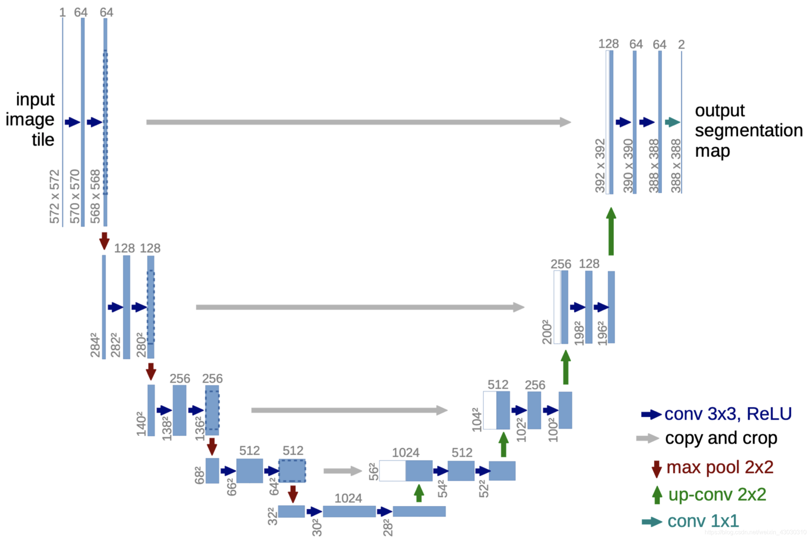

# U-Net：图像分割入门

U-Net是2015年提出的一个用于图像分割的深度学习网络，因其网络结构呈"U"型而得名。它最初为医学图像分割设计，但现在已广泛应用于各类图像分割任务。

## 核心思想

U-Net采用**编码器-解码器**结构：编码器逐步压缩图像提取特征，解码器逐步恢复尺寸生成分割结果。最关键的创新是**跳跃连接**（Skip Connections）——将编码器各层的特征直接传递给解码器对应层，使网络既能理解"这是什么"（高层语义），又能精确定位"在哪里"（低层细节）。这种设计让U-Net即使在小数据集上也能实现精确的边界分割。

> 
> U-Net 结构示意图

## 为什么选择U-Net？

- **少样本友好**：只需少量标注数据就能训练
- **分割精确**：跳跃连接保留细节，边界清晰
- **结构简洁**：易于理解和实现
- **应用广泛**：医学影像、遥感图像、自动驾驶等

## 深入学习

下面的链接包含了U-Net的详细原理、网络结构细节、代码实现、应用案例和进阶变体等内容，帮助你全面掌握U-Net：

[U-Net 全解析：从网络架构、核心原理到 PyTorch 代码实现_u-net架构-CSDN博客](https://blog.csdn.net/AggressiveYu/article/details/151256739)

U-Net 实际应用的范例：

[Learning spatiotemporal dynamics with a pretrained generative model](../../part4_paper_reading/WQX/pretrained_generative_model/pretrained_generative_model.md)

[FlowNet: Learning Optical Flow with Convolutional Networks](../../part4_paper_reading/WQX/FlowNet/FlowNet.md)

[Dense motion estimation of particle images via a convolutional neural network](https://link.springer.com/article/10.1007/s00348-019-2717-2)

通过这些资源，你将了解U-Net的完整技术细节，并能动手实践完成自己的图像分割项目。
