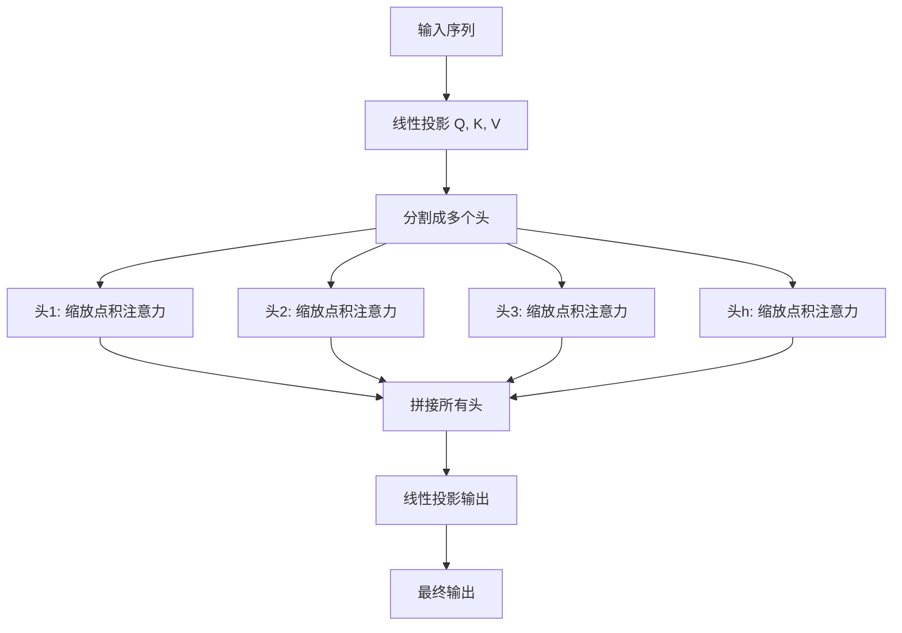
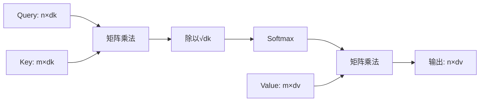
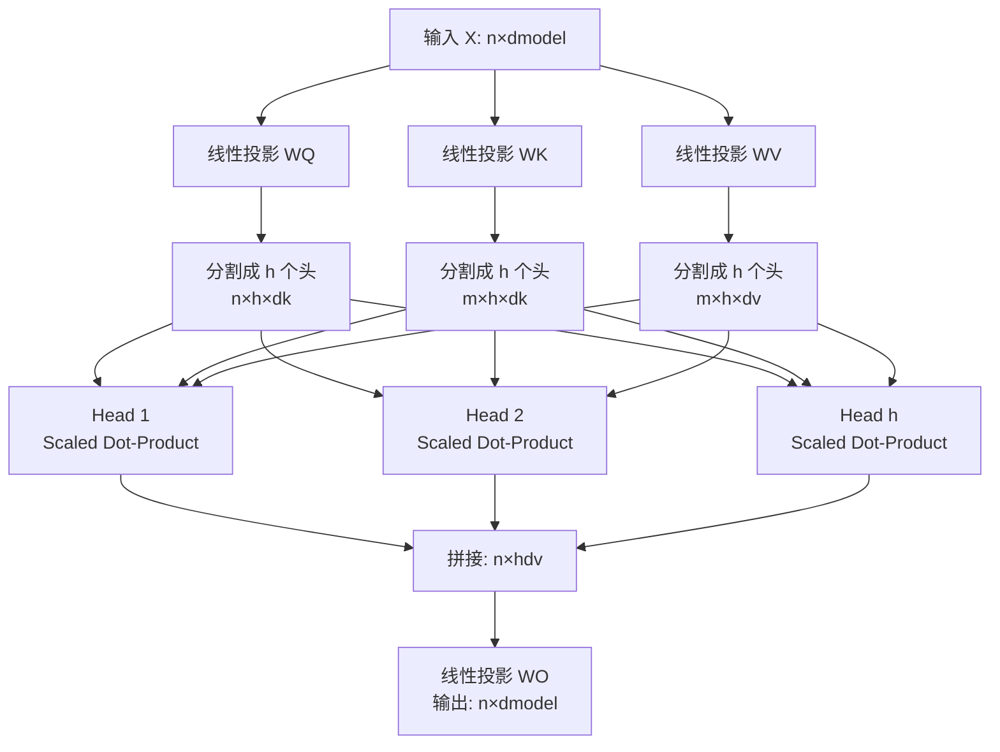
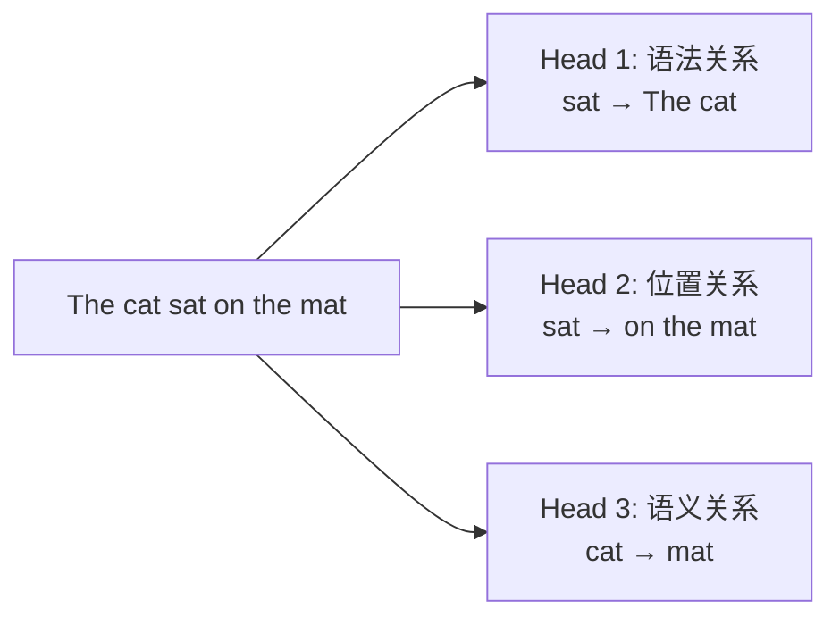
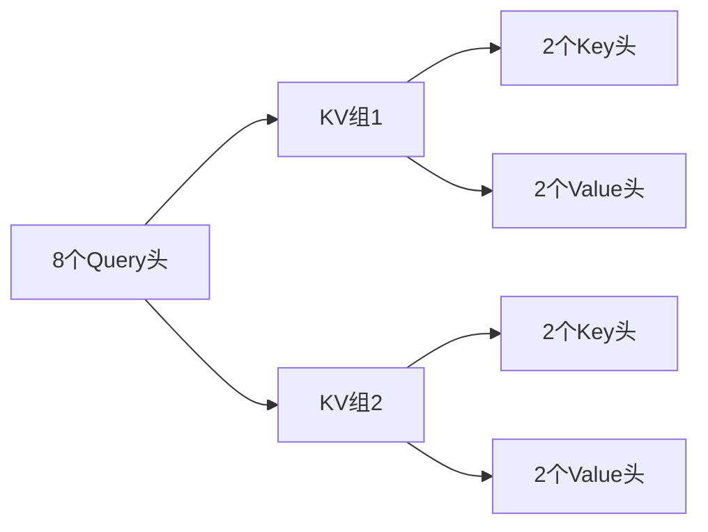

# 多头注意力机制（Multi-Head Attention）完全教程

## 1. 引言

多头注意力（Multi-Head Attention, MHA）是 Transformer 架构的核心组件，由 Vaswani 等人在 2017 年的论文 [Attention Is All You Need](https://dl.acm.org/doi/10.5555/3295222.3295349) 中首次提出。它通过并行运行多个注意力机制，使模型能够同时关注输入序列在不同表示子空间的信息。



## 2. 从单头注意力到多头注意力

### 2.1 缩放点积注意力（Scaled Dot-Product Attention）

在理解多头注意力之前，我们先回顾单头的缩放点积注意力机制。

**核心思想**：通过查询（Query）与键（Key）的相似度来决定对值（Value）的加权。

**计算公式**：

$$
\text{Attention}(Q, K, V) = \text{softmax}\left(\frac{QK^T}{\sqrt{d_k}}\right)V
$$

其中：

- $Q \in \mathbb{R}^{n \times d_k}$ 是查询矩阵
- $K \in \mathbb{R}^{m \times d_k}$ 是键矩阵
- $V \in \mathbb{R}^{m \times d_v}$ 是值矩阵
- $d_k$ 是键的维度
- $n$ 是查询序列长度，$m$ 是键值序列长度

**为什么要缩放？** 当 $d_k$ 较大时，点积的值会变得很大，导致 softmax 函数进入梯度很小的区域。除以 $\sqrt{d_k}$ 可以缓解这个问题。



### 2.2 单头注意力的局限性

单头注意力只能从一个表示子空间学习特征。例如：

- 在翻译任务中，一个头可能关注语法结构
- 但无法同时关注语义信息、位置关系等

**解决方案**：使用多个注意力头，让每个头关注不同的特征。

## 3. 多头注意力机制详解

### 3.1 核心思想

多头注意力将 $Q$、$K$、$V$ 线性投影到 $h$ 个不同的低维子空间，在每个子空间独立计算注意力，最后将结果拼接并再次投影。

### 3.2 数学定义

$$
\text{MultiHead}(Q, K, V) = \text{Concat}(\text{head}_1, \ldots, \text{head}_h)W^O
$$

其中每个头的计算为：

$$
\text{head}_i = \text{Attention}(QW_i^Q, KW_i^K, VW_i^V)
$$

**参数矩阵**：

- $W_i^Q \in \mathbb{R}^{d_{\text{model}} \times d_k}$：第 $i$ 个头的查询投影矩阵
- $W_i^K \in \mathbb{R}^{d_{\text{model}} \times d_k}$：第 $i$ 个头的键投影矩阵
- $W_i^V \in \mathbb{R}^{d_{\text{model}} \times d_v}$：第 $i$ 个头的值投影矩阵
- $W^O \in \mathbb{R}^{hd_v \times d_{\text{model}}}$：输出投影矩阵

**典型配置**（以 Transformer base 为例）：

- $d_{\text{model}} = 512$（模型维度）
- $h = 8$（头数）
- $d_k = d_v = d_{\text{model}} / h = 64$（每个头的维度）

### 3.3 完整计算流程



**逐步解析**：

**① 线性投影**：将输入 $X$ 分别投影为 $Q$、$K$、$V$ - $Q = XW^Q$，$K = XW^K$，$V = XW^V$

**② 分割成多个头**：将 $Q$、$K$、$V$ 重塑为 $(n, h, d_k)$ 的形状 - 原始维度：$n \times d_{\text{model}}$ - 分割后：$n \times h \times (d_{\text{model}}/h)$

**③ 并行注意力**：对每个头独立计算注意力

$$
\text{head}_i = \text{softmax}\left(\frac{Q_iK_i^T}{\sqrt{d_k}}\right)V_i
$$

**④ 拼接**：将所有头的输出在最后一维拼接 - 每个头输出：$n \times d_v$ - 拼接后：$n \times (h \cdot d_v) = n \times d_{\text{model}}$

**⑤ 输出投影**：通过 $W^O$ 得到最终输出

$$
\text{Output} = \text{Concat}(\text{head}_1, \ldots, \text{head}_h)W^O
$$

## 4. 为什么多头注意力有效？

### 4.1 捕获不同类型的依赖关系

多个头可以学习不同的注意力模式：



- **Head 1** 可能关注主谓关系
- **Head 2** 可能关注位置修饰关系
- **Head 3** 可能关注语义相关性

### 4.2 增加模型容量

通过将高维空间分解为多个低维子空间：

- 参数效率：$h$ 个小矩阵比一个大矩阵更灵活
- 计算效率：可以并行计算
- 表达能力：能够建模复杂的特征交互

### 4.3 正则化效果

多个头之间的隐式集成提供了类似 dropout 的正则化作用，降低过拟合风险。

## 5. 实现要点

### 5.1 核心代码框架

```python
import torch
import torch.nn as nn
import torch.nn.functional as F

class MultiHeadAttention(nn.Module):
    def __init__(self, d_model, num_heads):
        super().__init__()
        assert d_model % num_heads == 0

        self.d_model = d_model
        self.num_heads = num_heads
        self.d_k = d_model // num_heads

        # 线性变换层
        self.W_q = nn.Linear(d_model, d_model)
        self.W_k = nn.Linear(d_model, d_model)
        self.W_v = nn.Linear(d_model, d_model)
        self.W_o = nn.Linear(d_model, d_model)

    def forward(self, Q, K, V, mask=None):
        batch_size = Q.size(0)

        # 线性变换并分割成多头
        Q = self.W_q(Q).view(batch_size, -1, self.num_heads, self.d_k).transpose(1, 2)
        K = self.W_k(K).view(batch_size, -1, self.num_heads, self.d_k).transpose(1, 2)
        V = self.W_v(V).view(batch_size, -1, self.num_heads, self.d_k).transpose(1, 2)

        # 计算注意力（省略细节）
        scores = torch.matmul(Q, K.transpose(-2, -1)) / torch.sqrt(torch.tensor(self.d_k))
        if mask is not None:
            scores = scores.masked_fill(mask == 0, -1e9)
        attn = F.softmax(scores, dim=-1)
        output = torch.matmul(attn, V)

        # 合并多头并通过输出层
        output = output.transpose(1, 2).contiguous().view(batch_size, -1, self.d_model)
        return self.W_o(output)
```

### 5.2 关键技巧

**维度重塑**：使用 `view` 和 `transpose` 高效地分割和合并头

```python
# 分割：(B, L, d_model) -> (B, L, h, d_k) -> (B, h, L, d_k)
Q = Q.view(batch_size, -1, num_heads, d_k).transpose(1, 2)
```

**掩码机制**：支持 padding mask 和 causal mask

```python
scores = scores.masked_fill(mask == 0, -1e9)  # 被掩码的位置注意力为 0
```

## 6. 变体与扩展

### 6.1 Grouped Query Attention (GQA)

[论文链接](https://arxiv.org/abs/2305.13245) - 减少 KV 缓存，提高推理效率：

$$
\text{GQA: } \text{num\_kv\_heads} < \text{num\_query\_heads}
$$



### 6.2 Multi-Query Attention (MQA)

极端情况：所有查询头共享同一组 KV

- 优点：大幅减少推理时的内存占用
- 缺点：表达能力略有下降

### 6.3 Flash Attention

[FlashAttention: Fast and Memory-Efficient Exact Attention with IO-Awareness](https://arxiv.org/abs/2205.14135) - 通过 IO 优化加速计算：

- 将注意力计算分块，减少 GPU 全局内存访问
- 可实现 2-4 倍加速，同时保持数值精度

### 6.4 Multi-Head Attention (MLA)

[DeepSeek-V2: A Strong, Economical, and Efficient Mixture-of-Experts Language Model](https://arxiv.org/abs/2405.04434)

论文提出通过低秩分解大幅降低 KV 缓存开销，同时保持模型表达能力。

**核心思想：**将高维的 KV 投影压缩到低维潜在空间，再在注意力计算时解压。

## 7. 实践建议

### 7.1 超参数选择

| 参数                        | 典型值         | 说明                                   |
| --------------------------- | -------------- | -------------------------------------- |
| 头数 $h$                    | 8, 12, 16      | 通常是 2 的幂次，便于硬件优化          |
| 每头维度 $d_k$              | 64, 128        | 过小会限制表达能力，过大会增加计算成本 |
| 模型维度 $d_{\text{model}}$ | 512, 768, 1024 | 满足 $d_{\text{model}} = h \times d_k$ |

### 7.2 常见问题

**Q1: 为什么要除以 $\sqrt{d_k}$？**  
A: 防止点积值过大导致 softmax 饱和，使梯度更稳定。

**Q2: 多头数量是否越多越好？**  
A: 不一定。头数增加会带来边际收益递减，同时增加计算和内存开销。实践中 8-16 个头通常已足够。

**Q3: 如何可视化注意力权重？**  
A: 可以绘制注意力矩阵的热力图，观察模型关注的位置。工具如 [BertViz](https://github.com/jessevig/bertviz) 提供了交互式可视化。

## 8. 总结

多头注意力机制的核心优势：

1. **多样性**：不同的头学习不同的表示子空间
2. **并行性**：各头独立计算，高效利用硬件
3. **灵活性**：适用于自注意力、交叉注意力等多种场景

从 Transformer 到 GPT、BERT、ViT，多头注意力已成为现代深度学习的基石组件。理解其原理是掌握大模型架构的关键一步。

---

**延伸阅读**：

- [The Illustrated Transformer](http://jalammar.github.io/illustrated-transformer/) - Jay Alammar 的可视化教程

- [Formal Algorithms for Transformers](https://arxiv.org/abs/2207.09238) - 严谨的数学描述

- [Self-Attention 和 Multi-Head Attention 的区别——附最通俗理解 - CSDN博客](https://blog.csdn.net/leonardotu/article/details/135886678)

- [深度剖析Deepseek 多头潜在注意力（MLA） - 知乎](https://zhuanlan.zhihu.com/p/30381453444)
