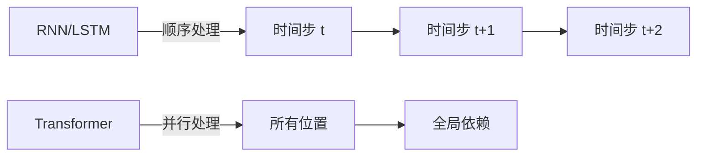
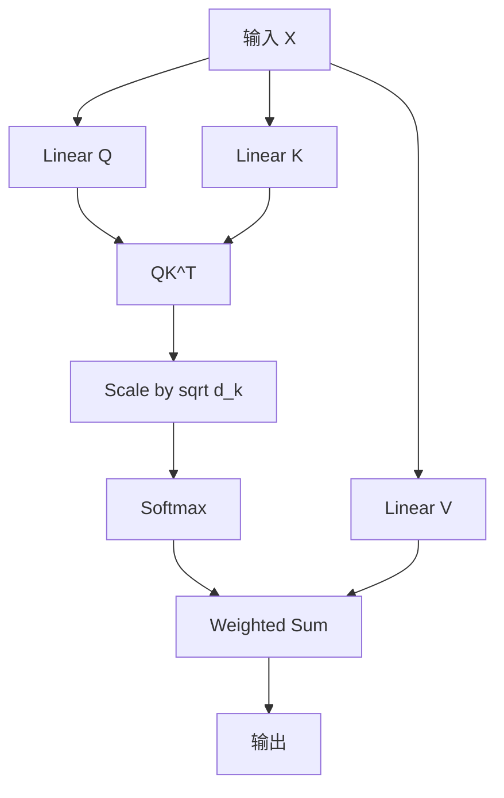
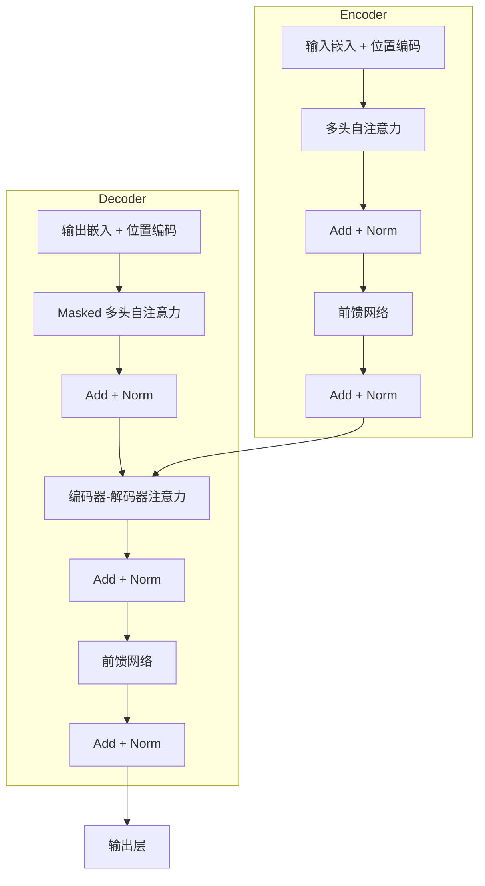
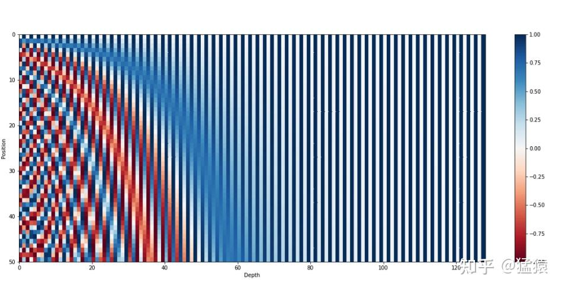
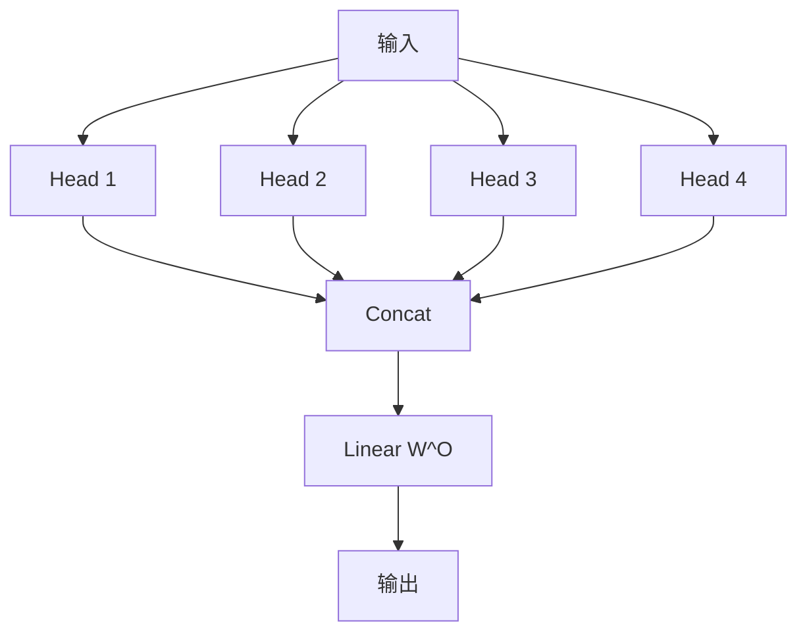
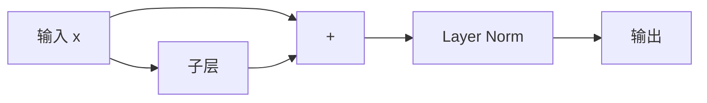
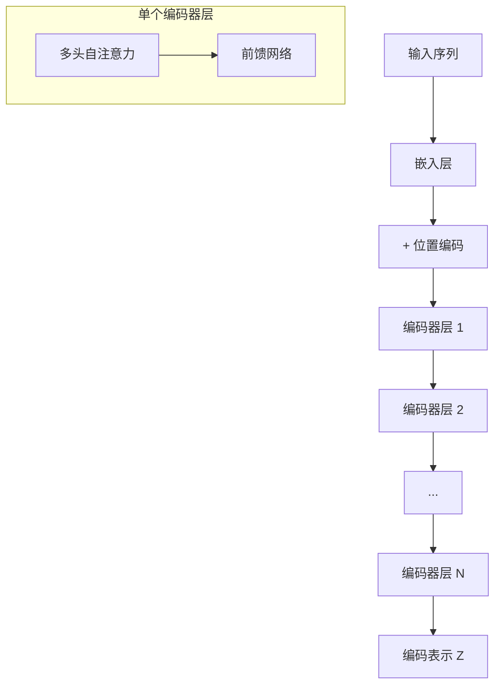
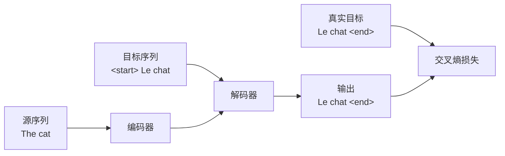
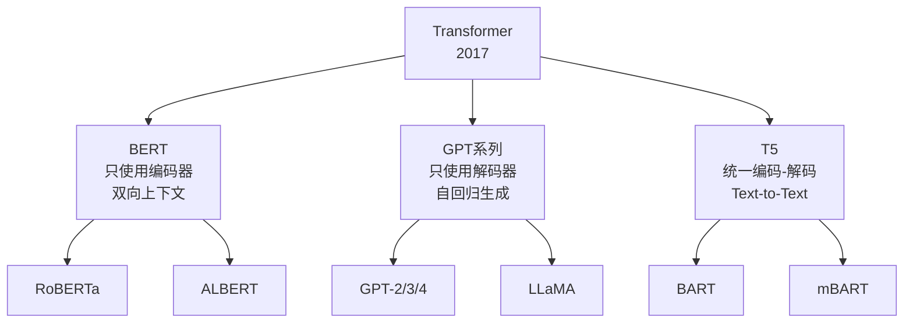

# Transformer 完全教程：从零开始理解注意力机制

> **上传者**：[XYChouMian](https://github.com/XYChouMian)  
> **参考论文**：[Attention Is All You Need](https://dl.acm.org/doi/10.5555/3295222.3295349)  
> **论文PDF**：[paper.pdf](paper.pdf)  

---

## 引言：为什么需要 Transformer

在 Transformer 出现之前，序列建模主要依赖于循环神经网络（RNN）和长短期记忆网络（LSTM）。这些模型存在以下问题：

- **顺序依赖性**：必须按顺序处理输入，无法并行化
- **长距离依赖问题**：难以捕获远距离的依赖关系
- **梯度消失/爆炸**：训练深层网络时的数值稳定性问题

2017 年，Google 团队在论文 [Attention Is All You Need](https://dl.acm.org/doi/10.5555/3295222.3295349) 中提出了 Transformer 架构，完全基于注意力机制，彻底解决了上述问题。



---

## 核心概念：自注意力机制

### 什么是注意力？

注意力机制的核心思想是：**在处理某个位置的信息时，动态地关注输入序列中所有位置的信息，并根据相关性赋予不同的权重。**

举个例子，翻译句子 "The cat sat on the mat" 时：

- 翻译 "sat"（坐）时，我们需要关注 "cat"（主语）和 "mat"（地点）
- 注意力机制自动学习这种关联

### 自注意力的数学原理

自注意力通过三个可学习的变换矩阵生成 Query（查询）、Key（键）和 Value（值）：

$$
Q = XW^Q, \quad K = XW^K, \quad V = XW^V
$$

其中 $X \in \mathbb{R}^{n \times d}$ 是输入序列（$n$ 是序列长度，$d$ 是特征维度）。

**注意力分数计算**：

$$
\text{Attention}(Q, K, V) = \text{softmax}\left(\frac{QK^T}{\sqrt{d_k}}\right)V
$$

让我们逐步理解这个公式：

1. **$QK^T$**：计算每个 Query 与所有 Key 的相似度（点积）
2. **$\frac{1}{\sqrt{d_k}}$**：缩放因子，防止点积过大导致 softmax 梯度消失
3. **softmax**：将相似度转换为概率分布（权重和为 1）
4. **乘以 $V$**：根据权重对 Value 加权求和



### 示例代码：简单的自注意力实现

```python
import torch
import torch.nn.functional as F

def self_attention(X, d_k):
    """
    X: (batch, seq_len, d_model)
    d_k: key/query 的维度
    """
    # 简化版：假设 Q=K=V=X
    Q = K = V = X

    # 计算注意力分数
    scores = torch.matmul(Q, K.transpose(-2, -1)) / torch.sqrt(torch.tensor(d_k, dtype=torch.float32))

    # softmax 归一化
    attention_weights = F.softmax(scores, dim=-1)

    # 加权求和
    output = torch.matmul(attention_weights, V)

    return output, attention_weights

# 示例
X = torch.randn(1, 5, 64)  # 1 个样本，序列长度 5，特征维度 64
output, weights = self_attention(X, d_k=64)
print(f"输出形状: {output.shape}")  # (1, 5, 64)
print(f"注意力权重形状: {weights.shape}")  # (1, 5, 5)
```

---

## Transformer 架构详解

Transformer 采用编码器-解码器（Encoder-Decoder）结构：



### 关键组件

| 组件     | 功能               | 数量            |
| -------- | ------------------ | --------------- |
| 编码器层 | 提取输入序列的表示 | $N=6$           |
| 解码器层 | 生成输出序列       | $N=6$           |
| 注意力头 | 多角度捕获依赖关系 | $h=8$           |
| 模型维度 | 特征向量大小       | $d_{model}=512$ |

---

## 位置编码

Transformer 没有循环结构，因此需要显式地注入位置信息。原论文使用正弦和余弦函数：

$$
\begin{aligned}
PE_{(pos, 2i)} &= \sin\left(\frac{pos}{10000^{2i/d_{model}}}\right) \\
PE_{(pos, 2i+1)} &= \cos\left(\frac{pos}{10000^{2i/d_{model}}}\right)
\end{aligned}
$$

其中：

- $pos$ 是位置索引（0, 1, 2, ...）
- $i$ 是维度索引
- $d_{model}$ 是模型维度

**为什么使用正弦函数？**

1. **周期性**：不同频率的波形可以编码相对位置关系
2. **外推性**：可以处理比训练时更长的序列
3. **确定性**：不需要学习，减少参数量



```python
import numpy as np

def positional_encoding(seq_len, d_model):
    """生成位置编码矩阵"""
    position = np.arange(seq_len)[:, np.newaxis]
    div_term = np.exp(np.arange(0, d_model, 2) * -(np.log(10000.0) / d_model))

    pe = np.zeros((seq_len, d_model))
    pe[:, 0::2] = np.sin(position * div_term)
    pe[:, 1::2] = np.cos(position * div_term)

    return pe

# 生成位置编码
pe = positional_encoding(100, 512)
print(f"位置编码矩阵形状: {pe.shape}")  # (100, 512)
```

---

## 多头注意力机制

单个注意力头可能只捕获一种依赖关系。多头注意力（Multi-Head Attention）通过并行运行多个注意力头，从不同的表示子空间捕获信息。

$$
\text{MultiHead}(Q, K, V) = \text{Concat}(\text{head}_1, \ldots, \text{head}_h)W^O
$$

其中每个头：

$$
\text{head}_i = \text{Attention}(QW_i^Q, KW_i^K, VW_i^V)
$$



**参数配置**：

- 头数 $h = 8$
- 每个头的维度 $d_k = d_v = d_{model}/h = 64$
- 总参数量与单头注意力相同

### 多头注意力的优势

1. **不同表示子空间**：不同头可以关注不同类型的依赖（语法、语义、位置等）
2. **集成学习效果**：类似于集成多个模型
3. **参数效率**：通过分割维度，计算复杂度与单头相同

```python
import torch.nn as nn

class MultiHeadAttention(nn.Module):
    def __init__(self, d_model, num_heads):
        super().__init__()
        assert d_model % num_heads == 0

        self.d_model = d_model
        self.num_heads = num_heads
        self.d_k = d_model // num_heads

        # 线性变换层
        self.W_q = nn.Linear(d_model, d_model)
        self.W_k = nn.Linear(d_model, d_model)
        self.W_v = nn.Linear(d_model, d_model)
        self.W_o = nn.Linear(d_model, d_model)

    def forward(self, Q, K, V, mask=None):
        batch_size = Q.size(0)

        # 线性变换并分割成多头
        Q = self.W_q(Q).view(batch_size, -1, self.num_heads, self.d_k).transpose(1, 2)
        K = self.W_k(K).view(batch_size, -1, self.num_heads, self.d_k).transpose(1, 2)
        V = self.W_v(V).view(batch_size, -1, self.num_heads, self.d_k).transpose(1, 2)

        # 计算注意力（省略细节）
        scores = torch.matmul(Q, K.transpose(-2, -1)) / torch.sqrt(torch.tensor(self.d_k))
        if mask is not None:
            scores = scores.masked_fill(mask == 0, -1e9)
        attn = F.softmax(scores, dim=-1)
        output = torch.matmul(attn, V)

        # 合并多头并通过输出层
        output = output.transpose(1, 2).contiguous().view(batch_size, -1, self.d_model)
        return self.W_o(output)
```

---

## 前馈神经网络与残差连接

### 前馈神经网络（FFN）

每个编码器/解码器层包含一个位置独立的前馈网络（对每个位置应用相同的 MLP）：

$$
\text{FFN}(x) = \max(0, xW_1 + b_1)W_2 + b_2
$$

- 内层维度 $d_{ff} = 2048$（4 倍模型维度）
- 激活函数：ReLU（原论文）或 GELU（现代变体）

**作用**：增加模型的非线性表达能力，每个位置独立处理。

### 残差连接与层归一化

每个子层（注意力、FFN）都包裹着残差连接和层归一化：

$$
\text{LayerNorm}(x + \text{Sublayer}(x))
$$



**残差连接的重要性**：

- 缓解梯度消失问题
- 允许训练更深的网络
- 提供"跳跃路径"，模型可以选择性地利用或绕过某些层

```python
class FeedForward(nn.Module):
    def __init__(self, d_model, d_ff=2048, dropout=0.1):
        super().__init__()
        self.linear1 = nn.Linear(d_model, d_ff)
        self.linear2 = nn.Linear(d_ff, d_model)
        self.dropout = nn.Dropout(dropout)

    def forward(self, x):
        return self.linear2(self.dropout(F.relu(self.linear1(x))))

class SublayerConnection(nn.Module):
    """残差连接 + 层归一化"""
    def __init__(self, d_model, dropout=0.1):
        super().__init__()
        self.norm = nn.LayerNorm(d_model)
        self.dropout = nn.Dropout(dropout)

    def forward(self, x, sublayer):
        return x + self.dropout(sublayer(self.norm(x)))
```

---

## 编码器-解码器架构

### 编码器（Encoder）

编码器将输入序列 $(x_1, \ldots, x_n)$ 映射为连续表示 $(z_1, \ldots, z_n)$：



### 解码器（Decoder）

解码器逐步生成输出序列 $(y_1, \ldots, y_m)$，每步都能访问编码器输出和之前生成的 token：

**三种注意力**：

1. **Masked Self-Attention**：只能看到当前位置之前的 token（防止信息泄漏）
2. **Encoder-Decoder Attention**：Query 来自解码器，Key 和 Value 来自编码器
3. **Feed-Forward Network**：位置独立的变换

### Masking 机制

**Padding Mask**：忽略填充 token（用于变长序列）

$$
\text{mask}_{ij} = \begin{cases}
0 & \text{if token } j \text{ is padding} \\
1 & \text{otherwise}
\end{cases}
$$

**Look-Ahead Mask**：防止解码器看到未来 token

$$
\text{mask}_{ij} = \begin{cases}
1 & \text{if } i \geq j \\
0 & \text{if } i < j
\end{cases}
$$

可视化（序列长度 4）：

```
Look-Ahead Mask:
[[1, 0, 0, 0],
 [1, 1, 0, 0],
 [1, 1, 1, 0],
 [1, 1, 1, 1]]
```

```python
def create_look_ahead_mask(size):
    """创建下三角掩码矩阵"""
    mask = torch.triu(torch.ones(size, size), diagonal=1)
    return mask == 0  # 转换为布尔掩码

# 示例
mask = create_look_ahead_mask(4)
print(mask.int())
```

---

## 训练与推理

### 训练策略

**Teacher Forcing**：训练时将真实目标序列作为解码器输入（而不是使用模型自己的预测）



**损失函数**：交叉熵损失（忽略 padding token）

$$
\mathcal{L} = -\sum_{t=1}^{T} \log P(y_t | y_{<t}, x)
$$

**优化器**：Adam 配合学习率预热（Warmup）和衰减

$$
\text{lr} = d_{model}^{-0.5} \cdot \min(\text{step}^{-0.5}, \text{step} \cdot \text{warmup}^{-1.5})
$$

### 推理过程

推理时采用自回归生成（每步使用之前生成的 token）：

1. 编码器处理整个源序列，得到编码表示
2. 解码器从 `<start>` token 开始
3. 每步生成一个 token，添加到输入序列
4. 重复直到生成 `<end>` token 或达到最大长度

**解码策略**：

- **贪婪解码**：每步选择概率最高的 token
- **Beam Search**：保留 top-k 个候选序列，寻找全局最优
- **Top-k/Top-p 采样**：从概率分布中采样（用于生成任务）

```python
def greedy_decode(model, src, max_len=50):
    """贪婪解码示例"""
    # 编码源序列
    memory = model.encode(src)

    # 初始化目标序列（从 <start> 开始）
    tgt = torch.tensor([[START_TOKEN]])

    for _ in range(max_len):
        # 解码
        output = model.decode(tgt, memory)

        # 获取下一个 token（概率最高）
        next_token = output[:, -1, :].argmax(dim=-1)

        # 如果生成 <end>，停止
        if next_token.item() == END_TOKEN:
            break

        # 添加到目标序列
        tgt = torch.cat([tgt, next_token.unsqueeze(0)], dim=1)

    return tgt
```

---

## Transformer 的变体与应用

### 主要变体



| 模型                   | 架构      | 训练任务        | 应用场景                     |
| ---------------------- | --------- | --------------- | ---------------------------- |
| **BERT**               | 编码器    | Masked LM + NSP | 文本分类、命名实体识别、问答 |
| **GPT**                | 解码器    | 自回归语言模型  | 文本生成、对话、代码生成     |
| **T5**                 | 编码-解码 | Text-to-Text    | 翻译、摘要、问答等通用任务   |
| **Vision Transformer** | 编码器    | 图像分类        | 计算机视觉任务               |

### 关键改进

1. **高效注意力**（[Linformer](https://arxiv.org/abs/2006.04768), [Reformer](https://arxiv.org/abs/2001.04451)）：降低 $O(n^2)$ 复杂度
2. **相对位置编码**（[T5](https://arxiv.org/abs/1910.10683)）：更好地建模位置关系
3. **Pre-LN vs Post-LN**：层归一化的位置影响训练稳定性
4. **Sparse Attention**：只关注部分位置，提高效率

### 应用领域

- **自然语言处理**：机器翻译、文本摘要、情感分析、对话系统
- **计算机视觉**：图像分类、目标检测、图像生成（[ViT](https://arxiv.org/abs/2010.11929), [DALL-E](https://arxiv.org/abs/2102.12092)）
- **语音处理**：语音识别、语音合成（[Speech Transformer](https://ieeexplore.ieee.org/document/8462506)）
- **生物信息学**：蛋白质结构预测（[AlphaFold2](https://www.nature.com/articles/s41586-021-03819-2)）
- **多模态学习**：图文匹配、视频理解（[CLIP](https://arxiv.org/abs/2103.00020), [Flamingo](https://arxiv.org/abs/2204.14198)）

---

## 总结

Transformer 的革命性贡献：

1. **并行化**：摆脱顺序依赖，大幅提升训练效率
2. **长距离依赖**：自注意力机制直接建模任意距离的关系
3. **可扩展性**：架构简洁，易于扩展到大规模模型
4. **通用性**：适用于多种模态和任务

**核心公式回顾**：

$$
\text{Attention}(Q, K, V) = \text{softmax}\left(\frac{QK^T}{\sqrt{d_k}}\right)V
$$

$$
\text{MultiHead}(Q, K, V) = \text{Concat}(\text{head}_1, \ldots, \text{head}_h)W^O
$$

**学习路径建议**：

1. 深入理解自注意力机制的数学原理
2. 实现一个简化版 Transformer（建议从编码器开始）
3. 研究 BERT 和 GPT 的具体实现
4. 探索高效 Transformer 和最新变体

**推荐资源**：

- 原论文：[Attention Is All You Need](https://arxiv.org/abs/1706.03762)
- 代码实现：[The Annotated Transformer](http://nlp.seas.harvard.edu/2018/04/03/attention.html)
- 可视化工具：[Transformer Explainer](https://poloclub.github.io/transformer-explainer/)

---

_Transformer 不仅改变了 NLP 领域，更开启了大规模预训练模型的时代。理解其原理是掌握现代深度学习的关键一步。_
