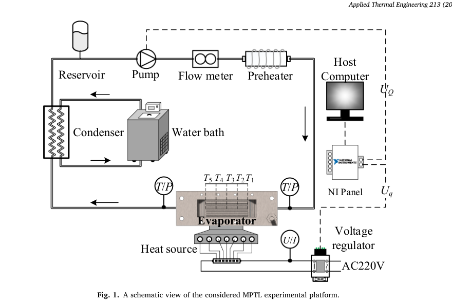
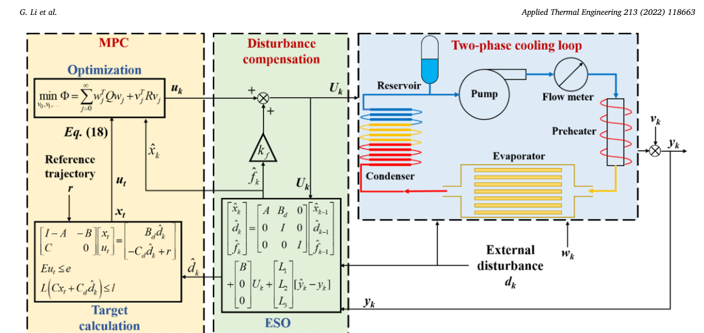
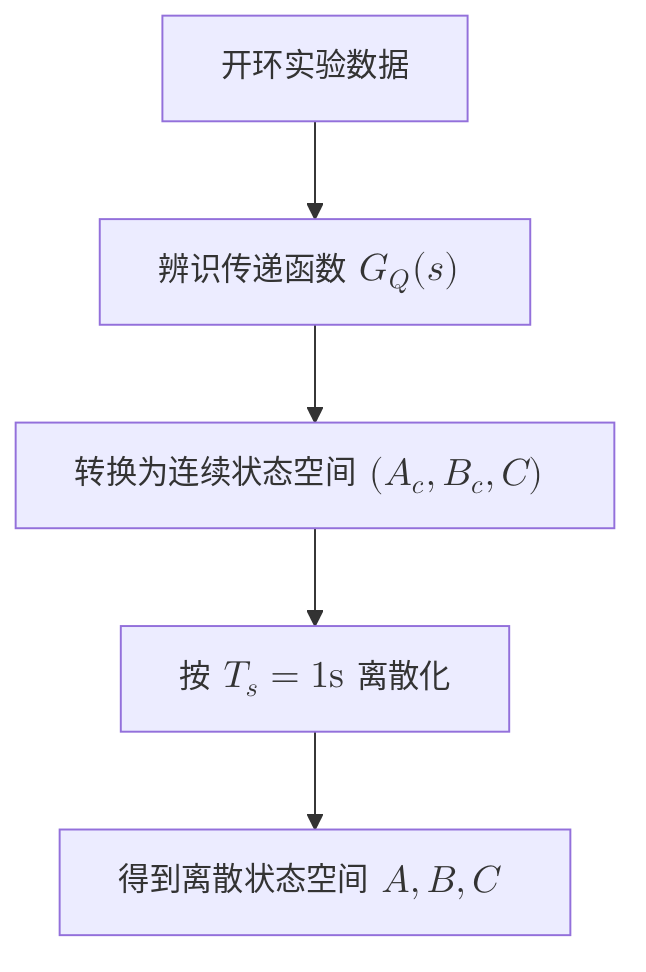
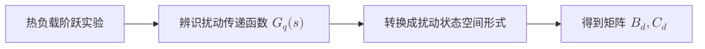

# 基于观测器的自适应模型预测温度控制在机械泵送两相回路中的应用

> **上传者**：秦若宸  
> **论文标题**：[Extended state observer-based model predictive temperature control of
> mechanically pumped two-phase loop: An experimental study](https://www.sciencedirect.com/science/article/pii/S135943112200610X)  
> **论文PDF**：[paper.pdf](ESO.pdf)  
> **阅读时间**：2026-6-3

# 论文DNA（一句精髓）

这篇论文提出 **ESOMPC**：扩张状态观测器 ESO + 模型预测控制 MPC 的温度控制方法，用于机械泵驱两相回路 MPTL，在周期性热负载扰动、测量噪声和微通道沸腾非线性下，把蒸发器平均壁温稳定在设定值附近。

## 一、知识向量：5维浓缩摘要

### 1. 工程对象：MPTL 两相散热回路

论文研究对象是 mechanically pumped two-phase loop，MPTL，机械泵驱两相回路。它通过泵驱动工质循环，在微通道蒸发器中吸热蒸发，再经冷凝器释放热量，适用于空间站、高性能芯片等高热流密度散热场景。实验平台包括储液罐、泵、流量计、预热器、微通道蒸发器、冷凝器、水浴、NI采集板和电压调节器。控制目标是蒸发器平均壁温：

$$T=\frac{T_1+T_2+T_3+T_4+T_5}{5}$$

其中，操纵量是泵控制电压 ($U_Q$)，扰动量是热负载调节电压 ($U_q$)。

### 2. 核心问题：热负载扰动会引发明显温度振荡

作者先做了背景实验：保持流量恒定，让热负载以脉冲波和半正弦波形式周期变化。结果显示，热负载波动会导致蒸发器平均温度产生周期性振荡，某些情况下温升可达到约 $16^\circ\text{C}$。这说明在变负载电子设备中，仅靠固定流量散热难以维持稳定温度。

这部分的物理含义很直接：热源功率 ($q$) 周期变化时，蒸发器壁温 ($T$) 随之周期波动；若泵流量 ($Q$) 不及时调节，热惯性、相变延迟和微通道沸腾状态变化会共同造成明显超调和滞后。

### 3. 系统难点：微通道沸腾非线性 + 流量响应滞后

作者通过开环阶跃实验识别模型。流量阶跃实验显示：提高泵流量通常会降低壁温；热负载阶跃实验显示：提高热负载会升高壁温。但是不同工况下模型参数差异很大，说明微通道沸腾换热具有强非线性。

作者先用传递函数描述流量到温度的对象模型：

$$G(s)=k_p \frac{1}{1+2\varepsilon T_w s+(T_w s)^2}(1+T_zs)$$

热负载到温度的扰动模型写成：

$$f(s)=k_p\frac{1}{1+T_ps}e^{-ds}$$

其中，$k_p$ 是比例增益，$T_w$、$T_z$、$T_p$ 是时间常数，$\varepsilon$ 是阻尼因子，$d$ 是时滞。不同工况下 ($k_p,T_z,T_w,\varepsilon,T_p,d$) 差异明显，这就是控制器难以用单一线性模型覆盖全工况的原因。

论文最终用于控制设计的名义模型为：

$$G_Q(s)=-\frac{27.122(1+120.99s)}{(1+198s)(1+11.582s)}$$

$$G_q(s)=\frac{25.978}{1+158.2s}e^{-10s}$$

其中，$G_Q(s)$ 表示泵流量控制通道，$G_q(s)$ 表示热负载扰动通道。图4显示名义模型可以拟合部分实验响应，但局部温度分布和小范围阶跃仍体现出非线性。

### 4. 方法核心：ESO估计总扰动，MPC进行约束优化

论文提出的控制结构是 ESOMPC。其中：

- **MPC (Model Predictive Control，模型预测控制)**：利用模型预测未来温度变化，并在约束下优化控制量。
- **ESO (Extended State Observer，扩张状态观测器)**：把未建模动态、沸腾非线性、测量噪声影响等统一看成“总扰动” ($f_k$)，在线估计并补偿。
  

基础离散系统写为：

$$x_{k+1}=Ax_k+BU_k$$

$$y_k=Cx_k$$

| 符号 | 中文含义 | 在本文中的直观理解 |
| ----- | ------ | ---------------------------- |
| $$x_k$$ | 系统状态 | 系统内部热状态，例如蒸发器、工质、管路中隐含的热惯性状态 |
| $$U_k$$ | 控制输入 | 泵的控制电压，控制流量大小 |
| $$y_k$$ | 系统输出 | 蒸发器平均壁温 |
| $$A$$ | 状态演化矩阵 | 描述系统自身热惯性如何变化 |
| $$B$$ | 控制输入矩阵 | 描述泵电压 (U_k) 对系统状态的影响 |
| $$C $$ | 输出矩阵 | 描述内部状态 (x_k) 如何转换为可测温度 (y_k) |

引入可测扰动 ($d_k$) 后，系统扩展为：

$$\begin{bmatrix} x_{k+1} \\ d_{k+1} \end{bmatrix} = \begin{bmatrix} A & B_d \\ 0 & I \end{bmatrix} \begin{bmatrix} x_k \\ d_k \end{bmatrix} + \begin{bmatrix} B \\ 0 \end{bmatrix} U_k+w_k$$

$$y_k= \begin{bmatrix} C & C_d \end{bmatrix} \begin{bmatrix} x_k \\ d_k \end{bmatrix} +v_k$$

进一步加入总扰动 ($f_k$)，形成扩张状态：

$$\begin{bmatrix} x_k \\ d_k \\ f_k \end{bmatrix}$$

ESO在线估计：

$$\hat{x}_k,\quad \hat{d}_k,\quad \hat{f}_k$$

| 估计量      | 含义             | 作用                                  |
| ----------- | ---------------- | ------------------------------------- |
| $\hat{x}_k$ | 估计的系统状态   | 告诉MPC当前系统内部大概处于什么热状态 |
| $\hat{d}_k$ | 估计的热负载扰动 | 告诉MPC当前热负载扰动有多强           |
| $\hat{f}_k$ | 估计的总扰动     | 告诉控制器模型误差和未知非线性有多大  |

ESO的工作逻辑：

模型预测输出 $\hat{y}_k$ 和真实测量温度 $y_k$ 进行比较。

如果 $\hat{y}_k - y_k$ 很大，说明模型预测错了。ESO就根据这个误差修正：

$$\hat{x}_k,\quad \hat{d}_k,\quad \hat{f}_k$$

也就是说，ESO一直在做一件事：

看模型预测温度和实际温度差多少，然后反推系统状态、热负载扰动和未知总扰动。
最终控制量由MPC输出 ($u_k$) 和ESO扰动补偿项共同组成：

$$U_k=u_k+k_f\hat{f}_k$$

其中 $k_f$ 是总扰动补偿增益。
直观理解：MPC负责“看未来并算最优泵电压”，ESO负责“实时估计模型没解释掉的误差来源”。

### 问题

- **$A$**：系统状态矩阵
- **$B$**：控制输入矩阵
- **$B_d$**：可测扰动输入矩阵
- **$C$**：输出矩阵
- **$C_d$**：可测扰动输出矩阵
- **$L_1, L_2, L_3$**：观测器增益
  这些离散矩阵的来源

### $A, B, C$ 是怎么来的？

$A, B, C$ 来自这个基础状态空间模型：

$$x_{k+1}=Ax_k+BU_k$$

$$y_k=Cx_k$$

在这篇论文中，$U_k$ 是泵控制电压，$y_k$ 是蒸发器平均壁温。也就是说，$A, B, C$ 描述的是：

$$\text{泵电压 } U_Q \longrightarrow \text{蒸发器平均温度 } T$$

这个关系论文先通过开环实验辨识出来。作者做了流量阶跃实验，然后得到过程模型：

$$G_Q(s)=-\frac{27.122(1+120.99s)}{(1+198s)(1+11.582s)}$$

这个 $G_Q(s)$ 就是从泵流量控制通道到平均温度响应的传递函数。论文说明，开环流量阶跃实验用于识别 process model，也就是 $G_Q(s)$，然后该传递函数可以写成对应的状态空间形式。

### 传递函数怎么变成 $A, B, C$？

控制理论里有一个标准转换：

$$G_Q(s)=C(sI-A_c)^{-1}B_c+D$$

这里的 $A_c, B_c, C, D$ 是连续时间状态空间矩阵。因为论文的控制是离散控制，采样时间是：

$$T_s=1\text{s}$$

所以还需要离散化：

$$A=e^{A_cT_s}$$

$$B=\int_0^{T_s}e^{A_c\tau}B_c\,d\tau$$

$$C=C_c$$

如果没有直接通道，一般：

$$D=0$$

所以流程是：

论文没有把这个转换后的 $A, B, C$ 数值列出来，只说“识别得到的MPTL传递函数可以表示成式(8)这种状态空间模型”。

### $B_d$、$C_d$ 是怎么来的？

加入热负载扰动后，模型变成：

$$\begin{bmatrix} x_{k+1} \\ d_{k+1} \end{bmatrix} = \begin{bmatrix} A & B_d \\ 0 & I \end{bmatrix} \begin{bmatrix} x_k \\ d_k \end{bmatrix} + \begin{bmatrix} B \\ 0 \end{bmatrix} U_k + w_k$$

$$y_k = \begin{bmatrix} C & C_d \end{bmatrix} \begin{bmatrix} x_k \\ d_k \end{bmatrix} + v_k$$

展开就是：

$$x_{k+1}=Ax_k+B_d d_k+BU_k+w_k$$

$$d_{k+1}=d_k$$

$$y_k=Cx_k+C_d d_k+v_k$$

这里 $d_k$ 是热负载扰动，所以 $B_d$、$C_d$ 描述的是：

$$\text{热负载扰动 } d_k \longrightarrow \text{系统状态/温度输出}$$

论文通过热负载阶跃实验辨识了扰动模型：

$$G_q(s)=\frac{25.978}{1+158.2s}e^{-10s}$$

这个模型表示：

$$\text{热负载变化} \longrightarrow \text{蒸发器平均温度变化}$$

所以 $B_d$、$C_d$ 就是根据这个扰动模型 $G_q(s)$ 转换得到的矩阵。论文原文说，$B_d$ 和 $C_d$ 分别表示扰动对系统状态和输出的影响。

流程可以写成：

### 为什么矩阵里有 $I$？

式子里有两块单位矩阵：

$$\begin{bmatrix} 0 & I & 0 \\ 0 & 0 & I \end{bmatrix}$$

对应：

$$d_k=d_{k-1}$$

$$f_k=f_{k-1}$$

这不是说扰动永远不变，而是在一个采样步长内，先把扰动近似看成慢变化量。因为论文采样时间是：

$$T_s=1\text{s}$$

所以在每一个控制更新周期内，可以认为：

$$d_k \approx d_{k-1}$$

$$f_k \approx f_{k-1}$$

这叫随机游走模型或者常值扰动模型。它的目的很简单：让ESO可以把 $d_k$ 和 $f_k$ 当成“状态”来估计。

### $0$ 是什么意思？

比如：

$$\begin{bmatrix} B \\ 0 \\ 0 \end{bmatrix}U_k$$

表示控制输入 $U_k$ 直接影响系统热状态 $x_k$，但不直接改变热负载扰动 $d_k$ 和总扰动 $f_k$。

展开就是：

$$\hat{x}_k=\cdots+BU_k$$

$$\hat{d}_k=\cdots+0\cdot U_k$$

$$\hat{f}_k=\cdots+0\cdot U_k$$

物理含义是：

- 泵电压 $U_k$ 会影响流量，从而影响温度状态；
- 泵电压不会直接改变外部热源功率；
- 泵电压也不被认为直接改变未知总扰动。

### $L_1, L_2, L_3$ 是怎么来的？

这三个不是由实验传递函数直接转出来的，而是观测器增益。

ESO的修正项是：

$$\begin{bmatrix} L_1 \\ L_2 \\ L_3 \end{bmatrix} (\hat{y}_k-y_k)$$

其中：

$$\hat{y}_k-y_k$$

是预测温度和真实测量温度之间的误差。

如果预测不准，就通过这个误差修正：

$$\hat{x}_k,\quad \hat{d}_k,\quad \hat{f}_k$$

论文给出的观测器增益求法是：

$$L_i=M^{-1}N_i$$

其中 $M$ 和 $N_i$ 通过下面这个线性矩阵不等式求解：

$$\begin{bmatrix} M^T+M-W & * \\ MA_i-N_iC_i & W \end{bmatrix}>0,\qquad W=W^T>0$$

这就是 $L_1, L_2, L_3$ 的来源。论文说为了简化调参，观测器增益向量通过这个LMI方法确定。

### 实验结果：ESOMPC温度波动最小、调节更快

作者将三种控制器进行对比：

| 控制器     | 含义              | 主要特点                               |
| :--------- | :---------------- | :------------------------------------- |
| **PI**     | 比例-积分控制     | 简单、抗噪性较好，但预测能力弱         |
| **PI-F**   | PI + 静态前馈补偿 | 加入热负载前馈，但依赖固定模型         |
| **ESOMPC** | ESO + MPC         | 同时利用扰动预测、约束优化和总扰动补偿 |

在脉冲波热负载扰动下，ESOMPC对应的温度波动幅值 ($\Delta T$) 普遍小于 PI 和 PI-F。例如图7中，周期为 $4\text{s}$ 时，PI、PI-F、ESOMPC 的 $\Delta T$ 分别约为 $1.45^\circ\text{C}$、$3.34^\circ\text{C}$、$0.66^\circ\text{C}$。

在正弦波热负载扰动下，ESOMPC同样能够把壁温更稳定地维持在设定值附近。图8中红色曲线代表ESOMPC，整体振荡幅值明显较小。

评价指标采用积分绝对误差 IAE：

$$\text{IAE}=\int_0^\tau |y(\tau)-r|d\tau$$

温度波动幅值定义为：

$$\Delta T=|T_m-r|$$

其中，$y(\tau)$ 是实时平均壁温，$r$ 是设定温度，$T_m$ 是实验过程中的极值温度。图9显示，不论脉冲波还是正弦波扰动，ESOMPC的 IAE 基本最低，说明累计温度偏差最小。

## 二、贡献网格：方法、证据与量化指标

| 贡献维度         | 论文做法                                               | 可量化结果                                         |
| :--------------- | :----------------------------------------------------- | :------------------------------------------------- |
| **工程问题重构** | 将MPTL控制重点从设定值跟踪推进到热负载扰动下的温度稳定 | 某些开环扰动下温升可达约 $16^\circ\text{C}$        |
| **非线性识别**   | 通过流量阶跃和热负载阶跃识别不同工况模型               | 不同 $q$、$U_Q$、$U_q$ 下模型参数差异明显          |
| **名义模型建立** | 建立 $G_Q(s)$ 和 $G_q(s)$                              | 流量通道为负增益，热负载通道含约 $10\text{s}$ 时滞 |
| **控制结构创新** | 将ESO嵌入MPC，估计总扰动并补偿                         | 控制律 $U_k=u_k+k_f\hat{f}_k$                      |
| **实验验证**     | 与PI、PI-F闭环对比                                     | ESOMPC的 $\Delta T$ 和 IAE 普遍最低                |

## 三、文献关联网络

这篇论文的知识链条可以概括为：

从控制理论来源看，文章融合了三类文献：

1. **第一类**是 MPTL 和微通道两相流散热研究，提供实验对象和工程需求；
2. **第二类**是 MPC 在热系统、过程控制和有约束优化中的应用，提供预测控制框架；
3. **第三类**是 ESO/ADRC 抗扰控制研究，提供对未建模扰动和非线性的在线估计能力。

## 四、核心判断

这篇论文的真正价值在于：它没有把微通道沸腾系统强行当成精确线性对象，而是用一个可用于MPC的名义模型处理主要动态，再让ESO实时估计剩余的非线性、扰动和模型失配。对热管理系统来说，这种“名义模型 + 在线扰动估计 + 预测优化”的框架比单纯PI或静态前馈更适合变负载工况。
