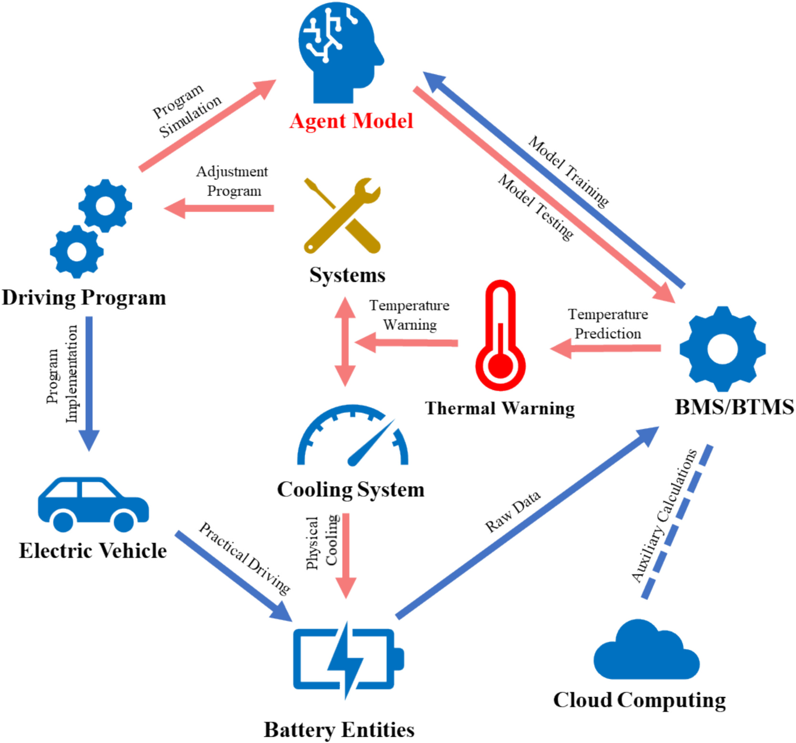
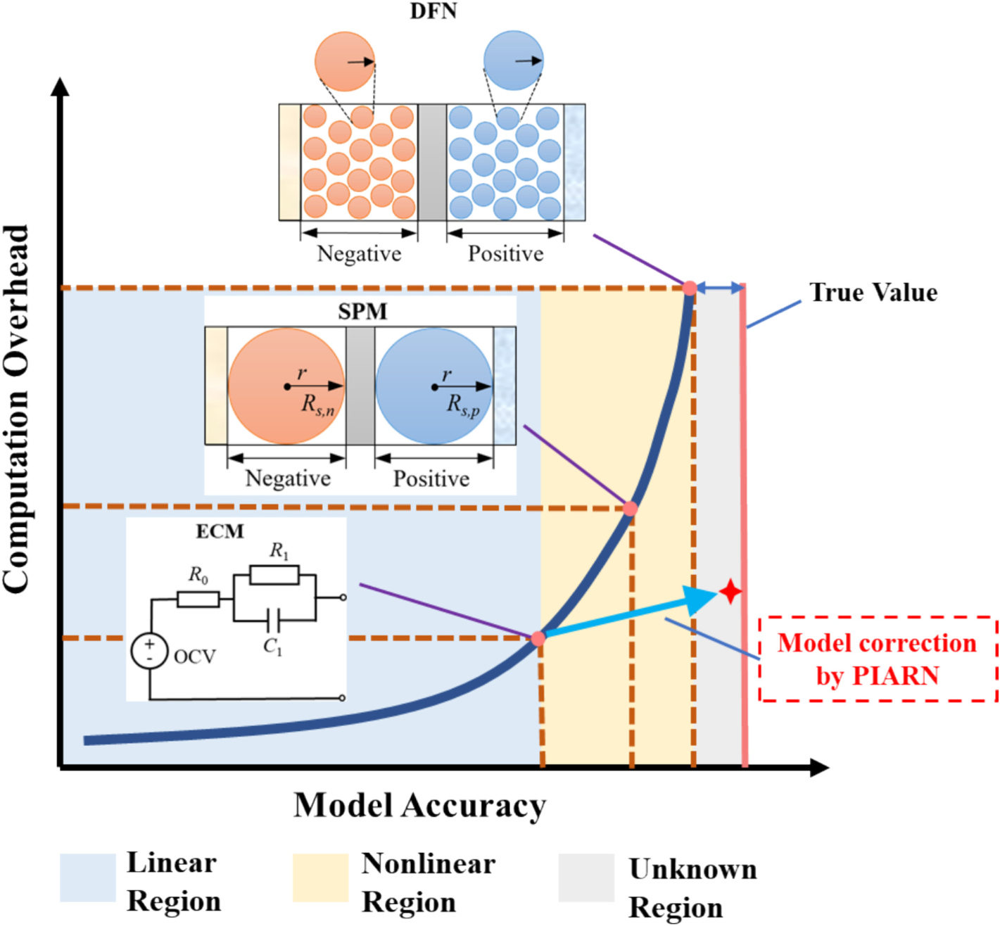
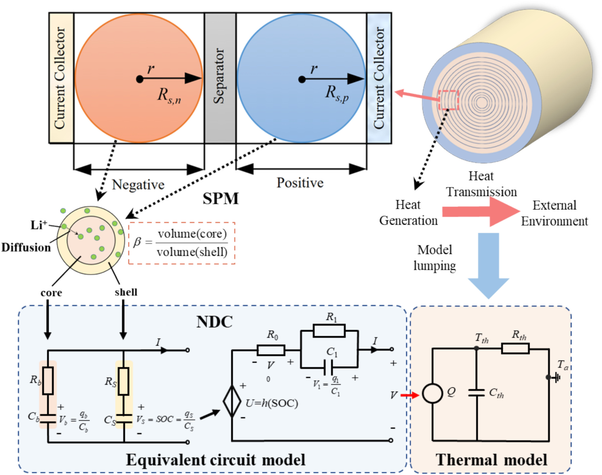
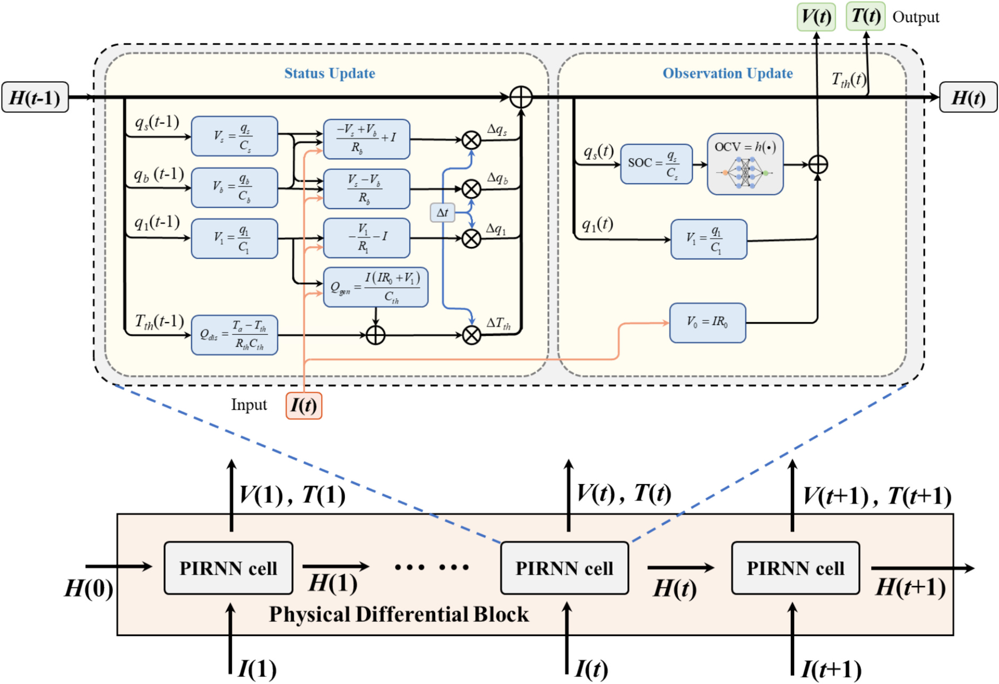
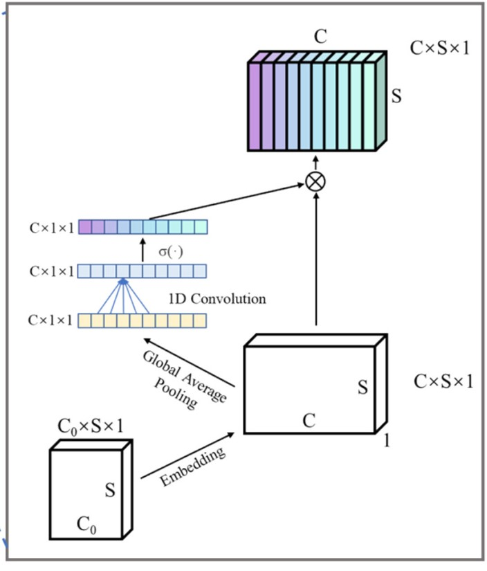
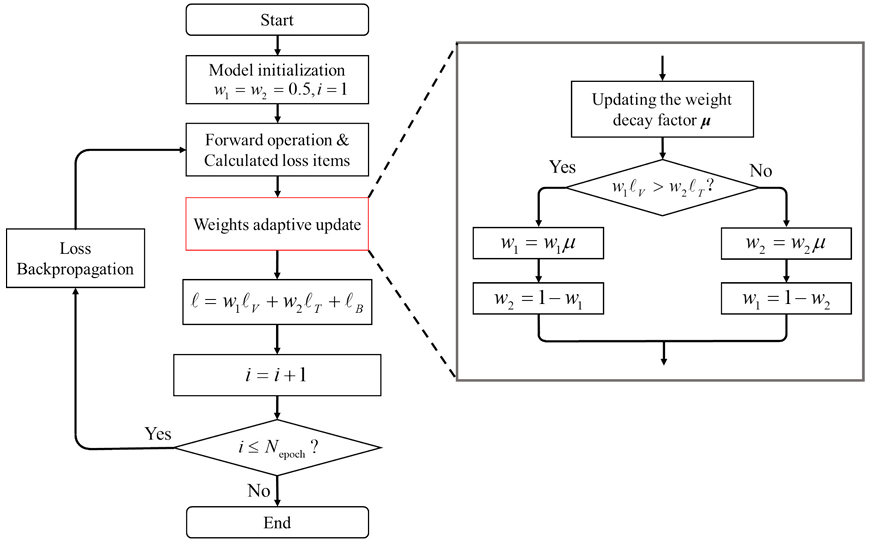
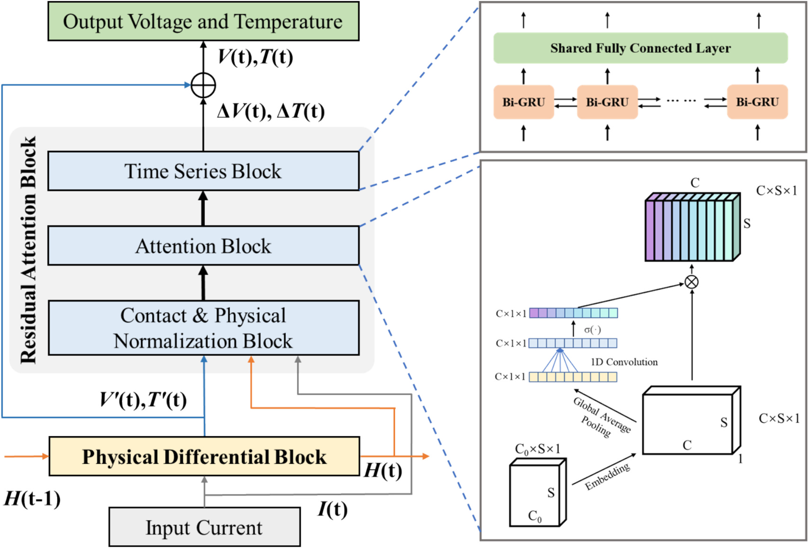
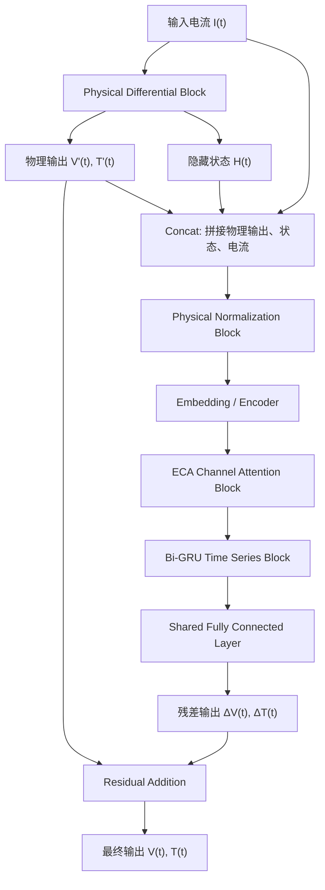
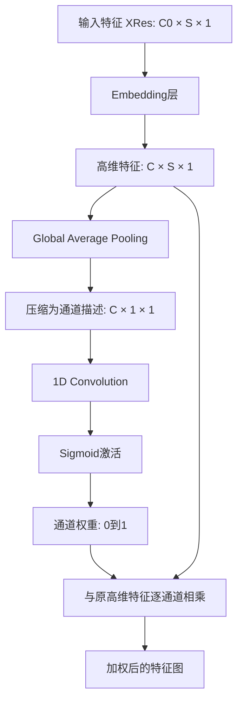
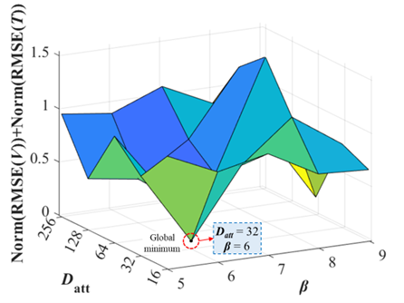

# 融合物理机理与注意力残差网络的电池智能温度预警模型

> **上传者**：秦若宸  
> **论文标题**：[Battery intelligent temperature warning model with physically-informed attention residual networks](https://www.sciencedirect.com/science/article/pii/S0306261925003575)  
> **论文PDF**：[paper.pdf](paper.pdf)  
> **阅读时间**：2026-6-17

## 论文 DNA（一句精髓）

这篇论文的核心是：**用一个简化但可训练的电池电-热耦合物理模型提供主动态骨架，再用注意力残差网络补偿缺失非线性，从而实现少样本条件下的电压、温度预测和全生命周期热预警。**

---

## 一、 元分析与图表定位

本文研究对象是**电动汽车锂离子电池的在线温度预测与热预警**。作者认为，真实 BMS/BTMS 需要一个能够在线更新、计算量可控、同时保留物理意义的电-热耦合代理模型。

**Battery Management System**： 电池管理系统,它相当于整个电池包的大脑。BMS并不负责制冷或加热，它主要负责监测、估计、控制和保护。”

**Battery Thermal Management System**： 电池热管理系统，通常包括水冷、风冷、制冷剂、冷却相变材料、PTC加热、热泵、电加热膜等等”

- **图 1** 给出了系统层面的目标：驾驶程序、电池实体、BMS/BTMS、云计算、冷却系统与热预警构成闭警，模型的功能是根据当前或未来电流工况预测电压和温度，并提前触发热预警。

驾驶程序→车辆运行→电池数据→BMS/BTMS→PIARN预测→热预警→冷却控制/驾驶策略调整→电池安全运行

> 
> **图1**: 面向电动车 BMS/BTMS 的在线电-热耦合建模与温度预警闭环

- **图 2** 表达了作者的技术定位：DFN 模型物理最完整但计算量最高，ECM 模型计算量低但物理机制不足，SPM 位于中间。PIARN 的目标是在较低计算开销下，把简化物理模型推近真实值，用残差网络修正模型误差。

> 
> **图2**: DFN、SPM、ECM 与 PIARN 在计算开销和模型精度上的定位关系

---

## 二、 知识向量：5 维度摘要

### 维度 1：问题本质——在线热安全管理需要“可解释、可更新、低成本”的代理模型

电池温度预测困难的根源在于热行为与内部电化学状态强耦合。电流输入引起欧姆热、极化热、反应热，热量又受环境温度和散热条件影响。

- **单一模型的局限**：纯热模型无法准确描述放电过程中温升，因为热源本身来自电化学过程；纯数据驱动模型在已有工况下可以拟合得很好，但跨电池、跨温度、跨老化状态的泛化能力依赖大量数据。

- **本文切入点**：构建一个可以嵌入 BMS/BTMS 的电-热耦合代理模型，**用物理模型保证主趋势，用神经网络补偿复杂非线性**。

### 维度 2：物理骨架——改进 NDC模型 + 一阶集总热模型

本文物理层采用改进的 **Nonlinear Double-Capacitor（NDC）模型**。它把电极颗粒中的锂离子扩散简化为“内层-表层”两个储锂区域，分别由 $q_b, q_s$ 描述；液相扩散由 $R_1-C_1$ 描述；温度由一阶集总热模型 $T_{th}$ 描述。

其隐藏状态向量为：

$$H(t)=\left[q_s(t), q_b(t), q_1(t), T_{th}(t)\right]$$

未知物理参数较少，易于识别：

$$\theta=[q_{\max}, R_0, R_b, R_1, C_1, R_{th}, C_{th}]$$

> **设计意义**：模型保留了固相扩散、液相扩散、欧姆热和散热等主机制，同时避免了 DFN 模型的高维 PDE 带来的计算负担。

> **图3**: 改进 NDC 电-热耦合模型，包含电极内外层扩散、等效电路与一阶热模型

#### 隐藏状态 $H(t)$ 符号对照表

论文把物理模型写成 RNN 形式，使用隐藏状态向量来保存当前时刻电池内部的物理状态：

$$H(t)=\left[q_s(t), q_b(t), q_1(t), T_{th}(t)\right]$$

隐藏状态向量里的每一项都有明确且可解释的物理意义：

|  状态符号   | 物理名称                  |         核心数学关系         | 工程与物理意义                                                                                                                     |
| :---------: | :------------------------ | :--------------------------: | :--------------------------------------------------------------------------------------------------------------------------------- |
|  $q_s(t)$   | 颗粒**表层**储锂量        | $\text{SOC}=\frac{q_s}{C_s}$ | 直接决定电池的荷电状态（SOC）与开路电压（OCV），对**端电压预测**至关重要。                                                         |
|  $q_b(t)$   | 颗粒**内层**储锂量        |              —               | 与 $q_s$ 的差异反映固相浓度不均匀性。若 $\frac{q_b}{C_b} \neq \frac{q_s}{C_s}$，说明固相扩散未平衡，电池存在**固相扩散动态效应**。 |
|  $q_1(t)$   | **液相扩散/极化**电荷状态 |    $V_1=\frac{q_1}{C_1}$     | 决定等效电路中的极化电压 $V_1$，直接影响端电压响应，并**间接影响极化发热**。                                                       |
| $T_{th}(t)$ | 电池**集总温度**          |              —               | 热模型的核心状态量，是电热耦合系统的关键物理纽带，也是**最终温度预测**的物理输出。                                                 |

> **💡 将状态作为 RNN 隐藏状态的优势**：模型在每一个时间步都保留了历史放电造成的内部状态积累。例如同样施加 $5\text{ A}$ 电流，若电池前期已连续大电流放电很久，此时的 $\left[q_s, q_b, q_1, T_{th}\right]$ 状态与刚开始放电时截然不同，后续的电压与温度响应也会表现出明显的历史相关性。

#### 未知物理参数 $\theta$ 符号对照表

论文中需要通过数据驱动或反向传播优化的电-热物理参数矩阵表示为：

$$\theta=[q_{\max}, R_0, R_b, R_1, C_1, R_{th}, C_{th}]$$

参数的具体物理含义与作用机制对比如下：

|  参数符号  | 物理名称          |                 关联控制方程/效应                 | 参数变化对电池行为的影响                                                         |
| :--------: | :---------------- | :-----------------------------------------------: | :------------------------------------------------------------------------------- |
| $q_{\max}$ | **最大可用容量**  |                 决定总储存电荷量                  | 电池老化后 $q_{\max}$ 会衰减，是表征健康状态（SOH）的核心指标。                  |
|   $R_0$    | **欧姆内阻**      |      $V_0=IR_0$ $Q_{\text{ohmic}}=I^2R_0$      | 决定瞬时电压降和**欧姆发热量**。$R_0$ 增大时，相同电流下电压降更大，温升更剧烈。 |
|   $R_b$    | **固相扩散阻力**  |      控制 $q_b \leftrightarrow q_s$ 均衡速率      | 阻力越大，颗粒内外层锂离子交换越慢，浓度梯度维持时间越长。                       |
|   $R_1$    | **液相/极化阻力** | 与 $C_1$ 共同决定时间常数： $\tau_1 = R_1 C_1$ | 描述电池极化电压建立和恢复（弛豫过程）的速度快慢。                               |
|   $C_1$    | **极化等效电容**  |              $V_1 = \frac{q_1}{C_1}$              | 决定相同极化电荷下产生的极化电压大小。$C_1$ 越大，同等电荷下的极化电压越小。     |
|  $R_{th}$  | **传热热阻**      |               控制向环境散热的能力                | 热阻越大，系统与外部热交换越困难，内部热量越容易积聚导致温升。                   |
|  $C_{th}$  | **等效热容**      |               控制电池温度变化快慢                | 热容越大，系统热惯性越大。同样热源（发热率）导致的温度上升速率越慢。             |

### 维度 3：PINN 运行方式——把物理差分方程写成 RNN 单元

这篇文章里的 PINN 更准确地说是 **PIRNN**（Physics-Informed Recurrent Neural Network）。它没有采用常见 PINN 那种“神经网络输出场变量，再把 PDE 残差加入损失函数”的形式。

作者**把连续时间的电-热耦合方程离散化，然后直接写入 RNN cell**。每个时间步输入电流 $I(t)$ 和上一时刻隐藏状态 $H(t-1)$，输出物理预测电压 $V'(t)$、物理预测温度 $T'(t)$ 以及新的隐藏状态 $H(t)$：

这篇文章中，物理方程被显式地写成了循环神经网络的内部推进状态机。其核心逻辑可以清晰地划分为**状态转移方程**与**观测方程**两部分：

#### （1） 状态转移方程（State Transition Equation）

在每个时间步 $t$，系统根据上一时刻的隐藏状态 $H(t-1)$ 和当前的电流输入 $I(t)$，按照硬编码的电-热差分方程向前递推：

$$H(t) = F_{\text{physics}}\left(H(t-1), I(t); \theta\right)$$

---

#### （2） 观测方程（Observation Equation）

更新完内部隐藏状态 $H(t)$ 后，模型通过物理观测方程映射出当前时间步的物理预测电压 $V'(t)$ 和预测温度 $T'(t)$：

$$V'(t) = h\left(\frac{q_s(t)}{C_s}\right) - \frac{q_1(t)}{C_1} - I(t)R_0$$

$$T'(t) = T_{th}(t)$$

> _注：公式中的 $h(\cdot)$ 代表开路电压（OCV）与荷电状态（SOC）之间的非线性映射函数。_

---

#### 📌 算法模块高度概括

论文将上述完整的“状态递推 + 观测输出”过程高度概括为统一的物理算子形式：

$$\left[V'(t), T'(t), H(t)\right] = \text{Phy}\left[I(t), H(t-1)\right]$$

这里的 $\text{Phy}(\cdot)$ 就是论文的核心**物理微分模块**（Physical Differential Block），其本质上就是一个由离散化电-热机理方程共同构建的 **PIRNN cell**。

- **核心优势**：物理状态会沿时间递推，模型参数可以通过反向传播更新，训练结果仍然保留 $q_s, q_b, q_1, T_{th}$ 等具备物理可解释性的变量。

> 
> **图4**: PIRNN 物理微分块，把 NDC 电-热方程离散后嵌入循环神经网络单元

### 维度 4：残差注意力块——专门学习“缺失物理”

简化 NDC 模型只保留主物理机制，忽略了部分复杂非线性（如电化学极化的非线性、可逆熵热项、不同 SOC 区间下的非线性变化）。作者让残差网络专门学习**物理模型预测值与真实观测值之间的差**：

$$\left[V(t), T(t)\right] = \text{Res}\left[V'(t), T'(t), H(t), I(t)\right] + \left[V'(t), T'(t)\right]$$

残差块由三部分构成：**物理归一化**、**ECA 通道注意力**、**Bi-GRU 时间序列模块**。

1. **物理归一化**：利用电压范围、温度范围、容量范围等先验边界，减少样本间尺度差异；
2. **通道注意力**：用于判断 $q_s, q_b, q_1, I, V', T'$ 等特征对残差预测的权重重要性；
3. **Bi-GRU 模块**：用于捕捉残差随时间的动态变化规律。

> 
> **图6**: PIARN 整体结构，物理微分块提供主预测，残差注意力块生成电压和温度修正量

### 维度 5：训练策略与在线部署——自适应损失权重 + 滑窗迭代更新

模型同时预测电压和温度，但两类误差量纲和数值尺度完全不同。直接相加会导致某一项主导梯度方向。作者提出 **Adaptive Weighting（AW，自适应权重）方法**，将损失函数写为：
$$\ell = w_1\ell_V + w_2\ell_T + \ell_B$$

其中：

- $\ell_V$ 是电压误差，$\ell_T$ 是温度误差，$\ell_B$ 是边界约束损失。
- **权重调节机制**：训练过程中，如果 $w_1\ell_V$ 大于 $w_2\ell_T$，就衰减 $w_1$；反过来则衰减 $w_2$。这样可以让两个任务更均衡地参与训练。
- **量化提升**：实验中，AW 使电压误差收敛值由 $0.048\text{ V}$ 降至 $0.027\text{ V}$，温度误差收敛值由 $0.253\text{ }^\circ\text{C}$ 降至 $0.210\text{ }^\circ\text{C}$。

> 
> **图7**: 自适应损失权重 AW 流程，用动态衰减因子平衡电压损失与温度损失

---

## 三、 颗粒化技术解构：这篇文章到底怎么跑起来

PIARN 的运行流程可以精密压缩成以下**五步**：

1. **输入阶段**：获取一段电流序列 $I(t)$。
2. **物理递推**：PIRNN 物理块根据上一时刻状态 $H(t-1)$ 递推出内部状态 $\left[q_s, q_b, q_1, T_{th}\right]$，并计算出物理层面的预测电压 $V'(t)$ 和温度 $T'(t)$。
3. **特征拼接**：将物理预测值、内部状态变量与输入电流拼接为向量：$\left[V'(t), T'(t), H(t), I(t)\right]$，作为残差网络的输入。
4. **残差学习**：残差注意力块通过前向传播，专门学习缺失的非线性修正量 $\Delta V(t)$ 和 $\Delta T(t)$。
5. **多任务输出**：将物理基础预测与残差修正量线性相加，得到最终逼近真实值的输出结果 $V(t)$ 和 $T(t)$。

#### 📌 模型哲学总结

- **PIRNN 物理块**：承担“**已知物理**”的角色，筑牢主趋势骨架；
- **残差注意力网络**：承担“**未知非线性**”的角色，精细化修补误差；
- **AW（自适应权重）**：承担“**多任务训练稳定器**”的角色，平衡梯度方向；
- **在线滑窗迭代**：承担“**老化和环境变化追踪器**”的角色，实现实车在线演进。

这个有机的算法组合，成功使模型在极低计算开销下兼具了物理可解释性与数据驱动的高精度，具备极强的工程落地可部署性。

## 四、 这篇文章的 PINN 和常见 PINN 的区别

理解物理方程如何介入模型，是读懂这篇文章最关键的核心点。

### 1. 常见 PINN 的运行逻辑：方程进损失函数（软约束）

常见 PINN 往往先用一个普通的神经网络来近似表示一个未知的连续物理场函数：
$$u_\theta(x,t)$$

然后，利用自动微分将该网络代入偏微分方程（PDE）中（例如流体或传热方程）：
$$\frac{\partial u}{\partial t} + \mathcal{N}(u) = 0$$

最后，将这个物理方程的残差作为惩罚项直接加入到总损失函数中：
$$\mathcal{L} = \mathcal{L}_{\text{data}} + \lambda \mathcal{L}_{\text{physics}}$$

> **机制特点**：它试图让网络在数据拟合的过程中，**被动地**去贴合物理方程残差。此时，物理方程只是一种“软约束”。

---

### 2. 本文 PIRNN 的运行逻辑：方程进网络结构（硬约束）

这篇文章的做法完全不同。它没有让神经网络自由、无约束地输出内部隐藏状态 $\left[q_s, q_b, q_1, T_{th}\right]$ 后再去损失函数里惩罚它。

相反，作者**直接把离散化后的物理差分方程写成了循环神经网络（RNN）内部的状态更新规则**：
$$H(t) = F_{\text{physics}}\left(H(t-1), I(t); \theta\right)$$

> **机制特点**：物理方程不再是一个额外的软约束项，而是**模型结构本身（基因硬编码）**。只要模型在向前运行，它就必须、也只能百分之百严格按照这些物理方程来更新内部状态。

论文也强调，这个物理微分块是在 PINN 框架下用 **physics-guided RNN (PIRNN)** 实现，把微分方程无缝嵌入了网络的核心循环结构中，并直接用于时间信息传播和物理参数 $\theta$ 的反向传播优化。

---

### 📌 核心区别一览表

|     维度     | 常见 PINN (Physics-Informed NN)                                         | 本文 PIRNN (Physics-Informed RNN)                                                |
| :----------: | :---------------------------------------------------------------------- | :------------------------------------------------------------------------------- |
| **核心思想** | $$\text{方程进损失函数}$$                                               | $$\text{方程进网络结构}$$                                                        |
| **约束性质** | **软约束**（网络输出可能会在物理上出现自相矛盾，靠损失权重拉回）        | **硬约束**（网络结构本身就是物理公式，输出天然满足守恒与递推）                   |
| **运行机制** | 神经网络自由输出 $\rightarrow$ 代入 PDE 计算残差 $\rightarrow$ 惩罚损失 | 物理方程离散化 $\rightarrow$ 写入 RNN Cell 状态机 $\rightarrow$ 随时间步硬性递推 |
| **参数优化** | 仅优化神经网络的纯数学权重 $\omega, b$                                  | 联合优化数据层权重以及**具备物理实际意义的参数** $\theta$                        |

## 5. 残差注意力块（Residual Attention Block）

### (1) 这个模块在PIARN中的位置

PIARN由两个核心部分组成：前半部分是**物理微分块（Physical Differential Block）**，后半部分是**残差注意力块（Residual Attention Block）**。物理微分块基于改进的NDC电-热耦合模型，负责根据电流输入递推电池内部状态，并给出物理预测电压和物理预测温度；残差注意力块接收这些物理预测结果和隐藏状态，学习物理模型没有覆盖好的复杂非线性误差，最后输出电压和温度的修正量。

从整体公式看，物理微分块先给出：

$$
[V'(t), T'(t), H(t)] = Phy[I(t), H(t-1)]
$$

然后残差注意力块计算修正量，并与物理预测相加：

$$
[V(t), T(t)] = Res[V'(t), T'(t), H(t), I(t)] + [V'(t), T'(t)]
$$

这里的 $Res(\cdot)$ 就是残差注意力块。它输出的是：

$$
[\Delta V(t), \Delta T(t)]
$$

最终模型输出为：

$$
V(t)=V'(t)+\Delta V(t)
$$

$$
T(t)=T'(t)+\Delta T(t)
$$

所以，残差注意力块的核心任务是：**在物理模型已经给出主趋势的基础上，学习剩余误差，也就是学习“缺失物理”或“未建模非线性”。**

---

### (2)为什么需要残差注意力块

前面的物理微分块基于简化NDC模型和一阶集总热模型。这个物理模型能够描述主要的电-热动态，例如固相扩散、液相扩散、欧姆压降、极化压降和热量累积。但是为了降低计算复杂度，作者对很多复杂机制进行了简化。

例如，物理模型中只保留了电化学极化阻抗的线性主成分，复杂的界面电荷转移过程没有完整描述；热模型中主要保留了线性欧姆热，而可逆熵热项涉及SOC和温度的非线性函数，作者在物理建模中没有完整加入。这样做可以让模型更轻量，但也会留下误差。

残差注意力块就是为了解决这些问题。它不重新建立一个完整高维电化学模型，而是让神经网络学习：

$$
\text{真实电压/温度} - \text{物理模型预测电压/温度}
$$

也就是：

$$
\Delta V(t)=V_{\text{true}}(t)-V'(t)
$$

$$
\Delta T(t)=T_{\text{true}}(t)-T'(t)
$$

训练完成后，模型就可以用学到的残差规律修正物理输出。

---

### (3) 残差注意力块的输入是什么

论文第2.2节写到，作者将物理微分模块的输入、输出和隐藏状态拼接起来，作为残差注意力模块的输入。文中写作：

$$
X_{Res}=[V,T,q_s,q_b,q_1,I]
$$

结合图5，可以更完整地理解为：

$$
X_{Res}(t)=[V'(t),T'(t),H(t),I(t)]
$$

其中：

$$
H(t)=[q_s(t),q_b(t),q_1(t),T_{th}(t)]
$$

所以实际送入残差注意力块的信息可以理解为：

$$
X_{Res}(t)=[V'(t),T'(t),q_s(t),q_b(t),q_1(t),T_{th}(t),I(t)]
$$

不过论文在第2.2节的简写中没有单独列出 $T_{th}$，原因是温度观测方程中：

$$
T(t)=T_{th}(t)
$$

所以物理输出温度 $T'(t)$ 与热状态 $T_{th}(t)$ 在这个简化模型里高度重合。

每个输入特征的含义如下：

| 输入特征    | 含义                 | 为什么对残差学习有用 |
| ----------- | -------------------- | -------------------- |
| $V'(t)$     | 物理模型预测电压     | 提供电压主趋势       |
| $T'(t)$     | 物理模型预测温度     | 提供温度主趋势       |
| $q_s(t)$    | 电极颗粒表层储锂状态 | 影响SOC和OCV         |
| $q_b(t)$    | 电极颗粒内层储锂状态 | 反映固相扩散滞后     |
| $q_1(t)$    | 液相扩散/极化状态    | 影响极化压降和发热   |
| $T_{th}(t)$ | 电池集总温度         | 反映热积累状态       |
| $I(t)$      | 当前电流             | 直接影响压降和热源   |

这些量都不是普通黑箱特征，而是带有明确物理意义的变量。残差注意力块利用这些物理状态来判断误差从哪里来，例如误差是来自极化项、SOC估计、温度累积，还是来自电流突变。

---

### (4) 残差注意力块的整体流程

图5中，残差注意力块由四个主要步骤组成：**拼接与物理归一化、编码嵌入、ECA通道注意力、Bi-GRU时间序列块、共享全连接层输出残差**。

这个流程可以读成一句话：**先用物理模型得到一个可解释的初步预测，再把物理预测、内部状态和电流拼接起来，通过物理归一化统一尺度，然后用注意力机制判断哪些物理通道更重要，用Bi-GRU学习残差随时间的变化规律，最后输出电压残差和温度残差。**

---

### (5) 第一步：物理归一化层（Physical Normalization, PN）

神经网络训练前通常会做归一化。但是这篇论文没有直接使用普通归一化，而是提出了**物理归一化（Physical Normalization, PN）**。

原因是残差注意力块的输入都是有物理意义的变量，例如电压、电流、温度、储锂量和极化状态。如果直接用样本均值和方差做标准化，可能会破坏这些变量本身的物理尺度关系。例如，电压的合理范围大约是2.5–4.2 V，温度的合理范围与环境温度相关，$q_s$ 和 $q_b$ 的范围由电池容量和体积比例决定。这些范围不是随机统计量，而是物理先验。

所以作者用每个变量的物理上下界进行归一化。归一化公式为：

$$
\bar{x}=2\frac{x-x_{lb}}{x_{ub}-x_{lb}}-1
$$

其中，$x$ 是原始物理变量，$x_{lb}$ 是该变量的下界，$x_{ub}$ 是该变量的上界。经过这个变换后，变量大致被映射到 $[-1,1]$ 区间。

---

### (6) 第二步：ECA通道注意力块

### 6.1 “通道”是什么意思

在这篇论文中，通道不是图像里的RGB通道，而是残差网络输入中的不同物理特征通道，例如：

$$
V'(t),T'(t),q_s(t),q_b(t),q_1(t),I(t)
$$

这些特征对预测误差的贡献不一样。例如，电压误差可能更依赖 $q_s$、$q_1$ 和 $R_0$ 相关信息；温度误差可能更依赖 $I$、$q_1$ 和 $T_{th}$。在脉冲放电、高倍率放电和低SOC阶段，不同变量的重要性还会发生变化。

ECA通道注意力块的作用就是：**让模型自动判断哪些物理特征通道更重要，然后给重要通道更大的权重，给干扰性较强或当前贡献较小的通道更小权重。**

### 6.2 ECA的计算流程

图5右侧展示了ECA模块的计算过程。论文中输入张量最初维度为：

$$
C_0 \times S \times 1
$$

其中，$C_0$ 是原始输入特征数量，$S$ 是时间序列长度。随后经过Embedding层扩展为：

$$
C \times S \times 1
$$

其中，$C$ 是扩展后的通道数，也就是论文后面记作 $D_{att}$ 的注意力隐藏层特征维度。

- **$I \cdot q_1$** ；
- **$I^2$**；
- **$q_s - q_b$**；
- **$T' \cdot I$** 。

> **💡 架构设计的意义**：通过 Embedding 层将低维空间拉伸为高维特征流后，能够显著降低后续 **ECA 通道注意力块**和 **Bi-GRU 时间序列模块**的非线性映射难度，使其更容易捕获并学习到电-热系统中极其复杂的非线性动态关系。

ECA的主要流程如下：

这个过程可以分成三层理解。

第一层，Embedding层把原始物理特征扩展到更高维空间。这一步类似于把少量原始物理变量转成更丰富的表征，使网络更容易学习复杂非线性关系。

 

这篇文献里的 embedding 和大语言模型里的 embedding 有共同点：它们都是把原始输入转换成神经网络更容易处理的向量表示，也都属于“表示学习”。本质上，都是通过一个可学习的映射，把原始信息变成新的特征空间。

区别在于输入对象和作用不同。大语言模型的 embedding 处理的是文字 token，把离散的词或子词编号映射成连续语义向量；这篇电池文献的 embedding 处理的是连续物理变量，例如电压、温度、电流和内部状态变量，把少量物理特征扩展成 32 个高维特征通道。

文献中“扩展为 32 个通道”可以理解为：原来只有几个输入变量，例如：

**$[V,T,qs​,qb​,q1​,I]$**

经过 embedding 层后，变成 32 个新的特征通道。这 32 个通道通常没有明确的物理含义，它们是神经网络为了更好预测残差而构造出的高维特征。

这个 embedding 层的参数大概率是神经网络自己学习的。论文中明确冻结的是 OCV-SOC 拟合网络，也就是用来拟合开路电压和 SOC 关系的那个小网络；残差注意力模块里的 embedding 层没有说被冻结，所以应当随 PIARN 一起通过反向传播训练。

第二层，Global Average Pooling沿时间方向进行压缩，把每个通道在整段时间序列中的平均响应提取出来。这样模型可以获得每个通道的整体重要性描述。

第三层，1D卷积和Sigmoid生成通道权重。权重范围在0到1之间，用来增强或削弱不同通道。

论文中自适应卷积核大小写为：

$$
k=\left|\frac{\log_2(C)+1}{2}\right|
$$

其中，$C$ 是输入通道数。这个卷积核用于捕捉相邻通道之间的局部关系。ECA相比传统SE注意力块的优点是，它避免了全连接层降维操作，从而减少参数量，并保留通道和权重之间的对应关系。

### 6.3 ECA在本文中的物理意义

ECA通道注意力在这里的意义非常具体。它不是泛泛地“提高模型性能”，而是在物理特征之间做自适应筛选。

例如，在大电流脉冲阶段，$I(t)$ 和 $q_1(t)$ 可能对电压残差和温度残差更重要，因为极化压降和欧姆热会快速变化。此时ECA可能提高这些通道的权重。在低SOC末端阶段，$q_s(t)$ 对OCV变化非常敏感，电压误差可能明显放大，此时 $q_s(t)$ 相关通道可能变得更重要。

所以，ECA相当于在问：

> 当前这段放电序列中，哪些物理变量最能解释物理模型的剩余误差？

---

### (7) 第三步：Bi-GRU时间序列块

### 7.1 为什么还需要时间序列块

ECA主要解决的是“不同物理特征通道谁更重要”的问题。但电池误差不是只由某一个时刻决定的，而是具有明显的时间累积效应。

例如，温度误差与前面很长时间的发热积累有关；极化误差也会随着电流历史逐渐建立和恢复。相同的当前电流 $I(t)$，如果前面已经经历过持续高倍率放电，电池当前状态会完全不同。

因此，残差网络还需要学习：

$$
\Delta V(t),\Delta T(t)
$$

在时间上的动态变化规律。论文使用的是Bi-GRU，即双向门控循环单元。

### 7.2 GRU的基本计算

我们可以将 **GRU（门控循环单元）** 理解为一种自带“记忆”功能的时序神经网络。

- **普通全连接网络**：属于无状态模型，在计算时只孤立地看当前时刻的输入特征 $x_t$；

- **GRU 网络**：属于时序状态模型，在计算时会**同时兼顾**当前时刻的输入特征 $x_t$ 以及由上一时刻遗传、留下来的隐藏记忆 $h_{t-1}$。

它的核心优化目标，就是通过内部的门控机制（更新门与重置门）计算并更新出当前时刻的最新记忆状态：
$$h_t$$

> **💡 状态流的物理本质**：这个最新生成的隐藏状态 $h_t$ 并非只代表当下，它的内部已经有机地融合、并包含了**当前时刻的即时特征以及历史所有时刻累积下来的关键时序信息**。

论文给出了GRU单元的公式：

$$
z_t=\sigma(W_z \times |h_{t-1},x_t|+b_z)
$$

$$
r_t=\sigma(W_r \times |h_{t-1},x_t|+b_r)
$$

$$
\hat{h}_t=\tanh(W_h \times (r_t \times h*{t-1},x_t)+b_h)
$$

$$
h_t=(1-z_t)\times h_{t-1}+z_t\times \hat{h}_t
$$

这里，$x_t$ 是当前时刻输入，$h_{t-1}$ 是上一时刻隐藏状态，$z_t$ 是更新门，$r_t$ 是重置门，$\hat{h}_t$ 是候选隐藏状态(它可以理解为：“如果根据当前输入和经过重置门筛选后的历史信息，模型现在想生成一份新的记忆，这份新记忆是什么？”)，$h_t$ 是当前隐藏状态。

更新门 $z_t$ 控制当前新信息写入多少，重置门 $r_t$ 控制历史信息保留多少。它们的作用可以用一句话理解：**GRU通过门控机制决定哪些历史信息继续保留，哪些历史信息被削弱，哪些当前信息需要写入。**

### 7.3 Bi-GRU为什么用“双向”

普通GRU只从过去看现在：

$$
1 \rightarrow 2 \rightarrow 3 \rightarrow \cdots \rightarrow t
$$

Bi-GRU同时从两个方向处理序列：

$$
1 \rightarrow 2 \rightarrow 3 \rightarrow \cdots \rightarrow S
$$

$$
S \rightarrow S-1 \rightarrow S-2 \rightarrow \cdots \rightarrow 1
$$

论文写作：

$$
H_t^G=[\overrightarrow{h_t},\overleftarrow{h_t}]
$$

其中，$\overrightarrow{h_t}$ 是正向GRU的隐藏状态，$\overleftarrow{h_t}$ 是反向GRU的隐藏状态，$H_t^G$ 是拼接后的双向隐藏状态。

在训练阶段，整段放电曲线是已知的，所以Bi-GRU可以同时利用当前时刻前后的上下文信息，学习残差在整个放电序列中的变化规律。这样对离线训练和窗口预测特别有用。

---

### (8) 第四步：共享全连接层输出残差

经过ECA和Bi-GRU后，模型得到了一组高维时间序列特征。论文随后使用共享全连接层进行降维，最终输出两个维度：

$$
\Delta V_t,\Delta T_t
$$

全连接层公式为：

$$
Y_m=ReLU(W_mD_m+b_m)
$$

其中，$m$ 表示层数，$D_m$ 是第 $m$ 层输入，$W_m$ 是权重矩阵，$b_m$ 是偏置，$Y_m$ 是输出。论文中共享全连接层包含输入层、两个隐藏层和输出层，隐藏层维度设置为32。最终输出层降到二维，对应电压残差和温度残差。

最终残差加回物理预测：

$$
V(t)=V'(t)+\Delta V(t)
$$

$$
T(t)=T'(t)+\Delta T(t)
$$

这就是残差连接，也就是图5左侧蓝色跳连线表达的含义。

---

### (9) 残差连接的意义

残差连接是PIARN区别于普通物理信息网络的关键。它让模型保留物理微分块的直接输出，同时只让神经网络学习修正项。

可以把这个过程理解为：

$$
\text{最终预测}=\text{物理模型主预测}+\text{神经网络补偿}
$$

这种设计有三个优点。

第一，物理模型的主动态不会被神经网络完全覆盖。NDC模型已经能够描述电池的主要电-热行为，残差网络只需要补偿缺失部分。

第二，训练更稳定。残差连接让梯度可以直接传回物理模块，有利于保留物理模型中的梯度信息。

第三，模型更适合在线更新。物理参数可以继续通过反向传播更新，残差网络也可以继续学习新的环境扰动和老化状态。

---
