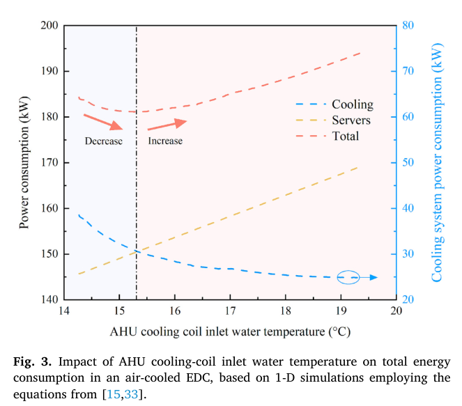
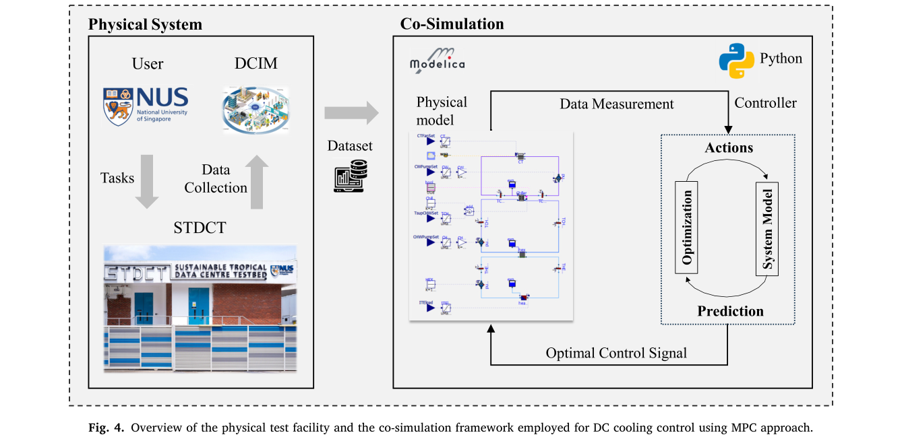
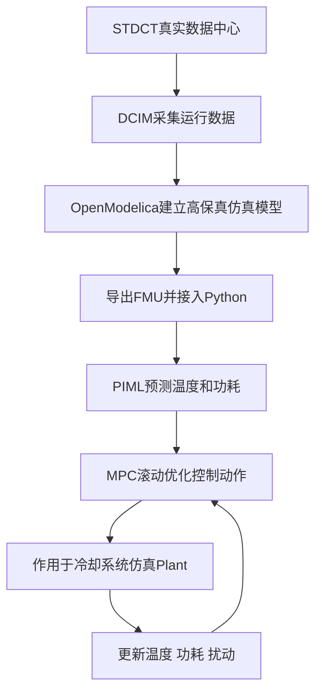
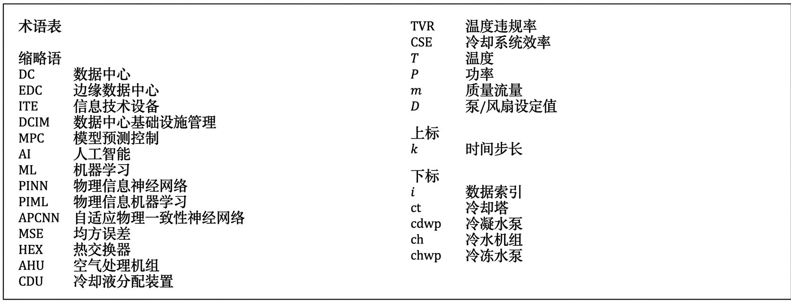
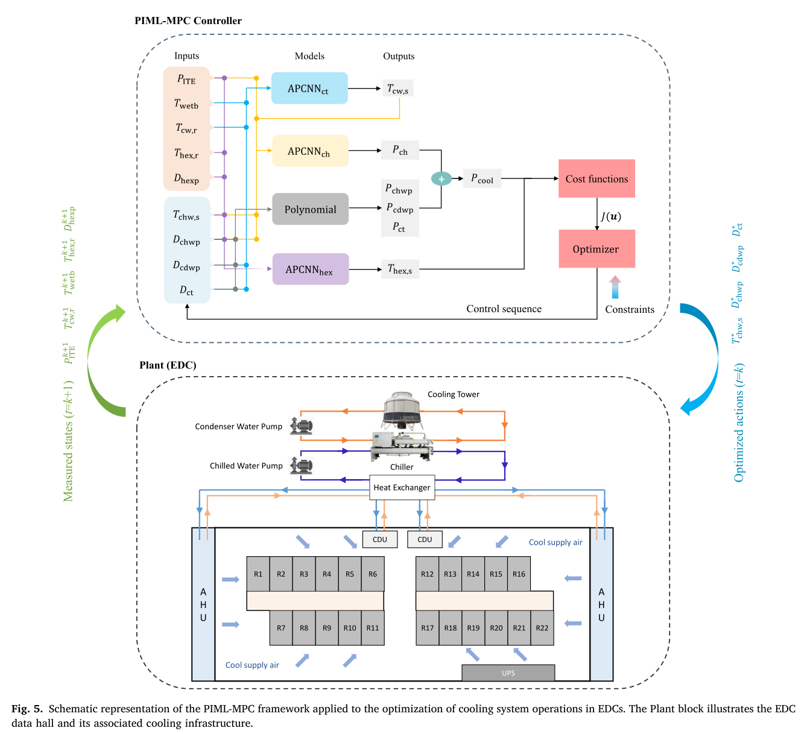
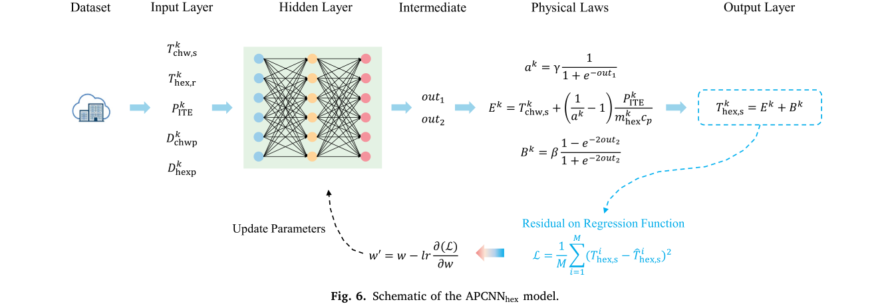
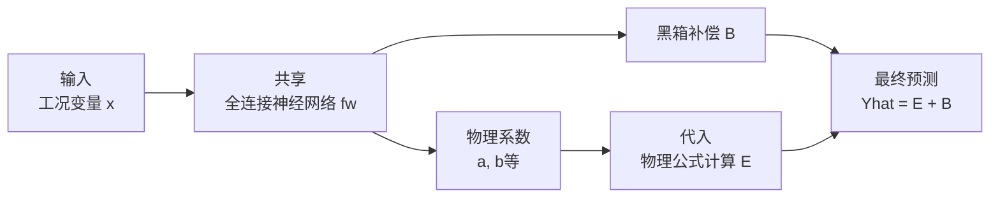
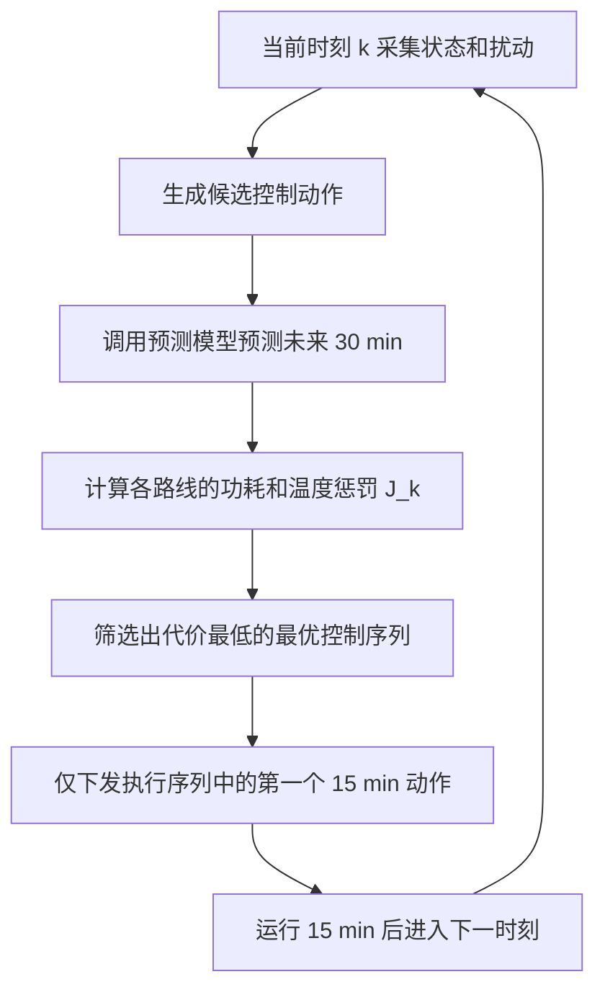

# 基于物理原理的机器学习预测控制在边缘数据中心智能运维中的应用

> **上传者**：秦若宸  
> **论文标题**：[Physics informed machine learning based predictive control for intelligent operation of edge datacenters](https://www.sciencedirect.com/science/article/pii/S0306261925017052)  
> **论文PDF**：[paper.pdf](paper.pdf)  
> **阅读时间**：2026-6-2

---

## 论文DNA

这篇论文的核心是：把**物理约束神经网络 APCNN**嵌入**模型预测控制 MPC**，用于边缘数据中心冷却系统，使控制器在降低冷却能耗的同时维持供水温度安全，并在未见过的高负荷工况下保持较强泛化能力。

## 知识向量，4维度摘要

### 维度1：研究问题，数据中心冷却控制为什么需要 PIML-MPC

边缘数据中心 EDC 需要低延迟部署，冷却系统通常包含冷水机、泵、冷却塔、换热器等高耗能设备。传统固定设定点控制常按峰值热负荷设计，低负荷时容易过冷，造成额外能耗；纯机器学习 MPC 又依赖训练数据质量，在未见工况下容易温度越界。本文提出的 PIML-MPC 试图解决“节能、温度约束、泛化稳定性”三者同时满足的问题。

作者先用图3说明一个关键物理动机：随着 AHU 冷却盘管进水温度升高，冷却系统功耗下降，但服务器功耗上升，总功耗呈 U 形变化。因此，控制器不能只追求冷水机节能，还要考虑服务器侧热风险。

图3: AHU冷却盘管进水温度对冷却系统、服务器与总功耗的影响，显示总功耗存在U形最优区间

### 维度2：总体框架，PIML-MPC如何工作

本文的整体流程是：STDCT 数据中心测量数据经 DCIM 采集后，用 OpenModelica 构建高保真仿真模型，并导出为 FMU 接入 Python；在 Python 中运行 PIML-MPC，滚动优化冷却系统设定值，再与实际固定控制和其他 MPC 方法对比。

图4: 物理试验设施、OpenModelica仿真模型与Python控制器之间的联合仿真流程

PIML-MPC 的控制对象是室外冷却环路，控制变量有四个：冷水机供水温度设定值、冷冻水泵设定值、冷凝水泵设定值、冷却塔风机转速。预测状态包括各部件功耗以及冷却塔供水温度、换热器供水温度；扰动量主要是 ITE 负荷和室外湿球温度。

> 
> 表1: 术语表

> 
> 图5: PIML-MPC框架，APCNN预测冷却塔、冷水机和换热器状态，优化器输出四个控制动作

### 维度3：方法核心，APCNN把哪些物理知识嵌进神经网络

APCNN，全称 **Adaptive Physically Consistent Neural Network**，可理解为“带自适应物理一致性约束的神经网络”。它把预测量写成：

$$\hat{Y} = E + B$$

其中 $E$ 是物理模块，来自热力学、换热、能量守恒等已知关系；$B$ 是黑箱修正模块，用于补偿传感器误差、旁路流、设备老化等难以直接建模的残差。系数不是固定经验值，而是由神经网络根据输入状态自适应输出，并通过 Sigmoid、Tanh、ReLU 等激活函数限制在符合物理意义的范围内。

以换热器为例，作者从 $\varepsilon\text{-NTU}$ 方法(用换热器有效度 ε 和传热单元数 NTU，在不知道出口温度的情况下，估算换热器实际能交换多少热量)和能量平衡出发，构造换热器供水温度预测模型：

$$T_{\text{hex,s}}^{k} = E^{k} + B^{k}$$

$$E^{k} = T_{\text{chw,s}}^{k} + \left(\frac{1}{a^{k}} - 1\right)\frac{P_{\text{ITE}}}{\dot{m}_{\text{hex}} c_p}$$

这里 $a^{k}$ 被限制在 (0,1)，对应换热有效度和热容比形成的物理系数。

$$a^k = \frac{\text{实际降温幅度}}{\text{理论最大可降温幅度}} = \frac{T_{\text{hex,r}}^k - T_{\text{hex,s}}^k}{T_{\text{hex,r}}^k - T_{\text{chw,s}}^k}$$

​这个设计的意义是：模型预测可以随数据变化调整，但不能产生明显违反换热规律的结果。

> 
> 图6: APCNNhex模型结构，物理模块与残差修正模块共同预测换热器供水温度

APCNN 和传统 PINN 的差别可以这样理解：PINN 常把 PDE 残差放进损失函数，比如 Navier-Stokes 方程残差；APCNN 更适合这类工程热系统，因为这里没有一个统一清晰的 PDE 控制方程，作者采用的是代数形式的热力学关系、换热关系和经验物理关系。PINN 的物理约束通常放在损失函数里。也就是模型先预测，然后检查预测结果违反物理方程多少，再通过损失函数惩罚它。它的物理约束是“训练目标的一部分”。

### 维度4：控制目标，MPC如何权衡节能与温度安全

$\text{MPC}$ 控制器设定为每 $\Delta t = 15 \text{ min}$ 求解一次优化问题，预测时域设为 $T_p = 30 \text{ min}$（即 $2$ 个 $\text{Timesteps}$）。其余滚动优化目标函数定义为：

$$\min_{\mathbf{u}} J_k = \lambda_1 J_{\text{power}}^{k} + \lambda_2 J_{\text{temp}}^{k}$$

- **系统总能耗惩罚项 ($J_{\text{power}}^{k}$)**：表示冷冻水泵、冷水机、冷凝水泵、冷却塔风机总功耗

$$J_{\text{power}}^{k} = P_{\text{chwp}}^{k} + P_{\text{ch}}^{k} + P_{\text{cdwp}}^{k} + P_{\text{ct}}^{k}$$

- **热安全约束惩罚项 ($J_{\text{temp}}^{k}$)**：惩罚换热器供水温度偏离目标值的二次方

$$J_{\text{temp}}^{k} = \left(T_{\text{hex,s}}^{k} - T_{\text{sp}}\right)^2$$

_(注：本文设定控制中心基准值 $T_{\text{sp}} = 18^\circ\text{C}$，物理安全硬约束容许波动范围严格限定在 $[17^\circ\text{C}, 19^\circ\text{C}]$)\_。

为了定量评估系统性能，引入以下两大关键评价指标：

| 关键评估指标 ($\text{Metrics}$)                        | 物理及工程含义                                                                              |     是否越小越好     | 本文中的核心核心作用                                     |
| :----------------------------------------------------- | :------------------------------------------------------------------------------------------ | :------------------: | :------------------------------------------------------- |
| **$\text{TVR}$** ($\text{Temperature Violation Rate}$) | 供水温度 $T_{\text{hex,s}}$ 超过安全上限 $19^\circ\text{C}$ 的时间步比例                    | 是 ($\rightarrow 0$) | 评估系统是否存在导致服务器宕机或局部过热的**热安全风险** |
| **$\text{CSE}$** ($\text{Cooling System Efficiency}$)  | 冷却系统总功耗与 $\text{IT}$ 设备总功耗的比值 ($\frac{P_{\text{cooling}}}{P_{\text{ITE}}}$) |          是          | 判断冷却效率                                             |

---

## 贡献网格

| 贡献点         | 具体做法                                         | 关键结果                                                                  | 价值判断                         |
| -------------- | ------------------------------------------------ | ------------------------------------------------------------------------- | -------------------------------- |
| PIML-MPC框架   | 将 APCNN、物理方程、MPC 优化器耦合               | 已见工况节能 12.6%，TVR 0%                                                | 解决固定设定控制的过冷问题       |
| 组件级物理嵌入 | 对换热器、冷水机、冷却塔分别构建物理一致预测模型 | 未见工况节能 9.1%，TVR 1.0%                                               | 提高训练数据外泛化能力           |
| 与主流MPC对比  | 对比 ANN-MPC、NARX-MPC、ARX-MPC                  | 未见工况 TVR：PIML-MPC 1.0%，ANN-MPC 24.9%，NARX-MPC 40.5%，ARX-MPC 57.0% | 证明物理嵌入对安全约束有实际作用 |
| 随机种子稳定性 | 10个随机种子重复训练与控制评估                   | PIML-MPC 标准差最低                                                       | 降低部署时反复调参风险           |
| 工程可计算性   | 15分钟控制间隔，平均每步优化约 2.73 s            | 远低于控制周期                                                            | 支持实时控制部署                 |

---

## 文献关联网络

这篇论文位于四条研究线的交汇处。

第一条线是 **数据中心冷却优化**。已有研究关注自由冷却、液冷、气流组织、冷水机优化等，本文把重点放在边缘数据中心的水侧冷却控制，尤其是单冷水机、单冷却塔这类紧凑系统。

第二条线是 **MPC控制**。传统 MPC 的关键瓶颈是预测模型难建，尤其在非线性热系统中，纯物理模型开发成本高，纯数据模型泛化弱。本文将 APCNN 作为 MPC 的预测模型，属于“物理增强预测模型 + 滚动优化控制”的路线。

第三条线是 **PINN / PIML**。经典 PINN 多依赖 PDE 残差，例如流体力学中的 Navier-Stokes 方程；本文的对象是数据中心冷却系统，缺少清晰统一的 PDE 描述，因此采用代数热力学关系、能量守恒、NTU关系、COP关系等工程物理约束。

第四条线是 **机器学习控制部署可靠性**。很多 ML-MPC 只报告平均节能，较少讨论随机初始化、训练集划分和未见工况下的控制波动。本文通过 10 个随机种子和未见高负荷数据说明 PIML-MPC 的低波动性，这是它面向工程部署的主要加分项。

---

## 对这篇论文的关键判断

这篇论文的真正价值不在于“用了神经网络”，而在于它把神经网络的输出限制在热力学可接受范围内，使 MPC 的滚动优化过程不容易被错误预测带偏。对于数据中心冷却这类强约束系统，温度越界的代价很高，因此单纯追求最低能耗没有意义。本文最有说服力的证据是未见工况结果：纯 ANN 在已见工况下看起来接近 PIML-MPC，但到高负荷未见数据后 TVR 明显升高；PIML-MPC 仍能把 TVR 控制在 1.0%，这说明物理约束主要提升的是**约束可靠性和工况外泛化**。

局限也比较明确：结果来自高保真仿真模型，虽然仿真模型用实测数据校准，但现场传感器噪声、通讯延迟、设备老化、换热器结垢、控制执行器滞后等因素仍可能影响真实部署效果。作者也承认后续需要进行 STDCT 实地试验，并发展在线自适应 PIML-MPC。

---

# 算法部分

这篇文章的核心算法框架可以概括为：$\text{PIML-MPC}$ = 物理约束神经网络预测模型 + 模型预测控制优化器其核心思想是：先利用自带热力学物理结构的神经网络（$\text{APCNN}$）精准预测冷却系统在不同工况下的未来状态，再利用 $\text{MPC}$ 优化器从中选出最省电且绝对不触发温度报警的最优控制动作组合。

## 1. 整体算法流程

作者的整体技术路线如下：获取真实数据 $\rightarrow$ 建立高保真物理仿真库 $\rightarrow$ 接入算法环境 $\rightarrow$ 滚动优化控制。

根据论文所述，$\text{APCNN}$ 是 $\text{PIML-MPC}$ 的核心预测部件（涵盖换热器、冷水机组和冷却塔组件），而 $\text{MPC}$ 负责目标函数计算、安全约束定义和全局优化求解。

## 2. 控制系统中的变量划分

作者将数据中心水侧冷却系统的变量严格划分为三大类（详见论文 2.1 节）：

- 第一类：控制输入 ($u_k$)这是 $\text{MPC}$ 控制器能够主动调节的执行机构动作：

$$u_k = \left[ T_{\text{chw,s}}^k, D_{\text{cdwp}}^k, D_{\text{chwp}}^k, D_{\text{ct}}^k \right]$$

$T_{\text{chw,s}}^k$：冷水机供水温度设定值$D_{\text{cdwp}}^k$：冷凝水泵设定值（转速比）$D_{\text{chwp}}^k$：冷冻水泵设定值（转速比）$D_{\text{ct}}^k$：冷却塔风机速度（转速比）

- 第二类：状态 / 输出变量 ($\hat{Y}$)这是预测模型需要输出、且 $\text{MPC}$ 需要进行评估的对象。包含各设备功耗和关键节点温度：

$$P_{\text{chwp}}^k, \ P_{\text{cdwp}}^k, \ P_{\text{ch}}^k, \ P_{\text{ct}}^k$$

$$T_{\text{cw,s}}^k, \ T_{\text{hex,s}}^k$$

(注：$T_{\text{hex,s}}^k$ 是换热器送往数据机房的供水温度，是全系统热安全约束的最核心变量)。

- 第三类：扰动变量 ($D$ 或 $v$)系统无法控制，但会作为外部条件强烈影响系统状态的客观因素：$P_{\text{ITE}}^k$：$\text{IT}$ 设备实时总热负荷$T_{\text{wetb}}^k$：室外环境湿球温度

## 3. 什么是 APCNN？

$\text{APCNN}$ 的全称是 $\text{Adaptive Physically Consistent Neural Network}$（自适应物理一致性神经网络）。其基础数学结构非常直观：

$$\hat{Y} = E + B$$

$E$：物理方程先验模块（由热力学方程、能量守恒、$\text{COP}$ 定义、$\text{NTU}$ 传热单元数法等严谨推导而来）。$B$：黑箱残差补偿模块（由神经网络捕捉，负责补偿传感器漂移、旁路水流、设备老化等难以用公式解析建模的非线性偏差）。区别于普通前馈神经网络（$\text{ANN}$）直接拟合全局映射 $\hat{Y} = f_{\theta}(x)$，$\text{APCNN}$ 的核心在于：让物理公式决定趋势主导权，让神经网络去学习公式中难以标定的动态系数与残差。

## 4. APCNN 的网络训练机制

模型采用均方误差（$\text{MSE}$）作为损失函数：

$$L = \frac{1}{M} \sum_{i=1}^{M} \left( Y_i - \hat{Y}_i \right)^2$$

在反向传播更新权重 $w$ 时：

$$w' = w - lr \frac{\partial L}{\partial w}$$

(根据论文附录 B 描述：所有网络均基于 PyTorch 构建。超参数经**贝叶斯优化**选定，按 80/20 划分训练验证集，采用 Adam 优化器，学习率 $lr = 5 \times 10^{-4}$，Batch Size 为 64，网络结构为 4 层隐藏层，每层 128 个神经元，并配置了 Early Stopping 及 L2 正则化机制防止过拟合)。

### 4.1 贝叶斯优化

#### 4.1.1 超参数

神经网络内部包含两类本质不同的参数：

- **模型参数（Model Parameters）**：如权重（$w$）和偏置（$b$）。它们存在于网络内部，在训练过程中由 $\text{Adam}$ 优化器利用梯度自动调整更新。
- **超参数（Hyperparameters）**：在训练启动前必须人为或通过外部算法设定好的控制变量。它们决定了网络的外壳结构和训练节奏，通常包括：
    - $lr$（$\text{Learning Rate}$，基础学习率）
    - $\text{Batch Size}$（每批训练随机抽取的样本数量）
    - $\text{Hidden Layers}$（隐藏层总层数）
    - $\text{Neurons}$（每一层隐藏层的神经元数量）
    - $\text{L2}$ 正则化权重衰减系数（$\lambda$）
    - $\text{Early Stopping}$（提前终止训练的耐心轮数 $\text{Patience}$）

超参数会直接决定模型的训练效率和最终性能，但它们**无法**通过普通的网络反向传播梯度直接进行自我更新。

#### 4.1.2 什么是贝叶斯优化

贝叶斯优化可以被形象地理解为一种**高级的、具备推理能力的智能试参数方法**。

它在数学上解决的是一个高成本黑箱优化问题：

$$\min_{h} F(h)$$

其中：

- $h$ 表示一组特定的待搜索超参数向量，例如：

$$h = (lr, \ \text{Batch Size}, \ \text{hidden layers}, \ \text{neurons})$$

- $F(h)$ 表示在这组超参数 $h$ 配置下，神经网络训练完成后在**验证集（Validation Set）**上表现出的误差损失（$\text{MSE}$）：

$$F(h) = L_{\text{val}}$$

- 贝叶斯优化的价值在于：**它能够利用极其有限的试验（$\text{Trials}$）次数，用最经济的算力开销高效揪出那组最优的超参数配置**。

#### 4.1.3 贝叶斯优化的两大核心思想

贝叶斯优化之所以聪明，全靠两个核心部件在幕后配合：**代理模型（Surrogate Model）** 与 **采集函数（Acquisition Function）**。

##### 4.1.3.1 代理模型（Surrogate Model）

由于真实的目标函数 $F(h)$ 计算代价极其昂贵（每评估一组超参数 $h$，都必须先花时间完整地训练完一个神经网络才能得到其验证集误差 $L_{\text{val}}$）：

$$\text{输入 } h_1 = (lr=10^{-4}, \dots) \xrightarrow{\text{完整训练神经网络}} \text{计算得到验证集误差 } F(h_1) = 0.15$$

$$\text{输入 } h_2 = (lr=5\times10^{-4}, \dots) \xrightarrow{\text{完整训练神经网络}} \text{计算得到验证集误差 } F(h_2) = 0.08$$

为了打破算力瓶颈，贝叶斯优化在内部建立了一个成本极低的数学近似模型 $\hat{F}(h)$，用来低成本推测“某组未试过的超参数可能会带来多大的验证误差”。这个低成本的近似模型就叫**代理模型**。
论文及工程界常用的代理模型包括：

- 高斯过程（$\text{Gaussian Process, GP}$）
- 树状巴岑估计器（$\text{Tree-structured Parzen Estimator, TPE}$）
- 随机森林回归器（$\text{Random Forest}$

##### 高斯过程（GP）怎么判断两个超参数“相似”？

在高斯过程（$\text{Gaussian Process, GP}$）的架构中，衡量两组超参数相似度的核心利器是**核函数（Kernel Function）**，通常记作：

$$k(h_i, h_j)$$

它负责计算任意两个超参数组合在特征空间中的协方差或相似距离。

例如，假设我们手头有三组超参数配置：

- 配置 $h_i$：

$$h_i = \left( lr = 5 \times 10^{-4}, \ \text{Batch Size} = 64, \ \text{Hidden Layers} = 4 \right)$$

- 配置 $h_j$（与 $h_i$ 极度接近）：

$$h_j = \left( lr = 5.2 \times 10^{-4}, \ \text{Batch Size} = 64, \ \text{Hidden Layers} = 4 \right)$$

- 配置 $h_k$（与 $h_i$ 差异巨大）：

$$h_k = \left( lr = 10^{-2}, \ \text{Batch Size} = 16, \ \text{Hidden Layers} = 1 \right)$$

通过核函数计算时：

- 因为 $h_i$ 和 $h_j$ 的物理坐标靠得非常近，模型认为它们的性能表现高度相关，因此核函数输出值较大：

$$k(h_i, h_j) \uparrow$$

- 因为 $h_i$ 和 $h_k$ 在各维度上都大相径庭，模型认为它们的表现几乎没有耦合性，因此核函数输出值趋近于 $0$：

$$k(h_i, h_k) \approx 0$$

> **核函数的本质作用**：就是充当 $\text{GP}$ 代理模型的“指南针”，明确告诉算法：“哪些已经试过的超参数点，对当前新预测的这个参数点最具参考价值。”

##### 高斯过程预测的严格数学形式

在贝叶斯优化的滚动迭代中，假设我们当前已经在内层训练过 **$n$** 组超参数组合，构成历史超参数矩阵 $H$：

$$H = \left[ h_1, \ h_2, \ \dots, \ h_n \right]$$

这 $n$ 组超参数经过神经网络完整训练后，在验证集上吐出的真实黑箱误差（即评估标签）构成向量 $y$：

$$y = \left[ F(h_1), \ F(h_2), \ \dots, \ F(h_n) \right]^T$$

此时，$\text{GP}$ 代理模型会利用核函数，在已知的这 $n$ 个锚点之间两两计算相似度，构筑出一个对称的**自协方差核矩阵（Kernel Matrix）** $K$：

$$
K = \begin{bmatrix}
k(h_1, h_1) & k(h_1, h_2) & \cdots & k(h_1, h_n) \\
k(h_2, h_1) & k(h_2, h_2) & \cdots & k(h_2, h_n) \\
\vdots & \vdots & \ddots & \vdots \\
k(h_n, h_1) & k(h_n, h_2) & \cdots & k(h_n, h_n)
\end{bmatrix}
$$

现在，贝叶斯优化想在全空间内评估一个全新的候选超参数点 $h_*$。

第一步，算法会计算该新点与所有历史旧点之间的相似度交叉向量：

$$k_* = [ k(h_*, h_1), \, k(h_*, h_2), \, \dots, \, k(h_*, h_n) ]$$

第二步，$\text{GP}$ 即可通过多维高斯分布的条件概率公式，直接解算出该新点在验证集上的预测均值 $\mu(h_*)$：

$$\mu(h_*) = k_* K^{\text{-1}} y$$

---

#### 4.1.3.2 采集函数（Acquisition Function）的作用

采集函数是贝叶斯优化的决策大脑，专门根据代理模型提供的信息，计算并在整个超参数空间中寻找“下一步最值得去哪个坐标点做试验”。它完美平衡了机器学习中的两大经典博弈：

- **利用（Exploitation）**：去那些历史结果已经证明表现优异的超参数聚落周围继续深挖。例如已知 $lr=5\times10^{-4}$ 表现很好，那就顺藤摸瓜去测试 $4\times10^{-4}$ 或 $6\times10^{-4}$。
- **探索（Exploration）**：勇敢地跨出舒适区，去那些尚未进行过试验、代理模型不确定性（方差 $\sigma$）极高的超参数进行试探，赌一把是否存在全局更优解。

常见的采集函数数学算子包括：

- 期望改进（$\text{Expected Improvement, EI}$）
- 置信上界（$\text{Upper Confidence Bound, UCB}$）
- 改进概率（$\text{Probability of Improvement, PI}$）

### 4.2 Adam 优化器核心机制与数学原理

$\text{Adam}$ 是 **$\text{Adaptive Moment Estimation}$**（自适应矩估计）的缩写，在神经网络训练过程中，它直接负责更新和校准网络各层的权重参数（$w$）。

在理解 $\text{Adam}$ 之前，最基础的梯度下降（$\text{SGD}$）公式为：

$$w_{t+1} = w_t - lr \cdot \frac{\partial L}{\partial w_t}$$

其中：

- $w_t$ 是第 $t$ 次更新前的权重；
- $w_{t+1}$ 是更新后的权重；
- $L$ 是损失函数（$\text{Loss Function}$）；
- $\frac{\partial L}{\partial w_t}$ 是当前权重对应的梯度；
- $lr$ 是人为设定的学习率（$\text{Learning Rate}$）。

---

#### 4.2.1 普通梯度下降（SGD）面临的问题

神经网络训练通常采用小批量随机梯度下降（$\text{Mini-batch SGD}$）机制。比如 $\text{Batch Size} = 64$，意味着每次迭代仅利用随机抽取的 $64$ 个样本来估计全局梯度。
这会导致计算出的梯度带有巨大的随机噪声：当前批次的 $64$ 个样本可能指引参数向左修正，下一批次的 $64$ 个样本又指引参数向右偏回。整个训练轨迹会发生剧烈震荡拉锯。

---

#### 4.2.2 Adam 是如何解决这些问题的？

$\text{Adam}$ 优化器创新地融合了“动量机制”与“自适应学习率”的精髓，同时施展以下两套组合拳：

1. **对梯度方向做平滑处理**：不仅看当前的梯度，还融合了历史的累积方向，相当于给行进路线增加了物理“动量（惯性）”。
2. **自适应调整更新步长**：根据每个参数独特的历史梯度大小，为全网络中千万个不同的参数量身定制各自专属的自适应更新步长。

---

## 5. Adam 的核心数学推演公式

在第 $t$ 个迭代步下，算法首先计算当前小批量（$\text{Mini-batch}$）数据下的基础物理梯度：

$$g_t = \nabla_w L_t(w_t)$$

这里 $g_t$ 即为当前这批数据反向传播计算出的原始梯度。

### 5.1 一阶矩：梯度方向的滑动平均（动量惯性）

$$m_t = \beta_1 m_{t-1} + (1 - \beta_1) g_t$$

- $m_t$ 是梯度的一阶矩估计，物理上指代**平滑后的平均梯度方向**。
- 超参数 $\beta_1$ 工程上通常默认取值 **$0.9$**。
- **物理含义**：若 $\beta_1 = 0.9$，意味着新的平滑推进方向中，有 $90\%$ 继承自过去的累积惯性，仅让 $10\%$ 的话语权留给当前最新的小批量梯度。这相当于给优化路线加上了稳健的“惯性防震器”。

### 5.2 二阶矩：梯度平方的滑动平均（活跃度追踪）

$$v_t = \beta_2 v_{t-1} + (1 - \beta_2) g_t^2$$

- $v_t$ 是梯度的二阶矩估计，物理上指代**梯度平方的滑动平均**。
- 超参数 $\beta_2$ 工程上通常默认取值 **$0.999$**。
- **物理含义**：$v_t$ 动态反映了某个特定参数在近期迭代中震荡幅度的“活跃度”。如果某个参数的梯度长期处于巨幅震荡状态，$v_t$ 的数值就会滚雪球般增大；反之，若该参数梯度长期微弱，$v_t$ 就会持续萎缩。

### 5.3 零启动阶段的偏差修正（Bias Correction）

由于在迭代刚启动的第一步，系统初始状态人为设定为 $m_0 = 0, \ v_0 = 0$，这会导致训练前几步的 $m_t$ 和 $v_t$ 受到严重的向零偏置压制（数值偏小）。因此，$\text{Adam}$ 引入了偏差修正公式：

$$\hat{m}_t = \frac{m_t}{1 - \beta_1^t}$$

$$\hat{v}_t = \frac{v_t}{1 - \beta_2^t}$$

_(注：分母中的 $\beta_1^t$ 和 $\beta_2^t$ 表示对应超参数的 $t$ 次方。随着迭代步数 $t$ 的增大，分母会迅速逼近于 $1$，偏差修正项将自动淡出。)_

### 5.4 终极参数动态更新算子

汇聚上述所有后验指标后，$\text{Adam}$ 施加对网络权重的最终精准修改：

$$w_{t+1} = w_t - \frac{\alpha}{\sqrt{\hat{v}_t} + \epsilon} \hat{m}_t$$

- $\alpha$ 为静态基础学习率（对应本文模型中的最优配置 $lr = 5 \times 10^{-4}$）；
- $\epsilon$ 为防止分母发生数学除零错误的极小稳定算子（工程上默认设为 $\epsilon = 10^{-8}$）。

---

## 6. 如何直观、通俗地看懂 Adam 的更新算子？

我们将更新公式的核心调节项单独提炼出来进行物理拆解：

$$\text{新参数} = \text{老参数} - \alpha \cdot \left( \frac{\hat{m}_t}{\sqrt{\hat{v}_t} + \epsilon} \right)$$

- **行进方向的护航**：参数的更新方向完全来自 $\hat{m}_t$，即经过动量平滑后的核心梯度方向，从而彻底抹平了小批量带来的随机震荡噪声。
- **自适应步长的调控**：有效更新步长被分母上的历史梯度活跃度 $\sqrt{\hat{v}_t}$ 进行强力约束。

### 由此引出“千人千面”的自适应调速机制：

1. **如果某个参数的梯度在过去频繁暴增（$\hat{v}_t$ 很大）**：
   说明该通道异常活跃且极不稳定。根据公式，分母变大后会迫使整体有效修正项 $\frac{\hat{m}_t}{\sqrt{\hat{v}_t} + \epsilon}$ **自适应变小**。优化器会对该参数执行更加谨慎、克制的微步挪动，防止发生梯度爆炸。
2. **如果某个参数的梯度在过去常年处于麻木或被忽视状态（$\hat{v}_t$ 很小）**：
   说明该通道缺乏激活。根据公式，极小的分母会使有效学习率**自适应向上放大**。优化器会给予该落后参数更强烈的推进力，将其向外拉拽。

## **结论**：$\text{Adam}$ 成功打破了传统方法一成不变的僵局，实现了对网络中每一个独立权重参数进行**因地制宜、千人千面的有效自适应步长控制**。

## 7. MPC 优化构建与求解器机制

### 7.1 目标函数设计

$\text{MPC}$ 需要在“极致省电”和“温度达标”之间走钢丝：

$$J_k = \lambda_1 J_{\text{power}}^k + \lambda_2 J_{\text{temp}}^k$$

总能耗惩罚项：$J_{\text{power}}^k = P_{\text{chwp}}^k + P_{\text{ch}}^k + P_{\text{cdwp}}^k + P_{\text{ct}}^k$

温度偏离惩罚项：$J_{\text{temp}}^k = (T_{\text{hex,s}}^k - T_{\text{sp}})^2$(论文设定权重 $\lambda_1=1, \lambda_2=1$，目标设定温度 $T_{\text{sp}} =$ 18°C)。

### 7.2 强安全物理约束

除了执行机构的物理转速和设定温度极限（$u_{\min} \leq u_k \leq u_{\max}$）之外，系统必须严格遵守：绝对温度屏障：$17^\circ\text{C} \leq T_{\text{hex,s}}^k \leq 19^\circ\text{C}$温差异常限制（防止破坏热分层与冷凝压力）：

$$T_{\text{chw,r}}^k - T_{\text{chw,s}}^k \leq \Delta T_{\text{chw}}^{\max}$$

$$T_{\text{cdw,r}}^k - T_{\text{cdw,s}}^k \leq \Delta T_{\text{cdw}}^{\max}$$

## 7.3 滚动优化与求解器

论文采用控制间隔为 15 min，预测时域为 30 min（2 步）的滚动时域控制策略。

