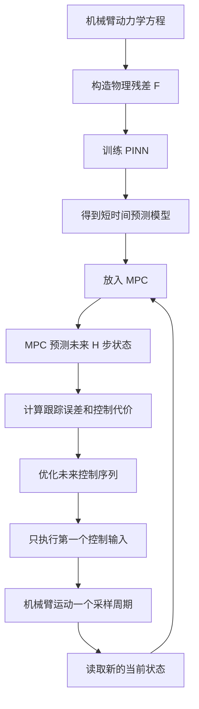
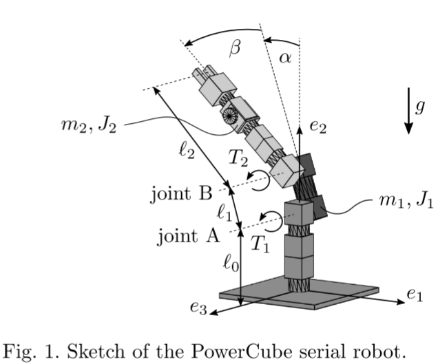
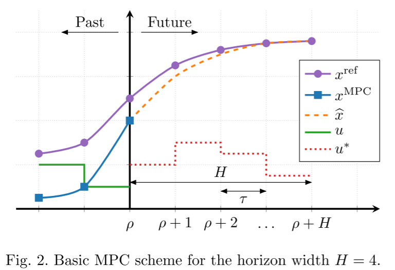
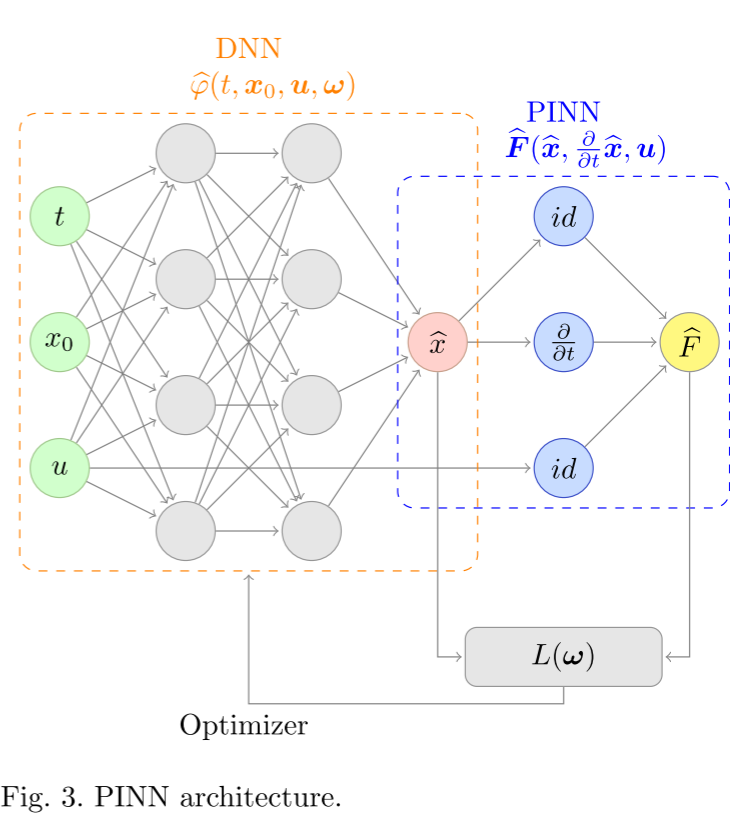
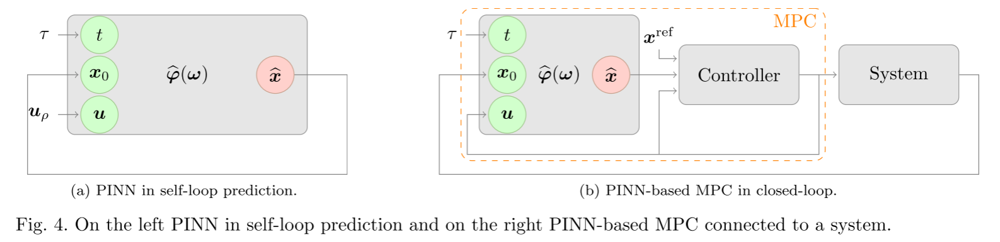
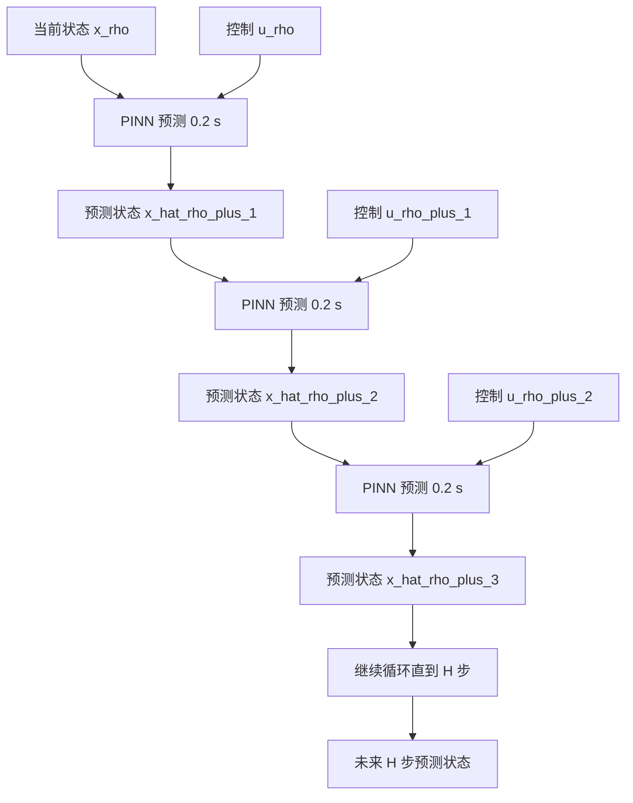
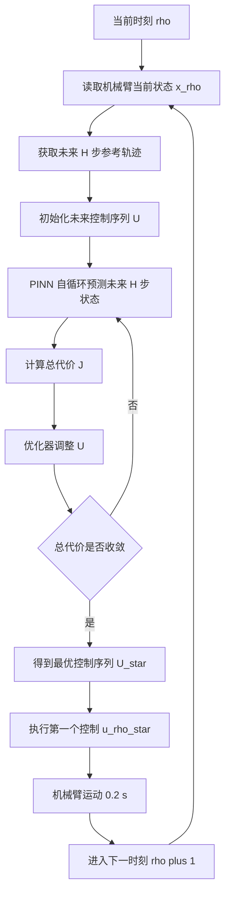

# 基于物理信息神经网络的多连杆操纵器的模型预测控制

> **上传者**：QRC
> 
> 
> **论文标题**：[Physics-informed Neural Networks-based Model Predictive Control for Multi-link Manipulators](https://link.springer.com/article/10.1007/s00348-023-03629-4)  
> **论文PDF**：[paper.pdf](paper.pdf)  
> **阅读时间**：2026-7-20

## 1. 文章要解决的问题

论文研究对象是一个多连杆机械臂，具体是 PowerCube serial robot。这类机械臂的控制目标很直观：让机械臂末端或关节角度尽量跟踪给定参考轨迹。难点在于机械臂动力学是强非线性的，包含质量矩阵、科氏力、陀螺项、摩擦、重力项和电机输入等因素。MPC 在每个控制时刻都需要预测未来多个时间步的状态，并求解一个优化问题，所以预测模型的计算速度直接决定控制器能否实时运行。

传统做法一般有两类。第一类是直接使用非线性动力学方程，通过 RK45、RK4、Euler 等方法积分得到未来状态；这种方式精度可靠，但每次 MPC 优化都要多次积分，在线计算成本高。第二类是对非线性系统进行线性化，再用线性 MPC 或近似 NMPC；这种方法速度快，但依赖已知的参考轨迹和线性化点，对轨迹未知或变化较大的场景不够灵活。本文选择第三条路线：用 PINN 学习一个满足物理方程约束的神经网络流映射，用它替代数值积分器。

## 2. 被控系统：两自由度机械臂动力学

论文中的机械臂有两个转动关节，广义坐标为：

$$q = \begin{bmatrix} \alpha \\ \beta \end{bmatrix} \in \mathbb{R}^{2}$$

其中 $\alpha$ 和 $\beta$ 是两个关节角。机械臂动力学写成二阶形式：

$$M(q)\ddot{q} + k(q,\dot{q}) = h(q,\dot{q}) + Bu$$

这里 $M(q)$ 是质量矩阵，$k(q,\dot{q})$ 表示离心力、科氏力和陀螺力项，$h(q,\dot{q})$ 表示外加力项，$B$ 是输入矩阵，$u \in \mathbb{R}^{2}$ 是两个关节电机的电流输入。为了用于控制和 PINN 训练，作者把二阶动力学改写成一阶状态空间形式：

$$x = \begin{bmatrix} q \\ \dot{q} \end{bmatrix} = \begin{bmatrix} \alpha \\ \beta \\ \dot{\alpha} \\ \dot{\beta} \end{bmatrix} \in \mathbb{R}^{4}$$

$$\dot{x} = \begin{bmatrix} 
\dot{q} \\ 
M(q)^{-1} \left[ h(q, \dot{q}) + Bu - k(q, \dot{q}) \right] 
\end{bmatrix}$$

所以，系统状态维度是 4，控制输入维度是 2。论文中还把动力学写成残差形式：

$$0 = F(x(t), \dot{x}(t), u(t))$$

这个写法对 PINN 很关键，因为 PINN 的物理损失就是把神经网络预测的 $\hat{x}$ 和自动微分得到的 $\frac{\partial \hat{x}}{\partial t}$ 代入 $F$，让残差尽量接近 0。

## 3. MPC 的基本形式

论文采用的是离散时间 NMPC。连续系统为：

$$\dot{x}(t) = f(x(t), u(t))$$

采样周期为 $\tau$，离散化后写成：

$$x_{k+1} = \phi(\tau, u_k, x_k)$$

这里 $\phi$ 是系统流映射，表示从当前状态 $x_k$ 出发，在控制 $u_k$ 作用 $\tau$ 秒后得到下一步状态 $x_{k+1}$。MPC 的预测时域长度为 $H$，每次优化未来 $H$ 个控制输入：

$$u_\rho, u_{\rho+1}, \ldots, u_{\rho+H-1}$$

优化目标是让预测状态尽量接近参考状态，同时控制输入不要过大。论文使用二次型代价函数：

$$\ell(x_k^{ref}, x_k, u_k) = \|x_k^{ref} - x_k\|_Q^2 + \|u_k\|_R^2$$

对应的有限时域优化问题为：

$$\min_{u_\rho, \ldots, u_{\rho+H-1}} \sum_{k=\rho}^{\rho+H-1} \ell(x_k^{ref}, x_k, u_k)$$

约束条件为：

$$x_{k+1} = \phi(\tau, u_k, x_k)$$

$$u_k \in U, \quad x_k \in X$$

MPC 的运行方式是滚动优化。每个控制时刻求出未来 $H$ 步最优控制序列，只执行第一个控制  $u_\rho^* $ ，到下一个采样时刻重新测量状态、重新优化。论文第 2 图展示的就是这个滚动预测结构。

| 元素         | 符号                 | 图中颜色/形态      | 核心含义与作用                                           |
|:---------- |:------------------ |:------------ |:------------------------------------------------- |
| **目标轨迹**   | $x^{\mathrm{ref}}$ | 紫色曲线         | 机械臂希望跟踪的理想状态。                                     |
| **实际状态**   | $x^{\mathrm{MPC}}$ | 蓝色曲线 / 蓝色方块  | 过去已执行控制后的真实系统状态，当前时刻 $\rho$ 的蓝色方块作为预测的初始起点。       |
| **预测状态**   | $\hat{x}$          | 橙色虚线         | 控制器内部基于动力学模型预测的未来状态轨迹（“如果接下来这样控制，系统会怎么走”）。        |
| **历史控制**   | $u$                | 绿色实线         | 过去已经实际施加给机械臂的控制输入。                                |
| **最优控制序列** | $u^*$              | 红色虚线         | 当前时刻 $\rho$ 优化计算出的未来最优控制输入。虽然预测了 $H$ 步，但实际只执行第一步。 |
| **预测时域**   | $H$                | 跨度长度 ($H=4$) | MPC 每次向前预测的步数，决定了控制器的“眼界”远近。                      |
| **采样周期**   | $\tau$             | 时间间隔         | 相邻两个控制时刻之间的时间步长。                                  |

> **核心逻辑总结**
> MPC 在当前时刻 $\rho$ 以真实状态 $x^{\mathrm{MPC}}$ 为起点，在预测时域 $H$ 内通过滚动优化求解出一组最优控制序列 $u^*$，使得模型的预测状态 $\hat{x}$ 尽可能逼近参考轨迹 $x^{\mathrm{ref}}$。

## 4. PINN 在这篇文章里的作用

这篇文章里的 PINN 主要承担一个任务：近似系统流映射。

传统 MPC 中要计算：

$$x_{k+1} = \phi(\tau, u_k, x_k)$$

实际实现时，$\phi$ 通常由数值积分器得到，例如 RK45：

$$x_{k+1} \approx \text{RK45}(x_k, u_k, \tau)$$

本文用神经网络替代这个过程：

$$x_{k+1} \approx \hat{\phi}(\tau, x_k, u_k; \omega)$$

 $\omega$ 是神经网络参数。也就是说，PINN 输入当前初始状态 $x_k$、当前控制输入 $u_k$、局部时间 $t$，输出预测状态 $\hat{x}(t)$。在 MPC 里，每一步预测都调用这个 PINN：

$$\hat{x}_{k+1} = \hat{\phi}(\tau, \hat{x}_k, u_k; \omega)$$

这个设计和传统 PINN 有一个重要区别。经典 PINN 往往针对固定初始条件训练一个解函数，例如给定一个 $x_0$，学习 $x(t)$。MPC 运行时每个控制周期的初始状态都在变化，控制输入也在变化，所以作者把初始状态 $x_0$ 和控制输入 $u$ 都加入神经网络输入。这样一个 PINN 可以覆盖一片状态空间和控制空间。

## 5. 为什么引入零阶保持假设

MPC 中控制输入通常在一个采样周期内保持不变，也就是零阶保持：

$$u(t) = u_k, \quad t \in [k\tau, (k+1)\tau]$$

这个假设非常关键。因为如果允许 $u(t)$ 在一个周期内任意变化，那么神经网络输入空间会包含函数空间 $L^\infty(T,U)$，这是无限维的，几乎无法直接采样训练。引入零阶保持后，一个采样周期内的控制输入可以用一个有限维向量 $u_k \in \mathbb{R}^2$ 表示。

于是 PINN 的输入空间从：

$$T \times X \times L^\infty(T,U)$$

简化为：

$$[0, \tau] \times X \times U$$

对本文机械臂来说，输入维度是：

$$1 + 4 + 2 = 7$$

也就是：

$$(t, \alpha_0, \beta_0, \dot{\alpha}_0, \dot{\beta}_0, u_1, u_2)$$

输出维度是 4：

$$(\hat{\alpha}, \hat{\beta}, \dot{\hat{\alpha}}, \dot{\hat{\beta}})$$

这就是本文 PINN 能够用于 MPC 的根本原因。它学习的是一个局部一步预测器，而不是整条长期轨迹。

## 6. PINN 的损失函数

论文的 PINN 损失由两部分组成：

$$L(\omega) = L_{data}(\omega) + L_{phys}(\omega)$$

第一部分是数据损失：

$$L_{data}(\omega) = \frac{1}{N_{data}} \sum_{i=1}^{N_{data}} \|\hat{\phi}(t_i, x_{0,i}, u_i; \omega) - x_i\|^2$$

这部分保证网络在少量已知数据点上预测正确。论文里说它只用了 

$$N_{data}=100$$ 

个数据点，而且这些数据点只包含一部分可能的初始值，不需要完整求解系统轨迹。复现时可以重点检查代码里 $L_{data}$ 是否主要用来约束初始条件：

$$\hat{\phi}(0, x_0, u; \omega) = x_0$$

第二部分是物理损失：

$$L_{phys}(\omega) = \frac{1}{N_{phys}} \sum_{i=1}^{N_{phys}} \|\hat{F}(t_i, x_{0,i}, u_i; \omega)\|^2$$

其中：

$$\hat{F} = F\left(\hat{\phi}(t, x_0, u; \omega), \frac{\partial \hat{\phi}}{\partial t}(t, x_0, u; \omega), u\right)$$

这里 $\frac{\partial \hat{\phi}}{\partial t}$ 由自动微分得到。也就是说，网络不仅要拟合数据，还要让输出满足机械臂动力学方程。论文第 3 图展示了这个结构：输入 $(t, x_0, u)$ 进入 DNN，DNN 输出 $\hat{x}$，再通过自动微分得到 $\partial \hat{x}/\partial t$，最后代入物理残差 $\hat{F}$ 构造损失。

## 7. 自循环预测 self-loop prediction

PINN 只训练在一个短时间区间内：

$$t \in [0, \tilde{\tau}]$$

论文训练区间是：

$$\tilde{\tau} = 0.25 \text{ s}$$

实际 MPC 采样周期是：

$$\tau = 0.2 \text{ s}$$

当需要预测多步时，作者采用 self-loop prediction。具体过程是：

$$\hat{x}_{1} = \hat{\phi}(\tau, x_0, u_0)$$

$$\hat{x}_{2} = \hat{\phi}(\tau, \hat{x}_1, u_1)$$

$$\hat{x}_{3} = \hat{\phi}(\tau, \hat{x}_2, u_2)$$

一直迭代下去。这个过程会产生误差积累，所以论文先做了开环测试。结果显示，前 2 秒误差较小，2 秒之后误差积累变得明显。不过在 MPC 中，每个采样周期都会重新获得真实系统状态并重新优化，所以这种长期误差积累会被闭环反馈部分缓解。论文第 4 图左侧就是 PINN 的 self-loop prediction，第 4 图右侧是 PINN-based MPC 闭环结构。

---

## 8. 网络结构和训练参数

论文给出的网络和训练设置如下：

| 项目         | 设置                                   |
|:---------- |:------------------------------------ |
| 神经网络类型     | 全连接前馈网络                              |
| 隐藏层激活函数    | $\tanh$                              |
| 每个隐藏层神经元数  | 64                                   |
| 数据点数       | $N_{data} = 100$                     |
| 物理配点数      | $N_{phys} = 20000$                   |
| 配点采样方法     | Latin Hypercube Sampling             |
| 训练时间区间     | $[0, 0.25] \text{ s}$                |
| MPC 实际采样周期 | $\tau = 0.2 \text{ s}$               |
| 状态空间       | $[-\pi, \pi]^2 \times [-2.5, 2.5]^2$ |
| 控制空间       | $[-0.5, 0.5]^2$                      |
| 优化器        | L-BFGS                               |
| 训练迭代数      | 800000                               |
| 中途重采样      | 400000 次迭代后重新生成数据点和配点                |
| 实现框架       | TensorFlow                           |

## 9. 闭环 MPC 实验设置

论文最后做的是闭环轨迹跟踪。真实被控对象由 RK45 数值积分器模拟，控制器内部用 PINN 预测未来状态。这个设置相当于：真实系统仍然按原始动力学演化，MPC 只在内部预测环节使用 PINN。

MPC 参数如下：

$$\tau = 0.2 \text{ s}$$

$$H = 5$$

所以每次 MPC 预测未来：

$$H\tau = 1.0 \text{ s}$$

代价函数权重矩阵为：

$$Q = \begin{bmatrix} 1&0&0&0 \\ 0&1&0&0 \\ 0&0&0&0 \\ 0&0&0&0 \end{bmatrix}$$

$$R = \begin{bmatrix} 10^{-6}&0 \\ 0&10^{-6} \end{bmatrix}$$

这个 $Q$ 的含义是只控制两个角度 $\alpha, \beta$，不直接惩罚角速度误差。$R$ 很小，说明控制输入惩罚较弱，优先保证轨迹跟踪精度。论文第 8 图展示了 $\alpha, \beta$ 的参考轨迹和 MPC 跟踪轨迹，第 9 图展示绝对误差，第 10 图展示最优控制输入。

## 10. 论文主要结果

论文闭环跟踪结果显示，PINN-based MPC 可以较好跟踪参考轨迹。两个关节角的平均绝对误差分别是：

$$\| \alpha^{ref} - \alpha^{MPC} \| = 7.53 \times 10^{-3} \text{ rad}$$

$$\| \beta^{ref} - \beta^{MPC} \| = 2.56 \times 10^{-2} \text{ rad}$$

MPC 优化问题平均求解时间为：

$$3.65 \times 10^{-2} \text{ s}$$

采样周期是：

$$0.2 \text{ s}$$

所以在线优化时间低于采样周期，具备实时运行潜力。论文还比较了单步预测的执行时间：

| 方法    | 平均时间                            |
|:----- |:------------------------------- |
| PINN  | $4.14 \times 10^{-4} \text{ s}$ |
| Euler | $5.93 \times 10^{-4} \text{ s}$ |
| RK4   | $2.35 \times 10^{-3} \text{ s}$ |
| RK45  | $8.62 \times 10^{-3} \text{ s}$ |

这个结果说明，在本文设置下，PINN 单步预测比 RK45 快很多，也比 RK4快。论文认为主要原因是数值积分器不能直接用 $\tau = 0.2 \text{ s}$ 作为积分步长，否则显式 Euler 会不稳定，所以需要更小的内部步长 $h = 0.02 \text{ s}$。PINN 直接输入 $\tau$ 就能输出下一步状态，省去了多次积分。

## 11. 这篇文章的核心逻辑

从复现角度，这篇文章可以拆成一条非常清晰的技术链：

首先，定义机械臂动力学方程，把二阶动力学改写成一阶状态空间模型，并写出残差函数 $F(x, \dot{x}, u)$。

然后，构造 PINN：

$$(t, x_0, u) \mapsto \hat{x}(t)$$

用自动微分得到：

$$\frac{\partial \hat{x}}{\partial t}$$

代入动力学残差，形成物理损失。再配合少量数据损失训练网络。

接着，把训练好的 PINN 当成离散时间预测模型：

$$x_{k+1} = \hat{\phi}(\tau, x_k, u_k)$$

放入 MPC 的预测约束中。

最后，在闭环中运行 MPC：真实系统由 RK45 推进，控制器内部由 PINN 预测，优化器求出未来 $H=5$ 步控制输入，只执行第一步，然后滚动更新。

## 12. 后续复现代码时最应该关注的文件/模块

后续正式复现时，建议按下面顺序看代码：

第一，先找机械臂动力学模块。重点看 $M(q)$、$k(q,\dot{q})$、$h(q,\dot{q})$、$B$、摩擦模型和残差函数 $F$ 怎么写。这个模块决定物理损失是否正确。

第二，找 PINN 网络模块。重点看输入是否为 7 维，输出是否为 4 维，激活函数是否为 $\tanh$，网络层数和 64 个神经元是否与论文一致。

第三，找采样模块。重点看 Latin Hypercube Sampling 的范围是否为：

$$t \in [0, 0.25]$$

$$x \in [-\pi, \pi]^2 \times [-2.5, 2.5]^2$$

$$u \in [-0.5, 0.5]^2$$

第四，找训练模块。重点看 $L_{data}$ 和 $L_{phys}$ 的定义，特别是 $L_{data}$ 是否只用了初始条件数据，$L_{phys}$ 是否正确调用自动微分计算时间导数。

第五，找 MPC 模块。重点看 $\tau = 0.2$、$H = 5$、$Q$、$R$、输入约束、优化器设置，以及 PINN 如何在预测时域中 self-loop 调用。

第六，找实验脚本。一般会有 open-loop prediction 和 closed-loop MPC 两类脚本。先复现 Fig. 5–6 的开环 self-loop，再复现 Fig. 8–10 的闭环跟踪。这个顺序更稳，因为闭环 MPC 出问题时，很难判断是 PINN 预测误差、MPC 优化器问题，还是真实系统仿真器问题。

这篇文章的复现难点主要在三个地方：机械臂动力学残差实现、L-BFGS 长时间训练稳定性、TensorFlow 版本兼容。下一步可以直接围绕代码仓库结构，把每个文件对应到论文中的公式和实验流程。
