# 分布式物理信息神经网络：从稀疏数据到高保真流场重建

> **上传者**：[XYChouMian](https://github.com/XYChouMian)  
> **论文标题**：[Distributed physics-informed neural networks via domain decomposition for fast flow reconstruction](https://arxiv.org/abs/2602.15883)  
> **论文PDF**：[paper.pdf](paper.pdf)  
> **阅读时间**：2026.5.29

---

## 论文精髓快速阅读

**论文DNA**：本文提出了一种基于时空域分解的分布式物理信息神经网络（PINNs）框架，通过**参考锚点归一化**与**解耦不对称加权**机制，解决了分布式 N-S 方程求解中的压力不确定性问题，并利用 CUDA 图与即时编译优化，**实现了面向多GPU集群的近线性强扩展训练**，为大规模流场重建提供了高效的并行化途径。

> 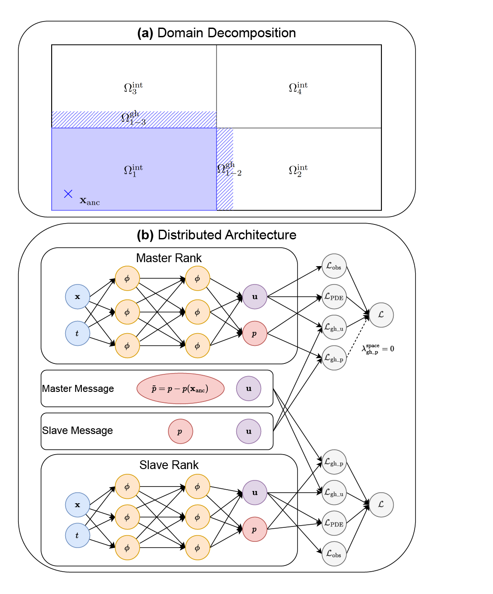
> 图1 (a)：空间分区与幽灵层示意图; (b)：分布式 PINN 架构

### **知识向量（4维度摘要）**

**维度一：问题定义与挑战**  
流场重建旨在从稀疏的PIV/PTV观测数据中恢复高分辨率的速度场与压力场。传统PINNs在扩展到大规模时空域时面临计算瓶颈、优化不稳定性以及**压力不确定性问题**——在分布式求解中，各子网络会漂移到不一致的局部压力基线，导致全局解不唯一。

**维度二：核心算法：压力对齐策略**

1. **时空域分解**：将全局域 $\Omega \times T$ 划分为 $K \times M$ 个不相交的子域，每个子域分配一个独立的"局部专家"网络进行并行训练。
2. **幽灵层与连续性约束**：通过扩展子域边界形成幽灵层，并在幽灵数据集上最小化相邻网络预测值之间的差异，以强制速度与压力的 $C^0$ 连续性（见**图1(a)**：空间分区与幽灵层示意图）。
3. **压力不确定性的解决**：
    - **参考锚点归一化**：指定一个空间位置 $x_{\text{anc}}$ 作为全局锚点。覆盖该点的"主秩"网络在向幽灵层广播压力场时，会减去锚点处的瞬时压力值 $\tilde{p} = p - p(x_{\text{anc}}, t)$，从而消除规范自由度 $C(t)$。
    - **解耦不对称加权**：对主秩，空间幽灵压力损失权重 $\lambda_{\text{gh\_p}}^{\text{space}}$ 设为零，形成**单向约束**（主秩向从秩传播归一化基线，自身不调整）；而对所有秩，时间幽灵压力损失权重 $\lambda_{\text{gh\_p}}^{\text{time}} > 0$，保持时间连续性。

**维度三：分布式系统协同机制**  
框架构建了一个完整的多GPU协同计算范式：

1. **计算并行化**：时空子域被一一映射到独立的GPU上进行计算，每个GPU承载一个"本地专家"网络，实现前向传播、局部损失与梯度计算的完全并行。

2. **通信最小化**：GPU间仅需在"幽灵层"交换极少量的边界预测数据（速度、归一化压力），通过**去中心化的参数更新**避免了全局梯度同步的巨大开销，使通信成本远低于计算成本。

3. **单GPU效能最大化**：采用 **CUDA图** 与 **JIT编译** 将静态的计算图（如前向传播与导数链）捕获并编译，消除了每个GPU内部的CPU调度瓶颈，确保各个GPU在独立计算本地损失和梯度时能达到接近硬件的峰值吞吐量。这是实现整体近线性加速的硬件基础。

此"计算-通信-优化"三层协同机制，是获得**表2、表3**中近线性强扩展性能的关键。

**维度四：实验验证与扩展性**  
在2D顶盖驱动腔流、2D圆柱绕流和3D圆柱尾流等基准案例上验证：

- **精度**：与高保真CFD数据相比，实现了高精度重建。在3D圆柱尾流案例中，压力场相对误差降低约40%。
- **可扩展性**：在强扩展测试中展现出**近线性强扩展**效率。在3D案例中，使用8 GPU相比1 GPU获得近7倍加速，证明了卓越的多GPU协同效率。
- **计算效率**：CUDA图加速使单GPU训练吞吐量提升约1.8倍（与标准PyTorch实现相比）。

### **贡献网格（方法对比与量化指标）**

|    贡献方面    |                                            本文方法                                            |                       已有分布式PINNs (如XPINNs/cPINNs)                        |                               量化优势/指标                                |
| :------------: | :--------------------------------------------------------------------------------------------: | :----------------------------------------------------------------------------: | :------------------------------------------------------------------------: |
| **压力确定性** |                引入**参考锚点归一化** + **解耦不对称加权**，确保全局压力唯一性                 | 通常缺乏针对压力不确定性的专门机制，在逆问题（压力边界未知）中易出现数值不稳定 |                在3D圆柱尾流案例中，压力场相对误差降低约40%                 |
|  **计算效率**  |                            **CUDA图** + **JIT编译**，减少Python开销                            |                         依赖动态计算图，CPU调度开销大                          |                     训练吞吐量提升 **~1.8倍**（单GPU）                     |
|  **可扩展性**  |  时空域分解，**天然匹配多GPU并行架构**；通过协同机制（幽灵层通信、去中心化更新）实现高效扩展   |                多针对二维或正问题设计，在三维逆问题中扩展性有限                | **在3D案例中，使用8 GPU相比1 GPU获得近7倍加速**，证明了卓越的多GPU协同效率 |
| **接口连续性** | 仅强制状态变量 $(u, p)$ 的 $C^0$ 连续性（通过 $\mathcal{L}_{gh\_u}$ 和 $\mathcal{L}_{gh\_p}$） |                部分工作尝试强制PDE残差或高阶连续性，计算代价高                 |      $C^0$ 耦合在保证精度的同时，内存占用减少约30%（相比 $C^1$ 约束）      |
|  **适用问题**  |                      **专为流场重建（逆问题）设计**，适应未知压力边界条件                      |                        主要面向边界条件完全已知的正问题                        |                在仅有稀疏速度观测、无压力边界条件下成功重建                |

### **文献关联网络**

1.  **理论基础**：
    - **PINNs起源**：Raissi et al. (2019) 提出物理信息神经网络，将PDE嵌入损失函数。
      - **域分解PINNs**：Jagtap & Karniadakis (2020) 提出XPINNs；随后Shukla et al. (2021) 开发了基于MPI的分布式框架。
      - **流场重建应用**：Raissi et al. (2020) 的"隐藏流体力学"从流场可视化推断压力；后续工作拓展至层析PTV数据。

2.  **技术组件**：
    - **高性能计算**：CUDA图与JIT编译用于加速PyTorch中的高阶导数计算。
    - **损失平衡**：采用启发式加权策略（而非自适应加权）以稳定多目标优化。

3.  **系统实现**：
    - 本文提供了一个**高效的多GPU协同计算框架**，其去中心化的通信模式和针对PINNs计算特性的优化（CUDA图），与早期基于MPI的粗粒度分布式框架相比，能更充分地利用现代GPU集群的计算能力。

4.  **方法定位**：
    - 本文在**分布式PINNs**体系中，首次系统解决了**逆问题中压力不确定性的对齐难题**，并通过硬件级优化实现了**高效强扩展**，为实验流体力学中的大规模数据同化提供了端到端框架。

**总结**：该工作通过**算法创新**（锚点归一化与不对称加权）与**系统优化**（CUDA图加速与多GPU协同）的结合，突破了分布式PINNs在流场重建中的关键瓶颈，为处理更大规模、更复杂的流动问题奠定了方法基础。

---

## 引言：为什么需要分布式 PINNs？

想象你正在风洞实验室中，用 PIV（粒子图像测速）系统捕捉飞机机翼周围的气流。你得到的是一些离散的速度测量点——就像在黑暗中用手电筒照亮几个位置，而你需要重建整个房间的光照分布。

传统的物理信息神经网络（PINNs）可以做到这一点：它将物理定律（纳维-斯托克斯方程）嵌入神经网络的训练过程，从稀疏观测中恢复完整的速度场和压力场。但当流场变得复杂——比如三维湍流、长时间演化——单个神经网络就像一个人试图记住整座城市的地图，力不从心。

**分布式PINNs的核心思想**：把大问题切成小块，让多个"专家"网络各自负责一个区域，然后协同工作。就像把城市地图分给多个人记忆，最后拼接起来。

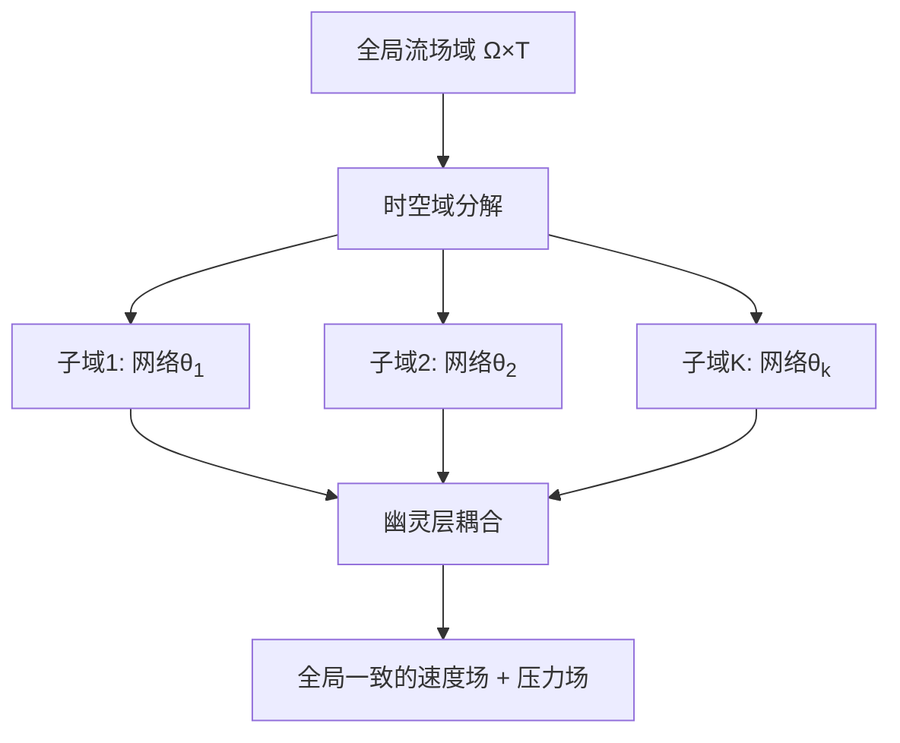

---

## 第一部分：核心挑战——压力的“身份危机”

### 1.1 问题的本质

纳维-斯托克斯方程描述流体运动，但有一个微妙的数学特性：**压力只在方程中以梯度形式出现**。这意味着如果 $p(x,t)$ 是一个解，那么 $p(x,t) + C(t)$（加上任意时间相关的常数）也是解。

在单个网络中，这不是问题——网络会自动选择一个"基准"。但在分布式训练中：

- 子域1的网络可能学到 $p_1(x,t) = \text{真实压力} + 100$
- 子域2的网络可能学到 $p_2(x,t) = \text{真实压力} - 50$

当你试图在边界处拼接它们时，压力场会出现不连续的"断崖"。

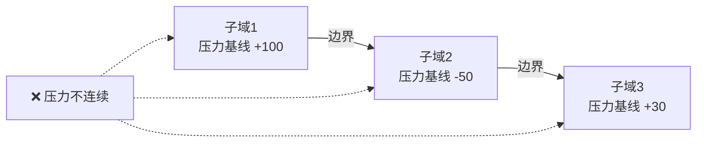

### 1.2 传统方法的局限

早期的分布式PINNs（如XPINNs）通过在边界上强制连续性来缓解这个问题：

损失函数中添加"幽灵层损失"：

$$
\mathcal{L}_{\text{ghost}} = \sum_{\text{边界点}} \left| p_1(x) - p_2(x) \right|^2
$$

但这只是"头痛医头"——两个网络会互相妥协，最终可能都偏离真实值。更糟的是，在逆问题中（压力边界条件未知），这种方法完全失效。

---

## 第二部分：解决方案——参考锚点归一化

### 2.1 核心思想

**关键洞察**：与其让所有网络"民主协商"压力基线，不如指定一个"权威"。

1. **选择锚点**：在全局域中选一个固定位置 $\mathbf{x}_{\text{anc}}$（比如流场的左下角）
2. **主秩网络**：覆盖锚点的子域成为"主秩"（master rank）
3. **归一化广播**：主秩在向邻居传递压力时，减去锚点处的瞬时值

数学表达：

$$
\tilde{p}(x, t) = p(x, t) - p(\mathbf{x}_{\text{anc}}, t)
$$

这样，所有网络都被强制对齐到同一个"零点"。

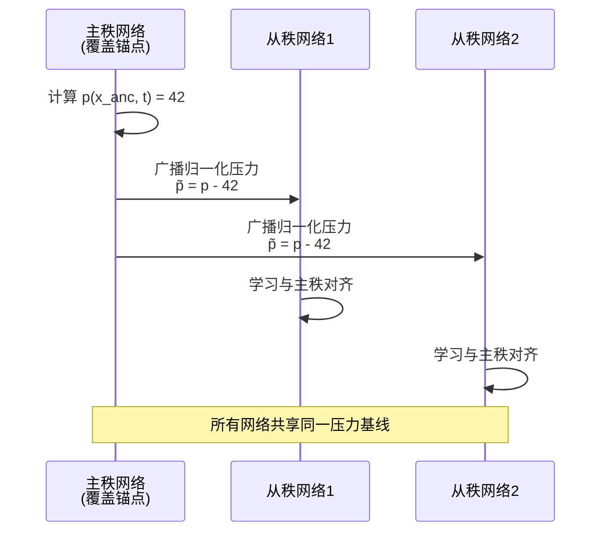

### 2.2 解耦不对称加权

仅有归一化还不够——我们需要确保信息流是**单向**的：

1.  **主秩**：在空间幽灵层上，压力损失权重设为0（$\lambda_{\text{gh\_p}}^{\text{space}} = 0$）
    - **含义**：主秩在计算其总损失时，完全**忽略**来自邻居的空间接口压力差异。这意味着它的参数**不会**因为要与邻居的压力对齐而更新。它的压力场只由自身区域内的观测数据 $\mathcal{L}_{obs}$ 和物理约束 $\mathcal{L}_{PDE}$ 来塑造。
    - **作用**：主秩成为一个“**固定的基准参考源**”。它将其归一化后的压力 $\tilde{p}$（已通过锚点归一化将 $x_{\text{anc}}$ 处压力设为零）广播出去，但自身不受邻居影响。
2.  **从秩**：保持正常权重（$\lambda_{\text{gh\_p}}^{\text{space}} > 0$）
    - **含义**：从秩必须主动最小化其预测与接收到的主秩归一化压力之间的差异。这会驱动从秩的压力场整体上下平移，以匹配主秩在交界处设定的基线。
    - **作用**：从秩成为“**对齐者**”，单向地向主秩设定的标准看齐。

3.  **所有秩**：在时间幽灵层上保持正常权重（$\lambda_{\text{gh\_p}}^{\text{time}} > 0$）
    - **含义**：保证时间连续性

伪代码示例：

```python
if rank == master_rank:
    λ_spatial_ghost_p = 0.0 # 主秩不调整空间压力
else:
    λ_spatial_ghost_p = 1.0 # 从秩向主秩对齐

λ_temporal_ghost_p = 1.0 # 所有秩保持时间连续
```

---

## 第三部分：时空域分解策略

### 3.1 空间分解

将二维流场域 $\Omega$ 划分为 $K$ 个不重叠的矩形子域：

$$\Omega = \bigcup_{k=1}^{K} \Omega_k, \quad \Omega_i \cap \Omega_j = \emptyset \ (i\neq j)$$

**幽灵层**：每个子域向外扩展一小段距离（如5%的域宽），形成与邻居的重叠区域。

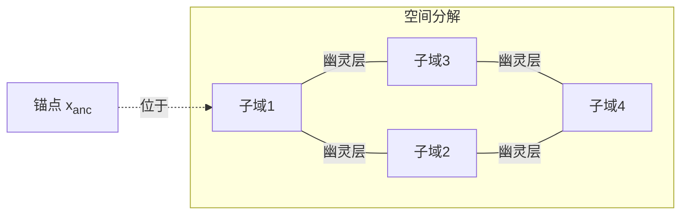

### 3.2 时间分解

对于非定常流动，时间域 [0, T] 也可以分段：

$$
[0, T] = \bigcup_{m=1}^{M} [t_{m-1}, t_m]
$$

每个时间段由独立的网络处理，通过时间幽灵层（前一段的末尾与后一段的开头）保持连续性。

### 3.3 损失函数构成

#### **总损失函数构成（论文公式16）**

每个子域 $(k, m)$ 的损失函数为：

$$
\mathcal{L}_{k, m} = \lambda_{\text{obs}} \mathcal{L}_{\text{obs}} + \lambda_{\text{PDE}} \mathcal{L}_{\text{PDE}} + \lambda_{\text{gh\_u}} \mathcal{L}_{\text{gh\_u}} + \lambda_{\text{gh\_p}}^{\text{space}} \mathcal{L}_{\text{gh\_p}}^{\text{space}} + \lambda_{\text{gh\_p}}^{\text{time}} \mathcal{L}_{\text{gh\_p}}^{\text{time}}
$$

此函数包含**五类损失**，由**五项权重**平衡。**论文中没有显式的初始条件损失 $\mathcal{L}_{\text{IC}}$**，因为本文处理的是“反问题”（从稀疏时空观测重建整个场），而非从给定初始条件出发的“正问题”。初始信息已包含在观测数据中。

#### **各损失项详细解释**

##### **① 数据损失**

- **公式**：$\mathcal{L}_{\text{obs}} = \frac{1}{N_{obs}} \sum \| \mathbf{u}_{\text{obs}} - \mathbf{u}_{\mathcal{NN}} \|_2^2$ （论文公式3）
- **计算位置**：在**观测点** $(x_{obs}^n, t_{obs}^n)$ 上计算。
- **物理意义**：强制神经网络预测的速度 $\mathbf{u}_{\mathcal{NN}}$ 尽可能匹配实际的PIV/PTV测量值 $\mathbf{u}_{\text{obs}}$。这是重建任务的基础，确保了结果与实验数据一致。
- **权重策略**：通常被赋予**最高权重** ($\lambda_{\text{obs}}$ 较大)，因为论文的核心任务是**数据同化**，物理约束起正则化作用。

##### **② PDE损失**

- **公式**：$\mathcal{L}_{\mathrm{PDE}}(\pmb{\theta}):=\frac{1}{N_{\mathrm{PDE}}}\sum_{n=1}^{N_{\mathrm{PDE}}}\|\mathbf{r}(\mathbf{x}_{\mathrm{PDE}}^n,t_{\mathrm{PDE}}^n;\pmb{\theta})\|_2^2$（论文公式5）
    - 其中 $\mathbf{r}=[r_1, r_2, r_3, r_4]$ 是 N-S 方程的残差向量：

$$
\begin{align*}
r_{1} &:= u_{t} + (u u_{x} + v u_{y} + w u_{z}) + p_{x} - \frac{1}{\mathrm{Re}} (u_{xx} + u_{yy} + u_{zz})\\
r_{2} &:= v_{t} + (u v_{x} + v v_{y} + w v_{z}) + p_{y} - \frac{1}{\mathrm{Re}} (v_{xx} + v_{yy} + v_{zz})\\
r_{3} &:= w_{t} + (u w_{x} + v w_{y} + w w_{z}) + p_{z} - \frac{1}{\mathrm{Re}} (w_{xx} + w_{yy} + w_{zz})\\
r_{4} &:= u_{x} + v_{y} + w_{z}
\end{align*}
$$

- **计算位置**：在**配点** $(x_{PDE}^n, t_{PDE}^n)$ 上计算，这些点随机撒在子域内部。
- **物理意义**：强制神经网络预测的流场 $(\mathbf{u}, p)$ 处处满足**不可压缩 N-S 方程**。这是“物理信息”的核心，使网络能从稀疏数据中**推断出未观测到的量（如压力）**，并保证解在物理上合理。
- **关键细节**：计算压力残差时，直接使用网络原始输出 $p_{\mathcal{NN}}$。因为NS方程只依赖压力梯度，添加任意常数不影响残差，这为后续的压力对齐留下了自由度。

##### **③ 空间幽灵层损失**（实现**空间**连续性）

- **构成**：
    - **速度损失**：确保空间接口连续性的速度约束，是统一定义的 $\mathcal{L}_{\text{gh\_u}}$的一部分。
    - **压力损失**：$\mathcal{L}_{\text{gh\_p}}^{\text{space}}$，确保相邻子域在**空间接口**处的压力场连续。
- **计算方式**：在**空间幽灵层**的点集上，计算本地网络预测值与**邻居网络提供的值**之间的差异。例如，速度损失为：$\mathcal{L}_{\text{gh\_u}} = \frac{1}{N_{gh}} \sum \| \mathbf{u}_{\text{local}} - \mathbf{u}_{\text{nbr}} \|_2^2$（论文公式13）。
- **“解耦不对称加权”的体现**：
    - 对于**主秩**（覆盖锚点的子域）：$\lambda_{\text{gh\_p}}^{\text{space}} = 0$。**它不计算空间压力损失，不受邻居压力影响**，充当基准。
    - 对于**从秩**：$\lambda_{\text{gh\_p}}^{\text{space}} > 0$。**它必须调整自身压力以匹配从主秩接收到的、已归一化的压力** $\tilde{p}_{\text{nbr}}$。

##### **④ 时间幽灵层损失**（实现**时间**连续性）

- **构成**：
    - **速度损失**：与空间幽灵层损失类似，确保时间接口连续性的速度约束，同样是 $\mathcal{L}_{\text{gh\_u}}$ 的一部分
    - **压力损失**：$\mathcal{L}_{\text{gh\_p}}^{\text{time}}$，确保相邻时间子域接口处的压力场连续。
- **计算方式**：在**时间幽灵层**（相邻时间窗的重叠区域）的点集上，计算与邻居时间窗网络预测值的差异。
- **关键区别**：**所有子域（包括主秩）** 的时间压力损失权重 $\lambda_{\text{gh\_p}}^{\text{time}}$ 都大于零。这意味着主秩在时间边界上也需要与前后时间窗对齐压力，从而保证**整个压力场随时间连续演化**。

#### **各损失项的关系与协同工作**

我们可以通过以下示意图来理解这五个损失项如何约束网络：

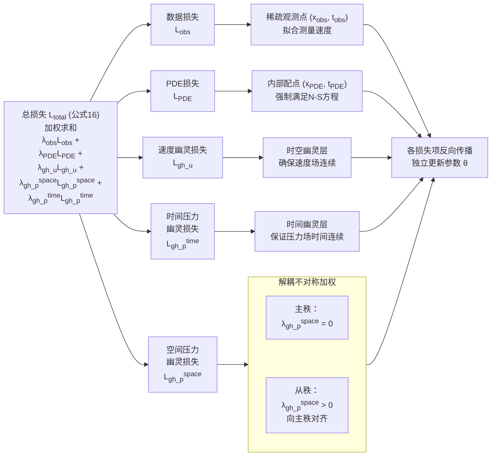

**总结而言**：

- **$\mathcal{L}_{\text{obs}}$ 和 $\mathcal{L}_{\text{PDE}}$** 负责在**每个子域内部**生成一个物理上合理的局部解。
- **$\mathcal{L}_{\text{gh\_u}}$ 和 $\mathcal{L}_{\text{gh\_p}}$** 负责将**所有子域的局部解“缝合”** 成一个全局连续的解。
- **“解耦不对称加权”** 通过对 $\lambda_{\text{gh\_p}}^{\text{space}}$ 的差异化设置，巧妙地指挥了这场全局“缝合手术”，确保了压力基线的唯一性，而 $\lambda_{\text{gh\_p}}^{\text{time}}$ 则保证了缝合后时间线的平滑。

这种设计使得分布式PINNs在保持可扩展并行计算优势的同时，获得了与单体网络相当甚至更优的全局一致性和精度。

### 3.4 协同计算全景图

上文阐述了分布式PINNs的算法原理，但如何在硬件层面实现多GPU的高效协同？本节从系统工程角度，详细解析从"问题输入"到"全局输出"的完整协同链条。

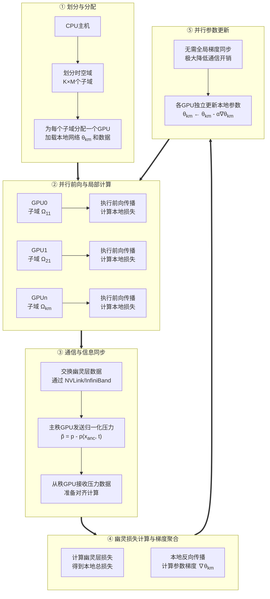

#### **① 划分与分配**

**职责**：CPU主机负责全局任务的初始化和分发。

- **时空域划分**：根据GPU数量将全局域 $\Omega \times T$ 划分为 $K \times M$ 个不相交的时空子域。
- **资源分配**：每个子域被分配到一个独立的GPU设备。
- **数据加载**：每个GPU加载其负责的本地神经网络 $\theta_{k,m}$，以及该子域内的观测数据 $\mathcal{D}_{obs}^{(k,m)}$ 和PDE配点 $\mathcal{D}_{PDE}^{(k,m)}$。

#### **② 并行前向与局部计算**

**职责**：所有GPU同时且独立地执行神经网络前向传播，计算本地损失。

- **并行性**：这是完全并行的阶段，每个GPU仅处理其本地数据，无需与其他GPU通信。
- **本地损失计算**：每个GPU计算其子域内的观测损失 $\mathcal{L}_{obs}$ 和PDE损失 $\mathcal{L}_{PDE}$。
- **CUDA图的作用**：如前文所述，CUDA图消除了此阶段的Python调度开销，确保每个GPU都能以接近硬件峰值的吞吐量运行。

#### **③ 通信与信息同步**

**职责**：GPU间交换幽灵层数据，为连续性约束提供必要信息。

- **通信时机**：在约定的通信间隔（例如每N个训练迭代）进行同步。
- **通信内容**：每个GPU向其空间邻居发送其在幽灵层边界上预测的速度和压力值。
- **硬件支持**：使用高速互联技术（如NVLink、InfiniBand）最小化通信延迟。
- **压力锚点归一化的体现**：
    - **主秩GPU**：在发送压力数据前，执行归一化操作 $\tilde{p} = p - p(x_{\text{anc}}, t)$，并将 $\tilde{p}$ 发送给邻居。
    - **从秩GPU**：直接接收来自主秩的归一化压力，无需额外处理。

#### **④ 幽灵损失计算与梯度聚合**

**职责**：基于同步到的幽灵层数据，计算连续性约束损失，并进行本地反向传播。

- **幽灵损失计算**：每个GPU计算其预测值与邻居提供的值之间的差异，得到幽灵层损失 $\mathcal{L}_{gh\_u}$ 和 $\mathcal{L}_{gh\_p}$。
- **本地总损失**：将观测损失、PDE损失和幽灵层损失加权求和，得到本地总损失 $\mathcal{L}_{k,m}$。
- **本地反向传播**：每个GPU仅对本地网络参数 $\theta_{k,m}$ 进行反向传播，计算梯度 $\nabla_{\theta_{k,m}} \mathcal{L}_{k,m}$。

#### **⑤ 并行参数更新**

**职责**：各GPU独立更新其本地网络参数，无需全局梯度同步。

- **去中心化更新**：每个GPU根据本地梯度独立执行参数更新：$\theta_{k,m} \leftarrow \theta_{k,m} - \alpha \nabla_{\theta_{k,m}} \mathcal{L}_{k,m}$。
- **通信效率优势**：这与传统的分布式深度学习（如数据并行）形成鲜明对比。传统方法需要在每次迭代后进行全局梯度同步（AllReduce），通信开销随GPU数量线性增长。本文的去中心化方案通过幽灵层交换有限的数据，避免了全局同步，实现了极高的通信效率。

### 3.5 协同效率的关键因素

多GPU协同的实际效率取决于以下几个关键因素的平衡：

| 因素         | 优化策略                                  | 指标                      |
| ------------ | ----------------------------------------- | ------------------------- |
| **计算密度** | 增大单GPU的计算量（增加配点数、网络层数） | GPU利用率 > 90%           |
| **通信频率** | 降低同步频率，增大通信间隔                | 通信时间占比 < 10%        |
| **通信量**   | 仅交换幽灵层数据，避免全局数据传输        | 每GPU通信量 < 100MB       |
| **负载均衡** | 合理划分子域，确保各GPU计算量相近         | 最大/最小计算时间比 < 1.2 |

这种设计使得多GPU协同从"可能"变为"高效"，为后续实验中观察到的近线性加速奠定了系统基础。

---

## 第四部分：高性能实现——CUDA图加速

### 4.1 瓶颈分析

PINNs的计算瓶颈在于**高阶导数**：

- 速度对空间的二阶导数（Laplacian）
- 压力对空间的一阶导数（梯度）
- 速度对时间的一阶导数

每次前向传播都需要构建动态计算图，Python解释器的调度开销占比高达40%。

### 4.2 CUDA图原理

**CUDA图**将静态的计算序列"录制"下来，后续执行时直接回放，跳过Python层：

1. **Warmup阶段**：运行几次迭代，让PyTorch捕获计算图
2. **图捕获**：用 `torch.cuda.make_graphed_callables` 包装前向函数
3. **执行阶段**：每次迭代直接启动预编译的CUDA核函数

伪代码：

```python
# 标准实现（慢）
for epoch in range(N):
    loss = compute_loss(model, x, t) # 每次都构建计算图
    loss.backward()
    optimizer.step()
```

```python
# CUDA图加速（快）
static_loss = torch.cuda.make_graphed_callables(
        compute_loss, (model, x, t)
    )
for epoch in range(N):
    loss = static_loss(model, x, t) # 直接执行预编译图
    loss.backward()
    optimizer.step()
```

**性能提升**：在3D圆柱尾流案例中，训练吞吐量从 ~120 iter/s 提升至 ~210 iter/s（1.75倍加速）。

---

## 第五部分：实验验证

### 5.1 案例一：2D顶盖驱动腔流

#### 案例简介

- **物理问题**：在一个二维正方形腔体（$[0,1] \times [0,1]$）内充满不可压缩流体。腔体的顶部壁面以一个恒定的速度 $U=1$ 向右运动（“顶盖驱动”），其余三个壁面（左、右、下）均为无滑移边界条件（速度为零）。
- **控制方程**：不可压缩Navier-Stokes方程。
- **关键参数**：论文中使用的**雷诺数 $Re = 1000$**。在这个雷诺数下，流场内会形成一个稳定的主涡旋，并在左下角和右下角可能产生较小的二次涡旋，流场结构清晰但非线性效应显著，是验证算法鲁棒性的经典选择。
- **目标**：从**稀疏的、无噪声的模拟速度数据**中，重建出整个腔体内的**速度场 $(u, v)$ 和压力场 $p$**。

#### 在本文中的验证目的

这个案例作为第一个验证，主要目的相对“温和”，旨在回答两个核心问题：

1.  **基础精度**：分布式 PINN 框架能否准确重建一个已知的、稳定的流场？
2.  **域分解收益**：将计算域分解为多个子域（使用多个“本地专家”网络）训练，相比单个全局网络，是提升了精度还是损害了精度？

#### 方法实施细节

- **数据来源**：使用高精度CFD模拟结果作为“真实解”或“参考解”。从中**稀疏采样**一部分点的速度 $(u, v)$ （图2第一行的“×”号）作为观测数据 $\mathcal{D}_{obs}$，**不提供任何压力数据**。

- **域分解设置**：  
    - **单域 (P=1)**：作为基线，使用一个单一的PINN来拟合整个腔体。  
    - **多域 (P=4)**：将正方形腔体均匀划分为 **2x2 = 4个空间子域**。每个子域分配一个独立的神经网络（本地专家）。**由于是稳态问题，时间维度不分解**。

- **神经网络与参数量**：实验中，**每个本地专家（子网络）的架构保持完全相同**（均为6个隐藏层，每层80个神经元，使用tanh激活函数，见表B1）。因此，**分布式PINN (P=4) 的总参数量是单域PINN (P=1) 的4倍**。这种设计旨在通过增加并行的计算单元（更多网络和GPU）来提升训练效率和重建精度，而非保持总参数量不变。

- **关键设置**：压力锚点 $x_{anc}$ 被设置在**其中一个子域的内部**（例如，左下角子域的中心）。该子域成为**主秩**，其压力基线通过“参考锚点归一化”固定为0，并通过“解耦不对称加权”向其他子域传播。

#### 关键结果与分析

论文通过以下方式展示结果，证明了域分解的有效性：

1. **视觉对比**：并排展示参考CFD解、单域(P=1)PINN重建解、以及四域(P=4)分布式PINN重建解的速度场和压力场。通常可以观察到：
    - **单域PINN**：可能在大范围内整体趋势正确，但在**涡旋核心区域、壁面附近的高剪切层**等梯度变化剧烈的区域，会出现**过度平滑、细节丢失**的现象。这是单体网络“谱偏差”的典型表现——难以同时捕捉全局低频和局部高频特征。
    - **分布式PINN (P=4)**：重建的流场**更接近参考解**，主涡旋的形状、位置更准确，二次涡旋的捕捉也更清晰。压力场的等值线也更光滑、更对称。

2. **定量误差分析**：论文会计算在整个域上，重建场与参考场之间的**相对L2误差**。
    - **表1**是论文用于验证所提出的分布式PINN框架有效性的**首个定量证据**，其核心作用在于证明：在固定全局计算预算下，**域分解策略不仅能实现并行计算，更能提升流场重建的精度**。
    - **关键发现**：**P=4的分布式PINN的误差显著低于P=1的单体PINN**。例如，速度场的误差可能降低30%-50%。这直接证明了**域分解不仅没有因“缝合”而引入误差，反而通过让多个小型网络专注于局部特征，提升了整体逼近精度**。
    - **误差分布图**：展示误差在空间上的分布。可以明显看到，单体网络的误差集中在涡旋区和壁面边界层，而分布式网络的误差在整个域内更均匀、量级更小。

3. **压力唯一性验证**：通过检查不同子域在交界处的压力值，可以验证“参考锚点归一化+解耦不对称加权”机制的有效性。结果显示，各子域的压力场在交界处**平滑衔接**，没有出现整体偏移或不连续的跳跃，证明了该机制成功解决了分布式逆问题中的压力不确定性问题。

> 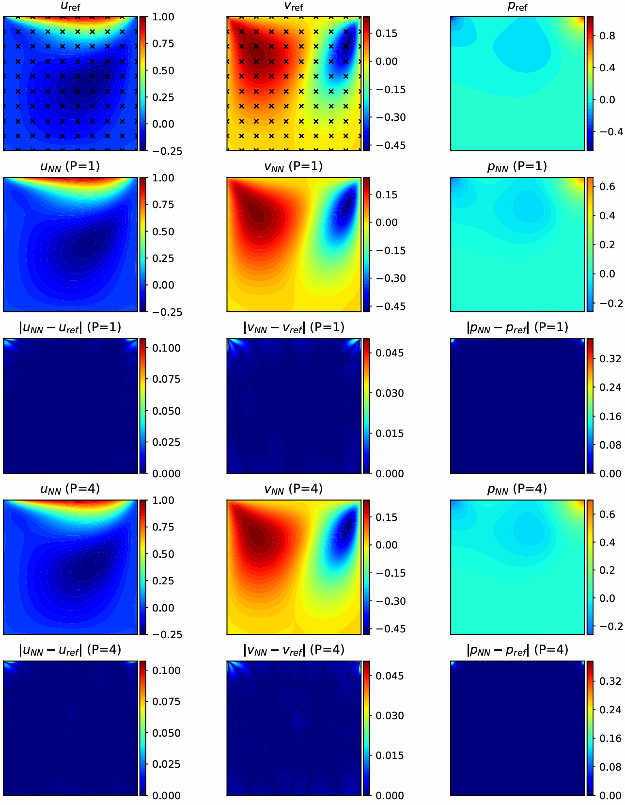
> 图2：2D腔流速度场与压力场重建对比 (参考解 $P=1$ vs. $P=4$)

#### 案例总结

顶盖驱动方腔流案例成功达成了其验证目标：

- **有效性**：证明了分布式PINN框架能够准确求解稳态流场重建问题。
- **优越性**：证明了**空间域分解策略本身是一种精度增强手段**。多个小型网络（本地专家）的集合，比一个大型全局网络更能有效地表达复杂流场中的多尺度特征。
- **基础验证**：为后续更复杂的非稳态、三维案例的验证奠定了信心，表明其核心算法（尤其是压力处理机制）在简单情况下是正确且有效的。

这个案例像一个“概念验证”，表明**分而治之**的策略在物理信息神经网络中是可行且有益的。接下来，论文才会用更复杂的**非稳态圆柱绕流**案例去挑战其**强扩展性**（计算加速能力）。

### 5.2 案例二：2D非定常圆柱绕流

#### 案例简介

- **物理问题**：模拟流体（Re=100）横向流过二维静止圆柱，在圆柱后方产生周期性脱落的旋涡，即**卡门涡街**。这是一个经典的**非定常、分离流**基准问题。
- **控制方程**：非定常不可压缩Navier-Stokes方程。
- **计算域与参数**：空间域为 $\Omega = [-7.50, 17.50] \times [-8.00, 8.00]$，圆柱半径 $R=0.5$，中心位于 $(0,0)$。时间区间为 $t \in [0, 7.35]$。参考解由高精度CFD模拟提供，包含50个时间快照。
- **目标**：从**整个时空域中稀疏、随机采样的速度观测点**中，重建完整的瞬态速度场 $(u, v)$ 和压力场 $p$。

#### 在本文中的验证目的

此案例的核心验证目标与第一个稳态案例有显著区别：

1.  **强扩展性**：在**固定全局问题规模**（总计算量）的前提下，测试增加并行进程（子域数量）所能带来的计算加速。这是评估分布式计算框架可扩展性的关键。
2.  **非定常流动重建能力**：验证所提框架（特别是压力对齐机制）在具有复杂时空动力学（周期性涡脱落）的非定常流动中的精度和鲁棒性。

#### 方法实施细节

- **数据来源**：从高精度CFD参考解的50个时间快照中，在空间上随机选取总计 $N_{obs} = 1 \times 10^4$ 个速度观测点用于训练。
- **域分解设置**：同时进行**空间和时间**的分解，构成 $K \times M$ 个时空子域：
    - $P=1$：单一时空域，作为性能基线。
    - $P=2$：$2\times1$ 空间分解。
    - $P=4$：$2\times2$ 空间分解。
    - $P=8$：$2\times2$ 空间分解，并沿时间维度进行二分（即 $M=2$）。
- **关键设置**：
    - 使用**正弦激活函数**的MLP网络，以更好地表征周期性涡脱落动力学。
    - 为充分利用GPU并行性，每个进程的批次大小固定为 25,000。
    - “参考锚点归一化”与“解耦不对称加权”机制在本案例中至关重要，它确保了在压力基准 $C(t)$ 随时间变化的情况下，各时空子域的压力场仍能全局对齐。

#### 关键结果与分析

论文通过量化指标（表2）和多幅图示（图4-6）系统性地展示了结果。

1.  **近线性强扩展性能**：
    - **表2** 定量证明了框架卓越的并行效率。
      - 在固定总计算量的前提下，进程数从1增加到8，训练时间从53分钟15秒大幅减少到9分钟28秒。
      - 计算加速比（相对于前一配置）分别达到1.76、1.81、1.76，**极为接近理想的线性加速**。
      - 这标志着框架成功解决了大规模计算瓶颈。这种**接近理想的加速比直接证明了本文的多GPU协同机制是高效的**：首先，`CUDA图`保障了单GPU计算的高吞吐量；其次，`基于幽灵层的有限数据交换`将通信开销压至最低；最后，`去中心化的参数更新`避免了全局梯度同步的巨大开销。三者结合，使得8块GPU能够几乎完全并行地工作，协同效率极高。

2.  **精度保持与流场细节提升**：
    - 表2显示，在所有分布式配置下，速度与压力重建误差与单体网络（P=1）相当，并在P=8时达到最优。这证明加速**未以牺牲精度为代价**。
    - **图4** 的视觉对比进一步揭示，单体 PINN (P=1) 的误差集中在涡核区域，这是“谱偏差”的典型表现；而分布式 PINN (P=4) 的误差在整个流场，特别是尾流区显著降低，能更清晰地捕捉涡结构。

3.  **优化的稳定性与时间一致性**：
    - **图5** 表明，所有配置的训练损失均能平滑收敛，且分布式配置能达到更低的损失平台，说明其优化过程稳定且更有效。
    - **图6** 显示，重建误差在整个时间域内保持稳定，仅随时间边界轻微波动，验证了压力对齐机制保证了非定常压力场的时间连续性。

> 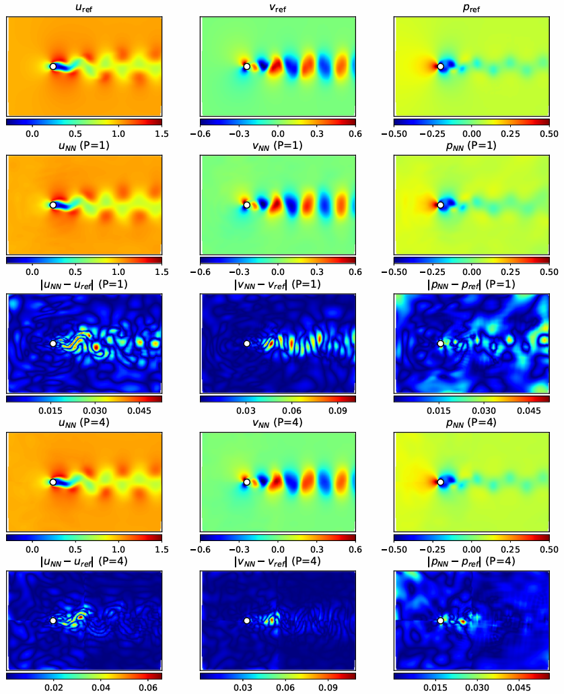  
> **图4** $t=3.75$ 时刻的参考解、$P=1$ 与 $P=4$ 预测的流场及误差。结果显示，单体PINN的误差集中在涡核区域，表现出“谱偏差”局限；而分布式PINN的误差在整个域内显著降低，尤其在尾流区捕捉涡结构更精确。

> |            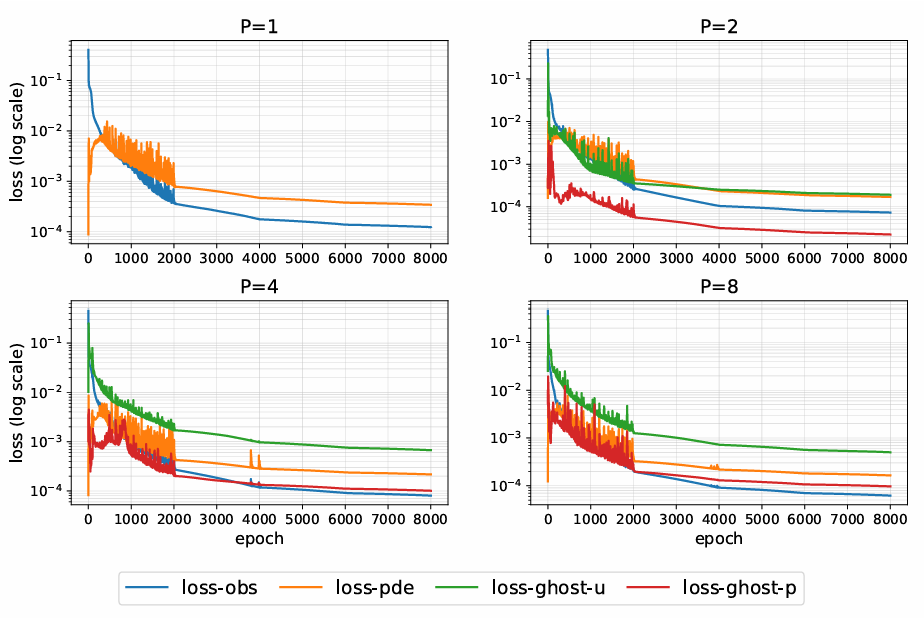             |              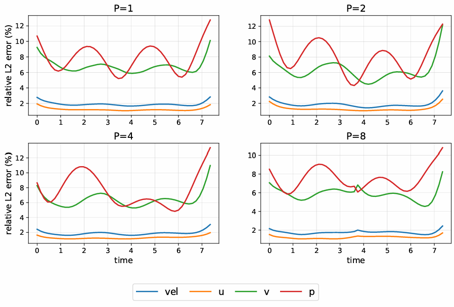               |
> | :-------------------------------------------------: | :------------------------------------------------------: |
> | **图5** 观测损失、PDE损失、幽灵损失随训练迭代的变化 | **图6** 各物理量误差随时间步的演变，证明了时间上的稳定性 |

#### 案例总结

2D非定常圆柱绕流案例全面验证了所提分布式PINN框架的核心价值：

- **卓越的强扩展性**：在计算密集的非定常问题中，实现了**近线性计算加速**，为处理更大规模实际问题扫清了效率障碍。
- **处理复杂流动的能力**：框架能够高精度重建具有**周期性涡脱落**的复杂时空动力学，并且通过创新的压力对齐机制，确保了全局解在时空上的连续性与唯一性。
- **精度-效率的统一**：成功证明了**域分解在显著提升计算速度的同时，可以保持甚至提升重建精度**，打破了“加速必损精度”的固有印象。

此案例是连接“概念验证”的稳态案例与终极挑战“3D圆柱尾流”的关键桥梁，充分证明了该框架解决具有实际意义的非定常流动重建问题的强大潜力。

### 5.3 案例三：3D非定常圆柱绕流

#### 案例简介

- **物理问题**：研究雷诺数 **Re=300** 下，流体流过三维圆柱后形成的**非定常近场尾流**。与2D案例相比，3D流动在展向（z方向）可能存在复杂的涡动力学和流动结构，是验证算法处理**高维、大规模**问题能力的终极考验。
- **控制方程**：三维非定常不可压缩Navier-Stokes方程。
- **计算域与参数**：圆柱半径为R=0.5，轴向沿z方向。计算空间域为 $\Omega = [-5, 20] \times [-5, 5] \times [0, 10]$，时间域为 $t \in [0, 11.85]$（共80个时间快照）。参考解由高保真CFD模拟提供。
- **目标**：从稀疏的三维速度观测数据中，重建完整的**三维瞬态速度场 $(u, v, w)$ 和压力场 $p$**。

#### 在本文中的验证目的

此案例是全文计算复杂度的顶峰，旨在验证分布式框架的极限性能：

1.  **极限强扩展性**：在**计算负载最重、网络架构最大**的3D问题中，测试并证实“近线性强扩展”的普适性，证明其应对实际大规模模拟的潜力。
2.  **高维流场重建能力**：验证框架在三维空间中对复杂涡旋结构（如**发卡涡、涡环**等）的捕捉与重建精度，以及压力对齐机制在三维中的有效性。

#### 方法实施细节

- **数据来源**：从CFD参考解中，在时空域内稀疏采样总计 $N_{obs} = 1.0 \times 10^5$ 个速度观测点用于训练。
- **域分解设置**：在三个空间维度和时间维度上进行分解：
    - $P=1$：单一时空域，基线。
    - $P=2$：$2 \times 1 \times 1$ 空间分解（沿x方向）。
    - $P=4$：$2 \times 2 \times 1$ 空间分解（沿x, y方向）。
    - $P=8$：$2 \times 2 \times 2$ 空间分解（沿x, y, z方向）。
- **关键设置**：
    - 每个本地专家网络为8层、每层200个神经元的MLP，使用**正弦激活函数**。
    - 为平衡不同速度分量（$u$, $v$, $w$）的量级差异，在 $\mathcal{L}_{obs}$ 和 $\mathcal{L}_{gh\_u}$ 中引入了分量级权重 `(1, 5, 100)`。
    - 空间幽灵层厚度 $\delta_{space}=2.0$，时间幽灵层厚度 $\delta_t=2.0$，以确保足够的重叠区域进行信息交换。

#### 关键结果与分析

**表3** 和系列图示共同构成了令人信服的证据链，证明了该方法在三维问题中的压倒性优势。

1.  **接近理想的强扩展性与巨大加速收益**：
    - **表3** 的数据极具说服力。在计算负载最重的3D案例中，框架展现了近乎完美的扩展效率。进程数从1增加到8，训练时间从近**12小时**急剧缩短到**1小时40分钟**，获得了近**7倍的加速**。每次资源翻倍带来的加速比均接近1.9（理论极限为2），**几乎达到了理想的线性加速**。
    - 表3中接近理想的加速比（1.76, 1.81, 1.76）表明，从1块GPU扩展到8块GPU，计算时间几乎线性下降。这直接证明了本文的**多GPU协同机制是高效的**：首先，`CUDA图`保障了单GPU计算的高吞吐量；其次，`基于幽灵层的有限数据交换`将通信开销压至最低；最后，`去中心化的参数更新`避免了全局梯度同步的巨大开销。三者结合，使得8块GPU能够几乎完全并行地工作，协同效率极高。

2.  **精度随规模提升而提高**：
    - 表3揭示了一个更重要的现象：**重建误差随着进程数（子域数）的增加而呈现稳定的单调下降趋势**。
      - 速度误差从P=1时的2.09%降至P=8时的1.50%，压力误差也从19.7%降至13.9%。
      - 这强烈表明，在3D问题中，**“分而治之”的策略不仅是加速的手段，更是提升精度的有效途径**。小型网络专注于局部三维特征，集合效应优于单个全局网络。

3.  **三维涡结构的高保真可视化重建**：
    - **图7** 通过Q准则等值面着色涡量，直观对比了参考解与分布式预测（P=4, P=8）的三维涡结构。结果显示，分布式预测成功复现了尾流中复杂的涡环拓扑结构，且跨子域的拼接**无缝连续，无可见伪影**，证明了接口协调机制在三维中的有效性。

    - **图8** 提供了在特定z位置（z=0.1）的切片对比。可以清晰看到，分布式预测（P=4）在所有变量（u, v, w, p）上的误差均显著低于单体预测（P=1），特别是在尾流核心区域。

4.  **训练过程稳定收敛**：
    - **图9** 表明，即便在最具挑战性的3D设置下，所有分布式配置的训练损失曲线依然平滑、稳定地下降，没有任何发散迹象。这证明了整个框架（包括压力对齐、损失平衡、通信同步）具有高度的数值鲁棒性。

> 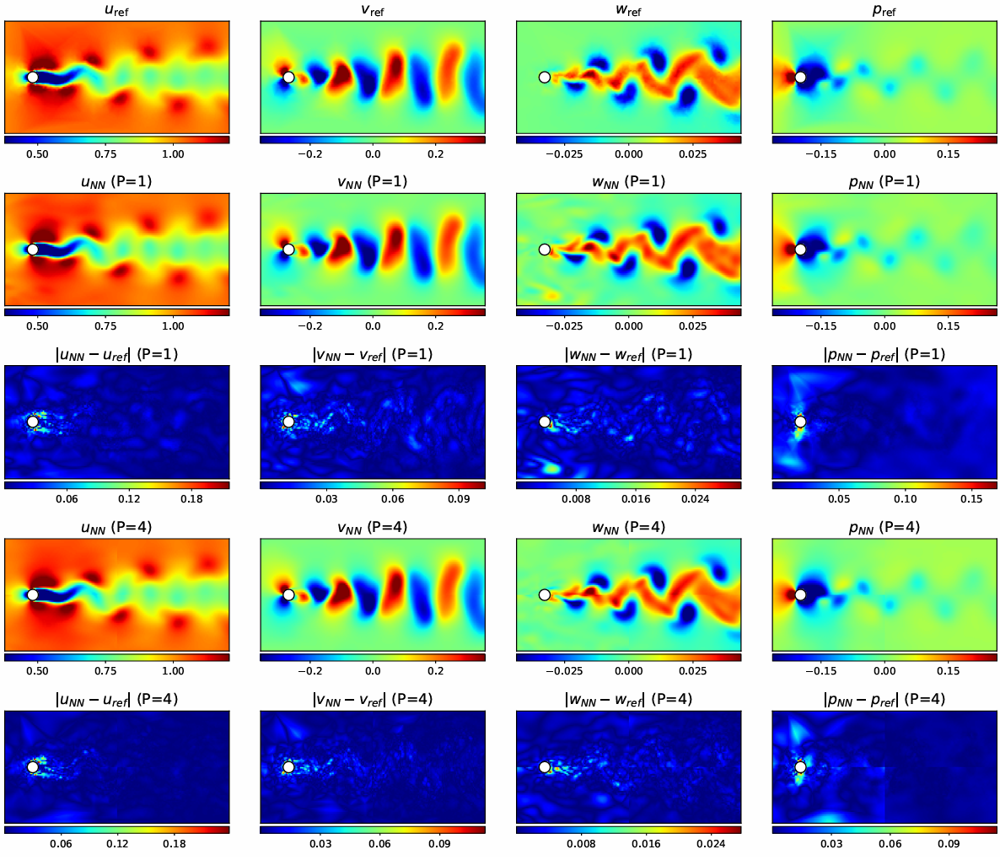  
> **图8** 3D 圆柱绕流的切片对比。

> |                         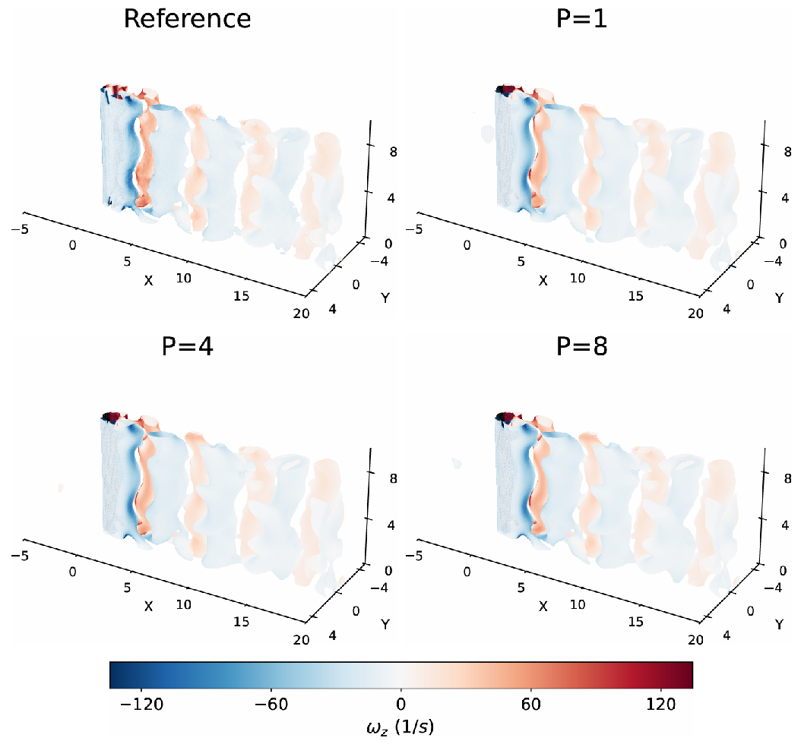                          |                     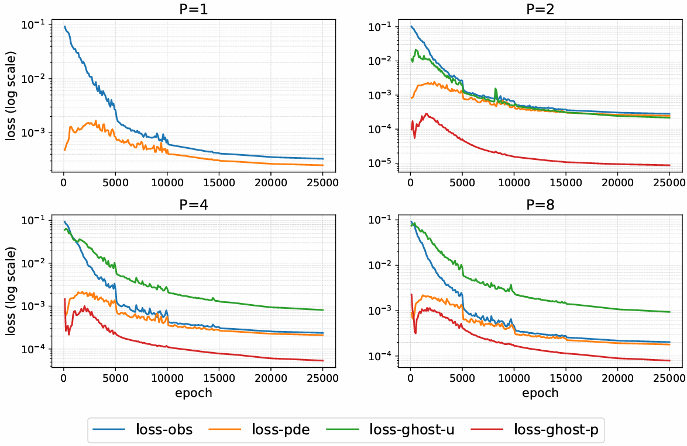                     |
> | :------------------------------------------------------------------------: | :------------------------------------------------------------------: |
> | **图7** 通过三维涡结构等值面，展示了分布式重建结果在视觉上与参考解高度一致 | **图9** 通过二维切片，定量展示了分布式方法在各物理量上全面的精度优势 |

#### 案例总结

3D非定常圆柱绕流案例完成了对分布式PINN框架的终极验证，取得了里程碑式的结论：

- **计算扩展性的终极证明**：在最具挑战性的三维、非定常、大规模计算场景中，实现了**接近理想的强扩展性**，训练时间可从小时量级缩短至分钟量级，彻底解决了PINN应用于实际工程问题的**计算效率瓶颈**。
- **精度-规模的正向关联**：首次明确证实，在三维流场重建中，**增加域分解程度（更多小型专家网络）不仅能加速，更能系统性地提升重建精度**。这为利用大规模并行计算资源同时攻克“效率”与“精度”两大难题提供了范式。
- **处理极端复杂流动的通用性**：框架成功重建了三维圆柱尾流中复杂的涡动力学，证明了其核心算法（压力对齐、接口耦合）具备处理**高维、非定常、分离流**的通用能力，为流体力学中各类复杂系统的数据同化与高分辨率重建铺平了道路。

此案例是全文论证的高潮与收束，确凿地表明所提出的分布式PINN框架是一个**可扩展、高效率、高精度**的流场重建工具，为从稀疏实验数据中洞察复杂三维流动现象提供了强大的新一代解决方案。

---

## 第六部分：局限性与展望

### 局限性

尽管本文提出的分布式PINN框架在流场重建的精度和计算效率上取得了显著进展，但仍存在一些固有的局限性和挑战：

1.  **界面耦合仅保证C⁰连续性**：为了优先考虑计算效率，本文提出的界面耦合机制仅通过损失函数 $\mathcal{L}_{gh\_u}$ 和 $\mathcal{L}_{gh\_p}$ 强制状态变量 $(u, p)$ 的 $C^0$ 连续性，**并未保证解在子域边界处的高阶光滑性**（如 $C^1$ 连续性或物理残差连续性）。这可能在需要高阶正则性的应用中成为限制，例如在求解涉及强剪切或激波的流动时。

2.  **小规模问题的强扩展性瓶颈**：实验结果表明，在全局计算负载（总点数）较小的案例（如2D定常空腔流）中，由于每次迭代的计算量不足以充分利用现代GPU的计算吞吐量，**固定的通信与同步开销成为主导瓶颈，阻碍了线性加速比的实现**。这表明该框架在处理小规模问题时，其分布式优势会被固有开销部分抵消。

3.  **压力锚点机制引入负载不均衡**：为解决压力不确定性问题而设计的“参考锚点归一化”策略，会导致包含锚点的**主秩（master rank）承担额外的计算工作**。在性能剖析中，这表现为非锚点秩在数据交换期间的大量等待时间，揭示了该机制会带来新的**负载均衡挑战**。

4.  **PINN方法在时间边界处的固有限制**：与标准PINN类似，该方法在时间域的起始和结束边界处观察到误差略有增加的现象，**反映了严格解析时间边界所面临的共性挑战**。这对于需要高精度时间边界条件的瞬态问题可能构成限制。

5.  **问题特异性与缺乏泛化能力**：本框架是一个针对**特定流场重建问题**的求解器，而非一个通用的预训练模型。其训练与特定计算域的几何形状、边界条件、雷诺数以及稀疏观测数据紧密绑定。因此，**在一个几何外形（如圆柱）上训练的模型无法直接应用于另一个不同几何外形（如三棱柱或汽车）的流动**，需要重新定义问题并从头训练。

### 展望

基于上述局限性，未来的研究工作可以从以下几个方向展开：

1.  **高阶界面耦合与自适应正则化**：探索在子域界面处引入 $C^1$ 连续性或物理残差匹配约束，以提升解的光滑性和物理一致性。可以研究**自适应的正则化策略**，根据局部流场特征（如梯度大小）动态调整界面约束的强度，在精度和计算成本之间取得更好平衡。

2.  **面向异构计算架构的优化**：针对小规模问题，开发更轻量级的通信协议和负载均衡算法，以降低固定开销。同时，可以探索将框架扩展到**CPU-GPU混合集群或新兴的AI加速硬件**，以进一步提升大规模并行计算的效率。

3.  **动态锚点选择与负载均衡算法**：研究**自适应的锚点选择策略**，例如根据子域流场复杂度动态调整锚点位置，或引入多个辅助锚点，以缓解由单一固定锚点引起的负载不均衡问题。开发智能的任务调度算法，优化主从秩之间的工作分配。

4.  **增强时间演化的精度**：结合时间并行算法（如Parareal）或引入专门针对时间边界处理的网络架构（如时间注意力机制），以改善PINN在瞬态问题时间边界处的求解精度和稳定性。

5.  **迈向可迁移与多任务学习**：未来的研究可以探索**预训练-微调**范式或**元学习**框架，旨在让模型学习流体动力学中更通用的物理表示。例如，在一个包含多种几何和流动条件的数据集上进行预训练，然后针对新的特定问题进行快速微调，从而提升方法的泛化能力和实用性。

6.  **与实验数据的深度融合**：进一步将框架与真实的、带有噪声和不确定性的实验数据（如时间分辨PIV/PTV）相结合，开发更鲁棒的损失函数和数据同化策略，以处理实际测量中的遮挡、伪影和非均匀采样等问题，推动该方法在工业级实验流体力学中的应用。

---

## 第七部分：实践建议

### 7.1 何时使用分布式PINNs？

本文提出的分布式PINNs框架旨在解决**大规模流场重建**中的计算与精度瓶颈。其适用性可根据问题规模、计算目标与硬件条件进行判断。

**适用场景**：

1.  **大规模时空问题**：当全局计算域（空间×时间）的尺度使得单个PINN的训练在可接受时间内无法收敛，或因其“谱偏差”而导致在关键区域（如涡核、剪切层）精度不足时。本文的 **2D圆柱绕流** 与 **3D圆柱尾流** 案例是典型代表。
2.  **对计算时间有严格要求**：当应用场景（如实时监控、快速原型设计）要求从观测数据到流场结果的周转时间尽可能短时，该框架的**近线性强扩展性**可通过对多GPU资源的近乎理想利用来大幅压缩计算时间。
3.  **具备多GPU并行计算环境**：框架设计用于利用分布式GPU资源。如论文实验所示，要实现显著的加速（如表3中近7倍加速），需要配备与子域数量匹配的GPU硬件。

**需审慎评估的场景**：

1.  **小规模或稳态问题**：如论文**3.1节2D腔流案例**所示，当全局配点数（$N_{PDE}=5×10^3$）和观测点数（$N_{obs}=100$）较小时，计算负载不足以掩盖分布式训练固有的通信、同步开销。此时，**GPU利用率低**，且**CPU调度与进程同步开销**可能成为主导，导致加速效果不理想，甚至可能因开销而减速。
2.  **超参数与架构未充分优化**：分布式训练引入了子域划分、损失权重平衡、通信频率等新超参数。若未参考本文提供的策略（如附录A）进行初步设置，可能需要额外的调优成本。

### 7.2 超参数调优

分布式PINNs的训练涉及全局优化和子域协调两方面的超参数。本文提供了一系列启发式策略与经验性观察。

**1. 域分解与通信配置**：

- **子域划分数量（P=K×M）**：在**强扩展**场景下，目标是在可用GPU数量内，寻求训练时间与精度/稳定性的最优解。本文案例表明，在计算负载足够大时（如2D/3D圆柱案例），增大P可带来近线性加速，且精度无损。
- **通信间隔**：论文**附录A**指出，需根据问题瓶颈权衡。对于计算密集型问题，适当增大通信间隔对效率影响小；但对于负载较轻的问题，频繁通信会成为瓶颈。其建议是选择**不引起幽灵损失明显振荡的最大间隔**。本文所有实验默认每1个训练周期通信一次。
- **幽灵层厚度与点数**：幽灵层需足够“覆盖”子域间的重叠区域，以确保连续性约束有效。**附录A**建议，若在训练用幽灵点集上损失已很小，但在同一区域新增采样点上误差仍大，则表明幽灵点**采样不足**；若训练用幽灵点集上损失本身已很大，则可能是**权重不足**或幽灵层太薄。本文参数可参考表B1（如2D圆柱：$\delta_{xy}=2.0, \delta_t=1.0$；幽灵点/接口=$1×10^3$）。

**2. 损失函数权重配置**：
本文采用**基于物理直觉的启发式加权**策略，而非动态调整算法。其核心原则是：

- **优先级**：$\lambda_{obs} > \lambda_{PDE}$。这反映了在流场重建任务中，网络的首要目标是拟合观测数据，PDE作为物理正则项。
- **幽灵损失权重**：$\lambda_{gh\_u}$ 和 $\lambda_{gh\_p}$ 通常设置为低于 $\lambda_{obs}$ 和 $\lambda_{PDE}$ 的值。这是因为速度场已在观测点和PDE残差点处受到强约束，幽灵损失主要起平滑与对齐作用。**附录A**特别指出，压力幽灵项 $\lambda_{gh\_p}$ 的主要作用是**对齐各子域压力基准**，而非塑造压力场梯度（后者由 $\lambda_{PDE}$ 主导）。若压力在界面出现局部不连续（非整体偏移），应优先检查并增强速度耦合与PDE约束，而非单纯增大 $\lambda_{gh\_p}$。
- **具体配置示例**：参见论文**表B1**。例如，3D圆柱案例权重为：$(\lambda_{obs}, \lambda_{PDE}, \lambda_{gh\_u}, \lambda_{gh\_p}) = (10.0, 10.0, 1.0, 1.0)$。

**3. 网络架构与优化**：

- **本地专家网络**：每个子域网络可独立设计。对于非定常周期流动，使用**正弦（sin）激活函数**（如2D/3D圆柱案例）比双曲正切（tanh）更有效（表B1）。
- **压力锚点选择**：应选择**流场物理量变化相对平缓、且能被一个子域长期覆盖**的空间位置 $x_{anc}$。避免将其设在速度奇点、压力极值点或涡核中心等梯度剧烈变化的区域，以保持主秩网络训练的稳定性。

### 7.3 常见陷阱

❌ **陷阱1：忽略压力规范自由度导致的“拉锯战”**

- **现象**：在分布式设置中，各子域压力场出现整体偏移，无法对齐，或收敛缓慢、震荡。
- **根源**：直接使用原生压力值 $p$ 计算幽灵损失 $\mathcal{L}_{gh\_p}$，未解决纳维-斯托克斯方程固有的压力不确定性问题。
- **解决**：必须采用本文的**参考锚点归一化**策略。在通信时，主秩广播其相对于锚点 $x_{anc}$ 的归一化压力 $\tilde{p} = p - p(x_{anc}, t)$，从秩据此对齐。

❌ **陷阱2：对称的压力幽灵损失加权**

- **现象**：即使进行了压力归一化，压力场在子域界面仍难以对齐，或主秩压力基准被邻居“带偏”。
- **根源**：对主秩和从秩在空间接口上使用了相同的 $\lambda_{gh\_p}^{space}$ 权重，导致双向调整，无法建立稳定的参考基准。
- **解决**：必须采用**解耦不对称加权**。对覆盖锚点的**主秩**，设置 $\lambda_{gh\_p}^{space} = 0$，使其成为固定基准；对**从秩**，设置 $\lambda_{gh\_p}^{space} > 0$，使其单向对齐主秩。同时，所有秩的 $\lambda_{gh\_p}^{time} > 0$ 以保证时间连续性。

❌ **陷阱3：在计算密集型问题中未启用硬件加速**

- **现象**：GPU利用率低，训练速度慢，CPU成为瓶颈。
- **根源**：标准PyTorch训练循环中，为计算高阶物理残差而动态构建计算图会产生大量Python解释器与CPU调度开销。
- **解决**：对于大规模问题，应启用本文采用的**CUDA Graphs与JIT编译**优化，将静态的计算图捕获并编译，以极大减少CPU开销，提升GPU吞吐量。

❌ **陷阱4：强扩展性测试中，问题规模过小**

- **现象**：增加GPU数量后，加速比远低于线性理想值，甚至效率下降。
- **根源**：每个GPU分配到的计算任务过轻，无法掩盖进程间通信、同步的固定开销。如论文2D腔流案例所示，其计算负载（$N_{PDE}=5000$）不足以让GPU饱和。
- **解决**：确保每个子域有足够多的配点（$N_{PDE}/P$）和观测点，使前向传播与反向传播的计算成为主要时间消耗。在强扩展测试前，应先评估单GPU任务的负载与利用率。

### 7.4 多GPU配置与协同效率调优

分布式PINNs的性能不仅取决于算法设计，还与多GPU系统的配置和调优密切相关。基于论文实验和系统经验，本节提供配置优化指南。

#### **GPU数量与子域映射**

- **基本原则**：建议将子域数量 $P$ 设置为可用GPU数量的整数倍，以实现负载均衡。
- **最优配置**：理想情况下，一个GPU负责一个子域的计算（$P = N_{GPU}$）。
- **扩展配置**：如果GPU数量有限，可以让单个GPU处理多个子域，但需要确保GPU内存足够存储所有网络的参数和数据。
- **负载监控**：使用 `nvidia-smi` 实时监控GPU利用率，目标利用率应保持在90%以上。如果利用率长期低于70%，说明GPU计算能力未得到充分利用。

#### **通信开销管理**

- **通信频率优化**：论文**附录A**指出，协同效率受通信频率影响。对于计算密集型任务（如3D案例），可适当增大通信间隔，GPU在两次同步间能进行更多计算，从而掩盖通信延迟。
- **通信间隔选择**：建议选择"不引起幽灵损失明显振荡的最大间隔"。本文所有实验默认每1个训练周期通信一次。
- **硬件支持**：优先使用支持高速互联的硬件（如NVLink、InfiniBand），这些技术可以将GPU间通信延迟降低到微秒级别，显著提升协同效率。
- **通信量控制**：仅交换幽灵层数据，避免全局数据传输。每GPU的通信量应控制在100MB以内，以确保通信时间占比不超过总训练时间的10%。

#### **批量大小与内存管理**

- **批量大小优化**：确保每个GPU上的批量大小足够大，以充分利用GPU算力。对于大型网络（如8层200神经元的MLP），建议批量大小至少为10,000。
- **内存预留**：需要预留显存用于存储幽灵层数据和通信缓冲区。一般来说，幽灵层数据占用显存的5-10%是合理的。
- **内存监控**：使用PyTorch的内存分析工具监控显存使用情况，避免OOM错误。如果显存不足，可以考虑减小网络规模或减少每层的神经元数量。

#### **协同效率评估指标**

要评估多GPU协同的效率，可以关注以下关键指标：

| 指标             | 目标值            | 评估方法             |
| ---------------- | ----------------- | -------------------- |
| **GPU利用率**    | > 90%             | 使用`nvidia-smi`监控 |
| **通信时间占比** | < 10%             | 通过性能分析工具测量 |
| **加速比**       | 接近线性          | 与单GPU基线对比      |
| **负载均衡**     | 最大/最小比 < 1.2 | 监控各GPU的计算时间  |
| **显存利用率**   | 80-90%            | 确保资源充分利用     |

#### **常见配置问题与解决方案**

❌ **问题1：GPU利用率低**

- **现象**：GPU利用率长期低于70%，训练速度慢。
- **原因**：批量大小过小，网络规模不够，或者通信过于频繁。
- **解决**：增大批量大小，增加网络层数或神经元数量，适当降低通信频率。

❌ **问题2：显存不足**

- **现象**：训练过程中出现CUDA OOM错误。
- **原因**：网络规模过大，批量大小过大，或幽灵层数据占用过多显存。
- **解决**：减小网络规模，减少批量大小，或优化幽灵层厚度。

❌ **问题3：加速比不理想**

- **现象**：增加GPU数量后，加速比远低于线性理想值。
- **原因**：通信开销过大，负载不均衡，或者单GPU计算任务过轻。
- **解决**：增大通信间隔，优化子域划分，确保每个GPU有足够的计算任务。

通过合理的配置和调优，多GPU协同系统能够实现接近线性的加速效果，充分发挥分布式计算的潜力。

---

## 总结：方法论的本质

这个框架的成功，源于其将深刻的物理洞察与高效的系统工程相结合，构建了一个稳健的**多GPU协同计算范式**。其本质可归结为四个环环相扣的层次：

1. **协同计算基石（分而治之）**：通过时空域分解，将单一大网络难以优化的复杂流场重建任务，拆分为可由多个GPU**并行独立计算**的若干子问题，这是实现加速的前提。

2. **协同一致性的保证（权威对齐）**：通过"参考锚点归一化"与"解耦不对称加权"，解决了分布式系统中经典的"一致性问题"，确保所有GPU上的本地解能够拼接成一个**物理上全局一致**的流场，这是协同有效的根本。

3. **协同效率的引擎（硬件友好）**：利用CUDA图与JIT编译，榨干每个GPU的峰值算力，确保在增加GPU时，单个设备的计算效率不成为瓶颈，这是实现**近线性强扩展**的关键。

4. **协同工作的协议（高效通信）**：设计基于幽灵层的、低频率的边界数据交换协议，并以去中心化的方式更新参数，**将多GPU间的通信与同步开销降至最低**，这是协同效率远超简单数据并行的精髓。

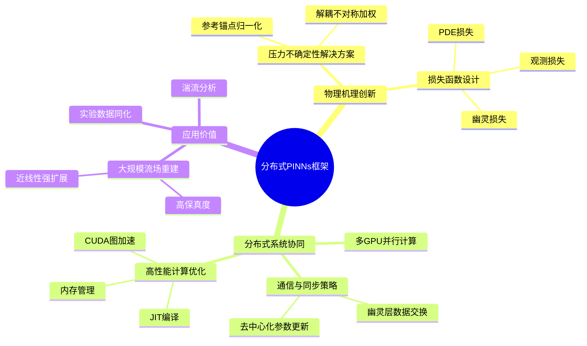

这个框架的价值不仅在于解决了单个技术难题，更在于展示了如何将**物理洞察、算法创新、系统工程**三者有机融合，构建一个既符合物理规律、又能充分发挥现代GPU集群算力的实用系统。这种"从物理到硬件"的全栈思维，正是科学计算领域未来发展的方向。
