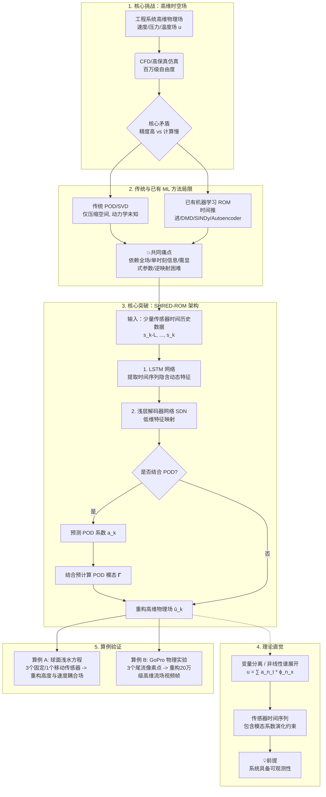
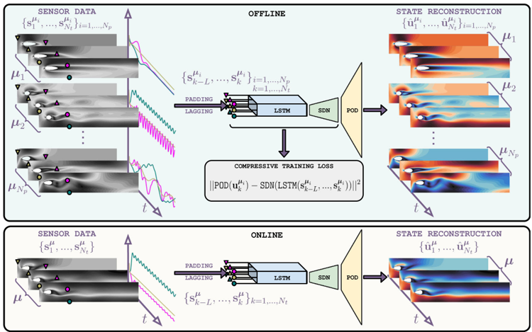

在流体力学、传热学等工程应用中，如何快速且准确地预测系统的高维物理场一直是一个核心难题。近期发表于 _Nature Communications_ 的一项研究提出了一种全新的思路——**SHRED-ROM (Shallow Recurrent Decoder-based Reduced Order Model)**。

本教程将循序渐进地带您了解，如何仅利用少量传感器的“时间历史数据”，即可精准重构出百万级自由度的高维物理场。

1. 核心挑战：高维时空场的“计算困境”

---

许多工程系统都可以表示为随空间和时间变化的高维物理场（例如速度场、压力场或温度场）。在计算流体力学 (CFD) 或高保真仿真中，单帧状态往往包含成千上万甚至上百万个自由度。

我们可以将系统的状态表示为：

$u(x,t,\mu)$

复杂物理系统的演化规律通常统一写成偏微分方程 (PDE) 的形式：

$$\dot{u}=N(u,x,t,\mu)$$

其中，$x$ 表示空间位置，$t$ 表示时间，$\mu$ 表示工况参数（如入口速度、边界条件），而 $N(\cdot)$ 代表系统的演化规律。

**核心矛盾在于：** 高保真模型虽然精度高，但计算成本极其昂贵，难以应用于需要实时反馈的快速预测与控制场景。因此，我们需要引入降阶模型 (Reduced Order Model, ROM)，用更少的自由度来近似原始的高维系统。

2. 传统方法与已有机器学习 ROM 的局限性

----

传统的 ROM 通常通过本征正交分解 (POD) 或奇异值分解 (SVD) 从大量快照中提取主导的空间结构，从而解决“空间维度压缩”的问题。但这还不够，我们仍需知道这些低维特征系数如何随时间演化。

近年来，涌现了许多基于机器学习的 ROM 方法，但它们在实际应用中仍面临一些挑战：

* **神经网络时间推进模型：** 直接学习当前时刻 POD 系数到下一时刻的映射，但往往存在误差累积问题。

* **动态模态分解 (DMD) 与 SINDy：** DMD 假设低维动力学近似线性，SINDy 强调稀疏性和可解释性，但面对高度复杂的非线性系统时表达能力受限。

* **Autoencoder-ROM：** 尝试学习非线性的低维流形，但需要 Encoder 和 Decoder 成对训练，且在推理时依然面临难以获取全场数据的逆映射问题。

**总结来看，已有方法的痛点是：** 往往过度依赖全场状态、需要显式的参数输入，或者仅仅利用单时刻的传感器信息，难以在真实工程场景中落地。

3. 破局之道：SHRED-ROM 方法解析

---

为了克服上述局限，研究人员提出了基于浅层循环解码器的降阶模型 (SHRED-ROM)。

### 核心思想

**少量传感器历史 $\rightarrow$ 时间动态特征 $\rightarrow$ 高维状态重构**

SHRED-ROM 的突破在于，它的输入不再是完整的流场，而是少量传感器在一段时间内的时间序列历史数据。

### 技术流程与网络架构

该方法巧妙结合了时间序列模型与空间解码网络：

1. **动态特征提取：** 利用长短期记忆网络 (LSTM) 处理一段时间窗口内的传感器历史数据 $(s_{k-L},\dots,s_k)$，从中提取隐含的时间动态特征。

2. **高维场恢复：** 将 LSTM 提取的特征输入到浅层解码器网络 (SDN) 中，直接映射回高维状态。

如果高维场的维度过于庞大，可以将 SHRED-ROM 与 POD 技术结合。模型的工作流将变为预测 POD 系数 $\hat{a}_k$，随后利用预先计算好的 POD 模态 $\Psi$ 恢复完整场：

$$\hat{u}_k = \Psi\hat{a}_k$$

**方法优势：** 采用 Decoding-only 策略，不强制要求显式输入参数值，极大降低了训练与推理成本，且非常适合处理未知参数工况下的高维场重构。

4. 理论直觉：为什么传感器历史能重构全场？

---

很多读者可能会问：仅仅知道几个点过去发生的变化，凭什么能重构出整个空间的状态？其背后的理论基础在于**变量分离与系统的可观测性**。

在线性偏微分方程的求解中，经典的思路是变量分离，解可以表示为空间模态与时间函数的叠加：

$$u(x,t)=\sum_{n=1}^{N}a_n e^{\lambda_n t}\phi_n(x)$$

对于非线性系统，虽然模态之间存在复杂的耦合，但依然可以用谱展开进行近似：

$$u(x,t)=\sum_{n=1}^{N}a_n(t)\phi_n(x)$$

传感器在空间某几个位置连续测量得到的时间序列，本质上包含了各模态系数 $a_n(t)$ 随时间演化的约束信息。只要传感器布置满足一定的可观测性条件，LSTM 就能从这段历史数据中“解码”出系统当前的低维动态特征，再由 Decoder 完成空间层面的恢复。

5. 算例验证：从仿真到真实实验

---

论文通过多个难度递增的算例验证了 SHRED-ROM 的强大能力。

### 算例 A：球面浅水方程（高维仿真数据）

* **研究对象：** 模拟球面上的薄流体运动，包含压力面高度偏差、极向速度和方位角速度三个耦合场。

* **重构任务：** 仅利用 3 个固定高度传感器，或 1 个移动传感器的坐标轨迹作为输入。

* **结果验证：** 模型成功重构了高维球面场。这证明了高度与速度之间存在深刻的动力学耦合，高度的历史变化足以逆推出全局的速度场信息。

### 算例 B：GoPro 物理实验（真实视频重构）

* **研究对象：** 圆柱振荡尾流的真实实验视频。包含对称涡脱落与交替对称涡脱落两种流态。

* **重构任务：** 每帧视频维度高达 201,600 像素，但输入端仅仅提取尾流区 3 个像素点的时间历史。

* **结果验证：** 模型不仅能够清晰地恢复出主要的涡结构，甚至能从这 3 个像素的历史波动中，自动区分出底层的两种不同尾流模式，展现了极强的特征泛化能力。
6. 总结与展望

---

SHRED-ROM 提供了一种优雅且高效的降阶建模新范式。通过“LSTM + 浅层解码器 + POD 压缩”的组合拳，它巧妙地将有限的传感器历史数据转化为全局的高保真物理场预测。

该方法不仅适用于固定传感器、移动传感器，甚至能直接处理实验视频数据，为数字孪生、复杂流场实时状态估计以及高维物理系统的闭环控制打开了新的大门。

```python
import numpy as np
import torch.nn as nn

a = torch.zeors((1,10))
```




[点击阅读论文](paper.pdf)
