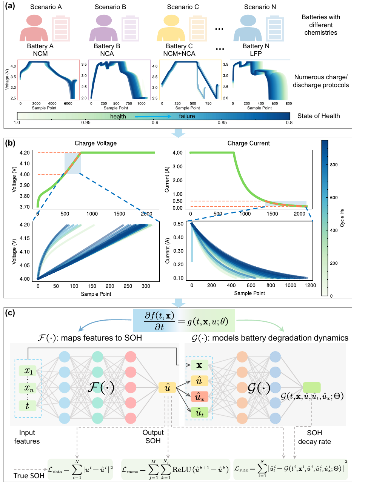
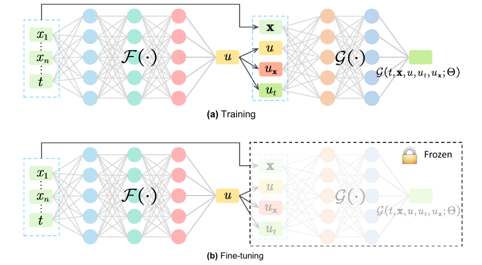
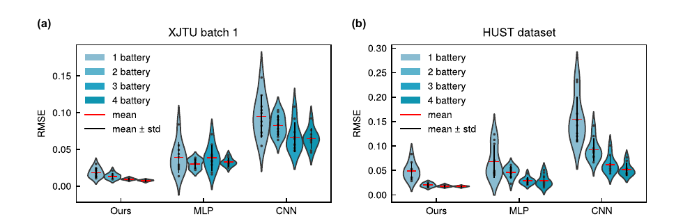

# 基于物理的深度神经网络在锂离子电池退化稳定建模与预测中的应用

> **上传者**：秦若宸  
> **论文标题**：[Physics-informed neural network for lithium-ion battery degradation stable modeling and prognosis](https://www.nature.com/articles/s41467-024-48779-z)  
> **论文PDF**：[paper.pdf](paper.pdf)  
> **阅读时间**：2026-6-3

# 论文DNA

这篇论文的算法核心是：把可观测时间序列特征 x、状态变量 u、退化动力学约束 ∂u/∂t、神经网络预测和迁移学习整合到一个 PINN 框架中，用于小样本、跨工况、跨数据集的状态估计问题。 论文提出的 PINN 由特征到 SOH 的解网络 F(⋅) 和退化动力学网络 G(⋅) 组成，并用数据损失、动力学残差损失和单调性损失共同训练。

不同电池、不同充放电协议会产生不同退化曲线；作者从“接近充满电前的一小段电压/电流曲线”提取特征，然后把这些特征和循环次数输入 PINN，利用神经网络 F 预测 SOH，再利用神经网络 G 学习 SOH 的退化速率，最后通过数据误差、单调性约束和动力学残差共同训练模型。

---

## 一、 先把这篇论文抽象成通用机器学习问题
原文研究对象是电池 SOH，但你可以把它抽象成任何工程系统的健康状态估计问题。

| 电池论文中的量 | 通用工程问题中的含义 | 例子 |
| :--- | :--- | :--- |
| $u$ 或 SOH | 系统健康状态 / 性能状态 / 剩余能力 | 结构损伤程度、设备退化程度、换热效率、控制性能 |
| $t$ | 时间或循环编号 | 时间步、实验步、运行小时数、控制周期 |
| $x$ | 从传感器数据中提取的特征 | 压力、温度、振动、速度、流量、图像特征 |
| $F(t,x)$ | 状态估计模型 | 输入特征后输出系统状态 |
| $G(t,x,u,u_t,u_x)$ | 退化动力学模型 | 学习状态变化速率或演化规律 |
| $L_{\text{PDE}}$ | 物理/规律约束损失 | 方程残差、守恒约束、单调性、稳定性条件 |

> **核心启发**：这篇论文最值得学习的地方是，它把“状态估计”写成了一个**受动力学约束的监督学习问题**。

---

## 二、 算法主线：从普通神经网络到 PINN

### 1. 普通神经网络（仅纯数据驱动）
通常只学习如下映射：

$$\hat{u} = F(t,x;\Phi)$$

* **含义**：给定时间 $t$ 和特征 $x$，网络直接输出估计状态 $\hat{u}$。
* **痛点**：模型只关心输入和输出之间的拟合关系。数据充足时表现良好；但在**小样本、工况变动、传感器特征分布偏移**时，模型极易失稳。

### 2. 引入动力学约束的 PINN
本文增加了一层动力学约束。作者认为系统状态 $u$ 的变化速率应该满足某种演化规律：

$$\frac{\partial u}{\partial t}=g(t,x,u;\theta)$$

* **含义**：状态 $u$ 随时间的变化速度，由时间 $t$、特征 $x$ 和当前状态 $u$ 共同决定。

* **拓展**：论文明确把退化轨迹建模为多变量函数 $u=f(t,x)$，并进一步用 $\partial u/\partial t=g(t,x,u;\theta)$ 描述退化速率。

这里的 g(⋅) 是一个未知函数，θ 是这个函数里的参数。你可以把它理解成“退化动力学方程”。论文把这个方程称为 PDE，因为 u=f(t,x) 同时依赖 t 和 x，而式子里出现的是对 t 的偏导数。论文中也说明，g(⋅) 表征电池内部退化动力学，通过改变这个非线性函数，可以表示线性模型、指数模型、幂律模型、FFM 等不同退化形式。

这里有一个关键点：这个 PDE 不是完整电化学方程。它更接近一个经验退化动力学方程或状态空间形式的退化方程。作者没有直接写锂离子扩散、SEI 膜生长、P2D 电化学模型那类高保真机理方程，因为这些方程参数多、内部变量难测、和神经网络融合困难。论文讨论部分也明确说，该 PINN 是从经验退化和状态空间方程角度进行探索。

它受三个东西限制。第一，F 的输出必须接近真实 SOH，也就是 Ldata约束。第二，F 的时间导数必须和 G 的输出一致，也就是 LPDE约束。第三，SOH 预测曲线总体要符合退化方向，也就是 Lmono约束。

---

## 三、 知识向量：6 个共性算法点

### 1. 特征工程：选取“更稳定、更可复现”的局部片段
这篇论文没有使用完整生命周期数据，也没有要求完整放电曲线，而是从接近满电前的一小段电压和电流曲线提取统计特征。

* **算法思想**：从复杂时序中找一个跨样本都容易出现、物理含义相对稳定的片段，然后提取统计特征。

| 工程问题 | 可借鉴的稳定窗口 |
| :--- | :--- |
| **热管理系统** | 稳态前后的一小段温度响应 |
| **流动控制** | 执行动作后固定延迟窗口内的压力/速度响应 |
| **结构健康监测** | 激励后固定时间段的振动衰减响应 |
| **泵/压缩机状态监测** | 启动阶段或固定工况下的压力波动片段 |

其共性特征提取公式可写为：

$$x_i = \phi\left(s_i(\tau_1:\tau_2)\right)$$

其中：

* $s_i(\tau_1:\tau_2)$ 表示第 $i$ 个样本在局部时间窗口 $[\tau_1,\tau_2]$ 内的原始信号。

* $\phi(\cdot)$ 表示特征提取函数（如均值、标准差、斜率、熵、峰度、偏度等）。

### 2. 状态建模：把目标变量看成“时间 + 特征”的函数
本文没有简单地认为状态只随时间单调下降，而是认为状态同时受时间和实时特征影响。

$$u = f(t,x)$$

论文指出，只把退化轨迹写成时间的一元函数会过度简化问题。通用理解为：

$$\text{状态} = \text{模型}(\text{时间}, \text{传感器特征})$$

* **热管理系统示例**：$T_{\text{wall}} = f(t, x)$ （$x$ 包含流量、入口温度、环境温度、热负载等）。

* **流动控制示例**：$C_D = f(t, x)$ （$x$ 包含压力传感器、壁面剪切、速度场低维模态系数等）。

### 3. 动力学建模：不仅预测状态，还预测状态变化趋势
这是本文最核心的 PINN 思想。普通监督学习只要求 $\hat{u}_i \approx u_i$，本文进一步要求模型满足：

$$\frac{\partial u}{\partial t} \approx g(t,x,u;\theta)$$

模型输出不能只在数值上接近标签，还要在演化趋势上符合某种动力学规律：

$$u_t = g(t,x,u;\theta)$$

其中

$$u_t = \frac{\partial u}{\partial t}$$

| 迁移领域 | 状态变量 $u$ | 趋势变量 $u_t$ 的通用含义 |
| :--- | :--- | :--- |
| **电池健康估计** | SOH | 健康衰减速度 |
| **热系统控制** | 温度 | 升温 / 降温速率 |
| **流动控制** | 阻力系数 / 升力系数 | 气动力响应速率 |

### 4. 双网络结构：$F$ 学状态，$G$ 学动力学

本文没有使用单一网络硬挑大梁，而是构建了双网络联动机制：

| 网络模块 | 输入 | 输出 | 核心作用 |
| :--- | :--- | :--- | :--- |
| **解网络** $F(t,x;\Phi)$ | 时间 $t$、特征 $x$ | 状态估计 $\hat{u}$ | 求解“当前状态是多少” |
| **动力学网络** $G(t,x,u,u_t,u_x;\Theta)$ | 时间、特征、状态、偏导数 | 状态变化率 $\hat{u}_t$ | 求解“状态如何演化” |

$$\hat{u}=F(t,x;\Phi)$$

$$\hat{u}_t=G(t,x,u,u_t,u_x;\Theta)$$

训练时，利用**自动微分（Automatic Differentiation）** 得到 $\partial F/\partial t$，进而与 $G$ 的输出构造动力学残差。

对于其他方向，如流体阻力预测：

$$\hat{C}_D = F(t,x;\Phi) \quad \rightarrow \quad \frac{\partial \hat{C}_D}{\partial t} \approx G\left(t,x,\hat{C}_D,\frac{\partial \hat{C}_D}{\partial x};\Theta\right)$$

### 5. PINN 残差：用自动微分构造物理约束

本文定义了一个 PINN 残差 $H$。它的含义是：网络 $F$ 给出的时间导数，应该逼近动力学网络 $G$ 给出的状态变化率。

$$H := \frac{\partial F(t,x;\Phi)}{\partial t} - G(t,x,u,u_t,u_x;\Theta)$$

理想情况下：

$$H(t_i,x_i)=0$$

这符合传统 PINN 的核心思想 $\mathcal{N}[u](t,x)=0$。但在工程落地上，本文的 $\mathcal{N}$ 更像一个**经验退化动力学残差算子**，而非严格的电化学第一性原理 PDE，因而对数据噪声更具鲁棒性。

### 6. 损失函数：监督误差 + 动力学残差 + 单调性约束

#### 6.1 数据损失（Data Loss）

$$L_{\text{data}} = \sum_{i=1}^{N} \left|u^i-\hat{u}^i\right|^2$$

* **含义**：保证预测值 $\hat{u}^i$ 逼近真实标签 $u^i$（基础监督项）。

#### 6.2 PDE / 动力学残差损失（Physics Loss）

$$L_{\text{PDE}} = \sum_{i=1}^{N} \left|H(t^i,x^i)\right|^2 = \sum_{i=1}^{N} \left| \frac{\partial F(t^i,x^i;\Phi)}{\partial t} - G(t^i,x^i,u^i,u_t^i,u_x^i;\Theta) \right|^2$$

* **含义**：约束解网络输出的导数必须符合动力学网络学到的演化规律。

#### 6.3 单调性损失（Monotonicity Loss）

$$L_{\text{mono}} = \sum_{j=1}^{M} \sum_{k=1}^{N_j} \operatorname{ReLU} \left(\hat{u}^{k+1}_j-\hat{u}^{k}_j\right)$$

* **含义**：若下一时刻状态 $\hat{u}^{k+1}_j$ 异常大于上一时刻 $\hat{u}^{k}_j$，则激活 ReLU 给予惩罚。

#### 6.4 总损失函数
$$L = L_{\text{data}} + \alpha L_{\text{PDE}} + \beta L_{\text{mono}}$$

* **本质**：

$$\text{总目标} = \text{数据拟合} + \text{动力学合规} + \text{物理趋势单调}$$

---

## 四、 为什么这个算法对“小样本”有优势？

普通神经网络只靠数据学习：

$$x \rightarrow u$$

当数据少时，模型很容易学偏。

PINN 多了两类先验：

$$\frac{\partial u}{\partial t}=g(t,x,u;\theta)$$

$$u^{k+1} \leq u^k$$

这等于告诉模型：

* 状态不是任意变化的；

* 状态变化有动力学规律；

* 状态变化方向有基本约束。

因此它需要的数据量更少。论文的小样本实验显示，使用 1、2、3、4 个训练电池时，PINN 在 XJTU 和 HUST 数据集上整体优于 MLP 和 CNN；作者也指出，PINN 用 1 个训练样本时的表现可以接近 MLP/CNN 用 3–4 个训练样本的表现。

论文说明，每个小提琴图包含 10 次重复实验结果，红线表示均值，黑线表示均值 ± 标准差。也就是说，小提琴越低，误差越小；越窄、黑线越短，说明结果越稳定。

---

## 六、 为什么这个算法适合迁移学习？

本文的迁移学习思想很简单：把模型拆成**“通用部分”**和**“任务相关部分”**。

| 模块 | 作者的判断 | 迁移时怎么处理 |
| :--- | :--- | :--- |
| $G(\cdot)$ | 学退化动力学，更通用 | **冻结** |
| $F(\cdot)$ | 学特征到状态的映射，更依赖数据集 | **微调** |

### 公式代码：

$$\Theta_{\text{target}} = \Theta_{\text{source}}$$

表示动力学网络 $G$ 的参数 $\Theta$ 直接从源域继承并冻结。

$$\Phi_{\text{target}} \leftarrow \operatorname{FineTune} \left( \Phi_{\text{source}}; \mathcal{D}_{\text{target}} \right)$$

表示只用目标域少量数据微调 $F$ 的参数 $\Phi$。

论文中明确说明，在迁移学习场景中冻结退化动力学网络 G，只微调解网络 F；实验结果显示 fine-tuning 明显优于 source-only，也优于只用少量目标域样本从头训练的模型。

---

## 七、 贡献网格：算法共性价值

| 算法模块 | 本文电池领域做法 | 共性工程意义 | 可迁移到你的研究时怎么用 |
| :--- | :--- | :--- | :--- |
| **局部窗口特征** | 从接近满电的短时段曲线提取统计量 | 不依赖完整时序，增强可用性 | 从稳定工况、激励响应段、控制后响应段提取特征 |
| **多变量状态函数** | $u=f(t,x)$ | 状态由时间和多源特征共同决定 | 用 $x$ 表示传感器、POD系数、控制量、环境扰动 |
| **动力学网络** | $G(t,x,u,u_t,u_x)$ | 学状态变化规律 | 可替换为温度动力学、流动响应、结构损伤演化 |
| **自动微分计算** | $u_t, u_x$ | 让神经网络输出具备可微物理约束 | 用于构造残差、稳定性约束、守恒约束 |
| **复合损失** | $L=L_{\text{data}}+\alpha L_{\text{PDE}}+\beta L_{\text{mono}}$ | 数据拟合与规律约束联合训练 | 可加入能量守恒、边界条件、单调性、非负性 |
| **模块化迁移** | 冻结 $G$，微调 $F$ | 把通用动力学和任务映射分离 | 源工况学动力学，新工况少量数据微调 |

---

## 八、 这篇论文和传统 PINN 的区别

传统 PINN 往往直接嵌入明确的控制方程，比如：

$$\mathcal{N}[u](t,x)=0$$

例如流体里的 **Navier-Stokes 方程**：

$$\frac{\partial \mathbf{u}}{\partial t} + (\mathbf{u}\cdot\nabla)\mathbf{u} = -\frac{1}{\rho}\nabla p + \nu \nabla^2 \mathbf{u}$$

传热里的 **热传导方程**：

$$\frac{\partial T}{\partial t} = \alpha \nabla^2 T$$

本文没有嵌入完整电化学方程，而是构造了一个**经验退化动力学**：

$$\frac{\partial u}{\partial t}=g(t,x,u;\theta)$$

然后再用神经网络 $G(\cdot)$ 学这个未知函数。

论文讨论部分也承认，完整电化学模型如 P2D 模型参数多、内部变量难获取，目前很难和神经网络无缝融合；本文是从经验退化和状态空间方程角度进行的 hybrid PINN 探索。

所以它更适合被理解成：

$$\text{经验动力学约束的PINN}$$

或者：

$$\text{state-space-informed neural network}$$

而不是那种严格嵌入一整套机理 PDE 的 PINN。

---

## 九、 对非电池研究者最有用的 5 个知识点

### 1. 特征要选“跨工况稳定出现”的片段
不要盲目把所有时序数据输入模型。

$$\text{哪个局部时间段在不同样本、不同工况下都稳定存在？}$$

这篇论文选择的是充满电前的短时段。换成其他工程问题，可以选择启动段、稳态段、控制后响应段、冲击响应段等。

### 2. 预测变量最好写成 $u=f(t,x)$
很多工程状态都不能只用时间解释。更合理的是：

$$u=f(t,x)$$

其中 $x$ 可以包含多源传感器、工况参数、环境扰动、控制输入、统计特征、模态系数等。

### 3. 用导数约束模型，比单纯拟合标签更稳
只拟合：

$$\hat{u}\approx u$$

模型容易学到表面相关性。

加入：

$$\frac{\partial \hat{u}}{\partial t} \approx G(t,x,\hat{u},\hat{u}_t,\hat{u}_x)$$

模型会被迫学习演化规律。

### 4. 单调性、非负性、边界条件都可以作为损失函数
本文用了单调性约束。更一般地，可以写成：

$$L_{\text{constraint}} = \sum_i \left[ \max(0, -c(\hat{u}_i)) \right]^2$$

其中 $c(\hat{u}_i)\geq 0$ 是你希望模型满足的约束。

| 约束类型 | 公式代码 |
| :--- | :--- |
| **非负性** | $\hat{u}\geq 0$ |
| **单调递减** | $\hat{u}^{k+1}-\hat{u}^{k}\leq 0$ |
| **单调递增** | $\hat{u}^{k+1}-\hat{u}^{k}\geq 0$ |
| **边界条件** | $\hat{u}(x_b,t)=u_b$ |
| **守恒约束** | $\nabla\cdot \mathbf{u}=0$ |

### 5. 迁移学习时可以冻结“动力学模块”

如果你的模型也能拆成：

$$\text{状态映射模块} + \text{动力学规律模块}$$

那么迁移学习时可以考虑：

$$\text{冻结动力学模块，微调状态映射模块}$$

这对跨工况、跨设备、跨实验数据非常有用。

## 问题解答

### 1. 这篇文章的 PINN 到底是怎么运行的？和依据物理方程的 PINN 有什么区别？

这篇文章的 PINN 运行逻辑可以分成**两个网络、三个损失**。

#### 核心网络架构

* **第一个网络是 $F$（解网络/状态估计器）**

    输入是循环次数 $t$ 和特征 $x$，输出是预测 SOH：

    $$\hat{u}=F(t,x;\Phi)$$

    这里 $x$ 是从充电数据中提取出来的健康特征，$\Phi$ 是 $F$ 网络的参数。这个 $F$ 网络本质上就是一个状态估计器：给它时间和特征，它输出当前电池健康状态。论文明确说，$f(\cdot)$ 负责建立 features-to-SOH 的映射，实际用神经网络 $F(\cdot)$ 来近似。

* **第二个网络是 $G$（退化动力学网络）**

    输入是 $t, x, \hat{u}, \hat{u}_t, \hat{u}_x$，输出是 SOH 的变化速率，也就是退化速率：

    $$G(t,x,\hat{u},\hat{u}_t,\hat{u}_x;\Theta)$$

    这里 $\Theta$ 是 $G$ 网络的参数。$G$ 网络不是直接预测 SOH，而是学习“SOH 怎么随时间变化”。论文说，$g(\cdot)$ 表征电池内部退化动力学，但显式形式未知，所以作者用一个更一般的函数近似器，并用神经网络 $G(\cdot)$ 学习这个退化机制。

---

#### 运行流程与动力学残差

模型首先通过自动微分（Automatic Differentiation）从 $F$ 的输出里算出状态对时间及特征的偏导数：

$$\hat{u}_t=\frac{\partial F(t,x;\Phi)}{\partial t}$$

$$\hat{u}_x=\frac{\partial F(t,x;\Phi)}{\partial x}$$

接着构造一个**动力学残差 $H(t,x)$**：

$$H(t,x) = \frac{\partial F(t,x;\Phi)}{\partial t} - G(t,x,\hat{u},\hat{u}_t,\hat{u}_x;\Theta)$$

> **残差的物理含义**：$F$ 网络自己画出来的 SOH 曲线有一个时间斜率，而 $G$ 网络也给出一个退化速率，这两个速率应该完全一致。如果二者不一致，说明模型预测出来的状态演化与它自己学到的退化动力学不自洽。

---

#### 三个联合训练损失函数

为了纠正这种不自洽，训练时采用了三个损失共同约束：

1.  **数据损失（Data Loss）**

    $$L_{\text{data}} = \sum_{i=1}^{N} \left|u^i-\hat{u}^i\right|^2$$

    这个损失让预测 SOH 逼近真实标签 SOH。

2.  **动力学残差损失（Physics/PDE Loss）**

    $$L_{\text{PDE}} = \sum_{i=1}^{N} \left|H(t^i,x^i)\right|^2$$

    这个损失强制要求模型输出满足退化动力学残差。

3.  **单调性损失（Monotonicity Loss）**

    $$L_{\text{mono}} = \sum_{j=1}^{M} \sum_{k=1}^{N_j} \operatorname{ReLU} \left( \hat{u}_j^{k+1}-\hat{u}_j^k \right)$$

    这个损失惩罚 SOH 反常上升的情况，因为电池健康状态总体应随循环次数增加而下降。论文也明确写到，单调性损失基于电池退化的物理属性，即下一循环 SOH 应小于或等于上一循环 SOH（容量再生情况除外）。

**总损失函数为：**

$$L = L_{\text{data}} + \alpha L_{\text{PDE}} + \beta L_{\text{mono}}$$

#### 💡 运行数据流图解

$$(t,x) \rightarrow F \rightarrow \hat{u} \rightarrow \text{自动微分得到 } \hat{u}_t,\hat{u}_x \rightarrow G \rightarrow \text{退化速率} \rightarrow L_{\text{data}}+L_{\text{PDE}}+L_{\text{mono}}$$

---

### 🔍 与传统“依据明确物理方程”的 PINN 的区别

它和传统 PINN 的区别非常关键。传统 PINN 通常拥有一个**完全已知的第一性原理物理方程**，例如：

* **流体中的 Navier–Stokes 方程：**

    $$\frac{\partial \mathbf{u}}{\partial t} + (\mathbf{u}\cdot\nabla)\mathbf{u} = -\frac{1}{\rho}\nabla p + \nu\nabla^2\mathbf{u}$$

* **传热学中的热传导方程：**

    $$\frac{\partial T}{\partial t} = \alpha \nabla^2 T$$

这些方程里的物理算子和控制系数是绝对明确的。传统 PINN 直接把这些方程写进残差算子 $\mathcal{N}[u]=0$，然后训练网络去硬性拟合这个残差。

**而这篇文章的做法不同：**

它没有写入完整的电化学机理方程（如 P2D 模型、锂离子扩散方程、SEI 膜生长方程、电荷守恒方程等）。它先做出一般性假设：

$$\frac{\partial u}{\partial t}=g(t,x,u;\theta)$$

但因为退化机制太复杂，导致 $g(\cdot)$ 的显式代数形式是未知的，所以作者**又用了一个神经网络 $G(\cdot)$ 去动态学习这个隐式方程**。

论文讨论部分也承认，电池物理模型如 P2D 模型参数多、内部变量难收集，目前没有满意方法能把完整物理模型和神经网络无缝融合；本文的 PINN 是从经验退化和状态空间方程角度建模，是一种 **hybrid（混合）方法探索**。

因此，这篇文章的 PINN 更适合被定义为：

$$\text{data-driven hidden dynamics PINN (数据驱动的隐式动力学 PINN)}$$

#### ⚖️ 物理强度的权衡评价

* **比普通 MLP/CNN 强**：因为它强行加入了时间/空间退化趋势约束和双网络自洽残差。

* **比标准第一性原理 PINN 弱**：因为约束演化的控制方程 $G$ 本身仍然是神经网络学出来的隐式函数，而非不可动摇的硬物理定律。

### 2. 文章把电池里复杂结构只用一维来表述，这个方式可以吗？有什么优缺点？什么时候可以用一维参数化？

文章不是用一个完整的多物理场状态表示电池内部结构，而是用一个宏观健康指数表示电池退化程度：

$$u_k = \frac{Q_k}{Q_0}$$

这里 $u_k$ 是第 $k$ 个循环的 SOH，$Q_k$ 是第 $k$ 个循环容量，$Q_0$ 是标称容量。论文也明确给出了这个 SOH 公式。

> **更准确的说法是**：本文用高维输入特征 $x$ 解释一个一维健康状态 $u$，它做的是**标量状态估计**，而不是完整电池内部机理重构。

---

###  这种方式的优缺点分析

这种方式可以用，但要看研究目的。

#### 优点（为什么在工程预测中合理）

如果目标是工程预测，比如估计当前健康程度、预测剩余寿命、做 BMS 状态监测，那么用一维 SOH 是合理的。因为工程系统有时并不需要知道 SEI 膜具体厚度、锂浓度分布、电极颗粒应力场，只需要一个可用的健康指标。

* **低维指标的明显优势**：数据需求更低，模型更稳定，标签更容易获得，工程部署更简单，也更适合跨数据集迁移。

#### 缺点（局限性）

* **丢失退化机制差异**：两块电池可能 SOH 都是 $0.85$，但一个主要是锂库存损失（LLI），另一个主要是活性材料损失（LAM），它们未来衰减速度、温度敏感性、安全风险可能不同。

* **可能不满足马尔可夫性**：也就是只知道当前 $u$ 和 $x$ 未必足以预测未来，因为历史退化路径也很重要。

* **不适合解释内部机理**：不能回答“为什么退化”“哪个物理机制主导退化”“如何通过材料设计减缓退化”等问题。

* **表达能力有限**：对多机制交叉、容量再生、突发故障、热失控前兆等复杂现象表达能力不足。

---

### 什么时候可以用一维参数化？（判断标准）

如果**系统存在一个主导退化方向**，而且研究目标只是预测某个宏观性能指标，那么一维参数化完全可以用。例如：电池 SOH、结构损伤指数、设备健康指数、换热效率、阻力系数、再附着长度、控制性能指标等。

数学上可以理解为系统的高维状态 $\mathbf{X}$ 可以被一个低维序参量 $u$ 近似描述：

$$u=\psi(\mathbf{X})$$

并且你关心的输出主要由 $u$ 决定：

$$y\approx h(u)$$

或者由 $u$ 和少量条件变量决定：

$$y\approx h(u,\mu)$$

其中 $\mu$ 是工况参数。

> **适用场景总结**：如果系统处在**单一主导模态、单一退化通道、弱分叉、弱突变、可重复工况**下，一维参数化通常比较有效。

---

###  流体问题中的类比与高级映射

对于流体问题，如果你只想预测一个标量，比如：

* 阻力系数 $C_D(t)$

* 升力系数 $C_L(t)$

* 再附着长度 $x_r(t)$

* 主导模态振幅 $A_{\text{mode}}(t)$

那么可以用一维或少维状态参数化。例如在固定 $Re$、固定攻角、固定几何、单一主导涡脱落频率的条件下，用一个振幅或相位变量描述主导动力学是可以的。

**什么时候一维参数化不够用？**
如果你要描述完整流场、湍流结构、跨尺度能量转移、分离泡再附着、三维涡结构、雷诺数跨区间变化、控制输入导致的多稳态切换，那么一维参数化通常不够。更合理的是用**向量状态**：

$$\mathbf{z} = [z_1,z_2,\dots,z_r]$$

例如 POD/SPOD 模态系数、Autoencoder 隐变量（latent variables）、DMD 坐标、RAM/熵产生特征向量等。然后再写成状态空间方程形式：

$$\frac{d\mathbf{z}}{dt} = G(\mathbf{z},Re,\mu;\Theta)$$

这里 $\mu$ 可以包括控制输入、来流扰动、攻角、壁面条件等。

---

### 📌 最终结论：一维参数化的正确使用条件

1. 你的目标是**标量状态预测**；
2. 系统存在**主导低维演化方向**；
3. 输入特征 $x$ 已经包含足够多的工况和状态信息；
4. 你不试图解释完整内部机制。