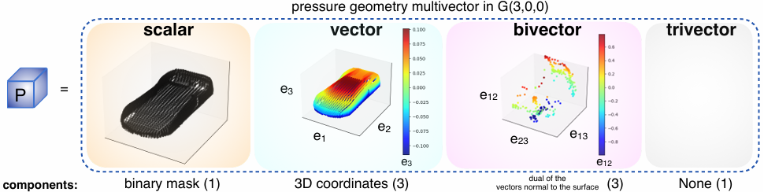
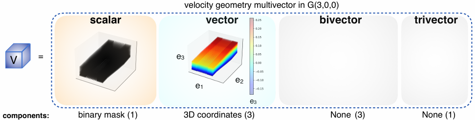
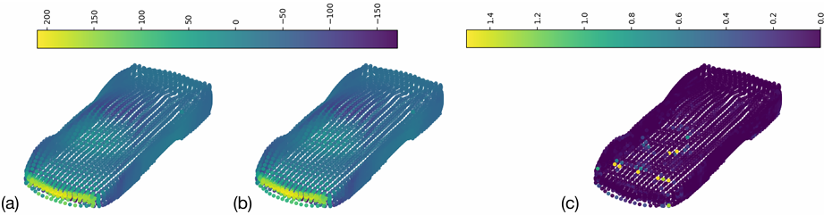

# Fengbo：用于计算流体力学中三维偏微分方程的克利福德神经算子管道

> **上传者**：[XYChouMian](https://github.com/XYChouMian)  
> **论文标题**：[Fengbo: a Clifford Neural Operator pipeline for 3D PDEs in Computational Fluid Dynamics](https://proceedings.iclr.cc/paper_files/paper/2025/hash/3711d4376db81f2d8e4177c6525a9b0a-Abstract-Conference.html)  
> **论文PDF**：[paper.pdf](paper.pdf)  
> **阅读时间**：2026-6-

---

## 论文精髓快速阅读

### **论文DNA**

Fengbo 是一个完全构建于三维克利福德代数（3D Clifford Algebra）之上的神经算子流水线，通过仅4200万个可训练参数，将计算流体动力学中的复杂几何形状高效、可解释地映射为对应的压力场与速度场，性能超越多数现有模型。

### **知识向量（3维度摘要）**

#### **维度一：几何的克利福德代数编码**

Fengbo 的核心创新在于利用克利福德代数中的**多向量（Multivector）** 统一表示几何与物理量。它将输入的不规则三维网格体素化，并为每个体素构造一个多向量，其中标量部分为二值掩码，向量部分代表点云坐标，双向量部分代表表面的法平面。这种编码方式使得神经网络能够天然地处理几何信息，并提供了强大的归纳偏置。

>   
> 图2：压力几何多重向量（multivector）$P$ 的示例。它包含一个标量分量（二进制掩码 $m_p$）、3 个向量分量（3D 坐标 $\mathbf{p}$）以及 3 个双重向量（bivector）分量（点 $\mathbf{p}$ 处法向量 $\mathbf{n}$ 的对偶）。

#### **维度二：从局部到全局的算子学习**

Fengbo 架构由三部分组成，形成了一个从几何到物理的完整映射流水线：

1.  **3D Clifford 几何块**：使用三维克利福德卷积层捕捉局部几何特征，并混合不同等级的多向量元素。
2.  **3D Clifford 傅里叶神经算子（FNO）**：在频域中进行操作，高效捕捉全局相互作用，并将多向量从几何域映射到物理域。
3.  **3D Clifford 物理块**：将处理后的多向量降维，并从中提取出标量压力场和向量速度场。

>   
> 图3：速度几何多重向量（multivector）$V$ 的示例。它包含一个标量分量（二进制掩码 $m_v$）和 3 个向量分量（3D 坐标 $\mathbf{v}$）。

#### **维度三：卓越的性能与可解释性**

Fengbo 在 ShapeNet Car 和 Ahmed Body 两个基准数据集上取得了极具竞争力的结果。它不仅参数量少（仅为 GINO 的 40%），计算复杂度低（O(N log N)），并且由于其每一层的输出都是具有几何或物理意义的多向量，使得整个过程成为可观测的**白盒模型**。

>   
> 图4：_ShapeNet Car_ 数据集中某个测试形状的：**(a)** 真实压力场（Ground truth），**(b)** Fengbo 模型估计的压力场，以及 **(c)** 两者之间的相对误差。

### **贡献网格（含量化指标的对比表）**

下表总结了 Fengbo 与其他主流模型在 ShapeNet Car 数据集上的性能对比。Fengbo 在压力场预测上超越了除 GINO(decoder) 外的所有模型，并以显著更少的参数联合估计了速度场。

| 模型                   | 参数量  | 压力场测试误差 (相对L2范数 %) | 速度场测试误差 (相对L2范数 %) | 计算复杂度      |
| :--------------------- | :------ | :---------------------------- | :---------------------------- | :-------------- |
| **Fengbo (本文)**      | **42M** | **8.86**                      | **3.47**                      | **O(N log N)**  |
| GINO (decoder)         | ~105M   | 7.12                          | -                             | O(N log N + Nd) |
| GINO (encoder-decoder) | ~105M   | 9.47                          | 3.86                          | O(N log N + Nd) |
| FNO                    | ~50M    | 9.42                          | -                             | O(N log N)      |
| MeshGraphNet           | -       | 7.81                          | 3.54                          | O(Nd)           |

_注：上表数据综合自论文表2。Fengbo 能以最低的计算复杂度和最少的参数，实现接近最优的精度，并能同时预测压力和速度场。_

### **文献关联网络**

Fengbo 的研究根植于以下关键领域，并在此基础上进行了创新性融合：

1.  **神经算子 (Neural Operators)**：Fengbo 属于神经算子家族，旨在学习函数空间之间的映射。它继承了 [FNO (Li et al., 2020a)](https://openreview.net/forum?id=c8P9NQVtmnO) 在频域高效建模全局依赖的优点，并借鉴了 [GINO (Li et al., 2024)](https://proceedings.neurips.cc/paper_files/paper/2023/hash/70518ea42831f02afc3a2828993935ad-Abstract-Conference.html) 处理不规则几何的流水线思想。
2.  **克利福德代数网络 (Clifford Algebra Networks)**：Fengbo 的核心是使用克利福德代数中的多向量作为网络的基本运算单元。这一思想源于 [Brandstetter et al. (2022)](https://www.semanticscholar.org/paper/Clifford-Neural-Layers-for-PDE-Modeling-Brandstetter-Berg/84959e211a767f902cbf1695ec54a5b50148020f) 的工作，但 Fengbo 将其扩展到了完整的 3D 多向量空间，并应用于复杂的工业级 CFD 问题。
3.  **物理信息驱动的方法**：不同于 [PINNs (Raissi et al., 2019)](https://www.sciencedirect.com/science/article/pii/S0021999118307125) 将物理方程作为损失项，Fengbo 通过将几何与物理量内嵌于多向量的代数结构中，以一种更本质的方式引入了物理与几何的归纳偏置，实现了“几何即数据，物理即输出”的优雅设计。

综上所述，Fengbo 通过巧妙地结合神经算子的强大映射能力和克利福德代数的结构化表征优势，为解决复杂三维 PDE 问题提供了一个高效、精准且透明的全新范式。
