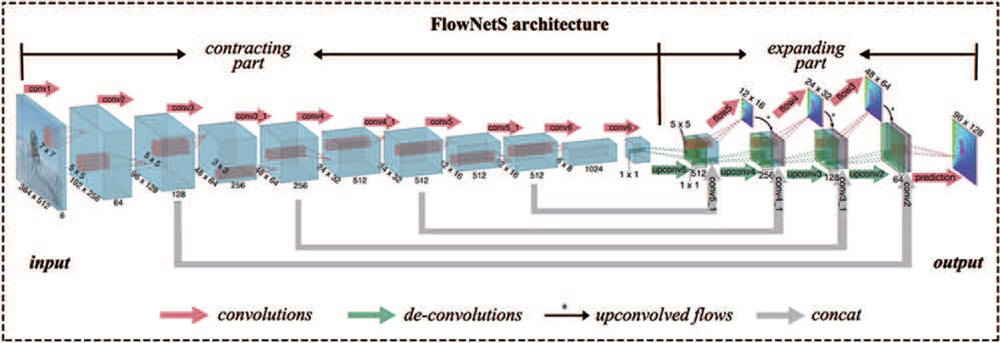
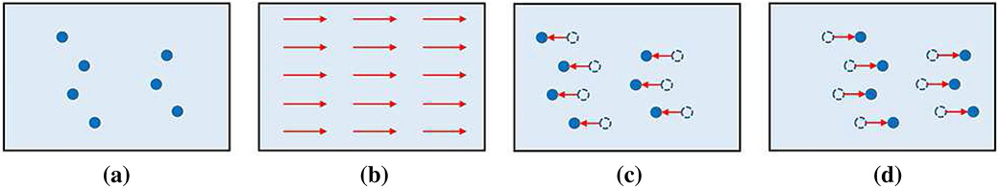
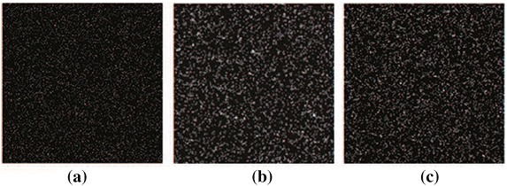
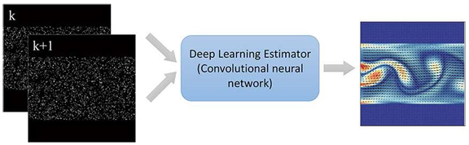
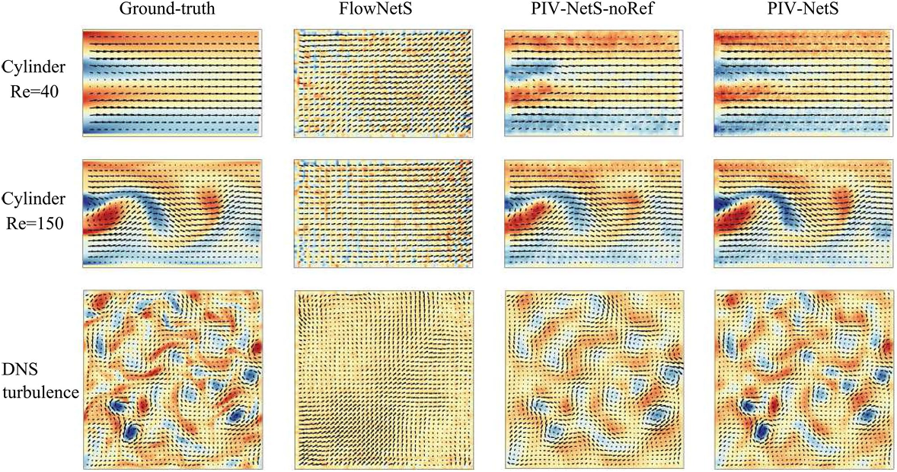
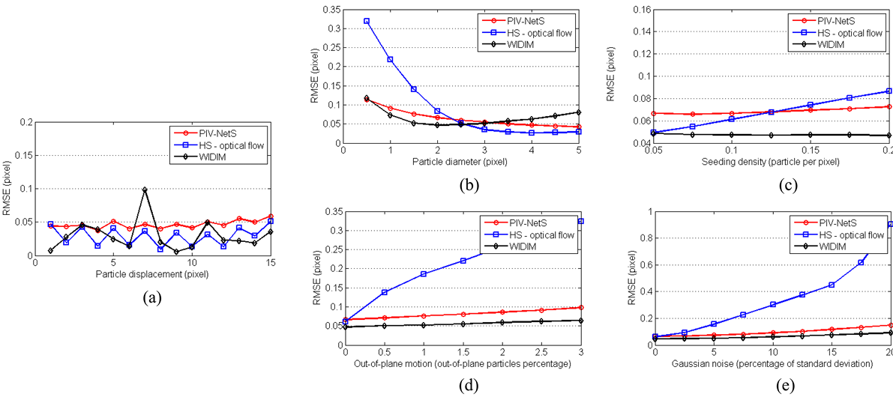
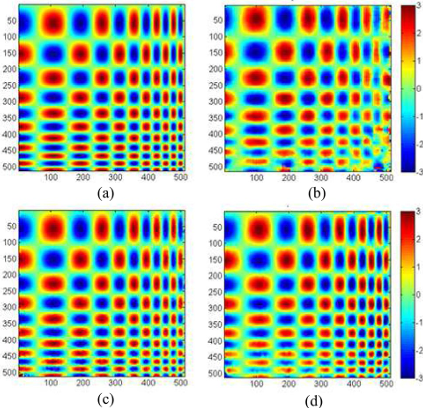
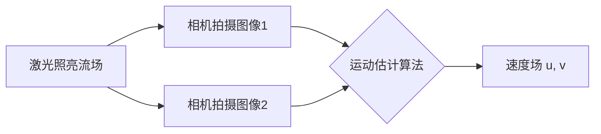
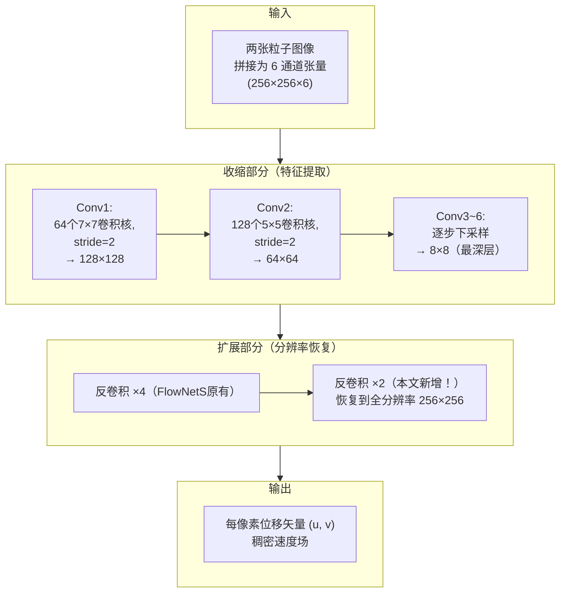
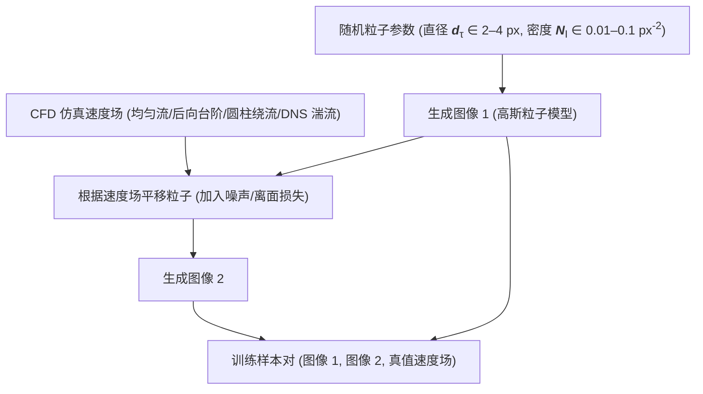

# 基于卷积神经网络的粒子图像稠密运动估计

> **上传者**：[XYChouMian](https://github.com/XYChouMian)  
> **论文标题**：[Dense motion estimation of particle images via a convolutional neural network](https://link.springer.com/article/10.1007/s00348-019-2717-2)  
> **论文PDF**：[paper.pdf](paper.pdf)  
> **阅读时间**：2026-6-18

---

## 论文精髓快速阅读

### **论文DNA**

本文首次将全卷积神经网络（CNN）作为全局运动估计器用于粒子图像测速（PIV），通过改进FlowNetS架构并生成专用合成数据集训练，实现了兼具高精度与超高计算效率的稠密流场估计。

### **知识向量（4维度摘要）**

#### **维度一：方法论创新——从FlowNetS到PIV-NetS的适应性改造**

本研究的核心创新在于对计算机视觉领域的FlowNetS网络进行了针对流体运动估计的定向改造，提出了 **PIV-NetS** 模型。

- **核心架构**：PIV-NetS继承了FlowNetS的端到端、编码器-解码器结构。输入为两张连续粒子图像组成的6通道（或2通道）数据，经过收缩部分（Contracting Part）进行特征提取与空间压缩，再通过扩展部分（Expanding Part）利用反卷积层恢复分辨率，最终输出每个像素点的位移矢量（即稠密速度场）。下图展示了其基础架构：

> 
> 图2：[FlowNetS](../FlowNet/FlowNet.md) 架构。该网络由收缩部分（编码器）和扩展部分（解码器）组成。最终预测的分辨率仍比输入小四倍。为了精细化估计结果，流动场通过插值方法被上采样至原始图像的完整分辨率。

- **关键改进**：作者针对PIV应用场景，对原始FlowNetS进行了三项关键改进：
  1.  **增加反卷积层**：在网络的最后增加了两层反卷积层，使得网络能够学习到更精细的上采样，从而保留更多小尺度流动结构，避免了简单插值带来的信息丢失。
  2.  **重构损失函数**：将新增加的输出层的误差也纳入总损失函数，并显著提高了最后一层输出的权重，引导网络更关注高分辨率的预测结果。
  3.  **数据归一化**：对拼接在一起的图像强度数据（0-255）和速度矢量数据（0-10像素）进行归一化至0-1范围，消除了量纲差异对网络训练的影响。

#### **维度二：数据集构建——面向流体运动的合成训练集**

由于难以获取真实PIV实验的“真值”（Ground Truth）速度场，作者创新性地构建了一个大规模的合成数据集用于监督学习。其生成策略如下所示：

> 
> 图3：生成 PIV 图像对的步骤。首先，在图像区域内随机播撒粒子，如 a 中的蓝点所示。接着，从计算流体力学（CFD）模拟中提取出底层的流体运动。例如，b 中展示了一个均匀流。最终，将该运动场对称地应用到粒子上（向后和向前各平移一半位移），从而获得两幅粒子图像。生成的图像如 c、d 所示。

- **粒子图像生成**：粒子由二维高斯函数模拟，其参数（如直径、峰值强度、种子密度）在一定范围内随机选取，以模拟真实实验中的多样性。下图为不同参数生成的粒子图像示例：

> 
> 图4：由 PIG（粒子图像生成器）在不同参数下生成的粒子图像：a 撒播密度 $\rho = 0.078\text{ ppp}$，粒子直径 $d_{\text{p}} = 1.31\text{ pixel}$；b $\rho = 0.051\text{ ppp}$，$d_{\text{p}} = 3.68\text{ pixel}$；c $\rho = 0.069\text{ ppp}$，$d_{\text{p}} = 2.81\text{ pixel}$

- **运动模式来源**：训练所用的速度场（即真值）来源于多种计算流体力学（CFD）仿真数据，涵盖了均匀流、后向台阶流、圆柱绕流以及各向同性湍流等多种典型流动形态。

> 
> 图6：本文主要思路示意图

最终，数据集包含超过13,000对粒子图像及其对应的真值速度场，并辅以数据增强技术，有效提升了模型的泛化能力和鲁棒性。

#### **维度三：性能评估——精度、鲁棒性与空间分辨率的全面验证**

作者通过大量合成数据和真实实验数据，将PIV-NetS与传统互相关方法（WIDIM）和变分光流法（HS）进行了系统对比。

- **定量精度**：在下表所示的合成数据测试中，PIV-NetS的均方根误差（RMSE）显著优于未经微调的原始FlowNetS，并接近甚至在某些复杂流动（如DNS湍流）中优于传统方法。

> 
> 图7：真值场与不同网络模型从粒子图像中提取的估计场。彩色云图展示了流场的涡度。

- **鲁棒性**：如下图所示，PIV-NetS对噪声和粒子离面运动展现出优异的鲁棒性，其性能受干扰影响远小于HS方法。

> 
> 图8：针对圆柱绕流涡街流场，均方根误差（RMSE）随以下参数的变化关系：a 均匀流的粒子位移；b 粒子图像直径；c 粒子撒播密度；d 粒子的面外运动（出面运动）；e 高斯噪声

- **空间分辨率**：在对包含多尺度涡旋的合成流场测试中，PIV-NetS成功解析了小尺度涡旋结构，其空间分辨率远超基于窗口的WIDIM方法，接近HS方法。

> 
> 图9：空间分辨率测试。背景彩色云图展示了以下方法的法向速度（$v$ 分量速度）大小：a 真值（真实流场）；b WIDIM 方法；c HS 光流法；d 本文提出的 PIV-NetS 模型

#### **维度四：效率优势——实时处理的潜力**

这是PIV-NetS最突出的优势。一旦训练完成，其在GPU模式下处理一对256×256像素图像仅需约40毫秒，远快于HS方法和WIDIM方法，具备实时在线分析的巨大潜力。

|   方法   | 执行时间 (ms) | 硬件 |
| :------: | :-----------: | :--: |
| PIV-NetS |      ~40      | GPU  |
| PIV-NetS |     <150      | CPU  |
|    HS    |     ~1000     | CPU  |
|  WIDIM   |     ~400      | CPU  |

### **贡献网格**

| 对比维度                 | 传统互相关 (WIDIM)     | 变分光流 (HS)    | **本文方法 (PIV-NetS)**  |
| :----------------------- | :--------------------- | :--------------- | :----------------------- |
| **空间分辨率**           | 稀疏（取决于窗口大小） | 稠密（逐像素）   | **稠密（逐像素）**       |
| **计算效率**             | 中等                   | 低               | **极高**                 |
| **抗噪鲁棒性**           | 较好                   | 较差             | **好**                   |
| **对小尺度结构捕获能力** | 弱                     | 强               | **较强**                 |
| **是否需要调参**         | 是（窗口大小等）       | 是（平滑系数等） | **否（训练后无需调参）** |
| **离线训练成本**         | 无                     | 无               | **高（但一次性）**       |

### **文献关联网络**

本研究的理论基础与技术脉络清晰，与以下关键工作紧密关联：

- **计算机视觉领域的基础**：
  - **FlowNet (Dosovitskiy et al., 2015)**：本文的直接基石。PIV-NetS继承其端到端学习的架构思想，并针对流体场景进行改造。
  - **FlowNet2.0 (Ilg et al., 2017)**：作者在展望中提及的更复杂的后继模型，暗示了未来提升精度的方向。
  - **Fully Convolutional Networks (Long et al., 2015)**：为本文采用的全卷积网络实现逐像素预测提供了理论支持。

- **传统PIV技术的对标**：
  - **WIDIM (Scarano, 2002)**：作为互相关方法的代表，是本文主要的性能对标基准之一，尤其在效率和空间分辨率方面。
  - **变分光流法 (Horn & Schunck, 1981; Corpetti et al., 2002)**：作为提供稠密场的方法，是本文在精度和鲁棒性上的另一主要竞争对手。

- **同期深度学习PIV研究**：
  - **PIV-DCNN (Lee et al., 2017)**：本文明确区分并超越了此项早期工作。PIV-DCNN仍是基于块的稀疏估计，且效率低下；而PIV-NetS实现了全局、稠密、高效的估计。

---

## 一、背景：PIV 是什么，难在哪里？

**粒子图像测速（PIV）** 是实验流体力学中最主流的速度场测量手段。其基本原理：

1. 向流体中撒入微小示踪粒子
2. 用激光片光照亮流场
3. 相机快速连拍两张图像（间隔极短）
4. **分析粒子在两张图之间的位移** → 推算速度场

核心挑战就在第4步：**如何从一对图像中，精确、快速地恢复出每个位置的速度矢量？**

### 传统方法的局限

| 方法                     | 原理                                           | 缺点                                           |
| ------------------------ | ---------------------------------------------- | ---------------------------------------------- |
| **互相关法（如 WIDIM）** | 把图像切成小窗口，找每个窗口内粒子群的平均位移 | 输出是**稀疏场**，分辨率受窗口大小限制；慢     |
| **变分光流法（如 HS）**  | 基于亮度守恒假设，用偏微分方程求逐像素位移     | 输出稠密，但**极慢**（~1000ms/对）；对噪声敏感 |

本文的目标：**稠密 + 高精度 + 极快（实时级别）**，三者兼得。

---

## 二、核心思路：把光流网络"移植"到 PIV

### 2.1 为什么选 FlowNetS？

[**FlowNetS**](../FlowNet/FlowNet.md) 是计算机视觉中第一个用 CNN 做端到端光流估计的网络。它的优点：

- 输入两张图像，直接输出逐像素位移场
- 训练好后推理极快

但 [FlowNetS](../FlowNet/FlowNet.md) **不能直接用于 PIV**，原因有两点：

1. 它在 FlyingChairs（椅子图像）上训练，没见过稀疏粒子图像
2. 输出分辨率不足（上采样方式粗糙），对小尺度涡旋恢复能力差

### 2.2 PIV-NetS 的整体架构

网络由两部分组成：

> **直觉理解**：收缩部分像"看全局"——把图像压缩成抽象特征；扩展部分像"画细节"——把特征还原成逐像素的答案。每次反卷积时还会拼接来自收缩部分相同分辨率的特征图（skip connection），防止细节丢失。

---

## 三、三项关键改进（FlowNetS → PIV-NetS）

### 改进1：增加两层反卷积层

FlowNetS 的扩展部分最终只能恢复到 1/4 分辨率（64×64），再用双线性插值放大到原尺寸。这对粒子图像来说损失了大量小尺度涡旋信息。

本文在末尾**新增两层反卷积层**，让网络自己学习如何上采样，直接输出全分辨率（256×256）的速度场。

### 改进2：重构损失函数

网络在扩展过程中有多个中间输出（称为 loss2~loss6），最终损失是它们的加权和：

$$L = \sum_{k=2}^{6} \alpha_k \cdot \| \mathbf{w}_k - \mathbf{w}_k^{GT} \|$$

其中 $\mathbf{w}_k$ 是第 $k$ 层的预测速度场，$\mathbf{w}_k^{GT}$ 是对应分辨率下采样后的真值。

**关键**：作者大幅提高了最后两层（全分辨率输出）的权重 $\alpha_k$，让网络"更在乎"高分辨率的预测是否准确，而不是只优化中间层。

### 改进3：数据归一化

训练数据中存在两类量纲差异悬殊的数据：

- 图像强度：范围 0–255
- 速度位移：范围 0–10 像素

直接混合训练会让网络"偏科"（对大数值更敏感）。解决方案：**统一归一化到 [0, 1]**，消除量纲影响。

---

## 四、合成数据集的构建

真实 PIV 实验很难获得"完美真值"速度场，所以必须用**合成数据**训练。

**粒子的数学模型**（单个粒子在位置 $(x_0, y_0)$ 处的强度分布）：

$$I(x, y) = I_0 \exp\left(-\frac{(x-x_0)^2 + (y-y_0)^2}{r_0^2}\right)$$

这就是一个二维高斯函数，$r_0$ 控制粒子大小，$I_0$ 是峰值强度。

**数据集规模**：超过 13,000 对图像，覆盖多种流型，并辅以随机旋转、翻转等数据增强。

---

## 五、性能评估

### 5.1 精度对比（RMSE，越低越好）

在合成测试集上，与 WIDIM（互相关）和 HS（光流）对比：

- **简单流场**（均匀流、后向台阶）：三者精度相近，PIV-NetS 略有优势
- **复杂流场**（DNS 湍流）：PIV-NetS 的 RMSE **低于** HS 和 WIDIM，说明对复杂小尺度结构的捕获能力更强

### 5.2 鲁棒性

| 干扰类型                 | PIV-NetS 表现 | HS 表现      |
| ------------------------ | ------------- | ------------ |
| 图像噪声增强             | 误差增加极小  | 误差显著上升 |
| 粒子离面运动（粒子消失） | 误差增加缓慢  | 误差快速恶化 |

HS 方法依赖亮度守恒假设，噪声和粒子消失直接破坏该假设；CNN 从数据中学习，对这类扰动有天然的鲁棒性。

### 5.3 空间分辨率

在包含**多尺度涡旋**的合成流场中：

- **WIDIM**：窗口大小限制了最小可分辨涡旋，小涡完全丢失
- **HS**：逐像素预测，能分辨小涡，但速度慢
- **PIV-NetS**：逐像素预测，成功解析小尺度涡旋，且速度极快

### 5.4 计算效率（256×256 图像）

| 方法         | 时间        | 硬件 |
| ------------ | ----------- | ---- |
| **PIV-NetS** | **~40 ms**  | GPU  |
| **PIV-NetS** | **<150 ms** | CPU  |
| WIDIM        | ~400 ms     | CPU  |
| HS           | ~1000 ms    | CPU  |

GPU 模式下约为 WIDIM 的 1/10，HS 的 1/25，具备**实时处理**潜力。

---

## 六、真实实验验证：湍流边界层

作者将训练好的 PIV-NetS（无需任何再训练或参数调整）直接应用于**真实湍流边界层实验**的粒子图像：

- 速度场结果与传统方法高度吻合
- 成功捕获了边界层内的流向速度分布和展向涡旋结构
- 验证了模型从合成数据到真实数据的**迁移泛化能力**

---

## 七、方法的本质局限（作者坦承）

1. **训练数据依赖性**：模型性能上限取决于合成数据集的质量和多样性。若实际流动超出训练分布（如超高雷诺数、强三维效应），性能可能下降
2. **离线训练成本高**：训练一次需要大量计算资源（虽然推理极快）
3. **当前仅为 2D**：输入输出均为二维平面速度场，尚未扩展到三维（Tomo-PIV）

---

## 八、一句话总结

> 本文的本质是一次**领域迁移**：把计算机视觉中用于估计刚体运动的 FlowNetS，通过"定制训练数据 + 精细架构调整"，改造成能理解流体运动的高效估计器——用离线的高训练成本，换取在线的实时推理速度，同时保持与传统方法相当甚至更优的精度。
