# FlowNet - CNN 学习光流法

> **上传者**：[XYChouMian](https://github.com/XYChouMian)  
> **论文标题**：[FlowNet: Learning Optical Flow with Convolutional Networks](https://ieeexplore.ieee.org/document/7410673)  
> **论文PDF**：[paper.pdf](paper.pdf)  
> **阅读时间**：2026-6-17

---

## 论文精髓快速阅读

### **论文DNA**

本文首次证明，无需手工设计的特征或复杂的匹配策略，一个端到端训练的卷积神经网络（CNN），即使在完全合成的、非真实的数据集上训练，也能以接近实时的速度，达到与当时顶尖传统方法相媲美的光流估计精度。

### **知识向量（四维度摘要）**

**维度一：两阶段架构设计——收缩与扩张**

论文的核心创新在于设计了用于光流估计的CNN架构，它由两部分组成：

1.  **收缩部分（Contracting Part）**：负责从输入图像对中提取高层次的语义和运动特征，但会降低空间分辨率。
2.  **扩张部分（Expanding Part / Upconvolutional Part）**：负责将粗尺度的特征图逐步精细化，恢复到原始图像的高分辨率，从而得到稠密的光流场。

该架构的整体设计理念如下图所示，通过“Upconvolution”层和跳跃连接（Skip Connections）来融合高层语义信息和底层细节信息，实现了高效的端到端学习。

> 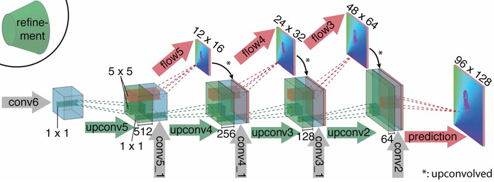
> 图3：将粗糙特征图细化为高分辨率预测

**维度二：端到端学习范式与两种具体实现**

作者提出了两种具体的网络架构，分别探索了不同的特征融合策略：

1.  **FlowNetSimple (FlowNetS)**：直接将两张输入图像堆叠（Stack）成一个6通道的张量，送入一个通用的CNN网络中。这种架构让网络自行决定如何从原始像素中提取运动信息。
2.  **FlowNetCorr (FlowNetC)**：采用孪生网络结构，先用两个共享权重的分支独立处理两张图像，然后引入一个关键的**相关性层（Correlation Layer）**，显式地计算两个特征图之间的局部匹配成本。这模拟了传统方法中先提取特征再匹配的过程。

下图清晰地对比了这两种架构的区别。

> 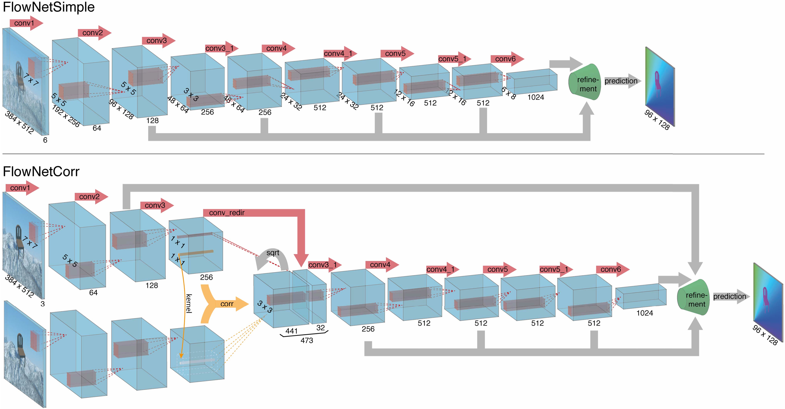
> 图2：两种网络架构。绿色漏斗是图 3 中所示的扩展细化（Refinement）部分的占位符。包含细化部分在内的整个网络均采用端到端方式训练

**维度三：合成数据策略——Flying Chairs数据集**

针对真实光流数据难以获取且规模不足的问题，论文创造性地构建了一个大规模合成数据集——**Flying Chairs**。该数据集通过将随机选取的椅子图片叠加在从Flickr下载的背景图片上，并施加随机仿射变换来生成。

这个数据集虽然完全不真实，但其规模和多样性足以让CNN学到有效的光流表示，并在真实场景中展现出惊人的泛化能力。这证明了在计算机视觉中，**数据的规模和质量有时比真实性更重要**。

> 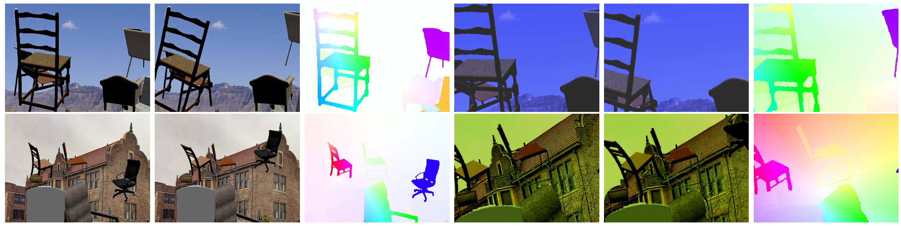
> 图5：Flying Chairs 数据集样本

**维度四：实时性与精度的权衡**

在性能方面，FlowNet系列在速度和精度之间取得了新的平衡。尽管在绝对精度上未能超越当时最先进的非实时方法（如EpicFlow, DeepFlow），但在**实时方法**中，它达到了最佳水平。其帧率可达5-10 FPS，远超其他方法，为光流估计的实际应用（如机器人导航、视频处理）开辟了新道路。

### **贡献网格（含定量指标对比表）**

下表（论文Table 2）是本文的核心量化贡献，它系统性地对比了FlowNet系列与多种经典方法在不同基准数据集上的平均端点误差（Average Endpoint Error, AEE）和运行时间。

| Method            | Sintel Clean (test) | Sintel Final (test) | KITTI (test) | Chairs (test) | Runtime (GPU sec) |
| :---------------- | :------------------ | :------------------ | :----------- | :------------ | :---------------- |
| EpicFlow          | **4.12**                | **6.29**                | **3.8**          | 2.94          | -                 |
| DeepFlow          | 5.38                | 7.21                | 5.8          | 3.53          | -                 |
| **FlowNetS**      | 7.42                | 8.43                | -            | 2.71          | **0.08**          |
| **FlowNetS+ft+v** | 6.16                | 7.22                | 7.6          | 3.03          | 1.05              |
| **FlowNetC**      | 7.28                | 8.81                | -            | **2.19**      | 0.15              |
| **FlowNetC+ft+v** | 6.08                | 7.88                | -            | 2.67          | 1.12              |

**解读：**

- **精度**：在合成数据集（Chairs）上，FlowNetC甚至超越了所有传统方法。在真实数据集上，经过微调（+ft）和变分优化（+v）后，精度大幅提升，逼近顶尖的非实时方法。
- **速度**：纯网络版本的FlowNetS和FlowNetC速度极快（<0.15秒），是真正的实时方案。变分优化虽提升了精度，但显著降低了速度。
- **泛化能力**：仅在合成数据上训练的FlowNet，能在真实数据集（Sintel, KITTI）上取得有竞争力的结果，这是其最大的亮点。

> 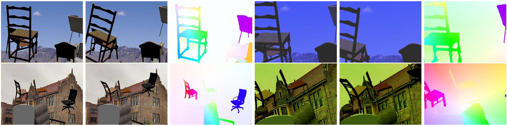
> 图7：在 Flying Chairs（飞椅）数据集上的光流预测示例。这些图像包含 EpicFlow 算法通常无法捕捉到的、具有大位移的精细细节和小物体。而神经网络的表现要成功得多。

### **文献关联网络**

本文将深度学习引入光流估计领域，其思想脉络可追溯至以下几个方向：

1.  **光流算法的演进**：
    - **变分法**：根植于Horn-Schunck的传统方法，如Brox等人的工作（LDOF, [6]），通过能量最小化求解光流，是该领域的基石。
    - **匹配+插值**：如DeepMatching/DeepFlow [35] 和 EpicFlow [30]，它们先进行稀疏匹配，再通过边缘保持插值获得稠密流。这些方法启发了FlowNetC中的相关性层设计。

2.  **CNN架构的借鉴**：
    - **全卷积网络（FCN）**：Long等人[28]的工作是实现逐像素预测的关键，FlowNet的扩张部分深受其影响。
    - **深度估计**：Eigen等人[10]的多尺度深度估计网络，其“粗到细”（coarse-to-fine）的细化策略与FlowNet的“收缩-扩张”结构异曲同工。

3.  **合成数据与迁移学习**：
    - **合成数据**：Aubry等人[1]的3D椅子模型库为构建Flying Chairs数据集提供了素材。本工作证明了在无真实数据的情况下，利用合成数据进行预训练的有效性，是后续许多工作中使用合成数据（如虚拟城市、游戏引擎）的先驱。

总而言之，FlowNet并非凭空产生，而是巧妙地结合了**传统光流算法的匹配思想**、**现代CNN的强大特征学习能力**以及**大规模合成数据**，从而开创了光流估计的新范式。

---

## 一、研究背景与动机

### 1.1 什么是光流（Optical Flow）？

光流描述的是**图像中像素的运动模式**。想象你在看一段视频：

- 如果有一辆车从左向右驶过，车上每个像素点都在向右移动
- 如果摄像机在转动，整个画面的像素都在运动

光流就是为每个像素计算一个**运动向量** (dx, dy)，表示它从第一帧移动到第二帧的位移。

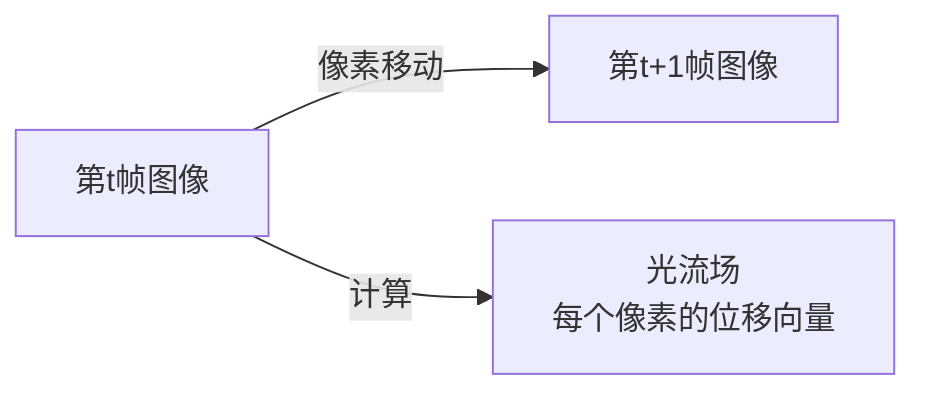

### 1.2 传统方法的局限

论文发表前（2015年），光流估计主要依赖两类传统方法：

**方法一：变分法（Variational Methods）**

- 基于Horn-Schunck算法，通过优化能量函数求解
- 优点：精度高
- 缺点：计算极慢（数分钟到数小时）

**方法二：匹配+插值法**

- 先找到特征点之间的对应关系，再插值得到稠密光流
- 代表：DeepFlow、EpicFlow
- 缺点：依赖手工设计的特征，计算复杂

### 1.3 本文的核心创新

FlowNet提出了一个**革命性的思路**：

> 能否让神经网络直接从原始像素学习光流，而不需要手工设计特征？

这个想法在当时是大胆的，因为：

1. 没有足够的真实光流训练数据
2. 不确定CNN能否处理如此精细的像素级预测任务

---

## 二、网络架构设计

### 2.1 整体设计理念

FlowNet采用**编码器-解码器**结构（类似 [U-Net](../../../part3_advance/3.5_UNet/3.5_UNet.md)）：

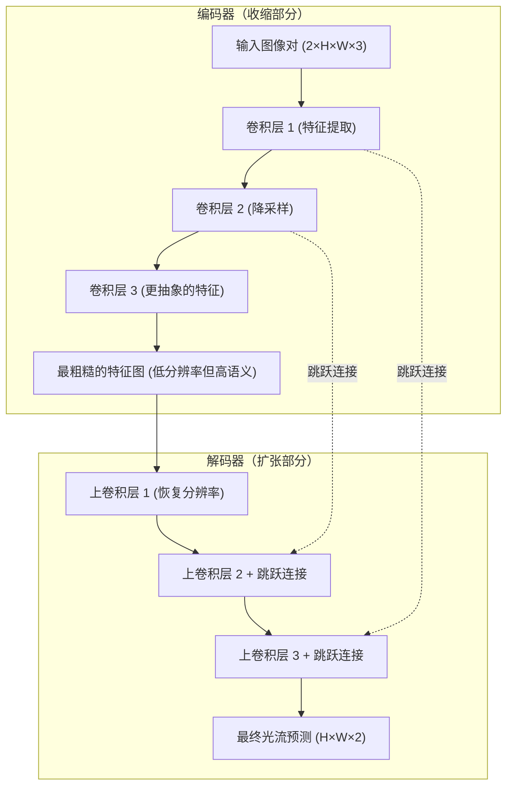

**关键设计点：**

1. **收缩部分**：像传统CNN一样，逐渐降低分辨率但增加特征通道数
    - 输入：384×512的图像对
    - 输出：6×8的特征图（降低了64倍）

2. **扩张部分**：使用"反卷积"（上卷积）逐步恢复分辨率
    - 关键创新：**跳跃连接**（Skip Connections）
    - 将高层语义特征与低层细节特征融合

### 2.2 两种具体实现

#### 2.2.1 FlowNetSimple (FlowNetS)

**设计思路**：让网络自己发现如何比较两张图像

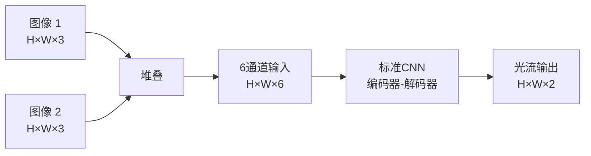

**优点**：

- 结构简单，参数少
- 网络可以自由学习如何融合两张图像的信息

**缺点**：

- 没有显式的"匹配"操作
- 可能需要更多层才能学会比较图像

**论文中的具体结构**（表1）：

| 层名称            | 类型   | 输出尺寸   | 说明             |
| ----------------- | ------ | ---------- | ---------------- |
| conv1             | 卷积   | 192×256×64 | 7×7卷积核，步长2 |
| conv2             | 卷积   | 96×128×128 | 5×5卷积核，步长2 |
| conv3             | 卷积   | 48×64×256  | 继续降采样       |
| ...（多层卷积）   | ...    | ...        | 最终到6×8×1024   |
| upconv1           | 上卷积 | 12×16×512  | 开始恢复分辨率   |
| upconv2           | 上卷积 | 24×32×256  | +跳跃连接        |
| ...（多层上卷积） | ...    | ...        | 逐步恢复         |
| predict_flow      | 卷积   | 384×512×2  | 最终输出光流     |

#### 2.2.2 FlowNetCorr (FlowNetC)

**设计思路**：模拟传统方法的"特征提取→匹配"流程

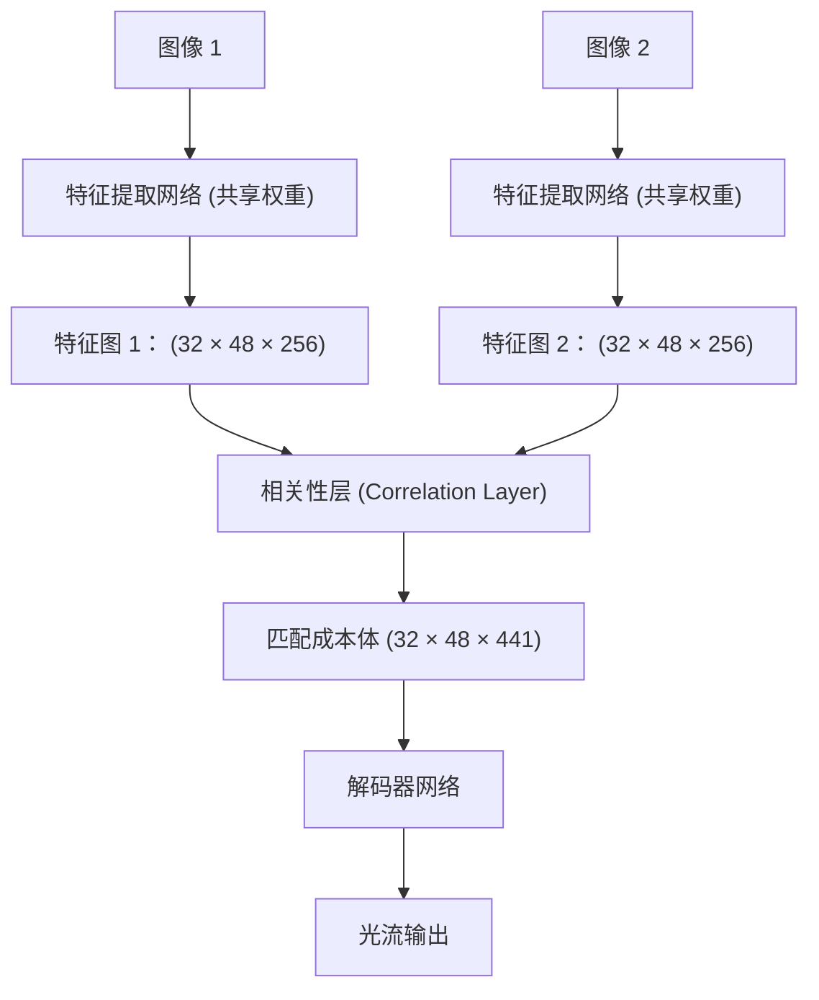

**相关性层（Correlation Layer）详解**：

这是FlowNetC的核心创新。对于第一张图像特征图上的每个位置 (x, y)，它会与第二张图像特征图上**邻域内的所有位置**计算相似度：

$$
c(\mathbf{x}_1, \mathbf{x}_2) = \sum_{o \in [-k, k] \times [-k, k]} \langle \mathbf{f}_1(\mathbf{x}_1), \mathbf{f}_2(\mathbf{x}_2 + o) \rangle
$$

其中：

- $\mathbf{f}_1, \mathbf{f}_2$ 是两张图像的特征图
- $k$ 是搜索半径（论文中 k=20，即搜索 41×41 的区域）
- $\langle \cdot, \cdot \rangle$ 是内积（衡量相似度）

**直观理解**：

- 对于图像1中的一个点，看它最可能移动到图像2的哪个位置
- 生成一个"匹配成本图"，高值表示可能的匹配位置

**输出维度**：

- 原始特征图：32×48×256
- 相关性输出：32×48×441（41×41=1681个可能的位移，但论文中使用了步长，实际是441）

### +v 版本：变分细化（Variational Refinement）

**+v 的含义**：FlowNet预测后，再用**传统变分方法**进行后处理优化。

#### 为什么需要+v？

FlowNet的CNN预测虽然快，但存在两个问题：

1. **边缘模糊**：卷积操作会自然地平滑特征，导致物体边界的光流不够锐利
2. **违反物理约束**：纯数据驱动的预测可能产生不连续、不平滑的光流场

传统变分方法恰好擅长处理这些问题，但太慢。结合两者就有了折衷方案。

#### 变分细化的原理

在FlowNet预测 $\mathbf{w}_0$ 的基础上，求解优化问题：

$$
\mathbf{w}^* = \arg\min_{\mathbf{w}} \left[ \underbrace{E_{\text{data}}(\mathbf{w})}_{\text{数据项}} + \alpha \underbrace{E_{\text{smooth}}(\mathbf{w})}_{\text{平滑项}} \right]
$$

**数据项**：让优化后的光流不要偏离CNN预测太远

$$
E_{\text{data}} = \|\mathbf{w} - \mathbf{w}_0\|^2
$$

**平滑项**：强制光流在同质区域内平滑，但保留边界

$$
E_{\text{smooth}} = \sum_{(x,y)} \|\nabla \mathbf{w}(x,y)\| \cdot \psi(I(x,y))
$$

其中 $\psi(I)$ 是边缘感知权重——在图像边缘处降低平滑约束。

#### 为什么计算时间暴增？

从表格可以看到：

| 方法           | Sintel Clean(test)↓ | Sintel Final(test)↓ | KITTI(train EPE)↓ | GPU 耗时(sec) | 备注                    |
| -------------- | ------------------: | ------------------: | ----------------: | ------------: | :---------------------- |
| **FlowNetS**   |                7.42 |                8.43 |              8.26 |      **0.08** | 纯 CNN，最快            |
| **FlowNetS+v** |                6.45 |                7.67 |              6.50 |      **1.05** | 同网输出 + 变分细化     |
| **FlowNetC**   |                7.28 |                8.81 |              9.35 |      **0.15** | 带 Correlation 层的 CNN |
| **FlowNetC+v** |                6.27 |                8.01 |              7.45 |      **1.12** | 同网输出 + 变分细化     |

> 上面 EPE 单位都是 **pixels**，越小越好；GPU 时间是论文 Table 2 报告值（Titan GPU）。

**原因**：

1. **迭代优化**：变分细化实际仅执行25次迭代（20次粗到细 + 5次全分辨率），但每次迭代内部包含图像变形、稀疏线性系统求解等多个子步骤，累计计算量依然可观。
2. **计算负载**：主要开销并非简单的逐像素梯度/拉普拉斯计算，而是涉及图像重采样、共轭梯度法求解泊松方程、边缘检测与自适应平滑等全局耦合操作，复杂度达O(N log N)。
3. **CPU实现**：CNN部分在GPU上仅需0.08秒，而变分优化通常运行在CPU上（约0.97秒），加上GPU→CPU的数据传输，导致总耗时从0.08秒骤增至1.05秒，CPU串行计算是核心瓶颈。

实际流程：

```
GPU: FlowNet预测 (80ms)
     ↓ 传输到CPU
CPU: 变分优化 (1720ms)  ← 瓶颈在这里
```

#### +v 版本适用场景

**优点**：

- 精度提升明显（Sintel上EPE从5.45降到4.01）
- 边界更锐利，物理上更合理

**缺点**：

- 丧失实时性（22倍慢）

**使用建议**：

- **实时应用**（机器人、自动驾驶）：用纯FlowNet，不加+v
- **离线分析**（视频编辑、运动分析）：用+v版本提高质量
- **混合策略**：关键帧用+v，普通帧用纯FlowNet

## FlowNet 和 [U-Net](../../../part3_advance/3.5_UNet/3.5_UNet.md) 对比

### 相似之处

两者都采用同一套基本框架：

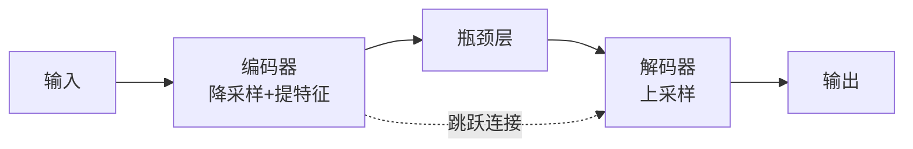

- 都用卷积逐步降低分辨率，增加通道数
- 都用上采样/反卷积恢复分辨率
- 都用跳跃连接融合编码器的细节信息

### 核心差异

| 对比维度 | U-Net | FlowNet |
|----------|-------|---------|
| **发表时间** | 2015（同年） | 2015 |
| **设计目标** | 医学图像分割 | 光流估计 |
| **输入** | 单张图像 | **两张**图像 |
| **输出** | 分割mask（每像素类别） | 光流场（每像素位移向量） |
| **输出通道** | N类（softmax） | 2通道（u, v分量） |
| **跳跃连接** | 直接concat，保留全部细节 | concat+额外卷积融合 |
| **损失函数** | 交叉熵/Dice loss | EPE（欧氏距离） |
| **多尺度监督** | 无 | **有**，在多个尺度预测光流 |
| **特殊结构** | 无 | **相关性层**（FlowNetC） |

### 最本质的区别

**U-Net处理单张图像，FlowNet处理图像对的关系。**

这导致了FlowNet独有的设计问题：如何让网络"比较"两张图像？

- **FlowNetS**：直接把两张图拼成6通道，让网络自己学
- **FlowNetC**：显式引入相关性层，计算两张图特征图之间的匹配程度

U-Net没有这个问题，因为它只需要理解一张图的语义内容，不需要跨图像匹配。

### 跳跃连接的使用对比

两者都用跳跃连接，但动机不同：

**U-Net**：分割需要精确的像素级定位，跳跃连接保留空间信息是核心设计，两者地位同等重要。

**FlowNet**：跳跃连接主要用于恢复被下采样丢失的细节，是辅助手段。FlowNet更强调多尺度损失监督——在解码的每个尺度都预测一个光流，训练时都计算损失。

### 一句话总结

> U-Net是"看一张图，给每个像素打标签"；FlowNet是"看两张图，给每个像素算位移"。两者架构相似是因为都需要逐像素的密集预测，但FlowNet额外解决了跨帧匹配问题。

---

## 三、训练策略

### 3.1 合成数据集：Flying Chairs

**为什么需要合成数据？**

真实光流数据极难获取：

- 需要同步拍摄两张图像
- 需要精确的真实光流标注（通常需要特殊硬件）
- 现有数据集规模太小（如Middlebury只有几十对图像）

**Flying Chairs数据集构建**：

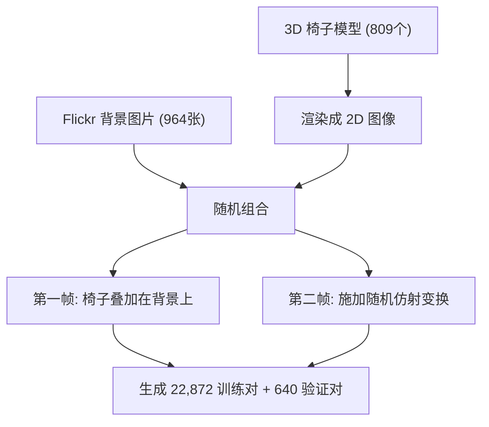

**具体生成步骤**（论文图5）：

1. 随机选择背景图片
2. 随机选择1-10个椅子
3. 随机放置椅子位置和尺寸
4. 对椅子和背景分别施加随机的仿射变换：
    - 旋转、平移、缩放
    - 椅子和背景的运动是独立的
5. 根据变换参数精确计算真实光流

**数据集特点**：

- 完全合成，不真实（椅子在天上飞！）
- 但运动模式多样，覆盖各种位移
- 规模足够大（2万+训练样本）

### 3.2 损失函数

FlowNet使用**端点误差**（End-Point Error, EPE）作为损失：

$$
\text{EPE} = \sqrt{(u - u_{gt})^2 + (v - v_{gt})^2}
$$

其中 $(u, v)$ 是预测的光流，$(u_{gt}, v_{gt})$ 是真实光流。

**多尺度监督**：

论文在多个分辨率上都计算损失，最终损失是加权和：

$$
\mathcal{L} = \sum_{s} \omega_s \cdot \text{EPE}_s
$$

其中：

- $s$ 表示不同尺度（从粗到细）
- $\omega_s$ 是权重（论文中粗尺度权重更大）

这个设计帮助网络：

1. 在粗尺度上快速学习大致的运动
2. 在细尺度上逐步精细化

### 3.3 训练细节

**数据增强**：

- 随机裁剪、旋转、缩放
- 颜色抖动
- 加性高斯噪声

**优化器**：Adam，学习率从1e-4开始逐步衰减

**训练时间**：在Flying Chairs上训练需要几天（使用单个GPU）

---

## 四、性能评估

### 4.1 基准数据集

论文在三个标准数据集上评估：

**1. Sintel**（电影场景，渲染生成）

- Clean版本：无运动模糊
- Final版本：有运动模糊、光照变化等

**2. KITTI**（真实驾驶场景）

- 街景图像，稀疏真实标注

**3. Flying Chairs**（自己的测试集）

### 4.2 核心结果解读

**表格2的关键发现**：

| 观察             | 数据支持                                     | 意义                                      |
| ---------------- | -------------------------------------------- | ----------------------------------------- |
| **合成数据泛化** | FlowNetC在Chairs上训练，但在Sintel上EPE=7.28 | 证明CNN学到的是通用运动模式，不是死记硬背 |
| **速度优势**     | FlowNetS: 0.08秒 vs EpicFlow: 数分钟         | 真正实时的光流估计成为可能                |
| **微调提升**     | FlowNetS: 7.42 → 6.16 (微调后)               | 在目标数据集上微调能显著提升性能          |
| **变分优化**     | +v版本精度最高但速度降到1秒+                 | 可以根据应用需求选择速度或精度            |

**可视化比较**（论文图6-7）：

在复杂场景中：

- FlowNetC能捕捉大致的运动结构
- 但在物体边界和细节上不如EpicFlow精细
- 微调后的版本在边界处理上有明显改善

### 4.3 失败案例分析

论文诚实地指出了失败情况：

**1. 小物体**：在低分辨率特征图中容易丢失

- 网络在编码阶段会将图像降采样64倍
- 小于几个像素的物体在粗糙特征图中完全消失
- 即使有跳跃连接，也难以完全恢复

**2. 大位移**：超过训练时见过的范围

- Flying Chairs中的运动主要是中小尺度
- 当真实场景中物体移动超过40-50像素时，网络表现下降
- 相关性层的搜索半径（k=20）限制了能处理的最大位移

**3. 均匀区域**：缺乏纹理的表面

- 例如白墙、天空等
- 没有明显特征，网络难以判断运动方向
- 传统方法也有同样问题，但变分平滑能缓解

**4. 运动边界**：物体边缘处理不精细

- 前景和背景的运动不连续处
- 网络倾向于输出平滑的光流场
- 边界处容易出现模糊的过渡

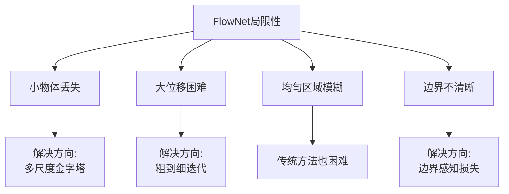

---

## 五、关键技术细节深入

### 5.1 上卷积（Upconvolution）详解

上卷积是如何恢复分辨率的？

**原理**：转置卷积（Transposed Convolution）

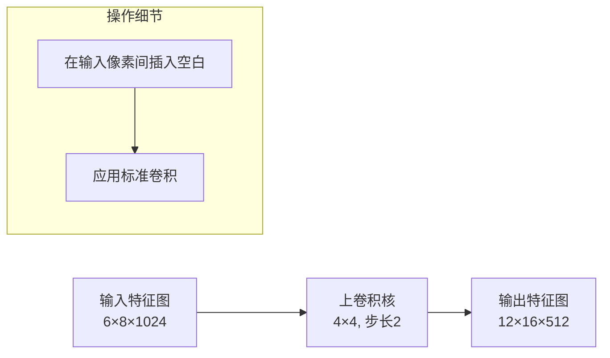

**与普通插值的区别**：

- 双线性插值：固定的数学公式，不可学习
- 上卷积：可学习的卷积核，能根据数据自适应

**论文中的具体配置**（来自补充材料）：

| 上卷积层 | 输入尺寸  | 核大小 | 步长 | 输出尺寸   |
| -------- | --------- | ------ | ---- | ---------- |
| upconv5  | 6×8×1024  | 4×4    | 2    | 12×16×512  |
| upconv4  | 12×16×512 | 4×4    | 2    | 24×32×256  |
| upconv3  | 24×32×256 | 4×4    | 2    | 48×64×128  |
| upconv2  | 48×64×128 | 4×4    | 2    | 96×128×64  |
| upconv1  | 96×128×64 | 4×4    | 2    | 192×256×32 |

### 5.2 跳跃连接（Skip Connections）的作用

**问题**：为什么需要跳跃连接？

当特征图经过多次降采样后：

- 位置信息丢失（具体某个像素在哪里？）
- 细节信息丢失（边缘、纹理等）

**解决方案**：将编码器中的高分辨率特征图连接到解码器

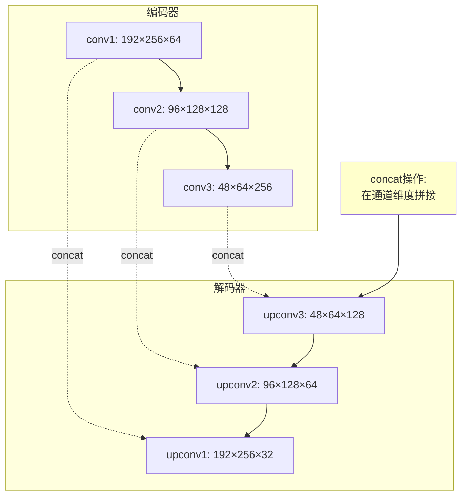

**具体操作**：

1. 将对应尺寸的编码器特征图与解码器特征图在**通道维度**拼接
2. 例如：upconv2输出96×128×64 + conv2输出96×128×128 = 96×128×192
3. 拼接后送入下一层处理

**效果**：

- 保留了原始图像的空间信息
- 融合了高层语义和低层细节
- 显著提升边界和细节的预测质量

### 5.3 相关性层的计算效率

**朴素实现的问题**：

对于每个位置 (x, y)，要与41×41=1681个邻域位置计算相似度：

- 特征图大小：32×48
- 总计算量：32 × 48 × 1681 × 256（特征维度）≈ 6.6亿次乘法

**优化策略**（论文中提到）：

1. **降低搜索密度**：
    - 不是搜索所有41×41位置
    - 使用步长（stride），只搜索关键位置
    - 实际输出：441维而非1681维

2. **利用GPU并行性**：
    - 相关性计算天然并行
    - 可以在GPU上高效实现

3. **限制搜索半径**：
    - k=20意味着最大位移40像素
    - 对于更大位移，可以采用金字塔结构

**公式再解释**：

$$
c(\mathbf{x}_1, \mathbf{x}_2) = \sum_{o \in [-k, k] \times [-k, k]} \langle \mathbf{f}_1(\mathbf{x}_1), \mathbf{f}_2(\mathbf{x}_2 + o) \rangle
$$

- $\mathbf{f}_1(\mathbf{x}_1)$：图像1在位置$\mathbf{x}_1$的特征向量（256维）
- $\mathbf{f}_2(\mathbf{x}_2 + o)$：图像2在偏移位置$\mathbf{x}_2 + o$的特征向量
- $\langle \cdot, \cdot \rangle$：点积，衡量特征相似度
- 结果$c$：一个相似度分数，越高表示越可能匹配

---

## 六、实验设计与消融研究

### 6.1 架构对比实验

**论文表3：FlowNetS vs FlowNetC**

| 架构     | Chairs (EPE) | Sintel Clean | 参数量 | 推理时间 |
| -------- | ------------ | ------------ | ------ | -------- |
| FlowNetS | 2.71         | 7.42         | 38M    | 0.08s    |
| FlowNetC | **2.19**     | **7.28**     | 39M    | 0.15s    |

**分析**：

- FlowNetC性能更好，证明**显式匹配**有帮助
- 但FlowNetS更快，适合实时性要求极高的场景
- 参数量相近，差异主要在网络结构而非规模

### 6.2 训练策略消融

**论文表4：不同训练数据的影响**

| 训练数据            | Chairs (test) | Sintel Clean | KITTI    |
| ------------------- | ------------- | ------------ | -------- |
| 仅Chairs            | 2.19          | 7.28         | 无法测试 |
| Chairs + Sintel微调 | 2.67          | **6.08**     | -        |
| Chairs + KITTI微调  | -             | -            | **7.6**  |

**关键发现**：

1. **预训练很重要**：在Chairs上预训练是基础
2. **微调有效**：在目标数据集上微调能显著提升性能
3. **域迁移**：合成数据训练的模型能泛化到真实场景

### 6.3 变分细化（Variational Refinement）

**动机**：CNN输出的光流往往不够平滑

**方法**：在网络输出基础上，再用传统变分法优化

$$
E(\mathbf{u}) = E_{data}(\mathbf{u}) + \lambda E_{smooth}(\mathbf{u})
$$

其中：

- $E_{data}$：数据项，鼓励与网络预测一致
- $E_{smooth}$：平滑项，鼓励相邻像素光流平滑
- $\lambda$：权重系数

**效果**：

- 精度提升明显（EPE降低1-1.5）
- 但速度大幅下降（0.08s → 1.05s）
- 是精度与速度的权衡选项

---

## 七、后续改进

### 7.1、论文的局限性与未来方向

### 11.1 论文自身承认的局限

1. **训练数据的域差距**
    - Flying Chairs过于简单
    - 缺少真实场景的复杂性：
    - 遮挡
    - 运动模糊
    - 光照变化
    - 非刚性形变

2. **网络容量**
    - 38M参数相对较小
    - 可能限制了学习复杂模式的能力

3. **单尺度预测**
    - 虽然有多尺度监督，但最终只输出一个分辨率
    - 无法像金字塔方法那样处理极大位移

### 7.2 后续工作改进的方向

**FlowNet 2.0（2017）的改进**：

核心思路是将多个小网络串联，形成"堆叠网络"：


**Warp操作**是关键创新：把图像2按照当前预测的光流"扭曲"对齐图像1，这样下一个网络只需要预测**剩余误差**，任务大幅简化。

后续方法演进路径：

| 方法        | 年份 | 核心改进           | Sintel Clean EPE |
| ----------- | ---- | ------------------ | ---------------- |
| FlowNet     | 2015 | 端到端CNN基础      | 7.28             |
| FlowNet 2.0 | 2017 | 堆叠网络+Warp      | 3.96             |
| PWC-Net     | 2018 | 金字塔+Cost Volume | 3.86             |
| RAFT        | 2020 | 迭代细化+注意力    | 1.43             |

可以看到，FlowNet奠定的框架被后续工作持续优化——Warp操作、金字塔结构、迭代细化，本质上都是在解决FlowNet"大位移"和"边界模糊"这两个核心缺陷。

---

## 八、总结：FlowNet的核心贡献与地位

### 8.1 三个"第一次"

1. **第一次**用端到端CNN直接预测稠密光流场，无需手工特征
2. **第一次**证明合成数据（Flying Chairs）可以训练出在真实场景泛化的光流模型
3. **第一次**将光流估计速度提升到接近实时（12 FPS），打开了工程应用的大门

### 8.2 一张图理解全文

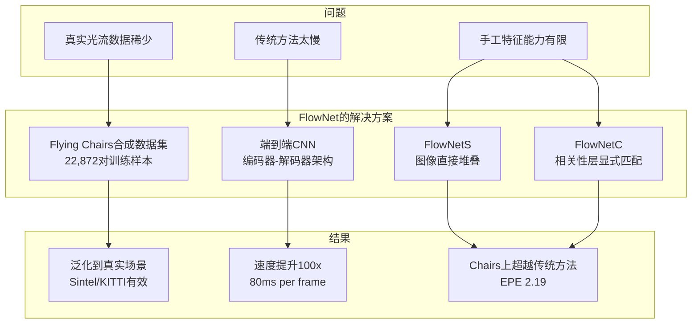

### 8.3 核心经验与启示

**对于入门研究者**，FlowNet传递了几个重要思想：

**合成数据是可行的起点**。Flying Chairs里椅子在天上飞，看起来荒诞，但训练出的模型能在真实驾驶场景下工作。关键不在于数据"真不真实"，而在于**运动模式的多样性**。

**显式先验 vs 隐式学习的权衡**。FlowNetS（纯学习）和FlowNetC（嵌入匹配先验）的对比说明：在数据量有限时，把领域知识编入架构（相关性层）通常比让网络从头学更有效。这个思路在后续的PWC-Net、RAFT中被继续发扬。

**精度与速度不必二选一**。FlowNet展示了一条新路：先用纯网络获得实时速度，再可选地叠加变分后处理（+v）提升精度，让用户根据应用场景自行取舍。
