# MeshGraphNets：面向网格物理仿真的图神经网络模拟器

> **上传者**：[XYChouMian](https://github.com/XYChouMian)  
> **论文标题**：[Learning Mesh-Based Simulation with Graph Networks](https://iclr.cc/virtual/2021/spotlight/3542)  
> **论文PDF**：[paper.pdf](paper.pdf)  
> **GitHUb 仓库**：[echowve/meshGraphNets_pytorch](https://github.com/echowve/meshGraphNets_pytorch)  
> **阅读时间**：2026-9-9

---

## 论文 DNA（一句话精髓）

**MeshGraphNets 将传统 CAE 中的 simulation mesh 转换为包含 mesh-space 拓扑边与 world-space 空间交互边的双空间图结构，通过 Encode–Process–Decode 消息传递学习物理时间推进算子，并结合可学习 sizing field 实现动态网格模拟，从而在布料、弹性体以及流体等多类物理系统中实现高精度、长时间稳定的神经网络模拟。**

---

## 论文精髓快速阅读

**论文DNA**：MeshGraphNets 通过在网格空间与世界空间双通道图神经网络消息传递并结合可学习的 sizing-field 自适应重网格，实现跨布、结构、不可压/可压流体等网格仿真的高精度、分辨率无关与1–2个数量级加速。

### 一、知识向量（5维摘要，已做图文语义锚定）

**1）双空间编码与Encode–Process–Decode消息传递**

模型将仿真网格转为多图 $G=(V,E^M,E^W)$：网格边 $E^M$ 传递内部微分算子近似，拉格朗日系统另按固定半径 $r_W$ 建世界边 $E^W$ 处理碰撞/接触等非局部作用；节点特征仅用相对位移 $u_{ij},x_{ij}$ 及其模长，保证空间等变。处理器 $L$ 个块更新 $e^M,e^W,v$，解码器输出导数经前向欧拉积分得 $q^{t+1}$。整体架构与双空间示意如下：

> 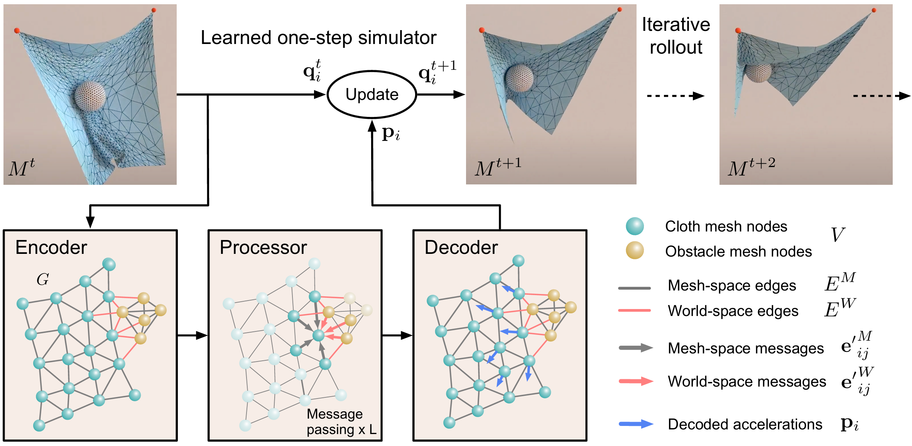  
> **图1**：MESHGRAPHNETS总体架构图，展示Encoder将网格转为含mesh/world边的多图、Processor多层消息传递、Decoder输出并接积分器更新网格状态

> 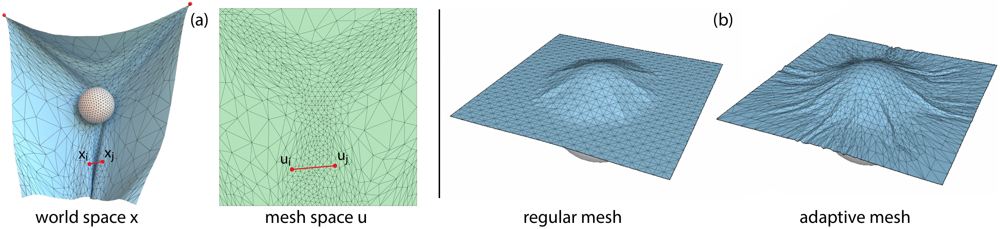  
> **图3a**：网格空间坐标u与三维世界空间坐标x映射示意，以及mesh边与世界边在流形上的消息传递路径，说明内部动力学与外部碰撞分别建模  
> **图3b**：自适应三角网格示例，展示翼型尖端/布料高曲率区细划、平缓区粗划的sizing场与边缘长度分布

**2）自适应重网格与可学习sizing field**  
采用各向异性sizing张量 $S(u)\in\mathbb R^{2\times2}$，以 $u_{ij}^TS_iu_{ij}\le1$ 判定边合法性；用通用局部重网格器做split/flip/collapse。sizing本身由同一GNN解码预测，测试时 $M^{t+1}=\mathcal R(\hat M^{t+1},\hat S^{t+1})$，避免调用领域专用求解器。自适应收益与曲率/梯度加密示意：

**3）多物理实验域覆盖（布、超弹性、NS）**  
涵盖拉格朗日（FLAG/SPHERE布、DEFORMINGPLATE超弹性四面体）与欧拉（CYLINDERFLOW不可压、AIRFOIL可压）系统；输入/输出按一阶动量、二阶加速度、应力/压力分置，数据来自ArcSim/SU2/COMSOL。各域网格与PDE类型对照：

> 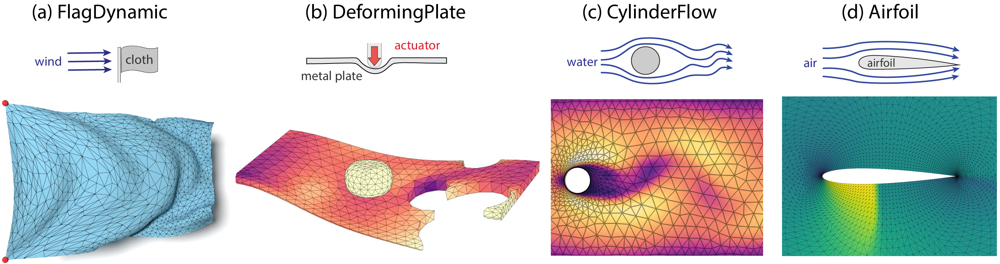
> 图2：四类/六数据集物理系统概览图，包含布料旗、球布接触、超弹性板、圆柱不可压流、翼型可压流等网格形态与场变量示意
> **（按复合图处理：a布类、b结构、c不可压、d可压）**

**4）精度与基线对比（GNS/GCN/UNet）**  
在FLAGSIMPLE上GNS因无静止态与mesh边误差累积失稳，GNS+mesh-pos可降误但出现三角形纠缠；纯mesh空间无world边在SPHERE/FLAG误差分别升51%/92%。AIRFOIL上GCN/GCN-MLP无法稳定展开，无相对编码RMSE达26.5；CYLINDER/AIRFOIL上UNet对尾迹/翼尖欠采样。量化误差与可视化对照：

> 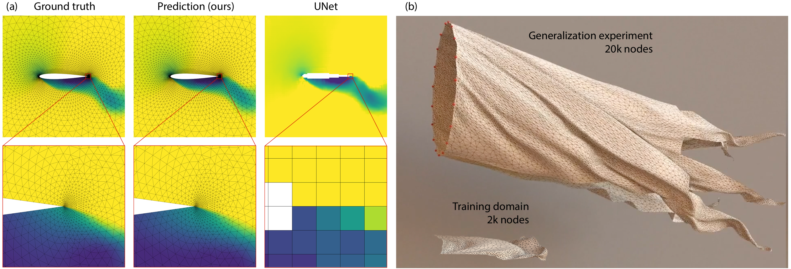
> 图4：定性rollout图，含(a)AIRFOIL近场速度/压力与UNet对比突出尾迹分辨率，(b) windsock大尺度泛化可视化

> 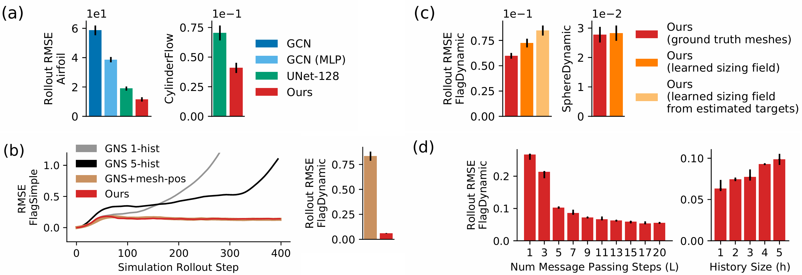
> 图5：结果对比图，含(a)GCN/UNet/MGN的AIRFOIL与CYLINDER RMSE柱状，(b)GNS系列布料rollout误差与解相干曲线，(c)学习重网格与真值网格误差，(d)消息块数/历史长度超参曲线

**5）效率、泛化与尺度外推**  
单V100下 $t_{\mathrm{model}}$ 19–43ms/步、$t_{\mathrm{full}}$ 含重网格最高837ms/步，较GT求解器快11–289倍；相对编码使角度/马赫/形状外推仅微增RMSE（AIRFOIL陡角11.5→12.4、高速11.5→13.1）；矩形布训练可推fish flag与2万节点windsock。计时与全轨迹误差：

> 表1：六数据集节点数、步数、$t_{\mathrm{model}}$/$t_{\mathrm{full}}$/$t_{\mathrm{GT}}$及1步/50步/全轨迹RMSE，原文性能主表

| Dataset        | # nodes (avg.) | # steps | $\mathbf{t_{model}}$ ms/step | $\mathbf{t_{full}}$ ms/step | $\mathbf{t_{GT}}$ ms/step | RMSE 1-step $\times 10^{-3}$ | RMSE rollout-50 $\times 10^{-3}$ | RMSE rollout-all $\times 10^{-3}$ |
| -------------- | -------------- | ------- | ---------------------------- | --------------------------- | ------------------------- | ---------------------------- | -------------------------------- | --------------------------------- |
| FlagSimple     | 1579           | 400     | 19                           | 19                          | 4166                      | $1.08 \pm 0.02$              | $92.6 \pm 5.0$                   | $139.0 \pm 2.7$                   |
| FlagDynamic    | 2767           | 250     | 43                           | 837                         | 26199                     | $1.57 \pm 0.02$              | $72.4 \pm 4.3$                   | $151.1 \pm 5.3$                   |
| SphereDynamic  | 1373           | 500     | 32                           | 140                         | 1610                      | $0.292 \pm 0.005$            | $11.5 \pm 0.9$                   | $28.3 \pm 2.6$                    |
| DeformingPlate | 1271           | 400     | 24                           | 33                          | 2893                      | $0.25 \pm 0.05$              | $1.8 \pm 0.5$                    | $15.1 \pm 4.0$                    |
| CylinderFlow   | 1885           | 600     | 21                           | 23                          | 820                       | $2.34 \pm 0.12$              | $6.3 \pm 0.7$                    | $40.88 \pm 7.2$                   |
| Airfoil        | 5233           | 600     | 37                           | 38                          | 11015                     | $314 \pm 36$                 | $582 \pm 37$                     | $11529 \pm 1203$                  |

> 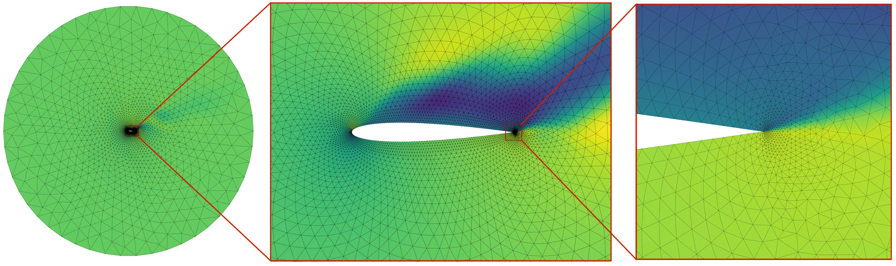
> **图A.1**：（根据附录推断）AIRFOIL兴趣区ROI与网格密度对照，说明UNet同等画布下尾迹欠采样

> 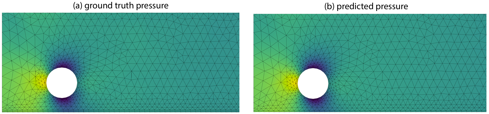
> **图A.3**：（根据附录推断）FLAGDYNAMIC按系统规模缩放及windsock/fishflag泛化RMSE曲线，显示50步误差不随尺寸系统增长

### 二、贡献网格（量化对比+图表锚定）

| 维度             | MESHGRAPHNETS         | 主要基线              | 关键量化结果                                                      | 优势机制                             |
| ---------------- | --------------------- | --------------------- | ----------------------------------------------------------------- | ------------------------------------ |
| 不规则网格动力学 | 双空间图消息          | GNS（纯世界半径图）   | FLAGSIMPLE 1步RMSE 1.08e-3；GNS失稳、GNS+pos易纠缠                | mesh边+相对u编码→分辨率无关          |
| 自适应分辨率     | 学习sizing+通用重网格 | GT固定/手工重网格序列 | FLAGDYNAMIC/SPLERE与真值rollout误差持平（图5c），省领域remesher   | 仅学S，测试端通用split/collapse/flip |
| 欧拉流场         | mesh-GNN一阶动量/密度 | UNet 128×128、GCN     | AIRFOIL 1步RMSE 314e-3、全轨11529e-3优于UNet；CYLINDER 1步2.34e-3 | 非均匀网格聚焦翼尖/柱后尾迹          |
| 架构表达         | 边消息+LayerNorm MLP  | GCN无边消息           | AIRFOIL无相对编码RMSE 26.5；GCN rollout不稳                       | 边级相对特征学局部PDE算子            |
| 效率/泛化        | 单GPU推理+大步长      | COMSOL/SU2/ArcSim CPU | GPU加速11–289×；windsock~20k节点零样本可滚                        | 相对编码+不规则训练促尺度无关        |

【图5：上表“不规则/自适应/欧拉/架构”四项结论的综合误差与可视化来源，重点看(a)(b)(c)子图】  
【表1：上表所有ms/步与RMSE数值的底层来源，左半计时右半误差】

### 三、文献关联网络（浓缩）

- 图神经网络物理仿真谱系：Battaglia等GraphNet/关系归纳偏置 → Sanchez-Gonzalez GNS（粒子）←本文引为无mesh对照；本文用其Encode-Process-Decode、训练噪声与相对编码思想，但把节点图改为mesh+world多边图。
- 网格/几何深度学习：Bronstein几何DL、MeshCNN、PolyGen偏形状处理；本文转“物理预测+自适应”，区别于纯几何。
- 可微求解器混合法：Belbute-Peres GCN+可微气动求解器做超分辨稳态；本文无求解器在环、扩展至动态rollout与非稳态NS。
- 自适应网格理论：Narain各向异性sizing与布仿真重网格、Wicke弹性重网格；本文用sizing tensor+MINIDISK估计标签，通用重网格器替代领域启发式。
- 网格CNN对照：Thürey UNet气动RANS、Guo/ Bhatnagar规则网格流场；本文证明其非均匀PDE场劣于mesh-GNN。

---

## 一、MeshGraphNets 的核心思想：为什么需要基于 Mesh 的图神经网络模拟器

### 1.1 Mesh 在 CAE 中的作用：从几何离散到物理离散

MeshGraphNets 的研究对象是 mesh-based simulation，即基于网格的物理仿真。理解这篇论文的关键，并不是先理解 GNN，而是首先理解作者为什么认为 **mesh 是一种比普通数据结构更适合表达物理系统的表示形式**。

在传统 CAE 中，连续物理问题通常由偏微分方程（Partial Differential Equation, PDE）描述：

$$
\frac{\partial q}{\partial t}=F(q)
$$

其中 \(q\) 表示连续空间中的物理状态，例如结构力学中的位移场、流体中的速度和压力场。由于计算机无法直接处理连续域：

$$
\Omega \subset R^d
$$

因此需要通过空间离散化，将连续问题转换为有限自由度问题：

$$
\Omega\rightarrow \{v_i\}_{i=1}^{N}
$$

其中 \(v_i\) 表示 mesh 节点。

但是，mesh 的意义并不仅仅是将连续空间划分成有限个点。传统数值方法真正依赖的是 mesh 中蕴含的**离散物理结构**。例如有限元方法中，节点之间是否存在相互作用，并不是由节点之间的欧氏距离决定，而是由单元连接关系（element connectivity）决定。

对于离散后的物理系统，一个节点 \(i\) 的状态变化通常可以表示为：

$$
F_i=\sum_j F_{ij}
$$

这里的 \(j\) 表示与节点 \(i\) 存在离散物理联系的节点。这个邻居关系来自 mesh topology，而不是简单意义上的空间最近邻。因此，一个 CAE mesh 实际上同时包含了两类信息：

* **几何信息（geometry）**：描述物体的空间形状、节点位置以及边界结构；
* **拓扑信息（topology）**：描述节点、边、单元之间的连接关系，并决定离散物理作用如何传播。

这一区别对于学习型模拟器非常重要。因为神经网络如果只看到节点坐标，它只能知道“点在哪里”；但传统求解器需要知道“哪些点之间存在物理关系”。MeshGraphNets 的核心思想，就是保留 mesh 中这种由拓扑定义的物理先验，将 mesh 转换为 graph，让图神经网络直接学习 mesh 上的物理演化过程。

从这个角度看，MeshGraphNets 并不是简单地“把 GNN 用于 mesh”，而是在重新定义神经网络模拟器的数据结构：输入不再是规则数组，而是一个具有物理含义的离散空间。

### 1.2 为什么 Grid-based Neural Simulator 难以处理 Mesh Simulation

在 MeshGraphNets 之前，许多神经网络物理模拟方法借鉴计算机视觉领域的成功经验，将物理场转换为规则 grid，并使用 CNN 或 UNet 进行预测。这类方法的基本假设是：空间中的邻接关系可以由固定窗口表示。

对于规则网格：

$$
X\in R^{H\times W\times C}
$$

每一个位置都有固定的邻居。例如二维卷积中的 \(3\times3\) kernel 默认认为中心位置的信息主要来自周围固定范围内的元素。这种假设对于图像非常有效，因为像素之间的关系由规则空间决定。

然而，工程仿真中的 mesh 通常并不是规则采样，而是根据物理需求生成的非均匀离散结构。例如在 CFD 中，翼型附近存在边界层、高速度梯度和复杂涡结构，需要大量节点捕获局部变化；而远离翼型的区域流场变化缓慢，可以使用较粗网格。因此，高质量 mesh 通常具有明显的空间分辨率差异：

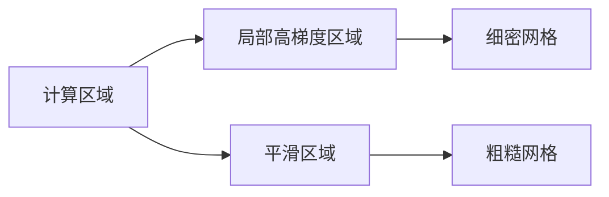

这种自适应分辨率是 mesh 方法的重要优势。如果将 mesh 强制转换为固定大小 grid，就必须让整个计算区域共享统一分辨率：

$$
H\times W
$$

这会导致两个问题。首先，固定分辨率难以同时满足不同区域的精度需求：物理变化剧烈的区域可能因为采样不足而损失细节，而变化平缓区域则会因为过高分辨率产生大量冗余计算。其次，插值过程会破坏原始 mesh 的离散结构，使网络接收到的数据已经不是求解器实际使用的物理表示。

更深层的问题在于，规则 grid 的邻接关系来自空间位置，而 mesh 的邻接关系来自物理拓扑。例如，一个有限元三角形：

三个节点之间存在作用关系，是因为它们共同构成一个单元，而不是因为它们在空间中距离最近。

对于大变形问题，这种区别更加明显。以布料模拟为例，布料折叠后，两个不同区域的节点可能在三维空间中非常接近：

$$
||x_i-x_j||\approx0
$$

但是在材料参考坐标中：

$$
||u_i-u_j||\gg0
$$

它们并不是同一个材料区域，因此不应该传播内部弹性信息。

因此，Grid-based 方法的问题并不是 CNN 的表达能力不足，而是规则网格隐含的空间假设与 mesh simulation 的物理结构不一致。MeshGraphNets 选择 graph representation，本质上是为了让网络使用与传统数值模拟一致的离散结构。

### 1.3 为什么 Particle Graph 不能完全替代 Mesh Graph

除了基于 grid 的方法，另一条重要路线是基于粒子的图神经网络模拟器，例如 Graph Network-based Simulator（GNS）。这类方法同样使用 graph 表示物理系统，但其 graph connectivity 通常根据当前空间距离动态构造：

$$
(i,j)\in E,\quad ||x_i-x_j||<r
$$

这种设计适合描述空间局部相互作用，例如流体粒子之间的信息传播，因为流体动力学中的局部作用确实与空间邻近高度相关。

然而，对于具有材料连续性的系统，例如 cloth 和 deformable solid，仅依赖空间距离会产生错误的物理关系。原因在于，材料内部作用和空间接触属于两个不同层面的关系。

考虑布料发生折叠的情况。两个节点可能因为折叠而在世界空间中非常接近：

$$
||x_i-x_j||\rightarrow0
$$

但是它们在布料展开后的参考空间中距离较远：

$$
||u_i-u_j||\gg0
$$

这意味着它们虽然发生了几何接触，却不存在材料内部连接。

如果直接根据：

$$
||x_i-x_j||
$$

建立 graph，网络会错误地把空间邻近理解为材料邻接，即认为两个节点之间存在类似弹簧的内部力作用。但实际情况可能完全不同：两个节点只是发生碰撞或者接触，而不是同一块材料上的相邻节点。

因此，对于 mesh-based simulation，graph connectivity 不能只表达一种关系。它至少需要区分：

* 材料内部连接：由 mesh topology 决定；
* 空间交互关系：由当前几何位置决定。

MeshGraphNets 后续提出的双空间 graph：

$$
G=(V,E^M,E^W)
$$

正是为了解决这一问题。其中 \(E^M\) 保留传统 mesh 的物理拓扑，而 \(E^W\) 用于表达空间接触关系。

---

## 二、双空间图结构：Mesh-space 与 World-space 的物理分解

### 2.1 双空间图结构的提出：为什么一个 Mesh 需要两种连接关系

在传统 mesh simulation 中，网格拓扑通常被认为是固定的离散结构。例如有限元方法中，单元连接关系决定了材料内部的信息传播路径；而在碰撞检测或者流固耦合问题中，物体之间的相互作用又依赖当前空间位置。因此，一个真实物理系统实际上同时包含两类不同性质的关系：

一种关系描述**物体内部如何连接**，例如布料中的相邻节点、弹性体中的共享单元节点，这种关系来自材料本身的拓扑结构；另一种关系描述**不同物体或者不同区域在当前空间中的相互作用**，例如碰撞、接触以及近距离作用，这种关系随着物体运动而变化。

如果将这两类关系混合在同一个 graph 中，模型就很难区分“内部作用”和“外部作用”的物理含义。例如，对于一块发生折叠的布料，两个表面节点可能在三维空间中距离非常近，但它们并不属于同一个材料区域。如果网络将这种空间邻近误认为材料连接，就会产生错误的弹性传播。

因此，MeshGraphNets 没有采用单一 graph，而是构造了一个包含两类 edge 的多关系图：

$$
G=(V,E^M,E^W)
$$

其中：

* \(V\)：mesh 节点，表示离散物理自由度；
* \(E^M\)：mesh edges，来源于原始 mesh connectivity，用于描述材料内部关系；
* \(E^W\)：world edges，根据当前空间位置动态建立，用于描述空间交互关系。

论文 Figure 3a 正是展示了这一核心思想：

>   
> **图3a**：Mesh-space 与 World-space 的双空间表示。
> 左侧的参考坐标 \(u\) 表示物体未变形时的 mesh 结构，右侧世界坐标 \(x\) 表示物体当前真实位置。Mesh edges 保持材料拓扑关系，world edges 根据空间距离建立，用于补充碰撞和接触等外部作用。

从物理角度看，这种设计对应了经典力学中的力分解：

$$
F=F_{internal}+F_{external}
$$

其中：

$$
F_{internal}
$$

表示材料内部产生的作用，例如弹性力、应变力以及结构约束；而：

$$
F_{external}
$$

表示环境导致的作用，例如碰撞、接触以及外部边界影响。

MeshGraphNets 的重要思想在于，它没有要求神经网络自行从数据中发现这种物理分解，而是直接通过 graph topology 将这种先验结构提供给模型。

### 2.2 Mesh-space：利用拓扑关系描述材料内部动力学

Mesh-space 是 MeshGraphNets 中用于表达材料连续性的空间。理解这一部分的关键在于区分两个坐标系：

$$
u_i
$$

和：

$$
x_i(t)
$$

其中 \(u_i\) 表示节点在参考 mesh 中的位置，而 \(x_i(t)\) 表示节点在当前时间 \(t\) 下的世界坐标。

对于一个没有发生运动的物体：

$$
x_i=u_i
$$

但是在实际物理过程中，物体会发生变形，因此：

$$
x_i(t)\neq u_i
$$

例如一块布料初始状态可能是规则平面：

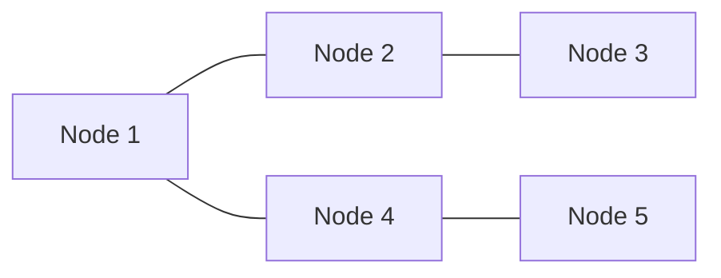

经过运动后，节点在世界空间中的位置可能完全改变：

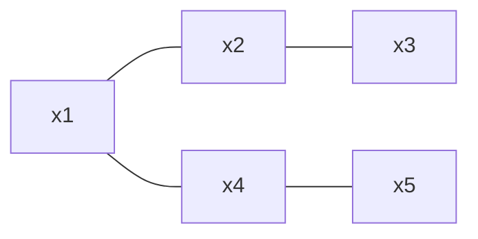

但是材料内部连接关系并没有改变：

$$
E^M(t)=E^M(0)
$$

因此，mesh edge：

$$
(i,j)\in E^M
$$

表达的不是“两个节点现在距离很近”，而是：

> 这两个节点在材料结构中存在直接物理联系。

这种关系对应传统离散力学中的局部作用。例如弹性体中，节点之间的恢复力依赖于材料连接：

$$
F_{ij}=f(x_i,x_j,u_i,u_j)
$$

其中参考位置：

$$
u_i,u_j
$$

提供了材料初始结构信息，而当前位置：

$$
x_i,x_j
$$

描述当前变形状态。

因此，mesh-space message passing 主要负责学习内部动力学过程。论文指出，mesh edges 用于近似大多数物理系统中的内部相互作用，而不是简单表示空间邻居。

这也是 MeshGraphNets 能够处理 cloth 和 deformable solid 等问题的重要原因。对于这些系统而言，材料拓扑比当前空间距离更加重要。

### 2.3 World-space：利用空间邻近关系描述碰撞与接触

虽然 mesh-space 能够很好地描述材料内部作用，但是它无法表达不同物体之间的交互。

考虑布料与球体碰撞的情况。布料拥有自己的 mesh：

$$
G_c=(V_c,E_c^M)
$$

球体拥有自己的 mesh：

$$
G_s=(V_s,E_s^M)
$$

两个物体之间不存在共享单元，因此：

$$
E_c^M\cap E_s^M=\emptyset
$$

如果模型只使用 mesh edges，那么两个物体在 graph 中实际上是两个完全独立的子图，网络无法知道它们正在发生碰撞。

但是在真实世界中，碰撞发生的依据并不是材料拓扑，而是空间位置。例如，当两个节点满足：

$$
||x_i-x_j||<r_W
$$

时，它们可能产生接触作用。

因此作者引入 world edges：

$$
E^W
$$

其连接规则基于当前世界坐标：

$$
(i,j)\in E^W
\quad
\text{if}
\quad
||x_i-x_j||<r_W
$$

其中 \(r_W\) 是搜索半径。

与 mesh edge 不同，world edge 不表示材料内部约束，而表示：

“两个节点在当前空间中足够接近，可能存在外部交互。”

因此，对于同一个节点：

来自 mesh-space 的信息：

$$
m_i^M
$$

表示：

* 材料内部变形；
* 弹性传播；
* 结构约束。

来自 world-space 的信息：

$$
m_i^W
$$

表示：

* 碰撞；
* 接触；
* 非局部空间影响。

整体可以理解为：

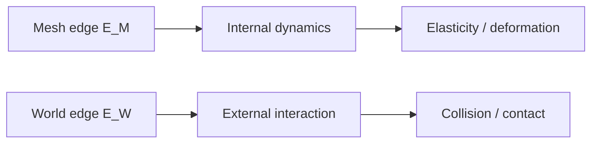

论文 Figure 3a 中展示的双空间结构，本质上解决了一个长期存在的问题：**材料关系和空间关系不能用同一种邻接规则表示。**

传统粒子图方法通常只关注当前空间距离，而传统 mesh 方法只保存材料拓扑。MeshGraphNets 将二者结合，使一个 graph representation 同时具备：

* mesh topology 提供的物理连续性；
* world proximity 提供的环境交互能力。

### 2.4 双空间表示与 CAE 图结构设计的关系

从 CAE 软件设计角度看，MeshGraphNets 的双空间 graph 实际上提供了一种重要抽象：**拓扑连接与交互连接应该分离表示。**

在传统 CAE 数据结构中，这两类关系通常由不同模块维护：

* mesh connectivity 用于有限元组装、单元计算；
* contact detection 用于碰撞搜索和接触约束。

MeshGraphNets 将这种工程实践转化为机器学习中的图结构：

$$
\text{Physical Graph}
=
\text{Topology Graph}
+
\text{Interaction Graph}
$$

其中：

$$
E^M
$$

对应稳定的物理拓扑，而：

$$
E^W
$$

对应动态变化的空间关系。

这也是为什么 MeshGraphNets 不直接继承普通 graph library 的简单邻接结构，而需要一个能够表达多种关系的 mesh-aware graph representation。

对于复杂 CAE 系统而言，一个节点可能同时参与：

* 材料连接；
* 边界约束；
* 接触关系；
* 接口耦合。

因此，MeshGraphNets 的双空间思想实际上提供了一种从传统数值模拟向图结构模拟迁移的重要范式：**图中的 edge 不只是连接关系，而是不同物理机制的载体。**

---

## 三、Encode–Process–Decode：从 Mesh 状态到物理时间推进

### 3.1 从 Mesh 表示到神经物理算子：Encode–Process–Decode 的整体思想

MeshGraphNets 的网络结构并不是一个普通的“输入状态、输出状态”的预测模型，而是试图对应传统数值模拟中的计算流程。在传统 CAE 求解器中，连续物理系统首先通过 mesh 被离散化，然后在离散自由度之间计算物理作用，最后通过时间积分得到下一时刻状态。对于一般动力系统，这一过程可以表示为：

$$
\frac{\partial q}{\partial t}=F(q)
$$

其中 \(F\) 表示控制系统演化的物理算子。例如有限元方法中的刚度矩阵、流体求解中的离散微分算子，本质上都是对这一演化规律的离散近似。MeshGraphNets 的目标并不是直接学习：

$$
q^t\rightarrow q^{t+1}
$$

而是利用图神经网络学习：

$$
F(q)\approx F_\theta(q)
$$

即用数据驱动的方法近似传统求解器中的物理算子。

因此，模型整体采用 Encode–Process–Decode 结构：

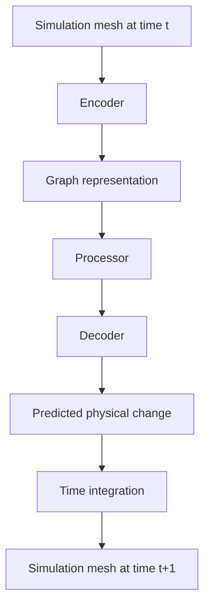

其中 Encoder 将原始 mesh 转换为包含节点、边以及物理状态信息的 graph representation；Processor 通过多轮 message passing 学习节点之间的相互作用关系；Decoder 则将隐藏状态转换为实际的物理变化量，并通过积分器推进系统状态。论文 Figure 1 展示了这一过程：模型输入的是 simulation mesh，而输出并不是直接生成下一帧 mesh，而是预测能够驱动系统演化的物理量。

这种设计使 MeshGraphNets 与传统 CAE 求解流程保持了结构上的一致性。区别在于，传统方法中的物理算子通常由人工推导，例如有限元离散矩阵或者 CFD 离散格式；而 MeshGraphNets 通过 message passing 从数据中学习一个近似算子。因此，网络学习的核心不是某个具体时间序列之间的映射，而是隐藏在 mesh 离散结构中的物理演化规律。

### 3.2 Relative Encoding 与 Message Passing：如何在 Graph 上学习物理相互作用

将 mesh 转换为 graph 后，核心问题变成：网络应该如何表示节点之间的物理关系。对于普通图神经网络而言，节点之间的连接关系通常只表示邻接，例如 GCN 主要通过邻居节点聚合信息：

$$
h_i^{l+1}
=
\sigma
\left(
\sum_jWh_j^l
\right)
$$

这种表示方式能够回答“哪些节点相连”，但是对于物理模拟而言还不够，因为物理作用通常依赖节点之间的相对状态。例如弹性力：

$$
F_{ij}=k(|x_i-x_j|-l_0)
$$

真正决定两个节点之间作用强度的是：

$$
x_i-x_j
$$

而不是节点本身的绝对位置。因此 MeshGraphNets 在 edge feature 中加入 relative encoding，通过节点之间的相对位移描述局部物理关系：

$$
x_{ij}=x_i-x_j
$$

并同时加入距离：

$$
||x_{ij}||
$$

这样网络学习到的是“两个节点如何相互作用”，而不是“某个节点处于什么绝对位置”。这一设计符合物理系统中的空间不变性，例如整个物体发生平移：

$$
x_i'=x_i+c
$$

虽然节点坐标改变，但是内部力学规律并不会改变。

对于 MeshGraphNets 的双空间 graph，relative encoding 分别对应两种物理关系。对于 mesh edge：

$$
(i,j)\in E^M
$$

使用参考坐标中的相对位置：

$$
u_{ij}=u_i-u_j
$$

因为 mesh-space 描述的是材料拓扑关系；对于 world edge：

$$
(i,j)\in E^W
$$

使用当前空间中的相对位置：

$$
x_{ij}=x_i-x_j
$$

因为 world-space 描述的是当前几何状态下的空间交互。论文指出，模型采用相对位移及其距离作为边特征，以增强空间泛化能力。

在获得 edge feature 后，Processor 通过多层 message passing 更新图状态。与只聚合节点特征的 GCN 不同，MeshGraphNets 显式维护 edge feature，因为物理作用本质上发生在节点之间的关系上。每条边首先根据两个节点状态更新自身信息：

$$
e_{ij}'=\phi_e(e_{ij},v_i,v_j)
$$

随后，更新后的边信息被聚合到节点：

$$
m_i=\sum_j e_{ij}'
$$

并用于更新节点状态：

$$
v_i'=\phi_v(v_i,m_i)
$$

因此，Processor 实际上学习的是一个定义在 mesh graph 上的离散物理算子。与普通 GCN 关注“节点之间是否连接”不同，MeshGraphNets 关注“节点之间通过什么物理关系发生作用”。这一点对于 CAE 问题尤其重要，因为图中的 edge 并不是单纯的数据连接，而是不同物理机制的载体：mesh edge 表示材料内部拓扑约束，world edge 表示空间中的接触与交互。通过区分不同类型的 edge message，模型能够同时学习内部动力学和外部作用，而不会将材料连接与空间接触混淆。

### 3.3 Decoder 与时间积分：为什么模型预测变化率而不是直接预测下一状态

经过 Processor 多轮 message passing 后，节点隐藏状态已经包含局部物理环境的信息。Decoder 的作用是将这些抽象特征转换为可以用于时间推进的物理量。作者没有直接让 Decoder 输出：

$$
q^{t+1}
$$

而是预测状态变化率，例如速度变化或者加速度。这一设计与传统数值积分方法保持一致，因为物理系统通常由变化规律定义，而不是由离散时间状态之间的直接映射定义。

对于一阶系统：

$$
\dot q=F(q)
$$

模型输出：

$$
\dot q
$$

然后通过时间积分：

$$
q^{t+1}=q^t+\Delta t\dot q
$$

得到下一状态。对于布料和弹性体等二阶动力学系统：

$$
\ddot{x}=F(x)
$$

模型输出：

$$
\ddot{x}
$$

再利用二阶积分更新位置：

$$
x^{t+1}
=
2x^t-x^{t-1}
+
\Delta t^2\ddot{x}
$$

论文根据不同物理任务采用不同预测目标：对于 Lagrangian 系统，模型预测二阶动力学量；对于流体系统，则预测一阶变化量。

这种设计使 MeshGraphNets 更接近传统数值模拟器的结构。网络并不是记忆某个固定时间间隔下状态如何变化，而是在学习当前状态下系统的演化趋势。因此，当初始条件、几何形态或者模拟规模发生变化时，这种基于物理变化率的表示更容易保持稳定的 rollout 行为。

从整体上看，Encode–Process–Decode 并不是简单的深度学习预测框架，而是一种学习型数值求解器。其中 Encoder 负责构造物理图表示，Processor 学习离散物理算子，Decoder 输出可积分的动力学量，而时间积分器完成最终状态推进。这种结构正是 MeshGraphNets 能够跨越布料、弹性体以及流体等不同物理系统的关键。

