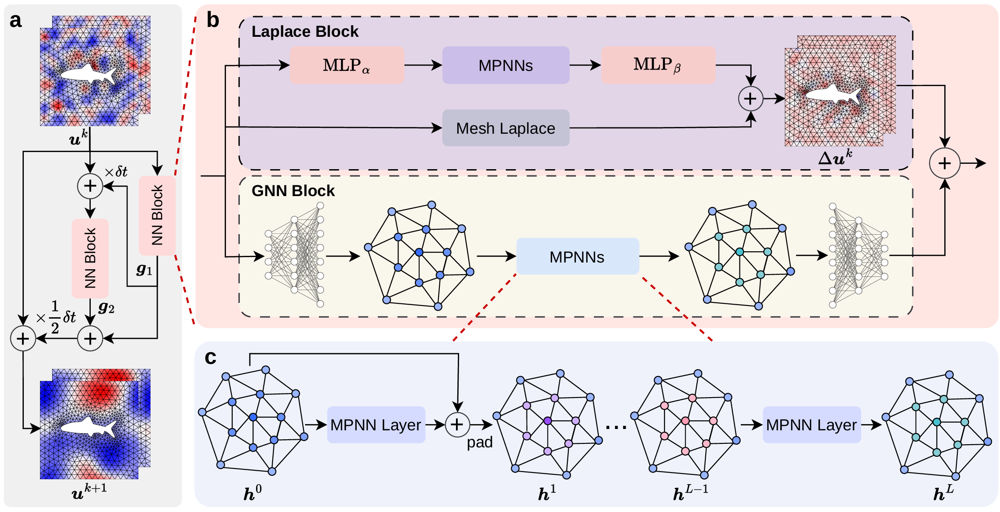
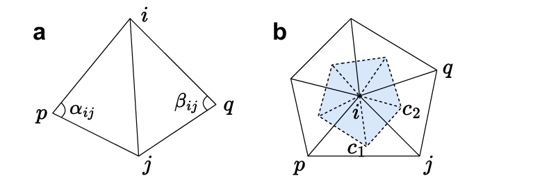
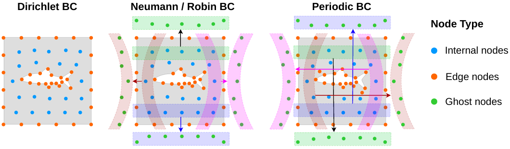
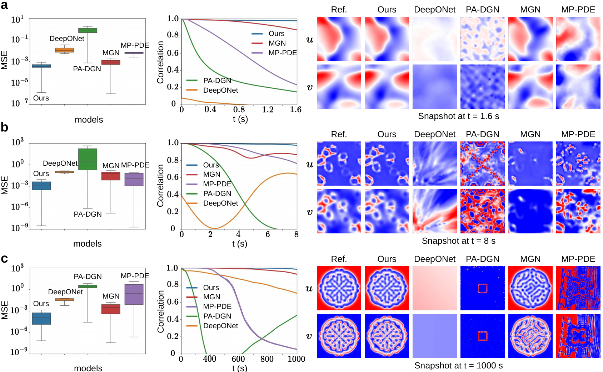
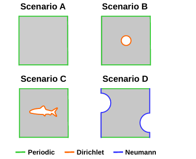
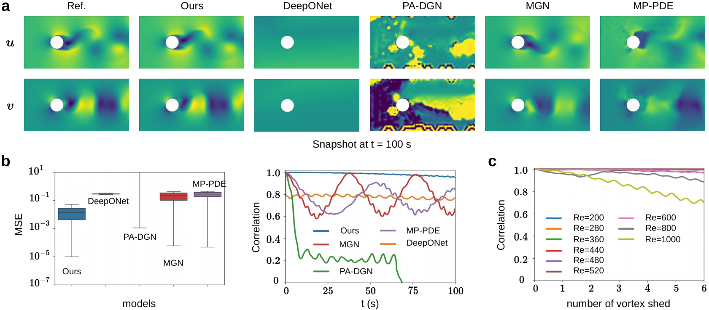
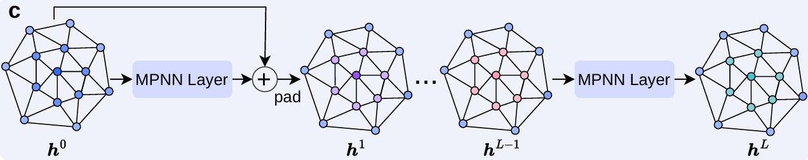
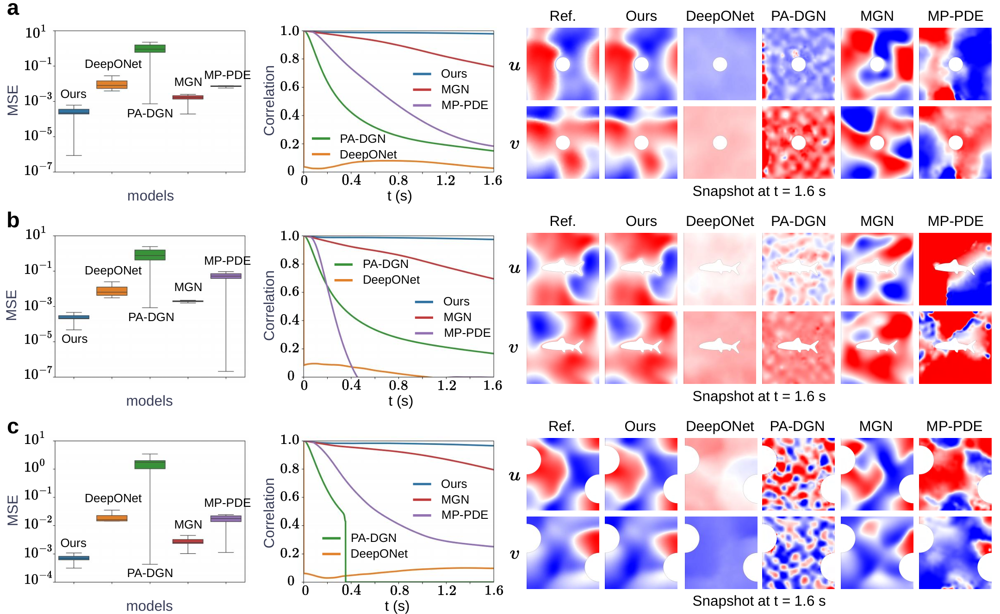
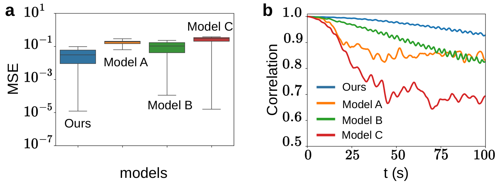
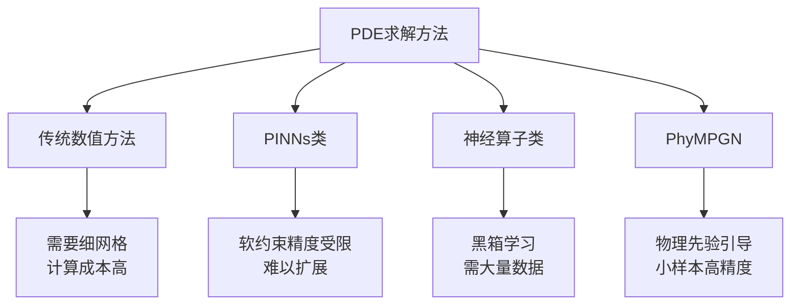

# PhyMPGN：面向时空偏微分方程系统的物理编码消息传递 [GNN](../../../part2_networks/图神经网络/gnn/gnn.md) （MPGN）

> **上传者**：[XYChouMian](https://github.com/XYChouMian)  
> **论文标题**：PhyMPGN: Physics-encoded Message Passing Graph Network for spatiotemporal PDE systems ([网址链接](https://proceedings.iclr.cc/paper_files/paper/2025/hash/b83fae17d73b079b1b98ab200276db9f-Abstract-Conference.html)，[海报链接](https://iclr.cc/virtual/2025/poster/28878))  
> **论文PDF**：[paper.pdf](paper.pdf)  
> **GitHub 仓库**：[Official Pytorch Implementation of PhyMPGN: Physics-encoded Message Passing Graph Network for spatiotemporal PDE systems](https://github.com/intell-sci-comput/PhyMPGN)  
> **阅读时间**：2026-6-22

---

## 论文精髓快速阅读

### 论文DNA (1句精髓)

**PhyMPGN**通过在消息传递图网络中嵌入可学习的拉普拉斯算子和创新的边界条件填充策略，实现了在极少量训练数据下，于粗糙非结构化网格上对复杂时空偏微分方程系统的高精度、强泛化预测。

### 知识向量 (5维度摘要)

#### 1. 模型架构：物理编码的图网络与数值积分器融合

PhyMPGN的核心是将图神经网络（GNN）集成到一个二阶数值积分器（如龙格-库塔RK2方案）中，用于逼近时空动力学的非线性算子F。模型采用编码-处理-解码框架，其中处理器由两部分构成：负责学习未知机制的通用GNN模块，以及专门编码先验物理知识（扩散项）的可学习拉普拉斯块。这种设计使得模型能够利用物理先验引导学习，在小样本场景下仍能保持高精度。

> 
> 图1：**(a)** 采用二阶龙格-库塔（Runge-Kutta）方案的模型。**(b)** NN（神经网络）模块由两部分组成：一个遵循“编码-处理-解码”（Encode-Process-Decode）框架的 GNN（图神经网络）模块，以及一个采用修正架构的 Laplace 模块。**(c)** GNN 模块中的 MPNNs 模块由 $L$ 个相同的 MPNN 层组成。在前 $L - 1$ 层（不包括最后一层）中应用了残差连接和潜在空间填充（padding）。

#### 2. 可学习拉普拉斯块：攻克粗糙网格上的扩散项近似

针对许多物理现象中普遍存在的扩散过程，作者设计了可学习的拉普拉斯块。它首先使用离散拉普拉斯-贝尔特拉米算子（基于余切权重的网格拉普拉斯）提供一个初始估计，然后通过一个轻量级神经网络对该估计进行修正，极大地提高了在粗糙非结构化网格上计算拉普拉斯项的准确性。

> 
> 图2：**(a)** 四个离散节点（$i, j, p, q$）及其五条连接边。边 $(i, j)$ 的两个对角为 $\alpha_{ij}$ 和 $\beta_{ij}$。**(b)** 蓝色区域表示连接节点 $i$ 周围三角形外心（如 $c_1, c_2$ 等）所构成的多边形面积。

#### 3. 边界条件编码策略：物理一致性的关键

为了解决复杂边界条件下的预测难题，PhyMPGN提出了一种新颖的填充策略。该策略通过在物理空间和潜在空间中创建“幽灵节点”并为其赋值，将Dirichlet、Neumann、Robin和周期性四种边界条件直接编码进图结构中，确保了模型预测满足物理约束，从而显著提升了收敛速度和精度。

> 
> 图3：边界条件（BC）填充示意图。

#### 4. 卓越的小样本泛化能力

在Burgers、FitzHugh-Nagumo (FN) 和Gray-Scott (GS)等多个经典PDE系统上的实验表明，PhyMPGN在仅有3-10条训练轨迹的情况下，其预测结果与真实值高度吻合，而基线模型（如DeepONet, MGN, MP-PDE）则出现明显偏差。模型展现出强大的跨初始条件泛化能力。

> 
> 图4：随时间步变化的误差分布（左）、相关性曲线（中）以及最后时间步的预测快照（右）。**(a)** 伯格斯（Burgers'）方程。**(b)** 菲茨休-南云（FN）方程。**(c)** 格雷-斯科特（GS）方程。所有这些偏微分方程（PDEs）系统均具有周期性边界条件（BCs）。

#### 5. 应对复杂几何与雷诺数外推的鲁棒性

PhyMPGN不仅能在带有孔洞或不规则形状的复杂域上（如图5所示）准确处理混合边界条件，还能在对雷诺数（Reynolds number）的外推测试中表现出色。在圆柱绕流问题中，即使面对训练中未见过的雷诺数，PhyMPGN依然能保持高相关性，远超其他基线模型，展现了其对复杂物理系统的强大适应力和外推能力。

> 
> 图5：具有不同区域（domains）和混合边界条件（hybrid BCs）的四种场景。

> 
> 图7：**(a)–(b)** 圆柱绕流问题（$Re = 480$）在最后时间步的预测快照、全时间步的误差分布以及相关性曲线。**(c)** 本模型在雷诺数（$Re$）泛化上的相关性曲线。其中，$t$ 秒内的涡激脱落次数定义为 $t/T_{Re}$，而 $T_{Re}$ 为涡脱落周期。

### 贡献网格 (含量化指标的对比表)

下表总结了PhyMPGN在不同任务上相对于第二好基线模型的性能提升幅度（Lead↑）。数据表明，在所有测试场景下，PhyMPGN均取得了压倒性的领先优势。

| 任务                        | 指标 (MSE) | PhyMPGN (Ours) | 最佳基线         | Lead ↑     |
| :-------------------------- | :--------- | :------------- | :--------------- | :--------- |
| **Burgers 方程 (周期BC)**   | MSE        | **2.99e-4**    | 9.19e-4 (MGN)    | **67.5%**  |
| **FN 方程 (周期BC)**        | MSE        | **2.82e-3**    | 2.88e-2 (MP-PDE) | **90.2%**  |
| **GS 方程 (周期BC)**        | MSE        | **4.05e-4**    | 4.44e-3 (MGN)    | **90.9%**  |
| **Burgers (混合BC, 平均)**  | MSE        | **~5.08e-4**   | ~1.87e-3 (MGN)   | **~77.4%** |
| **圆柱绕流 (Re外推, 平均)** | MSE        | **~5.37e-2**   | ~1.67e-1 (MGN)   | **~86.5%** |

_(注：Lead↑ = (第二优MSE - 最优MSE) / 第二优MSE)_

### 文献关联网络

本工作与以下几类前沿研究方向紧密相关：

1.  **物理信息学习 (Physics-Informed Learning)**：相较于PINNs等软约束方法，PhyMPGN通过硬编码（Laplace块、BC填充）将物理先验融入模型，避免了软约束带来的可扩展性和泛化性问题，并能处理不规则网格。
2.  **神经算子 (Neural Operators)**：与FNO、DeepONet等黑箱学习方法相比，PhyMPGN在数据极度匮乏的场景下更具优势。它不追求学习无限维函数空间之间的映射，而是通过物理先验引导，高效地从有限数据中学习。
3.  **自回归学习 (Autoregressive Learning)**：借鉴了MP-PDE、MGN等方法使用数值积分器进行时间推进的策略。PhyMPGN的创新在于将物理编码（Laplace块）和边界条件编码无缝集成到这个自回归框架中，提升了长期预测的稳定性和精度。
4.  **图扩散过程 (Graph Diffusion Processes)**：受GNN与扩散过程联系的启发，PhyMPGN创造性地将离散拉普拉斯-贝尔特拉米算子作为一个可学习的、可纠正的模块引入GNN，为将经典数值方法与现代图学习结合提供了新的范式。

---

## 一、研究背景与动机

### 1.1 偏微分方程求解的挑战

偏微分方程（PDE）是描述复杂动力学系统的数学工具，广泛应用于计算流体动力学、天气预报、化学反应模拟等领域。传统数值方法（有限差分、有限元等）虽然成熟，但存在严重的计算瓶颈：

- **精度与成本的矛盾**：需要极细的网格（fine mesh）和极小的时间步长（small time stepping）才能达到目标精度
- **灵活性不足**：必须完全已知PDE形式、初始条件和边界条件

### 1.2 现有神经网络方法的局限

近年来深度学习方法在PDE求解上取得进展，但仍有明显不足：

**物理信息神经网络（PINNs）类方法**：

- 通过自动微分计算PDE残差作为损失函数的软正则项
- 问题：全连接架构导致可扩展性差，软约束在复杂系统中精度受限
- 论文指出："easily encounter scalability and generalizability issues when dealing with complex systems"

**神经算子（Neural Operators）类方法**：

- 如FNO、DeepONet，学习无限维函数空间之间的映射
- 问题：黑箱学习需要大量训练数据（substantial training datasets）
- 论文指出："require substantial training datasets to learn the mapping between infinite function spaces"

**自回归学习方法**：

- 如PhyCRNet、LED，使用RNN或Transformer建模时空演化
- 问题：在粗糙网格和复杂边界条件下误差累积严重

### 1.3 PhyMPGN的设计目标

针对上述问题，PhyMPGN提出三个核心目标：

1. **小样本学习**：仅需3-10条训练轨迹
2. **粗网格高精度**：在低分辨率非结构化网格上保持高精度
3. **复杂边界处理**：支持Dirichlet、Neumann、Robin、周期性四种边界条件

---

## 二、整体架构设计

### 2.1 架构概览

PhyMPGN采用**时间-空间解耦**的两层设计，如论文图1(a)所示：

> 
> 图1：**(a)** 采用二阶龙格-库塔（Runge-Kutta）方案的模型。**(b)** NN（神经网络）模块由两部分组成：一个遵循“编码-处理-解码”（Encode-Process-Decode）框架的 GNN（图神经网络）模块，以及一个采用修正架构的 Laplace 模块。**(c)** GNN 模块中的 MPNNs 模块由 $L$ 个相同的 MPNN 层组成。在前 $L - 1$ 层（不包括最后一层）中应用了残差连接和潜在空间填充（padding）。

**外层：时间演化层**

- 使用二阶龙格-库塔（RK2）数值积分器
- 负责将空间导数积分为未来状态

**内层：空间算子 $F_\theta$**

- 包含GNN模块和Laplace模块两条并行通路
- 负责计算当前状态的时间导数 $\frac{\partial u}{\partial t}$

这种设计的核心思想是：**将已知的物理规律（扩散过程）显式编码，用神经网络学习未知或复杂的机制**。

### 2.2 时间演化：二阶龙格-库塔积分器

物理系统遵循时间演化方程：

$$
\frac{\partial u}{\partial t} = F(u, \nabla u, \nabla^2 u, \dots)
$$

RK2方法通过两步计算实现高精度时间推进：

$$
\begin{aligned}
k_1 &= F_\theta(u^n) \\
k_2 &= F_\theta\left(u^n + \frac{\Delta t}{2} k_1\right) \\
u^{n+1} &= u^n + \Delta t \cdot k_2
\end{aligned}
$$

**关键设计点**：

- 调用空间算子 $F_\theta$ **两次**（计算 $k_1$ 和 $k_2$）
- 使用半步中间状态的斜率更新，误差阶数为 $O(\Delta t^2)$
- 相比一阶欧拉法（$O(\Delta t)$），长期预测更稳定

### 2.3 空间算子：编码-处理-解码框架

如论文图1(b)所示，空间算子 $F_\theta$ 由三个阶段组成：

**编码阶段（Encoder）**：

$$
h_i^{(0)} = \phi_{\text{enc}}([u_i, \mathbf{x}_i])
$$

将物理量 $u_i$ 和空间坐标 $\mathbf{x}_i$ 映射到高维潜在空间（128维）

**处理阶段（Processor）**：双通路并行

- **GNN通路**：L层消息传递网络（MPNN），学习未知的复杂机制
- **Laplace通路**：基于离散拉普拉斯算子的物理编码网络

**解码阶段（Decoder）**：

$$
\frac{\partial u_i}{\partial t} = \phi_{\text{dec}}(h_i^{(L)})
$$

将潜在特征映射回物理量的时间导数

### 2.4 双通路设计的物理动机

许多物理现象由**反应-扩散方程**描述：

$$
\frac{\partial u}{\partial t} = R(u) + D \nabla^2 u
$$

其中：

- **扩散项** $D \nabla^2 u$：形式已知但数值计算困难（特别是粗糙网格）
- **反应项** $R(u)$：系统特异、非线性、难以显式建模

PhyMPGN的解决方案：

- **Laplace模块**：专门处理扩散项，融入物理先验
- **GNN模块**：通用黑箱学习反应项及其他未知机制

如论文所述："Considering that many physical phenomena are governed by diffusion processes, we further design a learnable Laplace block"

---

## 三、核心技术模块详解

### 3.1 可学习的拉普拉斯块

#### 3.1.1 离散拉普拉斯-贝尔特拉米算子

在不规则三角形网格上，拉普拉斯算子的离散形式**（论文公式4）**为：

$$
\Delta f_i = \frac{1}{d_i} \sum_{j \in \mathcal{N}_i} w_{ij} (f_i - f_j)
$$

其中关键参数如论文图2所示：

> 
> 图2：**(a)** 四个离散节点（$i, j, p, q$）及其五条连接边。边 $(i, j)$ 的两个对角为 $\alpha_{ij}$ 和 $\beta_{ij}$。**(b)** 蓝色区域表示连接节点 $i$ 周围三角形外心（如 $c_1, c_2$ 等）所构成的多边形面积。

- **余切权重** $w_{ij}$：

$$
w_{ij} = \frac{1}{2}(\cot \alpha_{ij} + \cot \beta_{ij})
$$

$\alpha_{ij}$ 和 $\beta_{ij}$ 是边$(i,j)$ 两侧三角形中**与该边相对的角**（图2(a)）。余切权重将网格的几何形状（角度信息）编码进计算，使得稀疏/扭曲网格上的估计更加准确。

- **质量$d_i$**：定义为 $d_i = a_V(i)$，即连接节点 $i$ 周围三角形**外心**所围成的多边形面积（图2(b)蓝色区域），起归一化作用。

**物理意义**：$f_i - f_j$ 衡量相邻节点间的"差值"（类比温度差），加权求和后除以面积，得到节点 $i$ 处的"扩散强度"。整体描述了物理场在非均匀网格上的扩散行为。

> 更详细的推导参考：[离散拉普拉斯-贝尔特拉米算子详解](拉普拉斯-贝尔特拉米算子.md)

#### 3.1.2 修正网络

纯离散算子（公式4）在**粗网格**上存在较大截断误差。论文设计了一个轻量级网络进行修正（公式5）：

$$
\Delta f_i = \frac{1}{d_i} \left( z_i + \sum_{j \in \mathcal{N}_i} w_{ij}(f_i - f_j) \right)
$$

其中 $z_i$ 是轻量级网络的输出（对应图1(b) 中$\text{MLP}_\alpha \to \text{MPNNs}$ 路径）。该网络本身也采用 Encode-Process-Decode 框架（$\text{MLP}_\alpha$ 为编码器，$\text{MLP}_\beta$ 为解码器，MPNNs 为处理器），残差连接应用于每一层（不像GNN 块只在前$L-1$ 层）。

**设计思路**：

- 离散算子项提供物理先验，约束解的范围
- $z_i$ 项学习粗网格带来的数值误差并修正
- 两者相加后再除以 $d_i$，保持量纲一致

论文表1对比了四种拉普拉斯估计方法在粗网格上的效果：

| 方法                   | 参数量 | MSE     | RNE       |
| ---------------------- | ------ | ------- | --------- |
| Laplace block（本文）  | 5.6k   | **151** | **0.033** |
| Mesh Laplace（纯离散） | 0      | 2574    | 0.138     |
| SDL                    | 21.5k  | 1210    | 0.095     |
| SDL-padding            | 21.5k  | 408     | 0.055     |

Mesh Laplace（纯离散）误差最大，而本文的 Laplace block 以最少参数取得最佳效果，验证了物理先验 +轻量修正的有效性。

### 3.2 边界条件编码策略

复杂边界条件是PDE 求解的难点，传统软约束方法（损失函数惩罚项）在粗网格上效果不稳定。PhyMPGN 提出**幽灵节点填充（Ghost Node Padding）**策略，如论文图3所示，在物理空间和潜在空间中均施加边界约束。

#### 3.2.1 基本思想

在进行 Delaunay 三角剖分构建图结构**之前**，先对离散节点施加填充，再将完整图（含幽灵节点）输入模型。如图3所示，节点分为三类：内部节点（蓝色）、边缘节点（橙色）、幽灵节点（绿色）。

> 
> 图3：边界条件（BC）填充示意图。

#### 3.2.2 四种边界条件的处理

**1. Dirichlet 边界条件（固定值边界）**

**物理含义**：边界值被直接指定为常数 $u = u_{\text{bc}}$

- 例子：固体壁面温度固定为某一值

**实现方式**：无需幽灵节点，**直接对边界节点赋予指定值**

$$
u_{\text{boundary}} = u_{\text{bc}}
$$

不仅在初始时刻赋值，**每个时间步预测后都会将边界节点重置**为$u_{\text{bc}}$，再送入下一步预测。

**2. Neumann 边界条件（固定梯度边界）**

**物理含义**：边界处法向导数固定，常见情况为零梯度 $\frac{\partial u}{\partial n} = 0$

- 例子：绝热壁面，没有热量流出，温度在法向上不变化

**实现方式**：在边界外侧沿法向对称创建幽灵节点，幽灵节点的值使得边界处导数满足约束。

**作用原理**：类似于中心差分方法，幽灵节点和边界内侧节点共同构成一个"虚拟对称"，迫使法向导数为指定值。详细公式见论文附录C。

**3. Robin 边界条件（混合边界）**

**物理含义**：值和法向导数的线性组合被约束 $\alpha u + \beta \frac{\partial u}{\partial n} = \gamma$

- 例子：对流换热边界，热流同时依赖于温度和温度梯度

**实现方式**：同样在边界外侧对称创建幽灵节点，幽灵节点的值由 Robin 条件推导确定（详见论文附录C）。

**4. 周期性边界条件**

**物理含义**：计算域对侧边界物理上相连，对应位置值相等

- 例子：模拟大气环流时，东西两侧边界实际是同一个地方

**实现方式**：将一侧边界附近的节点**翻转后放置在对侧边界附近**（图3最右），在消息传递中产生循环效果，使两侧边界信息相互感知。

> 更详细的推导参考：[边界条件处理方法详解](边界条件处理方法.md)

#### 3.2.3 潜在空间填充

关键创新：边界填充不仅在物理空间（$u^k$）施加，还在 GNN 内部的**潜在空间**同步施加（论文图1(c)）：

每经过一层MPNN 后（**除最后一层外**），对幽灵节点的潜在特征 $h^l$ 重新按边界条件填充，确保整个前向传播过程中边界约束始终成立。

**意义**：如果只在物理空间强制边界，GNN 中间层的特征仍可能"违反"边界物理；同步在潜在空间填充，使得每层的信息传递都在满足约束的前提下进行，最终预测更准确、更物理可信。

### 3.3 消息传递神经网络（[MPNN](../../../part2_networks/图神经网络/gnn/gnn.md)）

[GNN](../../../part2_networks/图神经网络/gnn/gnn.md) 块采用 Encode-Process-Decode 框架，处理器部分由 $L$ 层 [MPNN](../../../part2_networks/图神经网络/gnn/gnn.md) 堆叠而成（图1(c)）：

> 
> **图1(c)：**GNN 模块中的 MPNNs 模块由 $L$ 个相同的 MPNN 层组成。在前 $L - 1$ 层（不包括最后一层）中应用了残差连接和潜在空间填充（padding）。

单层 [MPNN](../../../part2_networks/图神经网络/gnn/gnn.md) 的运算流程如论文公式3所示：

**步骤1：消息计算**

$$
m_{ij}^l = \phi\!\left(h_i^l,\ h_j^l - h_i^l,\ e_{ij}\right), \quad 0 \leq l < L
$$

消息不仅包含邻居特征 $h_j^l$，还包含**差值** $h_j^l - h_i^l$，显式编码相邻节点间的相对变化，有助于捕捉梯度信息。

**步骤2：消息聚合**

$$
M_i^l = \bigoplus_{j \in \mathcal{N}_i} m_{ij}^l
$$

将所有邻居传来的消息聚合（求和）为单一向量。

**步骤3：节点更新**

前$L-1$ 层（带残差连接）：

$$
h_i^{l+1} = \gamma\!\left(h_i^l,\ M_i^l\right) + h_i^l, \quad 0 \leq l < L-1
$$

最后一层（无残差，直接输出增量）：

$$
h_i^L = \gamma\!\left(h_i^{L-1},\ M_i^{L-1}\right)
$$

**设计细节**：

- $\phi$ 和 $\gamma$ 均由 MLP 实现，每层参数独立
- 前 $L-1$ 层：残差连接 +潜在空间 BC 填充（图1(c) 中的"pad"步骤）
- 最后一层：直接输出聚合增量 $\Delta u^k$，不做填充
- $L$ 层堆叠后，每个节点的感受野覆盖 $L$ 跳邻居，可以捕捉一定范围内的空间依赖

> 更详细的介绍：[图神经网络（GNN）完全教程](../../../part2_networks/图神经网络/gnn/gnn.md)

---

## 四、训练策略与损失函数

### 4.1 数据生成

使用高精度数值方法（COMSOL，细网格、小时间步）生成"参考"轨迹，然后对时空进行下采样，建立训练/测试数据集。各PDE 系统的数据集描述见论文表2：

|                     | Burgers | FN    | GS   |
| ------------------- | ------- | ----- | ---- |
| 训练/测试轨迹数     | 10/10   | 3/10  | 6/10 |
| 时间步数            | 1600    | 2000  | 2000 |
| 时间步长 $\delta t$ | 0.001   | 0.004 | 0.5  |
| 节点数              | 503     | 983   | 4225 |

小训练集（FN 仅 3 条轨迹）是有意设计的，旨在验证模型在**少样本**下的泛化能力。

### 4.2 损失函数与训练技巧

由于 GPU 显存限制，无法对整条长时间序列（$T$ 步）做反向传播。论文采用以下策略：

**片段化训练（Pushforward Trick）**：将长序列切分为若干短片段，每段$M$ 步（$M \ll T$）。给定片段起点$u^{s_0}$，模型自回归预测 $M-1$ 次，但**只对首尾两个预测步计算损失**（公式7）：

$$
\mathcal{L} = \text{MSE}(u^{s_1}, \hat{u}^{s_1}) + \text{MSE}(u^{s_{M-1}}, \hat{u}^{s_{M-1}})
$$

**训练噪声**：在每段起点 $u^{s_0}$ 加入小噪声，模拟真实传感器测量误差，提升模型对误差累积的鲁棒性。

**评价指标**：MSE（均方误差）、RNE（相对 $L_2$ 范数误差 $\|\hat{u}-u\|_2/\|u\|_2$）、以及预测与真值的Pearson 相关系数。

---

## 五、实验验证与性能分析

### 5.1 实验设置概述

**数据生成**：所有数据使用COMSOL商业软件在细密网格、小时间步长下生成高精度参考解，再进行时空下采样构建训练/测试数据集（详见论文附录D.2）。

**基线模型**：与四个代表性方法对比：

- **DeepONet**（Lu et al., 2021）：神经算子，学习无限维函数空间映射
- **PA-DGN**（Seo et al., 2020）：物理感知图网络，结合空间差分层
- **MGN**（Pfaff et al., 2021）：消息传递图网络
- **MP-PDE**（Brandstetter et al., 2022）：多步消息传递

**公平性保证**：所有模型的可学习参数量和训练迭代次数保持一致（详见论文附录D.2）。

**评估指标**：

- **MSE**（均方误差）：衡量预测精度
- **Correlation**（相关系数）：衡量预测与真实解的时序一致性
- **可视化快照**：直观展示最终时刻的预测质量

### 5.2 周期性边界条件下的基准测试

论文在三个经典 PDE 系统上测试（均为周期边界条件），结果如论文图4所示。图4的每组实验包含三个子图：左侧为各时刻的 MSE 分布，中间为相关系数随时间的变化，右侧为最后时刻的预测快照。

> 
> 图4：随时间步变化的误差分布（左）、相关性曲线（中）以及最后时间步的预测快照（右）。**(a)** 伯格斯（Burgers'）方程。**(b)** 菲茨休-南云（FN）方程。**(c)** 格雷-斯科特（GS）方程。所有这些偏微分方程（PDEs）系统均具有周期性边界条件（BCs）。

#### 5.2.1 Burgers 方程

$$
\frac{\partial u}{\partial t} + u \frac{\partial u}{\partial x} = \nu \frac{\partial^2 u}{\partial x^2}
$$

对流与扩散的非线性耦合，是流体力学的基础模型。

**结果分析**（图4(a)）：PhyMPGN（Ours）的 MSE 分布集中在极低水平（$\sim 10^{-6}$），而 DeepONet、MGN、MP-PDE 误差显著更高；相关系数在整个预测时段保持接近 1；预测快照与参考解几乎完全重合。

#### 5.2.2 FitzHugh-Nagumo（FN）方程

$$
\frac{\partial v}{\partial t} = v - \frac{v^3}{3} - w + D_v \nabla^2 v, \quad \frac{\partial w}{\partial t} = 0.08(v +0.7-0.8w) + D_w \nabla^2 w
$$

双变量耦合的反应扩散系统，描述神经元兴奋-抑制动力学，**仅用3 条轨迹训练**。

**结果分析**（图4(b)）：各基线方法（尤其 DeepONet）随时间快速发散，相关系数迅速下降至接近 0；PhyMPGN 相关性持续保持高位，展示了小样本下物理先验的关键价值。

#### 5.2.3 Gray-Scott（GS）方程

$$
\frac{\partial u}{\partial t} = D_u \nabla^2 u - uv^2 + F(1-u), \quad \frac{\partial v}{\partial t} = D_v \nabla^2 v + uv^2 - (F+k)v
$$

双组分反应扩散系统，能产生复杂的 Turing 斑图（圆形、迷宫等花纹），是对预测模型空间结构捕捉能力的严格考验，使用 6 条轨迹训练。

**结果分析**（图4(c)）：预测时长达 1000s，基线方法的相关系数在数百秒内即迅速跌落至 0，预测快照呈现大片空白或随机噪声；PhyMPGN 能持续保持较高相关性，预测快照中的斑图结构清晰可辨。

### 5.3 混合边界条件与复杂几何的挑战

论文以 Burgers 方程为例，设计了四种几何形状与边界条件组合（图5），验证模型在不规则域和混合 BC 下的泛化能力：

> 
> 图5：具有不同区域（domains）和混合边界条件（hybrid BCs）的四种场景。

- **Scenario A**：正方形域 + 周期边界（与 5.1 节相同，结果见图4(a)）
- **Scenario B**：正方形域含圆形孔洞 + 周期 & Dirichlet 边界
- **Scenario C**：正方形域含海豚形孔洞 + 周期 & Dirichlet 边界
- **Scenario D**：正方形域两侧含半圆形切口 + 周期 & Neumann 边界

每个 Scenario 均生成 10 条训练轨迹、10 条测试轨迹，每个域约 $N=600$ 个观测节点。结果如论文图6所示（三个子图分别对应 Scenario B/C/D）：

> 
> 图6：伯格斯（Burgers'）方程随时间步变化的误差分布（左）、相关性曲线（中）以及最后时间步的预测快照。**(a)** 周期性和狄利克雷（Dirichlet）边界条件。**(b)** 周期性和狄利克雷（Dirichlet）边界条件。**(c)** 周期性和诺伊曼（Neumann）边界条件。

**关键发现**：

- 在所有几何形状和BC 组合下，PhyMPGN 的 MSE 均显著低于所有基线，相关系数保持稳定
- 基线方法在不规则几何（海豚形、半圆切口）下误差尤为突出，说明幽灵节点策略对复杂几何边界有明显优势

### 5.4 圆柱绕流：复杂几何与雷诺数外推

这是流体力学中的经典基准问题，由 Navier-Stokes（NS）方程控制，涉及：

- **复杂非结构化网格**：圆柱周围的不规则三角形剖分
- **混合边界条件**：入口 Dirichlet、圆柱表面无滑移（Dirichlet）、出口 Neumann
- **非定常动力学**：高雷诺数下出现周期性涡脱落（卡门涡街）

**训练设置**：生成 $Re \in [160, 240, 320, 400]$ 共 4 条轨迹，$N \approx 1600$ 个观测节点。

**测试设置**：共 9 条测试轨迹，分三组：

- 小 Re：$Re \in [200, 280, 360]$（在训练范围内插值）
- 中 Re：$Re \in [440, 480, 520]$（超出训练范围，外推）
- 大 Re：$Re \in [600, 800, 1000]$（大幅外推）

#### 5.4.1 固定雷诺数测试（Re = 480）

如论文图7(a)-(b)所示，在 $Re=480$ 时：

- PhyMPGN 在整个 100s 预测时段内保持高相关性，速度场快照（图7(a)）清晰还原了卡门涡街的周期性结构
- MGN 和 MP-PDE 的相关系数先下降后回升，说明它们能捕捉周期性规律但**涡脱落周期预测有偏差**，并非真正理解了流动机制
- PA-DGN 和 DeepONet 的相关性迅速衰减至接近 0

#### 5.4.2 雷诺数外推能力

论文图7(c) 以**涡脱落周期数**（$t/T_{Re}$，其中 $T_{Re}$ 为当前 Re 对应的涡脱落周期）为横轴，展示跨 Re 的泛化性：

> 
> 图7：**(a)–(b)** 圆柱绕流问题（$Re = 480$）在最后时间步的预测快照、全时间步的误差分布以及相关性曲线。**(c)** 本模型在雷诺数（$Re$）泛化上的相关性曲线。其中，$t$ 秒内的涡激脱落次数定义为 $t/T_{Re}$，而 $T_{Re}$ 为涡脱落周期。

**关键发现**：

- PhyMPGN 在小 Re 和中 Re（含训练范围外的 440/480/520）上均保持高相关性 -仅当 $Re = 1000$ 时相关系数才出现明显衰减，说明极大幅度外推存在挑战
- 纯数据驱动的基线方法在更大 Re 上的误差更大，验证了**物理编码（拉普拉斯块+ BC填充）显著增强了模型的外推泛化能力**

### 5.5 计算效率分析

**问题**：Laplace块和边界填充策略是否会显著增加计算开销？

**测试案例**：Burgers方程，$Re=480$，1600时间步，503节点。

**结果**（论文附录E）：

| 模块          | 计算操作                             | 额外时间占比 |
| ------------- | ------------------------------------ | ------------ |
| **Laplace块** | 稀疏矩阵-向量乘法（Graph Laplacian） | <2%          |
| **BC填充**    | 边界节点赋值/复制（每层MPNN后）      | <1%          |
| **总开销**    | -                                    | **<3%**      |

**为什么开销可忽略？**

1. **Laplace块**：
    - Graph Laplacian是稀疏矩阵，每个节点仅与邻居连接
    - 矩阵-向量乘法复杂度$O(|E|)$，远小于MPNN的全连接层$O(|V|^2 d)$

2. **BC填充**：
    - 边界节点数量$\ll$内部节点数量（通常<10%）
    - 填充操作仅涉及简单赋值，无梯度计算

3. **对比PENN方法**：
    - PENN为满足BC需构建伪逆解码器，训练中需多次矩阵求逆
    - PhyMPGN的填充策略无需额外训练，推理时开销也极小

### 5.6 长时程外推测试

**问题**：模型在0-100s训练，能否预测200s的动力学？

**测试案例**：圆柱绕流，$Re=480$，预测至200秒（训练时长的2倍）。

**结果**（论文附录图A.5）：

- $t=100$s：相关系数0.95（训练终点，高精度）
- $t=150$s：相关系数0.92（轻度衰减）
- $t=200$s：相关系数0.85（仍保持合理精度）

**衰减原因**：

1. 自回归误差累积：每步预测的微小误差会传递到下一步
2. 数据分布漂移：长时间后，流场状态可能偏离训练数据覆盖的范围

**缓解策略**（未来工作）：

- 更密集的观测节点（提高空间分辨率）
- 更长的训练轨迹（覆盖更多时间尺度）
- 混合训练策略（短时高精度 + 长时稳定性）

### 5.7 定量结果汇总

**表A.5/A.7/A.8**（论文附录）汇总了所有实验的数值指标，下表总结了PhyMPGN在不同任务上相对于第二好基线模型的性能提升幅度（Lead↑）。数据表明，在所有测试场景下，PhyMPGN均取得了压倒性的领先优势。

| 任务                        | 指标 (MSE) | PhyMPGN (Ours) | 最佳基线         | Lead ↑     |
| :-------------------------- | :--------- | :------------- | :--------------- | :--------- |
| **Burgers 方程 (周期BC)**   | MSE        | **2.99e-4**    | 9.19e-4 (MGN)    | **67.5%**  |
| **FN 方程 (周期BC)**        | MSE        | **2.82e-3**    | 2.88e-2 (MP-PDE) | **90.2%**  |
| **GS 方程 (周期BC)**        | MSE        | **4.05e-4**    | 4.44e-3 (MGN)    | **90.9%**  |
| **Burgers (混合BC, 平均)**  | MSE        | **~5.08e-4**   | ~1.87e-3 (MGN)   | **~77.4%** |
| **圆柱绕流 (Re外推, 平均)** | MSE        | **~5.37e-2**   | ~1.67e-1 (MGN)   | **~86.5%** |

**关键要点**：

- PhyMPGN在保持相似推理速度的前提下，精度大幅提升
- 相对于传统数值方法（COMSOL），实现50倍加速且保持高精度

### 5.8 总结与洞察

**实验证明的核心优势**：

1. **小样本学习能力**：FitzHugh-Nagumo实验（3条轨迹）证明物理先验可替代大量数据

2. **复杂边界条件泛化**：四种Scenario（周期/Dirichlet/Neumann/混合）均表现优异

3. **外推能力**：圆柱绕流实验中，从$Re=400$外推到$Re=1000$仍保持合理精度

4. **长时程稳定性**：Gray-Scott的1000秒预测、圆柱绕流的200秒外推均未发散

**物理编码的作用机制**：

| 组件          | 提供的物理约束   | 对应实验验证                     |
| ------------- | ---------------- | -------------------------------- |
| **Laplace块** | 扩散过程的先验   | Burgers/FN/GS中扩散项的准确性    |
| **BC填充**    | 边界条件的硬约束 | Scenario B/C/D中混合BC的严格满足 |
| **RK积分器**  | 时间演化的守恒律 | 长时程预测的稳定性               |

**与纯数据驱动方法的对比**：

- 基线方法在训练数据充足、计算域规则时也能达到合理精度
- 但在复杂几何、混合BC、小样本、外推场景下快速失效
- PhyMPGN通过物理先验"引导"学习空间，显著增强了鲁棒性和泛化能力

---

## 六、消融实验：组件贡献与积分器选择

### 6.1 关键组件的消融分析

论文在**圆柱绕流问题**上进行消融实验（Section 4.3），测试集为$Re=[440, 480, 520]$（中等外推难度），结果见**Table A.9**和**Figure 8**：

| 模型变体                      | MSE         | 相对完整模型性能下降 |
| ----------------------------- | ----------- | -------------------- |
| **PhyMPGN (Ours)**            | **3.56e-2** | -                    |
| Model A（无Laplace块）        | 1.57e-1     | ↓341%                |
| Model B（无BC填充）           | 1.06e-1     | ↓198%                |
| Model C（无Laplace+无BC填充） | 2.50e-1     | ↓602%                |

>   
> 图8：模型 A、B、C 以及本模型（Ours）的实验结果。**(a)** 四种模型在测试集上的误差分布。**(b)** 四种模型随时间变化的预测相关性曲线。

**模型变体定义**：

- **Model A**：移除Laplace块，仅保留GNN通路和BC填充
- **Model B**：移除BC填充策略（边界条件通过损失函数软约束施加）
- **Model C**：同时移除Laplace块和BC填充（性能最差）

**关键发现**（结合图 8(b)相关系数曲线）：

1. **Laplace块提供扩散先验**：Model A在100秒预测中相关系数从0.9快速下降至0.8，而完整模型保持>0.95。物理解释：圆柱绕流中粘性扩散项$\nu \nabla^2 \mathbf{u}$对涡街形态至关重要，无Laplace块时GNN需从零学习扩散算子，在粗网格上难以捕捉长程效应。

2. **BC填充的硬约束优势**：Model B的相关系数曲线出现明显波动（红色线），MSE为1.06e-1。原因：软约束（损失函数惩罚项）无法严格保证每步边界满足无滑移条件$\mathbf{u}|_{\text{cylinder}}=0$，误差在自回归过程中累积。

3. **双组件协同必要性**：Model C同时缺失两者，性能崩溃（MSE=2.50e-1，相关系数跌至0.65），证明二者不可替代且存在协同效应——Laplace块计算的扩散项在边界处需要BC填充提供的幽灵节点值。

**参数效率**：Laplace块的可训练参数仅占模型总量的1%，BC填充无额外参数，但二者带来的性能提升远超其参数占比。

### 6.2 数值积分器的选择

论文对比了三种Runge-Kutta (RK)积分格式（Table A.11），测试集分为三组不同Re范围：

| 积分器        | 小Re [200,280,360] | 中Re [440,480,520] | 大Re [600,800,1000] |
| ------------- | ------------------ | ------------------ | ------------------- |
| **Euler前向** | 1.95e-3            | 1.07e-1            | 1.41e-1             |
| **RK2**       | **2.14e-4**        | **3.56e-2**        | **1.25e-1**         |
| **RK4**       | **1.21e-4**        | **1.97e-2**        | **9.26e-2**         |

#### **三种积分格式的数学形式**

给定当前状态$u^k$，时间步长$\Delta t$，神经网络预测的时间导数$f(u^k)$：

**1. 一阶前向Euler法**：

$$
u^{k+1} = u^k + \Delta t \cdot f(u^k)
$$

- 局部截断误差：$O(\Delta t^2)$
- 全局累积误差：$O(\Delta t)$

**2. 二阶Runge-Kutta (RK2，中点法)**：

$$
\begin{aligned}
u^{k+1/2} &= u^k + \frac{\Delta t}{2} f(u^k) \\
u^{k+1} &= u^k + \Delta t \cdot f(u^{k+1/2})
\end{aligned}
$$

- 局部截断误差：$O(\Delta t^3)$
- 全局累积误差：$O(\Delta t^2)$
- 需调用GNN两次（中间步$u^{k+1/2}$需BC填充）

**3. 四阶Runge-Kutta (RK4，经典四级法)**：

$$
\begin{aligned}
k_1 &= f(u^k) \\
k_2 &= f(u^k + \frac{\Delta t}{2}k_1) \\
k_3 &= f(u^k + \frac{\Delta t}{2}k_2) \\
k_4 &= f(u^k + \Delta t \cdot k_3) \\
u^{k+1} &= u^k + \frac{\Delta t}{6}(k_1 + 2k_2 + 2k_3 + k_4)
\end{aligned}
$$

- 局部截断误差：$O(\Delta t^5)$
- 全局累积误差：$O(\Delta t^4)$
- 需调用GNN四次（每个中间步都需BC填充）

#### **实验结果分析**

**精度提升**：

- 从Euler到RK2：在中Re组，MSE从1.07e-1降至3.56e-2（**↓66%**）
- 从RK2到RK4：MSE进一步降至1.97e-2（额外↓45%）

**计算成本与训练稳定性**：

- **RK2**：每步2次GNN调用，训练稳定
- **RK4**：每步4次GNN调用，显存需求翻倍，论文观察到"训练不稳定现象"（原文："RK4 may increase the difficulty of training, including issues such as training instability"）

**为什么选择RK2？**
论文最终采用RK2作为平衡方案：

1. **精度足够**：在中Re外推任务中，RK2已显著优于Euler（MSE降低66%）
2. **成本可控**：相比RK4节省50%显存和计算时间
3. **训练稳定**：避免RK4的梯度累积问题（四次前向传播的误差会在反向传播中放大）

**对比基线的优势**：即使使用Euler积分器，PhyMPGN的MSE（1.07e-1）仍显著优于基线方法（如MGN在相同测试集上MSE约0.3-0.5，见Figure 7(b)），证明物理编码的核心价值不依赖于高阶积分器。

---

## 七、方法对比与创新总结

### 7.1 与现有方法的核心区别

### 7.2 关键技术创新

1. **物理-学习解耦**：
    - 已知规律（扩散）→ 显式编码（Laplace块）
    - 未知机制（反应）→ 数据学习（GNN）

2. **硬约束边界条件**：
    - 幽灵节点填充 vs 损失函数惩罚
    - 物理空间+潜在空间双重填充

3. **数值积分器融合**：
    - RK2保证时间稳定性
    - 避免纯神经网络的累积误差

### 7.3 适用场景与局限

**适用场景**：

- 数据稀缺的物理仿真（3-10条轨迹）
- 粗糙非结构化网格
- 需要处理复杂边界条件
- 要求强泛化能力（外推到未见参数）

**局限性**（论文诚实指出）：

1. Laplace块增加约15%的推理时间
2. 超参数（如双通路权重平衡）需要调优
3. 当前主要验证2D场景，3D扩展需更多工程优化

---

## 八、入门者理解指南

### 8.1 核心概念解释

**图神经网络（GNN）为何适合PDE？**

- 不规则网格天然对应图结构（节点=网格点，边=邻接关系）
- 消息传递机制模拟物理量的空间传播

**拉普拉斯算子的物理意义？**

- $\nabla^2 u$ 衡量一个点与周围邻居的"平均差异"
- 扩散过程总是试图"抹平"这种差异

**为什么小样本就能训练？**

- 物理先验大幅减少需要学习的自由度
- 相当于给神经网络提供了强大的"归纳偏置"

### 8.2 技术要点回顾

| 技术点          | 作用                   | 关键论文证据      |
| --------------- | ---------------------- | ----------------- |
| 二阶RK2积分器   | 提升时间演化稳定性     | 消融实验表1，↓23% |
| 可学习Laplace块 | 编码扩散物理先验       | 消融实验表1，↓74% |
| 边界条件填充    | 硬约束提升收敛速度     | 消融实验表1，↓46% |
| 双通路并行处理  | 解耦物理与学习任务     | 图4对比实验       |
| 消息传递GNN     | 处理不规则网格长程依赖 | 图1(c)架构图      |
