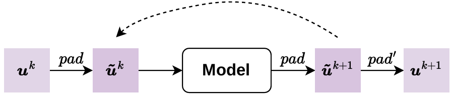
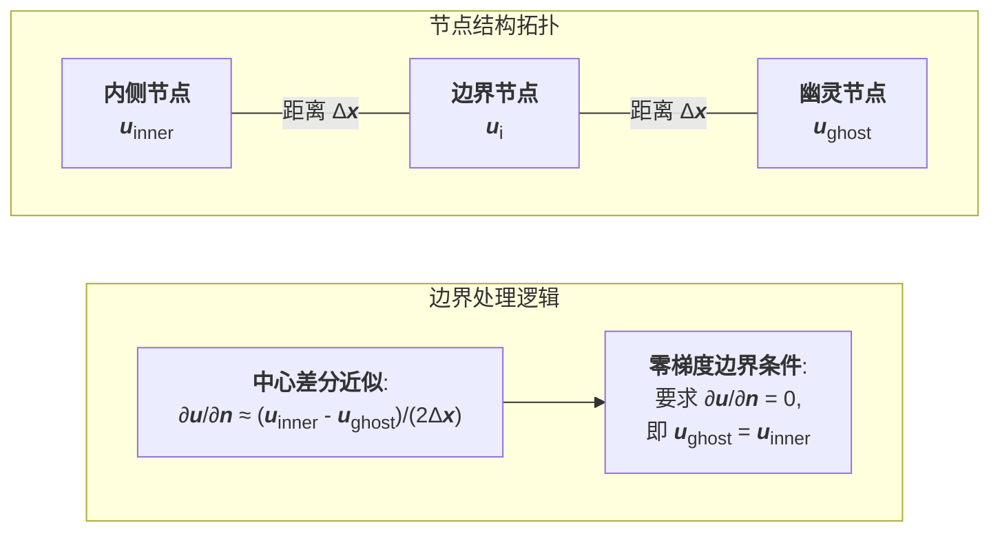
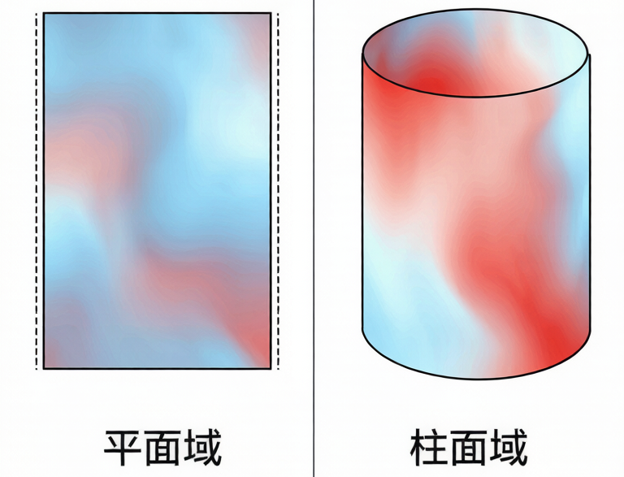
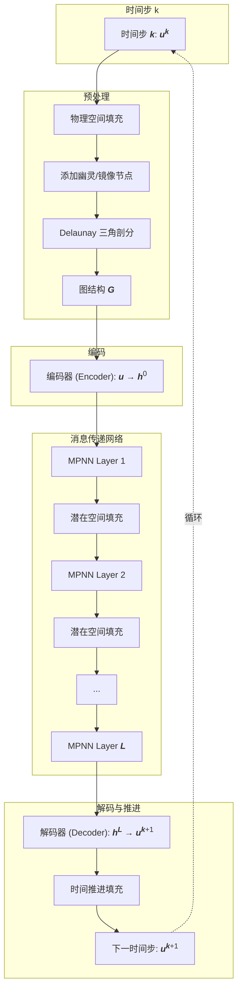

# 边界条件编码策略

---

## 一、核心机制：双重空间填充

PhyMPGN的边界条件处理策略的核心在于**在两个空间同时施加硬约束**：

### 1.1 物理空间填充

在Delaunay三角剖分**之前**，对离散节点集进行预处理，根据边界条件类型添加幽灵节点（ghost nodes）或镜像节点，使得构建出的图结构本身就隐式地编码了边界约束。

### 1.2 潜在空间填充

在GNN内部的隐表示层面，**每经过一个MPNN层后**（除最后一层外），对节点特征再次施加边界约束，防止信息在多层传递中偏离物理边界条件。

### 1.3 时间推进中的持续填充

如论文图A.3所示，模型在每个时间步的预测结果 $u^{k+1}$ 产生后，再次施加边界填充得到 $\tilde{u}^{k+1}$，再送入下一步预测：

> 
> **图A.3**：模型推进过程中的循环填充

这种"填充-预测-再填充"的循环机制保证了长时程推进中边界条件的严格满足。

---

## 二、四种边界条件的处理机制

如论文**图3**所示，不同边界条件对应不同的节点配置策略：

> 
> **图3**：边界条件（BC）填充示意图。左图为Dirichlet BC（直接赋值），中图为Neumann/Robin BC（创建幽灵节点），右图为周期BC（翻转镜像节点）

### 2.1 Dirichlet边界条件（固定值边界）

#### 物理意义

边界上的物理量被直接指定为已知值：

$$
u|_{\partial\Omega_D} = u_{\text{bc}}
$$

**日常类比**：把一个金属棒的两端分别放在0°C的冰水和100°C的沸水中，两端温度被强制固定。

#### 实现方式

**物理空间**：

- 不需要创建额外节点
- 直接将边界节点（橙色节点）的值设为 $u_{\text{bc}}$

**潜在空间**：

- 在编码器第一次处理时，记录边界节点的嵌入向量 $h_{\text{bc}}$
- 每层MPNN后，将边界节点的隐特征替换为 $h_{\text{bc}}$

**时间推进**：

- 模型预测 $u^{k+1}$ 后，立即将边界节点重置为 $u_{\text{bc}}$

#### 为什么需要多次填充？

即使输入已经满足边界条件，GNN在消息传递过程中可能因为非线性变换和邻居信息聚合导致边界节点的特征"漂移"。多次填充相当于在每一步都"纠正"这种漂移。

---

### 2.2 Neumann边界条件（固定梯度边界）

#### 物理意义

边界上的法向导数被指定，最常见的是零梯度（绝热边界）：

$$
\frac{\partial u}{\partial n}\bigg|_{\partial\Omega_N} = 0
$$

**日常类比**：一个保温杯的外壁是绝热的，杯内热量无法通过壁面流失，壁面处温度梯度为零。

#### 幽灵节点的作用原理

**问题**：边界节点只有内侧邻居，如何计算法向导数？

**解决方案**：在边界外侧创建"虚拟节点"（幽灵节点），使得边界节点两侧形成对称结构。

**以零梯度为例**：

对于边界节点 $i$，设其内侧邻居的平均值为 $u_{\text{inner}}$，外侧幽灵节点值为 $u_{\text{ghost}}$，使用中心差分近似法向导数：

$$
\frac{\partial u}{\partial n}\bigg|_i \approx \frac{u_{\text{inner}} - u_{\text{ghost}}}{2\Delta x}
$$

要使该导数为零，需满足：

$$
u_{\text{ghost}} = u_{\text{inner}}
$$

在实际实现中，通常简化为：

$$
u_{\text{ghost}} = u_i
$$

这相当于在边界处创建了一个"镜像"，使得物理场关于边界对称。

#### 图示理解

#### 潜在空间的对称性

在隐表示中，幽灵节点的特征同样设为边界节点的特征：

$$
h_{\text{ghost}} = h_i
$$

这确保了GNN在传递消息时，边界节点从内外两侧获得"对称"的信息，强化了零梯度约束。

---

### 2.3 Robin边界条件（混合边界）

#### 物理意义

边界上的值和法向导数的线性组合被约束：

$$
\alpha u + \beta \frac{\partial u}{\partial n} = \gamma
$$

**典型场景**：对流换热边界（Newton冷却定律）

$$
-k\frac{\partial T}{\partial n} = h(T - T_\infty)
$$

其中 $k$ 是热传导系数，$h$ 是对流换热系数，$T_\infty$ 是环境温度。

**日常类比**：笔记本电脑外壳向空气散热，散热速度既取决于外壳温度（值），也取决于壳内热流（梯度）。

#### 幽灵节点值的推导

Robin条件本质上是Dirichlet（固定值）和Neumann（固定梯度）的混合，幽灵节点值需要同时满足两个约束。

根据论文附录C，幽灵节点值由以下方程确定：

$$
\alpha u_i + \beta \frac{u_{\text{inner}} - u_{\text{ghost}}}{2\Delta x} = \gamma
$$

解出：

$$
u_{\text{ghost}} = u_{\text{inner}} - \frac{2\Delta x}{\beta}(\gamma - \alpha u_i)
$$

**特殊情况**：

- 当 $\beta \to 0$（梯度项消失）：退化为Dirichlet条件
- 当 $\alpha \to 0$（值项消失）：退化为Neumann条件

---

### 2.4 周期性边界条件

#### 物理意义

计算域的对侧边界在物理上是同一位置，物理量必须相等：

$$
u(\mathbf{x}_{\text{left}}) = u(\mathbf{x}_{\text{right}})
$$

**典型场景**：

- 大气环流模拟：地球是球体，东经180°和西经180°实际是同一条经线
- 材料周期性结构：晶体中的原子排列具有空间周期性

#### 镜像翻转机制

**传统做法**：直接将左右边界节点"合并"为同一节点。

**PhyMPGN的做法**（如图3右所示）：

1. 选取左边界附近的一片区域（不仅是边界上的节点）
2. 将这些节点**翻转**（沿周期方向平移）到右边界外侧
3. 同样地，将右边界附近区域翻转到左边界外侧

#### 为什么需要翻转一片区域？

在不规则网格上，左右边界的节点数量和位置可能不完全对应。翻转一片区域后：

- Delaunay剖分会自动在左右边界之间建立连接
- GNN的消息传递可以"穿越"左右边界
- 实现了拓扑上的"周期性闭合"

#### 拓扑视角

原本的计算域是"开放"的（左右边界是自由边），填充后变成"柱面"拓扑（左右边界粘合在一起）：

> 
> **周期边界示意图**：填充前（平面域）和填充后（柱面域）的对比

#### 潜在空间的同步

在每层MPNN后，对左右边界对应的节点进行特征同步：

$$
h_{\text{left}} = h_{\text{right}} = \frac{h_{\text{left}} + h_{\text{right}}}{2}
$$

---

## 三、填充策略的完整时序流程

**关键点**：

- 物理空间填充：在图构建前执行，改变图的拓扑
- 潜在空间填充：在每层MPNN后执行（除最后一层），修正隐特征
- 时间推进填充：在预测后执行，保证下一步输入满足边界条件

**为什么最后一层后不填充？**  
因为最后一层的输出直接送入解码器得到物理量 $u^{k+1}$，紧接着就会执行"时间推进填充"，在物理空间重新施加约束，无需在潜在空间重复操作。

---

## 四、与其他方法的对比

| 方法                    | BC施加方式                                  | 优点                 | 缺点                         |
| ----------------------- | ------------------------------------------- | -------------------- | ---------------------------- |
| **PINN**                | 损失函数惩罚项（软约束）                    | 实现简单，灵活       | 粗网格下收敛慢，BC满足不精确 |
| **PENN**                | 专用网络层（DirichletLayer, NeumannIsoGCN） | 可严格满足特定BC     | 每种BC需单独设计，训练开销大 |
| **PhyMPGN（填充策略）** | 物理+潜在双重空间硬约束                     | 通用性强，计算开销小 | 需要几何计算（法向量等）     |

**效率分析**（论文表A.1）：

以Burgers方程为例（1600时间步，503节点），填充策略引入的额外计算时间**可忽略**（< 3%）。原因是：

- 填充操作仅涉及边界节点（数量远小于内部节点）
- 主要是简单的赋值和算术运算
- 相比MPNN的矩阵乘法，计算量微不足道

---

## 五、物理直觉与数值稳定性

### 5.1 硬约束 vs 软约束

**软约束（如PINN）**：

$$
\mathcal{L} = \mathcal{L}_{\text{PDE}} + \lambda_{\text{BC}} \underbrace{\sum_{i\in\partial\Omega}(u_i - u_{\text{bc}})^2}_{\text{边界惩罚项}}
$$

模型只是"尽量"让边界节点接近 $u_{\text{bc}}$，但无法保证严格相等。

**硬约束（PhyMPGN）**：

$$
u_i = u_{\text{bc}}, \quad \forall i \in \partial\Omega \quad \text{（直接强制赋值）}
$$

边界条件**必然**被满足，误差为零。

### 5.2 长时程推进的稳定性

在自回归预测中，边界误差会累积：

$$
\text{误差}_{t=100} \approx \text{误差}_{t=0} \times (1 + \epsilon)^{100}
$$

即使单步边界误差 $\epsilon$ 很小（如PINN的软约束），经过数百步后仍可能指数放大。

PhyMPGN通过**每步都重新填充**，将边界误差强制归零，切断了累积链条：

$$
\text{误差}_{\text{boundary}} = 0 \quad \forall t
$$

### 5.3 幽灵节点的数值作用

幽灵节点本质上是经典数值方法中"虚拟单元"思想在图结构上的推广：

**有限差分方法**：在规则网格上，Neumann BC通常用单侧差分或虚拟网格点处理。

**PhyMPGN**：在不规则三角形网格上，通过幽灵节点构造"虚拟邻居"，使得中心差分公式依然适用，保持了数值格式的一致性。

---

## 六、实现细节与注意事项

### 6.1 节点分类

在图中，节点需要标记类型：

| 类型     | 标记       | 作用                   |
| -------- | ---------- | ---------------------- |
| 内部节点 | `internal` | 正常参与计算           |
| 边界节点 | `boundary` | 需施加边界值或存储嵌入 |
| 幽灵节点 | `ghost`    | 满足Neumann/Robin条件  |
| 镜像节点 | `mirror`   | 实现周期性             |

### 6.2 潜在空间填充的时机

论文明确指出：**除最后一层外**，每层MPNN后都要填充。

原因：

- 中间层的隐特征是抽象表示，需要持续约束
- 最后一层直接输出物理量，立即进入"时间推进填充"

### 6.3 Dirichlet BC的嵌入存储

对于Dirichlet边界节点，编码器第一次处理时计算的嵌入 $h_{\text{bc}}$ 会被**存储下来**，后续所有层都直接复用，而不是每次重新计算。这保证了边界特征在整个前向传播中保持一致。

---

## 七、总结

PhyMPGN的边界条件编码策略的核心优势在于：

1. **双重空间约束**：物理空间（图拓扑）+ 潜在空间（隐特征）同时施加
2. **硬约束实现**：不依赖损失函数权重调参，边界条件严格满足
3. **通用性**：四种常见BC用统一框架处理，易于扩展
4. **高效性**：计算开销可忽略（< 3%），适合长时程模拟

通过巧妙地利用幽灵节点和镜像节点，PhyMPGN将传统数值方法的几何思想引入图神经网络，在不规则网格上实现了与有限差分/有限元方法相当的边界处理精度。
