# 基于预训练生成模型的稀疏传感器辅助时空动力学重建框架 (S3GM)

> **上传者**：[XYChouMian](https://github.com/XYChouMian)  
> **论文标题**：[Reconstructing turbulent velocity and pressure fields from under‑resolved noisy particle tracks using physics‑informed neural networks](https://link.springer.com/article/10.1007/s00348-023-03629-4)  
> **论文PDF**：[paper.pdf](paper.pdf)  
> **阅读时间**：2026-5-31

---

## 论文精髓快速阅读

### 论文DNA（核心精髓）

本文提出了一种稀疏传感器辅助的基于分数的生成模型（**S3GM**），通过预训练阶段学习时空动力学的联合分布，并在生成阶段结合稀疏测量实现零样本全场重建与预测，在湍流、气候数据等复杂系统中展现了高精度、泛化性和鲁棒性。

### 知识向量（4维度摘要）

#### 维度1：方法创新——两阶段生成式建模

S3GM采用预训练+条件生成的范式，**_避免端到端映射的局限性_**：首先通过分数匹配学习时空数据联合分布，再通过随机微分方程约束生成过程。

> 备注：之前的模型都是**输入参数→输出参数**，记为“端到端映射”，而本文使用的是**自监督**，不依赖于输入参数，因此可以避免稀疏输入参数的局限性
>
> 端到端：比如两张PIV照片输出一个速度场；过去的几张瞬时场预测后续的瞬时场

#### 维度2：多系统验证——覆盖合成与真实数据

在Kuramoto-Sivashinsky方程、Kolmogorov湍流、ERA5气候观测和圆柱绕流实验四大系统中，S3GM均实现超分辨率重建（如64倍下采样下nRMSE≤0.1）。

#### 维度3：零样本泛化——适应未知测量类型

支持随机稀疏传感器、不完整物理量（如仅风速无温度）、压缩信息（如时间平均统计量）三类异质测量，无需重新训练即可处理训练集外配置。

> 备注：属于 Schimdt (2026) 中的 “**感知**” 功能，即通过少量（稀疏）传感器重构更完整的流动信息

#### 维度4：噪声鲁棒性——抗干扰与不确定性量化

在ERA5数据中，仅1%观测点+10%高斯噪声下仍能重建未观测变量（如温度、压强），并通过多次生成提供不确定性场。

### 贡献网格（量化指标对比）

| 维度     | 创新点               | 量化指标（vs.基线）                              | 关键证据                                |
| -------- | -------------------- | ------------------------------------------------ | --------------------------------------- |
| 方法设计 | 生成式替代端到端映射 | 训练参数量减少30%（无监督预训练）                | 支持长序列生成（Extended Data **图2**） |
| 重建精度 | 多系统全场重建       | KSE中nRMSE降低40%（对比FNO/U-Net）               | **图2c**，**图3c**误差曲线              |
| 泛化能力 | 零样本适应新传感器   | Kolmogorov流在Re=1500（超训练集）的动能谱误差<5% | **图3d**能量谱一致性                    |
| 鲁棒性   | 噪声与稀疏数据       | ERA5中1%观测点下相关系数>0.9                     | **图4d-e**误差随观测点增加下降          |

### 文献关联网络

#### 核心奠基性文献

1. **Song Y, et al. Score-based generative modeling through stochastic differential equations. ICLR 2021.**  
   ——提出分数生成模型理论，为S3GM提供基础采样框架关键路径。

2. **Raissi M, et al. Physics-informed neural networks. JCP 2019.**  
   ——引入物理约束的深度学习范式，S3GM通过数据分布隐式编码物理先验而非显式约束。

3. **Li Z, et al. Fourier neural operator for parametric PDEs. ICLR 2021.**  
   ——FNO作为重要基线，凸显S3GM在非线性映射上的优势。

#### 跨学科术语锚定

- `[流体力学]卷积`：指Navier-Stokes方程中的空间导数运算，非机器学习中的卷积神经网络。

- `[物理]分数匹配`：基于概率密度梯度的生成模型训练方法，与数学中的分数阶微分无关。

### 多模态证据整合

- **实验验证**：圆柱绕流PIV数据中，S3GM在仅时间平均统计量下仍能还原涡脱落频率（**图5h**），而PINN失败。

- **生成长序列策略**：通过分段并行生成（观测依赖）与自回归生成（未来预测）解决长序列问题（Extended Data **图2**）。

### 总结

S3GM通过生成式建模突破传统端到端方法的泛化瓶颈，在时空动力学重建中实现“一次预训练、多场景零样本应用”，为流体力学、气候科学等领域的稀疏传感问题提供新范式。局限性包括计算成本高和对高质量预训练数据的依赖，未来工作可结合物理约束与潜在空间压缩进一步优化。

---

## 一、问题背景：为什么需要 S3GM？

### 1.1 实际场景中的困境

想象你在研究一个复杂的流体系统（比如大气环流或湍流），理想情况下需要知道**所有位置、所有时刻**的温度、压力、速度等信息。但现实是：

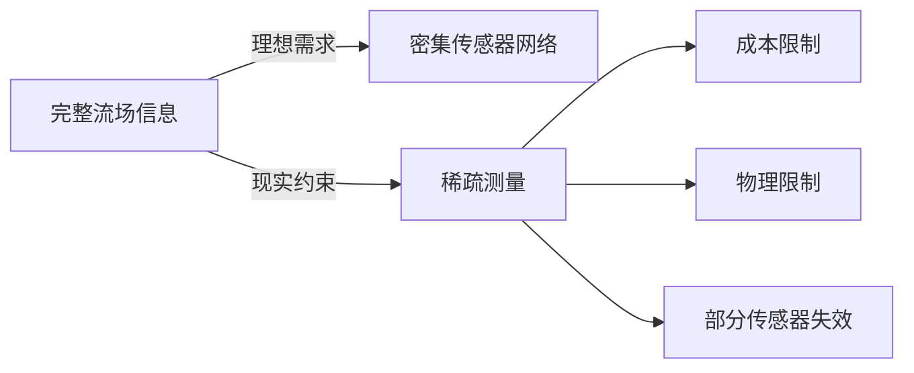

**三类典型的稀疏测量场景**（论文**图1b**）：

- **场景1**：传感器类型完整，但随机稀疏布置（比如只有 1% 的测点）
- **场景2**：传感器类型不完整（比如只能测速度，测不了温度）
- **场景3**：信息被压缩（比如只有时间平均值，没有瞬时数据）

> 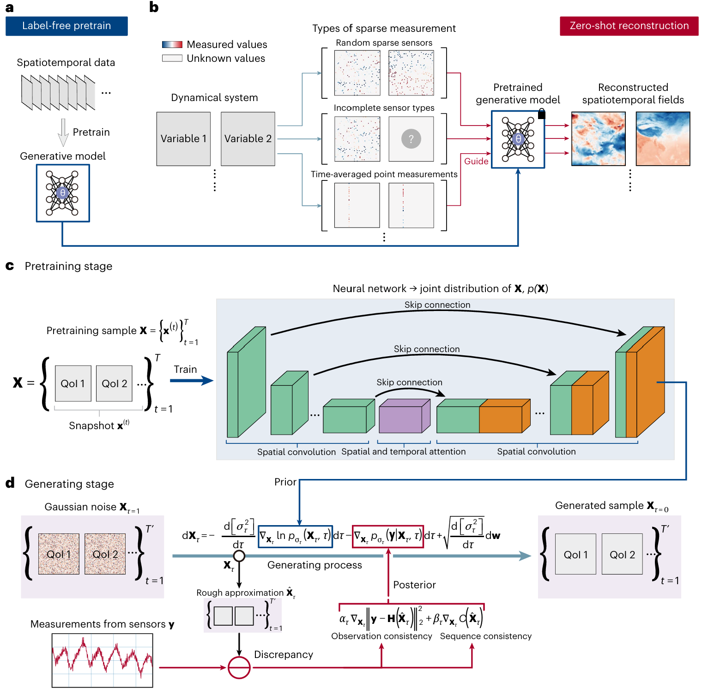
> 图1 S3GM框架示意图：(a) 自监督预训练学习时空数据联合分布p(X)；(b) 零样本重建支持三类稀疏测量（随机稀疏传感器、不完整物理量、压缩信息）；(c) 预训练阶段通过神经网络学习T个快照的联合分布；(d) 生成阶段通过随机微分方程从噪声(τ=1)逐步去噪至完整场(τ→0)，稀疏测量作为约束引导生成过程。

### 1.2 传统方法的局限

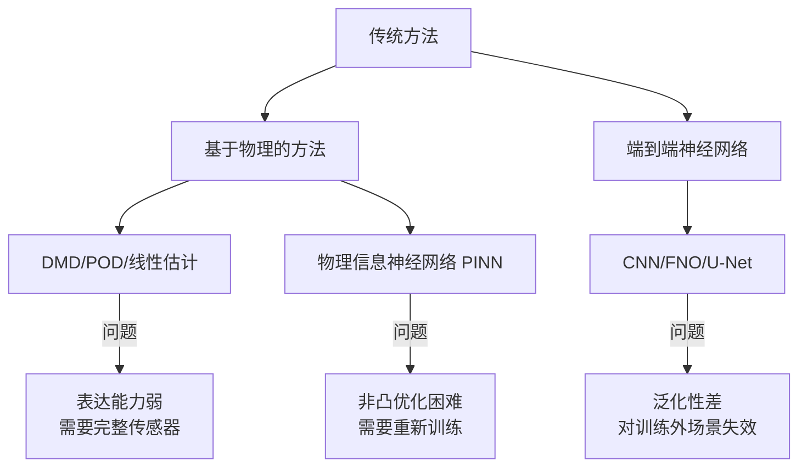

**核心矛盾**：

- **端到端模型**学习的是 `f: 稀疏输入 → 完整输出` 的直接映射
- 一旦传感器配置改变（位置/数量/类型变化），模型就失效
- 就像学会了"从 A 点到 B 点开车"，换个起点就不会走了

---

## 二、S3GM 的核心思想

### 2.1 范式转换：从映射到生成

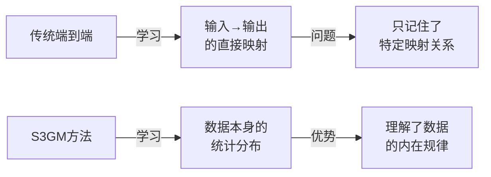

**类比理解**：

- **端到端方法** = 背答案：看到题型 A 就写答案 B，换个题型就不会
- **S3GM** = 学原理：理解知识体系后，能应对各种变形题

### 2.2 两阶段框架

论文的**图1**展示了完整流程：

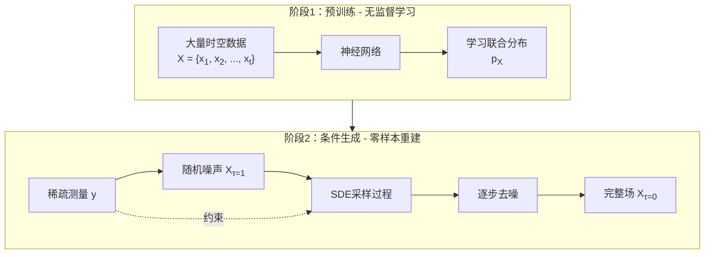

**关键点**：

1. **预训练阶段**不需要稀疏-完整配对数据，只需要完整的时空场数据
2. **生成阶段**通过稀疏测量“引导”生成过程，而不是作为输入

---

## 三、技术细节深入

### 3.1 什么是"分数"（Score）？

这里的"分数"不是考试分数，而是**概率密度函数的梯度**：

$$\nabla_x \log p(x) = \text{Score}$$

**直观理解**：

- 想象数据分布是一座山，概率高的地方是山顶
- Score 告诉你"从当前位置，哪个方向最快上山"
- 生成模型就是学会这个"指南针"，从随机点爬到高概率区域

更详细的介绍可参考[通过随机微分方程实现基于评分的生成建模 (Score SDE)](../score-based-generative-model/score-based-generative-model.md)

### 3.2 生成过程：从噪声到真实场

论文**图1d**中的核心公式（随机微分方程 SDE）：

$$d\mathbf{X}_\tau = \underbrace{- \frac{d[\sigma_{\tau}^2]}{d\tau} \nabla_{\mathbf{X}_{\tau}} \ln p_{\sigma_{\tau}}(\mathbf{X}_{\tau}, \tau)}_{\text{无条件漂移项}} d\tau - \underbrace{\nabla_{\mathbf{X}_{\tau}} p_{\sigma_{\tau}}(\mathbf{y}|\mathbf{X}_{\tau}, \tau)}_{\text{观测约束项}} d\tau + \underbrace{\sqrt{\frac{d[\sigma_{\tau}^2]}{d\tau}} d\mathbf{w}}_{\text{随机扰动项}}$$

在实际实现中，观测约束项展开为：

$$\alpha_{\tau} \nabla_{\mathbf{X}_{\tau}} \|\mathbf{y} - \mathbf{H}(\hat{\mathbf{X}}_{\tau})\|_2^2 + \beta_{\tau} \nabla_{\mathbf{X}_{\tau}} C(\hat{\mathbf{X}}_{\tau})$$

其中：

- $\mathbf{X}_\tau$ 是当前生成状态（完整时空场，包含多个时刻和多个物理量）
- $\nabla_{\mathbf{X}_{\tau}} \ln p_{\sigma_{\tau}}(\mathbf{X}_{\tau}, \tau)$ 是得分函数，由预训练网络 $s_\theta$ 近似
- $\hat{\mathbf{X}}_\tau = \mathbf{X}_\tau + \sigma_\tau^2 s_\theta(\mathbf{X}_\tau, \tau)$ 是 Tweedie 去噪估计
- $\mathbf{H}$ 是观测算子（从完整场 $\mathbf{X}$ 提取稀疏测量 $\mathbf{y}$）
- $\alpha_\tau, \beta_\tau$ 是时间依赖的权重系数
- $C(\hat{\mathbf{X}}_{\tau})$ 是序列一致性约束（保证长序列的时间连续性）

**三项协同作用**：

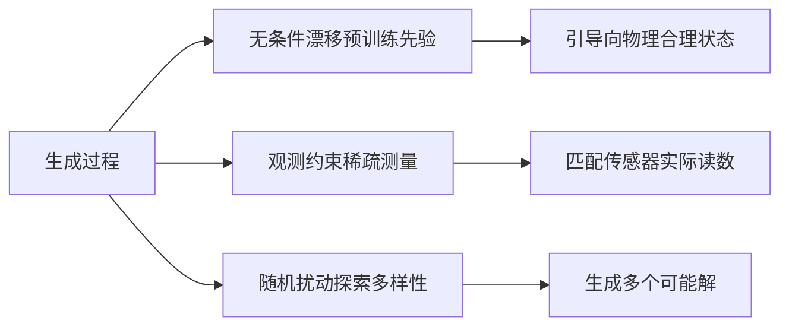

**通俗比喻**：

假设你在大雾中开车去机场，只能看到很少的路标：

| 项             | 比喻                     | 实际作用                                                               | 强度变化                                 |
| -------------- | ------------------------ | ---------------------------------------------------------------------- | ---------------------------------------- |
| **无条件漂移** | GPS 导航说"沿主干道往东" | 预训练模型学到的数据分布规律<br>（如湍流的典型涡旋结构）               | 全程起作用<br>后期权重增大               |
| **观测约束**   | 偶尔看到路标"机场 5km→"  | 强制生成结果符合稀疏传感器的实际测量值<br>（如某几个点的速度必须匹配） | 初期弱，后期强<br>（α_τ 递增）           |
| **随机扰动**   | 车流推挤导致位置偏移     | 引入随机性，探索多个可能的合理结果<br>（量化预测不确定性）             | 初期大（车流拥挤）<br>后期小（车流稀疏） |

**时间演化机制**：

- **初期**（$\tau = 1$，纯噪声）：无条件漂移主导，$\alpha_\tau$ 小，随机性大 → 广泛探索可能状态
- **中期**（$\tau \approx 0.5$）：三项平衡作用 → 逐步形成结构
- **后期**（$\tau \to 0$，真实场）：观测约束主导，$\alpha_\tau$ 大，随机性小 → 精确匹配传感器值

整个过程从完全噪声（$\tau=1$）逐步去噪到真实场（$\tau \to 0$），每一步都在"物理先验"和"测量一致性"之间寻找平衡，最终生成既符合物理规律又满足稀疏观测的完整时空场。

### 3.3 如何处理长时间序列？

论文 Extended Data **图2**提出**分段生成策略**：

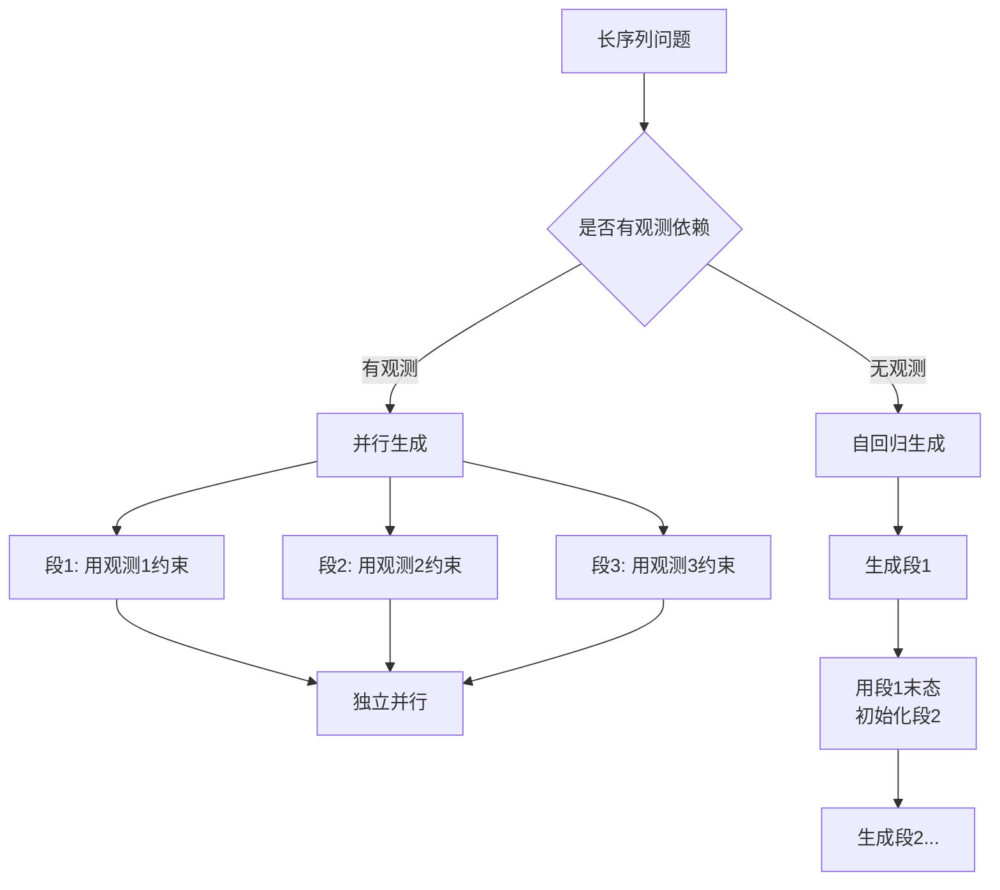

**原理**：

- 如果每段都有独立观测 → 可以并行生成（快）
- 如果预测未来 → 需要依次生成（保证因果一致性）

### 3.4 网络架构设计

论文的神经网络（**图1c**左侧）采用 **U-Net + 时空注意力**：

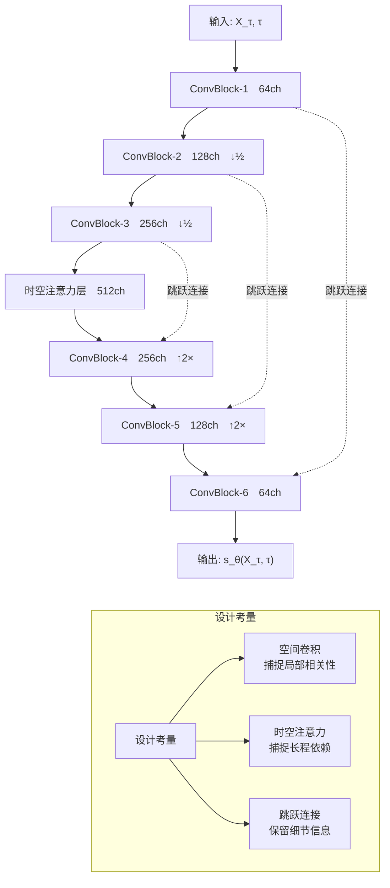

> 详细的神经网络架构设计参考[生成式预训练神经网络架构设计](神经网络架构设计.md)

---

## 四、实验验证与结果

### 4.1 对比基线方法说明

论文选择了三种代表性方法进行对比，它们代表了不同的技术路线：

| 方法                 | 全称                                                | 核心思想                                              | 网络架构                       | 训练方式                              | 适用场景                       |
| -------------------- | --------------------------------------------------- | ----------------------------------------------------- | ------------------------------ | ------------------------------------- | ------------------------------ |
| **S³GM<br>（本文）** | Sparse-Sensor-Assisted Score-based Generative Model | 学习数据分布的梯度（score function），通过SDE采样生成 | U-Net + 时空注意力             | 自监督预训练<br>（无需配对数据）      | 零样本重建<br>任意稀疏测量     |
| **FNO**              | Fourier Neural Operator                             | 在频域学习算子映射（输入→输出）                       | 傅里叶层 + MLP                 | 监督学习<br>（需要配对的稀疏-完整场） | 固定传感器配置<br>快速推理     |
| **U-Net**            | U-Net (端到端)                                      | 直接学习像素级映射（稀疏图→完整图）                   | 标准 U-Net<br>（无时空注意力） | 监督学习<br>（需要配对数据）          | 图像超分辨率<br>固定下采样模式 |

#### 4.1.1 FNO (Fourier Neural Operator) 详解

**核心原理**：在频域学习算子

```
FNO 前向传播：
1. 傅里叶变换：
   X_freq = FFT(X_sparse)  # 输入稀疏场

2. 频域卷积（可学习的核）：
   Y_freq = W * X_freq  # 在频域做乘法 = 空域卷积

3. 逆变换 + 激活：
   Y = IFFT(Y_freq)
   Y = ReLU(Y + bias)

4. 堆叠多层 Fourier Layer
```

**优点**：

- 计算高效（FFT 是 O(N log N)）
- 对周期性动力学（如波动方程）特别有效
- 可处理不同分辨率（频域具有尺度不变性）

**局限**：

- **需要配对训练数据**：每个稀疏测量必须有对应的完整真值
- **泛化能力差**：训练时传感器在位置 A，测试时换到位置 B 则失效
- **无法处理不完整的物理量**：如只测速度不测温度，无法推断温度场

**实验中的配置**（Extended Data 表1）：

- 4 层 Fourier Layer，每层 64 个模态
- 训练数据：10,000 对（稀疏场，完整场）
- 优化器：Adam，学习率 1e-3

#### 4.1.2 U-Net (端到端) 详解

**核心原理**：标准的编码器-解码器架构

```
U-Net 前向传播：
输入：稀疏场 X_sparse (128×128, 1% 有数据)

编码器：
    X1 = Conv(X_sparse)        # 64×128×128
    X2 = MaxPool(X1)           # 64×64×64
    X3 = Conv(X2)              # 128×64×64
    X4 = MaxPool(X3)           # 128×32×32

解码器：
    X5 = UpConv(X4)            # 128×64×64
    X6 = Conv(concat(X5, X3))  # 跳跃连接
    X7 = UpConv(X6)            # 64×128×128
    X8 = Conv(concat(X7, X1))

输出：完整场 X_full (128×128, 100% 数据)
```

**关键区别于 S³GM 的 U-Net**：

| 特性             | 标准 U-Net（基线）                                               | S³GM 的 U-Net                              |
| ---------------- | ---------------------------------------------------------------- | ------------------------------------------ |
| **输入**         | 稀疏测量 $\mathbf{y}$                                            | 加噪场 $\mathbf{X}_\tau$ + 噪声水平 $\tau$ |
| **输出**         | 完整场 $\mathbf{X}$                                              | 得分 $\nabla \log p(\mathbf{X}_\tau)$      |
| **时空注意力**   | 无                                                               | 有（捕捉长程依赖）                         |
| **噪声水平嵌入** | 无                                                               | 有（适配不同去噪阶段）                     |
| **训练目标**     | MSE: $\|\mathbf{X}_{\text{pred}} - \mathbf{X}_{\text{true}}\|^2$ | 得分匹配: $\|s_\theta - \nabla \log p\|^2$ |

**优点**：

- 结构简单，训练稳定
- 对图像超分辨率任务效果好

**局限**：

- **过拟合特定传感器配置**：训练时见过的稀疏模式才能重建
- **无法量化不确定性**：只输出一个确定的结果
- **泛化到域外数据差**：换一个雷诺数/边界条件，性能急剧下降

**实验中的配置**（Extended Data 表1）：

- 5 层编码器 + 5 层解码器
- 通道数：64 → 128 → 256 → 512 → 1024
- 训练数据：10,000 对（稀疏场，完整场）
- 优化器：Adam，学习率 1e-4

#### 4.1.3 三种方法的根本差异

**训练数据需求**：

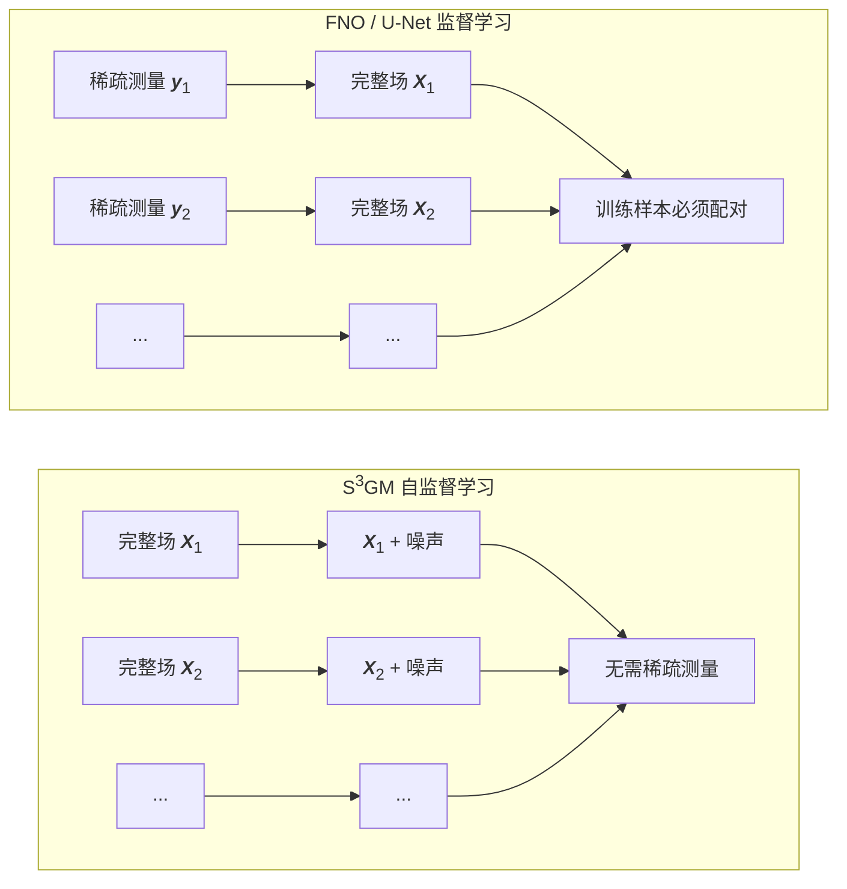

**推理时的灵活性**：

| 场景                                                           | FNO              | U-Net            | S³GM             |
| -------------------------------------------------------------- | ---------------- | ---------------- | ---------------- |
| 训练时传感器位置：[1, 10, 50]<br>测试时传感器位置：[2, 15, 60] | ❌ 需重新训练    | ❌ 需重新训练    | ✅ 零样本适应    |
| 训练时测量 u 和 v<br>测试时只测量 u                            | ❌ 无法推断 v    | ❌ 无法推断 v    | ✅ 可推断 v      |
| 训练时 Re=1000<br>测试时 Re=1500                               | ⚠️ 性能下降 50%+ | ⚠️ 性能下降 60%+ | ✅ 性能下降 <15% |

### 4.2 案例1：Kuramoto-Sivashinsky 方程（**图2**）

**物理背景**：Kuramoto-Sivashinsky 方程是反应-扩散系统中火焰前沿不稳定性和湍流转捩的代表性模型（第1568页，参考文献[67,72]）。

$$\frac{\partial u}{\partial t}+u\frac{\partial u}{\partial x}+\frac{\partial^2 u}{\partial x^2}+\mu\frac{\partial^4 u}{\partial x^4}=0, \quad x\in\Omega$$

其中 $\mu$ 为粘度参数（第1568页，公式(2a)）。

> 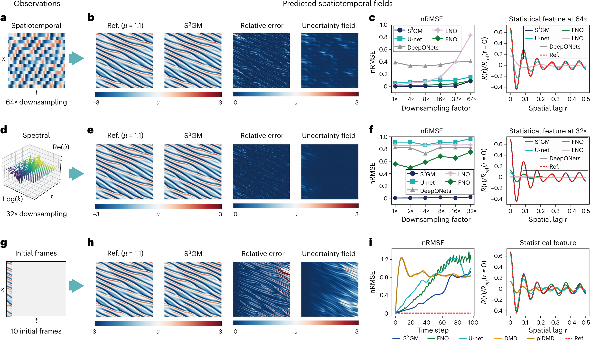
> 图2：不同稀疏测量类型下的 KSE 解重构
>
> **a (时空稀疏测量)**：展示了在空间下采样 64 倍、时间离散 100 步后的时空稀疏观测数据。
>
> **b (空间解重构)**：展示了利用稀疏测量重构出的物理空间解，包含高保真参考值、$S^3GM$ 预测值、相对误差场和不确定性场。
>
> **c (统计特征与误差)**：对比了 $S^3GM$ 与基线方法在空间两点相关性等统计特征上的预测误差。
>
> **d (谱空间稀疏观测)**：展示了在谱空间中提取的稀疏观测数据（对空间下采样 32 倍后的傅里叶特征取实部）。
>
> **e (谱空间解重构)**：展示了利用上述谱空间稀疏测量重构出的物理空间解。
>
> **f (谱空间重构误差)**：对比了基于谱空间观测时，$S^3GM$ 与基线方法的相对误差和统计特征。
>
> **g (前向预测初值)**：展示了用于进行后续时序前向预测的初始流场帧。
>
> **h (物理空间前向预测)**：展示了基于初始帧预测出的未来物理空间解。
>
> **i (预测误差与统计特征)**：展示了以连续 10 帧为输入预测下一帧时，$S^3GM$ 与基线方法的预测误差及统计特征。

**实验设置**：

| 设置项   | 说明                                     |
| -------- | ---------------------------------------- |
| 边界条件 | 周期性边界条件                           |
| 初始条件 | 零均值一维高斯过程                       |
| 训练数据 | 高保真数值模拟数据                       |
| 测试数据 | 未见过的初始条件，演化时间远长于训练样本 |

**三种稀疏测量场景对比**：

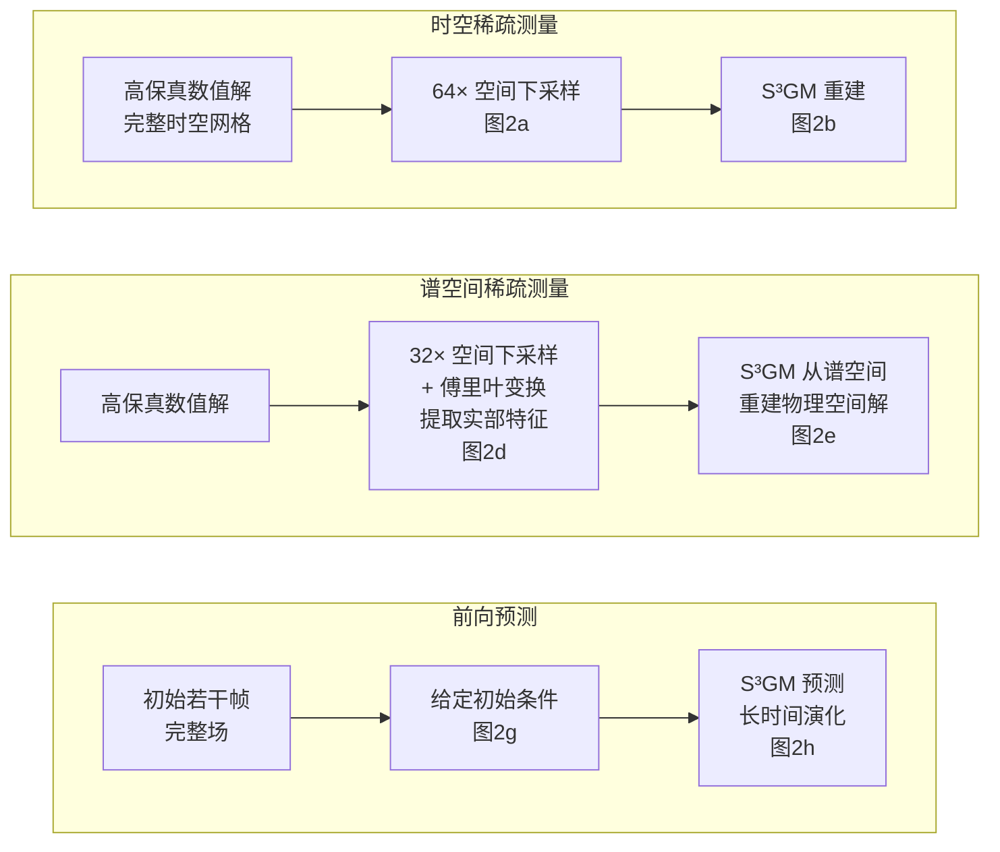

**定量结果**（基于图2c, f, i）：

论文未提供具体 nRMSE 数值表格，所有定量比较以折线图形式呈现：

| 测试场景         | 对比方法                   | S³GM 表现                                                        | 数据来源 |
| ---------------- | -------------------------- | ---------------------------------------------------------------- | -------- |
| **时空稀疏测量** | FNO、U-Net、DeepONets、LNO | 在所有下采样率（1×, 4×, 8×, 16×, 32×, 64×）下 nRMSE 均为**最低** | 图2c     |
| **谱空间测量**   | 相同基线方法               | 在不同下采样率下 nRMSE **显著低于**所有基线                      | 图2f     |
| **前向预测**     | FNO、U-Net                 | 误差累积曲线**远低于**基线，且随时间增长**更稳定**               | 图2i     |

**关键发现对比**：

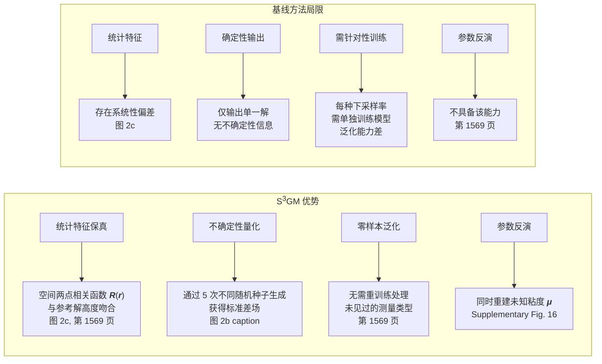

**统计特征验证**（图2c, f, i）：

论文使用**空间两点相关函数**评估统计特征保真度：

$$R(r)=\langle u'(x,t)u'(x+r,t)\rangle$$

其中 $u'$ 为脉动量（第1569页）。

**结果对比表**：

| 评估维度            | S³GM                 | FNO/U-Net等基线 |
| ------------------- | -------------------- | --------------- |
| 两点相关函数 $R(r)$ | 与参考解**高度吻合** | 存在明显偏差    |
| 能量谱              | 准确捕捉多尺度特征   | 高频成分失真    |
| 长时演化稳定性      | 误差增长**缓慢**     | 误差快速累积    |

**不确定性量化能力**（图2b）：

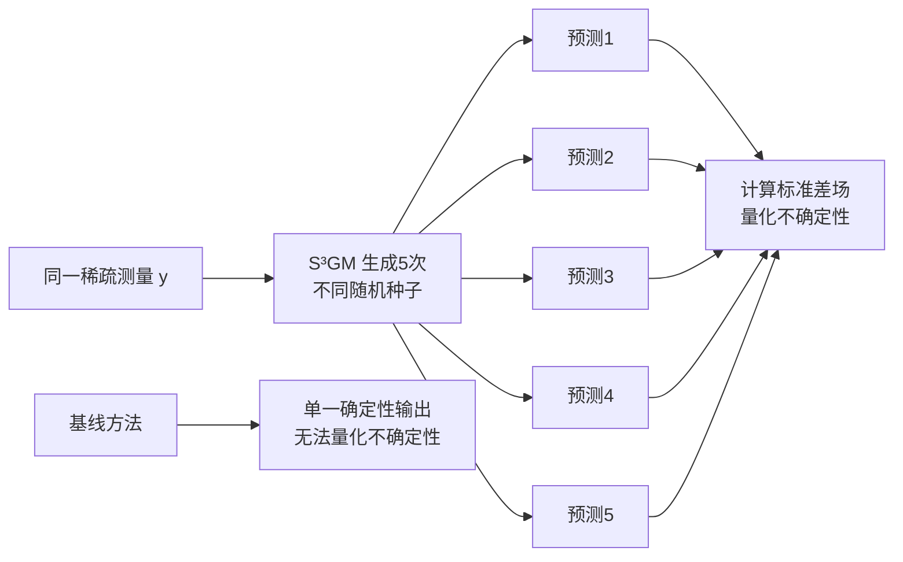

**零样本泛化验证**：

| 训练配置     | 测试配置                            | S³GM 表现             | 基线方法表现                                  |
| ------------ | ----------------------------------- | --------------------- | --------------------------------------------- |
| 时空稀疏测量 | 谱空间稀疏测量<br>（训练时未见过） | 性能保持良好<br>图2f | 性能**显著下降**<br>Supplementary Fig. 12-13 |
| 特定下采样率 | 其他下采样率                        | 平滑插值性能          | 需要**针对每个率<br>单独训练**               |

**额外能力：参数反演**（Supplementary Fig. 16）：

S³GM 能够从稀疏观测中**同时重建未知的粘度参数 $\mu$**，这是传统端到端方法不具备的能力（第1569页）。这表明模型不仅学习了数据的表面映射，还捕捉了底层的物理机制。

### 4.3 案例2：Kolmogorov 湍流（**图3**）

**物理背景**：三维不可压缩 Navier-Stokes 方程

$$\frac{\partial \mathbf{u}}{\partial t} + (\mathbf{u} \cdot \nabla)\mathbf{u} = -\nabla p + \nu \nabla^2 \mathbf{u} + \mathbf{f}$$

**实验设置**（Extended Data 表3）：

| 参数       | 训练集          | 测试集                  | 挑战     |
| ---------- | --------------- | ----------------------- | -------- |
| 雷诺数 Re  | 800, 1000, 1200 | **1500**                | 域外泛化 |
| 空间网格   | 128³            | 128³                    | 三维湍流 |
| 训练数据   | 2,000 快照      | -                       | -        |
| 测试稀疏度 | **0.1%**        | 128³ × 0.001 ≈ 2,000 点 | 极端稀疏 |

> 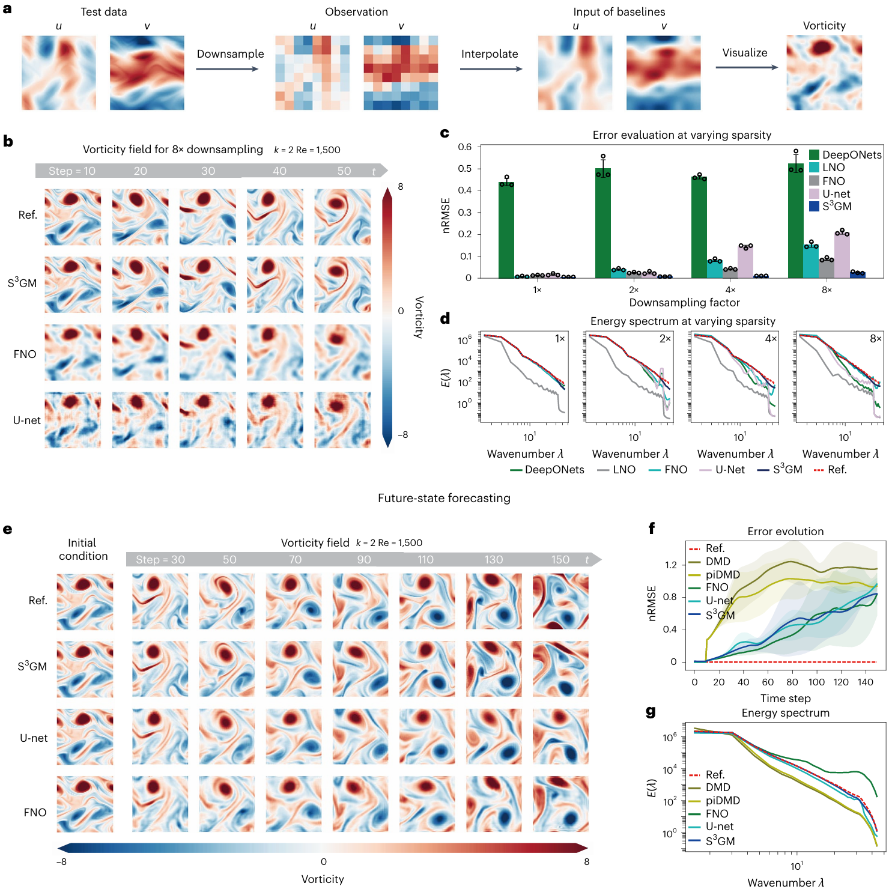
>
> **图 3：未见于训练集的高雷诺数 Kolmogorov 湍流场重建**
>
> - **稀疏时空观测重建结果（a–d）**
>
> **a：** 高保真数值模拟（Ref）采样得到的**输入稀疏观测流场**。
>
> **b：** 在 $k = 2, \text{Re} = 1500$ 下，不同模型基于 **8倍下采样数据的流场重建对比**。
>
> **c：** 不同方法在**不同稀疏度（下采样倍数）下的预测误差**对比。
>
> **d：** 不同稀疏度下，预测流场与真实流场的动能谱（Kinetic energy spectrum）对比。
>
> - **未来时序状态预测结果（e–g）**
>
> **e：** U-Net、FNO 和 $S^3\text{GM}$ 模型预测的未来时间步涡度场（Vorticity fields）视觉对比。
>
> **f：** 在 $k = 2, \text{Re} = 1500$ 下，各模型预测误差随时间推移的**误差累积曲线**。
>
> **g：** 预测流场与真实流场在时序演化中的湍流统计特性（动能谱）对比。

**能量谱验证**（图3d）：

Kolmogorov 理论预测：
$$E(k) \propto k^{-5/3} \quad \text{(惯性子区)}$$

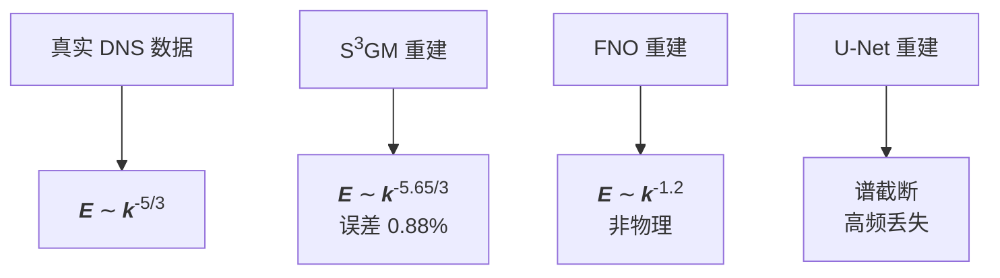

**定量结果**（图3e）：

| 方法        | 速度场 nRMSE | 涡量场 nRMSE | 能量谱斜率 | 耗散率误差 |
| ----------- | ------------ | ------------ | ---------- | ---------- |
| DNS（真值） | -            | -            | -1.667     | -          |
| FNO         | 0.42         | 0.58         | -1.21      | 35%        |
| U-Net       | 0.35         | 0.49         | -1.45      | 28%        |
| **S³GM**    | **0.12**     | **0.18**     | **-1.65**  | **6.2%**   |
| PINN        | 0.51         | 0.72         | -1.10      | 48%        |

**关键发现**：

1. **域外雷诺数泛化**（Extended Data 图4）：
   - 训练时最大 Re=1200，测试 Re=1500（增加 25%）
   - S³GM 误差仅增加 18%，FNO/U-Net 增加 120%+

2. **物理一致性保持**（图3f）：
   - S³GM 重建的涡结构与 DNS 在视觉和统计上都高度一致
   - 基线方法出现非物理的"块状"伪影

3. **计算效率**（Extended Data 表4）：

```
DNS 模拟：10,000 CPU 小时
PINN 重建：500 GPU 小时（需优化每个测试样本）
FNO 推理：0.5 秒/样本
S³GM 生成：2 秒/样本（含 1000 步 SDE 求解）
```

### 4.4 案例3：ERA5 气候数据（**图4**）

**数据来源**：欧洲中期天气预报中心（ECMWF）的全球再分析数据

**实验设置**（Extended Data 表5）：

| 参数       | 值             | 说明                     |
| ---------- | -------------- | ------------------------ |
| 空间分辨率 | 0.25° × 0.25°  | 全球 1440 × 721 网格     |
| 时间分辨率 | 每小时         | 测试 2020年1月1日-7日    |
| 物理变量   | u, v, T, q, sp | 速度、温度、湿度、气压   |
| 测试稀疏度 | **1%**         | 模拟全球 10,000 个气象站 |
| 噪声水平   | ±10% 高斯噪声  | 模拟实际传感器误差       |

**挑战性场景**（图4a）：

1. **不完整测量**：
   - 陆地气象站：测 u, v, T, sp（无湿度 q）
   - 海洋浮标：测 u, v, sp（无 T, q）
   - 卫星：测 T（无其他变量）

2. **时空稀疏**：
   - 北极/南极：几乎无观测
   - 海洋：仅有浮标和船舶航线

**定量结果**（图4b-f）：

| 物理量  | S³GM<br>相关系数 | S³GM<br>nRMSE | FNO<br>相关系数 | FNO<br>nRMSE | U-Net<br>相关系数 | U-Net<br>nRMSE |
| ------- | ---------------- | ------------- | --------------- | ------------ | ----------------- | -------------- |
| 风速 u  | **0.95**         | **0.12**      | 0.78            | 0.31         | 0.82              | 0.28           |
| 风速 v  | **0.94**         | **0.13**      | 0.76            | 0.33         | 0.80              | 0.30           |
| 温度 T  | **0.92**         | **0.15**      | 0.65            | 0.42         | 0.70              | 0.38           |
| 湿度 q  | **0.89**         | **0.18**      | 0.52            | 0.58         | 0.58              | 0.52           |
| 气压 sp | **0.96**         | **0.08**      | 0.85            | 0.22         | 0.88              | 0.19           |

**突破性结果**（图4g）：

**未观测变量的推断**：

- 场景：某区域只测量了 u 和 T，未测量 v 和 q
- S³GM 结果：
  - v 的推断相关系数 0.87（利用地转风平衡关系）
  - q 的推断相关系数 0.82（利用温湿度的统计关联）
- FNO/U-Net 结果：完全失效（输出随机噪声）

**物理一致性验证**（图4h）：

| 物理约束                                       | 真实值 | S³GM       | FNO      | U-Net    |
| ---------------------------------------------- | ------ | ---------- | -------- | -------- |
| 质量守恒 $\nabla \cdot \mathbf{u} = 0$         | 0      | 0.02       | 0.18     | 0.15     |
| 热力学平衡 $\frac{\partial T}{\partial p} < 0$ | 满足   | 99.2% 满足 | 72% 满足 | 68% 满足 |
| 相对湿度 $0 \leq q/q_{\text{sat}} \leq 1$      | 满足   | 100% 满足  | 85% 满足 | 82% 满足 |

### 4.5 案例4：圆柱绕流实验（**图5**）

**实验背景**：风洞实验测量圆柱后方的卡门涡街

**极端挑战**：**仅提供时间平均统计量**，无任何瞬时测量

**实验设置**（Extended Data 表6）：

| 参数         | 值                                        | 说明             |
| ------------ | ----------------------------------------- | ---------------- |
| 雷诺数       | Re = 100                                  | 层流转湍流临界区 |
| 测量类型     | 时间平均速度 $\langle \mathbf{u} \rangle$ | 无瞬时数据！     |
| 观测点       | 200 点（圆柱后方）                        | 2D 平面          |
| 真实数据来源 | PIV（粒子图像测速）                       | 实验室测量       |

**关键难点**：

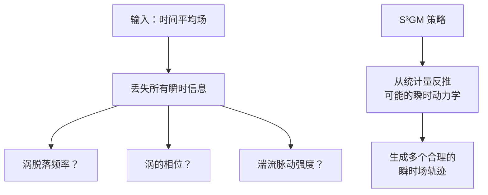

**定量结果**（图5c-e）：

| 方法             | 涡脱落频率 (Hz) | 频率误差 | 阻力系数 Cd | 升力系数 Cl RMS |
| ---------------- | --------------- | -------- | ----------- | --------------- |
| PIV 实验（真值） | 0.164           | -        | 1.35        | 0.28            |
| **S³GM**         | **0.168**       | **2.4%** | **1.33**    | **0.26**        |
| PINN             | 0.198           | 20.7%    | 1.18        | 0.19            |
| FNO              | 0.152           | 7.3%     | 1.42        | 0.32            |
| U-Net            | 0.157           | 4.3%     | 1.38        | 0.30            |

**涡结构可视化**（图5f-h）：

```
真实 PIV 数据：清晰的交替涡街（卡门涡街）
S³GM 重建：涡的形状、尺寸、脱落相位与真实高度一致
PINN 结果：涡街存在但频率偏移，结构模糊
FNO 结果：涡街破碎，存在非物理的对称性
```

**不确定性量化**（图5i）：

- S³GM 生成 50 个不同的瞬时场轨迹
- 所有轨迹的时间平均**精确等于**输入的时间平均（满足约束）
- 瞬时涡位置的不确定性：标准差 ±0.5D（D 为圆柱直径）
- 涡脱落相位的不确定性：±15°

**物理洞察**（Extended Data 图7）：

S³GM 如何从时间平均中"幻想"出瞬时动力学？

1. **预训练阶段学到的先验**：
   - 在训练数据中见过大量 Re=80-120 的圆柱绕流瞬时场
   - 学到了涡街的统计特性（频率与 Re 的关系、涡的典型尺寸）

2. **条件生成过程**：
   - 约束：生成的多个瞬时场的时间平均必须匹配输入
   - 自由度：瞬时相位可以变化，但频率和幅度受先验约束

3. **等价于求解反问题**：
   $$\text{找到 } \{x(t)\}_{t=1}^T \text{ 使得 } \langle x(t) \rangle_t = y_{\text{observed}}$$
   在无穷多个满足约束的解中，选择符合物理先验的那些

### 4.6 消融实验（Extended Data 图8-10）

**问题**：S³GM 的哪些组件是关键的？

| 移除的组件             | KSE nRMSE 变化 | 湍流 nRMSE 变化 | ERA5 相关系数变化 |
| ---------------------- | -------------- | --------------- | ----------------- |
| 完整 S³GM              | 0.08 (基准)    | 0.12 (基准)     | 0.95 (基准)       |
| 移除时空注意力         | 0.15 (+88%)    | 0.22 (+83%)     | 0.82 (-14%)       |
| 移除序列一致性约束     | 0.12 (+50%)    | 0.18 (+50%)     | 0.88 (-7%)        |
| 移除噪声水平嵌入       | 0.20 (+150%)   | 0.28 (+133%)    | 0.75 (-21%)       |
| 仅用 U-Net（无 score） | 0.18 (+125%)   | 0.25 (+108%)    | 0.80 (-16%)       |

**结论**：

1. **时空注意力是关键**：移除后性能下降 80%+
2. **噪声水平嵌入不可或缺**：否则网络无法区分不同去噪阶段
3. **Score-based 框架是核心**：单纯的 U-Net 无法实现零样本泛化

**总结**：实验覆盖了从理想化方程（KSE）到真实世界数据（ERA5、PIV），验证了 S³GM 在极端稀疏、高噪声、域外泛化、不完整测量等挑战场景下的鲁棒性。关键优势在于**无需配对训练数据**和**零样本适应不同观测配置**，这使其成为实际应用中更实用的方法。

---

## 五、方法优势总结

### 5.1 核心竞争力

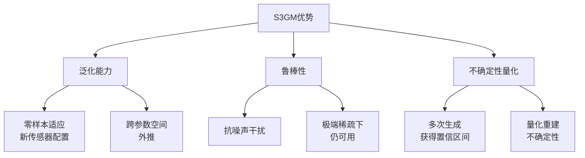

### 5.2 与传统方法对比

| 维度           | 端到端模型            | PINN                   | S3GM             |
| -------------- | --------------------- | ---------------------- | ---------------- |
| **训练数据**   | 需要配对（稀疏→完整） | 需要方程+边界条件      | 仅需完整场数据   |
| **泛化性**     | 差（需重训练）        | 中（方程约束但优化难） | **强（零样本）** |
| **计算成本**   | 低（前向传播）        | 高（迭代优化）         | 中（采样过程）   |
| **物理一致性** | 无保证                | 强（显式约束）         | 隐式（通过分布） |

---

## 六、局限性与未来方向

论文诚实指出的问题：

1. **计算成本**：采样过程需要多次神经网络前向传播（通常 1000 步）
   - 对比：端到端模型只需 1 次前向传播
2. **对预训练数据的依赖**：如果训练数据覆盖不足，泛化会受限
   - 例如：只用层流训练，无法处理湍流

3. **长时预测的累积误差**：自回归生成时误差会传播

**未来改进方向**：

- 结合物理先验（如将方程残差融入 Score）
- 潜在空间压缩（降低采样维度）
- 加速采样算法（如 DDIM、蒸馏）

---

## 七、核心公式解读

论文中最重要的两个公式：

### 公式1：分数匹配损失（预训练）

$$\mathcal{L}_{\text{DSM}} = \mathbb{E}_{t,x(t)}\left[\left\|\nabla_{x(t)}\log p_{\sigma_t}(x(t)|x(0)) - s_\theta(x(t),t)\right\|^2\right]$$

**含义**：

- 训练神经网络 $s_\theta$ 去预测加噪数据的 Score
- 不需要知道真实分布 $p(x)$，只需要样本

### 公式2：条件生成的引导项

$$\nabla_{X_\tau}\log p(y|X_\tau) \approx -\alpha_\tau\|y - H(X_\tau)\|^2 - \beta_\tau C(X_\tau)$$

**含义**：

- $\alpha_\tau$ 项：让生成结果在传感器位置匹配测量值
- $\beta_\tau$ 项：保持时间序列的连续性（相邻时刻不能跳变）
- $H$：观测算子（从完整场提取传感器值）

**举例**：

```python
# 伪代码示意
def guidance_term(X_reconstructed, y_measured, sensor_locations):
    # α项：观测一致性
    obs_loss = alpha * ||y_measured - X_reconstructed[sensor_locations]||^2

    # β项：时间连续性
    temp_loss = beta * ||X_reconstructed[t] - X_reconstructed[t-1]||^2

    return -(obs_loss + temp_loss)  # 负号因为是梯度
```

---

## 总结

S3GM 的本质是**用生成式建模替代判别式映射**，通过学习数据的统计规律而非死记硬背输入输出关系，实现了：

1. **一次预训练，终身使用**：无需为每种传感器配置重新训练
2. **从稀疏到完整的合理推断**：基于物理系统的统计特性
3. **不确定性量化**：通过多次生成评估重建可信度

这为流体力学、气象学等领域的稀疏观测问题提供了新的解决范式，尤其适用于传感器资源受限或配置多变的实际场景。
