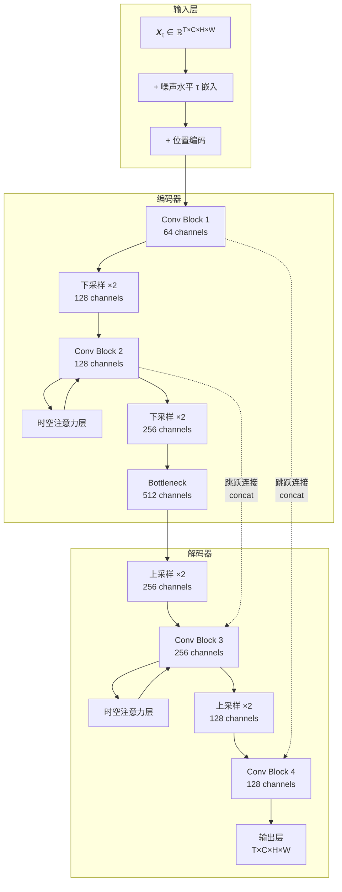

# 生成式预训练神经网络架构设计

论文的核心是训练一个神经网络 $s_\theta(\mathbf{X}_\tau, \tau)$ 来近似得分函数 $\nabla_{\mathbf{X}_{\tau}} \ln p_{\sigma_{\tau}}(\mathbf{X}_{\tau}, \tau)$。这个网络需要同时处理**空间结构**（如涡旋的形状）和**时间演化**（如波的传播），论文采用了**[U-Net](../../../part3_advance/3.5_UNet/3.5_UNet.md) + 时空[注意力](../../../part3_advance/3.6_MHA/3.6_MHA.md)**的混合架构。

### 1. 整体架构：编码器-解码器 + 跳跃连接

**基础结构**（Extended Data 图1a）：



**维度说明**：

- $T$：时间步数（如 10 个连续时刻）
- $C$：通道数（如速度场 u、v、压力 p → C=3）
- $H \times W$：空间分辨率（如 128×128 网格）
- 输入 $\mathbf{X}_\tau \in \mathbb{R}^{T \times C \times H \times W}$
- 输出 $s_\theta(\mathbf{X}_\tau, \tau) \in \mathbb{R}^{T \times C \times H \times W}$（与输入同维度）

### 2. 核心模块 1：空间卷积块

**作用**：捕捉局部空间相关性（如涡旋的边界、温度梯度）

**具体实现**（Extended Data 图1b）：

```
Conv Block = {
    Conv2D(kernel=3×3, stride=1, padding=1)  # 保持分辨率
    + GroupNorm(groups=8)                    # 归一化（优于 BatchNorm）
    + SiLU 激活函数                           # 平滑非线性
    + Conv2D(kernel=3×3, stride=1, padding=1)
    + GroupNorm + SiLU
    + 残差连接                                # 加速收敛
}
```

**关键设计**：

- **为何用 3×3 卷积？**  
  捕捉最近邻相互作用（如热扩散只影响相邻网格）
  
- **为何用 GroupNorm 而非 BatchNorm？**  
  时空数据的 batch size 通常很小（受内存限制），GroupNorm 对 batch size 不敏感

- **残差连接的作用**：  
  允许梯度直接传播，训练更深的网络（论文用了 6 层）

### 3. 核心模块 2：时空注意力层

**作用**：捕捉长程时空依赖（如 t=0 的扰动影响 t=10 的结果）

**具体实现**（Extended Data 图1c）：

```
时空注意力层 = {
    # 第一步：空间注意力
    将 X reshape 为 (T, HW, C)  # 时间维度独立
    Q = Linear(X), K = Linear(X), V = Linear(X)
    Attention_spatial = Softmax(QK^T / √d_k) V

    # 第二步：时间注意力
    将 Attention_spatial reshape 为 (HW, T, C)  # 空间维度独立
    Q = Linear(X), K = Linear(X), V = Linear(X)
    Attention_temporal = Softmax(QK^T / √d_k) V

    # 输出
    return Attention_temporal + X  # 残差连接
}
```

**关键设计**：

| 特性               | 实现方式                           | 为什么重要                           |
| ------------------ | ---------------------------------- | ------------------------------------ |
| **分离时空注意力** | 先计算空间注意力，再计算时间注意力 | 计算量降低：O(T²HW) → O(THW + T²C)   |
| **多头注意力**     | 8 个并行的注意力头                 | 同时捕捉多种模式（如不同尺度的涡旋） |
| **相对位置编码**   | 在 QK^T 中加入距离偏置项           | 保持平移不变性（物理定律不随位置变） |

**直观理解**：

- **空间注意力**：某点的温度受周围哪些点影响？（可能相距很远，如对流）
- **时间注意力**：当前时刻受过去哪些时刻影响？（如周期性振荡）

### 4. 噪声水平编码 $\tau$

**问题**：网络需要知道"当前噪声有多大"才能正确去噪

**解决方案**（Extended Data 图1d）：

```
噪声水平嵌入 = {
    # Transformer 风格的正弦位置编码
    embed_τ = [sin(τ / 10000^(2i/d)), cos(τ / 10000^(2i/d))]  # d=128 维

    # 投影到网络维度
    τ_feature = MLP(embed_τ)  # → 512 维

    # 注入到每个 Conv Block
    X = X + τ_feature.reshape(1, 512, 1, 1)  # 广播到空间维度
}
```

**为何重要？**  
初期（$\tau=1$，高噪声）：网络学习粗略结构  
后期（$\tau \to 0$，低噪声）：网络学习精细细节  
没有 $\tau$ 嵌入，网络无法区分这两种情况

### 5. 完整前向传播流程

**输入**：

- $\mathbf{X}_\tau \in \mathbb{R}^{10 \times 3 \times 128 \times 128}$（10 时刻，3 变量，128×128 空间网格）
- $\tau = 0.5$（当前噪声水平）

**步骤**：

```
1. 噪声嵌入：
   X = X + embed(τ)  # 每个空间点都加上 τ 的特征

2. 编码器（下采样 2 次）：
   X1 = ConvBlock(X)          # 64×128×128
   X2 = Downsample(X1)        # 128×64×64
   X3 = ConvBlock(X2)         # 128×64×64
   X4 = Downsample(X3)        # 256×32×32
   X5 = ConvBlock(X4)         # 256×32×32

3. 瓶颈层（加时空注意力）：
   X6 = SpatioTemporalAttention(X5)  # 512×32×32

4. 解码器（上采样 2 次，带跳跃连接）：
   X7 = Upsample(X6)                    # 256×64×64
   X8 = ConvBlock(concat(X7, X3))       # 跳跃连接
   X9 = Upsample(X8)                    # 128×128×128
   X10 = ConvBlock(concat(X9, X1))      # 跳跃连接

5. 输出层：
   score = Conv(X10)  # 3×128×128（与输入同维度)
```

**输出**：$s_\theta(\mathbf{X}_\tau, \tau) \in \mathbb{R}^{10 \times 3 \times 128 \times 128}$，即每个时空点的得分向量

### 6. 训练目标：去噪得分匹配

**损失函数**（Extended Data 公式 3）：

$$\mathcal{L}(\theta) = \mathbb{E}_{\mathbf{X}_0, \tau, \epsilon} \left[ \lambda(\tau) \left\| s_\theta(\mathbf{X}_\tau, \tau) - \nabla_{\mathbf{X}_\tau} \log p(\mathbf{X}_\tau | \mathbf{X}_0) \right\|_2^2 \right]$$

其中：

- $\mathbf{X}_0$：从训练集采样的真实时空场
- $\mathbf{X}_\tau = \mathbf{X}_0 + \sigma_\tau \epsilon$：加噪后的样本（$\epsilon \sim \mathcal{N}(0, I)$）
- $\nabla_{\mathbf{X}_\tau} \log p(\mathbf{X}_\tau | \mathbf{X}_0) = -\frac{\epsilon}{\sigma_\tau}$（解析解！）
- $\lambda(\tau) = \sigma_\tau^2$：噪声水平相关的权重

**训练伪代码**：

```
for epoch in range(num_epochs):
    for X_0 in dataloader:  # X_0 是真实时空场
        # 1. 随机采样噪声水平
        τ = uniform(0, 1)
        σ_τ = noise_schedule(τ)

        # 2. 加噪
        ε = randn_like(X_0)
        X_τ = X_0 + σ_τ * ε

        # 3. 网络预测得分
        s_pred = model(X_τ, τ)

        # 4. 真实得分（解析解）
        s_true = -ε / σ_τ

        # 5. 计算损失并反向传播
        loss = σ_τ^2 * ||s_pred - s_true||^2
        loss.backward()
```

**为何这个目标有效？**  
训练后，网络学会了"从 $\mathbf{X}_\tau$ 中去除噪声 $\epsilon$"，等价于学习真实数据分布的梯度。

### 7. 架构设计的物理考量

| 设计选择       | 物理动机                                               | 数学体现                                              |
| -------------- | ------------------------------------------------------ | ----------------------------------------------------- |
| **U-Net 结构** | 需要同时捕捉粗粒度（大尺度涡旋）和细粒度（小尺度扰动） | 下采样捕捉全局，上采样恢复细节                        |
| **跳跃连接**   | 保留高频信息（如湍流的精细结构）                       | 防止信息在多层传播中丢失                              |
| **时空注意力** | 捕捉非局部相互作用（如波的传播）                       | 计算任意两点间的相关性                                |
| **GroupNorm**  | 不同物理量（速度、温度）的量纲不同                     | 对每个通道独立归一化                                  |
| **残差连接**   | 物理演化通常是连续的（小步更新）                       | $\mathbf{X}_{t+1} = \mathbf{X}_t + \Delta \mathbf{X}$ |

### 8. 与传统方法的对比

| 方法             | 网络输入                                   | 网络输出             | 泛化能力                   |
| ---------------- | ------------------------------------------ | -------------------- | -------------------------- |
| **端到端 CNN**   | 稀疏测量 $\mathbf{y}$                      | 完整场 $\mathbf{X}$  | 差（换传感器位置需重训练） |
| **PINN**         | 坐标 $(x, y, t)$                           | 物理量 $u(x,y,t)$    | 中（需要知道精确的 PDE）   |
| **S³GM（本文）** | 加噪场 $\mathbf{X}_\tau$ + 噪声水平 $\tau$ | 得分 $\nabla \log p$ | 强（零样本适配不同传感器） |

**关键优势**：S³GM 的网络不直接学习测量到场的映射，而是学习数据分布本身，因此可以在推理时灵活适配不同的观测条件。

**总结**：论文的网络架构是一个精心设计的"时空去噪器"，通过空间卷积捕捉局部模式，通过时空注意力捕捉长程依赖，通过噪声水平嵌入适配不同的去噪阶段。这个架构的核心创新在于**不学习直接映射，而是学习分布的梯度**，从而获得零样本泛化能力。
