# 基于物理信息神经网络（PINNs）重建湍流场：从零到实战教程

> **上传者**：[XYChouMian](https://github.com/XYChouMian)  
> **论文标题**：[Reconstructing turbulent velocity and pressure fields from under‑resolved noisy particle tracks using physics‑informed neural networks](https://link.springer.com/article/10.1007/s00348-023-03629-4)  
> **论文PDF**：[paper.pdf](paper.pdf)  
> **阅读时间**：2026-5-31

---

## 论文精髓快速阅读

**论文DNA**
本文提出了一种基于物理信息神经网络（PINN）的新方法，用于从欠分辨、含噪声的粒子轨迹中高精度重建湍流速度场与压力场，并在合成与实验数据上验证了其优于传统约束成本最小化（CCM）方法的鲁棒性与准确性。

### **知识向量（4维度摘要）**

**维度一：问题定义与挑战**
在实验流体力学中，体成像技术虽能获取粒子轨迹，但从中重建完整、结构化的欧拉速度场与压力场仍面临两大挑战：① 粒子数据通常欠分辨（空间稀疏）且含测量噪声；② 传统方法需先插值速度场再求解压力泊松方程，误差易累积。本文旨在通过PINN实现**端到端的联合重建**，直接利用 N-S 方程作为物理约束进行正则化。

**维度二：PINN方法设计**

- **网络架构**：全连接神经网络，输入为时空坐标 $(x, y, z, t)$，输出为速度 $(u, v, w)$ 与压力 $p$。
- **损失函数**：包含数据拟合项 $L_d$、不可压缩条件残差 $L_i$ 与动量方程残差 $L_m$，总损失为 $L = \lambda_d L_d + \lambda_i L_i + \lambda_m L_m$。
- **超参数平衡**：基于流动尺度分析（式8-10）与梯度平衡算法（式11）动态调整 $\lambda_d$，避免优化偏差。
- **归一化层**：输入采用min-max归一化，输出采用z-score归一化，以提升训练稳定性。

> 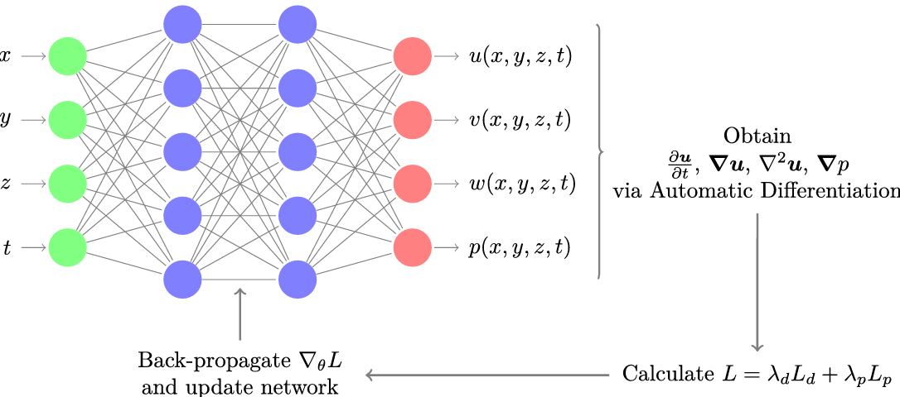
> 图1: PINN 网络和训练流程

**维度三：实验设计与数据集**研究涵盖三个案例，均以粒子轨迹为输入（示例如**图2**）：

> 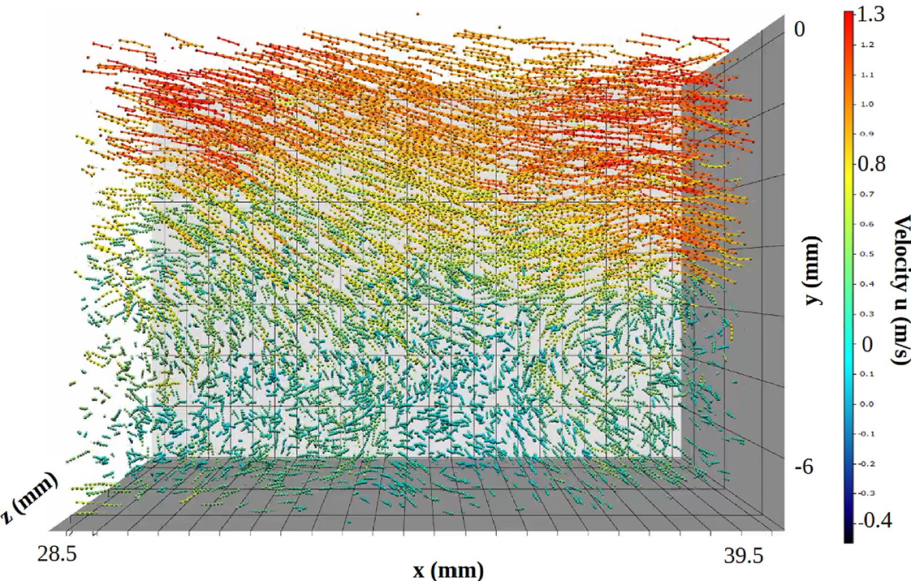
> 图2: 合成与实验粒子轨迹示意图

1. **Case 1（合成粒子轨迹，DNS湍流通道）**：分析粒子间距（$3.4\delta_v–8.4\delta_v$）与噪声水平（0–0.8像素）对重建精度的影响。
2. **Case 2（合成层析图像，DNS通道）**：通过EUROPIV合成图像生成器模拟实验误差，重建长达2000帧的流动历史。
3. **Case 3（实验数据，后向台阶剪切层）**：$Re_\tau=800$，使用四相机层析PTV与Shake-the-Box算法获取轨迹，重建900帧（实验配置见**图3**）。

> 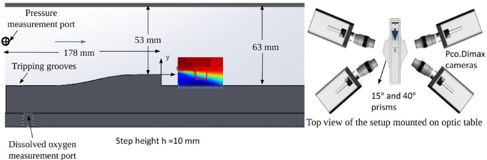
> 图3: 湍流剪切层实验设置示意图

**维度四：结果与性能评估**

- **定性对比**：PINN与CCM均能较好重建速度与压力场（**图4**），PINN结果更平滑。

> 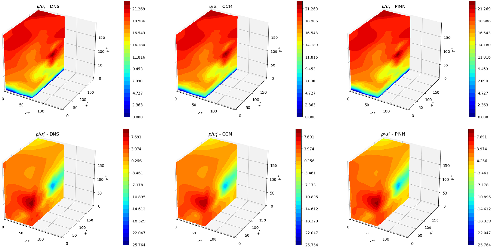
> 图4: 真实场、CCM重建场与PINN重建场的可视化对比

- **定量误差**：以均方根误差（RMSE）与相关系数为指标。在无噪声条件下，PINN对速度重建的鲁棒性随粒子间距增大而优于CCM（**图6**），压力重建误差在近壁区略高于CCM（**图7**）。

> 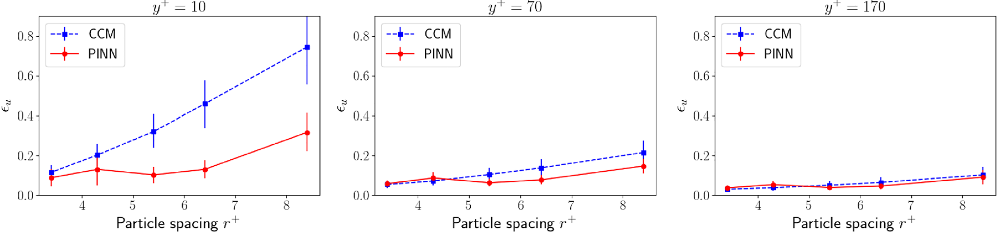
> 图6: 不同高度处速度重建RMSE随粒子间距的变化
>
> 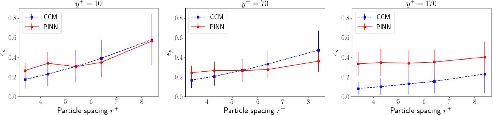
> 图7: 压力重建RMSE随粒子间距的变化

- **噪声鲁棒性**：PINN在噪声水平达0.8像素时仍保持稳定，CCM误差增长更快。
- **训练动态**：损失函数中数据项与物理项经平衡后同步下降（**图5**），验证了超参数调节的有效性。

> 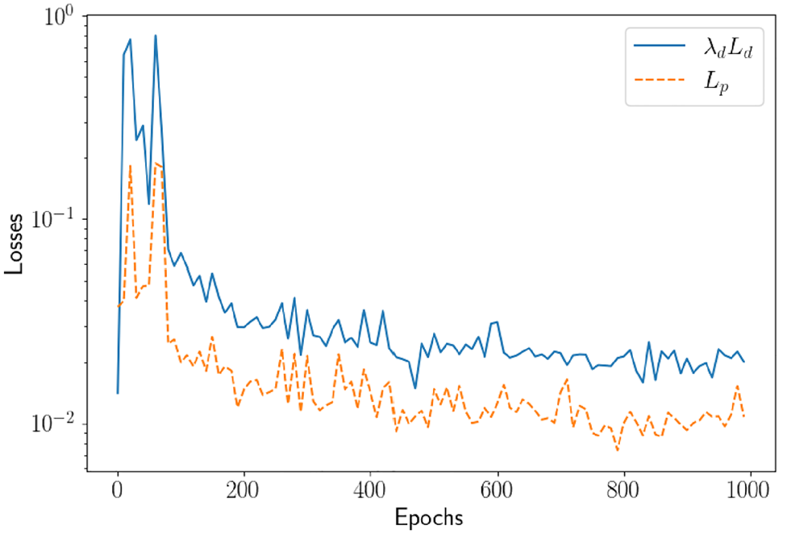
> 图5: 加权数据损失与物理损失随训练epoch的变化

### **贡献网格（量化指标对比）**

|     **指标**     |             **PINN**             |            **CCM**            |          **优势分析**          |
| :--------------: | :------------------------------: | :----------------------------: | :----------------------------: |
|  **速度场RMSE**  |  随粒子间距增大增长较缓（图6）  |    在稀疏粒子下误差上升更快    |     PINN对低粒子密度更鲁棒     |
|  **压力场RMSE**  | 近壁区略高，整体与CCM相当（图7） |         在边界区域略优         | CCM在压力梯度积分方面固有优势 |
|  **噪声鲁棒性**  |   在0.8像素噪声下误差增长平缓   |    同噪声水平下误差显著增大    | PINN通过物理正则化抑制噪声传播 |
|   **计算需求**   |   无需网格、无需显式加速度信息   | 需局部拟合加速度、依赖网格插值 |  PINN更适应非结构化、稀疏数据  |
| **多帧重建能力** | 可分段处理长时序数据（Case 2/3） |       通常限于短时间窗口       |     PINN适于长时间流动分析     |

### **文献关联网络**

- **基础方法**：Raissi et al. (2019) 提出PINN框架；Agarwal et al. (2021) 提出CCM方法。
- **数据同化对比**：Du et al. (2023) 比较PINN与4DVar在湍流通道中的性能。
- **实验技术**：Schanz et al. (2016) 的Shake-the-Box算法用于粒子轨迹重建；Gopalan & Katz (2000) 提供了后向台阶实验基准。
- **湍流数据库**：Li et al. (2008) 的JHTDB为合成数据提供DNS源。

### **核心结论**

PINN通过将Navier-Stokes方程作为软约束融入损失函数，实现了从欠分辨、含噪声粒子轨迹中直接联合重建速度与压力场。其在低粒子密度、高噪声环境下展现优于传统CCM方法的鲁棒性，且无需网格与显式加速度信息，为实验流体力学中的场重建提供了新的端到端解决方案。未来工作可扩展至更高雷诺数流动与复杂边界条件。

---

## 一、这篇论文在解决什么具体问题？

### 实验流体力学的真实困境

做流体实验时，研究者会往流体里撒微小示踪粒子，用高速相机追踪它们的运动——这叫**粒子追踪测速（PTV）**，目前最先进的实现是 Shake-the-Box 算法

> [Shake-The-Box 论文](https://link.springer.com/article/10.1007/s00348-016-2157-1)
>
> [Shake-the-Box 官方网站](https://www.smart-piv.com/en/products/flowmaster/3d-ptv-shake-the-box/)

你得到的原始数据长这样：一堆粒子的位置和速度，分布不均匀，有些地方密集，有些地方几乎没有粒子。

但你真正想要的是**欧拉场**——即空间中每一个固定点的速度和压力，随时间的完整演化。这两者之间有一道鸿沟。

### 传统方法为什么不够好？

**传统流程是两步走：**

第一步，把散乱的粒子速度插值到规则网格上（得到速度场）。
第二步，用速度场求解压力泊松方程（得到压力场）。

这个流程有两个根本性缺陷：

- **误差累积**：第一步的插值误差会直接传入第二步，压力场的质量受速度插值质量的制约。
- **需要物质加速度**：很多方法需要先计算粒子的加速度（$\frac{D\boldsymbol{u}}{Dt}$），而加速度是速度对时间的导数，在噪声数据上计算导数会大幅放大误差。

本文对比的基准方法**[CCM（约束成本最小化）](https://link.springer.com/article/10.1007/s00348-021-03172-0)**就属于这类方法——它通过局部多项式拟合粒子轨迹来估计加速度，再反推压力。

### 本文的核心主张

用PINN可以**绕开这两个缺陷**：不需要先插值再求压力，也不需要显式计算加速度。网络直接以时空坐标为输入，同时输出速度和压力，N-S方程作为约束嵌入训练过程。

---

## 二、PINN在这篇论文里具体怎么设计的？

### 网络的输入输出：一个学习“流场地图”的函数

这篇论文中使用的PINN（物理信息神经网络），其核心是一个**多层全连接神经网络**。你可以把它想象成一个正在学习绘制“**流场地图**”的智能程序。

1. 它学什么？
   它的唯一任务是学会一个数学函数。你告诉它空间中任何一个点的位置`(x,y,z)`和时刻`(t)`，它就要告诉你那个点、那个时刻的流速`(u,v,w)`和压力`(p)`。
   用数学公式表示就是：

$$
f_\theta: (x, y, z, t) \ \rightarrow\ (u, v, w, p)
$$

2. 它的“接口”是固定的无论你要处理1个还是100万个粒子数据，这个网络的“接口”大小都不会变，这解决了处理可变数据量的核心问题：
   - **输入**：固定是4个数 `(x, y, z, t)`。**(处理一个点)**
   - **输出**：固定是4个数 `(u, v, w, p)`。**(预测一个点的场)**

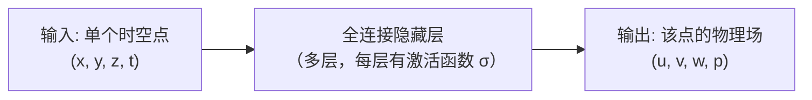

3. 与传统方法的根本区别
   传统方法需要先将稀疏的粒子速度**插值**到规则的网格上，再计算压力。而PINN**直接学习从坐标到场量的连续函数**。一旦训练完成，这个函数就成了一张“流场地图”，你可以查询**任意位置**（包括没有粒子的区域）的物理量，无需额外插值。这是其最根本的优势。

### 训练流程

**图1**还展示了训练流程图，核心逻辑是两类数据点的协同作用：

> 
> 图1: PINN 网络和训练流程

**数据点集合 $\hat{\Omega}_d$**：来自实验测量的粒子轨迹，格式为

$$
\hat{\Omega}_d = \{x_j, y_j, z_j, t_j; \hat{u}_j, \hat{v}_j, \hat{w}_j\}_{j=1}^{N_d}
$$

这些点有速度测量值，用于计算数据损失。注意只有速度，没有压力——实验中压力无法直接测量。

**物理点集合 $\Omega_p$**：在计算域内均匀撒的点，格式为

$$
\Omega_p = \{x_j, y_j, z_j, t_j; u_j, v_j, w_j, p_j\}_{j=1}^{N_p}
$$

这些点没有测量值，只用于评估N-S方程的残差。论文明确指出：**$\Omega_p$ 不需要与 $\hat{\Omega}_d$ 重合或有任何交叠**。这意味着即使某个区域完全没有粒子，物理约束依然在那里起作用。

### 损失函数的三项构成

总损失为：

$$
L = \lambda_d L_d + \lambda_i L_i + \lambda_m L_m
$$

**数据项 $L_d$**，在 $\Omega_d$ 上评估：

$$
L_d = \frac{1}{N_d}\sum_{j=1}^{N_d}\left[(\hat{u}_j - u_j)^2 + (\hat{v}_j - v_j)^2 + (\hat{w}_j - w_j)^2\right]
$$

其中 $\Omega_d$ 与 $\hat{\Omega}_d$ 的坐标点重合，但 $\Omega_d$ 中的速度值 $(u_j, v_j, w_j)$ 是网络预测值，$\hat{\Omega}_d$ 中的是实测值。

**不可压缩项 $L_i$**，在 $\Omega_p$ 上评估：

$$
L_i = \frac{1}{N_p}\sum_{j=1}^{N_p}\left(\frac{\partial u}{\partial x} + \frac{\partial v}{\partial y} + \frac{\partial w}{\partial z}\right)^2
$$

这是质量守恒方程的残差。所有偏导数通过[**自动微分**](../../../part1_basics/pytorch_autograd.md)直接对网络输出求导得到，不需要有限差分。

**动量项 $L_m$**，同样在 $\Omega_p$ 上评估，是三个方向N-S动量方程残差的平方和。以 $x$ 方向为例，残差为：

$$
\mathcal{R}_u = \frac{\partial u}{\partial t} + u\frac{\partial u}{\partial x} + v\frac{\partial u}{\partial y} + w\frac{\partial u}{\partial z} + \frac{1}{\rho}\frac{\partial p}{\partial x} - \nu\nabla^2 u
$$

这一项的关键作用是把压力 $p$ 耦合进来。即使 $L_d$ 中完全没有压力的测量约束，动量方程也通过 $\frac{\partial p}{\partial x}$、$\frac{\partial p}{\partial y}$、$\frac{\partial p}{\partial z}$ 这三项，迫使网络学出与速度场物理自洽的压力场。这正是PINN能同时重建速度和压力的根本原因。

### 超参数平衡：论文的核心工程贡献

在利用物理信息神经网络（PINN）从粒子轨迹重建流场时，一个关键且棘手的工程难题是如何设置损失函数中的权重超参数 $\lambda_d$、$\lambda_i$ 和 $\lambda_m$。这些参数分别控制着“拟合实验数据”（$L_d$）、“满足不可压缩条件”（$L_i$）和“满足动量方程”（$L_m$）这三项任务在总损失中的重要性。本论文的核心贡献之一，便是提出了一套系统性的解决方案，而非依赖经验性的试错。

**为什么平衡如此关键？**
如果不加权衡地简单相加（例如，设定所有 $\lambda = 1$），由于各损失项的自然量级（Magnitude）可能相差数个数量级，优化过程会被数值最大的项完全主导。这会导致两种常见的失败模式：1) 如果物理损失 $L_p$ 过大，网络会倾向于输出一个严格符合纳维-斯托克斯方程、但与实验数据完全脱节的流场；2) 如果数据损失 $L_d$ 过大，网络则会像一个过拟合的插值器，紧紧追随含噪声的测量点，而牺牲物理一致性，导致重建出的压力场等物理量失去意义。因此，平衡这些权重是确保PINN能够**协同学习**，最终得到一个既贴合数据又遵守物理定律的解的先决条件。

**论文的解决方案：一个两步走的系统性策略**

**第一步：基于物理尺度的初始估计**

论文首先通过量纲分析，估计了在目标湍流场中各项损失的典型量级（§2.1）。对于特征速度为 $U$ 的流动，有：

- $L_d \sim U^2$
- $L_i \sim (\partial u / \partial x)^2$
- $L_m \sim U^2 (\partial u / \partial x)^2$

为使各项在训练初期量级相当，论文推导出数据损失权重的初始量级应满足（公式8）：

$$
\lambda_d \sim \frac{L_p}{L_d} \sim \left( \frac{\partial u}{\partial x} \right)^2
$$

进而，利用Kolmogorov湍流理论估计最小尺度（科尔莫戈罗夫尺度 $\eta$）上的速度梯度（公式10）：

$$
\frac{\partial u}{\partial x} \sim \epsilon^{1/2} \nu^{-1/2}
$$

据此，可以计算出一个具有物理意义的初始值 $\lambda_d^0$。这为超参数设置提供了一个理性的起点，避免了完全的随机猜测。

**第二步：动态梯度平衡算法**

然而，固定的权重无法适应训练过程中损失景观的动态变化。为此，论文采用了来自Wang et al. (2021)的梯度平衡算法（公式11）。该算法在训练期间周期性地执行，动态调整$\lambda_d$：

$$
\hat{\lambda}_{d}^{n} = (1-\alpha) \hat{\lambda}_{d}^{n-1} + \alpha \frac{\langle |\nabla_{\theta} L_{p}| \rangle_{\theta}}{\langle |\lambda_{d}^{0} \nabla_{\theta} L_{d}| \rangle_{\theta}}
$$

其中，$\lambda_d = \lambda_d^0 \hat{\lambda}_d$。其核心思想是**监控并平衡各项损失对网络参数 $\theta$ 的梯度范数**。算法自动调整 $\lambda_d$，使得数据损失和物理损失对优化过程的影响力保持在同一水平，从而确保网络参数同步响应来自数据和物理定律两方面的监督信号。

**效果验证**

**图5** 直观地验证了上述策略的有效性。该图展示了在训练过程中，加权数据损失 $\lambda_d L_d$ 与物理损失 $L_p$ 的演变曲线。

> 
> 图5: 加权数据损失与物理损失随训练epoch的变化

如图所示，两条曲线在整个训练过程中协同下降，没有出现一项已收敛而另一项停滞不前的失衡局面。这直接证明了所提出的超参数平衡策略成功地引导了优化过程，使PINN能够同时兼顾数据拟合的准确性与物理约束的满足，这是该方法能够鲁棒地重建出高保真流场的关键工程基础。

### 归一化：不起眼但影响训练稳定性

论文采用了两种归一化：

**输入 min-max 归一化**：将 $(x, y, z, t)$ 各自映射到 $[0, 1]$。

**输出 z-score 归一化**：将速度和压力标准化为零均值单位方差，即 $u_{\text{norm}} = (u - \mu_u)/\sigma_u$，其中均值和标准差从训练数据中估计。

这两种选择是有针对性的。输入用 min-max 是因为坐标有明确的物理边界（计算域的范围），映射到 $[0,1]$ 直接且可解释。输出用 z-score 是因为速度和压力的分布形状更重要，而它们的绝对量级在不同流动条件下差异很大，z-score 归一化让网络在统一的数值范围内学习，避免某个输出分量因量级过大而主导训练。

网络在归一化空间内训练，推理时再反归一化回物理单位。这个细节在论文中虽然只是一句话，但在实际实现中对训练稳定性影响显著——尤其是在压力量级远大于速度量级的情况下（压力尺度约为 $\rho U^2$，而速度尺度为 $U$）。

---

## 三、三个实验案例：从理想到真实

论文的验证策略是精心设计的递进结构：从有完美真值的合成数据出发，逐步引入更真实的误差源，最终在纯实验数据上验证。

三个案例共享同一套PINN框架，但面对的数据质量和验证方式各不相同。

### Case 1：合成粒子轨迹——系统性基准测试

本案例是论文中的**基准测试**，旨在最理想、最受控的条件下，系统性地量化评估PINN方法的重建精度与鲁棒性。其核心价值在于，所有数据均来自**直接数值模拟（DNS）** 的“真实”流场，因此可以精确计算重建误差。

#### 数据生成：从完美“真相”到模拟实验

测试数据来源于约翰·霍普金斯湍流数据库（JHTDB）中一个雷诺数 $Re_\tau = 1000$ 的湍流通道流DNS。研究者首先在流场中随机“播撒”虚拟粒子，然后依据DNS提供的精确速度场积分出这些粒子的运动轨迹。**这些轨迹被视为“无误差”的实验测量值**。

为了模拟真实实验中的挑战，研究者引入了两个关键变量，其生成流程可概括如下：

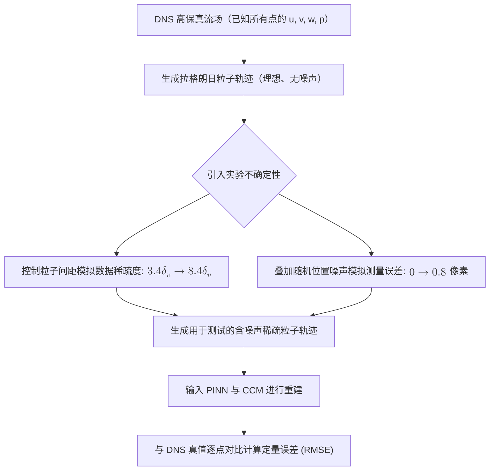

1. **粒子间距**：通过改变初始播撒的粒子数量，控制粒子间的平均距离，从较密集的 $3.4\delta_v$ 到较稀疏的 $8.4\delta_v$ （$\delta_v$ 是粘性长度尺度）。这模拟了实验中**数据稀疏**（欠分辨）的情况。
2. **测量噪声**：在粒子轨迹的坐标上叠加高斯随机扰动，噪声水平从0（理想）到0.8像素。这模拟了相机成像、粒子识别等环节引入的**随机误差**。

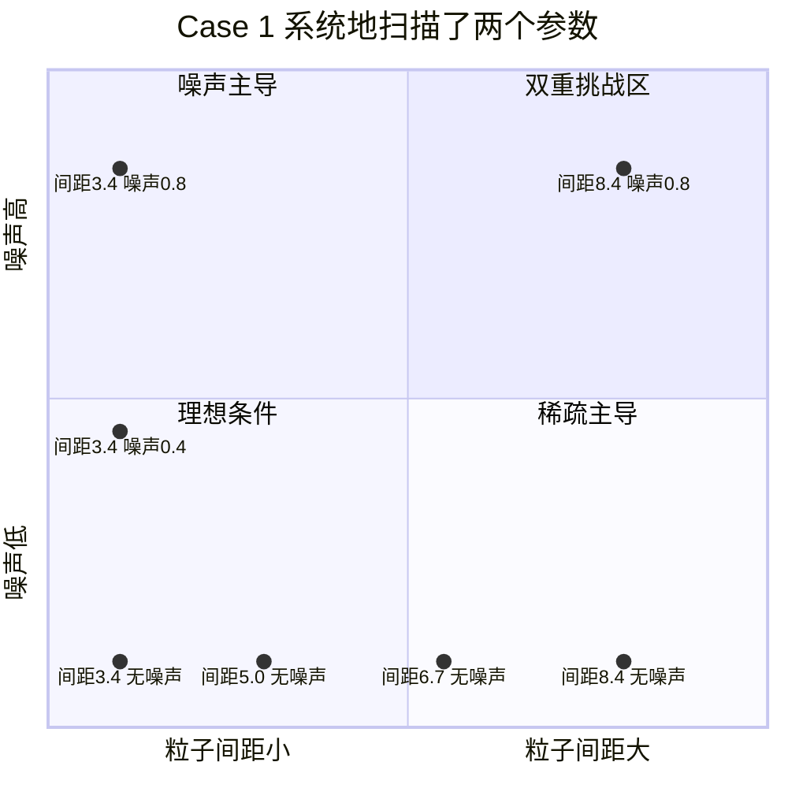

#### 核心发现：PINN在噪声与稀疏性下的鲁棒性

通过系统性地组合不同粒子间距与噪声水平，论文得到了以下关键结论：

**1. 无噪声时，两者精度相当，各擅胜场**

在无噪声的理想条件下（**图6, 图7**）：

- **速度重建**：在通道中心区域，PINN与CCM的误差相当。但当粒子变得稀疏时，PINN误差的增长速度**慢于CCM**，显示出对稀疏数据更好的适应性。
- **压力重建**：在通道中心区域，两者精度依然接近。但在**靠近壁面的区域**，CCM的压力重建误差略低于PINN。论文指出，这是因为CCM所用的“全向积分”方法在边界处处理压力梯度时具有固有优势。

**2. 有噪声时，PINN表现出显著优势**

当引入实验噪声后，PINN的鲁棒性优势变得非常明显。

- **在固定噪声（0.4像素）下**，**图8和图9**显示，无论是速度还是压力重建，PINN的误差在所有粒子间距和高度上都**普遍低于CCM**。论文原文写道：“_我们立刻可以体会到PINN在噪声系统中的鲁棒性优于CCM。_”
- **在固定粒子间距下，扫描不同噪声水平**：这是**最关键的实验**，直接回答“在高噪声下PINN是否可用”。**图10和图11**展示了在粒子间距固定为 $r^+ = 5.4$ 时，误差随噪声水平（直至0.8像素）的变化。

  - **核心结论**：PINN的速度和压力重建误差随噪声水平的**增长速率远低于CCM**。对于压力重建，这一优势尤为突出。
  - **论文解释**：这是因为PINN的物理损失项 $L_p$ 将数据“投影”到了纳维-斯托克斯方程的解空间中，这本身就是一种**有效的误差滤波机制**。而CCM方法需要先对噪声数据进行数值微分来计算加速度，这一过程会**放大噪声**，导致误差急剧增加。

#### 贡献网格：Case 1 量化对比总结

|          **评估维度**          |                            **PINN 表现**                            |                    **CCM 表现**                    |                     **结论**                     |
| :-----------------------------: | :-----------------------------------------------------------------: | :------------------------------------------------: | :----------------------------------------------: |
| **对数据稀疏的鲁棒性** (无噪声) |               速度误差随粒子间距增大增长较缓（图6）。               |           速度误差在稀疏条件下上升更快。           |           PINN更能适应低粒子密度条件。           |
|    **近壁压力重建** (无噪声)    |                  在近壁区域误差略高于CCM（图7）。                  |          在边界区域利用积分方法略有优势。          |     CCM在特定区域（近壁）因方法特性而稍优。     |
|     **对测量噪声的鲁棒性**     | **误差随噪声增长缓慢**（图10, 11）。在0.8像素噪声下仍保持可用精度。 | 误差随噪声**显著增大**，尤其在压力重建上（图11）。 | **PINN具有卓越的噪声鲁棒性，是其核心优势之一。** |
|         **机制原因**         |            物理方程作为全局软约束，自然平滑并过滤噪声。            |      需对含噪声轨迹进行数值微分，噪声被放大。      |    PINN的框架天然更适合处理含噪声的实验数据。    |

**综上所述，Case 1 通过严格的基准测试证明：在模拟真实实验的噪声（高达0.8像素）与数据稀疏条件下，PINN不仅完全可用，而且其重建精度，特别是压力场的重建精度，显著优于传统的CCM方法。这为后续在更复杂的合成与真实实验数据上应用PINN奠定了基础。**

### Case 2：合成层析图像——模拟真实实验误差链

在Case 1 中，我们通过在完美的粒子轨迹上**直接添加**高斯噪声来模拟测量误差。然而，真实实验中的误差来源要复杂得多，它们贯穿于从成像、三维重建到粒子追踪的整个链条。Case 2 的目的，就是通过一整套**合成层析成像流程**来模拟这些真实、复杂的误差，从而在更接近实际实验的条件下检验PINN的鲁棒性。

#### 目标：构建一个更真实的“实验”模拟

Case 2 与 Case 1 使用相同的DNS湍流通道流数据（$Re_\tau = 1000$）作为“真实答案”。但区别在于，它不再直接使用理想的粒子轨迹，而是模拟了实验人员拿到数据的完整过程：

1. **模拟成像**：使用 **EUROPIV 合成图像生成器**，将虚拟粒子的三维位置投影到4台虚拟相机上（角度为±15°和±30°），生成带有光学模糊、相机噪声和“重影粒子”的二维图像。
2. **模拟三维重建**：使用实验界标准的 **Shake-the-Box 算法**处理这些二维图像，反算出三维空间中的粒子位置，从而得到粒子轨迹。

这个过程模拟了实验中所有关键的误差源，如校准偏差、图像噪点、三维重建错误等。因此，Case 2 得到的粒子轨迹，其误差的**结构和空间相关性**都更接近真实实验数据，远比 Case 1 中简单的高斯噪声复杂。

整个误差链的模拟流程可以概括如下：

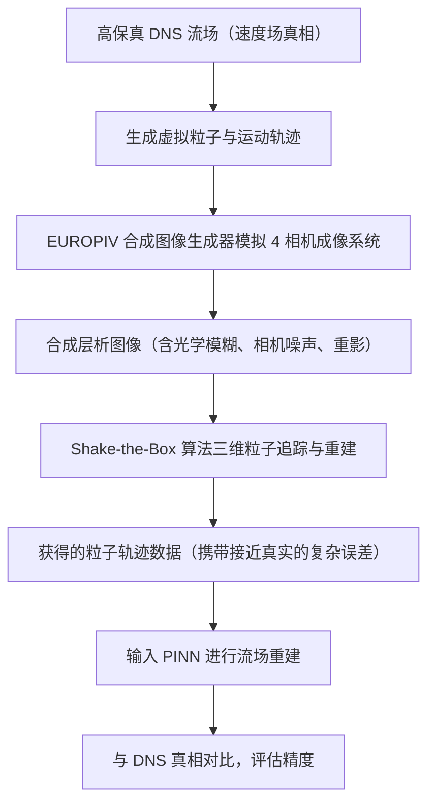

#### 挑战与策略：处理长达 2000 帧的流动历史

Case 2 另一个重要特点是数据量巨大：它要重建**长达 2000 个时间步**的流动演变。直接将所有 2000 帧数据喂给一个 PINN 训练会非常困难，因为网络难以在如此长的时间跨度内保持高精度。

论文采用的策略是**分而治之**：将 2000 帧的时间窗口**拆分成两段**，每段 1000 帧，然后分别训练一个独立的 PINN 来处理其中一个时间段。这个做法的物理依据是，湍流具有有限的“记忆”时间（由大涡的特征时间尺度决定），在足够长的时间后，流场状态基本无关。因此，用局部时间窗口来训练 PINN 是合理且高效的。

```mermaid
gantt
    title 长时序数据分段处理策略
    dateFormat  X
    axisFormat  %s

    section 时间窗口分配
    PINN 1 负责重建(0-1000)  :active, p1, 0, 1000
    PINN 2 负责重建(1000-2000) :active, p2, after p1, 2000
```

#### 核心发现：PINN在复杂误差下依然稳健

尽管输入数据包含了更真实的复杂误差，PINN在Case 2中依然取得了与先进方法CCM相当甚至更优的重建效果。

1. **定性结果平滑，细节更优**

   - 在**图12**的瞬时流场可视化中，PINN 与 CCM 的结果都与真实场定性相符。但论文指出，PINN 产生的场**更平滑**。这一点在**图13**的流向速度剖面对比中尤为明显：
     - CCM 的结果中包含了许多小尺度的起伏；
     - PINN 的结果则平滑地穿过这些波动，更贴近真实的 DNS 曲线。
   - 这表明 PINN 的物理约束起到了有效的滤波和去噪作用。
2. **定量误差：压力与梯度重建优势明显**

   - **速度与压力场误差**（**图14**）：在通道大部分区域，两者速度重建误差相当。但在**压力重建**上，PINN的误差在远离壁面的区域**显著低于CCM**（大约只有CCM的一半）。
   - **速度与压力梯度误差**（**图15**）：在评估流向梯度 $\partial u / \partial z$ 和 $\partial p / \partial z$ 的重建误差时，PINN的优势更加突出。这是因为梯度计算会放大CCM结果中的小尺度噪声，而 PINN 输出的平滑场使得梯度计算更加稳定可靠。
3. **时间动态与频谱精度**

   - **时间相关性**（**图16**）：在整个 2000 帧的时间窗口内，PINN 重建的速度场与真实场的相关系数 $\rho_u$ 始终保持在 0.99 以上，表明其具有极高的时间精度。压力场的相关系数 $\rho_p$ 也普遍很高，虽然在某些时刻会出现与 CCM 同步的瞬时下降，这可能是由于该时刻流动结构特别复杂所致。
   - **能谱匹配**（**图17**）：PINN 重建的流场能谱在绝大多数频率上与真实 DNS 谱高度吻合，仅在高于奈奎斯特频率的频段有所平滑。相比之下，CCM 的谱在高频部分保留了更多不真实的“毛刺”，这与图13中观察到的小尺度噪声是一致的。
4. **再次验证超参数平衡的重要性**

   - 论文特别设置了一个对比实验：训练一个使用**固定权重**（$\hat{\lambda}_d = 1$）的 PINN。
   - 结果如**图18**的能谱所示，固定权重的 PINN 过度平滑了流场，显著抑制了高频部分的能量，导致精度下降。
   - 这反向证明了 Case 1 中提出的**梯度平衡算法**对于在复杂误差条件下获得最优解是至关重要的。

**总结来说，Case 2 通过构建一个从成像到三维重建的完整、逼真的误差链，证明了 PINN 方法在面对真实实验的复杂噪声时，不仅依然有效，而且在压力场重建、梯度计算和结果平滑性方面展现出独特优势。同时，处理长时序数据的分段策略和超参数动态平衡技术，也被证实是该方法走向实际应用的关键工程环节。**

### Case 3：真实实验数据——在无“标准答案”下验证PINN

本案例是论文的“终极大考”：将PINN应用于一份真实的、高雷诺数（$Re_\tau = 800$）后向台阶湍流剪切层实验数据。**与之前案例最根本的不同在于，这里没有像DNS那样的“标准答案”来直接计算误差。** 因此，评估PINN的表现需要一套全新的、间接的验证逻辑。

#### 实验设置：测量一个复杂的三维湍流

实验在一个小型水洞中进行，流体流过一块后向台阶，产生包含流动分离、剪切层、回流区和再附着点的复杂三维湍流结构。实验配置如**图3**所示。

> 
> 图3: 湍流剪切层实验设置示意图

为了获取三维粒子轨迹，研究者使用了**四台高速相机**从不同角度（±15° 和 ±40°）拍摄被激光照亮的示踪粒子，并利用**Shake-the-Box算法**从这些图像中重建出粒子的三维运动轨迹。最终，获得了共计**900个连续时间步**的轨迹数据。整个处理流程可以概括为：

#### 评估挑战：没有“真值”时如何判断对错？

由于这是真实实验，我们无从得知流场中每一点速度和压力的真实值。因此，论文采用了一种“三角验证”法，从多个角度交叉检验PINN重建结果的合理性：

1. **交叉验证**：将PINN的重建结果与**先进的CCM方法**的结果进行定性对比。如果两种原理截然不同的方法得出的大尺度流动结构一致，那么我们有理由相信它们都捕捉到了真实的物理现象。
2. **统计学验证**：检查PINN重建出的流场是否符合**经典湍流理论**和**文献中报道的统计规律**。例如，其速度能谱的斜率是否与理论预测相符。
3. **物理自洽性验证**：虽然无法与“真值”对比，但可以检查PINN自身的输出是否满足它被训练的物理定律（纳维-斯托克斯方程），计算其残差。

这种评估范式的转变如下图所示：

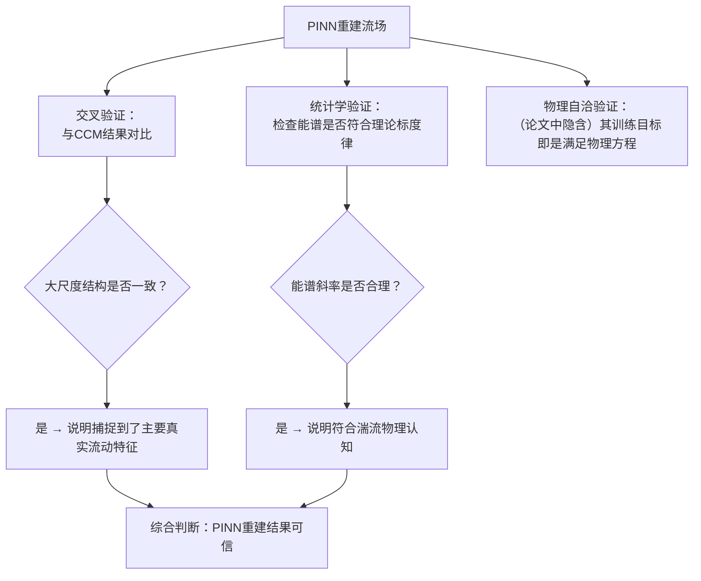

#### 核心发现：PINN重建出物理合理的复杂流场

尽管没有真值，但通过上述评估，论文得出了强有力的结论。

**1. 定性对比：大尺度结构一致，PINN结果更平滑**

- **图19** 展示了CCM与PINN重建的瞬时速度、压力和涡量场。对比表明，两种方法识别出的**主要旋涡结构的位置和形态基本吻合**。然而，一个明显的区别是：**PINN产生的结果更加平滑**，而CCM的结果中包含更多小尺度的起伏。

**2. 定量谱分析：与理论高度吻合**

在无法计算RMSE的情况下，能谱分析成为关键的定量工具。**图20** 对比了两种方法重建出的速度和压力能谱 $E_{u}(f)$ 和 $E_{p}(f)$。

- **核心发现**：两条谱线在绝大多数频率范围内高度重合。
- **关键证据**：在惯性子区频率范围内，能谱的**斜率**与经典湍流理论预测的 $f^{-5/3}$ 标度律**相符**。这证明PINN不仅重建了流动结构，还**正确捕捉了湍流的本质统计规律**。
- **差异解释**：在高频段，PINN的谱能量略低于CCM，这与**图19**中PINN结果更平滑的观察一致。基于Case 2中与DNS真值谱的对比（该对比表明PINN的平滑有效过滤了不真实的高频噪声），可以推断在实验Case 3中，PINN可能提供了**更干净、物理上更可信**的小尺度表征。

**3. 应对实验挑战：在数据稀疏区的表现**

- 后向台阶流动的**回流区**流速低、方向与主流相反，通常粒子追踪数据最稀疏、噪声最大。PINN框架的优势在于，其物理损失项 $L_p$ 在整个计算域（包括没有测量数据的回流区）都施加约束，从而能够利用物理定律“填补”信息空白，给出合理的推测。而CCM等方法严重依赖局部数据，在数据稀疏区可能不稳定或噪声更大。尽管论文未提供该区域的直接对比图，但这是PINN方法相对于传统插值-积分框架的一个预期优势。

**总结**：Case 3成功地证明，PINN能够直接处理**真实、复杂的高雷诺数湍流实验数据**。在没有绝对真值的情况下，通过**与先进独立方法交叉验证**和**检验其是否符合基础物理理论**，论文有力地表明了PINN可以重建出**物理一致、统计合理**的瞬时速度与压力场。其表现出的**对噪声的鲁棒性和结果的平滑性**，凸显了其在处理具有挑战性的实验数据方面的实用价值。

### 三个案例的完整对比

本论文通过三个精心设计的实验案例（Case 1, 2, 3），构建了一个**从理想可控到完全真实、从有“标准答案”到无“标准答案”的、完整的可信度论证链条**。这三个案例并非简单的并列，而是**层层递进**，共同回答了“PINN方法是否可靠、可用”这一核心问题。

我们可以将这三个案例的关系与核心验证逻辑总结如下：

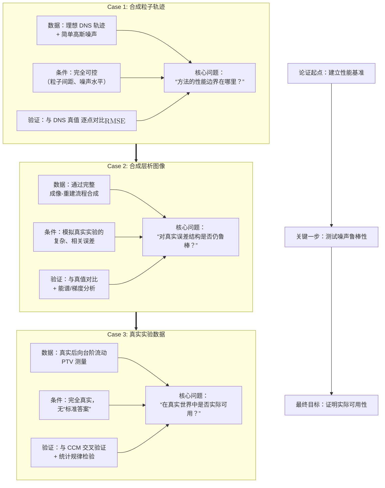

### 案例解读：递进式验证逻辑

论文通过三个设计严谨的案例，构建了从理论验证到实际应用的完整论证链。

1. **Case 1：合成粒子轨迹（建立基准）**
   在拥有DNS真值的理想可控环境下，通过系统改变粒子间距与添加高斯噪声，定量评估PINN性能。**图6-11** 表明，PINN在含噪声数据下的误差增长远慢于CCM，首次证明了其卓越的噪声鲁棒性。
2. **Case 2：合成层析图像（测试复杂误差）**
   通过完整的成像-重建流程模拟真实实验误差链，输入数据误差更复杂。**图14-15, 17** 显示，PINN在压力、梯度重建及能谱保真度上优于CCM，证明其对真实实验误差结构同样鲁棒。
3. **Case 3：真实实验（证明实用性）**

   - 在无“真值”的后向台阶湍流实验中，采用“三角验证”：
     - 与CCM交叉验证，大尺度结构一致（**图19**）；
     - 能谱符合理论标度律（**图20**）。证明PINN能从真实数据中重建出物理合理的流场。

**总结**：三个案例依次回答了“性能边界在哪？”、“对真实误差是否有效？”、“在实际中是否可用？”，构成了方法从理论优势到实践价值的严密论证。

| **案例**   | **数据性质** | **可控性**               | **验证方式**            | **核心论证贡献**                                                                               |
| :--------- | :----------- | :----------------------- | :---------------------- | :--------------------------------------------------------------------------------------------- |
| **Case 1** | 理想合成     | **完全可控**             | 直接定量误差 (RMSE)     | **定义性能基准**，证明PINN在稀疏、含噪数据上优于或等于CCM，明确了其优势边界。                  |
| **Case 2** | 逼真合成     | 部分可控（模拟真实流程） | 定量误差 + 谱/梯度分析  | **证明噪声鲁棒性**，表明PINN的优势不依赖于简单的噪声假设，能处理真实、复杂的实验误差。         |
| **Case 3** | 真实实验     | **不可控，无真值**       | 交叉验证 + 物理规律检验 | **证明实际可用性**，表明PINN能从真实的、不完美的实验数据中，重建出物理合理、有价值的流场信息。 |

**结论**：通过这条从 **“可控基准测试”** 到 **“逼真误差模拟”** ，最终到 **“真实场景应用”** 的完整论证链，论文有力地证明了PINN是一种**可靠、鲁棒且实用**的方法，能够用于从具有挑战性的实验粒子轨迹数据中，高精度地重建速度和压力场。

---

## 四、结果的核心发现

### 发现1：稀疏数据下PINN更鲁棒（图6）

随着粒子间距增大，PINN的速度重建RMSE增长明显慢于CCM。

**为什么**：CCM是局部方法，依赖粒子邻居来估计加速度和插值速度。粒子稀疏时，邻居少，局部拟合质量急剧下降。PINN的物理约束是全局的——即使某区域没有粒子，N-S方程依然在那里约束解，相当于用物理规律"填补"了数据空白。

### 发现2：噪声鲁棒性更强

在0.8像素噪声水平下，PINN误差增长平缓，CCM误差显著增大。

**为什么**：CCM需要计算加速度（速度的时间导数），对噪声极其敏感——噪声在求导时被放大。PINN不需要显式计算加速度，物理方程的残差项相当于一个全局滤波器，单个噪声点无法主导整个网络的输出。

### 发现3：压力重建是PINN的结构性优势

PINN的压力是网络的直接输出，与速度**同时**优化。CCM需要先得到速度场，再通过积分压力梯度得到压力，两步误差叠加。

在整体上，两者压力精度相当，但在近壁区（压力梯度复杂、粒子密度低的区域），CCM略优。论文对此的解释是：CCM的压力积分方法在有足够粒子的区域能精确捕捉压力梯度，而PINN在近壁区的物理约束点可能不够密集。

### 发现4：能谱保真度更高

这是一个容易被忽视但很重要的发现。能谱描述不同尺度涡旋的能量分布，是湍流研究的核心统计量。

PINN重建的能谱在高波数（小尺度结构）处与DNS真值吻合更好，而CCM在高波数区衰减过快——意味着CCM过度平滑了小尺度湍流结构。这对于需要研究湍流精细结构的应用场景非常重要。

### 发现5：训练动态验证了超参数策略（图5）

论文展示了训练过程中损失曲线的演化。使用梯度平衡算法后，数据损失和物理损失同步下降，没有出现一项停滞而另一项继续下降的情况。这直接验证了超参数平衡策略的有效性——如果不做平衡，很容易出现网络只拟合数据而忽视物理约束的情况。

---

## 五、论文的真实贡献是什么？

这篇论文的贡献不是"发明了PINN"（那是Raissi等人2019年的工作），也不是"证明了PINN能用于流体"（之前已有低雷诺数的工作）。

它的具体贡献是：

**在中等雷诺数湍流（$Re_\tau = 800\text{-}1000$）的实验场景下，系统地验证了PINN的可行性，并与当时最先进的CCM方法做了全面定量对比。**

具体来说：

- 建立了一套从合成数据到真实实验数据的完整验证流程
- 量化了PINN在不同粒子密度和噪声水平下的性能边界
- 提出了基于流动尺度分析的超参数初始化方法，降低了PINN在实际应用中的调参难度
- 证明了PINN在能谱保真度上的优势，这对湍流研究有实际意义

---

## 六、局限性（论文自己承认的）

- **计算成本高**：训练一个案例需要数小时GPU时间，CCM通常更快
- **近壁压力略逊**：在壁面附近，CCM的压力积分方法有固有优势
- **雷诺数限制**：验证案例均为中等雷诺数，高雷诺数湍流（$Re_\tau > 5000$）的表现未知
- **超参数仍需调整**：尽管提供了初始化策略，权重选择仍有一定经验成分

---

## 总结与展望

### 核心要点回顾

**PINNs的三大优势**：

1. **无需网格**：直接处理散点数据
2. **物理正则化**：提高鲁棒性和泛化能力
3. **一体化输出**：同时得到速度和压力

**成功的关键**：

1. 合理的损失函数设计
2. 自适应权重平衡
3. 充分的物理约束点采样
4. 适当的网络架构选择
5. 有效的训练策略

**适用场景**：

✅ 稀疏、有噪声的实验数据
✅ 低粒子密度区域重构
✅ 需要同时获得速度和压力
✅ 中等雷诺数湍流（Re < 10⁴）

⚠️ 需要注意的场景：

- 极高雷诺数（计算成本高）
- 强间断流动（激波）
- 实时应用（推理速度）

### 与传统方法的对比总结

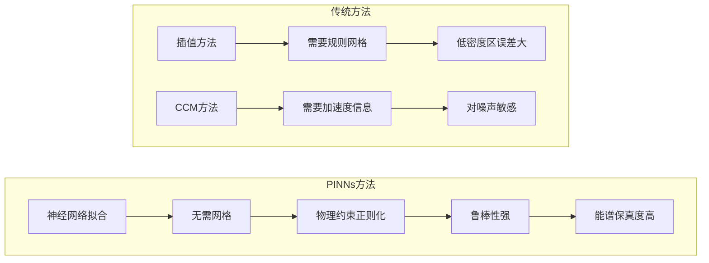
