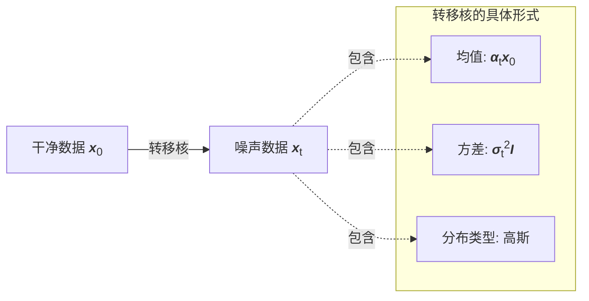

# **VP-SDE 的转移核**

---

### **"转移核"到底是什么？**

**转移核**（Transition Kernel）是描述**从一个状态转移到另一个状态的概率分布**。

对于随机过程，从时刻 $0$ 的状态 $\mathbf{x}(0)$ 转移到时刻 $t$ 的状态 $\mathbf{x}(t)$，转移核就是条件概率分布：

$$p_{0t}(\mathbf{x}(t)|\mathbf{x}(0))$$

**读作**："给定初始状态 $\mathbf{x}(0)$，在时刻 $t$ 观测到 $\mathbf{x}(t)$ 的概率分布"

#### **在 Score-based SDE 中的转移核**

对于方差保持 SDE：

$$d\mathbf{x} = -\frac{1}{2}\beta(t)\mathbf{x}dt + \sqrt{\beta(t)}d\mathbf{w}$$

从 $\mathbf{x}(0)$ 到 $\mathbf{x}(t)$ 的分布是**高斯分布**，这就是Score-based SDE 中的**转移核**：

$$p_{0t}(\mathbf{x}(t)|\mathbf{x}(0)) = \mathcal{N}(\mathbf{x}(t); \alpha(t)\mathbf{x}(0), \sigma^2(t)\mathbf{I})$$

其中：

- $\alpha(t) = e^{-\frac{1}{2}\int_0^t \beta(s)ds}$ —— 信号衰减系数
- $\sigma^2(t) = 1 - \alpha^2(t)$ —— 噪声方差

**具体来说**：

- **输入**：初始干净数据 $\mathbf{x}(0)$
- **输出**：时刻 $t$ 的噪声数据 $\mathbf{x}(t)$ 的分布
- **形式**：高斯分布，均值是 $\alpha(t)\mathbf{x}(0)$，方差是 $\sigma^2(t)\mathbf{I}$

#### **哪部分是转移核？**



**整个高斯分布** $\mathcal{N}(\alpha(t)\mathbf{x}(0), \sigma^2(t)\mathbf{I})$ 就是转移核。

#### **为什么叫"核"（Kernel）？**

在概率论中，"核"指的是**定义转移规则的函数**。可以类比：

| 概念       | 数学对象                               | 作用             |
| ---------- | -------------------------------------- | ---------------- |
| **卷积核** | 权重矩阵                               | 定义图像如何变换 |
| **积分核** | $K(x, y)$                              | 定义积分变换规则 |
| **转移核** | $p_{0t}(\mathbf{x}(t)\|\mathbf{x}(0))$ | 定义状态如何转移 |

---

### **VP-SDE 的转移核详解**

#### **数学符号详解**：

$$p_{0t}(\mathbf{x}(t)|\mathbf{x}(0)) = \mathcal{N}(\mathbf{x}(t); \alpha(t)\mathbf{x}(0), \sigma^2(t)\mathbf{I})$$

这个公式中有两种不同的对象，需要仔细区分：

**左边**：$p_{0t}(\mathbf{x}(t)|\mathbf{x}(0))$

- 这是一个**概率密度函数**（PDF），是关于 $\mathbf{x}(t)$ 的函数
- 竖线 $|$ 读作"给定"或"条件于"
- $\mathbf{x}(0)$ 在竖线右边：表示它是**已知的、确定的条件**（比如初始清晰图像）
- $\mathbf{x}(t)$ 在竖线左边：表示它是**不确定的随机变量**（我们要研究它的分布）
- 整个式子回答的问题是："给定初始状态，未来状态取某个特定值的概率密度是多少？"

**右边**：$\mathcal{N}(\mathbf{x}(t); \alpha(t)\mathbf{x}(0), \sigma^2(t)\mathbf{I})$

- 这是高斯分布的标准记号
- 分号前 $\mathbf{x}(t)$：随机变量（不确定的量）
- 分号后的两个参数：
    - $\mu = \alpha(t)\mathbf{x}(0)$：分布的均值（确定的参数）
    - $\Sigma = \sigma^2(t)\mathbf{I}$：分布的协方差矩阵（确定的参数）

**关键理解**：

- $\mathbf{x}(0)$ 是确定值（比如 $[100, 200]$），不是随机变量
- $\mathbf{x}(t)$ 是随机变量，它的可能取值在 $\alpha(t)\mathbf{x}(0)$ 附近波动
- 均值 $\alpha(t)\mathbf{x}(0)$ 也是确定值（比如 $[80, 160]$），由初始值计算得到
- 这**不是**贝叶斯估计中"参数的后验分布"（那里参数是随机的），这里参数是确定的，数据是随机的

#### **具体例子**：

假设：

- 初始图像 $\mathbf{x}(0) = [100, 200]$（二维向量，代表两个像素值）
- 时刻 $t$ 时，$\alpha(t) = 0.8$，$\sigma(t) = 0.6$

那么：

$$p_{0t}(\mathbf{x}(t)|[100, 200]) = \mathcal{N}(\mathbf{x}(t); [80, 160], 0.36\mathbf{I})$$

这表示：

- 给定初始图像是 $[100, 200]$
- 时刻 $t$ 的图像 $\mathbf{x}(t)$ 服从均值为 $[80, 160]$、方差为 $0.36$ 的高斯分布
- 如果问："$\mathbf{x}(t) = [80, 160]$ 的概率密度是多少？" → 最大（因为正好是均值）
- 如果问："$\mathbf{x}(t) = [100, 200]$ 的概率密度是多少？" → 较小（偏离均值较远）
- 如果问："$\mathbf{x}(t) = [79.5, 160.3]$ 的概率密度是多少？" → 介于两者之间

注意左边的 $[100, 200]$ 和右边的 $[80, 160]$ 不同：

- $[100, 200]$ 是给定的初始条件
- $[80, 160]$ 是高斯分布的中心，由 $0.8 \times [100, 200]$ 计算得到

#### **物理意义**：

其中：

- $\alpha(t) = e^{-\frac{1}{2}\int_0^t \beta(s)ds}$ —— **信号衰减系数**
    - 取值范围：$0 < \alpha(t) < 1$
    - $t=0$ 时：$\alpha(0) = 1$（信号完整）
    - $t \to \infty$ 时：$\alpha(t) \to 0$（信号完全消失）
    - 物理含义：原始图像的"能量"随时间指数衰减
- $\sigma^2(t) = 1 - \alpha^2(t)$ —— **噪声方差**
    - 取值范围：$0 < \sigma^2(t) < 1$
    - $t=0$ 时：$\sigma^2(0) = 0$（无噪声）
    - $t \to \infty$ 时：$\sigma^2(t) \to 1$（纯噪声）
    - 物理含义：累积噪声的"能量"随时间增长
- **方差保持**：$\alpha^2(t) + \sigma^2(t) = 1$
    - 信号能量 + 噪声能量 = 常数
    - 类比流体力学：质量守恒或能量守恒

扩散过程可以理解为：

1. 原始信号逐渐衰减（乘以 $\alpha(t)$，越来越小）
2. 噪声逐渐增强（方差 $\sigma^2(t)$ 越来越大）
3. 两者此消彼长，保持总方差不变

#### **重参数化技巧**：

$$\mathbf{x}(t) = \alpha(t)\mathbf{x}(0) + \sigma(t)\boldsymbol{\epsilon}, \quad \boldsymbol{\epsilon} \sim \mathcal{N}(0, \mathbf{I})$$

这是上述概率分布的**等价构造形式**。它不是一个新的公式，而是告诉我们如何具体生成服从该分布的样本。

**为什么需要重参数化？**

1. **概率密度函数的局限**：
   - $p_{0t}(\mathbf{x}(t)|\mathbf{x}(0)) = \mathcal{N}(\mathbf{x}(t); \mu, \sigma^2)$ 只是理论描述
   - 它告诉我们分布的形状，但不告诉我们如何生成样本
   - 就像知道"水的密度分布"，但不知道"如何制造水"

2. **重参数化提供构造方法**：
   - 将"从任意高斯分布采样"分解为两步
   - 步骤1：从标准正态分布采样（容易实现）
   - 步骤2：线性变换（平移和缩放）

**数学原理**：

高斯分布的一个重要性质：

> 如果 $\boldsymbol{\epsilon} \sim \mathcal{N}(0, \mathbf{I})$（标准正态分布），  
> 那么 $\mathbf{y} = \mu + \sigma \boldsymbol{\epsilon} \sim \mathcal{N}(\mu, \sigma^2\mathbf{I})$（任意高斯分布）

证明思路：

- $\boldsymbol{\epsilon}$ 的均值是 $0$，方差是 $1$
- $\mu + \sigma \boldsymbol{\epsilon}$ 的均值是 $\mu + \sigma \times 0 = \mu$
- $\mu + \sigma \boldsymbol{\epsilon}$ 的方差是 $\sigma^2 \times 1 = \sigma^2$

应用到扩散模型：

$$\mathbf{x}(t) = \underbrace{\alpha(t)\mathbf{x}(0)}_{\text{均值 } \mu} + \underbrace{\sigma(t)\boldsymbol{\epsilon}}_{\text{标准差} \times \text{标准正态}}$$

因此 $\mathbf{x}(t)$ 自动服从 $\mathcal{N}(\alpha(t)\mathbf{x}(0), \sigma^2(t)\mathbf{I})$。

#### **具体生成过程（代码视角）**：

假设要生成 $t=0.5$ 时刻的加噪图像：

```python
import numpy as np

# 1. 给定初始图像
x_0 = np.array([100, 200])  # 确定值

# 2. 计算时间相关参数
t = 0.5
alpha_t = 0.8   # 信号衰减到 80%
sigma_t = 0.6   # 噪声标准差

# 3. 重参数化生成样本
epsilon = np.random.randn(2)  # 从 N(0,I) 采样，例如 [0.5, -0.3]
x_t = alpha_t * x_0 + sigma_t * epsilon
# x_t = 0.8 * [100, 200] + 0.6 * [0.5, -0.3]
# x_t = [80, 160] + [0.3, -0.18]
# x_t = [80.3, 159.82]

# 4. 验证：x_t 服从 N([80, 160], 0.36*I)
# 多次采样会发现 x_t 的均值接近 [80, 160]，方差接近 0.36
```

**三个组成部分**：

1. $\alpha(t)\mathbf{x}(0) = [80, 160]$：信号衰减（确定性漂移）
2. $\sigma(t) = 0.6$：噪声强度（缩放因子）
3. $\boldsymbol{\epsilon} = [0.5, -0.3]$：随机方向（每次不同）

最终结果：$\mathbf{x}(t) = [80.3, 159.82]$（每次运行都不同）

#### **类比流体力学（对流-扩散方程）**：

VP-SDE 的物理图像类似于流体中的粒子运动：

$$d\mathbf{x} = \underbrace{-\frac{1}{2}\beta(t)\mathbf{x}dt}_{\text{对流项（漂移）}} + \underbrace{\sqrt{\beta(t)}d\mathbf{w}}_{\text{扩散项（布朗运动）}}$$

**对流项**：$-\frac{1}{2}\beta(t)\mathbf{x}dt$

- 确定性的速度场，指向原点
- 粒子被"拉"向原点，速率与当前位置成正比
- 累积效果：信号衰减系数 $\alpha(t) = e^{-\frac{1}{2}\int_0^t \beta(s)ds}$
- 类比：河流中的水流（确定性）

**扩散项**：$\sqrt{\beta(t)}d\mathbf{w}$

- 随机的布朗运动
- 粒子受到分子碰撞产生的随机扰动
- 累积效果：方差 $\sigma^2(t) = 1 - \alpha^2(t)$
- 类比：染料在水中的扩散（随机性）

**转移核的物理意义**：

- 初始时刻：所有粒子都在 $\mathbf{x}(0)$（点源）
- 经过时间 $t$：粒子群的分布变成高斯分布
    - 中心位置：$\alpha(t)\mathbf{x}(0)$（整体向原点漂移）
    - 扩散程度：$\sigma^2(t)$（粒子云的半径）
- $t \to \infty$：粒子群趋向于标准正态分布 $\mathcal{N}(0, \mathbf{I})$（平衡态）

**方差保持的物理含义**：

- 总方差 = 信号方差 + 噪声方差 = 常数
- $\text{Var}[\mathbf{x}(t)] = \alpha^2(t) \text{Var}[\mathbf{x}(0)] + \sigma^2(t)$
- 如果 $\text{Var}[\mathbf{x}(0)] = 1$，则 $\text{Var}[\mathbf{x}(t)] = \alpha^2(t) + \sigma^2(t) = 1$
- 类比：能量守恒（机械能转化为热能，但总能量不变）

#### **两种表示的对比与应用**：

| 角度           | 概率密度函数                                                                       | 重参数化                                            |
| -------------- | ---------------------------------------------------------------------------------- | --------------------------------------------------- |
| **数学表达**   | $p_{0t}(\mathbf{x}(t)\|\mathbf{x}(0)) = \mathcal{N}(\mathbf{x}(t); \mu, \sigma^2)$ | $\mathbf{x}(t) = \mu + \sigma\boldsymbol{\epsilon}$ |
| **回答的问题** | "某个值的概率密度是多少？"                                                         | "如何生成一个样本？"                                |
| **用途**       | 理论推导、计算似然                                                                 | 代码实现、梯度计算                                  |
| **优势**       | 直观理解分布形状                                                                   | 可微分、易于采样                                    |
| **类比**       | 密度场（场论描述）                                                                 | 粒子轨迹（拉格朗日描述）                            |

**在训练中的应用**：

1. **前向过程**（加噪）：使用重参数化生成训练样本

   ```python
   x_t = alpha_t * x_0 + sigma_t * torch.randn_like(x_0)
   ```

2. **损失函数**：使用概率密度函数计算似然

   ```python
   log_prob = -0.5 * ((x_t - alpha_t * x_0) / sigma_t)**2
   ```

3. **梯度反向传播**：重参数化使得随机采样过程可微
   - 随机性被隔离在 $\boldsymbol{\epsilon}$ 中（不需要对它求导）
   - 对 $\mu$ 和 $\sigma$ 的梯度可以直接计算

#### **总结**：

转移核 $p_{0t}(\mathbf{x}(t)|\mathbf{x}(0))$ 完整刻画了扩散过程的统计性质：

- **给定**：初始清晰图像 $\mathbf{x}(0)$（确定）
- **求解**：任意时刻 $t$ 的加噪图像 $\mathbf{x}(t)$ 的概率分布（高斯分布）
- **参数**：均值 $\alpha(t)\mathbf{x}(0)$（信号衰减）+ 方差 $\sigma^2(t)\mathbf{I}$（噪声累积）
- **实现**：重参数化技巧提供了具体的构造方法

这是扩散模型的核心基础：知道了如何加噪（前向过程），就可以训练神经网络学习去噪（反向过程）。
