# 通过随机微分方程实现基于评分的生成建模 (Score SDE)

> **上传者**：[XYChouMian](https://github.com/XYChouMian)  
> **论文标题**：[Score-Based Generative Modeling through Stochastic Differential Equations](https://iclr.cc/virtual/2021/oral/3402)  
> **论文PDF**：[paper.pdf](paper.pdf)  
> **阅读时间**：2026-6-9

---

## 论文精髓快速阅读

### **论文DNA**

本文提出了一个基于随机微分方程（SDE）的连续时间框架，统一并超越了此前离散的基于评分的生成模型（如SMLD和DDPM），通过建模数据到噪声的扩散过程及其逆过程，实现了更高效的采样、精确的似然计算以及解决逆问题等新功能。

### **知识向量（5维摘要）**

1.  **统一框架与SDE建模**：论文的核心创新是将数据扰动过程建模为一个前向SDE，该SDE将复杂的数据分布平滑地转化为简单的先验分布（如高斯噪声）。其关键洞察在于，逆过程由一个**反向时间SDE**描述，而该SDE的解仅依赖于扰动数据分布在每个时间步的**评分（Score）**，即概率密度的梯度。

2.  **评分估计与训练**：通过训练一个时变神经网络 $s_{\theta}(x, t)$ 来估计评分 $\nabla_x \log p_t(x)$，目标函数是去噪评分匹配的连续时间泛化。当漂移系数为仿射时，扰动核是高斯分布，训练效率很高。

3.  **SDE实例化：VE、VP与sub-VP**：论文表明，之前的SMLD和DDPM方法分别是两类特定SDE的离散化：
    - **方差爆炸（VE）SDE**：对应SMLD，方差随时间增长至无穷。
    - **方差保持（VP）SDE**：对应DDPM，方差最终稳定。
    - **次方差保持（sub-VP）SDE**：论文新提出，在相同设置下，其方差始终被VP SDE所界定，并在似然计算上表现优异。

4.  **灵活的采样方法**：
    - **通用数值SDE求解器**：如Euler-Maruyama方法，可用于求解反向SDE。
    - **预测器-校正器（PC）采样器**：结合数值SDE求解器（预测器）与基于评分的MCMC方法（如朗之万动力学，校正器），显著提升了采样质量。如表1所示，PC采样器在相同计算量下通常优于纯预测器或纯校正器方法。
    - **概率流ODE**：论文证明存在一个确定性的常微分方程（ODE），其轨迹与SDE共享相同的边缘概率密度。这允许使用黑盒ODE求解器进行快速采样，并支持**精确的似然计算**和潜在编码操作。

5.  **可控生成与强大性能**：利用无条件评分模型，可以通过条件反向时间SDE高效解决逆问题，实现类条件生成、图像修复和着色。结合架构改进，该框架在CIFAR-10无条件图像生成上取得了当时最先进的性能：**Inception Score为9.89，FID为2.20**，并首次实现了从基于评分的模型中生成1024×1024的高保真图像。

> 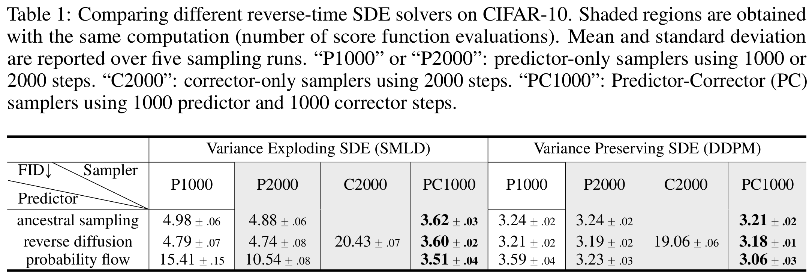
> 表1: 不同反向SDE求解器在CIFAR-10上的性能对比（FID）

> 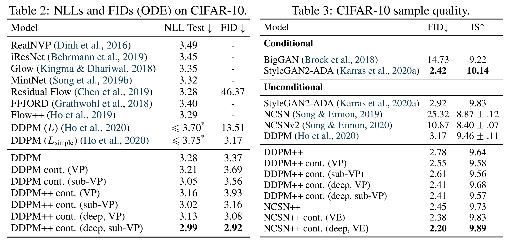
> 表2: CIFAR-10上的负对数似然（NLL）与FID（ODE）结果
> 表3: CIFAR-10样本质量（FID与Inception Score）对比

### **贡献网格（量化指标对比）**

| 贡献维度     | 具体内容                                                | 关键量化指标/效果                                                                                 |
| :-----------: | :------------------------------------------------------: | :------------------------------------------------------------------------------------------------: |
| **理论框架** | 提出基于连续时间SDE的统一生成建模框架，囊括SMLD与DDPM。 | 将两类方法分别形式化为VE SDE和VP SDE的离散化。                                                    |
| **采样算法** | 引入预测器-校正器（PC）采样器，统一并改进了现有方法。   | 在CIFAR-10上，PC采样器相比纯预测器采样，FID从\~3.2降至\~3.1（VP SDE）。                           |
| **似然计算** | 推导出与SDE共享边缘分布的概率流ODE，支持精确似然计算。  | 在CIFAR-10上，使用sub-VP SDE和深度架构的DDPM++ cont. 模型达到**2.99 bits/dim**的NLL，创下新纪录。 |
| **模型性能** | 结合框架与架构改进，大幅提升生成质量。                  | **CIFAR-10无条件生成：IS=9.89, FID=2.20**；首次实现1024×1024高保真生成。                          |
| **应用扩展** | 利用评分模型解决逆问题（类条件生成、修复、着色）。      | 仅使用单一无条件模型，无需重新训练，即可完成多种条件生成任务。                                    |

### **文献关联网络**

本文处于**扩散模型/基于评分的生成模型**研究脉络的核心位置，起到了承前启后的作用：

- **理论基石**：建立在**去噪评分匹配**（Vincent, 2011）和**朗之万动力学**（Parisi, 1981）以及**反向时间SDE理论**（Anderson, 1982）之上。
- **直接前驱**：统一了**SMLD**（Song & Ermon, 2019, 2020）和**DDPM**（Sohl-Dickstein et al., 2015; Ho et al., 2020）两大流派，将其视为特定SDE的离散化实例。
- **同期与后续影响**：其提出的**概率流ODE**为后来的**扩散ODE**（如Score SDE, Probability Flow ODE）奠定了基础，启发了更高效的采样器研究（如DPM-Solver）。其统一框架也促进了对于不同噪声调度（SDE设计）的探索，以及在其他模态（音频、3D形状）上的应用。

---

## 1. 核心问题：为什么需要 SDE？

### 传统扩散模型的局限

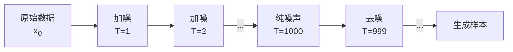

**DDPM 的问题**：

- 必须预先固定时间步数（如 1000 步）
- 采样慢（每步都要过一次神经网络）
- 无法精确计算似然

**SDE 的解决方案**：将离散步骤推广到**连续时间**

#### 直观理解

> 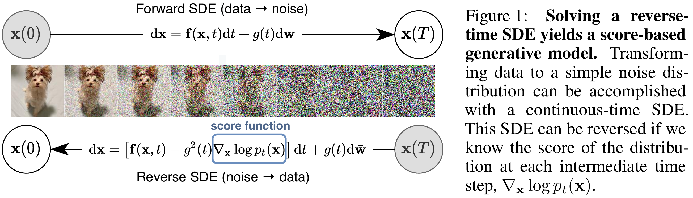
> 图1: 求解反向时间SDE得到基于评分的生成模型

你可以将这个过程想象为将一滴墨水滴入清水中的逆过程：前向SDE描述墨水分子从有序状态（图像）**扩散**为在水中均匀随机分布（噪声）的连续动态。而其反向过程，则描述了从均匀的噪声中“重构”出一滴特定墨水图案（新图像）的过程。

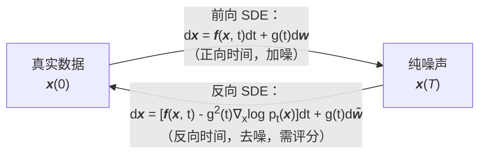

---

## 2. 前向过程：从数据到噪声

### 前向 SDE 的数学形式

$$d\mathbf{x} = \mathbf{f}(\mathbf{x}, t)dt + g(t)d\mathbf{w}$$

这个方程是一个**伊藤型随机微分方程（SDE）**，它是论文整个Score-Based生成建模框架的动力学核心。它描述了一个连续的扩散过程 $\{\mathbf{x}(t)\}_{t=0}^{T}$，其目的是将复杂的数据分布 $p_0$（如真实图像）通过逐步注入噪声，转化为一个简单、已知的先验分布 $p_T$（通常是各向同性的高斯分布）。

- **$\mathbf{x}(t)$**：表示在**连续时间变量** $t$ 索引下的数据状态。$t=0$ 对应原始数据 $\mathbf{x}(0) \sim p_0$，$t=T$ 对应最终噪声 $\mathbf{x}(T) \sim p_T$。
- **$d\mathbf{x}$**：表示在无穷小的时间增量 $dt$ 内，状态 $\mathbf{x}$ 的**微小变化量**。整个SDE定义了这种变化的规则。
- **$\mathbf{f}(\mathbf{x}, t)$：漂移系数**。这是一个向量值函数，它控制着 $\mathbf{x}$ 随时间变化的**确定性趋势**。例如，在论文提出的**方差保持（VP）SDE**（对应DDPM模型）中，$\mathbf{f}(\mathbf{x}, t) = -\frac{1}{2}\beta(t)\mathbf{x}$。这里的负号意味着它是一个“衰减力”，驱使 $\mathbf{x}$ 的值系统性地向原点收缩，其强度由 $\beta(t)$ 调度。
- **$g(t)$：扩散系数**。这是一个标量函数，它控制了注入噪声的**强度随时间变化的规律**。它是实现“扩散”的关键，决定了在每一步加入多少随机性。在**方差爆炸（VE）SDE**（对应SMLD模型）中，$g(t) = \sqrt{d[\sigma^2(t)]/dt}$，其设计会导致扰动分布的方差随时间不断增长。
- **$d\mathbf{w}$：标准维纳过程（布朗运动）的微分**。这是**随机性的来源**，可以理解为在每个瞬间加入一个均值为零、方差为 $dt \cdot I$ 的无穷小高斯噪声。$g(t)$ 作为系数放大或缩小了这个固有噪声的效应。

**关键对应与实例**：论文表明，先前两类重要的生成模型是特定SDE的离散化：

- **SMLD** 对应 **VE SDE**： $d\mathbf{x} = \sqrt{\frac{d[\sigma^2(t)]}{dt}} d\mathbf{w}$。其扰动核方差 $\sigma^2(t)$ 随时间爆炸性增长。
- **DDPM** 对应 **VP SDE**： $d\mathbf{x} = -\frac{1}{2}\beta(t) \mathbf{x} dt + \sqrt{\beta(t)} d\mathbf{w}$。其设计精巧，能使扰动数据分布的方差最终保持稳定。

### 三种 SDE 设计

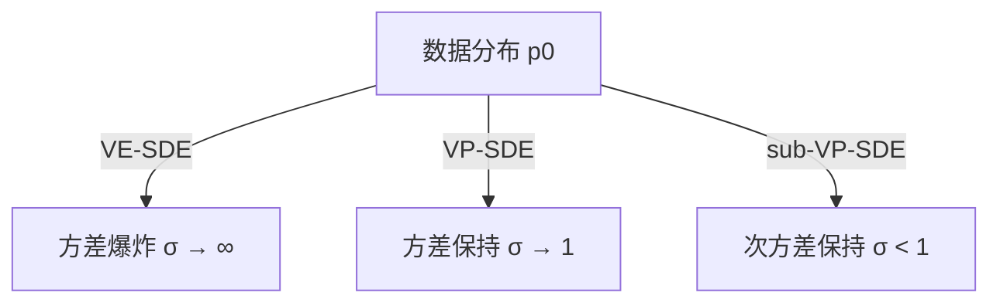

#### VE-SDE（对应 SMLD）

$$d\mathbf{x} = \sqrt{\frac{d[\sigma^2(t)]}{dt}} d\mathbf{w}$$

- **特点**：只加噪声，不缩放数据
- **方差**：随时间指数增长
- **用途**：适合高分辨率图像

#### VP-SDE（对应 DDPM）

$$d\mathbf{x} = -\frac{1}{2}\beta(t)\mathbf{x}dt + \sqrt{\beta(t)}d\mathbf{w}$$

- **特点**：同时缩放数据和加噪声
- **方差**：最终稳定在 1
- **用途**：标准扩散模型

#### sub-VP-SDE（论文新提出）

$$d\mathbf{x} = -\frac{1}{2}\beta(t)\mathbf{x}dt + \sqrt{\beta(t)(1-e^{-2\int_0^t \beta(s)ds})}d\mathbf{w}$$

- **特点**：方差始终小于 VP-SDE
- **优势**：似然计算更精确（见表2）

---

## 3. 逆向过程：从噪声到数据

### 反向 SDE（核心公式）

根据 [Anderson (1982)](https://www.sciencedirect.com/science/article/pii/0304414982900515) 的结果，任何正向 SDE 都存在一个时间反转的反向 SDE：

$$d\mathbf{x} = [\mathbf{f}(\mathbf{x},t) - g(t)^2 \nabla_\mathbf{x} \log p_t(\mathbf{x})]dt + g(t)d\bar{\mathbf{w}}$$

**历史背景**：Anderson 在 1982 年从纯数学角度证明了这个定理，但当时没有机器学习，**人们无法求出评分函数** $\nabla_\mathbf{x} \log p_t(\mathbf{x})$，因此这个公式停留在理论层面，无法实际应用。

**关键突破**：现代深度学习使得我们可以用神经网络 $s_\theta(\mathbf{x}, t)$ 去**学习**这个评分函数：

$$s_\theta(\mathbf{x}, t) \approx \nabla_\mathbf{x} \log p_t(\mathbf{x})$$

一旦训练好这个网络，就可以把它代入 Anderson 的公式，实现从噪声到数据的反向生成！

**直觉理解**：

- 正向过程：数据 → 噪声（容易）
- 反向过程：噪声 → 数据（需要 score 指引方向）
- Score 函数：告诉你"往数据密度增加最快的方向走"

这就是为什么这篇论文要花大量篇幅讲如何训练 score 网络（第4节）——它是连接 1982 年数学理论和 2021 年实际应用的桥梁。

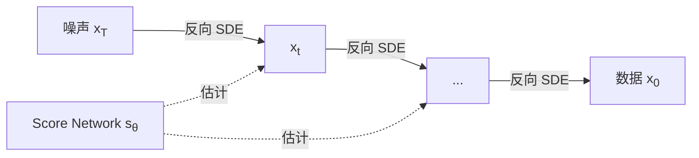

#### 什么是 Score Function？

**数学定义**：概率密度对数的梯度

$$\nabla_\mathbf{x} \log p_t(\mathbf{x})$$

##### **第一步：理解 $\nabla_\mathbf{x}$（梯度算子）**

$\nabla_\mathbf{x}$ 表示对 $\mathbf{x}$ 的每个分量求偏导数：

- **一维情况**：普通导数 $\frac{df}{dx}$，表示 $x$ 变化时 $f$ 如何变化
- **多维情况**（图片有 $n$ 个像素）：

$$\nabla_\mathbf{x} \log p_t(\mathbf{x}) = \begin{bmatrix} \frac{\partial \log p_t}{\partial x_1} \\ \frac{\partial \log p_t}{\partial x_2} \\ \vdots \\ \frac{\partial \log p_t}{\partial x_n} \end{bmatrix}$$

**物理意义**：这是一个向量场，指向"让 $\mathbf{x}$ 更像真实数据"的方向

- 每个分量表示"调整该像素能让概率增加多少"
- 整个向量指向"概率增长最快的方向"

**举例**（简化为 2 个像素）：

```python
x = [100, 50]  # 两个像素值
∇log_p = [0.3, -0.5]  # score function

# 含义：
# - 像素1增加 → 概率上升（+0.3）
# - 像素2减少 → 概率上升（-0.5）
# 所以应该：x_new = [100.3, 49.5]
```

##### **第二步：为什么是对数梯度而不是概率梯度？**

比较两种选择：

| 量        | 公式                                   | 问题                   |
| :-----------: | :--------------------------------------: | :---------------------: |
| 概率梯度  | $\nabla_\mathbf{x} p(\mathbf{x})$      | 需要知道归一化常数 $Z$ |
| **Score** | $\nabla_\mathbf{x} \log p(\mathbf{x})$ | ✅ 归一化常数消掉了！  |

**推导**：

$$\nabla_\mathbf{x} \log p(\mathbf{x}) = \nabla_\mathbf{x} \log \frac{e^{-E(\mathbf{x})}}{Z} = \nabla_\mathbf{x}[-E(\mathbf{x}) - \log Z]$$

$$= -\nabla_\mathbf{x} E(\mathbf{x}) - \nabla_\mathbf{x} \log Z$$

由于 $Z$ 是常数（不依赖 $\mathbf{x}$），$\nabla_\mathbf{x} \log Z = 0$：

$$= -\nabla_\mathbf{x} E(\mathbf{x})$$

**结论**：score 只依赖于能量函数 $E(\mathbf{x})$，**不需要计算归一化常数**！这是训练的关键。

##### **第三步：时变 Score Function**

在扩散模型中，分布随时间演化 $p_0(\mathbf{x}) \to p_{0.5}(\mathbf{x}) \to p_1(\mathbf{x})$：

- $t=0$：清晰数据分布，score 指向猫脸等高级特征
- $t=0.5$：中等噪声，score 指向模糊轮廓
- $t=1$：纯噪声，score 接近零向量

**实际操作**：训练神经网络 $\mathbf{s}_\theta(\mathbf{x}, t)$ 来估计每个时刻的 score：

$$\mathbf{s}_\theta(\mathbf{x}, t) \approx \nabla_\mathbf{x} \log p_t(\mathbf{x})$$

> **参考**：[附录1：一分钟技术叙述，从 Anderson (1982) 到 Song (2021)](附录1.md)

---

## 4. 训练 — 如何教会神经网络"去噪的艺术"

### 4.1 训练目标的完整公式

$$\mathcal{L}(\theta) = \mathbb{E}_{t}\left[\lambda(t)\mathbb{E}_{\mathbf{x}(0)}\mathbb{E}_{\mathbf{x}(t)|\mathbf{x}(0)}\left[\|\mathbf{s}_\theta(\mathbf{x}(t), t) - \nabla_{\mathbf{x}(t)}\log p_{0t}(\mathbf{x}(t)|\mathbf{x}(0))\|_2^2\right]\right]$$

这个公式看起来复杂，但其实是三个简单操作的组合。让我们逐层拆解。

### 4.2 三层期望的直觉理解


#### **第一层 $\mathbb{E}_{t}[\cdot]$ — 时间是随机变量**

**为什么需要对时间求期望？**

因为我们希望网络能处理**任意时刻**的噪声级别。想象训练一个音乐家：

- 不能只让他练习"很响"的曲子（$t=1$）
- 也不能只练"很轻"的曲子（$t=0$）
- 需要**各种音量都练**，才能应对真实演奏

**实现方式**：

```python
t = torch.rand(batch_size) * T  # 均匀采样 t ∈ [0, T]
```

#### **第二层 $\mathbb{E}_{\mathbf{x}(0)}[\cdot]$ — 遍历所有真实数据**

这是标准的机器学习操作：从训练集中随机抽样。

```python
for batch in dataloader:
    x0 = batch  # 真实图片，如猫、狗、汽车...
```

**关键点**：$\mathbf{x}(0)$ 服从真实数据分布 $p_{data}$，我们的目标就是学会生成这个分布。

#### **第三层 $\mathbb{E}_{\mathbf{x}(t)|\mathbf{x}(0)}[\cdot]$ — 加噪的随机性**

给定干净图片 $\mathbf{x}(0)$ 和时刻 $t$，通过 SDE 前向过程生成噪声版本 $\mathbf{x}(t)$。

**为什么还有期望？** 因为加噪过程有**布朗运动**的随机性：

- 同一张猫的图片，在 $t=0.5$ 时刻，可以产生无穷多种加噪结果
- 每次加的噪声 $\boldsymbol{\epsilon} \sim \mathcal{N}(0, \mathbf{I})$ 都不同

**但在实践中**，我们只采样**一次**噪声（蒙特卡洛估计）：

```python
epsilon = torch.randn_like(x0)  # 采样一次噪声
xt = alpha_t * x0 + sigma_t * epsilon  # 加噪
```

### 4.3 损失函数的核心：预测值 vs 真实值

$$\|\mathbf{s}_\theta(\mathbf{x}(t), t) - \nabla_{\mathbf{x}(t)}\log p_{0t}(\mathbf{x}(t)|\mathbf{x}(0))\|_2^2$$

这是一个**平方误差**，衡量两个向量的距离。

#### **左边：神经网络的预测**

$$\mathbf{s}_\theta(\mathbf{x}(t), t)$$

- **输入**：加噪图片 $\mathbf{x}(t)$ + 时间标量 $t$
- **输出**：与图片同维度的向量（预测的 score function）
- **网络架构**：通常是 U-Net，时间 $t$ 通过 sinusoidal embedding 注入

```python
# 伪代码
def score_network(xt, t):
    t_embed = sinusoidal_embedding(t)  # 时间编码
    return UNet(xt, t_embed)  # 输出与 xt 同形状
```

#### **右边：真实的 score function（目标值）**

$$\nabla_{\mathbf{x}(t)}\log p_{0t}(\mathbf{x}(t)|\mathbf{x}(0))$$

这是**从 $\mathbf{x}(0)$ 扩散到 $\mathbf{x}(t)$ 的条件概率**的对数梯度。

**核心问题**：这个梯度怎么算？正常情况下，概率分布的梯度是算不出来的（需要归一化常数）。

**答案**：对于高斯转移核，梯度有**闭式解**！

### 4.4 为什么目标值可以计算？高斯转移核的魔法

#### **VP-SDE 的转移核**

对于方差保持 SDE：

$$d\mathbf{x} = -\frac{1}{2}\beta(t)\mathbf{x}dt + \sqrt{\beta(t)}d\mathbf{w}$$

从 $\mathbf{x}(0)$ 到 $\mathbf{x}(t)$ 的分布是**高斯分布**：

$$p_{0t}(\mathbf{x}(t)|\mathbf{x}(0)) = \mathcal{N}(\mathbf{x}(t); \alpha(t)\mathbf{x}(0), \sigma^2(t)\mathbf{I})$$

其中：

- $\alpha(t) = e^{-\frac{1}{2}\int_0^t \beta(s)ds}$ —— 信号衰减系数
- $\sigma^2(t) = 1 - \alpha^2(t)$ —— 噪声方差

**重参数化技巧**：

$$\mathbf{x}(t) = \alpha(t)\mathbf{x}(0) + \sigma(t)\boldsymbol{\epsilon}, \quad \boldsymbol{\epsilon} \sim \mathcal{N}(0, \mathbf{I})$$

> 更详细的推导参考：[为什么方差保持 SDE 的分布是高斯分布？](SDE的高斯分布推导.md)  
> 更详细的介绍参考：[VP-SDE 的转移核](VP-SDE转移核.md)

#### **高斯分布 score 的解析解**

对于高斯分布 $\mathcal{N}(\boldsymbol{\mu}, \boldsymbol{\Sigma})$，其对数概率为：

$$\log p(\mathbf{x}) = -\frac{1}{2}(\mathbf{x} - \boldsymbol{\mu})^\top\boldsymbol{\Sigma}^{-1}(\mathbf{x} - \boldsymbol{\mu}) + \text{const}$$

梯度（score）为：

$$\nabla_{\mathbf{x}}\log p(\mathbf{x}) = -\boldsymbol{\Sigma}^{-1}(\mathbf{x} - \boldsymbol{\mu})$$

**应用到我们的情况**：

$$\nabla_{\mathbf{x}(t)}\log p_{0t}(\mathbf{x}(t)|\mathbf{x}(0)) = -\frac{\mathbf{x}(t) - \alpha(t)\mathbf{x}(0)}{\sigma^2(t)}$$

代入 $\mathbf{x}(t) = \alpha(t)\mathbf{x}(0) + \sigma(t)\boldsymbol{\epsilon}$：

$$
\begin{align*}
\nabla_{\mathbf{x}(t)}\log p_{0t}(\mathbf{x}(t)|\mathbf{x}(0)) &= -\frac{\alpha(t)\mathbf{x}(0) + \sigma(t)\boldsymbol{\epsilon} - \alpha(t)\mathbf{x}(0)}{\sigma^2(t)} \\ &= -\frac{\boldsymbol{\epsilon}}{\sigma(t)}
\end{align*}
$$

**这就是训练目标！** 网络只需要预测 $-\boldsymbol{\epsilon}/\sigma(t)$。

> 更详细的推导参考：[高斯分布评分函数](高斯分布评分.md)

### 4.5 实际训练算法的完整流程

```python
# 完整的训练伪代码
for epoch in range(num_epochs):
    for x0 in dataloader:  # 第二层期望：真实数据

        # 第一层期望：随机时间
        t = torch.rand(batch_size, device=device) * T

        # 计算时刻 t 的噪声系数（预先计算好的函数）
        alpha_t = compute_alpha(t)  # 信号系数
        sigma_t = compute_sigma(t)  # 噪声系数

        # 第三层期望：采样噪声（蒙特卡洛）
        epsilon = torch.randn_like(x0)

        # 前向加噪过程
        xt = alpha_t * x0 + sigma_t * epsilon

        # 神经网络预测 score
        score_pred = score_network(xt, t)

        # 真实 score（闭式解）
        score_true = -epsilon / sigma_t

        # 计算加权损失
        weight = lambda_weighting(t)  # 如 σ²(t) 或 1
        loss = weight * (score_pred - score_true).square().mean()

        # 反向传播
        optimizer.zero_grad()
        loss.backward()
        optimizer.step()
```

### 4.6 为什么这个训练有效？从条件到边缘

**我们训练的是**：条件 score $\nabla_{\mathbf{x}(t)}\log p_{0t}(\mathbf{x}(t)|\mathbf{x}(0))$

**我们需要的是**：边缘 score $\nabla_{\mathbf{x}(t)}\log p_t(\mathbf{x}(t))$

**为什么两者相关？** 这是 [Vincent (2011)](https://ieeexplore.ieee.org/abstract/document/6795935) 的核心定理。

#### **从条件到边缘的推导**

边缘分布是条件分布对所有可能 $\mathbf{x}(0)$ 的积分：

$$p_t(\mathbf{x}(t)) = \int p_{0t}(\mathbf{x}(t)|\mathbf{x}(0))p_{data}(\mathbf{x}(0))d\mathbf{x}(0)$$

对其取对数并求梯度：

$$\nabla_{\mathbf{x}(t)}\log p_t(\mathbf{x}(t)) = \nabla_{\mathbf{x}(t)}\log \int p_{0t}(\mathbf{x}(t)|\mathbf{x}(0))p_{data}(\mathbf{x}(0))d\mathbf{x}(0)$$

利用贝叶斯定理：

$$
\begin{align*}
\nabla_{\mathbf{x}(t)}\log p_t(\mathbf{x}(t))
&= \nabla_{\mathbf{x}(t)}\log \int \frac{p_{0t}(\mathbf{x}(t)|\mathbf{x}(0))p_{data}(\mathbf{x}(0))}{p(\mathbf{x}(0)|\mathbf{x}(t))} \cdot p(\mathbf{x}(0)|\mathbf{x}(t))d\mathbf{x}(0)\\
&= \nabla_{\mathbf{x}(t)}\log \mathbb{E}_{\mathbf{x}(0)|\mathbf{x}(t)}\left[p_{0t}(\mathbf{x}(t)|\mathbf{x}(0))\right]
\end{align*}
$$

当网络足够强大时，期望内部的梯度可以提到外面：

$$\nabla_{\mathbf{x}(t)}\log p_t(\mathbf{x}(t)) = \mathbb{E}_{\mathbf{x}(0)|\mathbf{x}(t)}\left[\nabla_{\mathbf{x}(t)}\log p_{0t}(\mathbf{x}(t)|\mathbf{x}(0))\right]$$

**结论**：边缘 score 是条件 score 在后验分布下的期望！

训练时，我们对所有可能的 $\mathbf{x}(0)$ 取期望（第二层期望），自然得到边缘 score。

> 更详细的推导参考：[条件 score 和边缘 score](条件边缘score.md)

### 4.7 权重函数 $\lambda(t)$ 的作用

不同时刻的损失可以有不同权重，常见选择：

| $\lambda(t)$  | 效果             | 对应模型            |
| :-------------: | :----------------: | :----------------: |
| $1$           | 均匀权重所有时刻 | 原始 score matching |
| $\sigma^2(t)$ | 强调高噪声时刻   | DDPM（默认）        |
| $g(t)^2$      | 按扩散速度加权   | Song 推荐           |

**DDPM 对应关系**：当 $\lambda(t) = \sigma^2(t)$ 时：

$$\mathcal{L}_{Score-SDE} = \mathbb{E}\left[\sigma^2(t)\left\|\mathbf{s}_\theta + \frac{\boldsymbol{\epsilon}}{\sigma(t)}\right\|^2\right]$$

定义 $\boldsymbol{\epsilon}_\theta = -\sigma(t)\mathbf{s}_\theta$，则：

$$= \mathbb{E}\left[\|\boldsymbol{\epsilon}_\theta - \boldsymbol{\epsilon}\|^2\right] \quad \text{(DDPM 的损失)}$$

**结论**：DDPM 本质上是预测噪声的 Score-SDE，只是重参数化了！

### 4.8 训练的直觉总结

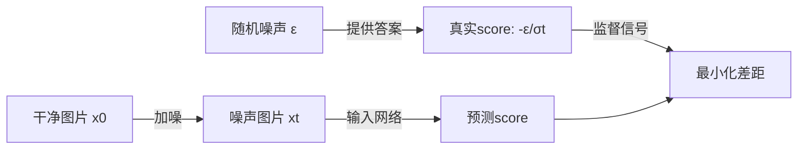

**一句话版本**：

> 教网络学会"从不同噪声级别的图片中，找到回到原图的方向"

**技术版本**：

> 利用高斯转移核的 score 解析解作为监督信号，通过去噪评分匹配训练神经网络估计时变边缘分布的 score function

---

## 5. 采样 — 从噪声回到图片的三种路径

训练完成后，我们有了 score network $\mathbf{s}_\theta(\mathbf{x}, t) \approx \nabla_{\mathbf{x}}\log p_t(\mathbf{x})$。现在需要用它生成新样本。

### 5.1 三种采样方法的核心思想

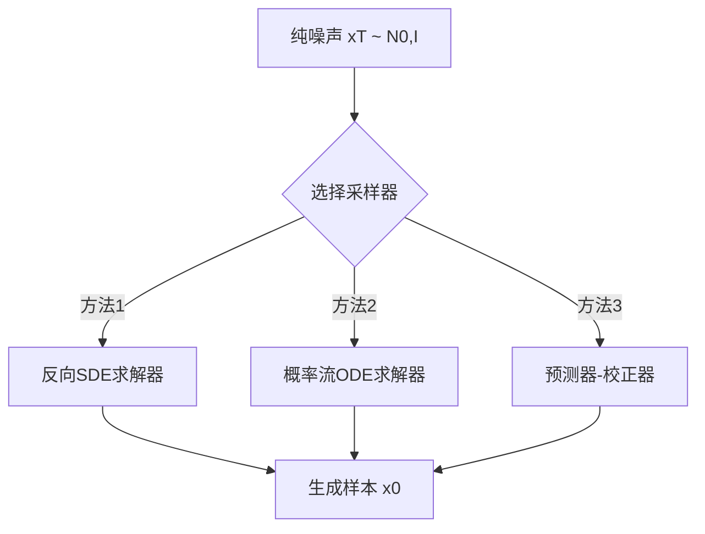

### 5.2 方法一：反向 SDE 数值求解

#### **反向 SDE 公式（Anderson 1982）**

$$d\mathbf{x} = [\mathbf{f}(\mathbf{x},t) - g(t)^2\nabla_{\mathbf{x}}\log p_t(\mathbf{x})]dt + g(t)d\bar{\mathbf{w}}$$

其中 $d\bar{\mathbf{w}}$ 是**反向时间的布朗运动**。

#### **Euler-Maruyama 离散化**

时间从 $T$ 到 $0$ 分成 $N$ 步，步长 $\Delta t = T/N$：

$$\mathbf{x}_{i-1} = \mathbf{x}_i + [\mathbf{f}(\mathbf{x}_i, t_i) - g(t_i)^2\mathbf{s}_\theta(\mathbf{x}_i, t_i)]\Delta t + g(t_i)\sqrt{\Delta t}\mathbf{z}_i$$

其中 $\mathbf{z}_i \sim \mathcal{N}(0, \mathbf{I})$。

#### **实际代码**

```python
def reverse_sde_sampler(score_network, num_steps=1000):
    # 初始化：纯噪声
    x = torch.randn(batch_size, *data_shape)

    dt = T / num_steps
    for i in range(num_steps):
        t = T - i * dt

        # 计算 SDE 系数
        drift = compute_drift(x, t)  # f(x,t)
        diffusion = compute_diffusion(t)  # g(t)

        # 预测 score
        score = score_network(x, t)

        # Euler-Maruyama 更新
        x = x + (drift - diffusion**2 * score) * dt
        x = x + diffusion * sqrt(dt) * torch.randn_like(x)

    return x
```

**优点**：

- 简单直接，对应 SDE 定义
- 理论保证收敛到 $p_0$

**缺点**：

- 需要大量步数（通常 1000 步）
- 每步都要采样随机噪声

### 5.3 方法二：概率流 ODE

#### **ODE 形式的推导**

Song 等人证明，存在一个**确定性 ODE**：

$$d\mathbf{x} = \left[\mathbf{f}(\mathbf{x},t) - \frac{1}{2}g(t)^2\nabla_{\mathbf{x}}\log p_t(\mathbf{x})\right]dt$$

与原 SDE 有**相同的边缘分布** $p_t(\mathbf{x})$，但轨迹是确定的（没有布朗运动项）。

#### **为什么 ODE 和 SDE 边缘分布相同？**

这来自于 **Fokker-Planck 方程**的性质。SDE 的边缘分布演化由 Fokker-Planck 方程描述：

$$\frac{\partial p_t}{\partial t} = -\nabla \cdot (\mathbf{f}p_t) + \frac{1}{2}g^2\nabla^2 p_t$$

ODE 的边缘演化由连续性方程描述：

$$\frac{\partial p_t}{\partial t} = -\nabla \cdot (\mathbf{v}p_t)$$

当 $\mathbf{v} = \mathbf{f} - \frac{1}{2}g^2\nabla\log p_t$ 时，两者等价！

> 更详细的推导参考：[Fokker-Planck推导-从SDE到ODE](从SDE到ODE.md)

#### **ODE 采样的实现**

```python
def probability_flow_ode_sampler(score_network, solver='dopri5'):
    x = torch.randn(batch_size, *data_shape)

    def ode_func(t, x):
        drift = compute_drift(x, t)
        diffusion = compute_diffusion(t)
        score = score_network(x, t)

        # ODE 右边项
        return drift - 0.5 * diffusion**2 * score

    # 使用黑盒 ODE 求解器（如 scipy 的 odeint）
    t_span = torch.linspace(T, 0, 2)
    solution = odeint(ode_func, x, t_span, method=solver)

    return solution[-1]  # 返回 t=0 的结果
```

**优点**：

- ✅ 确定性轨迹，可重现
- ✅ 可用高阶 ODE 求解器（RK45, dopri5），**步数可低至 100**
- ✅ 可精确计算似然（通过连续归一化流）

**缺点**：

- ❌ 生成质量略低于 SDE（缺少随机性的探索）

#### **精确似然计算**

ODE 形式允许通过**瞬时变量变换公式**计算精确似然：

$$\log p_0(\mathbf{x}(0)) = \log p_T(\mathbf{x}(T)) - \int_0^T \nabla \cdot \mathbf{v}(\mathbf{x}(t), t)dt$$

这是 ODE 采样相比 SDE 采样的重要优势：SDE 的随机轨迹只能近似估计似然，而 ODE 的确定性轨迹可以精确计算。精确似然支持模型的定量评估（bits-per-dimension）、异常检测、数据压缩等应用。

### 5.4 方法三：预测器-校正器（PC）采样器

这是 Song 等人提出的**混合方法**，结合了 SDE 预测器和 MCMC 校正器。

#### **背景：Langevin 动力学与 MCMC**

**马尔可夫链蒙特卡洛（MCMC）** 是一类通过构造马尔可夫链来采样目标分布的方法。**Langevin 动力学（朗之万动力学）**是其中一种，利用分布的梯度（score）进行采样。

给定目标分布 $p(\mathbf{x})$，朗之万动力学的迭代公式为：

$$\mathbf{x}_{k+1} = \mathbf{x}_k + \epsilon \nabla_{\mathbf{x}} \log p(\mathbf{x}_k) + \sqrt{2\epsilon} \mathbf{z}_k, \quad \mathbf{z}_k \sim \mathcal{N}(0, I)$$

其中 $\epsilon$ 是步长。

**直觉理解**：

- **梯度项** $\epsilon \nabla \log p$：推动样本向高概率区域移动
- **噪声项** $\sqrt{2\epsilon} \mathbf{z}$：引入随机性，探索分布空间
- **理论保证**：当步长 $\epsilon \to 0$，迭代次数 $\to \infty$ 时，样本分布收敛到 $p(\mathbf{x})$

**关键性质**：朗之万动力学只需要知道 **score** $\nabla \log p(\mathbf{x})$，不需要归一化常数——这正是 score-based models 的优势。

#### **算法流程**

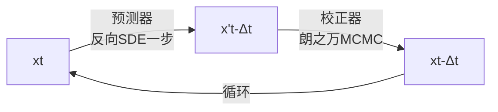

#### **两步操作的详解**

**1. 预测器（Predictor）**：用反向 SDE 走一步

$$\mathbf{x}'_{i-1} = \mathbf{x}_i + [\mathbf{f}(\mathbf{x}_i, t_i) - g(t_i)^2\mathbf{s}_\theta(\mathbf{x}_i, t_i)]\Delta t + g(t_i)\sqrt{\Delta t}\mathbf{z}_i$$

这一步可能有**累积误差**（score 估计不完美）。

**2. 校正器（Corrector）**：用朗之万 MCMC 微调

朗之万动力学是从分布 $p_t(\mathbf{x})$ 采样的 MCMC 方法：

$$\mathbf{x}_{k+1} = \mathbf{x}_k + \epsilon\mathbf{s}_\theta(\mathbf{x}_k, t) + \sqrt{2\epsilon}\mathbf{z}_k$$

重复 $M$ 步（如 $M=5$），让 $\mathbf{x}$ 更接近真实的 $p_{t-\Delta t}(\mathbf{x})$。

#### **完整伪代码**

```python
def pc_sampler(score_network, num_steps=1000, num_corrector_steps=5):
    x = torch.randn(batch_size, *data_shape)
    dt = T / num_steps

    for i in range(num_steps):
        t = T - i * dt

        # === 预测器步骤 ===
        drift = compute_drift(x, t)
        diffusion = compute_diffusion(t)
        score = score_network(x, t)

        x = x + (drift - diffusion**2 * score) * dt
        x = x + diffusion * sqrt(dt) * torch.randn_like(x)

        # === 校正器步骤（朗之万 MCMC）===
        epsilon = 2e-5  # 步长
        for _ in range(num_corrector_steps):
            score = score_network(x, t - dt)
            x = x + epsilon * score + sqrt(2 * epsilon) * torch.randn_like(x)

    return x
```

#### **为什么校正器有效？**

预测器步骤可能让 $\mathbf{x}$ 偏离真实分布，校正器通过 MCMC 将其"拉回"。类似于：

- **预测器**：大步向前走（快但可能偏）
- **校正器**：局部调整（慢但准确）

### 5.5 三种方法的性能对比

#### **CIFAR-10 实验结果（表 1）**

**评价指标说明**：

- **FID（Fréchet Inception Distance）**：衡量生成图像与真实图像分布的距离，**越低越好**，是生成质量的主要指标
- **采样器类型**：
    - **P（Predictor-only）**：仅使用预测步骤的采样器（对应 ODE 或 SDE）
    - **C（Corrector-only）**：仅使用校正步骤（Langevin MCMC）
    - **PC（Predictor-Corrector）**：结合两者的混合采样器
- **NFE**：数字表示函数评估次数（如 P1000 = 1000 次评估）

**关键结果**（表1 VE-SDE 列）：

| 采样器     | FID ↓           | NFE  |
| :----------: | :---------------: | :----: |
| P1000      | 4.98 ± 0.06     | 1000 |
| P2000      | 4.88 ± 0.06     | 2000 |
| C2000      | 20.43 ± 0.07    | 2000 |
| **PC1000** | **3.62 ± 0.03** | 2000 |

**关键结论**：

1. **PC 采样器显著优于单独使用 P 或 C**：FID 从 4.88（P2000）降到 3.62（PC1000）
2. **Corrector 单独使用效果很差**（FID 20.43），必须与 Predictor 结合
3. **Probability Flow ODE**（表中 probability flow 行）：FID 15.41（P1000）→ 10.54（P2000）→ **3.51（PC1000）**
4. **VP-SDE（DDPM）表现更好**：PC1000 达到 FID 3.21，接近 VE-SDE 的 3.62

**实际意义**：

- 追求质量：使用 **PC 采样器**（VE-SDE: 3.62, VP-SDE: 3.21）
- 追求速度：使用 **Probability Flow ODE + PC**（2000 步达到 FID 3.51）

### 5.6 采样方法的选择指南

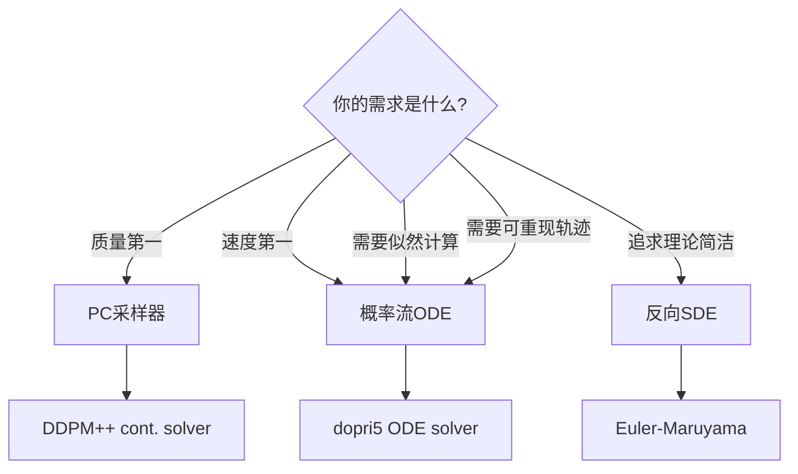

---

## 6. 概率流 ODE 的优势

在第 5 章我们看到，反向 SDE 和概率流 ODE 都能从噪声生成样本。虽然两者有相同的边缘分布 $p_t(\mathbf{x})$，但它们的**路径特性**截然不同，这带来了不同的应用场景。

### 6.1 ODE vs SDE：三个关键区别

#### **1. 确定性 vs 随机性**

**反向 SDE**：

$$d\mathbf{x} = [\mathbf{f}(\mathbf{x},t) - g(t)^2\nabla_{\mathbf{x}}\log p_t(\mathbf{x})]dt + g(t)d\bar{\mathbf{w}}$$

布朗运动项 $g(t)d\bar{\mathbf{w}}$ 使每次采样产生**不同的轨迹**。

**概率流 ODE**：

$$d\mathbf{x} = \left[\mathbf{f}(\mathbf{x},t) - \frac{1}{2}g(t)^2\nabla_{\mathbf{x}}\log p_t(\mathbf{x})\right]dt$$

没有随机项，**完全确定**：相同的初始噪声 $\mathbf{x}_T$ 总是生成相同的样本 $\mathbf{x}_0$。

**影响**：

- **SDE**：随机性帮助探索分布，生成质量通常更好
- **ODE**：确定性便于调试、复现实验、控制生成过程

#### **2. 可逆性：编码与解码**

ODE 的确定性带来了**完美的双向性**：

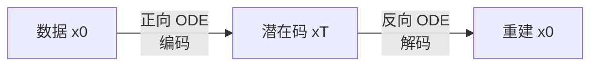

**正向 ODE**（编码）：

$$d\mathbf{x} = \left[\mathbf{f}(\mathbf{x},t) + \frac{1}{2}g(t)^2\nabla_{\mathbf{x}}\log p_t(\mathbf{x})\right]dt$$

从真实数据 $\mathbf{x}_0$ 积分到潜在码 $\mathbf{x}_T$。

**反向 ODE**（解码）：

$$d\mathbf{x} = \left[\mathbf{f}(\mathbf{x},t) - \frac{1}{2}g(t)^2\nabla_{\mathbf{x}}\log p_t(\mathbf{x})\right]dt$$

从潜在码 $\mathbf{x}_T$ 积分回数据 $\mathbf{x}_0$。

**关键性质**：$\text{decode}(\text{encode}(\mathbf{x}_0)) = \mathbf{x}_0$（理论上完美重建）

**应用**：

ODE 的可逆性使得我们可以对真实图片进行编码和操作：

- **图像重建**：编码真实图片到 $\mathbf{x}_T$，再解码回来，验证 $\text{decode}(\text{encode}(\mathbf{x}_0)) \approx \mathbf{x}_0$
- **潜在空间插值**：编码两张图片得到 $\mathbf{x}_T^{(1)}, \mathbf{x}_T^{(2)}$，插值 $\alpha \mathbf{x}_T^{(1)} + (1-\alpha)\mathbf{x}_T^{(2)}$，然后解码生成中间图像
- **语义编辑**：在潜在空间 $\mathbf{x}_T$ 上添加方向向量，实现图像属性的连续调整

这些操作的关键是 **ODE 的确定性保证了编码和解码的一致性**，这是 SDE 无法做到的。

#### **3. 精确似然计算**

ODE 的确定性使其可以通过**连续归一化流（Continuous Normalizing Flow, CNF）** 公式精确计算数据的对数似然。

对于 ODE $d\mathbf{x}/dt = \mathbf{v}(\mathbf{x}, t)$，瞬时变量变换公式给出：

$$\log p_0(\mathbf{x}_0) = \log p_T(\mathbf{x}_T) - \int_0^T \nabla \cdot \mathbf{v}(\mathbf{x}(t), t) \, dt$$

其中：

- $p_T$ 是已知的先验（如 $\mathcal{N}(0, \mathbf{I})$）
- 散度 $\nabla \cdot \mathbf{v}$ 可通过 Hutchinson's trace estimator 高效估计

**实验结果**（Song 论文表 2）：

通过概率流 ODE，可以计算模型对测试数据的**负对数似然（Negative Log-Likelihood, NLL）**，这是衡量生成模型拟合数据分布好坏的直接指标。

**bits/dim 含义**：平均每个像素维度需要多少比特来编码，**数值越低表示模型对数据的压缩效率越高，即拟合越好**。

| 模型                          | CIFAR-10 NLL (bits/dim) |
| :----------------------------: | :-----------------------: |
| DDPM                          | 3.75                    |
| 原始 VP-SDE                   | 3.04                    |
| **sub-VP SDE + DDPM++ cont.** | **2.99**                |

**结果意义**：

- sub-VP SDE 达到了 **2.99 bits/dim**，是当时 likelihood-based 生成模型的最优结果
- 相比 DDPM 提升了 **20%**（从 3.75 降到 2.99）
- 证明了 Score-based SDE 框架不仅生成质量高（FID 低），似然评估也优秀

**应用**：

- **模型评估**：用精确似然代替 FID、Inception Score 等间接指标
- **异常检测**：低似然样本可能是异常数据
- **模型选择**：比较不同 SDE 配置的拟合效果

### 6.2 应用场景对比

| 场景                      | 推荐方法         | 原因                                   |
| :-------------------------: | :----------------: | :--------------------------------------: |
| **追求最高生成质量**      | SDE + PC 采样器  | 随机性探索分布，生成更多样化的样本     |
| **需要可重现性**          | ODE              | 确定性轨迹，便于调试和实验复现         |
| **潜在空间操作**          | ODE              | 可逆性保证精确的编码/解码              |
| **计算精确似然**          | ODE              | 唯一能用 CNF 公式的方法                |
| **快速采样**              | ODE + 高阶求解器 | Heun/RK45 等方法比 SDE 的 Euler 更高效 |
| **大规模生成（生产环境)** | ODE              | 确定性和可控性更适合实际部署           |
| **研究新架构/训练方法**   | SDE              | 生成质量是验证模型有效性的主要指标     |

**实践建议**：

1. **训练阶段**：用 SDE 的 denoising score matching 损失训练，训练好的 score network 可以同时用于 SDE 和 ODE 采样

2. **采样阶段**：根据应用需求选择
    - **ODE**：默认选择，平衡质量、速度、可控性
    - **SDE**：需要顶尖生成质量时使用
    - **PC 采样器**：两者结合，用 ODE 预测 + SDE 校正

3. **调试技巧**：
    - 先用 ODE 采样验证模型是否正确（确定性便于排查问题）
    - 确认无误后切换到 SDE 或 PC 采样器追求更高质量

**代码示例**：同一个 score network，切换采样方法

```python
# 训练好的 score network
score_model = load_trained_model()

# 方法 1: ODE 采样（确定性，可用高阶求解器）
samples_ode = ode_sampler(score_model, solver='dopri5')

# 方法 2: SDE 采样（随机性，生成质量更好）
samples_sde = sde_sampler(score_model)

# 方法 3: PC 采样器（混合策略）
samples_pc = pc_sampler(score_model, predictor='ode', corrector='langevin')
```

---

## 7. 可控生成 — 让扩散模型听从指令

### 7.1 从"随机生成"到"按要求生成"

前面几节解决了一个问题：如何从纯噪声生成一张**随机**的真实图像。

但实际应用中我们需要的是：**生成一张猫**、**补全这张破损的照片**、**把这张模糊的图变清晰**。

这类问题有一个统一的数学名字叫**逆问题**：

> 我已经知道一些关于目标图像的**观测信息** $y$，如何生成一张**既像真实图像、又符合观测**的 $\mathbf{x}$？

几个具体例子：

| 任务       | 观测 $y$       | $\mathbf{x}$ 是什么 |
| :----------: | :--------------: | :-------------------: |
| 类条件生成 | 类别标签"猫"   | 一张猫的图片        |
| 图像修复   | 已知的部分像素 | 补全后的完整图片    |
| 超分辨率   | 低分辨率图     | 高分辨率图          |
| 去模糊     | 模糊图         | 清晰图              |

### 7.2 关键洞察：只需要改一个地方

回忆第5节，反向扩散的核心公式（Anderson 反向 SDE）是：

$$d\mathbf{x} = \left[\mathbf{f}(\mathbf{x},t) - g(t)^2 \cdot \underbrace{\nabla_{\mathbf{x}}\log p_t(\mathbf{x})}_{\text{这里是 score}}\right]dt + g(t)d\bar{\mathbf{w}}$$

整个生成过程的"方向感"完全由 score $\nabla_{\mathbf{x}}\log p_t(\mathbf{x})$ 决定——它告诉噪声图像"往哪个方向走，才能更像真实数据"。

第4节训练的神经网络 $s_\theta(\mathbf{x},t)$ 就是在学这个 score。

**现在的问题是**：原来的 score 只追求"像真实图像"，不管约束条件 $y$。能不能改造这个 score，让它同时追求两件事？

$$\text{新 score} = \text{"像真实图像"} + \text{"满足约束 }y\text{"}$$

答案是：**可以，而且数学上非常干净。**

### 7.3 贝叶斯公式给出答案

我们想要的是**条件 score**：在已知 $y$ 的情况下，$\mathbf{x}(t)$ 应该往哪走？

$$\nabla_{\mathbf{x}}\log p_t(\mathbf{x}|y) = \;?$$

用贝叶斯公式展开 $p_t(\mathbf{x}|y)$：

$$p_t(\mathbf{x}|y) = \frac{p_t(\mathbf{x}) \cdot p(y|\mathbf{x})}{p(y)}$$

取对数：

$$\log p_t(\mathbf{x}|y) = \log p_t(\mathbf{x}) + \log p(y|\mathbf{x}) - \underbrace{\log p(y)}_{\text{与 }\mathbf{x}\text{ 无关，求梯度后消失}}$$

对 $\mathbf{x}$ 求梯度：

$$\boxed{\nabla_{\mathbf{x}}\log p_t(\mathbf{x}|y) = \underbrace{\nabla_{\mathbf{x}}\log p_t(\mathbf{x})}_{\text{第①项：无条件 score}} + \underbrace{\nabla_{\mathbf{x}}\log p(y|\mathbf{x})}_{\text{第②项：似然梯度}}}$$

这个分解的意义非常深刻：

- **第①项**：已经由第4节训练好的神经网络 $s_\theta(\mathbf{x},t)$ 提供，**完全不需要重新训练**
- **第②项**：只依赖于"$\mathbf{x}$ 满足约束 $y$ 的程度"，**针对不同任务单独设计**，不涉及神经网络

所以整个条件反向 SDE 变成：

$$d\mathbf{x} = \left[\mathbf{f} - g^2\Big(\underbrace{s_\theta(\mathbf{x},t)}_{\text{不动}} + \underbrace{\nabla_{\mathbf{x}}\log p(y|\mathbf{x})}_{\text{换这里}}\Big)\right]dt + g\,d\bar{\mathbf{w}}$$

**这就是"更换零件"的含义**：神经网络主体不动，只在每一步采样时额外加一个"纠偏力"，把轨迹往满足约束 $y$ 的方向推。

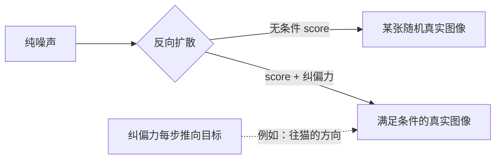

### 7.4 三个任务的"纠偏力"长什么样

#### 任务一：类条件生成（生成指定类别）

**目标**：生成一张"猫"

**观测** $y$：类别标签

**问题**：$\nabla_{\mathbf{x}}\log p(y|\mathbf{x})$ 是什么意思？

直觉上就是：**把当前噪声图像 $\mathbf{x}$ 往"让分类器更确信它是猫"的像素方向移动**。

做法是额外训练一个能处理噪声图像的分类器 $p_\phi(y|\mathbf{x},t)$：

$$\nabla_{\mathbf{x}}\log p(y|\mathbf{x}) \approx \nabla_{\mathbf{x}}\log p_\phi(y|\mathbf{x},t)$$

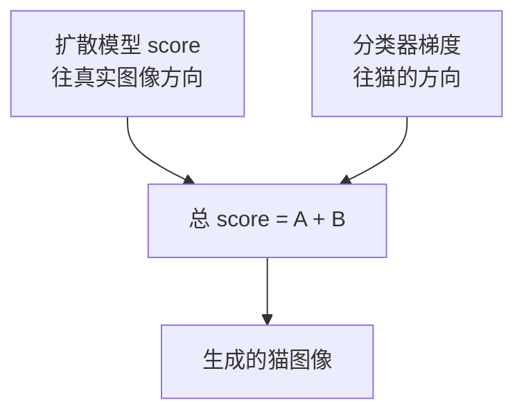

**关键优势**：分类器和扩散模型完全独立训练，想换类别只需换分类器，不碰扩散模型。

#### 任务二：图像修复（补全破损图片）

**目标**：已知图像中部分区域的像素值（$y$ = 已知像素，$M$ = mask），补全缺失区域

**"纠偏力"的直觉**：在每步采样中，**强制已知区域保持正确的像素值**，只让缺失区域自由变化。

具体有两种强度：

**硬约束**（严格版）：每步直接把已知区域的像素替换回正确值

$$\mathbf{x}_{\text{已知区域}} \leftarrow y_{\text{已知区域}}$$

**软约束**（宽松版）：用高斯似然衡量"偏离已知像素有多远"，梯度为：

$$\nabla_{\mathbf{x}}\log p(y|\mathbf{x}) = -\frac{M \odot (\mathbf{x} - y)}{\sigma_y^2}$$

含义：当前像素偏离已知值越远，纠偏力就越大，把它往正确值方向推。$\sigma_y^2$ 控制约束松紧程度。

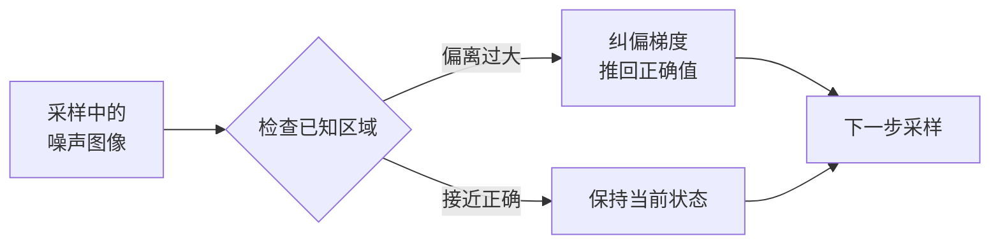

#### 任务三：超分辨率（低分辨率 → 高分辨率）

**目标**：已知低分辨率图 $y$（由高分辨率图降采样得到），恢复高分辨率图 $\mathbf{x}$

**降采样算子** $\mathcal{A}$：把高分辨率图缩小（比如 4×4 平均池化变成 1 个像素）

**"纠偏力"的直觉**：把当前估计的高分辨率图 $\mathbf{x}$ 先降采样，看它和观测 $y$ 差多少，再把这个差异的梯度传回高分辨率像素。

$$\nabla_{\mathbf{x}}\log p(y|\mathbf{x}) = -\frac{\mathcal{A}^\top(\mathcal{A}(\mathbf{x}) - y)}{\sigma_y^2}$$

$\mathcal{A}^\top$ 是降采样的转置操作（即上采样/插值），负责把低分辨率的误差信号"广播"回高分辨率空间。

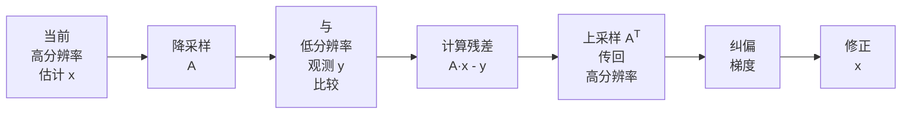

用人话说就是：每步生成时，顺便检查一下"把我降采样后和你给的低清图差多少"，如果差太多就往减小差距的方向调整。

### 7.5 为什么这个设计如此强大

传统方法：**每个任务单独训练一个模型**

Score-SDE 方法：**一个扩散模型 + 针对不同任务设计的似然项**

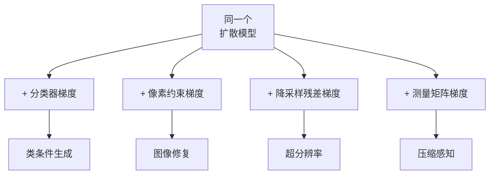

这里有一个更深的含义：**扩散模型本质上学到了图像的通用先验知识**（什么样的图像是真实的），而每个任务只是在采样时加入不同的约束。这与贝叶斯推理的哲学完全一致：

$$\underbrace{p(\mathbf{x}|y)}_{\text{后验：满足条件的图像}} \propto \underbrace{p(\mathbf{x})}_{\text{先验：扩散模型}} \cdot \underbrace{p(y|\mathbf{x})}_{\text{似然：任务约束}}$$

### 7.6 实验结果

#### CIFAR-10 类条件生成（表 3）

| 方法                                  | FID ↓    | Inception Score ↑ |
| :------------------------------------: | :------: | :-----------------: |
| BigGAN                                | 14.73    | 9.22              |
| StyleGAN2-ADA (conditional)           | **2.42** | **10.14**         |
| DDPM                                  | 3.17     | 9.46              |
| **Score-SDE (NCSN++ cont. deep, VE)** | **2.20** | **9.89**          |

> Score-SDE 的条件生成（2.20 FID）接近专门为条件生成优化的 StyleGAN2-ADA（2.42 FID），且远超传统 GAN 方法。

#### CelebA-HQ 图像修复

论文展示了两类修复任务：中心矩形遮挡（常见的"去水印"场景）和随机像素 mask。与传统 TV 正则化方法相比，Score-SDE 生成的补全结果在视觉上更自然，因为扩散模型的先验包含了丰富的图像结构知识（毛发、肤色、光影），而 TV 正则化只知道"相邻像素应该平滑"。

### 7.7 引导强度：控制"听话程度"

可以给似然项加一个权重 $\lambda$ 来控制条件约束的强弱：

$$\nabla_{\mathbf{x}}\log p_t(\mathbf{x}|y) = \nabla_{\mathbf{x}}\log p_t(\mathbf{x}) + \lambda \cdot \nabla_{\mathbf{x}}\log p(y|\mathbf{x})$$

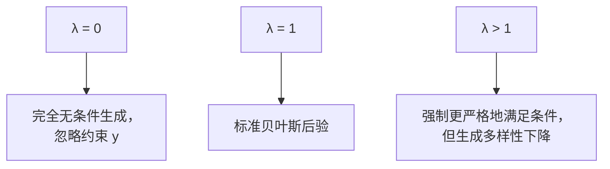

这个思路后来被 OpenAI 发展成了**Classifier Guidance**，再后来演变成今天广泛使用的 **Classifier-Free Guidance（CFG）**——Stable Diffusion 中的"提示词强度"本质上就是这里的 $\lambda$。

---

## 8. 总结：从理论到应用的完整图景

### 8.1 三层架构：一次训练，多种用途

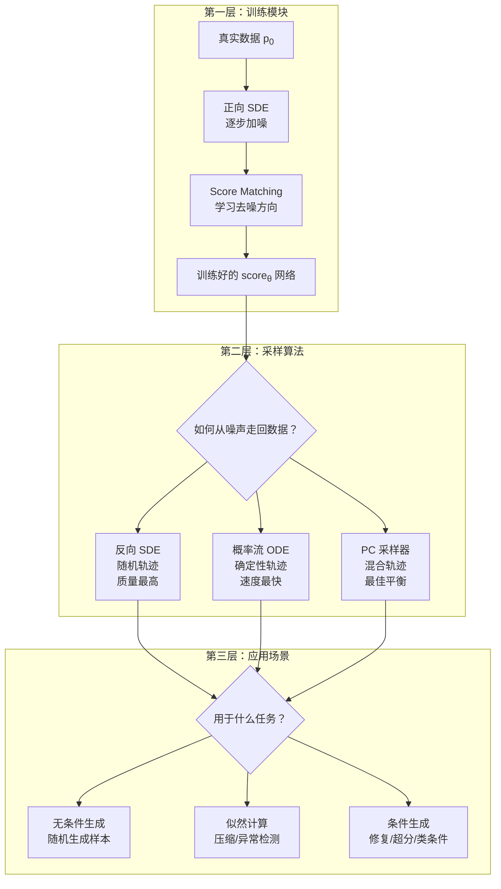

**关键理解**：

- **第一层训练一次，终身受用** — score 网络是通用的"数据先验"
- **第二层是"How"** — 三种数值求解方法，大部分场景可自由选择
- **第三层是"What"** — 三种应用场景，只有似然计算必须用 ODE

### 8.2 核心模块拆解

#### **模块1：训练 score 网络（第4节）**

**目标**：学习一个神经网络 $s_\theta(\mathbf{x}, t)$，对任意时刻 $t$ 的噪声数据预测"往真实数据走"的梯度

**训练损失**：

$$\min_\theta \mathbb{E}_{t, \mathbf{x}(0), \mathbf{x}(t)}\left[\lambda(t)\left\|s_\theta(\mathbf{x}(t), t) + \frac{\boldsymbol{\epsilon}}{\sigma(t)}\right\|^2\right]$$

**关键技巧**：选择高斯转移核 → 真实 score 有解析解 $-\boldsymbol{\epsilon}/\sigma(t)$，等价于训练去噪网络

**结果**：得到一个通用的"梯度场"，可用于所有后续任务，**无需重新训练**

#### **模块2：采样方法（第5节）**

**任务**：从纯噪声 $\mathbf{x}(T) \sim \mathcal{N}(0, \mathbf{I})$ 走回真实数据 $\mathbf{x}(0)$

**三种方法对比**：

| 方法          | 数学形式                                                             | 轨迹性质 | 优势                  | 劣势       | 典型步长 |
| :-------------: | :-------------------------------------------------------------------: | :------: | :-------------------: | :---------: | :------: |
| **反向SDE**   | $d\mathbf{x} = [\mathbf{f} - g^2 s_\theta]dt + g\,d\bar{\mathbf{w}}$ | 随机     | 理论完备<br>质量最高 | 需要小步长 | ~1000    |
| **概率流ODE** | $d\mathbf{x} = [\mathbf{f} - \frac{1}{2}g^2 s_\theta]dt$             | 确定性   | 快速<br>可算似然     | 质量略低   | ~50-100  |
| **PC采样器**  | Predictor + Corrector                                                | 混合     | 质量速度平衡          | 实现复杂   | ~100-200 |

**选择指南**：

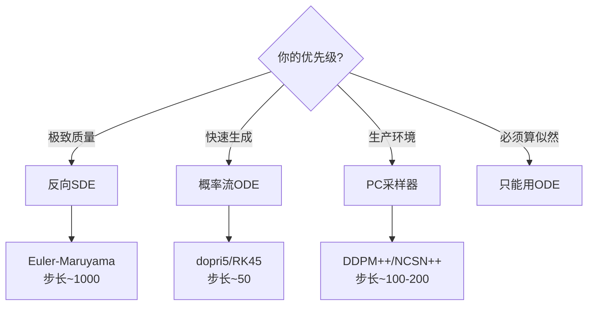

**重要**：这三种是**数值求解技巧**，不是三个不同任务。就像解微分方程可以用欧拉法、龙格-库塔法或预测-校正法。

#### **模块3：应用场景（第6、7节）**

##### **场景1：无条件生成**

直接用 score 网络采样，生成随机样本。

- **公式**：反向 SDE 或概率流 ODE
- **采样方法**：SDE / ODE / PC 任选
- **应用**：艺术创作、数据增强

##### **场景2：精确似然计算**

通过 ODE 的 divergence 积分计算 $\log p_0(\mathbf{x})$。

$$\log p_0(\mathbf{x}(0)) = \log p_T(\mathbf{x}(T)) + \int_0^T \left[-\frac{1}{2}\text{Tr}\left(\nabla_{\mathbf{x}}s_\theta\right)\right]dt$$

- **公式**：概率流 ODE + 数值积分
- **采样方法**：**只能用 ODE**（随机性会破坏似然计算）
- **应用**：压缩、异常检测、模型评估

##### **场景3：条件生成 / 逆问题**

通过贝叶斯公式修改 score，加入"纠偏力"。

$$\nabla_{\mathbf{x}}\log p_t(\mathbf{x}|y) = \underbrace{s_\theta(\mathbf{x}, t)}_{\text{无条件}} + \underbrace{\lambda \cdot \nabla_{\mathbf{x}}\log p(y|\mathbf{x})}_{\text{条件约束}}$$

**典型应用**：

| 任务       | 观测 $y$   | 似然梯度       | 直觉                       |
| :----------: | :----------: | :--------------: | :-------------------------: |
| 类条件生成 | 类别标签   | 分类器梯度     | "往更像猫的方向走"         |
| 图像修复   | 已知像素   | 像素约束梯度   | "已知区域偏离就拉回来"     |
| 超分辨率   | 低分辨率图 | 降采样残差梯度 | "确保降采样后和低清图一致" |

- **优势**：神经网络完全不变，只在采样时加入约束
- **采样方法**：条件 SDE / 条件 ODE / 条件 PC 任选
- **控制强度**：$\lambda = 0$ 无条件，$\lambda = 1$ 标准后验，$\lambda > 1$ 强制满足条件

### 8.3 实验亮点

#### **CIFAR-10 性能突破**

| 模型                       | FID ↓    | Inception Score ↑ |
| :-------------------------: | :------: | :-----------------: |
| BigGAN                     | 14.73    | 9.22              |
| StyleGAN2-ADA              | 2.42     | 10.14             |
| DDPM                       | 3.17     | 9.46              |
| **本文 (NCSN++ deep, VE)** | **2.20** | **9.89**          |

**意义**：Score-based 模型首次在生成质量上接近 GAN，且理论更完备。

#### **高分辨率生成**

- **首次**从 score-based 模型生成 **1024×1024** 高保真人脸（CelebA-HQ）
- 使用 VE-SDE，适合高分辨率数据
- 证明方法可扩展到实际应用

#### **似然计算与压缩**

- 在 CIFAR-10 上达到 **2.99 bits/dim**（当时最优）
- 证明概率流 ODE 可以精确计算似然
- 为后续的扩散模型用于压缩和评估奠定基础

### 8.4 为什么这是一篇里程碑论文？

#### **三大理论贡献**

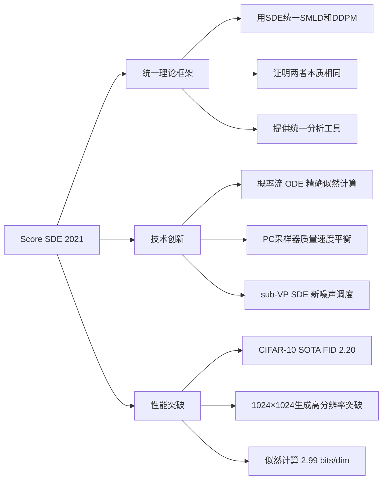

#### **对后续工作的影响**

这篇论文建立了现代扩散模型的**数学基础设施**，几乎所有后续工作都在此框架内改进：

| 后续工作               | 年份  | 改进方向                          | 基于本文哪个模块  |
| :----------------------: | :----: | :--------------------------------: | :-----------------: |
| **DPM-Solver**         | 2022  | 更快的 ODE 求解器，10步达到高质量 | 概率流 ODE        |
| **EDM**                | 2022  | 优化噪声调度和预处理              | SDE 框架 + sub-VP |
| **Stable Diffusion**   | 2022  | 潜空间扩散 + 文生图               | 整体框架          |
| **Consistency Models** | 2023  | 单步生成                          | 概率流 ODE        |
| **扩散到其他模态**     | 2022- | 音频、3D、视频、蛋白质            | SDE 框架          |

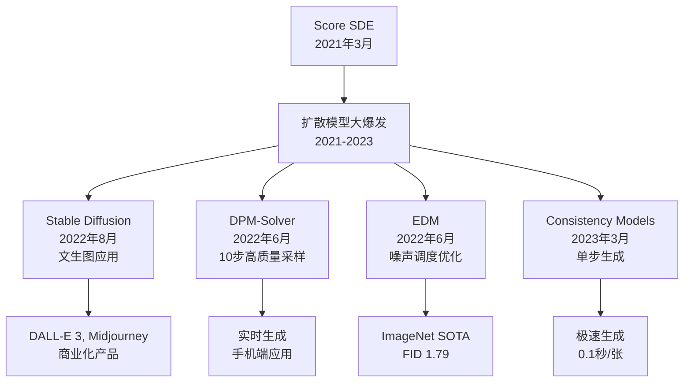

#### **核心遗产**

**1. 提供了统一的数学语言**

- 所有扩散模型现在都用 SDE/ODE 框架描述
- 使得不同方法可以公平比较和组合

**2. 证明了扩散模型的理论优势**

- 精确似然计算（GAN 做不到）
- 灵活的条件生成（无需重新训练）
- 可控的生成过程（通过调整 SDE 参数）

**3. 开启了生成式 AI 的黄金时代**

- Stable Diffusion 的理论基础
- 使得扩散模型从学术研究走向大规模应用
- 奠定了 2023 年生成式 AI 爆发的技术基础

### 8.5 关键要点速查表

| 问题         | 答案                                                        |
| :------------: | :---------------------------------------------------------: |
| **训练目标** | 学习 score $\nabla\log p_t(\mathbf{x})$，等价于训练去噪网络 |
| **正向过程** | VP-SDE / VE-SDE / sub-VP SDE 逐步加噪                       |
| **反向过程** | 用 score 网络指引，从噪声走回数据                           |
| **采样方法** | SDE（质量）/ ODE（速度+似然）/ PC（平衡）                   |
| **最快采样** | 概率流 ODE + 高阶求解器，~50步                              |
| **最高质量** | PC 采样器（Predictor-Corrector），~200步                    |
| **似然计算** | 只能用概率流 ODE + divergence 积分                          |
| **条件生成** | score + 似然梯度，无需重新训练                              |
| **核心创新** | 用 SDE 统一了 SMLD 和 DDPM                                  |
| **主要影响** | 为 Stable Diffusion 等现代扩散模型奠定理论基础              |

**总结**：这篇论文不仅统一了之前零散的方法，还提供了一套完整的工具箱（训练、采样、应用），使得扩散模型从"炼金术"变成"工程学"，是现代生成式 AI 的理论基石。
