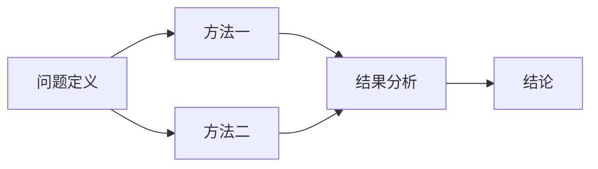

# 论文标题的简洁中文总结

该模板已上传至[📁资源下载库](http://expfluid.bond/files)（编辑时请删除此行）

> **上传者**：[课题组同学的全名或笔名]  
> **论文标题**：[Compressed sensing](https://ieeexplore.ieee.org/abstract/document/1614066)  
> **论文PDF**：[paper.pdf](paper.pdf)  
> **阅读时间**：2026-1-1

***请在论文标题（`Compressed sensing`）处链接到论文网站的 URL***

***请将论文原文命名为 `paper.pdf`，并放在md文件的同级目录下（`template` 文件夹中）***

---

## 支持的内容表现形式（本标题为二级标题）

### 不同的标题级别（本标题为三级标题）

- 一级标题：`# [标题标题]`
- 二级标题：`## [标题标题]`
- 三级标题：`### [标题标题]`
- 四级标题：`#### [标题标题]`
- 五级标题：`##### [标题标题]`

#### 不同的富文本展现方式（本标题为四级标题）

*斜体文本*表示强调内容

**加粗文本**表示重点内容

***加粗斜体文本***表示特别强调

> 引用文本
>
> 可以多行引用

1. **有序列表**：按照数字顺序排列
    - 子项目1
    - 子项目2
2. **有序列表**：继续编号
    - 子项目3

**分隔线**：

---

- **无序列表**：使用符号标记
    - 二级项目
    - 另一个二级项目
- **无序列表**：新的顶级项目

### 可以嵌入 `mermaid` 图表



### 可以嵌入代码

```python
# 示例代码（可选）
# 可以放置论文中的关键算法或复现代码
import numpy as np

def core_algorithm(input_data):
    """
    论文核心算法实现
    """
    result = np.mean(input_data)
    return result
```

### 可以嵌入公式

使用$\LaTeX$格式，这里是行内公式示例$E = mc^2$，下面是行间公式：

$$f(x) = \int_{-\infty}^{\infty} e^{-x^2} dx$$

### 可以嵌入表格

|    方法    |  指标1   |  指标2   |  指标3   |
| :--------: | :------: | :------: | :------: |
|   方法A    |   85.3   |   92.1   |   88.7   |
|   方法B    |   87.2   |   89.5   |   91.3   |
| **本方法** | **91.5** | **95.2** | **93.8** |

### 可以嵌入图片

插入图片示例：


<center>图片嵌入示例</center>

### 可以嵌入网站链接

[形象易懂讲解算法II——压缩感知 - 知乎](https://zhuanlan.zhihu.com/p/22445302)

---

## 模板说明

- 本模板支持`Markdown`基本语法，包括标题、列表、引用、链接等
- 支持嵌入图片、代码块、`LaTeX`公式、表格等多种内容
- 支持`Mermaid`图表进行流程图、序列图等可视化展示
- 可根据需要自定义文献阅读报告的内容结构和格式
