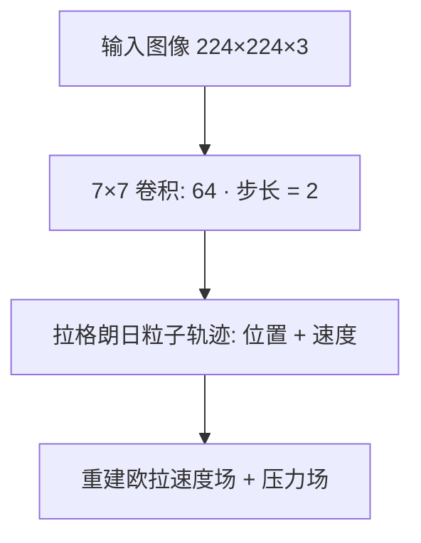
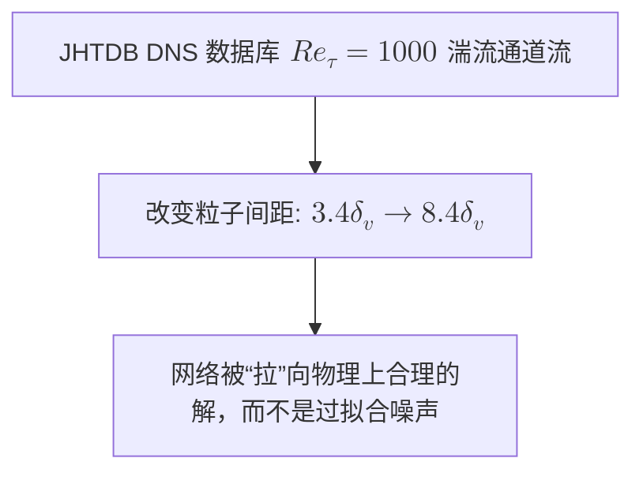

### `md`和`ipynb`配套教程编写提示词

#### 从零撰写一篇教程

帮我写一个**XXX**的教程，直接输出内容就行，整个教程需要知道循序渐进，所有公式都用 `$` 符号包裹的 latex 格式公式（注意区分行内公式和块公式，行内公式用 `$` 符号包裹，块公式用 `$$` 符号包裹）；优先用 mermaid 绘图（支持），mermaid 禁止使用 style 指令（以保证风格统一）；如果有论文或链接，需要嵌入对应的来链接；

可以包含重要代码，但是代码量要少，不要完整代码，完整代码后续我们再编写配套的 ipynb 可执行文件，你现在输出的只是教程，要多用富文本，可以嵌入图片（我后续会找合适的图片）

理解性内容不需要 ipynb 文件作为辅助，所以 markdown 内容中的代码需要完整，但是不需要过于细致，说明文字放在 markdown 正文中，重点在于帮助入门人员理解原理

我们的内容已经非常完善了，请你根据我们的 md 教程写一个对应的可执行文件，你就按照正常状态输出即可，ipynb 中有 markdown 块和代码块，都要用“`”包裹，代码块用“`python”包裹，md 块用“```markdown”包裹。请你注意，我们编写的 ipynb 主要是代码而非文字，所以 md 内容一定要尽量少。另外，ipynb 中的代码必须与教程中提到的代码一一对应，代码要细致，但是不能冗杂，把需要说明的问题说明白即可，不要输出过多的内容。matplotlib 绘图内部文字全部使用英文，但是 markdown 和 print() 的内容都需要用中文，matplotlib 绘图结果禁止 savefig 保存图片。最后请注意，我们的服务器上并没有 GPU，所以你要考虑运行速度不能过长了

输出到这里中断了，请你继续输出，请合理安排内容量，在说清楚问题的前提下不要过于庞杂

#### 重构公众号文章

请你帮我格式化，必须满足要求：
1、公式：全部用latex公式
2、符号：代码中的符号用英文符号，正文中的符号（包括但不限于逗号、句号、引号、冒号）用**中文符号**
3、对原文字的变更许可：可以有自己的发挥（如改变一些逻辑和语言），但是重点在于让人看明白
4、如果文章没有总标题，需要补充一个一级总标题

### 论文总结/完善提示词

#### 用于进行完整框架搭建

这是一个论文的速读总结，但是我需要根据更精细地阅读论文，请你根据论文总结和我发送给你的论文，将论文中的核心内容的细节解释清楚（让一个入门人员也能理解），优先支持 mermaid 绘图，但是 mermaid 禁止使用 style 指令（以保证风格统一），但不要过度使用 mermaid，要多多引用论文中的图/表/公式/等

#### 用于进行部分内容完善

将这部分内容根据论文内容重新撰写，与给出内容的格式不能有太大差异（标题级别相同，分条方式相似），将核心内容的细节解释清楚（让一个入门人员也能理解），优先支持 mermaid 绘图，但是 mermaid 禁止使用 style 指令（以保证风格统一），但**不要过度使用mermaid**（如果认为没必要用mermaid就不要用mermaid！），可以引用论文中的图/表/公式/等。但是内容量不要过大，我们只是补充这些不完整的内容（绝不是随意填充，而是基于给出的问题进行补充），**绝对不是重新写一篇摘要**

#### 将内容写为完整框架作为附录

将这部分内容根据论文内容重新撰写（写一个完整的框架），但是**不要又写一遍背景**，重点在于把这些内容更细致地解释清除（让一个入门人员也能理解）。优先支持 mermaid 绘图，但是 mermaid 禁止使用 style 指令（以保证风格统一），但**不要过度使用mermaid**（如果认为没必要用mermaid就不要用mermaid！），可以引用论文中的图/表/公式/等。

### `Mermaid` 流程图排版提示词

#### `nowrap` 样式类

请帮我修改一个 Mermaid 流程图，使其在垂直方向上极度紧凑、字号最大化清晰显示。请去除所有的换行，示例中的 classDef 不能有任何改变。

示例：



待修改的 Mermaid 图：

#### 数学公式嵌入 Mermaid 提示词

请帮我编写/修改一个 Mermaid 流程图，使用纯文本（非latex语言）和 html 的上下标等语法，使其能在 mermaid.live 官方编辑器中完美渲染数学公式。

示例：



待修改的 Mermaid 图：

